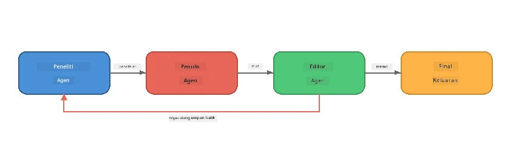
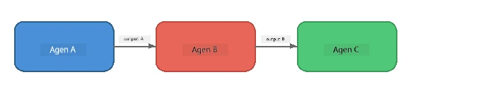
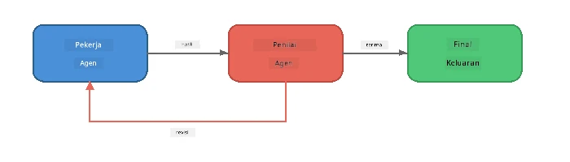
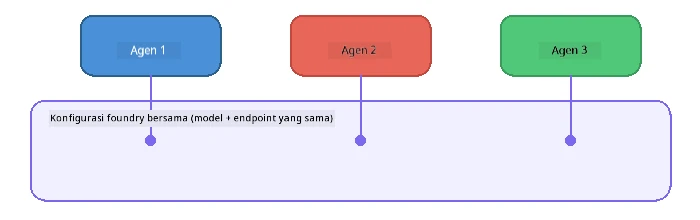

# Bagian 6: Alur Kerja Multi-Agen

> **Tujuan:** Menggabungkan beberapa agen khusus menjadi saluran terkoordinasi yang membagi tugas kompleks di antara agen yang berkolaborasi - semuanya berjalan secara lokal dengan Foundry Local.

## Mengapa Multi-Agen?

Satu agen dapat menangani banyak tugas, tetapi alur kerja yang kompleks mendapatkan manfaat dari **Spesialisasi**. Alih-alih satu agen mencoba meneliti, menulis, dan mengedit secara bersamaan, Anda memecah pekerjaan menjadi peran terfokus:



| Pola | Deskripsi |
|---------|-------------|
| **Berurutan** | Output dari Agen A mengalir ke Agen B → Agen C |
| **Loop umpan balik** | Agen penilai dapat mengirim pekerjaan kembali untuk revisi |
| **Konteks bersama** | Semua agen menggunakan model/endpoint yang sama, tetapi instruksi berbeda |
| **Output bertipe** | Agen menghasilkan hasil terstruktur (JSON) untuk penyerahan yang dapat diandalkan |

---

## Latihan

### Latihan 1 - Jalankan Saluran Multi-Agen

Workshop ini mencakup alur kerja lengkap Researcher → Writer → Editor.

<details>
<summary><strong>🐍 Python</strong></summary>

**Pengaturan:**
```bash
cd python
python -m venv venv

# Windows (PowerShell):
venv\Scripts\Activate.ps1
# macOS:
source venv/bin/activate

pip install -r requirements.txt
```

**Jalankan:**
```bash
python foundry-local-multi-agent.py
```

**Apa yang terjadi:**
1. **Researcher** menerima topik dan mengembalikan fakta dalam poin-poin
2. **Writer** mengambil hasil riset dan menyusun postingan blog (3-4 paragraf)
3. **Editor** meninjau artikel untuk kualitas dan mengembalikan ACCEPT atau REVISE

</details>

<details>
<summary><strong>📦 JavaScript</strong></summary>

**Pengaturan:**
```bash
cd javascript
npm install
```

**Jalankan:**
```bash
node foundry-local-multi-agent.mjs
```

**Saluran tiga tahap yang sama** - Researcher → Writer → Editor.

</details>

<details>
<summary><strong>💜 C#</strong></summary>

**Pengaturan:**
```bash
cd csharp
dotnet restore
```

**Jalankan:**
```bash
dotnet run multi
```

**Saluran tiga tahap yang sama** - Researcher → Writer → Editor.

</details>

---

### Latihan 2 - Anatomi Saluran

Pelajari bagaimana agen didefinisikan dan dihubungkan:

**1. Klien model bersama**

Semua agen berbagi model Foundry Local yang sama:

```python
# Python - FoundryLocalClient menangani semuanya
from agent_framework_foundry_local import FoundryLocalClient

client = FoundryLocalClient(model_id="phi-3.5-mini")
```

```javascript
// JavaScript - OpenAI SDK diarahkan ke Foundry Lokal
const client = new OpenAI({
  baseURL: manager.urls[0] + "/v1",
  apiKey: "foundry-local",
});
```

```csharp
// C# - OpenAIClient pointed at Foundry Local
var key = new ApiKeyCredential("foundry-local");
var client = new OpenAIClient(key, new OpenAIClientOptions
{
    Endpoint = new Uri(manager.Urls[0] + "/v1")
});
var chatClient = client.GetChatClient(model.Id);
```

**2. instruksi khusus**

Setiap agen memiliki persona yang berbeda:

| Agen | Instruksi (ringkasan) |
|-------|----------------------|
| Researcher | "Berikan fakta utama, statistik, dan latar belakang. Atur dalam poin-poin." |
| Writer | "Tulis postingan blog yang menarik (3-4 paragraf) berdasarkan catatan riset. Jangan buat fakta." |
| Editor | "Tinjau untuk kejelasan, tata bahasa, dan konsistensi fakta. Putusan: ACCEPT atau REVISE." |

**3. Aliran data di antara agen**

```python
# Langkah 1 - keluaran dari peneliti menjadi masukan untuk penulis
research_result = await researcher.run(f"Research: {topic}")

# Langkah 2 - keluaran dari penulis menjadi masukan untuk editor
writer_result = await writer.run(f"Write using:\n{research_result}")

# Langkah 3 - editor meninjau baik riset maupun artikel
editor_result = await editor.run(
    f"Research:\n{research_result}\n\nArticle:\n{writer_result}"
)
```

```csharp
// C# - same pattern, async calls with AIAgent
var researchNotes = await researcher.RunAsync(
    $"Research the following topic and provide key facts:\n{topic}");

var draft = await writer.RunAsync(
    $"Write a blog post based on these research notes:\n\n{researchNotes}");

var verdict = await editor.RunAsync(
    $"Review this article for quality and accuracy.\n\n" +
    $"Research notes:\n{researchNotes}\n\n" +
    $"Article:\n{draft}");
```

> **Intisari utama:** Setiap agen menerima konteks kumulatif dari agen sebelumnya. Editor melihat riset asli dan draft - ini memungkinkan memeriksa konsistensi fakta.

---

### Latihan 3 - Tambah Agen Keempat

Perluas saluran dengan menambahkan agen baru. Pilih salah satu:

| Agen | Tujuan | Instruksi |
|-------|---------|-------------|
| **Fact-Checker** | Verifikasi klaim dalam artikel | `"Anda memverifikasi klaim faktual. Untuk setiap klaim, nyatakan apakah didukung oleh catatan riset. Kembalikan JSON dengan item terverifikasi/tidak."` |
| **Headline Writer** | Membuat judul yang menarik | `"Buat 5 opsi judul untuk artikel. Variasikan gaya: informatif, clickbait, pertanyaan, listikel, emosional."` |
| **Social Media** | Membuat posting promosi | `"Buat 3 posting media sosial untuk mempromosikan artikel ini: satu untuk Twitter (280 karakter), satu untuk LinkedIn (nada profesional), satu untuk Instagram (santai dengan saran emoji)."` |

<details>
<summary><strong>🐍 Python - menambah Headline Writer</strong></summary>

```python
headline_agent = client.as_agent(
    name="HeadlineWriter",
    instructions=(
        "You are a headline specialist. Given an article, generate exactly "
        "5 headline options. Vary the style: informative, question-based, "
        "listicle, emotional, and provocative. Return them as a numbered list."
    ),
)

# Setelah editor menerima, hasilkan judul berita
headline_result = await headline_agent.run(
    f"Generate headlines for this article:\n\n{writer_result}"
)
print(f"\n--- Headlines ---\n{headline_result}")
```

</details>

<details>
<summary><strong>📦 JavaScript - menambah Headline Writer</strong></summary>

```javascript
const headlineAgent = new ChatAgent({
  client,
  modelId: modelInfo.id,
  instructions:
    "You are a headline specialist. Given an article, generate exactly " +
    "5 headline options. Vary the style: informative, question-based, " +
    "listicle, emotional, and provocative. Return them as a numbered list.",
  name: "HeadlineWriter",
});

const headlineResult = await headlineAgent.run(
  `Generate headlines for this article:\n\n${writerResult.text}`
);
console.log(`\n--- Headlines ---\n${headlineResult.text}`);
```

</details>

<details>
<summary><strong>💜 C# - menambah Headline Writer</strong></summary>

```csharp
AIAgent headlineAgent = chatClient.AsAIAgent(
    name: "HeadlineWriter",
    instructions:
        "You are a headline specialist. Given an article, generate exactly " +
        "5 headline options. Vary the style: informative, question-based, " +
        "listicle, emotional, and provocative. Return them as a numbered list."
);

// After the editor accepts, generate headlines
var headlines = await headlineAgent.RunAsync(
    $"Generate headlines for this article:\n\n{draft}");
Console.WriteLine($"\n--- Headlines ---\n{headlines}");
```

</details>

---

### Latihan 4 - Rancang Alur Kerja Anda Sendiri

Rancang saluran multi-agen untuk domain yang berbeda. Berikut beberapa ide:

| Domain | Agen | Alur |
|--------|--------|------|
| **Review Kode** | Analyser → Reviewer → Summariser | Analisa struktur kode → tinjau masalah → buat laporan ringkasan |
| **Dukungan Pelanggan** | Classifier → Responder → QA | Klasifikasi tiket → draft jawaban → cek kualitas |
| **Pendidikan** | Pembuat Kuis → Simulasi Siswa → Penilai | Buat kuis → simulasikan jawaban → nilai dan jelaskan |
| **Analisis Data** | Interpreter → Analyst → Reporter | Interpretasi permintaan data → analisa pola → tulis laporan |

**Langkah-langkah:**
1. Definisikan 3+ agen dengan `instruksi` yang berbeda
2. Tentukan aliran data - apa yang diterima dan dihasilkan setiap agen?
3. Implementasikan saluran menggunakan pola dari Latihan 1-3
4. Tambahkan loop umpan balik jika satu agen perlu mengevaluasi kerja agen lain

---

## Pola Orkestrasi

Berikut pola orkestrasi yang berlaku untuk sistem multi-agen apa pun (dijelaskan lebih dalam di [Bagian 7](part7-zava-creative-writer.md)):

### Saluran Berurutan



Setiap agen memproses output agen sebelumnya. Sederhana dan dapat diprediksi.

### Loop Umpan Balik



Agen evaluator dapat memicu eksekusi ulang tahap sebelumnya. Zava Writer menggunakan ini: editor dapat mengirim umpan balik kembali ke researcher dan writer.

### Konteks Bersama



Semua agen berbagi satu `foundry_config` sehingga menggunakan model dan endpoint yang sama.

---

## Intisari Penting

| Konsep | Apa yang Anda Pelajari |
|---------|-----------------|
| Spesialisasi Agen | Setiap agen melakukan satu hal dengan instruksi fokus |
| Penyerahan Data | Output dari satu agen menjadi input untuk agen berikutnya |
| Loop Umpan Balik | Evaluator dapat memicu pengulangan untuk kualitas lebih tinggi |
| Output Terstruktur | Respons berbentuk JSON memungkinkan komunikasi agen-ke-agen yang andal |
| Orkestrasi | Koordinator mengatur urutan saluran dan penanganan kesalahan |
| Pola Produksi | Diterapkan di [Bagian 7: Zava Creative Writer](part7-zava-creative-writer.md) |

---

## Langkah Selanjutnya

Lanjutkan ke [Bagian 7: Zava Creative Writer - Aplikasi Capstone](part7-zava-creative-writer.md) untuk mengeksplorasi aplikasi multi-agen bergaya produksi dengan 4 agen khusus, output streaming, pencarian produk, dan loop umpan balik - tersedia dalam Python, JavaScript, dan C#.