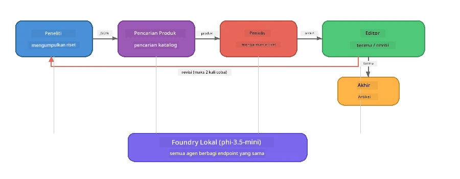

# Bagian 7: Penulis Kreatif Zava - Aplikasi Puncak

> **Tujuan:** Mengeksplorasi aplikasi multi-agen gaya produksi di mana empat agen khusus berkolaborasi untuk menghasilkan artikel berkualitas majalah untuk Zava Retail DIY - berjalan sepenuhnya di perangkat Anda dengan Foundry Local.

Ini adalah **laboratorium puncak** dari lokakarya. Ini menggabungkan semua yang telah Anda pelajari - integrasi SDK (Bagian 3), pengambilan data dari data lokal (Bagian 4), persona agen (Bagian 5), dan orkestrasi multi-agen (Bagian 6) - menjadi aplikasi lengkap yang tersedia dalam **Python**, **JavaScript**, dan **C#**.

---

## Apa yang Akan Anda Eksplorasi

| Konsep | Di Mana di Zava Writer |
|---------|----------------------------|
| Pemuatan model 4 langkah | Modul konfigurasi bersama memulai Foundry Local |
| Pengambilan gaya RAG | Agen produk mencari katalog lokal |
| Spesialisasi Agen | 4 agen dengan prompt sistem yang berbeda |
| Output streaming | Penulis menghasilkan token secara real-time |
| Penyerahan terstruktur | Peneliti → JSON, Editor → keputusan JSON |
| Loop umpan balik | Editor dapat memicu eksekusi ulang (maks 2 kali percobaan) |

---

## Arsitektur

Zava Creative Writer menggunakan **pipeline berurutan dengan umpan balik yang digerakkan evaluator**. Ketiga implementasi bahasa mengikuti arsitektur yang sama:



### Empat Agen

| Agen | Masukan | Keluaran | Tujuan |
|-------|-------|--------|---------|
| **Peneliti** | Topik + umpan balik opsional | `{"web": [{url, name, description}, ...]}` | Mengumpulkan riset latar belakang melalui LLM |
| **Pencarian Produk** | String konteks produk | Daftar produk yang cocok | Query yang dibuat oleh LLM + pencarian kata kunci terhadap katalog lokal |
| **Penulis** | Riset + produk + tugas + umpan balik | Teks artikel yang streaming (dipisah pada `---`) | Membuat draf artikel berkualitas majalah secara real time |
| **Editor** | Artikel + umpan balik penulis | `{"decision": "accept/revise", "editorFeedback": "...", "researchFeedback": "..."}` | Meninjau kualitas, memicu percobaan ulang jika diperlukan |

### Alur Pipeline

1. **Peneliti** menerima topik dan menghasilkan catatan riset terstruktur (JSON)
2. **Pencarian Produk** mencari katalog produk lokal menggunakan istilah pencarian yang dibuat oleh LLM
3. **Penulis** menggabungkan riset + produk + tugas menjadi artikel streaming, menambahkan umpan balik diri setelah pemisah `---`
4. **Editor** meninjau artikel dan mengembalikan putusan JSON:
   - `"accept"` → pipeline selesai
   - `"revise"` → umpan balik dikirim kembali ke Peneliti dan Penulis (maks 2 kali percobaan)

---

## Prasyarat

- Selesaikan [Bagian 6: Alur Kerja Multi-Agen](part6-multi-agent-workflows.md)
- Foundry Local CLI terpasang dan model `phi-3.5-mini` sudah diunduh

---

## Latihan

### Latihan 1 - Jalankan Penulis Kreatif Zava

Pilih bahasa Anda dan jalankan aplikasinya:

<details>
<summary><strong>🐍 Python - Layanan Web FastAPI</strong></summary>

Versi Python berjalan sebagai **layanan web** dengan REST API, mendemonstrasikan cara membangun backend produksi.

**Pengaturan:**
```bash
cd zava-creative-writer-local/src/api
python -m venv venv

# Windows (PowerShell):
venv\Scripts\Activate.ps1
# macOS:
source venv/bin/activate

pip install -r requirements.txt
```

**Jalankan:**
```bash
uvicorn main:app --reload
```

**Uji:**
```bash
curl -X POST http://localhost:8000/api/article \
  -H "Content-Type: application/json" \
  -d '{
    "research": "DIY home improvement trends",
    "products": "power tools and paints",
    "assignment": "Write an article about weekend renovation projects for DIY enthusiasts"
  }'
```

Respons mengalir kembali sebagai pesan JSON yang dipisah baris baru yang menunjukkan kemajuan setiap agen.

</details>

<details>
<summary><strong>📦 JavaScript - CLI Node.js</strong></summary>

Versi JavaScript berjalan sebagai **aplikasi CLI**, mencetak kemajuan agen dan artikel langsung ke konsol.

**Pengaturan:**
```bash
cd zava-creative-writer-local/src/javascript
npm install
```

**Jalankan:**
```bash
node main.mjs
```

Anda akan melihat:
1. Foundry Local memuat model (dengan bar kemajuan jika mengunduh)
2. Setiap agen dieksekusi secara berurutan dengan pesan status
3. Artikel streaming ke konsol secara real time
4. Keputusan terima/revisi dari editor

</details>

<details>
<summary><strong>💜 C# - Aplikasi Konsol .NET</strong></summary>

Versi C# berjalan sebagai **aplikasi konsol .NET** dengan pipeline dan output streaming yang sama.

**Pengaturan:**
```bash
cd zava-creative-writer-local/src/csharp
dotnet restore
```

**Jalankan:**
```bash
dotnet run
```

Pola output sama seperti versi JavaScript - pesan status agen, artikel streaming, dan putusan editor.

</details>

---

### Latihan 2 - Pelajari Struktur Kode

Setiap implementasi bahasa memiliki komponen logis yang sama. Bandingkan strukturnya:

**Python** (`src/api/`):
| Berkas | Tujuan |
|------|---------|
| `foundry_config.py` | Manajer Foundry Local bersama, model, dan klien (inisialisasi 4 langkah) |
| `orchestrator.py` | Koordinasi pipeline dengan loop umpan balik |
| `main.py` | Endpoint FastAPI (`POST /api/article`) |
| `agents/researcher/researcher.py` | Riset berbasis LLM dengan keluaran JSON |
| `agents/product/product.py` | Query yang dibuat oleh LLM + pencarian kata kunci |
| `agents/writer/writer.py` | Pembuatan artikel streaming |
| `agents/editor/editor.py` | Keputusan terima/revisi berbasis JSON |

**JavaScript** (`src/javascript/`):
| Berkas | Tujuan |
|------|---------|
| `foundryConfig.mjs` | Konfigurasi Foundry Local bersama (inisialisasi 4 langkah dengan bar kemajuan) |
| `main.mjs` | Orchestrator + titik masuk CLI |
| `researcher.mjs` | Agen riset berbasis LLM |
| `product.mjs` | Pembuatan query LLM + pencarian kata kunci |
| `writer.mjs` | Pembuatan artikel streaming (generator async) |
| `editor.mjs` | Keputusan terima/revisi JSON |
| `products.mjs` | Data katalog produk |

**C#** (`src/csharp/`):
| Berkas | Tujuan |
|------|---------|
| `Program.cs` | Pipeline lengkap: pemuatan model, agen, orchestrator, loop umpan balik |
| `ZavaCreativeWriter.csproj` | Proyek .NET 9 dengan paket Foundry Local + OpenAI |

> **Catatan desain:** Python memisahkan setiap agen ke dalam berkas/direktori sendiri (baik untuk tim besar). JavaScript menggunakan satu modul per agen (baik untuk proyek sedang). C# menyimpan semuanya dalam satu berkas dengan fungsi lokal (baik untuk contoh mandiri). Dalam produksi, pilih pola yang sesuai konvensi tim Anda.

---

### Latihan 3 - Telusuri Konfigurasi Bersama

Setiap agen dalam pipeline berbagi satu klien model Foundry Local tunggal. Pelajari cara ini disiapkan di setiap bahasa:

<details>
<summary><strong>🐍 Python - foundry_config.py</strong></summary>

```python
from foundry_local import FoundryLocalManager

MODEL_ALIAS = "phi-3.5-mini"

# Langkah 1: Buat manajer dan mulai layanan Foundry Local
manager = FoundryLocalManager()
manager.start_service()

# Langkah 2: Periksa apakah model sudah diunduh
cached = manager.list_cached_models()
catalog_info = manager.get_model_info(MODEL_ALIAS)
is_cached = any(m.id == catalog_info.id for m in cached) if catalog_info else False

if not is_cached:
    manager.download_model(MODEL_ALIAS)

# Langkah 3: Muat model ke dalam memori
manager.load_model(MODEL_ALIAS)
model_id = manager.get_model_info(MODEL_ALIAS).id

# Klien OpenAI bersama
client = openai.OpenAI(base_url=manager.endpoint, api_key=manager.api_key)
```

Semua agen mengimpor `from foundry_config import client, model_id`.

</details>

<details>
<summary><strong>📦 JavaScript - foundryConfig.mjs</strong></summary>

```javascript
import { FoundryLocalManager } from "foundry-local-sdk";
import { OpenAI } from "openai";

FoundryLocalManager.create({ appName: "ZavaCreativeWriter" });
const manager = FoundryLocalManager.instance;
await manager.startWebService();

// Periksa cache → unduh → muat (pola SDK baru)
const catalog = manager.catalog;
const model = await catalog.getModel(MODEL_ALIAS);
if (!model.isCached) {
  console.log(`Downloading model: ${MODEL_ALIAS}...`);
  await model.download();
}
await model.load();

const client = new OpenAI({ baseURL: manager.urls[0] + "/v1", apiKey: "foundry-local" });
const modelId = model.id;
export { client, modelId };
```

Semua agen mengimpor `{ client, modelId } from "./foundryConfig.mjs"`.

</details>

<details>
<summary><strong>💜 C# - bagian atas Program.cs</strong></summary>

```csharp
await FoundryLocalManager.CreateAsync(
    new Configuration
    {
        AppName = "ZavaCreativeWriter",
        Web = new Configuration.WebService { Urls = "http://127.0.0.1:0" }
    }, NullLogger.Instance, default);
var manager = FoundryLocalManager.Instance;
await manager.StartWebServiceAsync(default);

var catalog = await manager.GetCatalogAsync(default);
var catalogModel = await catalog.GetModelAsync(alias, default);
var isCached = await catalogModel.IsCachedAsync(default);
if (!isCached)
    await catalogModel.DownloadAsync(null, default);

await catalogModel.LoadAsync(default);
var key = new ApiKeyCredential("foundry-local");
var chatClient = new OpenAIClient(key, new OpenAIClientOptions
{
    Endpoint = new Uri(manager.Urls[0] + "/v1")
}).GetChatClient(catalogModel.Id);
```

`chatClient` kemudian diteruskan ke semua fungsi agen dalam berkas yang sama.

</details>

> **Pola kunci:** Pola pemuatan model (mulai layanan → cek cache → unduh → muat) memastikan pengguna melihat kemajuan dengan jelas dan model hanya diunduh sekali. Ini adalah praktik terbaik untuk aplikasi Foundry Local apa pun.

---

### Latihan 4 - Pahami Loop Umpan Balik

Loop umpan balik adalah yang membuat pipeline ini "cerdas" - Editor dapat mengirimkan pekerjaan kembali untuk revisi. Telusuri logikanya:

```
Orchestrator:
  1. researcher.research(topic, "No Feedback")    ← first pass
  2. product.findProducts(productContext)
  3. writer.write(research, products, assignment)  ← streams article
  4. Split article at "---" → article + writerFeedback
  5. editor.edit(article, writerFeedback)

  WHILE editor says "revise" AND retryCount < 2:
    6. researcher.research(topic, editor.researchFeedback)  ← refined
    7. writer.write(research, products, editor.editorFeedback)
    8. editor.edit(newArticle, newWriterFeedback)
    9. retryCount++
```

**Pertanyaan untuk dipertimbangkan:**
- Mengapa batas retry diatur ke 2? Apa yang terjadi jika Anda meningkatkannya?
- Mengapa peneliti mendapatkan `researchFeedback` tapi penulis mendapatkan `editorFeedback`?
- Apa yang terjadi jika editor selalu berkata "revise"?

---

### Latihan 5 - Modifikasi Agen

Cobalah mengubah perilaku salah satu agen dan amati bagaimana hal itu mempengaruhi pipeline:

| Modifikasi | Apa yang diubah |
|-------------|----------------|
| **Editor lebih ketat** | Ubah prompt sistem editor agar selalu meminta setidaknya satu revisi |
| **Artikel lebih panjang** | Ubah prompt penulis dari "800-1000 kata" menjadi "1500-2000 kata" |
| **Produk berbeda** | Tambah atau ubah produk dalam katalog produk |
| **Topik riset baru** | Ubah `researchContext` default ke subjek berbeda |
| **Peneliti hanya JSON** | Buat peneliti mengembalikan 10 item bukan 3-5 |

> **Tip:** Karena ketiga bahasa mengimplementasikan arsitektur yang sama, Anda bisa membuat modifikasi yang sama di bahasa yang paling Anda kuasai.

---

### Latihan 6 - Tambah Agen Kelima

Perluas pipeline dengan agen baru. Beberapa ide:

| Agen | Di Mana dalam pipeline | Tujuan |
|-------|-------------------|---------|
| **Pemeriksa Fakta** | Setelah Penulis, sebelum Editor | Verifikasi klaim terhadap data riset |
| **Pengoptimal SEO** | Setelah editor menerima | Tambah deskripsi meta, kata kunci, slug |
| **Ilustrator** | Setelah editor menerima | Buat prompt gambar untuk artikel |
| **Penerjemah** | Setelah editor menerima | Terjemahkan artikel ke bahasa lain |

**Langkah-langkah:**
1. Tulis prompt sistem agen
2. Buat fungsi agen (sesuai pola yang ada dalam bahasa Anda)
3. Sisipkan di orchestrator pada titik tepat
4. Perbarui output/logging untuk menunjukkan kontribusi agen baru

---

## Cara Foundry Local dan Kerangka Agen Bekerja Bersama

Aplikasi ini mendemonstrasikan pola yang direkomendasikan untuk membangun sistem multi-agen dengan Foundry Local:

| Lapisan | Komponen | Peran |
|-------|-----------|------|
| **Runtime** | Foundry Local | Mengunduh, mengelola, dan menyajikan model secara lokal |
| **Klien** | OpenAI SDK | Mengirim chat completion ke endpoint lokal |
| **Agen** | Prompt sistem + panggilan chat | Perilaku khusus melalui instruksi terfokus |
| **Orchestrator** | Koordinator pipeline | Mengelola aliran data, penjadwalan, dan loop umpan balik |
| **Kerangka** | Microsoft Agent Framework | Menyediakan abstraksi dan pola `ChatAgent` |

Inti pemahaman: **Foundry Local menggantikan backend cloud, bukan arsitektur aplikasi.** Pola agen yang sama, strategi orkestrasi, dan penyerahan terstruktur yang bekerja dengan model cloud juga bekerja sama persis dengan model lokal — Anda hanya mengarahkan klien ke endpoint lokal, bukan endpoint Azure.

---

## Poin Penting

| Konsep | Apa yang Anda Pelajari |
|---------|-----------------|
| Arsitektur produksi | Cara menyusun aplikasi multi-agen dengan konfigurasi bersama dan agen terpisah |
| Pemuatan model 4 langkah | Praktik terbaik inisialisasi Foundry Local dengan kemajuan terlihat pengguna |
| Spesialisasi Agen | Masing-masing dari 4 agen memiliki instruksi fokus dan format output spesifik |
| Generasi streaming | Penulis menghasilkan token secara real time, memungkinkan UI responsif |
| Loop umpan balik | Retry yang digerakkan editor meningkatkan kualitas output tanpa intervensi manusia |
| Pola lintas bahasa | Arsitektur yang sama bekerja di Python, JavaScript, dan C# |
| Lokal = siap produksi | Foundry Local menyajikan API kompatibel OpenAI sama seperti di cloud |

---

## Langkah Selanjutnya

Lanjutkan ke [Bagian 8: Pengembangan Berbasis Evaluasi](part8-evaluation-led-development.md) untuk membangun kerangka evaluasi sistematis bagi agen Anda, menggunakan dataset emas, pengecekan berbasis aturan, dan penilaian LLM-sebagai-juri.