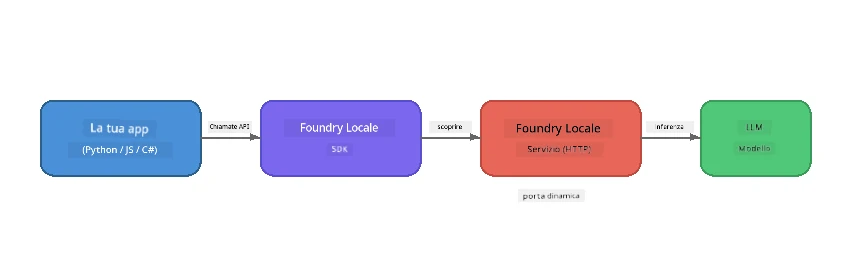

# Parte 1: Iniziare con Foundry Local


## Cos'è Foundry Local?

[Foundry Local](https://foundrylocal.ai) ti permette di eseguire modelli linguistici AI open-source **direttamente sul tuo computer** - senza bisogno di Internet, senza costi cloud, e completa privacy dei dati. Esso:

- **Scarica ed esegue modelli localmente** con ottimizzazione automatica per l'hardware (GPU, CPU, o NPU)
- **Fornisce un’API compatibile con OpenAI** così puoi usare SDK e strumenti familiari
- **Non richiede abbonamento ad Azure** o registrazioni - basta installare e iniziare a costruire

Pensalo come avere una propria AI privata che gira interamente sulla tua macchina.

## Obiettivi di Apprendimento

Alla fine di questo laboratorio sarai in grado di:

- Installare il CLI di Foundry Local sul tuo sistema operativo
- Comprendere cosa sono gli alias dei modelli e come funzionano
- Scaricare ed eseguire il tuo primo modello AI locale
- Inviare un messaggio di chat a un modello locale dalla riga di comando
- Capire la differenza tra modelli AI locali e ospitati nel cloud

---

## Prerequisiti

### Requisiti di Sistema

| Requisito | Minimo | Consigliato |
|-------------|---------|-------------|
| **RAM** | 8 GB | 16 GB |
| **Spazio Disco** | 5 GB (per i modelli) | 10 GB |
| **CPU** | 4 core | 8+ core |
| **GPU** | Opzionale | NVIDIA con CUDA 11.8+ |
| **SO** | Windows 10/11 (x64/ARM), Windows Server 2025, macOS 13+ | - |

> **Nota:** Foundry Local seleziona automaticamente la variante di modello migliore per il tuo hardware. Se hai una GPU NVIDIA, utilizza l’accelerazione CUDA. Se hai una NPU Qualcomm, la usa. Altrimenti utilizza una variante ottimizzata per CPU.

### Installare il CLI di Foundry Local

**Windows** (PowerShell):
```powershell
winget install Microsoft.FoundryLocal
```

**macOS** (Homebrew):
```bash
brew tap microsoft/foundrylocal
brew install foundrylocal
```

> **Nota:** Foundry Local supporta attualmente solo Windows e macOS. Linux non è supportato al momento.

Verifica l’installazione:
```bash
foundry --version
```

---

## Esercitazioni del laboratorio

### Esercizio 1: Esplora i Modelli Disponibili

Foundry Local include un catalogo di modelli open-source pre-ottimizzati. Elencali:

```bash
foundry model list
```

Vedrai modelli come:
- `phi-3.5-mini` - modello Microsoft da 3.8 miliardi di parametri (veloce, buona qualità)
- `phi-4-mini` - modello Phi più recente e più capace
- `phi-4-mini-reasoning` - modello Phi con ragionamento a catena di pensiero (tag `<think>`)
- `phi-4` - modello Phi più grande di Microsoft (10.4 GB)
- `qwen2.5-0.5b` - molto piccolo e veloce (ideale per dispositivi a risorse limitate)
- `qwen2.5-7b` - modello generale potente con supporto per chiamate a strumenti
- `qwen2.5-coder-7b` - ottimizzato per generazione di codice
- `deepseek-r1-7b` - modello con forte capacità di ragionamento
- `gpt-oss-20b` - grande modello open-source (licenza MIT, 12.5 GB)
- `whisper-base` - trascrizione da voce a testo (383 MB)
- `whisper-large-v3-turbo` - trascrizione ad alta accuratezza (9 GB)

> **Cos’è un alias modello?** Alias come `phi-3.5-mini` sono scorciatoie. Quando usi un alias, Foundry Local scarica automaticamente la variante migliore per il tuo hardware specifico (CUDA per GPU NVIDIA, altrimenti ottimizzata per CPU). Non devi mai preoccuparti di scegliere la variante giusta.

### Esercizio 2: Esegui il Tuo Primo Modello

Scarica ed inizia a chattare con un modello in modo interattivo:

```bash
foundry model run phi-3.5-mini
```

La prima volta che lo esegui, Foundry Local:
1. Rileva il tuo hardware
2. Scarica la variante ottimale del modello (potrebbe richiedere qualche minuto)
3. Carica il modello in memoria
4. Avvia una sessione chat interattiva

Prova a fargli alcune domande:
```
You: What is the golden ratio?
You: Can you explain it as if I were 10 years old?
You: Write a haiku about mathematics
```

Digita `exit` o premi `Ctrl+C` per uscire.

### Esercizio 3: Pre-scarica un Modello

Se vuoi scaricare un modello senza iniziare una chat:

```bash
foundry model download phi-3.5-mini
```

Controlla quali modelli sono già scaricati sulla tua macchina:

```bash
foundry cache list
```

### Esercizio 4: Comprendi l’Architettura

Foundry Local gira come un **servizio HTTP locale** che espone un’API REST compatibile con OpenAI. Questo significa:

1. Il servizio parte su una **porta dinamica** (una porta diversa ogni volta)
2. Usi l’SDK per scoprire l’URL effettivo dell’endpoint
3. Puoi usare **qualsiasi** libreria client compatibile OpenAI per interagire



> **Importante:** Foundry Local assegna una **porta dinamica** ogni volta che parte. Non codificare mai un numero di porta come `localhost:5272`. Usa sempre l’SDK per scoprire l’URL corrente (es. `manager.endpoint` in Python o `manager.urls[0]` in JavaScript).

---

## Punti Chiave

| Concetto | Cosa Hai Imparato |
|---------|------------------|
| AI su dispositivo | Foundry Local esegue modelli interamente sul tuo dispositivo senza cloud, senza chiavi API, e senza costi |
| Alias modello | Alias come `phi-3.5-mini` selezionano automaticamente la migliore variante per il tuo hardware |
| Porte dinamiche | Il servizio gira su una porta dinamica; usa sempre l’Sdk per scoprire l’endpoint |
| CLI e SDK | Puoi interagire con i modelli via CLI (`foundry model run`) o programmaticamente via SDK |

---

## Passi Successivi

Continua a [Parte 2: Approfondimento SDK di Foundry Local](part2-foundry-local-sdk.md) per padroneggiare l’API SDK per gestire modelli, servizi e caching in modo programmatico.

---

<!-- CO-OP TRANSLATOR DISCLAIMER START -->
**Disclaimer**:  
Questo documento è stato tradotto utilizzando il servizio di traduzione AI [Co-op Translator](https://github.com/Azure/co-op-translator). Sebbene ci impegniamo per l’accuratezza, si prega di notare che le traduzioni automatiche possono contenere errori o imprecisioni. Il documento originale nella sua lingua nativa deve essere considerato la fonte autorevole. Per informazioni critiche, si raccomanda una traduzione professionale umana. Non siamo responsabili per eventuali malintesi o interpretazioni errate derivanti dall’uso di questa traduzione.
<!-- CO-OP TRANSLATOR DISCLAIMER END -->