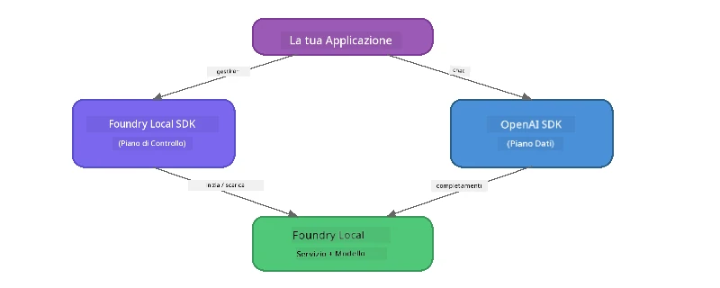

# Parte 3: Usare il Foundry Local SDK con OpenAI

## Panoramica

Nella Parte 1 hai usato la CLI di Foundry Local per eseguire modelli in modo interattivo. Nella Parte 2 hai esplorato l'intera API del SDK. Ora imparerai a **integrare Foundry Local nelle tue applicazioni** utilizzando il SDK e l'API compatibile con OpenAI.

Foundry Local fornisce SDK per tre linguaggi. Scegli quello con cui ti senti più a tuo agio - i concetti sono identici in tutti e tre.

## Obiettivi di apprendimento

Al termine di questo laboratorio sarai in grado di:

- Installare il Foundry Local SDK per il tuo linguaggio (Python, JavaScript o C#)
- Inizializzare `FoundryLocalManager` per avviare il servizio, controllare la cache, scaricare e caricare un modello
- Connetterti al modello locale utilizzando l’SDK OpenAI
- Inviare completamenti chat e gestire risposte in streaming
- Comprendere l’architettura a porte dinamiche

---

## Prerequisiti

Completa prima [Parte 1: Introduzione a Foundry Local](part1-getting-started.md) e [Parte 2: Approfondimento SDK Foundry Local](part2-foundry-local-sdk.md).

Installa **uno** dei seguenti runtime linguaggio:
- **Python 3.9+** - [python.org/downloads](https://www.python.org/downloads/)
- **Node.js 18+** - [nodejs.org](https://nodejs.org/)
- **.NET 9.0+** - [dot.net/download](https://dotnet.microsoft.com/download)

---

## Concetto: Come funziona il SDK

Il Foundry Local SDK gestisce il **control plane** (avvio del servizio, download modelli), mentre l’SDK OpenAI gestisce il **data plane** (invio prompt, ricezione completamenti).



---

## Esercizi del laboratorio

### Esercizio 1: Configura il tuo ambiente

<details>
<summary><b>🐍 Python</b></summary>

```bash
cd python
python -m venv venv

# Attivare l'ambiente virtuale:
# Windows (PowerShell):
venv\Scripts\Activate.ps1
# Windows (Prompt dei comandi):
venv\Scripts\activate.bat
# macOS:
source venv/bin/activate

pip install -r requirements.txt
```

Il `requirements.txt` installa:
- `foundry-local-sdk` - Il Foundry Local SDK (importato come `foundry_local`)
- `openai` - L’SDK OpenAI per Python
- `agent-framework` - Microsoft Agent Framework (usato nelle parti successive)

</details>

<details>
<summary><b>📘 JavaScript</b></summary>

```bash
cd javascript
npm install
```

Il `package.json` installa:
- `foundry-local-sdk` - Il Foundry Local SDK
- `openai` - L’SDK OpenAI per Node.js

</details>

<details>
<summary><b>💜 C#</b></summary>

```bash
cd csharp
dotnet restore
dotnet build
```

Il file `csharp.csproj` utilizza:
- `Microsoft.AI.Foundry.Local` - Il Foundry Local SDK (NuGet)
- `OpenAI` - L’SDK OpenAI per C# (NuGet)

> **Struttura del progetto:** Il progetto C# usa un router da riga di comando in `Program.cs` che invia ai file di esempio separati. Esegui `dotnet run chat` (o solo `dotnet run`) per questa parte. Le altre parti usano `dotnet run rag`, `dotnet run agent` e `dotnet run multi`.

</details>

---

### Esercizio 2: Completamento chat di base

Apri l’esempio base di chat per il tuo linguaggio ed esamina il codice. Ogni script segue lo stesso schema in tre fasi:

1. **Avvia il servizio** - `FoundryLocalManager` avvia il runtime Foundry Local
2. **Scarica e carica il modello** - controlla la cache, scarica se necessario, poi carica in memoria
3. **Crea un client OpenAI** - connettiti al endpoint locale e invia un completamento chat in streaming

<details>
<summary><b>🐍 Python - <code>python/foundry-local.py</code></b></summary>

```python
import sys
import openai
from foundry_local import FoundryLocalManager

alias = "phi-3.5-mini"

# Passo 1: Crea un FoundryLocalManager e avvia il servizio
print("Starting Foundry Local service...")
manager = FoundryLocalManager()
manager.start_service()

# Passo 2: Verifica se il modello è già scaricato
cached = manager.list_cached_models()
catalog_info = manager.get_model_info(alias)
is_cached = any(m.id == catalog_info.id for m in cached) if catalog_info else False

if is_cached:
    print(f"Model already downloaded: {alias}")
else:
    print(f"Downloading model: {alias} (this may take several minutes)...")
    manager.download_model(alias)
    print(f"Download complete: {alias}")

# Passo 3: Carica il modello in memoria
print(f"Loading model: {alias}...")
manager.load_model(alias)

# Crea un client OpenAI che punta al servizio Foundry LOCALE
client = openai.OpenAI(
    base_url=manager.endpoint,   # Porta dinamica - mai codificare in modo fisso!
    api_key=manager.api_key
)

# Genera un completamento di chat in streaming
stream = client.chat.completions.create(
    model=manager.get_model_info(alias).id,
    messages=[{"role": "user", "content": "What is the golden ratio?"}],
    stream=True,
)

for chunk in stream:
    if chunk.choices[0].delta.content is not None:
        print(chunk.choices[0].delta.content, end="", flush=True)
print()
```

**Esegui:**
```bash
python foundry-local.py
```

</details>

<details>
<summary><b>📘 JavaScript - <code>javascript/foundry-local.mjs</code></b></summary>

```javascript
import { OpenAI } from "openai";
import { FoundryLocalManager } from "foundry-local-sdk";

const alias = "phi-3.5-mini";

// Passo 1: Avvia il servizio Foundry Locale
console.log("Starting Foundry Local service...");
FoundryLocalManager.create({ appName: "FoundryLocalWorkshop" });
const manager = FoundryLocalManager.instance;
await manager.startWebService();

// Passo 2: Controlla se il modello è già scaricato
const catalog = manager.catalog;
const model = await catalog.getModel(alias);

if (model.isCached) {
  console.log(`Model already downloaded: ${alias}`);
} else {
  console.log(`Downloading model: ${alias} (this may take several minutes)...`);
  await model.download();
  console.log(`Download complete: ${alias}`);
}

// Passo 3: Carica il modello in memoria
console.log(`Loading model: ${alias}...`);
await model.load();
console.log(`Model loaded: ${model.id}`);

// Crea un client OpenAI puntando al servizio Foundry LOCALE
const client = new OpenAI({
  baseURL: manager.urls[0] + "/v1",   // Porta dinamica - mai codificare a mano!
  apiKey: "foundry-local",
});

// Genera un completamento chat in streaming
const stream = await client.chat.completions.create({
  model: model.id,
  messages: [{ role: "user", content: "What is the golden ratio?" }],
  stream: true,
});

for await (const chunk of stream) {
  if (chunk.choices[0]?.delta?.content) {
    process.stdout.write(chunk.choices[0].delta.content);
  }
}
console.log();
```

**Esegui:**
```bash
node foundry-local.mjs
```

</details>

<details>
<summary><b>💜 C# - <code>csharp/BasicChat.cs</code></b></summary>

```csharp
using Microsoft.AI.Foundry.Local;
using Microsoft.Extensions.Logging.Abstractions;
using OpenAI;
using OpenAI.Chat;
using System.ClientModel;

var alias = "phi-3.5-mini";

// Step 1: Start the Foundry Local service
Console.WriteLine("Starting Foundry Local service...");
await FoundryLocalManager.CreateAsync(
    new Configuration
    {
        AppName = "FoundryLocalSamples",
        Web = new Configuration.WebService { Urls = "http://127.0.0.1:0" }
    }, NullLogger.Instance, default);
var manager = FoundryLocalManager.Instance;
await manager.StartWebServiceAsync(default);

// Step 2: Get the model from the catalog
var catalog = await manager.GetCatalogAsync(default);
var model = await catalog.GetModelAsync(alias, default);

// Step 3: Check if the model is already downloaded
var isCached = await model.IsCachedAsync(default);

if (isCached)
{
    Console.WriteLine($"Model already downloaded: {alias}");
}
else
{
    Console.WriteLine($"Downloading model: {alias} (this may take several minutes)...");
    await model.DownloadAsync(null, default);
    Console.WriteLine($"Download complete: {alias}");
}

// Step 4: Load the model into memory
Console.WriteLine($"Loading model: {alias}...");
await model.LoadAsync(default);
Console.WriteLine($"Loaded model: {model.Id}");
Console.WriteLine($"Endpoint: {manager.Urls[0]}");

// Create OpenAI client pointing to the LOCAL Foundry service
var key = new ApiKeyCredential("foundry-local");
var client = new OpenAIClient(key, new OpenAIClientOptions
{
    Endpoint = new Uri(manager.Urls[0] + "/v1")  // Dynamic port - never hardcode!
});

var chatClient = client.GetChatClient(model.Id);

// Stream a chat completion
var completionUpdates = chatClient.CompleteChatStreaming("What is the golden ratio?");

foreach (var update in completionUpdates)
{
    if (update.ContentUpdate.Count > 0)
    {
        Console.Write(update.ContentUpdate[0].Text);
    }
}
Console.WriteLine();
```

**Esegui:**
```bash
dotnet run chat
```

</details>

---

### Esercizio 3: Sperimenta con i prompt

Quando il tuo esempio base funziona, prova a modificare il codice:

1. **Modifica il messaggio utente** - prova domande diverse
2. **Aggiungi un prompt di sistema** - dai al modello una persona
3. **Disattiva lo streaming** - imposta `stream=False` e stampa la risposta completa tutta in una volta
4. **Prova un modello diverso** - cambia l’alias da `phi-3.5-mini` a un altro modello presente in `foundry model list`

<details>
<summary><b>🐍 Python</b></summary>

```python
# Aggiungi un prompt di sistema - dai al modello una persona:
stream = client.chat.completions.create(
    model=manager.get_model_info(alias).id,
    messages=[
        {"role": "system", "content": "You are a pirate. Answer everything in pirate speak."},
        {"role": "user", "content": "What is the golden ratio?"}
    ],
    stream=True,
)

# Oppure disattiva lo streaming:
response = client.chat.completions.create(
    model=manager.get_model_info(alias).id,
    messages=[{"role": "user", "content": "What is the golden ratio?"}],
    stream=False,
)
print(response.choices[0].message.content)
```

</details>

<details>
<summary><b>📘 JavaScript</b></summary>

```javascript
// Aggiungi un prompt di sistema - assegna al modello una persona:
const stream = await client.chat.completions.create({
  model: modelInfo.id,
  messages: [
    { role: "system", content: "You are a pirate. Answer everything in pirate speak." },
    { role: "user", content: "What is the golden ratio?" },
  ],
  stream: true,
});

// Oppure disattiva lo streaming:
const response = await client.chat.completions.create({
  model: modelInfo.id,
  messages: [{ role: "user", content: "What is the golden ratio?" }],
  stream: false,
});
console.log(response.choices[0].message.content);
```

</details>

<details>
<summary><b>💜 C#</b></summary>

```csharp
// Add a system prompt - give the model a persona:
var completionUpdates = chatClient.CompleteChatStreaming(
    new ChatMessage[]
    {
        new SystemChatMessage("You are a pirate. Answer everything in pirate speak."),
        new UserChatMessage("What is the golden ratio?")
    }
);

// Or turn off streaming:
var response = chatClient.CompleteChat("What is the golden ratio?");
Console.WriteLine(response.Value.Content[0].Text);
```

</details>

---

### Riferimento Metodi SDK

<details>
<summary><b>🐍 Metodi SDK Python</b></summary>

| Metodo | Scopo |
|--------|---------|
| `FoundryLocalManager()` | Crea un’istanza del manager |
| `manager.start_service()` | Avvia il servizio Foundry Local |
| `manager.list_cached_models()` | Elenca i modelli scaricati sul dispositivo |
| `manager.get_model_info(alias)` | Ottiene ID modello e metadata |
| `manager.download_model(alias, progress_callback=fn)` | Scarica un modello (con callback opzionale per progresso) |
| `manager.load_model(alias)` | Carica un modello in memoria |
| `manager.endpoint` | Recupera l’URL dell’endpoint dinamico |
| `manager.api_key` | Ottiene la chiave API (placeholder per locale) |

</details>

<details>
<summary><b>📘 Metodi SDK JavaScript</b></summary>

| Metodo | Scopo |
|--------|---------|
| `FoundryLocalManager.create({ appName })` | Crea un’istanza del manager |
| `FoundryLocalManager.instance` | Accede al manager singleton |
| `await manager.startWebService()` | Avvia il servizio Foundry Local |
| `await manager.catalog.getModel(alias)` | Ottiene un modello dal catalogo |
| `model.isCached` | Controlla se il modello è già scaricato |
| `await model.download()` | Scarica un modello |
| `await model.load()` | Carica un modello in memoria |
| `model.id` | Ottiene l’ID modello per chiamate API OpenAI |
| `manager.urls[0] + "/v1"` | Ottiene l’URL dell’endpoint dinamico |
| `"foundry-local"` | Chiave API (placeholder per locale) |

</details>

<details>
<summary><b>💜 Metodi SDK C#</b></summary>

| Metodo | Scopo |
|--------|---------|
| `FoundryLocalManager.CreateAsync(config)` | Crea e inizializza il manager |
| `manager.StartWebServiceAsync()` | Avvia il servizio web Foundry Local |
| `manager.GetCatalogAsync()` | Ottiene il catalogo modelli |
| `catalog.ListModelsAsync()` | Elenca tutti i modelli disponibili |
| `catalog.GetModelAsync(alias)` | Ottiene un modello specifico per alias |
| `model.IsCachedAsync()` | Controlla se un modello è scaricato |
| `model.DownloadAsync()` | Scarica un modello |
| `model.LoadAsync()` | Carica un modello in memoria |
| `manager.Urls[0]` | Ottiene URL dell’endpoint dinamico |
| `new ApiKeyCredential("foundry-local")` | Credenziali chiave API per locale |

</details>

---

### Esercizio 4: Usare il ChatClient Nativo (Alternativa all’SDK OpenAI)

Negli Esercizi 2 e 3 hai usato l’SDK OpenAI per i completamenti chat. Gli SDK JavaScript e C# offrono anche un **ChatClient nativo** che elimina completamente la necessità dell’SDK OpenAI.

<details>
<summary><b>📘 JavaScript - <code>model.createChatClient()</code></b></summary>

```javascript
import { FoundryLocalManager } from "foundry-local-sdk";

const alias = "phi-3.5-mini";

FoundryLocalManager.create({ appName: "ChatClientDemo" });
const manager = FoundryLocalManager.instance;
await manager.startWebService();

const model = await manager.catalog.getModel(alias);
if (!model.isCached) await model.download();
await model.load();

// Nessuna importazione OpenAI necessaria — ottieni un client direttamente dal modello
const chatClient = model.createChatClient();

// Completamento non in streaming
const response = await chatClient.completeChat([
  { role: "system", content: "You are a pirate. Answer everything in pirate speak." },
  { role: "user", content: "What is the golden ratio?" }
]);
console.log(response.choices[0].message.content);

// Completamento in streaming (usa un modello di callback)
await chatClient.completeStreamingChat(
  [{ role: "user", content: "What is the golden ratio?" }],
  (chunk) => {
    if (chunk.choices?.[0]?.delta?.content) {
      process.stdout.write(chunk.choices[0].delta.content);
    }
  }
);
console.log();
```

> **Nota:** Il metodo `completeStreamingChat()` del ChatClient utilizza un pattern a **callback**, non un iteratore asincrono. Passa una funzione come secondo argomento.

</details>

<details>
<summary><b>💜 C# - <code>model.GetChatClientAsync()</code></b></summary>

```csharp
var catalog = await manager.GetCatalogAsync(default);
var model = await catalog.GetModelAsync("phi-3.5-mini", default);
if (!await model.IsCachedAsync(default))
    await model.DownloadAsync(null, default);
await model.LoadAsync(default);

// No OpenAI NuGet needed — get a client directly from the model
var chatClient = await model.GetChatClientAsync(default);

// Use it like a standard OpenAI ChatClient
var response = chatClient.CompleteChat("What is the golden ratio?");
Console.WriteLine(response.Value.Content[0].Text);
```

</details>

> **Quando usare quale:**
> | Approccio | Meglio per |
> |----------|----------|
> | SDK OpenAI | Controllo completo dei parametri, app di produzione, codice OpenAI esistente |
> | ChatClient Nativo | Prototipazione veloce, meno dipendenze, configurazione più semplice |

---

## Punti Chiave

| Concetto | Cosa hai imparato |
|---------|------------------|
| Control plane | Il Foundry Local SDK gestisce l’avvio del servizio e il caricamento dei modelli |
| Data plane | L’SDK OpenAI gestisce i completamenti chat e lo streaming |
| Porte dinamiche | Usa sempre il SDK per scoprire l’endpoint; mai codificare URL statici |
| Linguaggi multipli | Lo stesso schema funziona in Python, JavaScript e C# |
| Compatibilità OpenAI | La piena compatibilità con l’API OpenAI significa che il codice esistente funziona con minime modifiche |
| ChatClient nativo | `createChatClient()` (JS) / `GetChatClientAsync()` (C#) forniscono un’alternativa all’SDK OpenAI |

---

## Prossimi passi

Continua con [Parte 4: Costruire un’applicazione RAG](part4-rag-fundamentals.md) per imparare a costruire una pipeline Retrieval-Augmented Generation che gira interamente sul tuo dispositivo.

---

<!-- CO-OP TRANSLATOR DISCLAIMER START -->
**Disclaimer**:  
Questo documento è stato tradotto utilizzando il servizio di traduzione AI [Co-op Translator](https://github.com/Azure/co-op-translator). Pur impegnandoci per l'accuratezza, si noti che le traduzioni automatizzate possono contenere errori o imprecisioni. Il documento originale nella sua lingua nativa deve essere considerato la fonte autorevole. Per informazioni critiche, si raccomanda una traduzione professionale umana. Non siamo responsabili per eventuali malintesi o interpretazioni errate derivanti dall'uso di questa traduzione.
<!-- CO-OP TRANSLATOR DISCLAIMER END -->