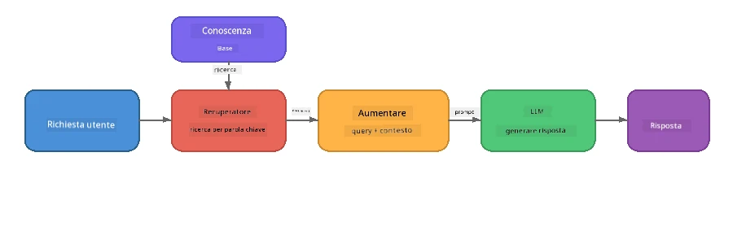

# Parte 4: Costruire un'applicazione RAG con Foundry Local

## Panoramica

I Large Language Model sono potenti, ma conoscono solo ciò che era presente nei loro dati di addestramento. **Retrieval-Augmented Generation (RAG)** risolve questo problema fornendo al modello un contesto rilevante al momento della query - estratto dai tuoi documenti, database o basi di conoscenza.

In questo laboratorio costruirai una pipeline RAG completa che funziona **interamente sul tuo dispositivo** usando Foundry Local. Niente servizi cloud, niente database vettoriali, niente API di embedding - solo recupero locale e modello locale.

## Obiettivi di apprendimento

Al termine di questo laboratorio sarai in grado di:

- Spiegare cos'è RAG e perché è importante per le applicazioni AI
- Costruire una base di conoscenza locale da documenti di testo
- Implementare una funzione di recupero semplice per trovare il contesto rilevante
- Comporre un prompt di sistema che ancorare il modello ai fatti recuperati
- Eseguire l'intera pipeline Retrieve → Augment → Generate sul dispositivo
- Comprendere i compromessi tra recupero basato su parole chiave e ricerca vettoriale

---

## Prerequisiti

- Completare [Parte 3: Usare il Foundry Local SDK con OpenAI](part3-sdk-and-apis.md)
- CLI Foundry Local installato e modello `phi-3.5-mini` scaricato

---

## Concetto: Cos’è RAG?

Senza RAG, un LLM può rispondere solo dai suoi dati di addestramento - che potrebbero essere obsoleti, incompleti o privi delle tue informazioni private:

```
User: "What is Zava's return policy?"
LLM:  "I do not have information about Zava's return policy."  ← No context!
```

Con RAG, prima **recuperi** i documenti rilevanti, poi **aumenti** il prompt con quel contesto prima di **generare** una risposta:



La chiave è: **il modello non deve "sapere" la risposta; deve solo leggere i documenti giusti.**

---

## Esercizi del laboratorio

### Esercizio 1: Comprendere la base di conoscenza

Apri l’esempio RAG per il tuo linguaggio ed esamina la base di conoscenza:

<details>
<summary><b>🐍 Python: <code>python/foundry-local-rag.py</code></b></summary>

La base di conoscenza è una semplice lista di dizionari con i campi `title` e `content`:

```python
KNOWLEDGE_BASE = [
    {
        "title": "Foundry Local Overview",
        "content": (
            "Foundry Local brings the power of Azure AI Foundry to your local "
            "device without requiring an Azure subscription..."
        ),
    },
    {
        "title": "Supported Hardware",
        "content": (
            "Foundry Local automatically selects the best model variant for "
            "your hardware. If you have an Nvidia CUDA GPU it downloads the "
            "CUDA-optimized model..."
        ),
    },
    # ... più voci
]
```

Ogni voce rappresenta un "blocco" di conoscenza - un pezzo focalizzato di informazione su un argomento.

</details>

<details>
<summary><b>📘 JavaScript: <code>javascript/foundry-local-rag.mjs</code></b></summary>

La base di conoscenza usa la stessa struttura come array di oggetti:

```javascript
const KNOWLEDGE_BASE = [
  {
    title: "Foundry Local Overview",
    content:
      "Foundry Local brings the power of Azure AI Foundry to your local " +
      "device without requiring an Azure subscription...",
  },
  {
    title: "Supported Hardware",
    content:
      "Foundry Local automatically selects the best model variant for " +
      "your hardware...",
  },
  // ... più voci
];
```

</details>

<details>
<summary><b>💜 C#: <code>csharp/RagPipeline.cs</code></b></summary>

La base di conoscenza usa una lista di tuple nominate:

```csharp
private static readonly List<(string Title, string Content)> KnowledgeBase =
[
    ("Foundry Local Overview",
     "Foundry Local brings the power of Azure AI Foundry to your local " +
     "device without requiring an Azure subscription..."),

    ("Supported Hardware",
     "Foundry Local automatically selects the best model variant for " +
     "your hardware..."),

    // ... more entries
];
```

</details>

> **In un’applicazione reale**, la base di conoscenza proverrebbe da file sul disco, un database, un indice di ricerca o un’API. Per questo laboratorio usiamo una lista in memoria per semplificare.

---

### Esercizio 2: Comprendere la funzione di recupero

La fase di recupero trova i blocchi più rilevanti per la domanda dell’utente. Questo esempio usa la **sovrapposizione di parole chiave** - contando quante parole della query appaiono anche in ciascun blocco:

<details>
<summary><b>🐍 Python</b></summary>

```python
def retrieve(query: str, top_k: int = 2) -> list[dict]:
    """Return the top-k knowledge chunks most relevant to the query."""
    query_words = set(query.lower().split())
    scored = []
    for chunk in KNOWLEDGE_BASE:
        chunk_words = set(chunk["content"].lower().split())
        overlap = len(query_words & chunk_words)
        scored.append((overlap, chunk))
    scored.sort(key=lambda x: x[0], reverse=True)
    return [item[1] for item in scored[:top_k]]
```

</details>

<details>
<summary><b>📘 JavaScript</b></summary>

```javascript
function retrieve(query, topK = 2) {
  const queryWords = new Set(query.toLowerCase().split(/\s+/));
  const scored = KNOWLEDGE_BASE.map((chunk) => {
    const chunkWords = new Set(chunk.content.toLowerCase().split(/\s+/));
    let overlap = 0;
    for (const w of queryWords) {
      if (chunkWords.has(w)) overlap++;
    }
    return { overlap, chunk };
  });
  scored.sort((a, b) => b.overlap - a.overlap);
  return scored.slice(0, topK).map((s) => s.chunk);
}
```

</details>

<details>
<summary><b>💜 C#</b></summary>

```csharp
private static List<(string Title, string Content)> Retrieve(string query, int topK = 2)
{
    var queryWords = new HashSet<string>(
        query.ToLowerInvariant().Split(' ', StringSplitOptions.RemoveEmptyEntries));

    return KnowledgeBase
        .Select(chunk =>
        {
            var chunkWords = new HashSet<string>(
                chunk.Content.ToLowerInvariant().Split(' ', StringSplitOptions.RemoveEmptyEntries));
            var overlap = queryWords.Intersect(chunkWords).Count();
            return (Overlap: overlap, Chunk: chunk);
        })
        .OrderByDescending(x => x.Overlap)
        .Take(topK)
        .Select(x => x.Chunk)
        .ToList();
}
```

</details>

**Come funziona:**
1. Dividi la query in parole individuali
2. Per ogni blocco di conoscenza, conta quante parole della query appaiono in quel blocco
3. Ordina per punteggio di sovrapposizione (dal più alto)
4. Restituisci i top-k blocchi più rilevanti

> **Compromesso:** La sovrapposizione di parole chiave è semplice ma limitata; non comprende sinonimi o significati. I sistemi RAG di produzione solitamente usano **vettori di embedding** e un **database vettoriale** per la ricerca semantica. Tuttavia, l’overlap di parole chiave è un ottimo punto di partenza e non richiede dipendenze aggiuntive.

---

### Esercizio 3: Comprendere il prompt aumentato

Il contesto recuperato viene inserito nel **prompt di sistema** prima di inviarlo al modello:

```python
system_prompt = (
    "You are a helpful assistant. Answer the user's question using ONLY "
    "the information provided in the context below. If the context does "
    "not contain enough information, say so.\n\n"
    f"Context:\n{context_text}"
)
```

Decisioni chiave di design:
- **"SOLO l’informazione fornita"** - impedisce al modello di allucinare fatti non presenti nel contesto
- **"Se il contesto non contiene abbastanza informazioni, dillo"** - incoraggia risposte oneste di tipo "Non lo so"
- Il contesto è posto nel messaggio di sistema per influenzare tutte le risposte

---

### Esercizio 4: Eseguire la pipeline RAG

Esegui l’esempio completo:

**Python:**
```bash
cd python
python foundry-local-rag.py
```

**JavaScript:**
```bash
cd javascript
node foundry-local-rag.mjs
```

**C#:**
```bash
cd csharp
dotnet run rag
```

Dovresti vedere stampate tre cose:
1. **La domanda** posta
2. **Il contesto recuperato** - i blocchi selezionati dalla base di conoscenza
3. **La risposta** - generata dal modello usando solo quel contesto

Output esempio:
```
Question: How do I install Foundry Local and what hardware does it support?

--- Retrieved Context ---
### Installation
On Windows install Foundry Local with: winget install Microsoft.FoundryLocal...

### Supported Hardware
Foundry Local automatically selects the best model variant for your hardware...
-------------------------

Answer: To install Foundry Local, you can use the following methods depending
on your operating system: On Windows, run `winget install Microsoft.FoundryLocal`.
On macOS, use `brew install microsoft/foundrylocal/foundrylocal`...
```

Nota come la risposta del modello sia **ancorata** al contesto recuperato - menziona solo fatti nei documenti della base di conoscenza.

---

### Esercizio 5: Sperimenta ed estendi

Prova queste modifiche per approfondire la comprensione:

1. **Cambia la domanda** - chiedi qualcosa CHE È nella base di conoscenza rispetto a qualcosa CHE NON È:
   ```python
   question = "What programming languages does Foundry Local support?"  # ← Nel contesto
   question = "How much does Foundry Local cost?"                       # ← Non nel contesto
   ```
   Il modello dice correttamente "Non lo so" quando la risposta non è nel contesto?

2. **Aggiungi un nuovo blocco di conoscenza** - aggiungi una nuova voce a `KNOWLEDGE_BASE`:
   ```python
   {
       "title": "Pricing",
       "content": "Foundry Local is completely free and open source under the MIT license.",
   }
   ```
   Ora riprova con la domanda sui prezzi.

3. **Modifica `top_k`** - recupera più o meno blocchi:
   ```python
   context_chunks = retrieve(question, top_k=3)  # Più contesto
   context_chunks = retrieve(question, top_k=1)  # Meno contesto
   ```
   Come influisce la quantità di contesto sulla qualità della risposta?

4. **Rimuovi l’istruzione di grounding** - cambia il prompt di sistema in "Sei un assistente disponibile." e verifica se il modello inizia a inventare fatti.

---

## Approfondimento: Ottimizzare RAG per prestazioni on-device

Eseguire RAG sul dispositivo introduce vincoli che non si incontrano nel cloud: RAM limitata, nessuna GPU dedicata (esecuzione CPU/NPU), e una finestra di contesto del modello piccola. Le decisioni progettuali sotto affrontano direttamente questi vincoli e si basano su pattern da applicazioni RAG locali di tipo produttivo costruite con Foundry Local.

### Strategia di chunking: finestra scorrevole di dimensione fissa

Il chunking - come si suddividono i documenti in pezzi - è una delle decisioni più impattanti in qualsiasi sistema RAG. Per scenari on-device, si consiglia partire con una **finestra scorrevole di dimensione fissa con sovrapposizione**:

| Parametro | Valore consigliato | Perché |
|-----------|--------------------|--------|
| **Dimensione chunk** | ~200 token | Mantiene il contesto recuperato compatto, lasciando spazio nella finestra di contesto di Phi-3.5 Mini per prompt di sistema, cronologia della conversazione e output generato |
| **Sovrapposizione** | ~25 token (12.5%) | Previene perdita di informazioni ai confini dei chunk - importante per procedure e istruzioni passo passo |
| **Tokenizzazione** | Divisione per spazi bianchi | Zero dipendenze, nessuna libreria tokenizer necessaria. Tutto il budget computazionale resta con l’LLM |

La sovrapposizione funziona come una finestra scorrevole: ogni nuovo chunk inizia 25 token prima della fine del precedente, così frasi che attraversano i confini appaiono in entrambi i chunk.

> **Perché non altre strategie?**
> - La divisione basata sulle frasi produce dimensioni di chunk imprevedibili; alcune procedure di sicurezza sono frasi singole molto lunghe che non si dividerebbero bene
> - La divisione consapevole delle sezioni (su intestazioni `##`) crea dimensioni di chunk molto diverse - alcune troppo piccole, altre troppo grandi per la finestra di contesto del modello
> - Il chunking semantico (rilevamento argomenti basato su embedding) dà la migliore qualità di recupero, ma richiede un secondo modello in memoria insieme a Phi-3.5 Mini - rischioso su hardware con 8-16 GB di memoria condivisa

### Migliorare il recupero: vettori TF-IDF

L’approccio di sovrapposizione parole chiave in questo laboratorio funziona, ma se vuoi un recupero migliore senza aggiungere un modello di embedding, **TF-IDF (Term Frequency-Inverse Document Frequency)** è un eccellente compromesso:

```
Keyword Overlap  →  TF-IDF Vectors  →  Embedding Models
    (this lab)     (lightweight upgrade)   (production)
  Simple & fast    Better ranking,         Best quality,
  No dependencies  still no ML model       requires embedding model
  ~Basic matching  ~1ms retrieval          ~100-500ms per query
```

TF-IDF converte ogni chunk in un vettore numerico basato su quanto è importante ogni parola in quel chunk *rispetto a tutti i chunk*. Al momento della query, la domanda viene vettorializzata nello stesso modo e confrontata usando similarità coseno. Puoi implementarlo con SQLite e JavaScript/Python puro - niente database vettoriali, nessuna API di embedding.

> **Prestazioni:** La similarità coseno con TF-IDF su chunk di dimensione fissa tipicamente raggiunge **~1ms di recupero**, rispetto a 100-500ms quando un modello embedding codifica ogni query. Tutti i 20+ documenti possono essere chunkati e indicizzati in meno di un secondo.

### Modalità Edge/Compatta per dispositivi con risorse limitate

Quando si esegue su hardware molto vincolato (laptop più vecchi, tablet, dispositivi da campo), puoi ridurre l’uso delle risorse stringendo tre parametri:

| Impostazione | Modalità Standard | Modalità Edge/Compatta |
|--------------|------------------|-----------------------|
| **Prompt di sistema** | ~300 token | ~80 token |
| **Max token output** | 1024 | 512 |
| **Chunk recuperati (top-k)** | 5 | 3 |

Meno chunk recuperati significa meno contesto da processare per il modello, riducendo latenza e uso di memoria. Un prompt di sistema più breve libera più spazio nella finestra di contesto per la risposta vera e propria. Questo compromesso vale sui dispositivi dove ogni token di finestra di contesto conta.

### Un solo modello in memoria

Uno dei principi più importanti per RAG on-device: **caricare solo un modello**. Se usi un modello embedding per il recupero *e* un modello linguistico per la generazione, stai dividendo risorse NPU/RAM limitate tra due modelli. Il recupero leggero (sovrapposizione parole chiave, TF-IDF) evita completamente questo:

- Nessun modello embedding in competizione con l’LLM per la memoria
- Avvio a freddo più veloce - solo un modello da caricare
- Uso di memoria prevedibile - l’LLM prende tutte le risorse disponibili
- Funziona su macchine con solo 8 GB di RAM

### SQLite come archivio vettoriale locale

Per collezioni di documenti piccole o medie (da centinaia a poco migliaia di chunk), **SQLite è abbastanza veloce** per ricerche brute-force di similarità coseno e non aggiunge infrastruttura:

- Un file `.db` singolo su disco - nessun processo server, nessuna configurazione
- Incluso in ogni runtime linguistico principale (Python `sqlite3`, Node.js `better-sqlite3`, .NET `Microsoft.Data.Sqlite`)
- Conserva chunk di documenti assieme ai loro vettori TF-IDF in una tabella
- Non serve Pinecone, Qdrant, Chroma o FAISS a questa scala

### Riepilogo delle prestazioni

Queste scelte di design si combinano per offrire un RAG reattivo su hardware consumer:

| Metrica | Prestazioni On-Device |
|---------|----------------------|
| **Latenza recupero** | ~1ms (TF-IDF) a ~5ms (sovrapposizione parole chiave) |
| **Velocità di ingestione** | 20 documenti chunkati e indicizzati in < 1 secondo |
| **Modelli in memoria** | 1 (solo LLM - nessun embedding) |
| **Occupazione storage** | < 1 MB per chunk + vettori in SQLite |
| **Avvio a freddo** | Caricamento singolo modello, nessun runtime embedding |
| **Requisiti hardware** | 8 GB RAM, solo CPU (nessuna GPU richiesta) |

> **Quando fare l’upgrade:** Se si scala a centinaia di documenti lunghi, tipi di contenuti misti (tabelle, codice, prosa), o serve comprensione semantica delle query, valuta di aggiungere un modello embedding e passare alla ricerca per similarità vettoriale. Per la maggior parte dei casi d’uso on-device con set documentali mirati, TF-IDF + SQLite offre ottimi risultati con risorse minime.

---

## Concetti chiave

| Concetto | Descrizione |
|----------|-------------|
| **Recupero** | Trovare documenti rilevanti da una base di conoscenza basata sulla query dell’utente |
| **Aumento** | Inserire i documenti recuperati nel prompt come contesto |
| **Generazione** | L’LLM produce una risposta ancorata al contesto fornito |
| **Chunking** | Suddividere grandi documenti in pezzi più piccoli e focalizzati |
| **Grounding** | Vincolare il modello a usare solo il contesto fornito (riduce allucinazioni) |
| **Top-k** | Numero di blocchi più rilevanti da recuperare |

---

## RAG in produzione vs. questo laboratorio

| Aspetto | Questo laboratorio | Ottimizzato on-device | Produzione cloud |
|---------|--------------------|-----------------------|------------------|
| **Base di conoscenza** | Lista in memoria | File su disco, SQLite | Database, indice di ricerca |
| **Recupero** | Sovrapposizione parole chiave | TF-IDF + similarità coseno | Embedding vettoriali + ricerca di similarità |
| **Embedding** | Non necessari | Nessuno - vettori TF-IDF | Modello embedding (locale o cloud) |
| **Archivio vettoriale** | Non necessario | SQLite (file `.db` singolo) | FAISS, Chroma, Azure AI Search, ecc. |
| **Chunking** | Manuale | Finestra scorrevole dimensione fissa (~200 token, sovrapposizione 25 token) | Chunking semantico o ricorsivo |
| **Modelli in memoria** | 1 (LLM) | 1 (LLM) | 2+ (embedding + LLM) |
| **Latenza di recupero** | ~5ms | ~1ms | ~100-500ms |
| **Scala** | 5 documenti | Centinaia di documenti | Milioni di documenti |

I modelli che impari qui (recupero, integrazione, generazione) sono gli stessi a qualsiasi scala. Il metodo di recupero migliora, ma l'architettura complessiva resta identica. La colonna centrale mostra ciò che è raggiungibile sul dispositivo con tecniche leggere, spesso il punto ottimale per applicazioni locali dove si scambia la scala cloud per privacy, capacità offline e latenza zero verso servizi esterni.

---

## Punti Chiave

| Concetto | Cosa Hai Imparato |
|---------|------------------|
| Modello RAG | Recupera + Integra + Genera: dai al modello il contesto giusto e può rispondere a domande sui tuoi dati |
| Sul dispositivo | Tutto gira localmente senza API cloud o abbonamenti a database vettoriali |
| Istruzioni di ancoraggio | Vincoli nel prompt di sistema sono critici per prevenire allucinazioni |
| Sovrapposizione di parole chiave | Un punto di partenza semplice ma efficace per il recupero |
| TF-IDF + SQLite | Un percorso di aggiornamento leggero che mantiene il recupero sotto 1ms senza modello di embedding |
| Un modello in memoria | Evita di caricare un modello di embedding insieme all’LLM su hardware limitato |
| Dimensione del chunk | Circa 200 token con sovrapposizione bilancia precisione di recupero ed efficienza della finestra contestuale |
| Modalità Edge/compatta | Usa meno chunk e prompt più brevi per dispositivi molto limitati |
| Modello universale | La stessa architettura RAG funziona per qualsiasi fonte di dati: documenti, database, API o wiki |

> **Vuoi vedere un'applicazione RAG completa sul dispositivo?** Dai un’occhiata a [Gas Field Local RAG](https://github.com/leestott/local-rag), un agente RAG offline stile produzione costruito con Foundry Local e Phi-3.5 Mini che dimostra questi schemi di ottimizzazione con un set reale di documenti.

---

## Passi Successivi

Continua con [Parte 5: Costruire Agenti AI](part5-single-agents.md) per imparare come costruire agenti intelligenti con personaggi, istruzioni e conversazioni multi-turno usando Microsoft Agent Framework.

---

<!-- CO-OP TRANSLATOR DISCLAIMER START -->
**Disclaimer**:  
Questo documento è stato tradotto utilizzando il servizio di traduzione automatica [Co-op Translator](https://github.com/Azure/co-op-translator). Pur impegnandoci per l'accuratezza, si prega di essere consapevoli che le traduzioni automatiche possono contenere errori o imprecisioni. Il documento originale nella sua lingua nativa deve essere considerato la fonte autorevole. Per informazioni critiche, si raccomanda una traduzione professionale effettuata da un essere umano. Non ci assumiamo alcuna responsabilità per eventuali malintesi o interpretazioni errate derivanti dall'uso di questa traduzione.
<!-- CO-OP TRANSLATOR DISCLAIMER END -->