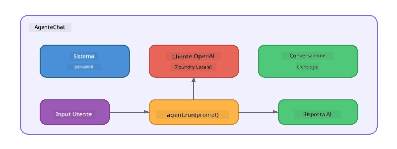

# Parte 5: Costruire Agenti AI con l'Agent Framework

> **Obiettivo:** Costruire il tuo primo agente AI con istruzioni persistenti e una persona definita, alimentato da un modello locale tramite Foundry Local.

## Cos'è un Agente AI?

Un agente AI incapsula un modello di linguaggio con **istruzioni di sistema** che definiscono il suo comportamento, personalità e vincoli. A differenza di una singola chiamata di completamento chat, un agente fornisce:

- **Persona** - un'identità coerente ("Sei un revisore di codice utile")
- **Memoria** - la cronologia della conversazione nel corso degli scambi
- **Specializzazione** - comportamento focalizzato guidato da istruzioni ben formulate



---

## Il Microsoft Agent Framework

Il **Microsoft Agent Framework** (AGF) fornisce un'astrazione standard per agenti che funziona con diversi backend di modelli. In questo workshop lo abbiniamo a Foundry Local così che tutto giri sulla tua macchina - nessun cloud richiesto.

| Concetto | Descrizione |
|---------|-------------|
| `FoundryLocalClient` | Python: gestisce l'avvio del servizio, il download/caricamento del modello e crea agenti |
| `client.as_agent()` | Python: crea un agente dal client Foundry Local |
| `AsAIAgent()` | C#: metodo di estensione su `ChatClient` - crea un `AIAgent` |
| `instructions` | Prompt di sistema che plasma il comportamento dell'agente |
| `name` | Etichetta leggibile dall'uomo, utile in scenari multi-agente |
| `agent.run(prompt)` / `RunAsync()` | Invia un messaggio utente e restituisce la risposta dell'agente |

> **Nota:** L'Agent Framework ha un SDK Python e .NET. Per JavaScript implementiamo una classe leggera `ChatAgent` che replica lo stesso schema usando direttamente l'SDK OpenAI.

---

## Esercizi

### Esercizio 1 - Comprendere il Pattern Agente

Prima di scrivere codice, studia i componenti chiave di un agente:

1. **Client modello** - si connette all'API compatibile OpenAI di Foundry Local
2. **Istruzioni di sistema** - il prompt della "personalità"
3. **Ciclo di esecuzione** - inviare input utente, ricevere output

> **Rifletti:** In cosa differiscono le istruzioni di sistema da un messaggio utente normale? Cosa succede se le cambi?

---

### Esercizio 2 - Esegui l'Esempio Single-Agent

<details>
<summary><strong>🐍 Python</strong></summary>

**Prerequisiti:**
```bash
cd python
python -m venv venv

# Windows (PowerShell):
venv\Scripts\Activate.ps1
# macOS:
source venv/bin/activate

pip install -r requirements.txt
```

**Esegui:**
```bash
python foundry-local-with-agf.py
```

**Guida al codice** (`python/foundry-local-with-agf.py`):

```python
import asyncio
from agent_framework_foundry_local import FoundryLocalClient

async def main():
    alias = "phi-4-mini"

    # FoundryLocalClient gestisce l'avvio del servizio, il download del modello e il caricamento
    client = FoundryLocalClient(model_id=alias)
    print(f"Client Model ID: {client.model_id}")

    # Crea un agente con istruzioni di sistema
    agent = client.as_agent(
        name="Joker",
        instructions="You are good at telling jokes.",
    )

    # Non in streaming: ottenere la risposta completa in una volta
    result = await agent.run("Tell me a joke about a pirate.")
    print(f"Agent: {result}")

    # In streaming: ottenere i risultati man mano che vengono generati
    async for chunk in agent.run("Tell me another joke.", stream=True):
        if chunk.text:
            print(chunk.text, end="", flush=True)

asyncio.run(main())
```

**Punti chiave:**
- `FoundryLocalClient(model_id=alias)` gestisce in un unico passaggio l'avvio del servizio, il download e il caricamento del modello
- `client.as_agent()` crea un agente con istruzioni di sistema e un nome
- `agent.run()` supporta modalità sia non in streaming che in streaming
- Installa con `pip install agent-framework-foundry-local --pre`

</details>

<details>
<summary><strong>📦 JavaScript</strong></summary>

**Prerequisiti:**
```bash
cd javascript
npm install
```

**Esegui:**
```bash
node foundry-local-with-agent.mjs
```

**Guida al codice** (`javascript/foundry-local-with-agent.mjs`):

```javascript
import { OpenAI } from "openai";
import { FoundryLocalManager } from "foundry-local-sdk";

class ChatAgent {
  constructor({ client, modelId, instructions, name }) {
    this.client = client;
    this.modelId = modelId;
    this.instructions = instructions;
    this.name = name;
    this.history = [];
  }

  async run(userMessage) {
    const messages = [
      { role: "system", content: this.instructions },
      ...this.history,
      { role: "user", content: userMessage },
    ];
    const response = await this.client.chat.completions.create({
      model: this.modelId,
      messages,
    });
    const assistantMessage = response.choices[0].message.content;

    // Conserva la cronologia della conversazione per interazioni multi-turno
    this.history.push({ role: "user", content: userMessage });
    this.history.push({ role: "assistant", content: assistantMessage });
    return { text: assistantMessage };
  }
}

async function main() {
  FoundryLocalManager.create({ appName: "FoundryLocalWorkshop" });
  const manager = FoundryLocalManager.instance;
  await manager.startWebService();

  const catalog = manager.catalog;
  const model = await catalog.getModel("phi-3.5-mini");
  if (!model.isCached) {
    console.log("Downloading model: phi-3.5-mini...");
    await model.download();
  }
  await model.load();

  const client = new OpenAI({
    baseURL: manager.urls[0] + "/v1",
    apiKey: "foundry-local",
  });

  const agent = new ChatAgent({
    client,
    modelId: model.id,
    instructions: "You are good at telling jokes.",
    name: "Joker",
  });

  const result = await agent.run("Tell me a joke about a pirate.");
  console.log(result.text);
}

main();
```

**Punti chiave:**
- JavaScript crea la propria classe `ChatAgent` che rispecchia il pattern AGF Python
- `this.history` memorizza gli scambi della conversazione per supportare più turni
- Esplicito `startWebService()` → controllo cache → `model.download()` → `model.load()` fornisce piena visibilità

</details>

<details>
<summary><strong>💜 C#</strong></summary>

**Prerequisiti:**
```bash
cd csharp
dotnet restore
```

**Esegui:**
```bash
dotnet run agent
```

**Guida al codice** (`csharp/SingleAgent.cs`):

```csharp
using Microsoft.AI.Foundry.Local;
using Microsoft.Extensions.Logging.Abstractions;
using Microsoft.Agents.AI;
using OpenAI;
using System.ClientModel;

// 1. Start Foundry Local and load a model
var alias = "phi-3.5-mini";
await FoundryLocalManager.CreateAsync(
    new Configuration
    {
        AppName = "FoundryLocalSamples",
        Web = new Configuration.WebService { Urls = "http://127.0.0.1:0" }
    }, NullLogger.Instance, default);
var manager = FoundryLocalManager.Instance;
await manager.StartWebServiceAsync(default);

var catalog = await manager.GetCatalogAsync(default);
var model = await catalog.GetModelAsync(alias, default);

var isCached = await model.IsCachedAsync(default);
if (!isCached)
{
    Console.WriteLine($"Downloading model: {alias}...");
    await model.DownloadAsync(null, default);
}
await model.LoadAsync(default);

var key = new ApiKeyCredential("foundry-local");
var client = new OpenAIClient(key, new OpenAIClientOptions
{
    Endpoint = new Uri(manager.Urls[0] + "/v1")
});

// 2. Create an AIAgent using the Agent Framework extension method
AIAgent joker = client
    .GetChatClient(model.Id)
    .AsAIAgent(
        instructions: "You are good at telling jokes. Keep your jokes short and family-friendly.",
        name: "Joker"
    );

// 3. Run the agent (non-streaming)
var response = await joker.RunAsync("Tell me a joke about a pirate.");
Console.WriteLine($"Joker: {response}");

// 4. Run with streaming
await foreach (var update in joker.RunStreamingAsync("Tell me another joke."))
{
    Console.Write(update);
}
```

**Punti chiave:**
- `AsAIAgent()` è un metodo di estensione da `Microsoft.Agents.AI.OpenAI` - non serve una classe personalizzata `ChatAgent`
- `RunAsync()` restituisce la risposta completa; `RunStreamingAsync()` esegue lo streaming token per token
- Installa con `dotnet add package Microsoft.Agents.AI.OpenAI --version 1.0.0-rc3`

</details>

---

### Esercizio 3 - Cambia la Persona

Modifica le `instructions` dell'agente per creare una persona differente. Prova ognuna e osserva come cambia l'output:

| Persona | Istruzioni |
|---------|-------------|
| Revisore di Codice | `"Sei un esperto revisore di codice. Fornisci feedback costruttivi focalizzati su leggibilità, performance e correttezza."` |
| Guida Turistica | `"Sei una guida turistica amichevole. Dai raccomandazioni personalizzate su destinazioni, attività e cucina locale."` |
| Tutor Socratico | `"Sei un tutor socratico. Non dare mai risposte dirette - invece, guida lo studente con domande ponderate."` |
| Scrittore Tecnico | `"Sei uno scrittore tecnico. Spiega i concetti chiaramente e concisamente. Usa esempi. Evita il gergo."` |

**Provalo:**
1. Scegli una persona dalla tabella sopra
2. Sostituisci la stringa `instructions` nel codice
3. Adatta il prompt utente di conseguenza (es. chiedi al revisore di codice di rivedere una funzione)
4. Esegui di nuovo l'esempio e confronta l'output

> **Suggerimento:** La qualità di un agente dipende molto dalle istruzioni. Istruzioni specifiche e ben strutturate producono risultati migliori di quelle vaghe.

---

### Esercizio 4 - Aggiungi Conversazione Multi-Turno

Estendi l'esempio per supportare un ciclo di chat multi-turno così puoi avere una conversazione di andata e ritorno con l'agente.

<details>
<summary><strong>🐍 Python - ciclo multi-turno</strong></summary>

```python
import asyncio
from agent_framework_foundry_local import FoundryLocalClient

async def main():
    client = FoundryLocalClient(model_id="phi-4-mini")

    agent = client.as_agent(
        name="Assistant",
        instructions="You are a helpful assistant.",
    )

    print("Chat with the agent (type 'quit' to exit):\n")
    while True:
        user_input = input("You: ")
        if user_input.strip().lower() in ("quit", "exit"):
            break
        result = await agent.run(user_input)
        print(f"Agent: {result}\n")

asyncio.run(main())
```

</details>

<details>
<summary><strong>📦 JavaScript - ciclo multi-turno</strong></summary>

```javascript
import { OpenAI } from "openai";
import { FoundryLocalManager } from "foundry-local-sdk";
import * as readline from "node:readline/promises";

// (riutilizza la classe ChatAgent dall'Esercizio 2)

async function main() {
  FoundryLocalManager.create({ appName: "FoundryLocalWorkshop" });
  const manager = FoundryLocalManager.instance;
  await manager.startWebService();

  const catalog = manager.catalog;
  const model = await catalog.getModel("phi-3.5-mini");
  if (!model.isCached) {
    console.log("Downloading model: phi-3.5-mini...");
    await model.download();
  }
  await model.load();

  const client = new OpenAI({
    baseURL: manager.urls[0] + "/v1",
    apiKey: "foundry-local",
  });

  const agent = new ChatAgent({
    client,
    modelId: model.id,
    instructions: "You are a helpful assistant.",
    name: "Assistant",
  });

  const rl = readline.createInterface({
    input: process.stdin,
    output: process.stdout,
  });

  console.log("Chat with the agent (type 'quit' to exit):\n");
  while (true) {
    const userInput = await rl.question("You: ");
    if (["quit", "exit"].includes(userInput.trim().toLowerCase())) break;
    const result = await agent.run(userInput);
    console.log(`Agent: ${result.text}\n`);
  }
  rl.close();
}

main();
```

</details>

<details>
<summary><strong>💜 C# - ciclo multi-turno</strong></summary>

```csharp
using Microsoft.AI.Foundry.Local;
using Microsoft.Extensions.Logging.Abstractions;
using Microsoft.Agents.AI;
using OpenAI;
using System.ClientModel;

var alias = "phi-3.5-mini";
var config = new Configuration
{
    AppName = "FoundryLocalSamples",
    Web = new Configuration.WebService { Urls = "http://127.0.0.1:0" }
};
await FoundryLocalManager.CreateAsync(config, NullLogger.Instance, default);
var manager = FoundryLocalManager.Instance;
await manager.StartWebServiceAsync(default);

var catalog = await manager.GetCatalogAsync(default);
var model = await catalog.GetModelAsync(alias, default);

var isCached = await model.IsCachedAsync(default);
if (!isCached)
{
    Console.WriteLine($"Downloading model: {alias}...");
    await model.DownloadAsync(null, default);
}
await model.LoadAsync(default);

var key = new ApiKeyCredential("foundry-local");
var client = new OpenAIClient(key, new OpenAIClientOptions
{
    Endpoint = new Uri(manager.Urls[0] + "/v1")
});

AIAgent agent = client
    .GetChatClient(model.Id)
    .AsAIAgent(
        instructions: "You are a helpful assistant.",
        name: "Assistant"
    );

Console.WriteLine("Chat with the agent (type 'quit' to exit):\n");
while (true)
{
    Console.Write("You: ");
    var userInput = Console.ReadLine();
    if (string.IsNullOrWhiteSpace(userInput) ||
        userInput.Equals("quit", StringComparison.OrdinalIgnoreCase) ||
        userInput.Equals("exit", StringComparison.OrdinalIgnoreCase))
        break;

    var result = await agent.RunAsync(userInput);
    Console.WriteLine($"Agent: {result}\n");
}
```

</details>

Nota come l'agente ricorda gli scambi precedenti - poni una domanda di approfondimento e osserva il contesto che persiste.

---

### Esercizio 5 - Output Strutturato

Istruisci l'agente a rispondere sempre in un formato specifico (es. JSON) e analizza il risultato:

<details>
<summary><strong>🐍 Python - output JSON</strong></summary>

```python
import asyncio
import json
from agent_framework_foundry_local import FoundryLocalClient

async def main():
    client = FoundryLocalClient(model_id="phi-4-mini")

    agent = client.as_agent(
        name="SentimentAnalyzer",
        instructions=(
            "You are a sentiment analysis agent. "
            "For every user message, respond ONLY with valid JSON in this format: "
            '{"sentiment": "positive|negative|neutral", "confidence": 0.0-1.0, "summary": "brief reason"}'
        ),
    )

    result = await agent.run("I absolutely loved the new restaurant downtown!")
    print("Raw:", result)

    try:
        parsed = json.loads(str(result))
        print(f"Sentiment: {parsed['sentiment']} (confidence: {parsed['confidence']})")
    except json.JSONDecodeError:
        print("Agent did not return valid JSON - try refining the instructions.")

asyncio.run(main())
```

</details>

<details>
<summary><strong>💜 C# - output JSON</strong></summary>

```csharp
using System.Text.Json;

AIAgent analyzer = chatClient.AsAIAgent(
    name: "SentimentAnalyzer",
    instructions:
        "You are a sentiment analysis agent. " +
        "For every user message, respond ONLY with valid JSON in this format: " +
        "{\"sentiment\": \"positive|negative|neutral\", \"confidence\": 0.0-1.0, \"summary\": \"brief reason\"}"
);

var response = await analyzer.RunAsync("I absolutely loved the new restaurant downtown!");
Console.WriteLine($"Raw: {response}");

try
{
    var parsed = JsonSerializer.Deserialize<JsonElement>(response.ToString());
    Console.WriteLine($"Sentiment: {parsed.GetProperty("sentiment")} " +
                      $"(confidence: {parsed.GetProperty("confidence")})");
}
catch (JsonException)
{
    Console.WriteLine("Agent did not return valid JSON - try refining the instructions.");
}
```

</details>

> **Nota:** Modelli locali piccoli potrebbero non produrre sempre JSON perfettamente valido. Puoi migliorare l'affidabilità includendo un esempio nelle istruzioni e specificando esplicitamente il formato atteso.

---

## Punti Chiave

| Concetto | Cosa Hai Imparato |
|---------|-----------------|
| Agente vs. chiamata LLM grezza | Un agente incapsula un modello con istruzioni e memoria |
| Istruzioni di sistema | La leva più importante per controllare il comportamento di un agente |
| Conversazione multi-turno | Gli agenti possono portare il contesto attraverso più interazioni utente |
| Output strutturato | Le istruzioni possono imporre un formato di output (JSON, markdown, ecc.) |
| Esecuzione locale | Tutto gira sul dispositivo tramite Foundry Local - nessun cloud richiesto |

---

## Passi Successivi

In **[Parte 6: Flussi di Lavoro Multi-Agente](part6-multi-agent-workflows.md)**, combinerai più agenti in una pipeline coordinata in cui ciascun agente ha un ruolo specializzato.

---

<!-- CO-OP TRANSLATOR DISCLAIMER START -->
**Disclaimer**:
Questo documento è stato tradotto utilizzando il servizio di traduzione AI [Co-op Translator](https://github.com/Azure/co-op-translator). Pur impegnandoci per l’accuratezza, si prega di notare che le traduzioni automatiche possono contenere errori o imprecisioni. Il documento originale nella sua lingua madre deve essere considerato la fonte autorevole. Per informazioni critiche, si raccomanda la traduzione professionale umana. Non siamo responsabili per eventuali fraintendimenti o interpretazioni errate derivanti dall’uso di questa traduzione.
<!-- CO-OP TRANSLATOR DISCLAIMER END -->