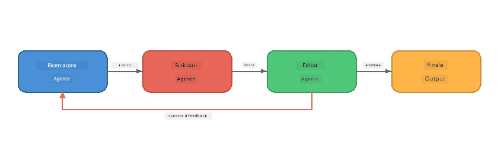
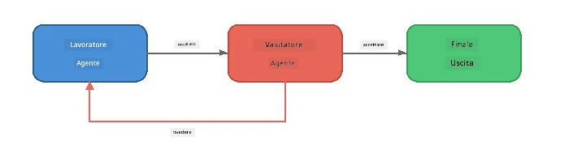
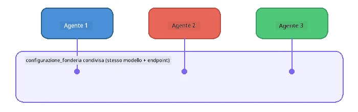

# Parte 6: Flussi di lavoro multi-agente

> **Obiettivo:** Combinare più agenti specializzati in pipeline coordinate che dividono compiti complessi tra agenti che collaborano - tutti in esecuzione locale con Foundry Local.

## Perché Multi-Agente?

Un singolo agente può gestire molte attività, ma i flussi di lavoro complessi beneficiano della **Specializzazione**. Invece che un agente tenti di ricercare, scrivere e correggere simultaneamente, si suddivide il lavoro in ruoli focalizzati:



| Pattern | Descrizione |
|---------|-------------|
| **Sequenziale** | L'output dell'Agente A alimenta l'Agente B → Agente C |
| **Loop di feedback** | Un agente valutatore può restituire il lavoro per una revisione |
| **Contesto condiviso** | Tutti gli agenti usano lo stesso modello/endpoint, ma istruzioni diverse |
| **Output tipizzato** | Gli agenti producono risultati strutturati (JSON) per passaggi affidabili |

---

## Esercizi

### Esercizio 1 - Esegui la Pipeline Multi-Agente

Il workshop include un flusso completo Ricercatore → Scrittore → Editor.

<details>
<summary><strong>🐍 Python</strong></summary>

**Configurazione:**
```bash
cd python
python -m venv venv

# Windows (PowerShell):
venv\Scripts\Activate.ps1
# macOS:
source venv/bin/activate

pip install -r requirements.txt
```

**Esegui:**
```bash
python foundry-local-multi-agent.py
```

**Cosa succede:**
1. **Ricercatore** riceve un argomento e restituisce fatti a punti elenco
2. **Scrittore** prende la ricerca e redige un post sul blog (3-4 paragrafi)
3. **Editor** rivede l’articolo per qualità e restituisce ACCETTA o REVISA

</details>

<details>
<summary><strong>📦 JavaScript</strong></summary>

**Configurazione:**
```bash
cd javascript
npm install
```

**Esegui:**
```bash
node foundry-local-multi-agent.mjs
```

**Stessa pipeline a tre fasi** - Ricercatore → Scrittore → Editor.

</details>

<details>
<summary><strong>💜 C#</strong></summary>

**Configurazione:**
```bash
cd csharp
dotnet restore
```

**Esegui:**
```bash
dotnet run multi
```

**Stessa pipeline a tre fasi** - Ricercatore → Scrittore → Editor.

</details>

---

### Esercizio 2 - Anatomia della Pipeline

Studia come gli agenti sono definiti e collegati:

**1. Client modello condiviso**

Tutti gli agenti condividono lo stesso modello Foundry Local:

```python
# Python - FoundryLocalClient gestisce tutto
from agent_framework_foundry_local import FoundryLocalClient

client = FoundryLocalClient(model_id="phi-3.5-mini")
```

```javascript
// JavaScript - SDK OpenAI puntato a Foundry Locale
const client = new OpenAI({
  baseURL: manager.urls[0] + "/v1",
  apiKey: "foundry-local",
});
```

```csharp
// C# - OpenAIClient pointed at Foundry Local
var key = new ApiKeyCredential("foundry-local");
var client = new OpenAIClient(key, new OpenAIClientOptions
{
    Endpoint = new Uri(manager.Urls[0] + "/v1")
});
var chatClient = client.GetChatClient(model.Id);
```

**2. istruzioni specializzate**

Ogni agente ha una persona distinta:

| Agente | Istruzioni (sintesi) |
|-------|----------------------|
| Ricercatore | "Fornisci fatti chiave, statistiche e contesto. Organizza come punti elenco." |
| Scrittore | "Scrivi un post coinvolgente (3-4 paragrafi) dalle note di ricerca. Non inventare fatti." |
| Editor | "Rivedi per chiarezza, grammatica e coerenza fattuale. Giudizio: ACCETTA o REVISA." |

**3. Flussi di dati tra agenti**

```python
# Passo 1 - l'output del ricercatore diventa input per lo scrittore
research_result = await researcher.run(f"Research: {topic}")

# Passo 2 - l'output dello scrittore diventa input per l'editor
writer_result = await writer.run(f"Write using:\n{research_result}")

# Passo 3 - l'editor rivede sia la ricerca che l'articolo
editor_result = await editor.run(
    f"Research:\n{research_result}\n\nArticle:\n{writer_result}"
)
```

```csharp
// C# - same pattern, async calls with AIAgent
var researchNotes = await researcher.RunAsync(
    $"Research the following topic and provide key facts:\n{topic}");

var draft = await writer.RunAsync(
    $"Write a blog post based on these research notes:\n\n{researchNotes}");

var verdict = await editor.RunAsync(
    $"Review this article for quality and accuracy.\n\n" +
    $"Research notes:\n{researchNotes}\n\n" +
    $"Article:\n{draft}");
```

> **Insight chiave:** Ogni agente riceve il contesto cumulativo dai precedenti agenti. L’editor vede sia la ricerca originale che la bozza - questo consente di verificare la coerenza fattuale.

---

### Esercizio 3 - Aggiungi un Quarto Agente

Estendi la pipeline aggiungendo un nuovo agente. Scegline uno:

| Agente | Scopo | Istruzioni |
|-------|---------|-------------|
| **Fact-Checker** | Verifica le affermazioni nell’articolo | `"Verifichi le affermazioni fattuali. Per ciascuna dichiara se è supportata dalle note di ricerca. Restituisci JSON con elementi verificati/non verificati."` |
| **Headline Writer** | Crea titoli accattivanti | `"Genera 5 opzioni di titoli per l’articolo. Varia lo stile: informativo, clickbait, domanda, lista, emotivo."` |
| **Social Media** | Crea post promozionali | `"Crea 3 post per social media promuovendo questo articolo: uno per Twitter (280 caratteri), uno per LinkedIn (tono professionale), uno per Instagram (informale con suggerimenti emoji)."` |

<details>
<summary><strong>🐍 Python - aggiunta di un Headline Writer</strong></summary>

```python
headline_agent = client.as_agent(
    name="HeadlineWriter",
    instructions=(
        "You are a headline specialist. Given an article, generate exactly "
        "5 headline options. Vary the style: informative, question-based, "
        "listicle, emotional, and provocative. Return them as a numbered list."
    ),
)

# Dopo che l'editor accetta, genera i titoli
headline_result = await headline_agent.run(
    f"Generate headlines for this article:\n\n{writer_result}"
)
print(f"\n--- Headlines ---\n{headline_result}")
```

</details>

<details>
<summary><strong>📦 JavaScript - aggiunta di un Headline Writer</strong></summary>

```javascript
const headlineAgent = new ChatAgent({
  client,
  modelId: modelInfo.id,
  instructions:
    "You are a headline specialist. Given an article, generate exactly " +
    "5 headline options. Vary the style: informative, question-based, " +
    "listicle, emotional, and provocative. Return them as a numbered list.",
  name: "HeadlineWriter",
});

const headlineResult = await headlineAgent.run(
  `Generate headlines for this article:\n\n${writerResult.text}`
);
console.log(`\n--- Headlines ---\n${headlineResult.text}`);
```

</details>

<details>
<summary><strong>💜 C# - aggiunta di un Headline Writer</strong></summary>

```csharp
AIAgent headlineAgent = chatClient.AsAIAgent(
    name: "HeadlineWriter",
    instructions:
        "You are a headline specialist. Given an article, generate exactly " +
        "5 headline options. Vary the style: informative, question-based, " +
        "listicle, emotional, and provocative. Return them as a numbered list."
);

// After the editor accepts, generate headlines
var headlines = await headlineAgent.RunAsync(
    $"Generate headlines for this article:\n\n{draft}");
Console.WriteLine($"\n--- Headlines ---\n{headlines}");
```

</details>

---

### Esercizio 4 - Progetta il Tuo Flusso di Lavoro

Progetta una pipeline multi-agente per un dominio differente. Ecco alcune idee:

| Dominio | Agenti | Flusso |
|--------|--------|--------|
| **Revisione codice** | Analizzatore → Revisore → Sintetizzatore | Analizza struttura codice → revisiona per errori → produce rapporto riassuntivo |
| **Supporto clienti** | Classificatore → Risponditore → QA | Classifica ticket → redigi risposta → verifica qualità |
| **Istruzione** | Creatore quiz → Simulatore studente → Valutatore | Genera quiz → simula risposte → valuta e spiega |
| **Analisi dati** | Interprete → Analista → Reporter | Interpreta richiesta dati → analizza pattern → scrivi rapporto |

**Passi:**
1. Definisci 3+ agenti con `istruzioni` distinte
2. Decidi il flusso dati - cosa riceve e produce ogni agente?
3. Implementa la pipeline usando i pattern degli Esercizi 1-3
4. Aggiungi un loop di feedback se un agente deve valutare il lavoro di un altro

---

## Pattern di Orchestrazione

Ecco i pattern di orchestrazione che si applicano a qualsiasi sistema multi-agente (esplorati in dettaglio in [Parte 7](part7-zava-creative-writer.md)):

### Pipeline sequenziale


Ogni agente elabora l'output del precedente. Semplice e prevedibile.

### Loop di Feedback



Un agente valutatore può innescare la riesecuzione di fasi precedenti. Zava Writer usa questo: l’editor può inviare feedback a ricercatore e scrittore.

### Contesto Condiviso



Tutti gli agenti condividono un unico `foundry_config` quindi usano lo stesso modello e endpoint.

---

## Punti chiave

| Concetto | Cosa hai imparato |
|---------|------------------|
| Specializzazione agente | Ogni agente fa bene un compito con istruzioni mirate |
| Passaggio dati | L’output di un agente diventa input per il successivo |
| Loop di feedback | Un valutatore può innescare ritentativi per qualità superiore |
| Output strutturato | Risposte in formato JSON permettono comunicazione affidabile tra agenti |
| Orchestrazione | Un coordinatore gestisce la sequenza e la gestione degli errori |
| Pattern di produzione | Applicati in [Parte 7: Zava Creative Writer](part7-zava-creative-writer.md) |

---

## Passi successivi

Continua con [Parte 7: Zava Creative Writer - Applicazione Capstone](part7-zava-creative-writer.md) per esplorare un’app multi-agente in stile produzione con 4 agenti specializzati, output streaming, ricerca prodotto e loop di feedback - disponibile in Python, JavaScript e C#.

---

<!-- CO-OP TRANSLATOR DISCLAIMER START -->
**Disclaimer**:
Questo documento è stato tradotto utilizzando il servizio di traduzione AI [Co-op Translator](https://github.com/Azure/co-op-translator). Pur impegnandoci per l'accuratezza, si prega di notare che le traduzioni automatizzate possono contenere errori o imprecisioni. Il documento originale nella sua lingua nativa deve essere considerato la fonte autorevole. Per informazioni critiche, si raccomanda una traduzione professionale umana. Non siamo responsabili per eventuali fraintendimenti o interpretazioni errate derivanti dall'uso di questa traduzione.
<!-- CO-OP TRANSLATOR DISCLAIMER END -->