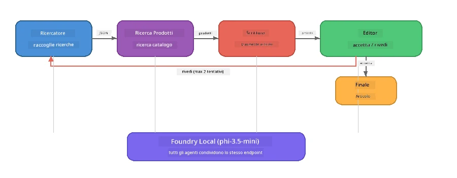

# Parte 7: Zava Creative Writer - Applicazione Capstone

> **Obiettivo:** Esplorare un'applicazione multi-agente in stile produzione dove quattro agenti specializzati collaborano per produrre articoli di qualità da rivista per Zava Retail DIY - eseguendo interamente sul tuo dispositivo con Foundry Local.

Questo è il **laboratorio capstone** del workshop. Riunisce tutto ciò che hai imparato - integrazione SDK (Parte 3), recupero da dati locali (Parte 4), personalità degli agenti (Parte 5), e orchestrazione multi-agente (Parte 6) - in un'applicazione completa disponibile in **Python**, **JavaScript** e **C#**.

---

## Cosa Esplorerai

| Concetto | Dove nel Zava Writer |
|---------|----------------------------|
| Caricamento modello a 4 fasi | Il modulo di configurazione condiviso avvia Foundry Local |
| Recupero in stile RAG | L'agente prodotto cerca in un catalogo locale |
| Specializzazione agenti | 4 agenti con prompt di sistema distinti |
| Output in streaming | Lo scrittore emette token in tempo reale |
| Passaggi strutturati | Ricercatore → JSON, Editore → decisione JSON |
| Cicli di feedback | L'editore può attivare una nuova esecuzione (max 2 tentativi) |

---

## Architettura

Lo Zava Creative Writer utilizza una **pipeline sequenziale con feedback guidato dall'evaluatore**. Tutte e tre le implementazioni linguistiche seguono la stessa architettura:



### I Quattro Agenti

| Agente | Input | Output | Scopo |
|-------|-------|--------|---------|
| **Ricercatore** | Argomento + feedback opzionale | `{"web": [{url, nome, descrizione}, ...]}` | Raccoglie ricerche di base tramite LLM |
| **Ricerca Prodotto** | Stringa di contesto prodotto | Elenco di prodotti corrispondenti | Query generate dal LLM + ricerca per parole chiave nel catalogo locale |
| **Scrittore** | Ricerca + prodotti + incarico + feedback | Testo dell’articolo in streaming (diviso a `---`) | Bozza in tempo reale di un articolo di qualità da rivista |
| **Editore** | Articolo + feedback autovalutazione scrittore | `{"decision": "accetta/revisione", "editorFeedback": "...", "researchFeedback": "..."}` | Revisiona qualità, attiva retry se necessario |

### Flusso della Pipeline

1. Il **Ricercatore** riceve il tema e produce note di ricerca strutturate (JSON)
2. La **Ricerca Prodotto** interroga il catalogo prodotti locale con termini di ricerca generati dal LLM
3. Lo **Scrittore** combina ricerca + prodotti + incarico in un articolo in streaming, aggiungendo feedback autovalutativo dopo un separatore `---`
4. L'**Editore** revisiona l’articolo e restituisce un verdetto JSON:
   - `"accetta"` → pipeline completa
   - `"revisione"` → il feedback viene rimandato al Ricercatore e allo Scrittore (max 2 tentativi)

---

## Prerequisiti

- Aver completato [Parte 6: Multi-Agent Workflows](part6-multi-agent-workflows.md)
- CLI di Foundry Local installata e modello `phi-3.5-mini` scaricato

---

## Esercizi

### Esercizio 1 - Esegui lo Zava Creative Writer

Scegli il tuo linguaggio e avvia l’applicazione:

<details>
<summary><strong>🐍 Python - Servizio Web FastAPI</strong></summary>

La versione Python gira come **servizio web** con API REST, dimostrando come costruire un backend di produzione.

**Setup:**
```bash
cd zava-creative-writer-local/src/api
python -m venv venv

# Windows (PowerShell):
venv\Scripts\Activate.ps1
# macOS:
source venv/bin/activate

pip install -r requirements.txt
```

**Avvio:**
```bash
uvicorn main:app --reload
```

**Test:**
```bash
curl -X POST http://localhost:8000/api/article \
  -H "Content-Type: application/json" \
  -d '{
    "research": "DIY home improvement trends",
    "products": "power tools and paints",
    "assignment": "Write an article about weekend renovation projects for DIY enthusiasts"
  }'
```

La risposta viene trasmessa come messaggi JSON delimitati da newline che mostrano i progressi di ogni agente.

</details>

<details>
<summary><strong>📦 JavaScript - CLI Node.js</strong></summary>

La versione JavaScript gira come **applicazione CLI**, stampando i progressi degli agenti e l’articolo direttamente nella console.

**Setup:**
```bash
cd zava-creative-writer-local/src/javascript
npm install
```

**Avvio:**
```bash
node main.mjs
```

Vedrai:
1. Caricamento modello Foundry Local (con barra di progresso se in download)
2. Ogni agente esegue in sequenza con messaggi di stato
3. L’articolo trasmesso in streaming nella console in tempo reale
4. La decisione accetta/revisione dell’editore

</details>

<details>
<summary><strong>💜 C# - App console .NET</strong></summary>

La versione C# gira come **app console .NET** con la stessa pipeline e output in streaming.

**Setup:**
```bash
cd zava-creative-writer-local/src/csharp
dotnet restore
```

**Avvio:**
```bash
dotnet run
```

Stesso modello di output della versione JavaScript - messaggi di stato agente, articolo in streaming e verdetto dell’editore.

</details>

---

### Esercizio 2 - Studia la Struttura del Codice

Ogni implementazione linguistica ha gli stessi componenti logici. Confronta le strutture:

**Python** (`src/api/`):
| File | Scopo |
|------|---------|
| `foundry_config.py` | Manager, modello e client Foundry Local condivisi (inizializzazione 4 fasi) |
| `orchestrator.py` | Coordinamento pipeline con loop di feedback |
| `main.py` | Endpoint FastAPI (`POST /api/article`) |
| `agents/researcher/researcher.py` | Ricerca LLM con output JSON |
| `agents/product/product.py` | Query generate da LLM + ricerca per parole chiave |
| `agents/writer/writer.py` | Generazione articolo in streaming |
| `agents/editor/editor.py` | Decisione accetta/revisione in JSON |

**JavaScript** (`src/javascript/`):
| File | Scopo |
|------|---------|
| `foundryConfig.mjs` | Config condivisa Foundry Local (4-step init con barra di progresso) |
| `main.mjs` | Orchestratore + punto d’ingresso CLI |
| `researcher.mjs` | Agente ricerca LLM |
| `product.mjs` | Generazione query LLM + ricerca per parole chiave |
| `writer.mjs` | Generazione articolo in streaming (generatore async) |
| `editor.mjs` | Decisione accetta/revisione JSON |
| `products.mjs` | Dati catalogo prodotti |

**C#** (`src/csharp/`):
| File | Scopo |
|------|---------|
| `Program.cs` | Pipeline completa: caricamento modello, agenti, orchestratore, loop di feedback |
| `ZavaCreativeWriter.csproj` | Progetto .NET 9 con pacchetti Foundry Local + OpenAI |

> **Nota di design:** Python separa ogni agente in file/directory proprie (buono per team grandi). JavaScript usa un modulo per agente (buono per progetti medi). C# tiene tutto in un singolo file con funzioni locali (buono per esempi autonomi). In produzione, scegli il pattern che meglio si adatta alle convenzioni del tuo team.

---

### Esercizio 3 - Traccia la Configurazione Condivisa

Ogni agente nella pipeline condivide un singolo client modello Foundry Local. Esamina come è configurato in ogni linguaggio:

<details>
<summary><strong>🐍 Python - foundry_config.py</strong></summary>

```python
from foundry_local import FoundryLocalManager

MODEL_ALIAS = "phi-3.5-mini"

# Passo 1: Crea il manager e avvia il servizio Foundry Local
manager = FoundryLocalManager()
manager.start_service()

# Passo 2: Verifica se il modello è già scaricato
cached = manager.list_cached_models()
catalog_info = manager.get_model_info(MODEL_ALIAS)
is_cached = any(m.id == catalog_info.id for m in cached) if catalog_info else False

if not is_cached:
    manager.download_model(MODEL_ALIAS)

# Passo 3: Carica il modello in memoria
manager.load_model(MODEL_ALIAS)
model_id = manager.get_model_info(MODEL_ALIAS).id

# Client OpenAI condiviso
client = openai.OpenAI(base_url=manager.endpoint, api_key=manager.api_key)
```

Tutti gli agenti importano `from foundry_config import client, model_id`.

</details>

<details>
<summary><strong>📦 JavaScript - foundryConfig.mjs</strong></summary>

```javascript
import { FoundryLocalManager } from "foundry-local-sdk";
import { OpenAI } from "openai";

FoundryLocalManager.create({ appName: "ZavaCreativeWriter" });
const manager = FoundryLocalManager.instance;
await manager.startWebService();

// Controlla la cache → scarica → carica (nuovo modello SDK)
const catalog = manager.catalog;
const model = await catalog.getModel(MODEL_ALIAS);
if (!model.isCached) {
  console.log(`Downloading model: ${MODEL_ALIAS}...`);
  await model.download();
}
await model.load();

const client = new OpenAI({ baseURL: manager.urls[0] + "/v1", apiKey: "foundry-local" });
const modelId = model.id;
export { client, modelId };
```

Tutti gli agenti importano `{ client, modelId } from "./foundryConfig.mjs"`.

</details>

<details>
<summary><strong>💜 C# - inizio di Program.cs</strong></summary>

```csharp
await FoundryLocalManager.CreateAsync(
    new Configuration
    {
        AppName = "ZavaCreativeWriter",
        Web = new Configuration.WebService { Urls = "http://127.0.0.1:0" }
    }, NullLogger.Instance, default);
var manager = FoundryLocalManager.Instance;
await manager.StartWebServiceAsync(default);

var catalog = await manager.GetCatalogAsync(default);
var catalogModel = await catalog.GetModelAsync(alias, default);
var isCached = await catalogModel.IsCachedAsync(default);
if (!isCached)
    await catalogModel.DownloadAsync(null, default);

await catalogModel.LoadAsync(default);
var key = new ApiKeyCredential("foundry-local");
var chatClient = new OpenAIClient(key, new OpenAIClientOptions
{
    Endpoint = new Uri(manager.Urls[0] + "/v1")
}).GetChatClient(catalogModel.Id);
```

Il `chatClient` viene poi passato a tutte le funzioni agente nello stesso file.

</details>

> **Pattern chiave:** Il modello di caricamento modello (start service → controllo cache → download → caricamento) garantisce che l’utente veda progressi chiari e che il modello venga scaricato una sola volta. È una best practice per qualsiasi applicazione Foundry Local.

---

### Esercizio 4 - Comprendere il Ciclo di Feedback

Il ciclo di feedback è ciò che rende questa pipeline "intelligente" - l’Editore può mandare il lavoro indietro per revisione. Traccia la logica:

```
Orchestrator:
  1. researcher.research(topic, "No Feedback")    ← first pass
  2. product.findProducts(productContext)
  3. writer.write(research, products, assignment)  ← streams article
  4. Split article at "---" → article + writerFeedback
  5. editor.edit(article, writerFeedback)

  WHILE editor says "revise" AND retryCount < 2:
    6. researcher.research(topic, editor.researchFeedback)  ← refined
    7. writer.write(research, products, editor.editorFeedback)
    8. editor.edit(newArticle, newWriterFeedback)
    9. retryCount++
```

**Domande da considerare:**
- Perché il limite di retry è impostato a 2? Cosa succede se lo aumenti?
- Perché il ricercatore riceve `researchFeedback` mentre lo scrittore riceve `editorFeedback`?
- Cosa succederebbe se l’editore dicesse sempre "revisione"?

---

### Esercizio 5 - Modifica un Agente

Prova a cambiare il comportamento di un agente e osserva come influisce sulla pipeline:

| Modifica | Cosa cambiare |
|-------------|----------------|
| **Editore più severo** | Cambia il prompt di sistema dell’editore per richiedere sempre almeno una revisione |
| **Articoli più lunghi** | Cambia il prompt dello scrittore da "800-1000 parole" a "1500-2000 parole" |
| **Prodotti diversi** | Aggiungi o modifica prodotti nel catalogo prodotti |
| **Nuovo argomento di ricerca** | Cambia il `researchContext` di default con un soggetto diverso |
| **Ricercatore solo JSON** | Fai restituire al ricercatore 10 elementi invece di 3-5 |

> **Consiglio:** Poiché tutte e tre le lingue implementano la stessa architettura, puoi fare la stessa modifica nel linguaggio con cui ti senti più a tuo agio.

---

### Esercizio 6 - Aggiungi un Quinto Agente

Estendi la pipeline con un nuovo agente. Ecco alcune idee:

| Agente | Dove nella pipeline | Scopo |
|-------|-------------------|---------|
| **Fact-Checker** | Dopo lo Scrittore, prima dell’Editore | Verifica le affermazioni rispetto ai dati di ricerca |
| **SEO Optimiser** | Dopo l’Editore che accetta | Aggiunge meta description, keyword, slug |
| **Illustratore** | Dopo l’Editore che accetta | Genera prompt per immagini per l’articolo |
| **Traduttore** | Dopo l’Editore che accetta | Traduce l’articolo in un’altra lingua |

**Passaggi:**
1. Scrivi il prompt di sistema dell’agente
2. Crea la funzione agente (in linea con il pattern esistente nel tuo linguaggio)
3. Inseriscilo nell’orchestratore nel punto giusto
4. Aggiorna output/log per mostrare il contributo del nuovo agente

---

## Come Foundry Local e l’Agent Framework lavorano insieme

Questa applicazione dimostra il pattern raccomandato per costruire sistemi multi-agente con Foundry Local:

| Livello | Componente | Ruolo |
|-------|-----------|------|
| **Runtime** | Foundry Local | Scarica, gestisce e serve il modello localmente |
| **Client** | OpenAI SDK | Invia completamenti chat all’endpoint locale |
| **Agente** | Prompt di sistema + chiamata chat | Comportamento specializzato tramite istruzioni mirate |
| **Orchestratore** | Coordinatore pipeline | Gestisce flusso dati, sequenze, e cicli di feedback |
| **Framework** | Microsoft Agent Framework | Fornisce l’astrazione `ChatAgent` e i pattern |

L’intuizione chiave: **Foundry Local sostituisce il backend cloud, non l’architettura dell’applicazione.** Gli stessi pattern agent, strategie di orchestrazione e passaggi strutturati che funzionano con modelli cloud-hosted funzionano identici con modelli locali — basta puntare il client all’endpoint locale invece che a uno Azure.

---

## Punti Chiave

| Concetto | Cosa Hai Imparato |
|---------|-----------------|
| Architettura di produzione | Come strutturare un’app multi-agente con config condivisa e agenti separati |
| Caricamento modello a 4 fasi | Best practice per inizializzare Foundry Local con progresso visibile all’utente |
| Specializzazione agenti | Ognuno dei 4 agenti ha istruzioni mirate e un formato di output specifico |
| Generazione in streaming | Lo scrittore emette token in tempo reale, abilitando UI reattive |
| Cicli di feedback | Retry guidati dall’editore migliorano la qualità senza intervento umano |
| Pattern cross-language | La stessa architettura funziona in Python, JavaScript e C# |
| Locale = pronto produzione | Foundry Local serve la stessa API compatibile OpenAI usata in cloud |

---

## Prossimo Passo

Continua con [Parte 8: Evaluation-Led Development](part8-evaluation-led-development.md) per costruire un framework sistematico di valutazione per i tuoi agenti, usando dataset golden, controlli basati su regole e punteggi giudicati da LLM.

---

<!-- CO-OP TRANSLATOR DISCLAIMER START -->
**Disclaimer**:  
Questo documento è stato tradotto utilizzando il servizio di traduzione AI [Co-op Translator](https://github.com/Azure/co-op-translator). Sebbene ci impegniamo per l'accuratezza, si prega di notare che le traduzioni automatizzate possono contenere errori o inesattezze. Il documento originale nella sua lingua nativa deve essere considerato la fonte autorevole. Per informazioni critiche, si raccomanda una traduzione professionale umana. Non siamo responsabili per eventuali fraintendimenti o interpretazioni errate derivanti dall'uso di questa traduzione.
<!-- CO-OP TRANSLATOR DISCLAIMER END -->