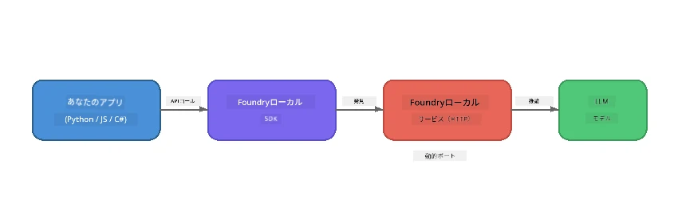

# Part 1: Foundry Localの使い方入門


## Foundry Localとは？

[Foundry Local](https://foundrylocal.ai) は、インターネット不要、クラウドコストゼロ、完全なデータプライバシーで、<strong>オープンソースのAI言語モデルを直接ご自身のコンピューター上で実行</strong>できるツールです。これにより:

- <strong>モデルをローカルにダウンロードして実行</strong>し、ハードウェア（GPU、CPU、またはNPU）を自動的に最適化します
- <strong>OpenAI互換API</strong>を提供し、おなじみのSDKやツールを利用可能にします
- <strong>Azureサブスクリプション不要</strong>でサインアップも不要、インストール後すぐに開発を開始できます

まるで完全に自分のマシン上で動作するプライベートAIを持つような感覚です。

## 学習目標

このラボの終了時には以下ができるようになります。

- 使用しているOSにFoundry Local CLIをインストールする
- モデルエイリアスとは何か、どう機能するかを理解する
- 最初のローカルAIモデルをダウンロードして実行する
- コマンドラインからローカルモデルにチャットメッセージを送る
- ローカルモデルとクラウドモデルの違いを理解する

---

## 前提条件

### システム要件

| 要件 | 最小 | 推奨 |
|-------------|---------|-------------|
| **RAM** | 8 GB | 16 GB |
| <strong>ディスク容量</strong> | 5 GB（モデル用） | 10 GB |
| **CPU** | 4コア | 8コア以上 |
| **GPU** | オプション | NVIDIA (CUDA 11.8以上) |
| **OS** | Windows 10/11（x64/ARM）、Windows Server 2025、macOS 13以上 | - |

> **注意:** Foundry Localはハードウェアに最適なモデルバリアントを自動的に選択します。NVIDIA GPUがあればCUDAアクセラレーションを使用し、Qualcomm NPUがあればそれを利用し、それ以外は最適化されたCPUバリアントを使用します。

### Foundry Local CLIのインストール

**Windows**（PowerShell）:
```powershell
winget install Microsoft.FoundryLocal
```

**macOS**（Homebrew）:
```bash
brew tap microsoft/foundrylocal
brew install foundrylocal
```

> **注意:** Foundry Localは現在、WindowsとmacOSのみ対応しており、Linuxはサポートされていません。

インストール確認：
```bash
foundry --version
```

---

## ラボ演習

### 演習1: 利用可能なモデルを確認する

Foundry Localには事前最適化されたオープンソースモデルのカタログが含まれています。リスト表示してみましょう。

```bash
foundry model list
```

以下のようなモデルが表示されます：
- `phi-3.5-mini` - マイクロソフトの3.8Bパラメータモデル（高速で高品質）
- `phi-4-mini` - 新しくより高性能なPhiモデル
- `phi-4-mini-reasoning` - チェーンオブソート推論を持つPhiモデル（`<think>`タグ使用）
- `phi-4` - マイクロソフト最大のPhiモデル（10.4 GB）
- `qwen2.5-0.5b` - 非常に小型で高速（低リソースデバイス向け）
- `qwen2.5-7b` - ツール呼び出し対応の強力な汎用モデル
- `qwen2.5-coder-7b` - コード生成用に最適化
- `deepseek-r1-7b` - 高度な推論モデル
- `gpt-oss-20b` - 大規模オープンソースモデル（MITライセンス、12.5 GB）
- `whisper-base` - 音声からテキストへの文字起こし（383 MB）
- `whisper-large-v3-turbo` - 高精度文字起こし（9 GB）

> **モデルエイリアスとは？** `phi-3.5-mini`のようなエイリアスはショートカットです。このエイリアスを使うとFoundry Localが自動的に、あなたのハードウェアに最適なバリアント（NVIDIA GPUならCUDA版、そうでなければCPU最適化版）をダウンロードします。ユーザーは適切なバリアントを選ぶ心配がありません。

### 演習2: 最初のモデルを実行する

モデルをダウンロードして対話的にチャットを開始しましょう：

```bash
foundry model run phi-3.5-mini
```

初回起動時、Foundry Localは：
1. ハードウェアを検出し、
2. 最適なモデルバリアントをダウンロード（数分かかることがあります）
3. メモリにモデルをロードし、
4. 対話型チャットセッションを開始します

いくつか質問してみましょう：
```
You: What is the golden ratio?
You: Can you explain it as if I were 10 years old?
You: Write a haiku about mathematics
```

終了するには `exit` と入力するか `Ctrl+C` を押してください。

### 演習3: モデルを事前ダウンロードする

チャットを開始せずにモデルだけをダウンロードしたい場合：

```bash
foundry model download phi-3.5-mini
```

既にローカルにダウンロード済みのモデルを確認するには：

```bash
foundry cache list
```

### 演習4: アーキテクチャを理解する

Foundry Localは<strong>ローカルHTTPサービス</strong>として動作し、OpenAI互換のREST APIを公開します。つまり:

1. サービスは<strong>動的ポート</strong>（起動のたびに異なるポート）で開始され、
2. SDKを使って実際のエンドポイントURLを発見し、
3. <strong>任意の</strong>OpenAI互換クライアントライブラリで利用できる



> **重要:** Foundry Localは起動ごとに<strong>動的ポート</strong>を割り当てます。 `localhost:5272` のようにポート番号を固定しないでください。必ずSDKを使って現在のURL（Pythonなら`manager.endpoint`、JavaScriptなら`manager.urls[0]`）を取得してください。

---

## まとめ

| コンセプト | 学んだこと |
|---------|------------------|
| デバイス内AI | Foundry LocalはクラウドやAPIキー、料金なしに完全に端末上でモデルを実行します |
| モデルエイリアス | `phi-3.5-mini` のようなエイリアスはハードウェアに最適なバリアントを自動選択します |
| 動的ポート | サービスは動的ポートで動作するため、常にSDKでエンドポイントを発見する必要があります |
| CLIとSDK | CLI（`foundry model run`）やSDK経由でモデルと対話可能です |

---

## 次のステップ

[Part 2: Foundry Local SDK Deep Dive](part2-foundry-local-sdk.md) に進み、モデル管理、サービス操作、キャッシュ管理をプログラムから行うSDK APIを習得しましょう。