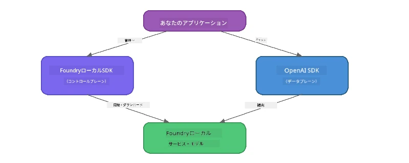

# パート3: OpenAIと共にFoundry Local SDKを使う

## 概要

パート1ではFoundry Local CLIを使ってモデルを対話的に実行しました。パート2ではSDKのAPI全体を探索しました。今回はSDKとOpenAI互換APIを使って<strong>Foundry Localをアプリケーションに統合する方法</strong>を学びます。

Foundry Localは3つの言語向けにSDKを提供しています。最も慣れている言語を選んでください。概念はすべて共通です。

## 学習目標

このラボを終えるころには、以下のことができるようになります：

- 使用言語（Python、JavaScript、C#）に合ったFoundry Local SDKのインストール
- `FoundryLocalManager`を初期化してサービス起動、キャッシュ確認、モデルのダウンロードおよびロード
- OpenAI SDKを使いローカルモデルに接続
- チャット完了を送信しストリーミングレスポンスを処理
- 動的ポートアーキテクチャを理解

---

## 前提条件

まず[パート1: Foundry Localのはじめかた](part1-getting-started.md)と[パート2: Foundry Local SDK 詳細解説](part2-foundry-local-sdk.md)を完了してください。

以下のいずれかのランタイムをインストールしてください：
- **Python 3.9+** - [python.org/downloads](https://www.python.org/downloads/)
- **Node.js 18+** - [nodejs.org](https://nodejs.org/)
- **.NET 9.0+** - [dot.net/download](https://dotnet.microsoft.com/download)

---

## 概念: SDKの仕組み

Foundry Local SDKは<strong>制御プレーン</strong>（サービス起動、モデルダウンロードの管理）を担い、OpenAI SDKは<strong>データプレーン</strong>（プロンプトの送信、完了の受信）を担います。



---

## ラボ演習

### 演習1: 環境セットアップ

<details>
<summary><b>🐍 Python</b></summary>

```bash
cd python
python -m venv venv

# 仮想環境を有効化します：
# Windows（PowerShell）：
venv\Scripts\Activate.ps1
# Windows（コマンドプロンプト）：
venv\Scripts\activate.bat
# macOS：
source venv/bin/activate

pip install -r requirements.txt
```

`requirements.txt`は以下をインストールします:
- `foundry-local-sdk` - Foundry Local SDK（`foundry_local`としてインポート）
- `openai` - OpenAI Python SDK
- `agent-framework` - Microsoft Agent Framework（後の章で使用）

</details>

<details>
<summary><b>📘 JavaScript</b></summary>

```bash
cd javascript
npm install
```

`package.json`は以下をインストールします:
- `foundry-local-sdk` - Foundry Local SDK
- `openai` - OpenAI Node.js SDK

</details>

<details>
<summary><b>💜 C#</b></summary>

```bash
cd csharp
dotnet restore
dotnet build
```

`csharp.csproj`では以下を使用します:
- `Microsoft.AI.Foundry.Local` - Foundry Local SDK (NuGet)
- `OpenAI` - OpenAI C# SDK (NuGet)

> **プロジェクト構造:** C#プロジェクトは`Program.cs`にコマンドラインルーターを持ち、それぞれの例ファイルへ振り分けます。このパートは`dotnet run chat`（または単に`dotnet run`）で実行します。他のパートは`dotnet run rag`、`dotnet run agent`、`dotnet run multi`です。

</details>

---

### 演習2: 基本的なチャット完了

言語別の基本チャット例を開きコードを確認してください。各スクリプトは次の3ステップで動作します：

1. <strong>サービス開始</strong> - `FoundryLocalManager`がFoundry Localランタイムを起動
2. <strong>モデルダウンロードとロード</strong> - キャッシュ確認、必要に応じてダウンロード、メモリにロード
3. **OpenAIクライアント作成** - ローカルエンドポイントに接続しストリーミングチャット完了を送信

<details>
<summary><b>🐍 Python - <code>python/foundry-local.py</code></b></summary>

```python
import sys
import openai
from foundry_local import FoundryLocalManager

alias = "phi-3.5-mini"

# ステップ1：FoundryLocalManagerを作成してサービスを起動する
print("Starting Foundry Local service...")
manager = FoundryLocalManager()
manager.start_service()

# ステップ2：モデルが既にダウンロードされているか確認する
cached = manager.list_cached_models()
catalog_info = manager.get_model_info(alias)
is_cached = any(m.id == catalog_info.id for m in cached) if catalog_info else False

if is_cached:
    print(f"Model already downloaded: {alias}")
else:
    print(f"Downloading model: {alias} (this may take several minutes)...")
    manager.download_model(alias)
    print(f"Download complete: {alias}")

# ステップ3：モデルをメモリにロードする
print(f"Loading model: {alias}...")
manager.load_model(alias)

# LOCALのFoundryサービスを指すOpenAIクライアントを作成する
client = openai.OpenAI(
    base_url=manager.endpoint,   # 動的ポート - ハードコードしないこと！
    api_key=manager.api_key
)

# ストリーミングチャット完了を生成する
stream = client.chat.completions.create(
    model=manager.get_model_info(alias).id,
    messages=[{"role": "user", "content": "What is the golden ratio?"}],
    stream=True,
)

for chunk in stream:
    if chunk.choices[0].delta.content is not None:
        print(chunk.choices[0].delta.content, end="", flush=True)
print()
```

**実行方法:**
```bash
python foundry-local.py
```

</details>

<details>
<summary><b>📘 JavaScript - <code>javascript/foundry-local.mjs</code></b></summary>

```javascript
import { OpenAI } from "openai";
import { FoundryLocalManager } from "foundry-local-sdk";

const alias = "phi-3.5-mini";

// ステップ1: Foundry Localサービスを起動する
console.log("Starting Foundry Local service...");
FoundryLocalManager.create({ appName: "FoundryLocalWorkshop" });
const manager = FoundryLocalManager.instance;
await manager.startWebService();

// ステップ2: モデルが既にダウンロードされているか確認する
const catalog = manager.catalog;
const model = await catalog.getModel(alias);

if (model.isCached) {
  console.log(`Model already downloaded: ${alias}`);
} else {
  console.log(`Downloading model: ${alias} (this may take several minutes)...`);
  await model.download();
  console.log(`Download complete: ${alias}`);
}

// ステップ3: モデルをメモリにロードする
console.log(`Loading model: ${alias}...`);
await model.load();
console.log(`Model loaded: ${model.id}`);

// LOCAL Foundryサービスを指すOpenAIクライアントを作成する
const client = new OpenAI({
  baseURL: manager.urls[0] + "/v1",   // 動的ポート - ハードコードしないでください！
  apiKey: "foundry-local",
});

// ストリーミングチャット補完を生成する
const stream = await client.chat.completions.create({
  model: model.id,
  messages: [{ role: "user", content: "What is the golden ratio?" }],
  stream: true,
});

for await (const chunk of stream) {
  if (chunk.choices[0]?.delta?.content) {
    process.stdout.write(chunk.choices[0].delta.content);
  }
}
console.log();
```

**実行方法:**
```bash
node foundry-local.mjs
```

</details>

<details>
<summary><b>💜 C# - <code>csharp/BasicChat.cs</code></b></summary>

```csharp
using Microsoft.AI.Foundry.Local;
using Microsoft.Extensions.Logging.Abstractions;
using OpenAI;
using OpenAI.Chat;
using System.ClientModel;

var alias = "phi-3.5-mini";

// Step 1: Start the Foundry Local service
Console.WriteLine("Starting Foundry Local service...");
await FoundryLocalManager.CreateAsync(
    new Configuration
    {
        AppName = "FoundryLocalSamples",
        Web = new Configuration.WebService { Urls = "http://127.0.0.1:0" }
    }, NullLogger.Instance, default);
var manager = FoundryLocalManager.Instance;
await manager.StartWebServiceAsync(default);

// Step 2: Get the model from the catalog
var catalog = await manager.GetCatalogAsync(default);
var model = await catalog.GetModelAsync(alias, default);

// Step 3: Check if the model is already downloaded
var isCached = await model.IsCachedAsync(default);

if (isCached)
{
    Console.WriteLine($"Model already downloaded: {alias}");
}
else
{
    Console.WriteLine($"Downloading model: {alias} (this may take several minutes)...");
    await model.DownloadAsync(null, default);
    Console.WriteLine($"Download complete: {alias}");
}

// Step 4: Load the model into memory
Console.WriteLine($"Loading model: {alias}...");
await model.LoadAsync(default);
Console.WriteLine($"Loaded model: {model.Id}");
Console.WriteLine($"Endpoint: {manager.Urls[0]}");

// Create OpenAI client pointing to the LOCAL Foundry service
var key = new ApiKeyCredential("foundry-local");
var client = new OpenAIClient(key, new OpenAIClientOptions
{
    Endpoint = new Uri(manager.Urls[0] + "/v1")  // Dynamic port - never hardcode!
});

var chatClient = client.GetChatClient(model.Id);

// Stream a chat completion
var completionUpdates = chatClient.CompleteChatStreaming("What is the golden ratio?");

foreach (var update in completionUpdates)
{
    if (update.ContentUpdate.Count > 0)
    {
        Console.Write(update.ContentUpdate[0].Text);
    }
}
Console.WriteLine();
```

**実行方法:**
```bash
dotnet run chat
```

</details>

---

### 演習3: プロンプトの実験

基本例が動作したら以下を試してみてください：

1. <strong>ユーザーメッセージの変更</strong> - 別の質問を投げる
2. <strong>システムプロンプト追加</strong> - モデルにキャラクターを与える
3. **ストリーミングOFF** - `stream=False`にして応答を一括取得して印刷
4. <strong>異なるモデルを試す</strong> - 別のモデルに`phi-3.5-mini`の別名を`foundry model list`から変更

<details>
<summary><b>🐍 Python</b></summary>

```python
# システムプロンプトを追加 - モデルにペルソナを与える:
stream = client.chat.completions.create(
    model=manager.get_model_info(alias).id,
    messages=[
        {"role": "system", "content": "You are a pirate. Answer everything in pirate speak."},
        {"role": "user", "content": "What is the golden ratio?"}
    ],
    stream=True,
)

# またはストリーミングをオフにする:
response = client.chat.completions.create(
    model=manager.get_model_info(alias).id,
    messages=[{"role": "user", "content": "What is the golden ratio?"}],
    stream=False,
)
print(response.choices[0].message.content)
```

</details>

<details>
<summary><b>📘 JavaScript</b></summary>

```javascript
// システムプロンプトを追加 - モデルにペルソナを与える：
const stream = await client.chat.completions.create({
  model: modelInfo.id,
  messages: [
    { role: "system", content: "You are a pirate. Answer everything in pirate speak." },
    { role: "user", content: "What is the golden ratio?" },
  ],
  stream: true,
});

// またはストリーミングをオフにする：
const response = await client.chat.completions.create({
  model: modelInfo.id,
  messages: [{ role: "user", content: "What is the golden ratio?" }],
  stream: false,
});
console.log(response.choices[0].message.content);
```

</details>

<details>
<summary><b>💜 C#</b></summary>

```csharp
// Add a system prompt - give the model a persona:
var completionUpdates = chatClient.CompleteChatStreaming(
    new ChatMessage[]
    {
        new SystemChatMessage("You are a pirate. Answer everything in pirate speak."),
        new UserChatMessage("What is the golden ratio?")
    }
);

// Or turn off streaming:
var response = chatClient.CompleteChat("What is the golden ratio?");
Console.WriteLine(response.Value.Content[0].Text);
```

</details>

---

### SDKメソッドリファレンス

<details>
<summary><b>🐍 Python SDK メソッド</b></summary>

| メソッド | 目的 |
|--------|---------|
| `FoundryLocalManager()` | マネージャーインスタンス作成 |
| `manager.start_service()` | Foundry Localサービス起動 |
| `manager.list_cached_models()` | デバイスにダウンロード済みのモデル一覧取得 |
| `manager.get_model_info(alias)` | モデルIDとメタデータ取得 |
| `manager.download_model(alias, progress_callback=fn)` | モデルを進捗コールバック付きでダウンロード |
| `manager.load_model(alias)` | モデルをメモリにロード |
| `manager.endpoint` | 動的エンドポイントURL取得 |
| `manager.api_key` | APIキー取得（ローカル用プレースホルダ） |

</details>

<details>
<summary><b>📘 JavaScript SDK メソッド</b></summary>

| メソッド | 目的 |
|--------|---------|
| `FoundryLocalManager.create({ appName })` | マネージャーインスタンス作成 |
| `FoundryLocalManager.instance` | シングルトンマネージャーアクセス |
| `await manager.startWebService()` | Foundry Localサービス起動 |
| `await manager.catalog.getModel(alias)` | カタログからモデル取得 |
| `model.isCached` | モデルが既にダウンロードされているか確認 |
| `await model.download()` | モデルをダウンロード |
| `await model.load()` | モデルをメモリにロード |
| `model.id` | OpenAI API用のモデルID取得 |
| `manager.urls[0] + "/v1"` | 動的エンドポイントURL取得 |
| `"foundry-local"` | APIキー（ローカル用プレースホルダ） |

</details>

<details>
<summary><b>💜 C# SDK メソッド</b></summary>

| メソッド | 目的 |
|--------|---------|
| `FoundryLocalManager.CreateAsync(config)` | マネージャー作成と初期化 |
| `manager.StartWebServiceAsync()` | Foundry Localウェブサービス起動 |
| `manager.GetCatalogAsync()` | モデルカタログ取得 |
| `catalog.ListModelsAsync()` | 利用可能モデル一覧取得 |
| `catalog.GetModelAsync(alias)` | エイリアスでモデル取得 |
| `model.IsCachedAsync()` | モデルがダウンロード済みか確認 |
| `model.DownloadAsync()` | モデルをダウンロード |
| `model.LoadAsync()` | モデルをメモリにロード |
| `manager.Urls[0]` | 動的エンドポイントURL取得 |
| `new ApiKeyCredential("foundry-local")` | ローカル用APIキー認証情報 |

</details>

---

### 演習4: ネイティブChatClientの使用（OpenAI SDK代替）

演習2・3ではOpenAI SDKをチャット完了に使いましたが、JavaScriptとC# SDKはOpenAI SDKを不要にする<strong>ネイティブChatClient</strong>を提供しています。

<details>
<summary><b>📘 JavaScript - <code>model.createChatClient()</code></b></summary>

```javascript
import { FoundryLocalManager } from "foundry-local-sdk";

const alias = "phi-3.5-mini";

FoundryLocalManager.create({ appName: "ChatClientDemo" });
const manager = FoundryLocalManager.instance;
await manager.startWebService();

const model = await manager.catalog.getModel(alias);
if (!model.isCached) await model.download();
await model.load();

// OpenAIのインポートは不要 — モデルから直接クライアントを取得
const chatClient = model.createChatClient();

// 非ストリーミング完了
const response = await chatClient.completeChat([
  { role: "system", content: "You are a pirate. Answer everything in pirate speak." },
  { role: "user", content: "What is the golden ratio?" }
]);
console.log(response.choices[0].message.content);

// ストリーミング完了（コールバックパターンを使用）
await chatClient.completeStreamingChat(
  [{ role: "user", content: "What is the golden ratio?" }],
  (chunk) => {
    if (chunk.choices?.[0]?.delta?.content) {
      process.stdout.write(chunk.choices[0].delta.content);
    }
  }
);
console.log();
```

> **注意:** ChatClientの`completeStreamingChat()`は<strong>コールバック</strong>方式で、非同期イテレータではありません。第二引数に関数を渡してください。

</details>

<details>
<summary><b>💜 C# - <code>model.GetChatClientAsync()</code></b></summary>

```csharp
var catalog = await manager.GetCatalogAsync(default);
var model = await catalog.GetModelAsync("phi-3.5-mini", default);
if (!await model.IsCachedAsync(default))
    await model.DownloadAsync(null, default);
await model.LoadAsync(default);

// No OpenAI NuGet needed — get a client directly from the model
var chatClient = await model.GetChatClientAsync(default);

// Use it like a standard OpenAI ChatClient
var response = chatClient.CompleteChat("What is the golden ratio?");
Console.WriteLine(response.Value.Content[0].Text);
```

</details>

> **どちらを使うべきか:**
> | アプローチ | 適した用途 |
> |----------|----------|
> | OpenAI SDK | パラメータ制御が豊富、本格的アプリ、既存OpenAIコード |
> | ネイティブ ChatClient | 簡易プロトタイプ、依存軽減、セットアップ簡単 |

---

## 重要ポイントのまとめ

| 概念 | 学んだこと |
|---------|------------------|
| 制御プレーン | Foundry Local SDKはサービス起動・モデル管理を担う |
| データプレーン | OpenAI SDKはチャット完了やストリーミングを担う |
| 動的ポート | SDKで常にエンドポイントを取得し、URLはハードコードしない |
| クロス言語 | 同じコードパターンはPython、JavaScript、C#で共通 |
| OpenAI互換性 | 既存OpenAIコードを最小限の変更で利用可能 |
| ネイティブChatClient | `createChatClient()` (JS) / `GetChatClientAsync()` (C#) はOpenAI SDKの代替手段 |

---

## 次のステップ

続けて [パート4: RAGアプリケーション構築](part4-rag-fundamentals.md) を学び、完全デバイス内で動作するRetrieval-Augmented Generationパイプラインを構築する方法を学んでください。