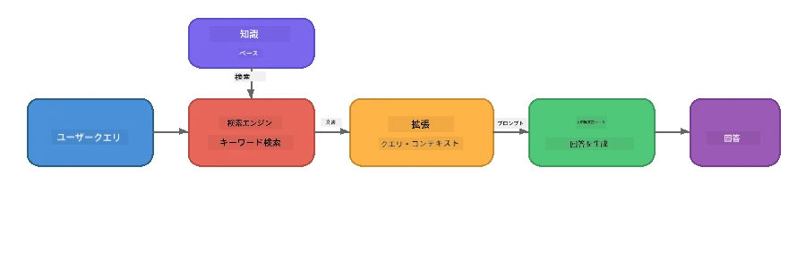

# パート4: Foundry LocalでRAGアプリケーションを構築する

## 概要

大規模言語モデルは強力ですが、その知識は訓練データに含まれていたものに限定されます。**Retrieval-Augmented Generation (RAG)** は、クエリ時に関連するコンテキストを提供することでこれを解決します。コンテキストはあなたの文書、データベース、またはナレッジベースから取得されます。

このラボでは、Foundry Localを用いて<strong>完全にローカルデバイス上で</strong>動作するRAGパイプラインを構築します。クラウドサービスも、ベクトルデータベースも、埋め込みAPIも使わず、ローカルの検索とローカルモデルのみで実現します。

## 学習目標

このラボを終える頃には、以下ができるようになります：

- RAGとは何か、そしてAIアプリケーションにとってなぜ重要かを説明できる
- テキスト文書からローカルナレッジベースを構築できる
- 関連するコンテキストを見つける簡単な検索機能を実装できる
- 取得した事実に基づいたシステムプロンプトを作成できる
- 取得 → 拡張 → 生成のパイプラインをデバイス上で実行できる
- キーワード検索とベクトル検索のトレードオフを理解できる

---

## 前提条件

- [パート3: Foundry Local SDKとOpenAIの使用](part3-sdk-and-apis.md)を完了していること
- Foundry Local CLIがインストールされ、`phi-3.5-mini`モデルがダウンロード済みであること

---

## コンセプト: RAGとは？

RAGなしでは、LLMは訓練データからのみ回答します。それは古くなっていたり、不完全であったり、あなたのプライベート情報が含まれていない可能性があります。

```
User: "What is Zava's return policy?"
LLM:  "I do not have information about Zava's return policy."  ← No context!
```
  
RAGでは、まず関連する文書を<strong>検索し(retrieve)</strong>、そのコンテキストでプロンプトを<strong>拡張した(augment)</strong>うえで、回答を<strong>生成(generate)</strong>します：



重要なポイントは：<strong>モデルが答えを「知っている」必要はなく、正しい文書を「読む」だけでよい</strong>ということです。

---

## ラボ演習

### 演習1: ナレッジベースを理解する

ご自身の言語用のRAG例を開き、ナレッジベースを確認してください。

<details>
<summary><b>🐍 Python: <code>python/foundry-local-rag.py</code></b></summary>

ナレッジベースは`title`と`content`フィールドを持つ辞書のシンプルなリストです：

```python
KNOWLEDGE_BASE = [
    {
        "title": "Foundry Local Overview",
        "content": (
            "Foundry Local brings the power of Azure AI Foundry to your local "
            "device without requiring an Azure subscription..."
        ),
    },
    {
        "title": "Supported Hardware",
        "content": (
            "Foundry Local automatically selects the best model variant for "
            "your hardware. If you have an Nvidia CUDA GPU it downloads the "
            "CUDA-optimized model..."
        ),
    },
    # ... さらに多くのエントリ
]
```
  
各項目は「チャンク」と呼ばれる一つのトピックに焦点を当てた知識の断片を表します。

</details>

<details>
<summary><b>📘 JavaScript: <code>javascript/foundry-local-rag.mjs</code></b></summary>

ナレッジベースは同じ構造のオブジェクト配列を使っています：

```javascript
const KNOWLEDGE_BASE = [
  {
    title: "Foundry Local Overview",
    content:
      "Foundry Local brings the power of Azure AI Foundry to your local " +
      "device without requiring an Azure subscription...",
  },
  {
    title: "Supported Hardware",
    content:
      "Foundry Local automatically selects the best model variant for " +
      "your hardware...",
  },
  // ... さらに多くのエントリ
];
```

</details>

<details>
<summary><b>💜 C#: <code>csharp/RagPipeline.cs</code></b></summary>

ナレッジベースは名前付きタプルのリストを使用しています：

```csharp
private static readonly List<(string Title, string Content)> KnowledgeBase =
[
    ("Foundry Local Overview",
     "Foundry Local brings the power of Azure AI Foundry to your local " +
     "device without requiring an Azure subscription..."),

    ("Supported Hardware",
     "Foundry Local automatically selects the best model variant for " +
     "your hardware..."),

    // ... more entries
];
```

</details>

> <strong>実際のアプリケーションでは</strong>、ナレッジベースはディスク上のファイルやデータベース、検索インデックス、APIから取得されます。このラボではシンプルさを優先しインメモリリストを使用しています。

---

### 演習2: 検索関数を理解する

検索ステップは、ユーザーの質問に最も関連するチャンクを見つけます。この例では<strong>キーワードの重複数</strong>で関連度を計算しています - クエリ内の単語が各チャンクにいくつ含まれているかをカウントします：

<details>
<summary><b>🐍 Python</b></summary>

```python
def retrieve(query: str, top_k: int = 2) -> list[dict]:
    """Return the top-k knowledge chunks most relevant to the query."""
    query_words = set(query.lower().split())
    scored = []
    for chunk in KNOWLEDGE_BASE:
        chunk_words = set(chunk["content"].lower().split())
        overlap = len(query_words & chunk_words)
        scored.append((overlap, chunk))
    scored.sort(key=lambda x: x[0], reverse=True)
    return [item[1] for item in scored[:top_k]]
```

</details>

<details>
<summary><b>📘 JavaScript</b></summary>

```javascript
function retrieve(query, topK = 2) {
  const queryWords = new Set(query.toLowerCase().split(/\s+/));
  const scored = KNOWLEDGE_BASE.map((chunk) => {
    const chunkWords = new Set(chunk.content.toLowerCase().split(/\s+/));
    let overlap = 0;
    for (const w of queryWords) {
      if (chunkWords.has(w)) overlap++;
    }
    return { overlap, chunk };
  });
  scored.sort((a, b) => b.overlap - a.overlap);
  return scored.slice(0, topK).map((s) => s.chunk);
}
```

</details>

<details>
<summary><b>💜 C#</b></summary>

```csharp
private static List<(string Title, string Content)> Retrieve(string query, int topK = 2)
{
    var queryWords = new HashSet<string>(
        query.ToLowerInvariant().Split(' ', StringSplitOptions.RemoveEmptyEntries));

    return KnowledgeBase
        .Select(chunk =>
        {
            var chunkWords = new HashSet<string>(
                chunk.Content.ToLowerInvariant().Split(' ', StringSplitOptions.RemoveEmptyEntries));
            var overlap = queryWords.Intersect(chunkWords).Count();
            return (Overlap: overlap, Chunk: chunk);
        })
        .OrderByDescending(x => x.Overlap)
        .Take(topK)
        .Select(x => x.Chunk)
        .ToList();
}
```

</details>

<strong>動作の流れ</strong>:
1. クエリを単語に分割する
2. 各チャンクでクエリ単語がいくつ含まれているか数える
3. 重複数の高い順にソートする
4. 上位k個の関連チャンクを返す

> **トレードオフ：** キーワード重複は簡単ですが限界があります。類義語や意味を理解できません。本番のRAGシステムは通常、<strong>埋め込みベクトル</strong>と<strong>ベクトルデータベース</strong>を使った意味的検索をします。しかしキーワード重複は良い出発点で追加依存関係も不要です。

---

### 演習3: 拡張プロンプトを理解する

取得したコンテキストはモデルに送る前に<strong>システムプロンプト</strong>に挿入されます：

```python
system_prompt = (
    "You are a helpful assistant. Answer the user's question using ONLY "
    "the information provided in the context below. If the context does "
    "not contain enough information, say so.\n\n"
    f"Context:\n{context_text}"
)
```
  
重要な設計決定：
- **「提供された情報のみ」** - モデルが文脈にない事実を幻覚しないようにする
- **「情報が不十分ならそう答える」** - 正直な「わかりません」回答を促す
- コンテキストはシステムメッセージに含め全ての応答に影響を与える

---

### 演習4: RAGパイプラインを実行する

完全な例を実行してください：

**Python:**
```bash
cd python
python foundry-local-rag.py
```
  
**JavaScript:**
```bash
cd javascript
node foundry-local-rag.mjs
```
  
**C#:**
```bash
cd csharp
dotnet run rag
```
  
以下の3つが出力されるはずです：  
1. <strong>質問文</strong>  
2. <strong>取得したコンテキスト</strong> - ナレッジベースから選ばれたチャンク  
3. <strong>回答</strong> - そのコンテキストのみを使ってモデルが生成した

出力例：
```
Question: How do I install Foundry Local and what hardware does it support?

--- Retrieved Context ---
### Installation
On Windows install Foundry Local with: winget install Microsoft.FoundryLocal...

### Supported Hardware
Foundry Local automatically selects the best model variant for your hardware...
-------------------------

Answer: To install Foundry Local, you can use the following methods depending
on your operating system: On Windows, run `winget install Microsoft.FoundryLocal`.
On macOS, use `brew install microsoft/foundrylocal/foundrylocal`...
```
  
モデルの回答は<strong>取得したコンテキストに基づいており</strong>、ナレッジベース文書の事実のみを言及しています。

---

### 演習5: 実験と拡張

理解を深めるために次の変更を試してください：

1. <strong>質問を変える</strong> - ナレッジベースにある質問とない質問を投げてみる：
   ```python
   question = "What programming languages does Foundry Local support?"  # ← 文脈内
   question = "How much does Foundry Local cost?"                       # ← 文脈外
   ```
  コンテキストになければ、モデルは正しく「わかりません」と言いますか？

2. <strong>新しい知識チャンクを追加</strong> - `KNOWLEDGE_BASE`に新規項目を追加：
   ```python
   {
       "title": "Pricing",
       "content": "Foundry Local is completely free and open source under the MIT license.",
   }
   ```
  その後、価格の質問を再度してみてください。

3. **`top_k`を変える** - 取得するチャンク数を増減：
   ```python
   context_chunks = retrieve(question, top_k=3)  # より多くのコンテキスト
   context_chunks = retrieve(question, top_k=1)  # より少ないコンテキスト
   ```
  コンテキスト量が回答の質にどう影響しますか？

4. <strong>グラウンディング指示を外す</strong> - システムプロンプトを「あなたは親切なアシスタントです」に変えて、モデルが事実を幻覚し始めるか確認してください。

---

## 深掘り: オンデバイス性能のためのRAG最適化

オンデバイスでRAGを動かすと、クラウドでは直面しない制約があります。RAM制約、専用GPUなし（CPU/NPU実行）、小さなモデルコンテキストウィンドウです。以下の設計方針はこれらの制約に対応し、Foundry Localで構築された本格的なローカルRAGアプリケーションのパターンに基づいています。

### チャンク分割戦略：固定サイズスライディングウィンドウ

チャンク分割（文書をどのように分割するか）はRAG設計で最も重要な決定の一つです。オンデバイスでは<strong>固定長スライディングウィンドウ＋重複</strong>が推奨されます：

| パラメータ | 推奨値 | 理由 |
|-----------|------------------|-----|
| <strong>チャンクサイズ</strong> | 約200トークン | 取得コンテキストをコンパクトに保ち、Phi-3.5 Miniのコンテキストウィンドウにシステムプロンプト、会話履歴、生成結果の余裕を残すため |
| <strong>重複</strong> | 約25トークン（12.5%） | チャンク境界の情報損失を防ぐ - 手順や段階的説明に重要 |
| <strong>トークン分割方法</strong> | 空白分割 | 依存関係ゼロ。トークナイザライブラリ不要。計算リソースはすべてLLMに集中 |

重複はスライディングウィンドウのように機能します。新しいチャンクは前のチャンクの終了から25トークン前に始まるので、チャンク境界をまたぐ文も両方のチャンクに現れます。

> **他の戦略ではなぜだめか？**  
> - <strong>文単位分割</strong>はチャンクサイズが不安定。長い安全手順の単一文が分割しにくい  
> - <strong>セクション分割</strong>（`##`見出し）はチャンクサイズに大きなばらつきが出る。モデルのコンテキストウィンドウには大きすぎることもある  
> - <strong>意味的チャンク分割</strong>（埋め込みベースのトピック検出）は取得品質は最高だが、Phi-3.5 Miniと併用するために別モデルがメモリに必要。8-16GB共有メモリのハードでリスクあり

### 検索性能向上：TF-IDFベクトル

このラボのキーワード重複は機能しますが、埋め込みモデルなしでより良い検索をしたい場合、<strong>TF-IDF（ターム頻度逆文書頻度）</strong>が優れた中間手法です：

```
Keyword Overlap  →  TF-IDF Vectors  →  Embedding Models
    (this lab)     (lightweight upgrade)   (production)
  Simple & fast    Better ranking,         Best quality,
  No dependencies  still no ML model       requires embedding model
  ~Basic matching  ~1ms retrieval          ~100-500ms per query
```
  
TF-IDFは各チャンクを、そのチャンク内での単語の重要度を全チャンクを相対化して数値ベクトルに変換します。クエリも同様にベクトル化され、コサイン類似度で比較されます。SQLiteと純粋なJavaScript/Pythonで実装でき、ベクトルデータベースや埋め込みAPIは不要です。

> <strong>性能</strong>： 固定長チャンクでのTF-IDFコサイン類似度検索は通常約<strong>1msの検索速度</strong>。埋め込みモデルを使うと100〜500msかかることが多いです。20以上の文書をチャンク化・インデックス化する処理も1秒未満で完了します。

### 制約のある端末向けエッジ/コンパクトモード

非常に制約の厳しいハード（古いノートPC、タブレット、現場端末）では、以下3つの設定を縮小してリソース消費を減らせます：

| 設定 | 標準モード | エッジ／コンパクトモード |
|---------|--------------|-------------------|
| <strong>システムプロンプト長</strong> | 約300トークン | 約80トークン |
| <strong>最大生成トークン数</strong> | 1024 | 512 |
| **取得チャンク数 (top-k)** | 5 | 3 |

取得チャンク数が減るとモデルが処理するコンテキストが減り、遅延とメモリ使用が減ります。短いシステムプロンプトはコンテキストウィンドウを回答に多く割り当てられます。トークン数が重要な端末ではこのトレードオフが価値あります。

### メモリ内モデルは一つだけ

オンデバイスRAGで最も重要な原則の一つは、<strong>常にモデルは一つだけにすること</strong>。もし検索に埋め込みモデル、生成に言語モデルを両方使うと、NPUやRAMの限られたリソースを二分割してしまいます。キーワード重複やTF-IDFのような軽量検索はこれを回避します：

- 埋め込みモデルがLLMのメモリを奪わない  
- コールドスタートが高速 - 読み込むモデルは1つだけ  
- メモリ使用量が予測可能 - LLMにすべてリソースを割ける  
- 8GBメモリの低スペックマシンでも動く

### SQLiteをローカルベクトルストアとして使う

数百から千程度のチャンクがある小〜中規模文書セットなら、<strong>SQLiteは十分高速</strong>なブルートフォース型コサイン類似度検索を実現し、追加インフラが不要です：

- ディスクに単一の`.db`ファイルだけで済む - サーバーや設定不要  
- 主要言語ランタイムに標準でバンドル（Python `sqlite3`、Node.js `better-sqlite3`、.NET `Microsoft.Data.Sqlite`）  
- 文書チャンクとTF-IDFベクトルを1つのテーブルに保存可能  
- Pinecone、Qdrant、Chroma、FAISSなどはこの規模で不要

### 性能まとめ

これらの設計選択が消費者向けハードウェアでの応答性の良いRAG実行を可能にします：

| 指標 | オンデバイス性能 |
|--------|----------------------|
| <strong>検索遅延</strong> | 約1ms (TF-IDF) から 約5ms (キーワード重複) |
| <strong>文書取込み速度</strong> | 20文書が1秒未満でチャンク化・インデックス化 |
| <strong>メモリ内モデル数</strong> | 1 (LLMのみ。埋め込みモデルなし) |
| <strong>ストレージオーバーヘッド</strong> | SQLite内のチャンク＋ベクトルで1MB未満 |
| <strong>コールドスタート</strong> | モデル1つ読み込みのみ。埋め込みランタイム不要 |
| <strong>対応ハード最低条件</strong> | 8GB RAM、CPUのみ (GPU不要) |

> **アップグレードタイミング:** もし数百以上の長文書、混合コンテンツ（表、コード、散文）、意味的理解を要するクエリを扱う場合は、埋め込みモデルを導入し、ベクトル類似度検索に切り替えることを検討してください。多くのオンデバイス利用ケースで焦点を絞った文書セットには、TF-IDF＋SQLiteが最小リソースで優れた結果をもたらします。

---

## キーコンセプト

| コンセプト | 説明 |
|---------|-------------|
| **検索 (Retrieval)** | ユーザーのクエリに基づきナレッジベースから関連文書を見つけること |
| **拡張 (Augmentation)** | 検索で得た文書をプロンプトに挿入しコンテキスト化すること |
| **生成 (Generation)** | LLMが提供されたコンテキストに基づき回答を生成すること |
| **チャンク分割 (Chunking)** | 大きな文書を小さく焦点を絞った断片に分割すること |
| **グラウンディング (Grounding)** | モデルを提供済みコンテキストの範囲内に制限し幻覚を減らすこと |
| **top-k** | 取得する最も関連性の高いチャンク数 |

---

## 本番環境RAGとこのラボの違い

| 項目 | このラボ | オンデバイス最適化 | クラウド本番 |
|--------|----------|--------------------|-----------------|
| <strong>ナレッジベース</strong> | インメモリリスト | ディスク上ファイル、SQLite | データベース、検索インデックス |
| <strong>検索方法</strong> | キーワード重複 | TF-IDF＋コサイン類似度 | ベクトル埋め込み＋類似度検索 |
| <strong>埋め込み</strong> | 不要 | 不要 (TF-IDFベクトル) | 埋め込みモデル (ローカルまたはクラウド) |
| <strong>ベクトルストア</strong> | 不要 | SQLite（単一`.db`ファイル） | FAISS、Chroma、Azure AI Search等 |
| <strong>チャンク分割</strong> | 手動 | 固定長スライディングウィンドウ (約200トークン、25トークン重複) | 意味的・再帰的チャンク分割 |
| **モデル数（メモリ内）** | 1 (LLM) | 1 (LLM) | 2以上 (埋め込み＋LLM) |
| <strong>取得遅延</strong> | 約5ms | 約1ms | 約100-500ms |
| <strong>スケール</strong> | 5件のドキュメント | 数百件のドキュメント | 数百万件のドキュメント |

ここで学ぶパターン（取得、補強、生成）は、どのスケールでも同じです。取得方法は改善されますが、全体のアーキテクチャは同一のままです。中央の列は軽量な手法でデバイス上で達成可能な範囲を示しており、プライバシー、オフライン機能、および外部サービスへのゼロレイテンシを優先するローカルアプリケーションにとって最適なポイントとなることが多いです。

---

## 重要なポイント

| コンセプト | 学んだこと |
|---------|------------------|
| RAGパターン | 取得 + 補強 + 生成：モデルに適切なコンテキストを与えることでデータに関する質問に答えられる |
| デバイス上 | すべてローカルで実行され、クラウドAPIやベクトルデータベースのサブスクリプションは不要 |
| グラウンディング指示 | 幻覚を防ぐためにシステムプロンプトの制約が重要 |
| キーワードの重複 | シンプルだが効果的な取得の出発点 |
| TF-IDF + SQLite | 埋め込みモデルなしで取得を1ms未満に抑える軽量なアップグレード経路 |
| メモリ内の単一モデル | 制約のあるハードウェアでLLMと埋め込みモデルを同時に読み込むことを回避 |
| チャンクサイズ | 約200トークンの重複が取得精度とコンテキストウィンドウの効率のバランスをとる |
| エッジ/コンパクトモード | 非常に制約のあるデバイスではチャンク数を減らしプロンプトを短くする |
| ユニバーサルパターン | 同一のRAGアーキテクチャがドキュメント、データベース、API、ウィキなど任意のデータソースで機能 |

> **完全なデバイス上RAGアプリケーションを見たいですか？** [Gas Field Local RAG](https://github.com/leestott/local-rag) をご覧ください。Foundry LocalとPhi-3.5 Miniで構築された本格的なオフラインRAGエージェントで、これらの最適化パターンを実際のドキュメントセットで示しています。

---

## 次のステップ

[Part 5: Building AI Agents](part5-single-agents.md) に進み、Microsoft Agent Frameworkを使ったペルソナ、指示、多段会話を備えたインテリジェントエージェントの構築方法を学びましょう。