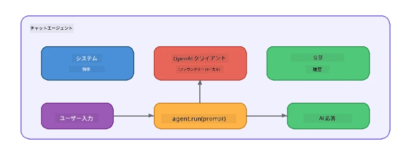

# パート5：エージェントフレームワークでAIエージェントを構築する

> **目標：** 永続的な指示と定義されたペルソナを持つ最初のAIエージェントを、Foundry Localを介したローカルモデルによって構築します。

## AIエージェントとは？

AIエージェントは、言語モデルを<strong>システム指示</strong>でラップし、その振る舞い、個性、制約を定義します。単一のチャット補完呼び出しとは異なり、エージェントは以下を提供します：

- <strong>ペルソナ</strong> - 一貫したアイデンティティ（「あなたは役立つコードレビュアーです」）
- <strong>メモリ</strong> - ターンをまたいだ会話履歴
- <strong>専門性</strong> - よく練られた指示によって駆動される集中した振る舞い



---

## Microsoft Agent Framework

**Microsoft Agent Framework** (AGF) は、異なるモデルバックエンド間で動作する標準的なエージェント抽象化を提供します。このワークショップでは、これをFoundry Localと組み合わせてすべてをローカルマシン上で実行しています—クラウドは必要ありません。

| コンセプト | 説明 |
|---------|-------------|
| `FoundryLocalClient` | Python：サービス起動、モデルのダウンロード/ロード処理とエージェントの作成を担当 |
| `client.as_agent()` | Python：Foundry Localクライアントからエージェントを作成 |
| `AsAIAgent()` | C#：`ChatClient`の拡張メソッド - `AIAgent`を作成 |
| `instructions` | エージェントの振る舞いを形成するシステムプロンプト |
| `name` | マルチエージェントシナリオで便利な人間が読めるラベル |
| `agent.run(prompt)` / `RunAsync()` | ユーザーメッセージを送りエージェントの応答を返す |

> **注意：** Agent FrameworkにはPythonと.NETのSDKがあります。JavaScript用にはOpenAI SDKを直接使用する軽量な`ChatAgent`クラスを実装しています。

---

## 演習

### 演習 1 - エージェントパターンの理解

コードを書く前に、エージェントの主な構成要素を学びましょう：

1. <strong>モデルクライアント</strong> - Foundry LocalのOpenAI互換APIに接続
2. <strong>システム指示</strong> - 「ペルソナ」プロンプト
3. <strong>実行ループ</strong> - ユーザー入力を送信し、出力を受け取る

> **考えてみてください：** システム指示は通常のユーザーメッセージとどのように異なりますか？もし変更したらどうなりますか？

---

### 演習 2 - 単一エージェント例の実行

<details>
<summary><strong>🐍 Python</strong></summary>

**前提条件：**
```bash
cd python
python -m venv venv

# Windows（PowerShell）：
venv\Scripts\Activate.ps1
# macOS：
source venv/bin/activate

pip install -r requirements.txt
```

**実行：**
```bash
python foundry-local-with-agf.py
```

<strong>コード説明</strong> (`python/foundry-local-with-agf.py`):

```python
import asyncio
from agent_framework_foundry_local import FoundryLocalClient

async def main():
    alias = "phi-4-mini"

    # FoundryLocalClient はサービス開始、モデルのダウンロード、読み込みを処理します
    client = FoundryLocalClient(model_id=alias)
    print(f"Client Model ID: {client.model_id}")

    # システム指示でエージェントを作成する
    agent = client.as_agent(
        name="Joker",
        instructions="You are good at telling jokes.",
    )

    # 非ストリーミング：完全な応答を一度に取得する
    result = await agent.run("Tell me a joke about a pirate.")
    print(f"Agent: {result}")

    # ストリーミング：生成され次第結果を取得する
    async for chunk in agent.run("Tell me another joke.", stream=True):
        if chunk.text:
            print(chunk.text, end="", flush=True)

asyncio.run(main())
```

**ポイント：**
- `FoundryLocalClient(model_id=alias)` はサービス起動、ダウンロード、モデルロードを一括処理
- `client.as_agent()` はシステム指示と名前を伴うエージェントを作成
- `agent.run()` は非ストリーミングとストリーミングの両方に対応
- `pip install agent-framework-foundry-local --pre` でインストール可能

</details>

<details>
<summary><strong>📦 JavaScript</strong></summary>

**前提条件：**
```bash
cd javascript
npm install
```

**実行：**
```bash
node foundry-local-with-agent.mjs
```

<strong>コード説明</strong> (`javascript/foundry-local-with-agent.mjs`):

```javascript
import { OpenAI } from "openai";
import { FoundryLocalManager } from "foundry-local-sdk";

class ChatAgent {
  constructor({ client, modelId, instructions, name }) {
    this.client = client;
    this.modelId = modelId;
    this.instructions = instructions;
    this.name = name;
    this.history = [];
  }

  async run(userMessage) {
    const messages = [
      { role: "system", content: this.instructions },
      ...this.history,
      { role: "user", content: userMessage },
    ];
    const response = await this.client.chat.completions.create({
      model: this.modelId,
      messages,
    });
    const assistantMessage = response.choices[0].message.content;

    // マルチターンの対話のために会話履歴を保持する
    this.history.push({ role: "user", content: userMessage });
    this.history.push({ role: "assistant", content: assistantMessage });
    return { text: assistantMessage };
  }
}

async function main() {
  FoundryLocalManager.create({ appName: "FoundryLocalWorkshop" });
  const manager = FoundryLocalManager.instance;
  await manager.startWebService();

  const catalog = manager.catalog;
  const model = await catalog.getModel("phi-3.5-mini");
  if (!model.isCached) {
    console.log("Downloading model: phi-3.5-mini...");
    await model.download();
  }
  await model.load();

  const client = new OpenAI({
    baseURL: manager.urls[0] + "/v1",
    apiKey: "foundry-local",
  });

  const agent = new ChatAgent({
    client,
    modelId: model.id,
    instructions: "You are good at telling jokes.",
    name: "Joker",
  });

  const result = await agent.run("Tell me a joke about a pirate.");
  console.log(result.text);
}

main();
```

**ポイント：**
- JavaScriptはPythonのAGFパターンを模した独自の`ChatAgent`クラスを構築
- `this.history` でマルチターンの会話履歴を保持
- 明示的な `startWebService()` → キャッシュ確認 → `model.download()` → `model.load()` で動作を完全に把握可能

</details>

<details>
<summary><strong>💜 C#</strong></summary>

**前提条件：**
```bash
cd csharp
dotnet restore
```

**実行：**
```bash
dotnet run agent
```

<strong>コード説明</strong> (`csharp/SingleAgent.cs`):

```csharp
using Microsoft.AI.Foundry.Local;
using Microsoft.Extensions.Logging.Abstractions;
using Microsoft.Agents.AI;
using OpenAI;
using System.ClientModel;

// 1. Start Foundry Local and load a model
var alias = "phi-3.5-mini";
await FoundryLocalManager.CreateAsync(
    new Configuration
    {
        AppName = "FoundryLocalSamples",
        Web = new Configuration.WebService { Urls = "http://127.0.0.1:0" }
    }, NullLogger.Instance, default);
var manager = FoundryLocalManager.Instance;
await manager.StartWebServiceAsync(default);

var catalog = await manager.GetCatalogAsync(default);
var model = await catalog.GetModelAsync(alias, default);

var isCached = await model.IsCachedAsync(default);
if (!isCached)
{
    Console.WriteLine($"Downloading model: {alias}...");
    await model.DownloadAsync(null, default);
}
await model.LoadAsync(default);

var key = new ApiKeyCredential("foundry-local");
var client = new OpenAIClient(key, new OpenAIClientOptions
{
    Endpoint = new Uri(manager.Urls[0] + "/v1")
});

// 2. Create an AIAgent using the Agent Framework extension method
AIAgent joker = client
    .GetChatClient(model.Id)
    .AsAIAgent(
        instructions: "You are good at telling jokes. Keep your jokes short and family-friendly.",
        name: "Joker"
    );

// 3. Run the agent (non-streaming)
var response = await joker.RunAsync("Tell me a joke about a pirate.");
Console.WriteLine($"Joker: {response}");

// 4. Run with streaming
await foreach (var update in joker.RunStreamingAsync("Tell me another joke."))
{
    Console.Write(update);
}
```

**ポイント：**
- `AsAIAgent()` は `Microsoft.Agents.AI.OpenAI` の拡張メソッドで、独自の `ChatAgent` クラスは不要
- `RunAsync()` は完全な応答を返し、`RunStreamingAsync()` はトークン単位でストリーム配信
- `dotnet add package Microsoft.Agents.AI.OpenAI --version 1.0.0-rc3` でインストール

</details>

---

### 演習 3 - ペルソナを変更する

エージェントの`instructions`を変更して異なるペルソナを作成しましょう。各ペルソナを試して、出力の変化を観察してください：

| ペルソナ | 指示内容 |
|---------|-------------|
| コードレビュアー | `"あなたは専門的なコードレビュアーです。可読性、パフォーマンス、正確性に焦点を当てた建設的なフィードバックを提供してください。"` |
| 旅行ガイド | `"あなたは親しみやすい旅行ガイドです。目的地、アクティビティ、地元料理のパーソナライズされたおすすめを提供してください。"` |
| ソクラテス式チューター | `"あなたはソクラテス式のチューターです。直接的な答えは与えず、思慮深い質問で生徒を導いてください。"` |
| テクニカルライター | `"あなたはテクニカルライターです。概念を明確かつ簡潔に説明し、例を示し、専門用語の使用は避けてください。"` |

**やり方：**
1. 上記の表からペルソナを選択
2. コード内の`instructions`文字列を置き換え
3. ユーザーのプロンプトをそれに合わせて調整（例：コードレビュアーに関数のレビューを依頼）
4. 再度実行して出力を比較

> **ヒント：** エージェントの品質は指示内容に大きく依存します。具体的で構造化された指示は、曖昧な指示よりも良い結果を生み出します。

---

### 演習 4 - マルチターン会話を追加する

エージェントと往復で会話できるマルチターンチャットループをサポートするよう例を拡張しましょう。

<details>
<summary><strong>🐍 Python - マルチターンループ</strong></summary>

```python
import asyncio
from agent_framework_foundry_local import FoundryLocalClient

async def main():
    client = FoundryLocalClient(model_id="phi-4-mini")

    agent = client.as_agent(
        name="Assistant",
        instructions="You are a helpful assistant.",
    )

    print("Chat with the agent (type 'quit' to exit):\n")
    while True:
        user_input = input("You: ")
        if user_input.strip().lower() in ("quit", "exit"):
            break
        result = await agent.run(user_input)
        print(f"Agent: {result}\n")

asyncio.run(main())
```

</details>

<details>
<summary><strong>📦 JavaScript - マルチターンループ</strong></summary>

```javascript
import { OpenAI } from "openai";
import { FoundryLocalManager } from "foundry-local-sdk";
import * as readline from "node:readline/promises";

// （演習2のChatAgentクラスを再利用）

async function main() {
  FoundryLocalManager.create({ appName: "FoundryLocalWorkshop" });
  const manager = FoundryLocalManager.instance;
  await manager.startWebService();

  const catalog = manager.catalog;
  const model = await catalog.getModel("phi-3.5-mini");
  if (!model.isCached) {
    console.log("Downloading model: phi-3.5-mini...");
    await model.download();
  }
  await model.load();

  const client = new OpenAI({
    baseURL: manager.urls[0] + "/v1",
    apiKey: "foundry-local",
  });

  const agent = new ChatAgent({
    client,
    modelId: model.id,
    instructions: "You are a helpful assistant.",
    name: "Assistant",
  });

  const rl = readline.createInterface({
    input: process.stdin,
    output: process.stdout,
  });

  console.log("Chat with the agent (type 'quit' to exit):\n");
  while (true) {
    const userInput = await rl.question("You: ");
    if (["quit", "exit"].includes(userInput.trim().toLowerCase())) break;
    const result = await agent.run(userInput);
    console.log(`Agent: ${result.text}\n`);
  }
  rl.close();
}

main();
```

</details>

<details>
<summary><strong>💜 C# - マルチターンループ</strong></summary>

```csharp
using Microsoft.AI.Foundry.Local;
using Microsoft.Extensions.Logging.Abstractions;
using Microsoft.Agents.AI;
using OpenAI;
using System.ClientModel;

var alias = "phi-3.5-mini";
var config = new Configuration
{
    AppName = "FoundryLocalSamples",
    Web = new Configuration.WebService { Urls = "http://127.0.0.1:0" }
};
await FoundryLocalManager.CreateAsync(config, NullLogger.Instance, default);
var manager = FoundryLocalManager.Instance;
await manager.StartWebServiceAsync(default);

var catalog = await manager.GetCatalogAsync(default);
var model = await catalog.GetModelAsync(alias, default);

var isCached = await model.IsCachedAsync(default);
if (!isCached)
{
    Console.WriteLine($"Downloading model: {alias}...");
    await model.DownloadAsync(null, default);
}
await model.LoadAsync(default);

var key = new ApiKeyCredential("foundry-local");
var client = new OpenAIClient(key, new OpenAIClientOptions
{
    Endpoint = new Uri(manager.Urls[0] + "/v1")
});

AIAgent agent = client
    .GetChatClient(model.Id)
    .AsAIAgent(
        instructions: "You are a helpful assistant.",
        name: "Assistant"
    );

Console.WriteLine("Chat with the agent (type 'quit' to exit):\n");
while (true)
{
    Console.Write("You: ");
    var userInput = Console.ReadLine();
    if (string.IsNullOrWhiteSpace(userInput) ||
        userInput.Equals("quit", StringComparison.OrdinalIgnoreCase) ||
        userInput.Equals("exit", StringComparison.OrdinalIgnoreCase))
        break;

    var result = await agent.RunAsync(userInput);
    Console.WriteLine($"Agent: {result}\n");
}
```

</details>

エージェントが前のターンを覚えていることに注目してください—フォローアップの質問をし、コンテキストが引き継がれる様子を体験しましょう。

---

### 演習 5 - 構造化出力

エージェントに特定の形式（例：JSON）で常に応答させ、その結果を解析しましょう：

<details>
<summary><strong>🐍 Python - JSON出力</strong></summary>

```python
import asyncio
import json
from agent_framework_foundry_local import FoundryLocalClient

async def main():
    client = FoundryLocalClient(model_id="phi-4-mini")

    agent = client.as_agent(
        name="SentimentAnalyzer",
        instructions=(
            "You are a sentiment analysis agent. "
            "For every user message, respond ONLY with valid JSON in this format: "
            '{"sentiment": "positive|negative|neutral", "confidence": 0.0-1.0, "summary": "brief reason"}'
        ),
    )

    result = await agent.run("I absolutely loved the new restaurant downtown!")
    print("Raw:", result)

    try:
        parsed = json.loads(str(result))
        print(f"Sentiment: {parsed['sentiment']} (confidence: {parsed['confidence']})")
    except json.JSONDecodeError:
        print("Agent did not return valid JSON - try refining the instructions.")

asyncio.run(main())
```

</details>

<details>
<summary><strong>💜 C# - JSON出力</strong></summary>

```csharp
using System.Text.Json;

AIAgent analyzer = chatClient.AsAIAgent(
    name: "SentimentAnalyzer",
    instructions:
        "You are a sentiment analysis agent. " +
        "For every user message, respond ONLY with valid JSON in this format: " +
        "{\"sentiment\": \"positive|negative|neutral\", \"confidence\": 0.0-1.0, \"summary\": \"brief reason\"}"
);

var response = await analyzer.RunAsync("I absolutely loved the new restaurant downtown!");
Console.WriteLine($"Raw: {response}");

try
{
    var parsed = JsonSerializer.Deserialize<JsonElement>(response.ToString());
    Console.WriteLine($"Sentiment: {parsed.GetProperty("sentiment")} " +
                      $"(confidence: {parsed.GetProperty("confidence")})");
}
catch (JsonException)
{
    Console.WriteLine("Agent did not return valid JSON - try refining the instructions.");
}
```

</details>

> **注意：** 小規模ローカルモデルでは常に完全に有効なJSONを生成しない場合があります。指示に例を含め、期待するフォーマットを明確に示すことで信頼性を向上させられます。

---

## まとめ

| コンセプト | 学んだこと |
|---------|-----------------|
| エージェント vs. 生のLLM呼び出し | エージェントは指示とメモリをモデルにラップする |
| システム指示 | エージェントの振る舞いを制御する最重要レバー |
| マルチターン会話 | エージェントは複数回のユーザー対話を通じてコンテキストを持続できる |
| 構造化出力 | 指示によって出力形式（JSONやマークダウンなど）を強制可能 |
| ローカル実行 | Foundry Localを介してすべてローカル実行 - クラウド不要 |

---

## 次のステップ

**[パート6：マルチエージェントワークフロー](part6-multi-agent-workflows.md)** では、専門的な役割を持つ複数のエージェントを組み合わせて協調的なパイプラインを構築します。