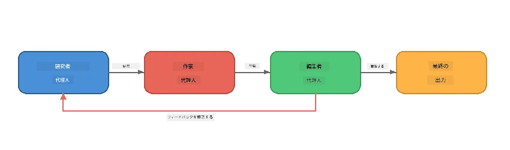
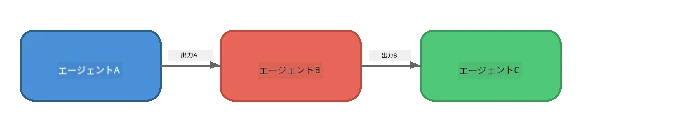
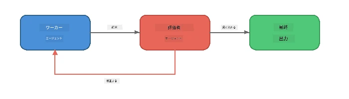
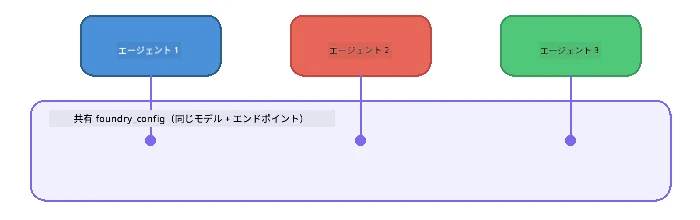

# パート6: マルチエージェント ワークフロー

> **目標:** 複数の専門特化したエージェントを協調して複雑なタスクを分割するパイプラインに結合する — すべてFoundry Localでローカル実行。

## なぜマルチエージェント？

単一のエージェントが多くのタスクを処理できますが、複雑なワークフローには<strong>専門化</strong>が効果的です。1つのエージェントが同時に調査、執筆、編集を試みる代わりに、作業を集中した役割に分割します：



| パターン | 説明 |
|---------|-------------|
| <strong>シーケンシャル</strong> | エージェントAの出力がエージェントBへ → エージェントCへと渡る |
| <strong>フィードバックループ</strong> | 評価者エージェントが作業を修正のために送り返す |
| <strong>共有コンテキスト</strong> | 全エージェントが同じモデル/エンドポイントを使用しつつ、異なる指示を持つ |
| <strong>型付き出力</strong> | エージェントが構造化された結果（JSON）を生成し、信頼できる引き渡しを実現 |

---

## 演習

### 演習1 - マルチエージェントパイプラインを実行する

ワークショップには、Researcher → Writer → Editor の完全なワークフローが含まれています。

<details>
<summary><strong>🐍 Python</strong></summary>

**セットアップ:**
```bash
cd python
python -m venv venv

# Windows（PowerShell）：
venv\Scripts\Activate.ps1
# macOS：
source venv/bin/activate

pip install -r requirements.txt
```

**実行:**
```bash
python foundry-local-multi-agent.py
```

**何が起きるか:**
1. **Researcher** がトピックを受け取り、箇条書きの事実を返す
2. **Writer** が調査内容を受け取り、ブログ記事（3～4段落）を下書きする
3. **Editor** が記事の品質をレビューし、ACCEPTまたはREVISEを返す

</details>

<details>
<summary><strong>📦 JavaScript</strong></summary>

**セットアップ:**
```bash
cd javascript
npm install
```

**実行:**
```bash
node foundry-local-multi-agent.mjs
```

<strong>同じ三段階パイプライン</strong> - Researcher → Writer → Editor

</details>

<details>
<summary><strong>💜 C#</strong></summary>

**セットアップ:**
```bash
cd csharp
dotnet restore
```

**実行:**
```bash
dotnet run multi
```

<strong>同じ三段階パイプライン</strong> - Researcher → Writer → Editor

</details>

---

### 演習2 - パイプラインの構造理解

エージェントがどのように定義・接続されているか学びます：

**1. 共有モデルクライアント**

すべてのエージェントは同じFoundry Localモデルを共有：

```python
# Python - FoundryLocalClient はすべてを処理します
from agent_framework_foundry_local import FoundryLocalClient

client = FoundryLocalClient(model_id="phi-3.5-mini")
```

```javascript
// JavaScript - Foundry Localを指すOpenAI SDK
const client = new OpenAI({
  baseURL: manager.urls[0] + "/v1",
  apiKey: "foundry-local",
});
```

```csharp
// C# - OpenAIClient pointed at Foundry Local
var key = new ApiKeyCredential("foundry-local");
var client = new OpenAIClient(key, new OpenAIClientOptions
{
    Endpoint = new Uri(manager.Urls[0] + "/v1")
});
var chatClient = client.GetChatClient(model.Id);
```

**2. 専門的な指示**

各エージェントには異なるペルソナがあります：

| エージェント | 指示（概要） |
|--------------|--------------|
| Researcher | 「主要な事実、統計、背景を提供してください。箇条書きで整理してください。」 |
| Writer | 「調査ノートをもとに魅力的なブログ記事（3～4段落）を書いてください。事実を創作しないこと。」 |
| Editor | 「明確さ、文法、事実の一貫性をレビューしてください。評価はACCEPTまたはREVISE。」 |

**3. エージェント間のデータフロー**

```python
# ステップ1 - 研究者の出力が作家の入力になる
research_result = await researcher.run(f"Research: {topic}")

# ステップ2 - 作家の出力が編集者の入力になる
writer_result = await writer.run(f"Write using:\n{research_result}")

# ステップ3 - 編集者が研究と記事の両方を確認する
editor_result = await editor.run(
    f"Research:\n{research_result}\n\nArticle:\n{writer_result}"
)
```

```csharp
// C# - same pattern, async calls with AIAgent
var researchNotes = await researcher.RunAsync(
    $"Research the following topic and provide key facts:\n{topic}");

var draft = await writer.RunAsync(
    $"Write a blog post based on these research notes:\n\n{researchNotes}");

var verdict = await editor.RunAsync(
    $"Review this article for quality and accuracy.\n\n" +
    $"Research notes:\n{researchNotes}\n\n" +
    $"Article:\n{draft}");
```

> **重要な洞察:** 各エージェントは前のエージェントたちからの累積コンテキストを受け取ります。編集者は元の調査と下書きの両方を見るため、事実の一貫性を確認できます。

---

### 演習3 - 第4のエージェントを追加

パイプラインに新しいエージェントを追加して拡張します。いずれかを選択：

| エージェント | 目的 | 指示 |
|--------------|---------|-------------|
| **Fact-Checker** | 記事内の主張を検証 | `"事実の主張を検証します。各主張について調査ノートに裏付けがあるか明示してください。検証済み/未検証の項目を含むJSONを返してください。"` |
| **Headline Writer** | キャッチーな見出しを作成 | `"記事の見出し候補を5つ生成してください。スタイルを変えて：情報的、クリックベイト、質問形、リスティクル、感情的。"` |
| **Social Media** | プロモーション投稿を作成 | `"この記事を宣伝するSNS投稿を3つ作成してください：Twitter（280文字）、LinkedIn（プロフェッショナルトーン）、Instagram（カジュアルで絵文字提案付き）。"` |

<details>
<summary><strong>🐍 Python - Headline Writer を追加</strong></summary>

```python
headline_agent = client.as_agent(
    name="HeadlineWriter",
    instructions=(
        "You are a headline specialist. Given an article, generate exactly "
        "5 headline options. Vary the style: informative, question-based, "
        "listicle, emotional, and provocative. Return them as a numbered list."
    ),
)

# エディターが承認した後、見出しを生成する
headline_result = await headline_agent.run(
    f"Generate headlines for this article:\n\n{writer_result}"
)
print(f"\n--- Headlines ---\n{headline_result}")
```

</details>

<details>
<summary><strong>📦 JavaScript - Headline Writer を追加</strong></summary>

```javascript
const headlineAgent = new ChatAgent({
  client,
  modelId: modelInfo.id,
  instructions:
    "You are a headline specialist. Given an article, generate exactly " +
    "5 headline options. Vary the style: informative, question-based, " +
    "listicle, emotional, and provocative. Return them as a numbered list.",
  name: "HeadlineWriter",
});

const headlineResult = await headlineAgent.run(
  `Generate headlines for this article:\n\n${writerResult.text}`
);
console.log(`\n--- Headlines ---\n${headlineResult.text}`);
```

</details>

<details>
<summary><strong>💜 C# - Headline Writer を追加</strong></summary>

```csharp
AIAgent headlineAgent = chatClient.AsAIAgent(
    name: "HeadlineWriter",
    instructions:
        "You are a headline specialist. Given an article, generate exactly " +
        "5 headline options. Vary the style: informative, question-based, " +
        "listicle, emotional, and provocative. Return them as a numbered list."
);

// After the editor accepts, generate headlines
var headlines = await headlineAgent.RunAsync(
    $"Generate headlines for this article:\n\n{draft}");
Console.WriteLine($"\n--- Headlines ---\n{headlines}");
```

</details>

---

### 演習4 - 独自のワークフロー設計

別のドメインのためにマルチエージェントパイプラインを設計してください。参考例：

| ドメイン | エージェント | フロー |
|----------|------------|---------|
| <strong>コードレビュー</strong> | Analyser → Reviewer → Summariser | コード構造を分析 → 問題をレビュー → サマリーレポート作成 |
| <strong>カスタマーサポート</strong> | Classifier → Responder → QA | チケット分類 → 応答案作成 → 品質チェック |
| <strong>教育</strong> | Quiz Maker → Student Simulator → Grader | クイズ作成 → 回答のシミュレーション → 採点・説明 |
| <strong>データ分析</strong> | Interpreter → Analyst → Reporter | データリクエスト解釈 → パターン分析 → レポート執筆 |

**手順:**
1. 3つ以上のエージェントそれぞれに固有の `instructions` を定義
2. データフローを決定 - 各エージェントが受け取り、生成するものは？
3. 演習1～3のパターンを使いパイプラインを実装
4. もしあれば、1エージェントが別のエージェントの作業を評価するフィードバックループを追加

---

## オーケストレーションパターン

ここで示すオーケストレーションパターンはあらゆるマルチエージェントシステムに適用可能です（[パート7](part7-zava-creative-writer.md)で詳述）：

### シーケンシャルパイプライン



各エージェントが前のエージェントの出力を処理します。シンプルで予測可能。

### フィードバックループ



評価者エージェントが早期ステージの再実行を促せます。Zava Writerでは編集者が調査者や作家にフィードバックを送り返します。

### 共有コンテキスト



全エージェントが単一の `foundry_config` を共有し、同じモデル・エンドポイントを使います。

---

## 重要ポイントまとめ

| 概念 | 学んだこと |
|-------|------------|
| エージェント専門化 | 各エージェントは特定の役割を明確な指示で担う |
| データ引渡し | 一方のエージェントの出力が次の入力となる |
| フィードバックループ | 評価者が再試行を促し品質向上を図れる |
| 構造化出力 | JSON形式の応答で安定したエージェント間通信が可能 |
| オーケストレーション | コーディネーターがパイプラインの順序とエラー処理を管理 |
| 実装パターン | [パート7: Zava Creative Writer](part7-zava-creative-writer.md)で適用実例を掲載 |

---

## 次のステップ

[パート7: Zava Creative Writer - キャップストーンアプリケーション](part7-zava-creative-writer.md) へ進み、4つの専門家エージェント、ストリーミング出力、製品検索、フィードバックループを備えた本格的なマルチエージェントアプリをPython、JavaScript、C#で体験してください。