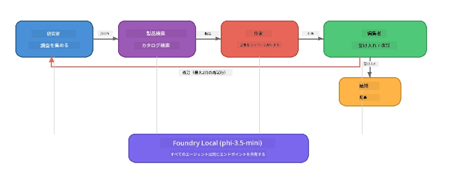

# パート7: Zavaクリエイティブライター - 総仕上げアプリケーション

> **ゴール:** 4つの専門エージェントが連携してZava Retail DIY向けに雑誌品質の文章を生成する、Foundry Localで完全にデバイス上で動作するプロダクションスタイルのマルチエージェントアプリケーションを体験します。

これはワークショップの<strong>総仕上げラボ</strong>です。ここまでに学んだ内容—SDK統合（パート3）、ローカルデータからの検索（パート4）、エージェントのペルソナ設定（パート5）、マルチエージェントのオーケストレーション（パート6）—を結集し、**Python**、**JavaScript**、<strong>C#</strong>で利用可能な完全なアプリケーションにします。

---

## 体験する内容

| コンセプト | Zavaライター内の位置 |
|---------|----------------------------|
| 4ステップのモデル読み込み | 共有設定モジュールがFoundry Localをブートストラップ |
| RAGスタイルの検索 | 商品エージェントがローカルカタログを検索 |
| エージェントの専門化 | 4つのエージェントが異なるシステムプロンプトを持つ |
| ストリーミング出力 | ライターがリアルタイムでトークンを生成 |
| 構造化ハンドオフ | リサーチャー → JSON、エディター → JSON決定 |
| フィードバックループ | エディターが再実行をトリガー（最大2回リトライ） |

---

## アーキテクチャ

Zava Creative Writerは<strong>評価者駆動のフィードバックを含むシーケンシャルパイプライン</strong>を使用しています。3言語の実装はすべて同じアーキテクチャです：



### 4つのエージェント

| エージェント | 入力 | 出力 | 目的 |
|-------|-------|--------|---------|
| **Researcher（リサーチャー）** | トピック＋任意のフィードバック | `{"web": [{url, name, description}, ...]}` | LLMで背景調査を収集 |
| **Product Search（商品検索）** | 商品コンテキスト文字列 | 一致する商品リスト | LLM生成クエリ＋ローカルカタログのキーワード検索 |
| **Writer（ライター）** | 調査＋商品＋割り当て＋フィードバック | ストリーミング記事テキスト（`---`区切りで分割） | 雑誌品質の記事をリアルタイムで執筆 |
| **Editor（エディター）** | 記事＋ライターの自己フィードバック | `{"decision": "accept/revise", "editorFeedback": "...", "researchFeedback": "..."}` | 品質をレビューし必要なら再実行をトリガー |

### パイプラインの流れ

1. <strong>Researcher</strong>がトピックを受け取り、構造化された調査ノート（JSON）を生成
2. <strong>Product Search</strong>がLLM生成の検索語句を使ってローカル商品カタログを検索
3. <strong>Writer</strong>が調査＋商品＋割り当てをまとめストリーミング記事へ、`---`区切り後に自己フィードバックを付加
4. <strong>Editor</strong>が記事をレビューしJSONで判断を返す：
   - `"accept"` → パイプライン完了
   - `"revise"` → フィードバックがResearcherとWriterに戻される（最大2回リトライ）

---

## 前提条件

- [パート6: マルチエージェントワークフロー](part6-multi-agent-workflows.md) 完了
- Foundry Local CLIがインストール済み、`phi-3.5-mini`モデルがダウンロード済み

---

## 演習

### 演習1 - Zava Creative Writerを実行する

使用する言語を選んでアプリケーションを実行してください：

<details>
<summary><strong>🐍 Python - FastAPI Webサービス</strong></summary>

Python版は<strong>REST APIを持つWebサービス</strong>として動作し、プロダクション向けバックエンドの構築を示します。

**セットアップ:**
```bash
cd zava-creative-writer-local/src/api
python -m venv venv

# Windows（PowerShell）:
venv\Scripts\Activate.ps1
# macOS:
source venv/bin/activate

pip install -r requirements.txt
```

**実行:**
```bash
uvicorn main:app --reload
```

**テスト:**
```bash
curl -X POST http://localhost:8000/api/article \
  -H "Content-Type: application/json" \
  -d '{
    "research": "DIY home improvement trends",
    "products": "power tools and paints",
    "assignment": "Write an article about weekend renovation projects for DIY enthusiasts"
  }'
```

レスポンスは各エージェントの進行状況を示す改行区切りJSONメッセージとしてストリームされます。

</details>

<details>
<summary><strong>📦 JavaScript - Node.js CLI</strong></summary>

JavaScript版は<strong>CLIアプリケーション</strong>として動作し、コンソールにエージェントの進行状況や記事が直接出力されます。

**セットアップ:**
```bash
cd zava-creative-writer-local/src/javascript
npm install
```

**実行:**
```bash
node main.mjs
```

表示される内容：
1. Foundry Localモデルの読み込み（ダウンロード中は進捗バー付き）
2. 各エージェントの順次実行とステータスメッセージ
3. 記事がリアルタイムにコンソールにストリーミング
4. エディターの承認/修正の判断

</details>

<details>
<summary><strong>💜 C# - .NET コンソールアプリ</strong></summary>

C#版は<strong>.NETコンソールアプリ</strong>として実行され、同じパイプラインとストリーミング出力を持ちます。

**セットアップ:**
```bash
cd zava-creative-writer-local/src/csharp
dotnet restore
```

**実行:**
```bash
dotnet run
```

出力パターンはJavaScript版と同様です—エージェントステータスメッセージ、ストリーミング記事、エディターの判定。

</details>

---

### 演習2 - コード構造を学ぶ

各言語実装は同じ論理コンポーネントで構成されています。構造を比較しましょう：

**Python** (`src/api/`):
| ファイル | 目的 |
|------|---------|
| `foundry_config.py` | 共有Foundry Localマネージャ、モデル、クライアント（4ステップ初期化） |
| `orchestrator.py` | フィードバックループを含むパイプライン調整 |
| `main.py` | FastAPIエンドポイント（`POST /api/article`） |
| `agents/researcher/researcher.py` | JSON出力のLLMベース調査 |
| `agents/product/product.py` | LLM生成クエリ＋キーワード検索 |
| `agents/writer/writer.py` | ストリーミング記事生成 |
| `agents/editor/editor.py` | JSONベースの承認/修正判断 |

**JavaScript** (`src/javascript/`):
| ファイル | 目的 |
|------|---------|
| `foundryConfig.mjs` | 共有Foundry Local設定（進捗バー付き4ステップ初期化） |
| `main.mjs` | オーケストレーター＋CLIエントリーポイント |
| `researcher.mjs` | LLMによる調査エージェント |
| `product.mjs` | LLMクエリ生成＋キーワード検索 |
| `writer.mjs` | ストリーミング記事生成（非同期ジェネレーター） |
| `editor.mjs` | JSON承認/修正判断 |
| `products.mjs` | 商品カタログデータ |

**C#** (`src/csharp/`):
| ファイル | 目的 |
|------|---------|
| `Program.cs` | モデル読み込み、エージェント、オーケストレーター、フィードバックループの完全パイプライン |
| `ZavaCreativeWriter.csproj` | Foundry Local＋OpenAIパッケージを含む.NET 9プロジェクト |

> **設計ノート:** Pythonは各エージェントをそれぞれのファイル/ディレクトリに分けており（大規模チーム向け）、JavaScriptはエージェントごとにモジュールを分けている（中規模向け）、C#はすべてを1ファイル内にまとめてローカル関数を使う（自己完結型の例に良い）。本番ではチームの慣習に合ったパターンを選んでください。

---

### 演習3 - 共有設定を追う

パイプライン内のすべてのエージェントは単一のFoundry Localモデルクライアントを共有します。各言語での設定方法を調べましょう：

<details>
<summary><strong>🐍 Python - foundry_config.py</strong></summary>

```python
from foundry_local import FoundryLocalManager

MODEL_ALIAS = "phi-3.5-mini"

# ステップ1: マネージャーを作成し、Foundry Localサービスを開始する
manager = FoundryLocalManager()
manager.start_service()

# ステップ2: モデルがすでにダウンロードされているか確認する
cached = manager.list_cached_models()
catalog_info = manager.get_model_info(MODEL_ALIAS)
is_cached = any(m.id == catalog_info.id for m in cached) if catalog_info else False

if not is_cached:
    manager.download_model(MODEL_ALIAS)

# ステップ3: モデルをメモリに読み込む
manager.load_model(MODEL_ALIAS)
model_id = manager.get_model_info(MODEL_ALIAS).id

# 共有のOpenAIクライアント
client = openai.OpenAI(base_url=manager.endpoint, api_key=manager.api_key)
```

すべてのエージェントは `from foundry_config import client, model_id` をインポートします。

</details>

<details>
<summary><strong>📦 JavaScript - foundryConfig.mjs</strong></summary>

```javascript
import { FoundryLocalManager } from "foundry-local-sdk";
import { OpenAI } from "openai";

FoundryLocalManager.create({ appName: "ZavaCreativeWriter" });
const manager = FoundryLocalManager.instance;
await manager.startWebService();

// キャッシュを確認 → ダウンロード → ロード（新しいSDKパターン）
const catalog = manager.catalog;
const model = await catalog.getModel(MODEL_ALIAS);
if (!model.isCached) {
  console.log(`Downloading model: ${MODEL_ALIAS}...`);
  await model.download();
}
await model.load();

const client = new OpenAI({ baseURL: manager.urls[0] + "/v1", apiKey: "foundry-local" });
const modelId = model.id;
export { client, modelId };
```

すべてのエージェントは `import { client, modelId } from "./foundryConfig.mjs"` とします。

</details>

<details>
<summary><strong>💜 C# - Program.csの先頭</strong></summary>

```csharp
await FoundryLocalManager.CreateAsync(
    new Configuration
    {
        AppName = "ZavaCreativeWriter",
        Web = new Configuration.WebService { Urls = "http://127.0.0.1:0" }
    }, NullLogger.Instance, default);
var manager = FoundryLocalManager.Instance;
await manager.StartWebServiceAsync(default);

var catalog = await manager.GetCatalogAsync(default);
var catalogModel = await catalog.GetModelAsync(alias, default);
var isCached = await catalogModel.IsCachedAsync(default);
if (!isCached)
    await catalogModel.DownloadAsync(null, default);

await catalogModel.LoadAsync(default);
var key = new ApiKeyCredential("foundry-local");
var chatClient = new OpenAIClient(key, new OpenAIClientOptions
{
    Endpoint = new Uri(manager.Urls[0] + "/v1")
}).GetChatClient(catalogModel.Id);
```

`chatClient` は同一ファイル内のすべてのエージェント関数に渡されます。

</details>

> **キーパターン:** モデル読み込みパターン（サービス開始→キャッシュ確認→ダウンロード→ロード）は、ユーザーに明確な進捗を示し、モデルを一度だけダウンロードするため、Foundry Localアプリ全般のベストプラクティスです。

---

### 演習4 - フィードバックループの理解

フィードバックループがこのパイプラインを「賢く」しています—エディターが修正を要求して作業を戻します。ロジックを追いましょう：

```
Orchestrator:
  1. researcher.research(topic, "No Feedback")    ← first pass
  2. product.findProducts(productContext)
  3. writer.write(research, products, assignment)  ← streams article
  4. Split article at "---" → article + writerFeedback
  5. editor.edit(article, writerFeedback)

  WHILE editor says "revise" AND retryCount < 2:
    6. researcher.research(topic, editor.researchFeedback)  ← refined
    7. writer.write(research, products, editor.editorFeedback)
    8. editor.edit(newArticle, newWriterFeedback)
    9. retryCount++
```

**考慮すべき質問:**
- なぜリトライ上限は2に設定している？増やすとどうなる？
- なぜリサーチャーは`researchFeedback`を受け取り、ライターは`editorFeedback`を受け取る？
- エディターが常に「修正」を返したらどうなる？

---

### 演習5 - エージェントを変更する

エージェントの挙動を1つ変更し、パイプラインに与える影響を観察してみましょう：

| 変更内容 | 何を変えるか |
|-------------|----------------|
| <strong>より厳しいエディター</strong> | エディターのシステムプロンプトを「必ず最低1回は修正を要求する」に変更 |
| <strong>より長い記事</strong> | ライターのプロンプトを「800-1000語」から「1500-2000語」に変更 |
| <strong>異なる商品</strong> | 商品カタログに商品を追加または変更 |
| <strong>新しい調査テーマ</strong> | デフォルトの`researchContext`を別の主題に変更 |
| **JSONのみのリサーチャー** | リサーチャーが3-5項目ではなく10項目を返すようにする |

> **ヒント:** 3言語とも同じアーキテクチャなので、慣れている言語で同じ変更を行えます。

---

### 演習6 - 5番目のエージェントを追加する

新しいエージェントをパイプラインに追加してみましょう。以下は例です：

| エージェント | パイプライン内の位置 | 目的 |
|-------|-------------------|---------|
| **Fact-Checker（ファクトチェッカー）** | ライターの後、エディターの前 | 調査データと照合して主張を検証 |
| **SEO Optimiser（SEO最適化）** | エディター承認後 | メタ記述、キーワード、スラッグを追加 |
| **Illustrator（イラストレーター）** | エディター承認後 | 記事用の画像プロンプトを生成 |
| **Translator（翻訳者）** | エディター承認後 | 記事を別言語に翻訳 |

**手順:**
1. エージェントのシステムプロンプトを作成
2. 既存パターンに合わせたエージェント関数を作成（使用言語で）
3. 適切な地点にオーケストレーターで挿入
4. 出力やログに新エージェントの貢献を反映

---

## Foundry LocalとAgent Frameworkの連携

このアプリケーションはFoundry Localでマルチエージェントシステムを構築する推奨パターンを示します：

| レイヤー | コンポーネント | 役割 |
|-------|-----------|------|
| <strong>ランタイム</strong> | Foundry Local | モデルのローカルダウンロード、管理、提供 |
| <strong>クライアント</strong> | OpenAI SDK | ローカルエンドポイントへチャット補完を送信 |
| <strong>エージェント</strong> | システムプロンプト＋チャット呼び出し | 特化した動作を焦点化された指示で実現 |
| <strong>オーケストレーター</strong> | パイプライン調整 | データフロー、シーケンス、フィードバックループを管理 |
| <strong>フレームワーク</strong> | Microsoft Agent Framework | `ChatAgent`抽象化やパターンを提供 |

重要な洞察：**Foundry Localはクラウドバックエンドを置き換えるものであって、アプリケーションのアーキテクチャではない。** クラウドホスティングモデルで動作するのと同じエージェントパターン、オーケストレーション戦略、構造化ハンドオフがローカルモデルでも同様に機能します—クライアントの接続先をAzureエンドポイントからローカルエンドポイントに変えるだけです。

---

## 重要なポイント

| コンセプト | 学べたこと |
|---------|-----------------|
| プロダクションアーキテクチャ | 共有設定と分離エージェントを持つマルチエージェントアプリの構造 |
| 4ステップのモデル読み込み | ユーザーに見える進捗を持ったFoundry Localの初期化ベストプラクティス |
| エージェントの専門化 | 4つのエージェントそれぞれに焦点を絞った指示と特定の出力形式 |
| ストリーミング生成 | ライターがリアルタイムでトークンを生成しレスポンスの良いUIを実現 |
| フィードバックループ | エディター主導のリトライで人手なしで品質向上 |
| 多言語パターン | Python、JavaScript、C#で同じアーキテクチャが機能 |
| ローカル＝プロダクション対応 | Foundry Localはクラウド展開で使うOpenAI互換APIを提供 |

---

## 次のステップ

[パート8: 評価主導開発](part8-evaluation-led-development.md) に進み、エージェント評価のための体系的なフレームワークを、ゴールデンデータセット、ルールベース検証、LLMを審査員とするスコアリングで構築しましょう。