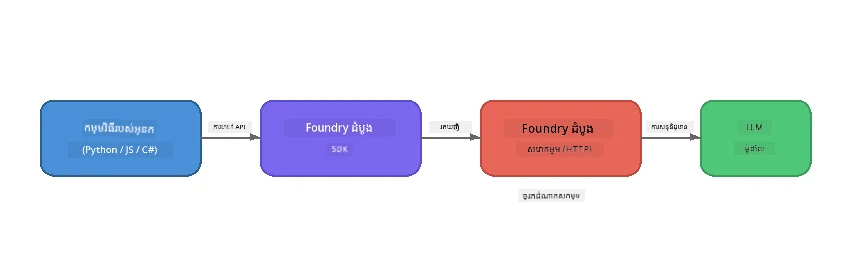

# ផ្នែក 1៖ ការចាប់ផ្ដើមជាមួយ Foundry Local


## Foundry Local ជាអ្វី?

[Foundry Local](https://foundrylocal.ai) អនុញ្ញាតឱ្យអ្នករត់ម៉ូដែលភាសា AI ដ៏ទូលំទូលាយ **ដោយផ្ទាល់លើកុំព្យូទ័ររបស់អ្នក** - មិនចាំបាច់មានអ៊ីនធឺរណែត មិនមានការចំណាយពពក និងភាពឯកជនទិន្នន័យពេញលេញ។ វា៖

- **ទាញយក និងរត់ម៉ូដែលនៅក្នុងផ្ទះ** ជាមួយការបង្កើតការប្រើប្រាស់ឧបករណ៍ដោយស្វ័យប្រវត្តិ (GPU, CPU ឬ NPU)
- **ផ្តល់ API ដែលសមស្របនឹង OpenAI** ដូច្នេះអ្នកអាចប្រើ SDK និងឧបករណ៍ដែលស្គាល់គ្នា
- **មិនត្រូវការជាវ Azure ឬចុះឈ្មោះ** គ្រាន់តែដំឡើងហើយចាប់ផ្តើមបង្កើត

គិតថាវាជា AI ផ្ទាល់ខ្លួនខ្លួនអ្នកដែលរត់បានពេញលេញលើម៉ាស៊ីនរបស់អ្នក។

## គោលដៅរៀន

នៅចុងបញ្ចប់នៃមន្ទីររៀននេះ អ្នកនឹងអាច៖

- ដំឡើង Foundry Local CLI លើប្រព័ន្ធប្រតិបត្តិការ​របស់អ្នក
- យល់ពីអ្វីទៅជា alias របស់ម៉ូឌែល និងរបៀបវារត់
- ទាញយក និងរត់ម៉ូឌែល AI ដ៏ដំបូងរបស់អ្នកក្នុងផ្ទះ
- ផ្ញើសារ chat ទៅម៉ូឌែលក្នុងផ្ទះពីបន្ទាត់ពាក្យបញ្ជា
- យល់ពីភាពខុសគ្នារវាងម៉ូឌែល AI ដែលរត់ក្នុងផ្ទះ និងម៉ូឌែលដែលផ្ដល់ដោយពពក

---

## អ្វីដែលត្រូវតែមានមុនពេលចាប់ផ្តើម

### តម្រូវការប្រព័ន្ធ

| តម្រូវការ | អប្បបរមា | ដាក់បញ្ចូល |
|-------------|---------|-------------|
| **RAM** | 8 GB | 16 GB |
| **ទំហំ硬盘** | 5 GB (សម្រាប់ម៉ូឌែល) | 10 GB |
| **CPU** | 4 cores | 8+ cores |
| **GPU** | ជាជម្រើស | NVIDIA ជាមួយ CUDA 11.8+ |
| **ប្រព័ន្ធប្រតិបត្តិការ** | Windows 10/11 (x64/ARM), Windows Server 2025, macOS 13+ | - |

> **ចំណាំ៖** Foundry Local ជ្រើសម៉ូឌែល variant ល្អបំផុតដោយស្វ័យប្រវត្តិសម្រាប់ឧបករណ៍របស់អ្នក។ ប្រសិនបើអ្នកមាន NVIDIA GPU វាទទួលបានកម្មវិធីសំខាន់ CUDA។ ប្រសិនបើអ្នកមាន Qualcomm NPU វាប្រើប្រាស់វា។ ប្រសិនបើមិនមានវាក៏អាចប្រើ variant អ្នក  CPU ដែលបានបំលែងអុបទឹម។

### ដំឡើង Foundry Local CLI

**Windows** (PowerShell):
```powershell
winget install Microsoft.FoundryLocal
```

**macOS** (Homebrew):
```bash
brew tap microsoft/foundrylocal
brew install foundrylocal
```

> **ចំណាំ៖** Foundry Local បច្ចុប្បន្នគាំទ្រតែ Windows និង macOS តែប៉ុណ្ណោះ។ Linux មិនគាំទ្រនៅពេលនេះទេ។

ត្រួតពិនិត្យការដំឡើង៖
```bash
foundry --version
```

---

## សមីការរៀន

### សមីការលំហាត់ 1៖ ស្វែងរកម៉ូឌែលដែលមានស្រាប់

Foundry Local រួមបញ្ចូលកាតាឡុកម៉ូឌែលបើកដែលបានបង្កើតអុបទឹមជាមុន។ បង្ហាញបញ្ជី៖

```bash
foundry model list
```

អ្នកនឹងឃើញម៉ូឌែលដូចជា៖
- `phi-3.5-mini` - ម៉ូឌែល 3.8B ពី Microsoft (លឿន មានគុណភាពល្អ)
- `phi-4-mini` - ម៉ូឌែល Phi ថ្មី ធ្វើអោយមានសមត្ថភាពល្អប្រសើរ
- `phi-4-mini-reasoning` - ម៉ូឌែល Phi ដែលមានគំនិតការពិចារណាចងខ្សែ (`<think>` tags)
- `phi-4` - ម៉ូឌែលធំបំផុត Phi របស់ Microsoft (10.4 GB)
- `qwen2.5-0.5b` - តូចដល់លឿនខ្លាំង (ល្អសម្រាប់ឧបករណ៍មានធនធានទាប)
- `qwen2.5-7b` - ម៉ូឌែលទូទៅដ៏មានឥទ្ធិពលជាមួយគាំទ្រហៅឧបករណ៍
- `qwen2.5-coder-7b` - បង្កើតសម្រាប់ការបង្កើតកូដ
- `deepseek-r1-7b` - ម៉ូឌែលច្នៃប្រឌិតខ្លាំង
- `gpt-oss-20b` - ម៉ូឌែលធំពីបើកប្រភព (អាជ្ញាបណ្ណ MIT, 12.5 GB)
- `whisper-base` - បម្លែងសំឡេងទៅអត្ថបទ (383 MB)
- `whisper-large-v3-turbo` - បម្លែងត្រឹមត្រូវខ្ពស់ (9 GB)

> **អ្វីជាអត្តនាមម៉ូឌែល?** អត្តនាមដូចជា `phi-3.5-mini` ជាជំនួសខ្លីៗ។ នៅពេលអ្នកប្រើអត្តនាម Foundry Local នឹងទាញយកវេរុណតាម hardware របស់អ្នកដោយស្វ័យប្រវត្តិ (CUDA សម្រាប់ NVIDIA GPU, CPU-optimised បើមិនមាន)។ អ្នកមិនត្រូវបារម្ភពីការជ្រើសរើស variant ត្រឹមត្រូវឡើយ។

### សមីការលំហាត់ 2៖ រត់ម៉ូឌែលដំបូងរបស់អ្នក

ទាញយកហើយចាប់ផ្តើមជជែកជាមួយម៉ូឌែលឆ្លាតវៃ៖

```bash
foundry model run phi-3.5-mini
```

ពេលដំបូងដែលអ្នករត់វា Foundry Local នឹង​ធ្វើ៖
1. រកឃើញឧបករណ៍របស់អ្នក
2. ទាញយក variant ម៉ូឌែលល្អបំផុត (អាចចំណាយខ្លីៗ)
3. ផ្ទុកម៉ូឌែលក្នុងអង្គចងចាំ
4. ចាប់ផ្តើមសម័យជជែកអន្តរកម្ម

សាកល្បងសួរពួកវាដើម្បីសាកល្បង៖
```
You: What is the golden ratio?
You: Can you explain it as if I were 10 years old?
You: Write a haiku about mathematics
```

វាយ `exit` ឬចុច `Ctrl+C` ដើម្បីចាកចេញ។

### សមីការលំហាត់ 3៖ ទាញយកម៉ូឌែលជាមុន

ប្រសិនបើអ្នកចង់ទាញយកម៉ូឌែលមិនចាំបាច់ចាប់ផ្តើមជជែក៖

```bash
foundry model download phi-3.5-mini
```

ពិនិត្យម៉ូឌែលដែលបានទាញយកស្រាប់លើម៉ាស៊ីនរបស់អ្នក៖

```bash
foundry cache list
```

### សមីការលំហាត់ 4៖ យល់ដឹងអំពីស្ថាបត្យកម្ម

Foundry Local រត់ជា **សេវាកម្ម HTTP ដំណើរការក្នុងផ្ទះ** ដែលបង្ហាញ API REST រួមសមស្របនឹង OpenAI។ នេះមានន័យថា៖

1. សេវាកម្មចាប់ផ្តើម​លើ​ **ផត dynamic** (ផតផ្សេងគ្នាក្នុងគ្រប់ដង)
2. អ្នកប្រើ SDK ដើម្បីស្វែងរក URL endpoint ពិតប្រាកដ
3. អ្នកអាចប្រើបណ្ណាល័យ client អ្វីでも ដែលសមស្របនឹង OpenAI ដើម្បីទំនាក់ទំនងជាមួយវា



> **សំខាន់ៈ** Foundry Local បែងចែក **ផត dynamic** នៅពេលចាប់ផ្តើមគ្រប់ដង។ មិនធ្វើ hardcode លេខផតរបស់ `localhost:5272` ទេ។ តែងតែប្រើ SDK ដើម្បីស្វែងរក URL បច្ចុប្បន្ន (ឧ. `manager.endpoint` ក្នុង Python ឬ `manager.urls[0]` ក្នុង JavaScript)។

---

## ចំណុចសំខាន់ៗដែលបានយល់

| គំនិត | អ្វីដែលអ្នកបានរៀន |
|---------|------------------|
| AI លើឧបករណ៍ផ្ទាល់ | Foundry Local រត់ម៉ូឌែលពេញលេញលើឧបករណ៍របស់អ្នក ដោយគ្មានពពក គ្មានកូនសោ API និងគ្មានចំណាយ |
| អត្តនាមម៉ូឌែល | អត្តនាមដូចជា `phi-3.5-mini` ជ្រើស variant ល្អបំផុតសម្រាប់ឧបករណ៍របស់អ្នកដោយស្វ័យប្រវត្តិ |
| ផត dynamic | សេវាកម្មរត់លើផត dynamic; សូមប្រើ SDK ដើម្បីស្វែងរក endpoint ទាំងអស់ |
| CLI និង SDK | អ្នកអាចធ្វើអន្តរកម្មជាមួយម៉ូឌែលតាមរយៈ CLI (`foundry model run`) ឬប្រើ SDK ដោយកម្មវិធី |

---

## ជំហានបន្ទាប់

បន្តទៅ [ផ្នែក 2៖ ការសិក្សា Foundry Local SDK ជ្រៅ](part2-foundry-local-sdk.md) ដើម្បីចេះវិធីប្រើ API SDK សម្រាប់គ្រប់គ្រងម៉ូឌែល, សេវាកម្ម និងកែសម្រួលជាកម្មវិធី។