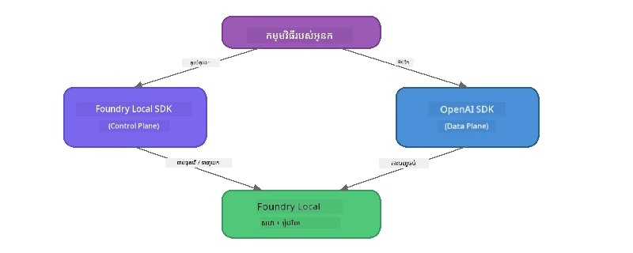

# ផ្នែក 3: ការប្រើប្រាស់ Foundry Local SDK ជាមួយ OpenAI

## ទិដ្ឋភាពទូទៅ

នៅក្នុងផ្នែក 1 អ្នកបានប្រើ Foundry Local CLI ដើម្បីរត់ម៉ូដែលជារបៀបអន្តរកម្ម។ នៅផ្នែក 2 អ្នកបានស្វែងយល់ពីផ្ទៃខាង API SDK ពេញលេញ។ ឥឡូវនេះ អ្នកនឹងរៀនពីរបៀប **បញ្ចូល Foundry Local ទៅក្នុងកម្មវិធីរបស់អ្នក** ដោយប្រើ SDK និង API ដែលគាំទ្រ OpenAI។

Foundry Local ផ្តល់ជូន SDK សម្រាប់ភាសា ៣។ ជ្រើសរើសភាសាដែលអ្នកសូវស្រួលប្រើបំផុត - គំនិតគឺដូចគ្នានៅទូទាំងភាសាទាំងបី។

## គោលបំណងសិក្សា

នៅចុងបញ្ចប់នៃមុខវិជ្ជានេះ អ្នកអាច:

- តំលើង Foundry Local SDK សម្រាប់ភាសារបស់អ្នក (Python, JavaScript, ឬ C#)
- ចាប់ផ្ដើម `FoundryLocalManager` ដើម្បីចាប់ផ្ដើមសេវាកម្ម ពិនិត្យតាមដានចម្លង ទាញយក និងផ្ទុកម៉ូដែលមួយ
- តភ្ជាប់ទៅម៉ូដែលក្នុងតំបន់ដោយប្រើ OpenAI SDK
- ផ្ញើការបញ្ចប់ការជជែក និងគ្រប់គ្រងចម្លើយបន្តបន្ទាប់
- យល់ដឹងអំពីស្ថាបត្យកម្មច្រកផតដែលអាចបត់បែនបាន

---

## លក្ខខណ្ឌជាមុន

បញ្ចប់ [ផ្នែក 1: ការចាប់ផ្ដើមជាមួយ Foundry Local](part1-getting-started.md) និង [ផ្នែក 2: ការស្វែងយល់ជ្រាលជ្រៅអំពី Foundry Local SDK](part2-foundry-local-sdk.md) ជាមុន។

តំលើង **មួយ** នៃ runtime ភាសាខាងក្រោម៖  
- **Python 3.9+** - [python.org/downloads](https://www.python.org/downloads/)  
- **Node.js 18+** - [nodejs.org](https://nodejs.org/)  
- **.NET 9.0+** - [dot.net/download](https://dotnet.microsoft.com/download)  

---

## គំនិត៖ របៀប SDK ដំណើរការ

Foundry Local SDK គ្រប់គ្រង **ផ្ទៃត្រួតត្រា** (ចាប់ផ្ដើមសេវាកម្ម ទាញយកម៉ូដែល) ខណៈ OpenAI SDK ដំណើរការ **ផ្ទៃទិន្នន័យ** (ផ្ញើអំពាវនាវ ទទួលការបញ្ចប់)។



---

## ព្រឹត្តិការណ៍មេរៀន

### ព្រឹត្តិការណ៍ 1: កំណត់បរិយាកាសរបស់អ្នក

<details>
<summary><b>🐍 Python</b></summary>

```bash
cd python
python -m venv venv

# បើកបរិវិស_virtual:
# Windows (PowerShell):
venv\Scripts\Activate.ps1
# Windows (Command Prompt):
venv\Scripts\activate.bat
# macOS:
source venv/bin/activate

pip install -r requirements.txt
```
  
`requirements.txt` តំលើង៖  
- `foundry-local-sdk` - Foundry Local SDK (នាំចូលជារាង `foundry_local`)  
- `openai` - OpenAI Python SDK  
- `agent-framework` - Microsoft Agent Framework (ប្រើនៅផ្នែកក្រោយ)  

</details>

<details>
<summary><b>📘 JavaScript</b></summary>

```bash
cd javascript
npm install
```
  
`package.json` តំលើង៖  
- `foundry-local-sdk` - Foundry Local SDK  
- `openai` - OpenAI Node.js SDK  

</details>

<details>
<summary><b>💜 C#</b></summary>

```bash
cd csharp
dotnet restore
dotnet build
```
  
`csharp.csproj` ប្រើ៖  
- `Microsoft.AI.Foundry.Local` - Foundry Local SDK (NuGet)  
- `OpenAI` - OpenAI C# SDK (NuGet)  

> **រចនាសម្ព័ន្ធគម្រោង៖** គម្រោង C# ប្រើម៉ាស៊ីនបញ្ជា CLI នៅក្នុង `Program.cs` ដែលចែកចាយទៅឯកសារឧទាហរណ៍ឡែកៗ។ រត់ `dotnet run chat` (ឬគ្រាន់តែ `dotnet run`) សម្រាប់ផ្នែកនេះ។ ផ្នែកផ្សេងៗប្រើ `dotnet run rag`, `dotnet run agent`, និង `dotnet run multi`។  

</details>

---

### ព្រឹត្តិការណ៍ 2: ការបញ្ចប់ជជែកមូលដ្ឋាន

បើកឧទាហរណ៍ជជែកមូលដ្ឋានសម្រាប់ភាសារបស់អ្នក និងពិនិត្យកូដ។ ស្គ្រីបនីមួយៗធ្វើតាមលំដាប់បីជំហានដូចខាងក្រោម៖

1. **ចាប់ផ្ដើមសេវាកម្ម** - `FoundryLocalManager` ចាប់ផ្ដើម runtime Foundry Local  
2. **ទាញយក និងផ្ទុកម៉ូដែល** - ពិនិត្យតាមដានចម្លង ទាញយកបើទាក់បាញ់ ហើយបន្ទាប់មកផ្ទុកទៅក្នុងចងចាំ  
3. **បង្កើតអតិថិជន OpenAI** - តភ្ជាប់ទៅចង្អុលបង្ហាញក្នុងតំបន់ ហើយផ្ញើការបញ្ចប់ជជែកបន្តបន្ទាប់   

<details>
<summary><b>🐍 Python - <code>python/foundry-local.py</code></b></summary>

```python
import sys
import openai
from foundry_local import FoundryLocalManager

alias = "phi-3.5-mini"

# ជំហានទី ១៖ បង្កើត FoundryLocalManager ហើយចាប់ផ្តើមសេវាកម្ម
print("Starting Foundry Local service...")
manager = FoundryLocalManager()
manager.start_service()

# ជំហានទី ២៖ ពិនិត្យមើលថាម៉ូឌែលបានទាញយករួចហើយឬនៅ
cached = manager.list_cached_models()
catalog_info = manager.get_model_info(alias)
is_cached = any(m.id == catalog_info.id for m in cached) if catalog_info else False

if is_cached:
    print(f"Model already downloaded: {alias}")
else:
    print(f"Downloading model: {alias} (this may take several minutes)...")
    manager.download_model(alias)
    print(f"Download complete: {alias}")

# ជំហានទី ៣៖ ផ្ទុកម៉ូឌែលចូលទៅក្នុងចងចាំ
print(f"Loading model: {alias}...")
manager.load_model(alias)

# បង្កើតអតិថិជន OpenAI ដែលបង្ហាញទៅសេវាកម្ម LOCAL Foundry
client = openai.OpenAI(
    base_url=manager.endpoint,   # ច្រកវារីវចន - មិនត្រូវកូដរឹង!
    api_key=manager.api_key
)

# បង្កើតការបញ្ចប់ការពិភាក្សាប្រភេទចរន្ត
stream = client.chat.completions.create(
    model=manager.get_model_info(alias).id,
    messages=[{"role": "user", "content": "What is the golden ratio?"}],
    stream=True,
)

for chunk in stream:
    if chunk.choices[0].delta.content is not None:
        print(chunk.choices[0].delta.content, end="", flush=True)
print()
```
  
**រត់វា៖**  
```bash
python foundry-local.py
```
  
</details>

<details>
<summary><b>📘 JavaScript - <code>javascript/foundry-local.mjs</code></b></summary>

```javascript
import { OpenAI } from "openai";
import { FoundryLocalManager } from "foundry-local-sdk";

const alias = "phi-3.5-mini";

// ជំហានទី 1: ចាប់ផ្ដើមសេវាកម្ម Foundry Local
console.log("Starting Foundry Local service...");
FoundryLocalManager.create({ appName: "FoundryLocalWorkshop" });
const manager = FoundryLocalManager.instance;
await manager.startWebService();

// ជំហានទី 2: ពិនិត្យមើលថាតើម៉ូដែលត្រូវបានទាញយករួចហើយឬទេ
const catalog = manager.catalog;
const model = await catalog.getModel(alias);

if (model.isCached) {
  console.log(`Model already downloaded: ${alias}`);
} else {
  console.log(`Downloading model: ${alias} (this may take several minutes)...`);
  await model.download();
  console.log(`Download complete: ${alias}`);
}

// ជំហានទី 3: ផ្ទុកម៉ូដែលចូលទៅក្នុងអង្គចងចាំ
console.log(`Loading model: ${alias}...`);
await model.load();
console.log(`Model loaded: ${model.id}`);

// បង្កើតអតិថិជន OpenAI ដែលបញ្ជូនទៅសេវាកម្ម LOCAL Foundry
const client = new OpenAI({
  baseURL: manager.urls[0] + "/v1",   // ផតថលអគ្គិសនី δυναμικός - មិនដែលកំណត់តម្លៃថាសា!
  apiKey: "foundry-local",
});

// បង្កើតការបញ្ចប់សន្ទនាផ្ទាល់ភាពបន្ត
const stream = await client.chat.completions.create({
  model: model.id,
  messages: [{ role: "user", content: "What is the golden ratio?" }],
  stream: true,
});

for await (const chunk of stream) {
  if (chunk.choices[0]?.delta?.content) {
    process.stdout.write(chunk.choices[0].delta.content);
  }
}
console.log();
```
  
**រត់វា៖**  
```bash
node foundry-local.mjs
```
  
</details>

<details>
<summary><b>💜 C# - <code>csharp/BasicChat.cs</code></b></summary>

```csharp
using Microsoft.AI.Foundry.Local;
using Microsoft.Extensions.Logging.Abstractions;
using OpenAI;
using OpenAI.Chat;
using System.ClientModel;

var alias = "phi-3.5-mini";

// Step 1: Start the Foundry Local service
Console.WriteLine("Starting Foundry Local service...");
await FoundryLocalManager.CreateAsync(
    new Configuration
    {
        AppName = "FoundryLocalSamples",
        Web = new Configuration.WebService { Urls = "http://127.0.0.1:0" }
    }, NullLogger.Instance, default);
var manager = FoundryLocalManager.Instance;
await manager.StartWebServiceAsync(default);

// Step 2: Get the model from the catalog
var catalog = await manager.GetCatalogAsync(default);
var model = await catalog.GetModelAsync(alias, default);

// Step 3: Check if the model is already downloaded
var isCached = await model.IsCachedAsync(default);

if (isCached)
{
    Console.WriteLine($"Model already downloaded: {alias}");
}
else
{
    Console.WriteLine($"Downloading model: {alias} (this may take several minutes)...");
    await model.DownloadAsync(null, default);
    Console.WriteLine($"Download complete: {alias}");
}

// Step 4: Load the model into memory
Console.WriteLine($"Loading model: {alias}...");
await model.LoadAsync(default);
Console.WriteLine($"Loaded model: {model.Id}");
Console.WriteLine($"Endpoint: {manager.Urls[0]}");

// Create OpenAI client pointing to the LOCAL Foundry service
var key = new ApiKeyCredential("foundry-local");
var client = new OpenAIClient(key, new OpenAIClientOptions
{
    Endpoint = new Uri(manager.Urls[0] + "/v1")  // Dynamic port - never hardcode!
});

var chatClient = client.GetChatClient(model.Id);

// Stream a chat completion
var completionUpdates = chatClient.CompleteChatStreaming("What is the golden ratio?");

foreach (var update in completionUpdates)
{
    if (update.ContentUpdate.Count > 0)
    {
        Console.Write(update.ContentUpdate[0].Text);
    }
}
Console.WriteLine();
```
  
**រត់វា៖**  
```bash
dotnet run chat
```
  
</details>

---

### ព្រឹត្តិការណ៍ 3: ព្យាយាមជាមួយសារ

ពេលឧទាហរណ៍មូលដ្ឋានរបស់អ្នករត់បាន សូមព្យាយាមកែសម្រួលកូដ:

1. **ផ្លាស់ប្ដូរសារអ្នកប្រើ** - សាកល្បងសំណួរផ្សេងៗ  
2. **បន្ថែម prompt របស់ប្រព័ន្ធ** - ផ្តល់ម៉ូដែលនូវបុគ្គលភាព  
3. **បិទបញ្ជូនបន្តបន្ទាប់** - កំណត់ `stream=False` ហើយបោះពុម្ពចម្លើយពេញលេញម្តង  
4. **សាកល្បងម៉ូដែលផ្សេងទៀត** - ផ្លាស់ប្ដូរជំនួសពី `phi-3.5-mini` ទៅម៉ូដែលផ្សេងៗពី `foundry model list`  

<details>
<summary><b>🐍 Python</b></summary>

```python
# បន្ថែមការបញ្ចូលសញ្ញារបស់ប្រព័ន្ធ - ផ្ដល់ឲ្យម៉ូដែលនូវបុគ្គលិកលក្ខណៈមួយ៖
stream = client.chat.completions.create(
    model=manager.get_model_info(alias).id,
    messages=[
        {"role": "system", "content": "You are a pirate. Answer everything in pirate speak."},
        {"role": "user", "content": "What is the golden ratio?"}
    ],
    stream=True,
)

# ឬបិទការចាក់ផ្សាយបន្ត៖
response = client.chat.completions.create(
    model=manager.get_model_info(alias).id,
    messages=[{"role": "user", "content": "What is the golden ratio?"}],
    stream=False,
)
print(response.choices[0].message.content)
```
  
</details>

<details>
<summary><b>📘 JavaScript</b></summary>

```javascript
// បន្ថែមការជំរុញប្រព័ន្ធ - ផ្ដល់ឲ្យម៉ូដែលនូវបុគ្គលិកភាពមួយ៖
const stream = await client.chat.completions.create({
  model: modelInfo.id,
  messages: [
    { role: "system", content: "You are a pirate. Answer everything in pirate speak." },
    { role: "user", content: "What is the golden ratio?" },
  ],
  stream: true,
});

// ឬបិទការផ្សាយបន្ត:
const response = await client.chat.completions.create({
  model: modelInfo.id,
  messages: [{ role: "user", content: "What is the golden ratio?" }],
  stream: false,
});
console.log(response.choices[0].message.content);
```
  
</details>

<details>
<summary><b>💜 C#</b></summary>

```csharp
// Add a system prompt - give the model a persona:
var completionUpdates = chatClient.CompleteChatStreaming(
    new ChatMessage[]
    {
        new SystemChatMessage("You are a pirate. Answer everything in pirate speak."),
        new UserChatMessage("What is the golden ratio?")
    }
);

// Or turn off streaming:
var response = chatClient.CompleteChat("What is the golden ratio?");
Console.WriteLine(response.Value.Content[0].Text);
```
  
</details>

---

### យោងរបៀបសំខាន់របស់ SDK

<details>
<summary><b>🐍 វិធីសាស្រ្ត Python SDK</b></summary>

| វិធីសាស្រ្ត | គោលបំណង |
|--------|---------|
| `FoundryLocalManager()` | បង្កើតអង្គភាពគ្រប់គ្រង |
| `manager.start_service()` | ចាប់ផ្ដើមសេវាកម្ម Foundry Local |
| `manager.list_cached_models()` | បញ្ជីម៉ូដែលដែលបានទាញយកនៅលើឧបករណ៍របស់អ្នក |
| `manager.get_model_info(alias)` | ទទួលបាន ID ម៉ូដែល និងព័ត៌មានបន្ថែម |
| `manager.download_model(alias, progress_callback=fn)` | ទាញយកម៉ូដែលជាមួយ callback ដើម្បីតាមដានចំណុចខ្ទង់ |
| `manager.load_model(alias)` | ផ្ទុកម៉ូដែលទៅក្នុងចងចាំ |
| `manager.endpoint` | ទទួល URL ចង្អុលបង្ហាញដែលអាចបត់បែនបាន |
| `manager.api_key` | ទទួល API key (ជាកន្លែងទុកសម្រាប់តំបន់ក្នុងតំបន់) |

</details>

<details>
<summary><b>📘 វិធីសាស្រ្ត JavaScript SDK</b></summary>

| វិធីសាស្រ្ត | គោលបំណង |
|--------|---------|
| `FoundryLocalManager.create({ appName })` | បង្កើតអង្គភាពគ្រប់គ្រង |
| `FoundryLocalManager.instance` | ចូលប្រើអង្គភាពគ្រប់គ្រងមួយគត់ |
| `await manager.startWebService()` | ចាប់ផ្ដើមសេវាកម្ម Foundry Local |
| `await manager.catalog.getModel(alias)` | ទទួលម៉ូដែលពីកាតារ៉ុក |
| `model.isCached` | ពិនិត្យថាម៉ូដែលបានទាញយករួចហើយឬអត់ |
| `await model.download()` | ទាញយកម៉ូដែល |
| `await model.load()` | ផ្ទុកម៉ូដែលទៅក្នុងចងចាំ |
| `model.id` | ទទួល ID ម៉ូដែលសម្រាប់ហៅ OpenAI API |
| `manager.urls[0] + "/v1"` | ទទួល URL ចង្អុលបង្ហាញដែលអាចបត់បែនបាន |
| `"foundry-local"` | កូនសោ API (កន្លែងទុកសម្រាប់តំបន់ក្នុងតំបន់) |

</details>

<details>
<summary><b>💜 វិធីសាស្រ្ត C# SDK</b></summary>

| វិធីសាស្រ្ត | គោលបំណង |
|--------|---------|
| `FoundryLocalManager.CreateAsync(config)` | បង្កើត និងចាប់ផ្ដើមអង្គភាពគ្រប់គ្រង |
| `manager.StartWebServiceAsync()` | ចាប់ផ្ដើមសេវាកម្មវេប Foundry Local |
| `manager.GetCatalogAsync()` | ទទួលកាតារ៉ុកម៉ូដែល |
| `catalog.ListModelsAsync()` | បញ្ជីម៉ូដែលទាំងអស់ដែលមាន |
| `catalog.GetModelAsync(alias)` | ទទួលម៉ូដែលជាក់លាក់តាម alias |
| `model.IsCachedAsync()` | ពិនិត្យថាម៉ូដែលបានទាញយករួចឬអត់ |
| `model.DownloadAsync()` | ទាញយកម៉ូដែល |
| `model.LoadAsync()` | ផ្ទុកម៉ូដែលទៅក្នុងចងចាំ |
| `manager.Urls[0]` | ទទួល URL ចង្អុលបង្ហាញដែលអាចបត់បែនបាន |
| `new ApiKeyCredential("foundry-local")` | សក្ខីប័ត្រកូនសោ API សម្រាប់តំបន់ក្នុងតំបន់ |

</details>

---

### ព្រឹត្តិការណ៍ 4: ប្រើប្រាស់ ChatClient ដោយដើម (ជម្រើសផ្ទុយពី OpenAI SDK)

នៅក្នុងព្រឹត្តិការណ៍ 2 និង 3 អ្នកបានប្រើ OpenAI SDK សម្រាប់ការបញ្ចប់ជជែក។ SDK របស់ JavaScript និង C# ក៏ផ្តល់នូវ **ChatClient ដើម** ដែលលុបចោលការតម្រូវឲ្យប្រើ OpenAI SDK ទាំងស្រុង។

<details>
<summary><b>📘 JavaScript - <code>model.createChatClient()</code></b></summary>

```javascript
import { FoundryLocalManager } from "foundry-local-sdk";

const alias = "phi-3.5-mini";

FoundryLocalManager.create({ appName: "ChatClientDemo" });
const manager = FoundryLocalManager.instance;
await manager.startWebService();

const model = await manager.catalog.getModel(alias);
if (!model.isCached) await model.download();
await model.load();

// មិនត្រូវការនាំចូល OpenAI — ទទួលបានគCLIENT ដោយផ្ទាល់ពីម៉ូដែល
const chatClient = model.createChatClient();

// ការសម្រេចចិត្តមិនរាយការណ៍បន្ត
const response = await chatClient.completeChat([
  { role: "system", content: "You are a pirate. Answer everything in pirate speak." },
  { role: "user", content: "What is the golden ratio?" }
]);
console.log(response.choices[0].message.content);

// ការសម្រេចចិត្តបន្ត (ប្រើរៀបចំ callback)
await chatClient.completeStreamingChat(
  [{ role: "user", content: "What is the golden ratio?" }],
  (chunk) => {
    if (chunk.choices?.[0]?.delta?.content) {
      process.stdout.write(chunk.choices[0].delta.content);
    }
  }
);
console.log();
```
  
> **ចំណាំៈ** មុខងារ `completeStreamingChat()` របស់ ChatClient ប្រើគំរូ **callback** ខុសពី async iterator។ ផ្តល់មុខងារជាអាគុយម៉ង់ទីពីរ។  

</details>

<details>
<summary><b>💜 C# - <code>model.GetChatClientAsync()</code></b></summary>

```csharp
var catalog = await manager.GetCatalogAsync(default);
var model = await catalog.GetModelAsync("phi-3.5-mini", default);
if (!await model.IsCachedAsync(default))
    await model.DownloadAsync(null, default);
await model.LoadAsync(default);

// No OpenAI NuGet needed — get a client directly from the model
var chatClient = await model.GetChatClientAsync(default);

// Use it like a standard OpenAI ChatClient
var response = chatClient.CompleteChat("What is the golden ratio?");
Console.WriteLine(response.Value.Content[0].Text);
```
  
</details>

> **ពេលណាដែលត្រូវប្រើអ្វី៖**  
> | វិធីសាស្រ្ត | សម្រួលសម្រាប់ |
> |----------|----------|
> | OpenAI SDK | ការគ្រប់គ្រងពេញលេញលើប៉ារាម៉ែត្រ កម្មវិធីផលិតកម្ម កូដ OpenAI មានស្រាប់ |
> | ChatClient ដើម | សាកល្បងរហ័ស ការគ្រប់គ្រងទាប ការតំឡើងសាមញ្ញ |

---

## សេចក្តីសង្ខេប

| គំនិត | អ្វីដែលអ្នកបានរៀន |
|---------|------------------|
| ផ្ទៃត្រួតត្រា | Foundry Local SDK ត្រូវបានប្រើសម្រាប់ចាប់ផ្ដើមសេវាកម្ម និងផ្ទុកម៉ូដែល |
| ផ្ទៃទិន្នន័យ | OpenAI SDK ត្រូវបានប្រើសម្រាប់ការបញ្ចប់ជជែក និងបញ្ជូនបន្តបន្ទាប់ |
| ច្រកផតបត់បែនបាន | ប្រើ SDK រហូតគ្នាទៅរកចង្អុល ប្លែកពីការបញ្ចូល URL ថេរ |
| ខ្ទង់ភាសាផ្សេងៗ | លំនាំកូដដូចគ្នាគឺមុខងារបានលើ Python, JavaScript និង C# |
| សមត្ថភាពស្របតាម OpenAI | ប្រព័ន្ធពេញលេញនៃ API OpenAI បញ្ជាក់ថាកូដ OpenAI មានស្រាប់អាចកំណែតិចបំផុតបាន |
| ChatClient ដើម | `createChatClient()` (JS) / `GetChatClientAsync()` (C#) ផ្តល់ជាជម្រើសផ្សេងពី OpenAI SDK |

---

## ជំហ៊ានបន្ទាប់

បន្ដទៅ [ផ្នែក 4: ការច្នៃប្រឌិតកម្មវិធី RAG](part4-rag-fundamentals.md) ដើម្បីរៀនពីការសាងសង់បណ្តាញបង្កើតមាតិកាដែលត្រូវបានបន្ថែមនូវព័ត៌មាន ដែលដំណើរការទាំងស្រុងលើឧបករណ៍របស់អ្នក។