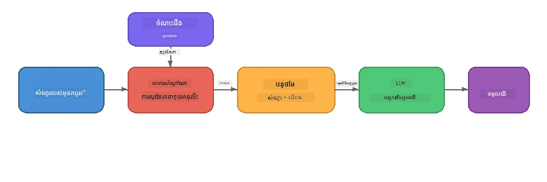

# ផ្នែក 4៖ ការសាងសង់កម្មវិធី RAG ជាមួយ Foundry Local

## សេចក្ដីសង្ខេប

ម៉ូដែលភាសាធំៗមានកម្លាំងខ្លាំង ប៉ុន្តែពួកវាទទួលដឹងតែអ្វីដែលមានក្នុងទិន្នន័យហ្វឹកហាត់របស់ពួកវាក្នុងតែទីនេះ។ **Retrieval-Augmented Generation (RAG)** ដោះស្រាយករណីនេះដោយផ្តល់ឱ្យម៉ូដែលនូវបរិបទដែលពាក់ព័ន្ធនៅពេលសំណួរ - ដែលទាញយកចេញពីឯកសាររបស់អ្នក ឃ្លាំងទិន្នន័យ ឬមុខដៅចំណេះដឹងរបស់អ្នក។

ក្នុងមន្ទីរពិសោធនេះ អ្នកនឹងបង្កើតបំពង់ RAG ពេញលេញដែលដំណើរការជា **ទាំងស្រុងលើឧបករណ៍របស់អ្នក** ដោយប្រើ Foundry Local។ គ្មានសេវាកម្រងពពក គ្មានឃ្លាំងទិន្នន័យវ៉ែគទ័រ គ្មាន API embeddings—គ្រាន់តែការទាញយកក្នុងតំបន់ និងម៉ូដែលក្នុងតំបន់ប៉ុណ្ណោះ។

## គោលបំណងរៀន

នៅចុងបញ្ចប់នៃមន្ទីរពិសោធនេះ អ្នកនឹងអាច៖

- ពន្យល់ថា RAG ជាអ្វី និងមកពីមូលហេតុអ្វីវារសំខាន់ចំពោះកម្មវិធី AI
- សាងសង់មូលដ្ឋានចំណេះដឹងក្នុងតំបន់ពីឯកសារអត្ថបទ
- អនុវត្តមុខងារទាញយកearchedង ងាយៗដើម្បីស្វែងរកបរិបទដែលពាក់ព័ន្ធ
- បង្រួចប្រព័ន្ធ prompt ដែលដាក់ម៉ូដែលលើគំនិតនៃការទាញយក
- ដំណើរការបំពង់ Retrieve → Augment → Generate ពេញលេញនៅលើឧបករណ៍
- យល់ដឹងអំពីការប្រៀបប្រដូចរវាងការទាញយកពាក្យគន្លឹះមួយនឹងការស្វែងរកវ៉ែគទ័រ

---

## ជំនាញត្រូវមានជាមុន

- បញ្ចប់ [ផ្នែក 3៖ ប្រើ SDK Foundry Local ជាមួយ OpenAI](part3-sdk-and-apis.md)
- ជំរុញ Foundry Local CLI និងបានទាញយកម៉ូដែល `phi-3.5-mini`

---

## គំនិត៖ RAG ជាអ្វី?

គ្មាន RAG, តែ LLM អាចឆ្លើយតែពីទិន្នន័យហ្វឹកហាត់របស់វា - ដែលអាចចាស់បំផុត មិនពេញលេញ ឬអត់មានព័ត៌មានឯកជនរបស់អ្នក៖

```
User: "What is Zava's return policy?"
LLM:  "I do not have information about Zava's return policy."  ← No context!
```

ជាមួយ RAG, អ្នក **ទាញយក** ឯកសារដែលពាក់ព័ន្ធមុន, បន្ទាប់មក **បន្ថែម** prompt ជាមួយបរិបទនោះ មុននឹង **ផលិត** ចម្លើយ៖



គំនិតសំខាន់៖ **ម៉ូដែលមិនចាំបាច់ត្រូវ“ដឹង”ចម្លើយទេ; វាត្រូវតែអានឯកសារដែលត្រឹមត្រូវ។**

---

## ការប្រលងមន្ទីរពិសោធ

### ការប្រលង 1៖ យល់ដឹងពីមូលដ្ឋានចំណេះដឹង

បើកឧទាហរណ៍ RAG សម្រាប់ភាសារបស់អ្នក ហើយពិនិត្យមូលដ្ឋានចំណេះដឹង៖

<details>
<summary><b>🐍 Python: <code>python/foundry-local-rag.py</code></b></summary>

មូលដ្ឋានចំណេះដឹងគឺជាបញ្ជីសាមញ្ញនៃវចនានុក្រមដែលមានវាល `title` និង `content`៖

```python
KNOWLEDGE_BASE = [
    {
        "title": "Foundry Local Overview",
        "content": (
            "Foundry Local brings the power of Azure AI Foundry to your local "
            "device without requiring an Azure subscription..."
        ),
    },
    {
        "title": "Supported Hardware",
        "content": (
            "Foundry Local automatically selects the best model variant for "
            "your hardware. If you have an Nvidia CUDA GPU it downloads the "
            "CUDA-optimized model..."
        ),
    },
    # ... ចុះបញ្ជីបន្ថែម
]
```

ការបញ្ចូលនីមួយៗ តំណាងឱ្យ "ចំណែក" នៃចំណេះដឹង - ធាតុផ្តោតលើព័ត៌មានមួយប្រធានបទ។

</details>

<details>
<summary><b>📘 JavaScript: <code>javascript/foundry-local-rag.mjs</code></b></summary>

មូលដ្ឋានចំណេះដឹងប្រើរចនាសម្ព័ន្ធដូចគ្នានៃអារេវត្ថុ៖

```javascript
const KNOWLEDGE_BASE = [
  {
    title: "Foundry Local Overview",
    content:
      "Foundry Local brings the power of Azure AI Foundry to your local " +
      "device without requiring an Azure subscription...",
  },
  {
    title: "Supported Hardware",
    content:
      "Foundry Local automatically selects the best model variant for " +
      "your hardware...",
  },
  // ... ចុះបញ្ចូលបន្ថែម
];
```

</details>

<details>
<summary><b>💜 C#: <code>csharp/RagPipeline.cs</code></b></summary>

មូលដ្ឋានចំណេះដឹងប្រើបញ្ជីនៃnamed tuples៖

```csharp
private static readonly List<(string Title, string Content)> KnowledgeBase =
[
    ("Foundry Local Overview",
     "Foundry Local brings the power of Azure AI Foundry to your local " +
     "device without requiring an Azure subscription..."),

    ("Supported Hardware",
     "Foundry Local automatically selects the best model variant for " +
     "your hardware..."),

    // ... more entries
];
```

</details>

> **នៅក្នុងកម្មវិធីពិតប្រាកដ**, មូលដ្ឋានចំណេះដឹងនឹងមកពីឯកសារលើថាស, ឃ្លាំងទិន្នន័យ, សន្ទស្សន៍ស្វែងរក, ឬ API។ សម្រាប់មន្ទីរពិសោធនេះ, យើងប្រើបញ្ជីច្នៃគិតនៅក្នុងចិត្តដើម្បីរក្សាឲ្យមានភាពងាយស្រួល។

---

### ការប្រលង 2៖ យល់ដឹងពីមុខងារទាញយក

ជំហានទាញយកស្វែងរកចំណែកដែលពាក់ព័ន្ធបំផុតសម្រាប់សំណួររបស់អ្នកប្រើ។ ឧទាហរណ៍នេះប្រើ **ការប្រែប្រួលពាក្យគន្លឹះ** - រាប់ពីពាក្យប៉ុន្មានក្នុងសំណួរដែលគូរជាមួយក្នុងចំណែកនីមួយៗ៖

<details>
<summary><b>🐍 Python</b></summary>

```python
def retrieve(query: str, top_k: int = 2) -> list[dict]:
    """Return the top-k knowledge chunks most relevant to the query."""
    query_words = set(query.lower().split())
    scored = []
    for chunk in KNOWLEDGE_BASE:
        chunk_words = set(chunk["content"].lower().split())
        overlap = len(query_words & chunk_words)
        scored.append((overlap, chunk))
    scored.sort(key=lambda x: x[0], reverse=True)
    return [item[1] for item in scored[:top_k]]
```

</details>

<details>
<summary><b>📘 JavaScript</b></summary>

```javascript
function retrieve(query, topK = 2) {
  const queryWords = new Set(query.toLowerCase().split(/\s+/));
  const scored = KNOWLEDGE_BASE.map((chunk) => {
    const chunkWords = new Set(chunk.content.toLowerCase().split(/\s+/));
    let overlap = 0;
    for (const w of queryWords) {
      if (chunkWords.has(w)) overlap++;
    }
    return { overlap, chunk };
  });
  scored.sort((a, b) => b.overlap - a.overlap);
  return scored.slice(0, topK).map((s) => s.chunk);
}
```

</details>

<details>
<summary><b>💜 C#</b></summary>

```csharp
private static List<(string Title, string Content)> Retrieve(string query, int topK = 2)
{
    var queryWords = new HashSet<string>(
        query.ToLowerInvariant().Split(' ', StringSplitOptions.RemoveEmptyEntries));

    return KnowledgeBase
        .Select(chunk =>
        {
            var chunkWords = new HashSet<string>(
                chunk.Content.ToLowerInvariant().Split(' ', StringSplitOptions.RemoveEmptyEntries));
            var overlap = queryWords.Intersect(chunkWords).Count();
            return (Overlap: overlap, Chunk: chunk);
        })
        .OrderByDescending(x => x.Overlap)
        .Take(topK)
        .Select(x => x.Chunk)
        .ToList();
}
```

</details>

**របៀបដែលវាដំណើរការ៖**
1. បំបែកសំណួរទៅជា​ពាក្យផ្សេងៗ
2. សម្រាប់ចំណែកចំណេះដឹងនីមួយៗរាប់ពីពាក្យសំណួរមានប៉ុន្មានដែលបញ្ចូលក្នុងចំណែកនោះ
3. តម្រៀបតាមពិន្ទុបំបែក (ខ្ពស់ជាមុន)
4. ត្រឡប់ចំណែកពាក់ព័ន្ធបំផុត top-k

> **តម្លៃផ្សេងគ្នា៖** ការប្រែប្រួលពាក្យគន្លឹះអាចងាយស្រួលប៉ុន្តែមិនទាន់គ្របដណ្តប់គំនិតប្រែបំណងឬពាក្យសម្រួល។ ប្រព័ន្ធ RAG ផលិតភាពភាគច្រើនប្រើ **embedding vectors** និង **vector database** សម្រាប់ស្វែងរកន័យ។ ទោះជាយ៉ាងណា ការរាប់ពាក្យគន្លឹះគឺជាចំណុចចាប់ផ្តើមល្អ និងគ្មានការពឹងផ្អែកបន្ថែម។

---

### ការប្រលង 3៖ យល់ដឹងពី prompt ដែលបានបន្ធូរ

បរិបទដែលបានទាញយក ត្រូវបានបញ្ចូលទៅក្នុង **system prompt** មុនបញ្ចូនទៅម៉ូដែល៖

```python
system_prompt = (
    "You are a helpful assistant. Answer the user's question using ONLY "
    "the information provided in the context below. If the context does "
    "not contain enough information, say so.\n\n"
    f"Context:\n{context_text}"
)
```

ជម្រើសរចនាដែលសំខាន់៖
- **"តែព័ត៌មានដែលបានផ្តល់"** - បណ្តឹងម៉ូដែលមិនឲ្យផលិតព័ត៌មានបន្ថែមក្រៅបរិបទ
- **"បើបរិបទមិនមានព័ត៌មានគ្រប់គ្រាន់ សូមប្រាប់"** - ជំរុញឲ្យឆ្លើយតបដោយភាពស្មោះត្រង់ "ខ្ញុំមិនដឹង"
- បរិបទត្រូវបានដាក់នៅក្នុងសារប្រព័ន្ធ ដើម្បីបង្កើតប្លង់ចម្លើយទាំងអស់

---

### ការប្រលង 4៖ ដំណើរការបំពង់ RAG

ដំណើរការឧទាហរណ៍ពេញលេញ៖

**Python:**
```bash
cd python
python foundry-local-rag.py
```

**JavaScript:**
```bash
cd javascript
node foundry-local-rag.mjs
```

**C#:**
```bash
cd csharp
dotnet run rag
```

អ្នកគួរតែឃើញពីរបស់បីបានបោះពុម្ព៖
1. **សំណួរ** ដែលបានសួរ
2. **បរិបទដែលបានទាញយក** - ចំណែកដែលបានជ្រើសពីមូលដ្ឋានចំណេះដឹង
3. **ចម្លើយ** - ត្រូវបង្កើតដោយម៉ូដែលប្រើតែបរិបទនោះប៉ុណ្ណោះ

ឧទាហរណ៍លទ្ធផល៖
```
Question: How do I install Foundry Local and what hardware does it support?

--- Retrieved Context ---
### Installation
On Windows install Foundry Local with: winget install Microsoft.FoundryLocal...

### Supported Hardware
Foundry Local automatically selects the best model variant for your hardware...
-------------------------

Answer: To install Foundry Local, you can use the following methods depending
on your operating system: On Windows, run `winget install Microsoft.FoundryLocal`.
On macOS, use `brew install microsoft/foundrylocal/foundrylocal`...
```

ចំណាំថាចម្លើយម៉ូដែលត្រូវ **ដាក់មូលដ្ឋានលើបរិបទដែលបានទាញយក** - វាផ្ដោតតែពីតំបន់ព័ត៌មានមូលដ្ឋានឯកសារ។

---

### ការប្រលង 5៖ សាកល្បង និងពង្រីក

សាកល្បងកែប្រែទាំងនេះដើម្បីជ្រាបច្រើនជាងនេះ៖

1. **ប្ដូរសំណួរ** - សួរអ្វីដែលមាននៅក្នុងមូលដ្ឋានចំណេះដឹង បើប្រៀបធៀបនឹងអ្វីដែលមិនមាន៖
   ```python
   question = "What programming languages does Foundry Local support?"  # ← ក្នុងបរិបទ
   question = "How much does Foundry Local cost?"                       # ← មិនក្នុងបរិបទ
   ```
   ម៉ូដែលឆ្លើយតបបានត្រឹមត្រូវថា "ខ្ញុំមិនដឹង" នៅពេលចម្លើយមិនមានក្នុងបរិបទទេ?

2. **បន្ថែមចំណែកចំណេះដឹងថ្មីមួយ** - បន្ថែមចូលទៅក្នុង `KNOWLEDGE_BASE`៖
   ```python
   {
       "title": "Pricing",
       "content": "Foundry Local is completely free and open source under the MIT license.",
   }
   ```
   ឥឡូវសួរពីតម្លៃម្ដងទៀត។

3. **ប្ដូរ`top_k`** - ទាញយកច្រើនឬតិចជាងមុន៖
   ```python
   context_chunks = retrieve(question, top_k=3)  # បរិបទបន្ថែម
   context_chunks = retrieve(question, top_k=1)  # បរិបទតិចជាង
   ```
   តើបរិបទច្រើនឬក៏តិចប៉ុន្មានប៉ះពាល់ដល់គុណភាពចម្លើយ?

4. **ដកការណែនាំក្នុង grounding** - ប្ដូរប្រព័ន្ធ prompt ទៅជា "អ្នកជាអ្នកជំនួយដែលមានប្រយោជន៍។" ហើយមើលថាតើម៉ូដែលចាប់ផ្តើមផលិតព័ត៌មានមិនពិតទេឬទេ។

---

## លំហឹបជ្រៅ៖ បង្កើត RAG ឲ្យមានប្រសិទ្ធភាពលើឧបករណ៍

ការប្រតិបត្តិ RAG លើឧបករណ៍មានកំណត់ដែលអ្នកមិនប្រឈមនៅក្នុងពពក: ការចងចាំ RAM មានកំណត់, ឥត GPU ផ្ដាច់ (CPU/NPU), និងបង្អួចបរិបទម៉ូដែលតូច។ ជម្រើសរចនាដែលខាងក្រោមដំណោះស្រាយបញ្ហាទាំងនេះដោយផ្អែកលើគំរូកម្មវិធី RAG នៅក្នុងតំបន់ដែលបានសាងសង់ជាមួយ Foundry Local។

### ជំនួសចំណែក៖ របៀបបំបែកជាចំណែកទំហំថេរ

ការបំបែក - របៀបដែលអ្នកបំបែកឯកសារចេញជាធាតុ - គឺជា ជម្រើសសំខាន់បំផុតមួយក្នុងប្រព័ន្ធ RAG មួយណា។ សម្រាប់ស្ថានការណ៍លើឧបករណ៍, **របៀបជូនបញ្ជាស្ទុងទំហំថេរដោយតម្លើងបន្ថែម** គឺជាចំណុចចាប់ផ្តើមដែលណែនាំ៖

| ប៉ារ៉ាម៉ែត្រ | តម្លៃណែនាំ | ហេតុផល |
|-----------|------------------|-----|
| **ទំហំចំណែក** | ~200 តួអក្សរ | រក្សាបរិបទបានតូច ត្រូវឲ្យភាពទន់ល្មមក្នុងបង្អួច context របស់ Phi-3.5 Mini សម្រាប់ប្រព័ន្ធ prompt, ប្រវត្តិការសន្ទនា និងលទ្ធផលដែលបានបង្កើត |
| **បន្តបន្ទាប់** | ~25 តួអក្សរ (១២.៥%) | បន្ទាប់បន្ថែមយ៉ាងណាស់ដើម្បីមិនបាត់បង់ព័ត៌មានចន្លោះទ្វារចំណែក - សំខាន់សម្រាប់នីតិវិធី និងការណែនាំ​ជំហាន​ដល់​ជំហាន |
| **ការបំបែក token** | បំបែកដោយចន្លោះទំនេរ | គ្មានការពឹងផ្អែក, គ្មានបណ្ណាល័យ tokenizer ត្រូវការ។ មូលនិធិគ្រប់យ៉ាងនៅក្នុង LLM |

ការបន្តបន្ទាប់ដំណើរការដូចជាបង្អួចដែលរអាក់រអួល៖ ចំណែកថ្មីមួយចាប់ផ្តើម 25 តួភាសាក្នុងមុនពីចំណែកមុនបានបញ្ចប់ ម៉ាស៊ីនអត្ថបទដែលពាណិជ្ជកម្មពីចំណែកទាំងពីរគិតត្រូវគ្នា។

> **ហេតុអ្វីមិនប្រើរបៀបផ្សេងទៀត?**
> - **បំបែកដោយប្រយោគ** បង្កើតចំណែកទំហំមិនច្បាស់លាស់; នីតិវិធីសុវត្ថិភាពមួយចំនួនជាប្រយោគវែងដែលមិនអាចបំបែកបានល្អ
> - **បំបែកដោយផ្នែក** (លើចំណងជើង `##`) បង្កើតចំណែកមានទំហំខុសគ្នានិងញឹកញាប់ - មួយចំនួនតូចណាស់ និងមួយចំនួនធំពេកសម្រាប់បង្អួច context ម៉ូដែល
> - **ចំណែកមូលនិធិ Semantic** (ការស្វែងរកប្រធានបទផ្អែកលើ embedding) ផ្តល់គុណភាពទាញយកល្អបំផុត ប៉ុន្តែនឹងត្រូវការ ម៉ូដែលទីពីរនៅក្នុងចិត្តជាមួយ Phi-3.5 Mini - អាចមានហានិភ័យលើឧបករណ៍មាន RAM ចែកចាយ 8-16 GB

### ឡើងកម្រិតការទាញយក៖ វ៉ែគទ័រ TF-IDF

របៀបប្រើប្រាស់ការប្រែប្រួលពាក្យគន្លឹះក្នុងមន្ទីរពិសោធនេះដំណើរការល្អ ប៉ុន្តែបើអ្នកចង់បានការទាញយកល្អជាងនេះដោយមិនបន្ថែមម៉ូដែល embedding, **TF-IDF (Term Frequency-Inverse Document Frequency)** គឺជាជម្រើសកណ្តាលល្អ៖

```
Keyword Overlap  →  TF-IDF Vectors  →  Embedding Models
    (this lab)     (lightweight upgrade)   (production)
  Simple & fast    Better ranking,         Best quality,
  No dependencies  still no ML model       requires embedding model
  ~Basic matching  ~1ms retrieval          ~100-500ms per query
```

TF-IDF បម្លែងចំណែកនីមួយៗទៅជាវ៉ែគទ័រលេខលើមូលដ្ឋានពីសារៈសំខាន់នៃពាក្យនីមួយៗនៅក្នុងចំណែកនោះ *ទាក់ទងនឹងចំណែកទាំងអស់*។ នៅពេលសំណួរ វាត្រូវបានផល​បផ្គុំ(Map) ដូចគ្នា ហើយប្រៀបធៀបដោយការស្រដៀងគ្នារវាងកូស៊ីន។ អ្នកអាចអនុវត្តនេះជាមួយ SQLite និង JavaScript/Python លមួយតែក្នុងការស្វែងរកតាមវ៉ែគទ័រនេះគ្មានឃ្លាំងទិន្នន័យវ៉ែគទ័រឬ API embedding។

> **ការសម្របសម្រួល៖** ការស្រដៀងគ្នា TF-IDF លើចំណែកទំហំថេរប្រែប្រួល មានប្រសិទ្ធភាពប្រហែល **~1ms ដើម្បីទាញយក** ប្រៀបធៀបនឹងប្រហែល ~100-500ms នៅពេលម៉ូដែល embedding encode សំណួរ។ ឯកសារចំនួន 20+ អាចបំបែកចំណែក ហើយដាក់សន្ទស្សន៍ក្នុងរយៈពេលក្រោមមួយវិនាទី។

### Edge/Compact Mode សម្រាប់ឧបករណ៍កំណត់ធនធាន

នៅពេលដំណើរការលើឧបករណ៍មានកំណត់ធនធានខ្លាំង (កុំព្យូទ័រយឺតៗ ផ្លាកខិត តុបតែងក្នុងស្រុក), អ្នកអាចកាត់បន្ថយការប្រើធនធានដោយកាត់បន្ថយបីចំណុច៖

| ការកំណត់ | ម៉ូតស្តង់ដារ | ម៉ូត Edge/Compact |
|---------|--------------|-------------------|
| **system prompt** | ~300 តួអក្សរ | ~80 តួអក្សរ |
| **សមត្ថភាពការចេញតួអក្សរ** | 1024 | 512 |
| **ចំណែកដែលបានទាញយក (top-k)** | 5 | 3 |

ចំណែកដែលបានទាញយកតិចជាងគេបង្ហាញថាបរិបទតិចសម្រាប់ម៉ូដែលដំណើរការ ដែលបន្ថយភាពយឺត និងសម្ពាធ RAM។ system prompt តិចជាង គឺដោះស្រាយការចំណាយ context window សម្រាប់ចម្លើយជាក់ស្តែង។ ការប្រៀបធៀបនេះមានតម្លៃលើឧបករណ៍ដែលពាក្យ context window រាល់តួអក្សរមានតម្លៃបំផុត។

### ម៉ូដែលតែមួយនៅក្នុងចិត្ត

មូលដ្ឋានសំខាន់មួយសម្រាប់ RAG លើឧបករណ៍៖ **រក្សាម៉ូដែលតែមួយដែលបានបង្ហាញ**។ បើអ្នកប្រើម៉ូដែល embedding សម្រាប់ការទាញយក *នឹង* ម៉ូដែលភាសាសម្រាប់ការបង្កើត, អ្នកកំពុងបែងចែកធនធាន NPU/RAM ខ្សែក៏ ២។ ការទាញយកស្រាល (ការប្រែប្រួលពាក្យគន្លឹះ, TF-IDF) មិនបណ្ដាលឲ្យមានបញ្ហានេះទេ៖

- គ្មានម៉ូដែល embedding ប្រកួតប្រជែងវេមម៉រីជាមួយ LLM
- ចាប់ផ្តើមលឿនជាង - មានតែម៉ូដែលតែមួយ
- ការប្រើ RAM កំណត់ប្រាកដ - LLM ទទួលធនធានទាំងអស់
- ដំណើរការលើម៉ាស៊ីនដែលមាន RAM 8 GB សោះក៏ដូចជCpu ផ្ទាល់

### SQLite ជាឃ្លាំងវ៉ែគទ័របណ្តោះអាសន្ន

សម្រាប់បណ្ណថមឯកសារតូច-មធ្យម (រយៈពេលពីរគ្រប់ចំណែកពាណិជ្ជកម្មទៅហ៊ុនព័ន្ធ), **SQLite លឿនគ្រប់គ្រាន់** សម្រាប់ស្វែងរកកូស៊ីនតាមបណ្តោះអាសន្ន និងគ្មានការតម្រូវបន្ថែម៖

- ឯកសារ `.db` តែមួយនៅលើថាស - គ្មានម៉ាស៊ីនបម្រើ គ្មានការកំណត់រចនាសម្ព័ន្ធ
- មានជាមួយភាសាចម្បងទាំងអស់ (Python `sqlite3`, Node.js `better-sqlite3`, .NET `Microsoft.Data.Sqlite`)
- រក្សាចំណែកឯកសារជាមួយវ៉ែគទ័រ TF-IDF ក្នុងតារាងមួយ
- មិនត្រូវការប្រើ Pinecone, Qdrant, Chroma ឬ FAISS នៅលើស្ដង់ដានេះ

### សង្ខេបសមត្ថភាព

ជម្រើសរចនាទាំងនេះត្រូវបានចងក្រងដើម្បីផ្តល់នូវប្រសិទ្ធភាព RAG លឿនលើម៉ាស៊ីនប្រើប្រាស់ទូទៅ៖

| កម្រិតវាស់ | សមត្ថភាពលើឧបករណ៍ |
|--------|----------------------|
| **កំណត់ពេលទាញយក** | ~1ms (TF-IDF) ទៅ ~5ms (ការប្រែប្រួលពាក្យគន្លឹះ) |
| **ល្បឿនបញ្ចូល** | 20ឯកសារបង្ហែកចំណែក និងដាក់លំដាប់ក្នុង < 1 វិនាទី |
| **ម៉ូដែលនៅក្នុងចិត្ត** | 1 (LLM តែប៉ុណ្ណោះ - គ្មានម៉ូដែល embedding) |
| **ទំហំផ្ទុក** | < 1 MB សម្រាប់ចំណែក + វ៉ែគទ័រ ក្នុង SQLite |
| **ចាប់ផ្តើមត្រជាក់** | បង្ហាញម៉ូដែលតែមួយ, គ្មានការចាប់ផ្តើមម៉ូដែល embedding |
| **តម្រូវហារ៉្វវេរ** | RAM 8 GB, ឧបករណ៍ CPU តែប៉ុណ្ណោះ (គ្មាន GPU ត្រូវការ) |

> **ពេលណាគួរអាប់ដេត:** ប្រសិនបើអ្នកមានឯកសារវែងរាប់រយ, មានមុខដំណាក់មិនមែនអត្ថបទសាមញ្ញ (តារាង, កូដ, អត្ថបទ), ឬត្រូវការយល់ដឹងន័យសំណួរ, សូមពិចារណាបន្ថែមម៉ូដែល embedding និងប្ដូរទៅស្វែងរកស្រដៀងគ្នា vector។ សម្រាប់ករណីប្រើប្រាស់លើឧបករណ៍ជាមួយឯកសារផ្តោតចំណុច, TF-IDF + SQLite ផ្តល់លទ្ធផលល្អជាមួយការប្រើធនធានតិច។

---

## គំនិតសំខាន់ៗ

| គំនិត | សេចក្ដីពិពណ៌នា |
|---------|-------------|
| **ការទាញយក** | ស្វែងរកឯកសារដែលពាក់ព័ន្ធពីមូលដ្ឋានចំណេះដឹងដោយផ្អែកលើយានសំណួរអ្នកប្រើ |
| **ការបន្ថែម** | បញ្ចូលឯកសារទាញយកទៅក្នុង prompt ជាបរិបទ |
| **ការបង្កើត** | LLM បង្កើតចម្លើយដោយផ្ដោតលើបរិបទដែលបានផ្ដល់ |
| **ការបំបែក** | បំបែកឯកសារធំៗជាធាតុតូចៗ ដែលផ្តោតលើមុខវិជ្ជាមួយ |
| **ការដាក់មូលដ្ឋាន** | កំណត់ម៉ូដែលឲ្យប្រើតែបរិបទដែលបានផ្ដល់ (កាត់បន្ថយ hallucination) |
| **Top-k** | ចំនួនចំណែកឯកសារដែលពាក់ព័ន្ធបំផុត ត្រូវទាញយក |

---

## RAG នៅក្នុងផលិតកម្ម ទល់នឹងមន្ទីរពិសោធនេះ

| ធាតុ | មន្ទីរពិសោធនេះ | កំណត់ប្រសិទ្ធភាពលើឧបករណ៍ | ពពកផលិតកម្ម |
|--------|----------|--------------------|-----------------|
| **មូលដ្ឋានចំណេះដឹង** | បញ្ជីនៅក្នុងចិត្ត | ឯកសារលើថាស, SQLite | ឃ្លាំងទិន្នន័យ, សន្ទស្សន៍ស្វែងរក |
| **ការទាញយក** | ការប្រែប្រួលពាក្យគន្លឹះ | TF-IDF + ស្រដៀងគ្នា កូស៊ីន | Embedding vector + ស្វែងរកស្រដៀងគ្នា |
| **Embedding** | មិនចាំបាច់ | មិនចាំបាច់ - វ៉ែគទ័រ TF-IDF | ម៉ូដែល embedding (ក្នុងតំបន់ ឬពពក) |
| **ឃ្លាំងវ៉ែគទ័រ** | មិនចាំបាច់ | SQLite (ឯកសារ `.db` តែមួយ) | FAISS, Chroma, Azure AI Search, ជាដើម |
| **ការបំបែក** | ដោយដៃ | បង្អួចបញ្ជាស្ទុងទំហំថេរ (~200 tokens, 25-token overlap) | បំបែក semantic ឬ recursive |
| **ម៉ូដែលនៅក្នុងចិត្ត** | 1 (LLM) | 1 (LLM) | 2+ (embedding + LLM) |
| **ពេលយឺតការទាញយក** | ~5ms | ~1ms | ~100-500ms |
| **វិមាត្រ** | 5 ឯកសារ | រយៈពាន់ឯកសារ | លានឡាននៃឯកសារ |

គំរូដែលអ្នកបានរៀននៅទីនេះ (ទាញយក, បន្ថែម, បង្កើត) គឺដូចគ្នានៅគ្រប់វិមាត្រ។ វិធីសាស្រ្តទាញយកបានកែលម្អ ប៉ុន្តែសំណង់សរុបនៅតែដូចគ្នា។ ជួរឈរមធ្យមបង្ហាញអំពីអ្វីដែលអាចធ្វើបានលើឧបករណ៍ជាមួយបច្ចេកទេសប្រាក់ភ្លឺៗ ដែលភាគច្រើនជាចំណុចល្អសម្រាប់កម្មវិធីក្នុងស្រុក ដែលអ្នកប្តូរពីវិមាត្រមេឃទៅការពារការផ្ទាល់ខ្លួន ការងារលើអូប៊ាលាញ និងពេលយឺតសូន្យចំពោះសេវាកម្មខាងក្រៅ។

---

## ចំណុចសំខាន់ៗ

| គំនិត | អ្វីដែលអ្នកបានរៀន |
|---------|------------------|
| គំរូ RAG | ទាញយក + បន្ថែម + បង្កើត: ផ្តល់សេចក្ដីបរិបទត្រឹមត្រូវដល់ម៉ូដែល ហើយវាអាចឆ្លើយសំណួរអំពីទិន្នន័យរបស់អ្នក |
| លើឧបករណ៍ | ទាំងអស់ដំណើរការបានក្នុងស្រុកដោយគ្មាន API មេឃ ឬជាវអ្នកផ្ទុកទិន្នន័យវិកទ័រ |
| សេចក្ដីណែនាំផ្ទាប់ដែន | កំណត់បន្ទប់ប្រព័ន្ធគឺសំខាន់ដើម្បីទប់រការស្រមៃប្រាកដ |
| ការប្រែប្រួលពាក្យគន្លឹះ | ចំណុចចាប់ផ្តើមមានប្រសិទ្ធភាពមួយសម្រាប់ការទាញយក |
| TF-IDF + SQLite | ផ្លូវបណ្តុះបណ្តាលប្រាក់ភ្លឺដែលរក្សាការទាញយកក្រោម1ms ដោយគ្មានម៉ូដែលបង្កើតការបង្កប់ |
| ម៉ូដែលមួយក្នុងមេម៉ូរី | ជៀសវាងការផ្ទុកម៉ូដែលបង្កើតបង្កប់ជាមួយ LLM លើរឹងទ្រាំមានកំណត់ |
| ទំហំផ្នែក | ប្រហែល 200 តុកិនជាមួយការអាប់ឡូតធ្វើតុល្យភាពភាពត្រឹមត្រូវការទាញយកនិងប្រសិទ្ធភាពបរិបទវីនដូ |
| Edge/របៀបតូច | ប្រើផ្នែកតិចជាងនិងពាក្យបង្ហាញខ្លីសម្រាប់ឧបករណ៍មានកំណត់ខ្លាំងណាស់ |
| គំរូសកល | សំណង់ RAG ដូចគ្នាដំណើរការក្នុងប្រភពទិន្នន័យណាមួយ: ឯកសារ, ទិន្នន័យមូលដ្ឋាន, API, ឬវីគី |

> **ចង់ឃើញកម្មវិធី RAG លើឧបករណ៍ពេញលេញមែនទេ?** ពិនិត្យមើល [Gas Field Local RAG](https://github.com/leestott/local-rag), ប្រភេទភ្នាក់ងារលើអូបឃ្លោង RAG ដែលបានសាងសង់ជាមួយ Foundry Local និង Phi-3.5 Mini ដែលបង្ហាញកំរិតកែលម្អទាំងនេះជាមួយសំណុំឯកសារពិតប្រាកដ។

---

## ជំហានបន្ទាប់

បន្តទៅ [ផ្នែក 5៖ ការកសាងភ្នាក់ងារច្បាស់លាស់](part5-single-agents.md) ដើម្បីរៀនពីវិធីកសាងភ្នាក់ងារឆ្លាតវៃជាមួយបុគ្គលិកលក្ខណៈ, សេចក្ដីណែនាំ និងកិច្ចសន្ទនាច្រើនជំហានដោយប្រើ Microsoft Agent Framework។