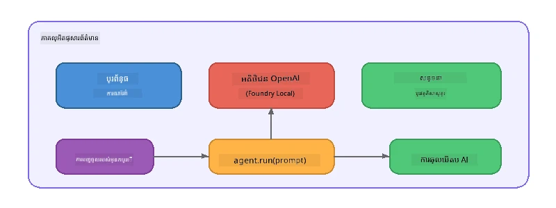

# ផ្នែកទី 5៖ ការសង់ភ្នាក់ងារលំនាំប្រព័ន្ធ AI ជាមួយ Agent Framework

> **គោលដៅ:** សង់ភ្នាក់ងារលំនាំ AI ដំបូងរបស់អ្នកដែលមានការណែនាំដែលនៅប្រចាំ និងបុគ្គលិកលក្ខណៈដែលបានកំណត់ ដោយបង្កើតជាមួយគំរូក្នុងស្រុកតាមរយៈ Foundry Local។

## ភ្នាក់ងារលំនាំ AI ជាអ្វី?

ភ្នាក់ងារលំនាំ AI នេះជាសំណុំបំលែងភាសាមួយដែលមាន **ការណែនាំប្រព័ន្ធ** ដែលកំណត់ចנងសម្បត្តិរបស់វា បុគ្គលិកលក្ខណៈ និងកំណត់កំណងហត្ថពលកម្ម។ ផ្ទុយពីការហៅបញ្ចប់ជិវិតតែមួយជាចំណុច, ភ្នាក់ងារលំនាំផ្ដល់ឱ្យ:

- **បុគ្គលិកលក្ខណៈ** - អត្តសញ្ញាណថេរ ("អ្នកគឺជាអ្នកពិនិត្យកូដដែលជួយបាន")
- **ការចងចាំ** - ប្រវត្តិការសន្ទនា តាមរយៈជុំវត្ដ
- **ការប្រកួតបញ្ហា** - អាកប្បកិរិយាគោលបំណងដែលបើកបានដោយការណែនាំដែលបានរៀបចំល្អ



---

## Agent Framework របស់ Microsoft

**Microsoft Agent Framework** (AGF) ផ្ដល់នូវការតំណាងភ្នាក់ងារមានគោលការណ៍ស្តង់ដារដែលដំណើរការជាមួយផ្នែកក្រោយគំរូផ្សេងៗគ្នា។ ក្នុងព្រឹត្តិបត្រនេះ យើងភ្ជាប់វាជាមួយ Foundry Local ដើម្បីអនុញ្ញាតឲ្យអ្វីៗគ្រប់យ៉ាងដំណើរការក្នុងម៉ាស៊ីនរបស់អ្នក - មិនចាំបាច់ប្រើមេឃទេ។

| គំនិត | ការពិពណ៌នា |
|---------|-------------|
| `FoundryLocalClient` | Python: គ្រប់គ្រងការចាប់ផ្តើមសេវាកម្ម ការទាញយក/ផ្ទុកម៉ូដែល និងបង្កើតភ្នាក់ងារ |
| `client.as_agent()` | Python: បង្កើតភ្នាក់ងារពី клієнт Foundry Local |
| `AsAIAgent()` | C#: វិធីសាស្រ្តបន្ថែមលើ `ChatClient` - បង្កើត `AIAgent` |
| `instructions` | ជំហានប្រព័ន្ធដែលរៀបចំអាកប្បកិរិយារបស់ភ្នាក់ងារ |
| `name` | ស្លាកអានច្បាស់សម្រាប់មនុស្ស ដែលមានប្រយោជន៍ក្នុងស្ថានភាពភ្នាក់ងារច្រើន |
| `agent.run(prompt)` / `RunAsync()` | ផ្ញើសារអ្នកប្រើប្រាស់ ហើយទទួលបានចម្លើយពីភ្នាក់ងារ |

> **សំគាល់៖** Agent Framework មាន SDK សម្រាប់ Python និង .NET។ សម្រាប់ JavaScript យើងអនុវត្ត `ChatAgent` ថ្នាក់ស្រាលដែលសម្រួលគំរូដូចគ្នាដោយប្រើ OpenAI SDK ដោយផ្ទាល់។

---

## សមនុស្សវិជ្ជាជីវៈ

### សមនុស្សវិធី 1 - យល់ដឹងពីលំនាំភ្នាក់ងារ

មុនសរសេរកូដ សូមសិក្សាទៅលើធាតុសំខាន់ៗនៃភ្នាក់ងារ៖

1. **ម៉ូដែលឈ្មោះក្រុមហ៊ុន** - តភ្ជាប់ទៅ API ដែលផ្គូផ្គងនឹង OpenAI របស់ Foundry Local
2. **ការណែនាំប្រព័ន្ធ** - "បុគ្គលិកលក្ខណៈ" នៃការណែនាំ
3. **រង្វិលដំណើរការ** - ផ្ញើបញ្ចូលពីអ្នកប្រើ ទទួលចេញ

> **គិតពីវា៖** តើយ៉ាងដូចម្តេចការណែនាំប្រព័ន្ធខុសពីសារវិលជាធម្មតារបស់អ្នកប្រើ? តើអ្វីកើតឡើងប្រសិនបើអ្នកផ្លាស់ប្តូរពួកវា?

---

### សមនុស្សវិធី 2 - ដំណើរការឧទាហរណ៍ភ្នាក់ងារតែមួយ

<details>
<summary><strong>🐍 Python</strong></summary>

**តម្រូវការមុន:**  
```bash
cd python
python -m venv venv

# Windows (PowerShell):
venv\Scripts\Activate.ps1
# macOS:
source venv/bin/activate

pip install -r requirements.txt
```
  
**ដំណើរការ:**  
```bash
python foundry-local-with-agf.py
```
  
**ពន្យល់កូដ** (`python/foundry-local-with-agf.py`):

```python
import asyncio
from agent_framework_foundry_local import FoundryLocalClient

async def main():
    alias = "phi-4-mini"

    # FoundryLocalClient គ្រប់គ្រងការចាប់ផ្តើមសេវាកម្ម, ទាញយកម៉ូដែល, និងការបង្ហោះ
    client = FoundryLocalClient(model_id=alias)
    print(f"Client Model ID: {client.model_id}")

    # បង្កើតភ្នាក់ងារជាមួយការណែនាំប្រព័ន្ធ
    agent = client.as_agent(
        name="Joker",
        instructions="You are good at telling jokes.",
    )

    # មិនបញ្ចាំង: ទទួលបានចម្លើយពេញលេញក្នុងមួយពេល
    result = await agent.run("Tell me a joke about a pirate.")
    print(f"Agent: {result}")

    # បញ្ចាំង: ទទួលបានលទ្ធផលនៅពេលដែលវាត្រូវបង្កើត
    async for chunk in agent.run("Tell me another joke.", stream=True):
        if chunk.text:
            print(chunk.text, end="", flush=True)

asyncio.run(main())
```
  
**ចំណុចសំខាន់ៗ:**  
- `FoundryLocalClient(model_id=alias)` គ្រប់គ្រងការចាប់ផ្តើមសេវាកម្ម ការទាញយក និងផ្ទុកម៉ូដែលជាការថែមទាំងមួយជំហាន
- `client.as_agent()` បង្កើតភ្នាក់ងារជាមួយការណែនាំប្រព័ន្ធ និងឈ្មោះ
- `agent.run()` គាំទ្រទាំងរបៀបមិនបញ្ចេញពន្លឺនិងបញ្ចេញពន្លឺ
- តំឡើងដោយ `pip install agent-framework-foundry-local --pre`

</details>

<details>
<summary><strong>📦 JavaScript</strong></summary>

**តម្រូវការមុន:**  
```bash
cd javascript
npm install
```
  
**ដំណើរការ:**  
```bash
node foundry-local-with-agent.mjs
```
  
**ពន្យល់កូដ** (`javascript/foundry-local-with-agent.mjs`):

```javascript
import { OpenAI } from "openai";
import { FoundryLocalManager } from "foundry-local-sdk";

class ChatAgent {
  constructor({ client, modelId, instructions, name }) {
    this.client = client;
    this.modelId = modelId;
    this.instructions = instructions;
    this.name = name;
    this.history = [];
  }

  async run(userMessage) {
    const messages = [
      { role: "system", content: this.instructions },
      ...this.history,
      { role: "user", content: userMessage },
    ];
    const response = await this.client.chat.completions.create({
      model: this.modelId,
      messages,
    });
    const assistantMessage = response.choices[0].message.content;

    // ទុករក្សាអត្ថបទជជែកសម្រាប់ការប្រាស្រ័យទាក់ទងពហុជំហាន
    this.history.push({ role: "user", content: userMessage });
    this.history.push({ role: "assistant", content: assistantMessage });
    return { text: assistantMessage };
  }
}

async function main() {
  FoundryLocalManager.create({ appName: "FoundryLocalWorkshop" });
  const manager = FoundryLocalManager.instance;
  await manager.startWebService();

  const catalog = manager.catalog;
  const model = await catalog.getModel("phi-3.5-mini");
  if (!model.isCached) {
    console.log("Downloading model: phi-3.5-mini...");
    await model.download();
  }
  await model.load();

  const client = new OpenAI({
    baseURL: manager.urls[0] + "/v1",
    apiKey: "foundry-local",
  });

  const agent = new ChatAgent({
    client,
    modelId: model.id,
    instructions: "You are good at telling jokes.",
    name: "Joker",
  });

  const result = await agent.run("Tell me a joke about a pirate.");
  console.log(result.text);
}

main();
```
  
**ចំណុចសំខាន់ៗ:**  
- JavaScript បង្កើតថ្នាក់ `ChatAgent` ផ្ទាល់ខ្លួនដែលស្រដៀងនឹងលំនាំ Python AGF  
- `this.history` រក្សាទុកជុំវត្ដនៃការសន្ទនាសម្រាប់គាំទ្រជុំវត្ដច្រើន  
- សកម្មភាព `startWebService()` → ពិនិត្យកាសេ → `model.download()` → `model.load()` ផ្ដល់នូវទិដ្ឋភាពពេញលេញ

</details>

<details>
<summary><strong>💜 C#</strong></summary>

**តម្រូវការមុន:**  
```bash
cd csharp
dotnet restore
```
  
**ដំណើរការ:**  
```bash
dotnet run agent
```
  
**ពន្យល់កូដ** (`csharp/SingleAgent.cs`):

```csharp
using Microsoft.AI.Foundry.Local;
using Microsoft.Extensions.Logging.Abstractions;
using Microsoft.Agents.AI;
using OpenAI;
using System.ClientModel;

// 1. Start Foundry Local and load a model
var alias = "phi-3.5-mini";
await FoundryLocalManager.CreateAsync(
    new Configuration
    {
        AppName = "FoundryLocalSamples",
        Web = new Configuration.WebService { Urls = "http://127.0.0.1:0" }
    }, NullLogger.Instance, default);
var manager = FoundryLocalManager.Instance;
await manager.StartWebServiceAsync(default);

var catalog = await manager.GetCatalogAsync(default);
var model = await catalog.GetModelAsync(alias, default);

var isCached = await model.IsCachedAsync(default);
if (!isCached)
{
    Console.WriteLine($"Downloading model: {alias}...");
    await model.DownloadAsync(null, default);
}
await model.LoadAsync(default);

var key = new ApiKeyCredential("foundry-local");
var client = new OpenAIClient(key, new OpenAIClientOptions
{
    Endpoint = new Uri(manager.Urls[0] + "/v1")
});

// 2. Create an AIAgent using the Agent Framework extension method
AIAgent joker = client
    .GetChatClient(model.Id)
    .AsAIAgent(
        instructions: "You are good at telling jokes. Keep your jokes short and family-friendly.",
        name: "Joker"
    );

// 3. Run the agent (non-streaming)
var response = await joker.RunAsync("Tell me a joke about a pirate.");
Console.WriteLine($"Joker: {response}");

// 4. Run with streaming
await foreach (var update in joker.RunStreamingAsync("Tell me another joke."))
{
    Console.Write(update);
}
```
  
**ចំណុចសំខាន់ៗ:**  
- `AsAIAgent()` ជាវិធីសាស្រ្តបន្ថែមពី `Microsoft.Agents.AI.OpenAI` - មិនចាំបាច់មានថ្នាក់ `ChatAgent` ផ្ទាល់ខ្លួន  
- `RunAsync()` ត្រឡប់ចម្លើយពេញលេញ; `RunStreamingAsync()` ផ្ទេរជាអក្សរទៅមួយដោយមួយ  
- តំឡើងដោយ `dotnet add package Microsoft.Agents.AI.OpenAI --version 1.0.0-rc3`

</details>

---

### សមនុស្សវិធី 3 - ផ្លាស់ប្តូរបុគ្គលិកលក្ខណៈ

កែប្រែ `instructions` របស់ភ្នាក់ងារដើម្បីបង្កើតបុគ្គលិកលក្ខណៈផ្សេង។ សូមសាកល្បងមួយនេះ និងមើលការផ្លាស់ប្តូរចេញ៖

| បុគ្គលិកលក្ខណៈ | ការណែនាំ |
|---------|-------------|
| អ្នកពិនិត្យកូដ | `"អ្នកជាអ្នកពិនិត្យកូដឯកទេស។ សូមផ្ដល់មតិយោបល់សាងសង់ដែលផ្អែកលើការអានបានងាយ សមត្ថភាព និងភាពត្រឹមត្រូវ។"` |
| មគ្គុទេសក៍ធ្វើដំណើរ | `"អ្នកជាមគ្គុទេសក៍ធ្វើដំណើរដែលរួសរាយ។ ផ្ដល់អនុសាសន៍ផ្ទាល់ខ្លួនសម្រាប់កន្លែងទេសចរណ៍ សកម្មភាព និងម្ហូបប្រចាំតំបន់។"` |
| គ្រូបង្រៀនសុក្រីតិក | `"អ្នកជាគ្រូបង្រៀនសុក្រីតិក។ មិនផ្ដល់ចម្លើយផ្ទាល់ទេ - តែណែនាំសិស្សដោយសំណួរយោគយល់។"` |
| អ្នកសរសេរបច្ចេកទេស | `"អ្នកជាអ្នកសរសេរបច្ចេកទេស។ ពន្យល់យ៉ាងច្បាស់ និងខ្លី។ ប្រើឧទាហរណ៍។ ជៀសវាងការប្រើពាក្យបំណញ្ជា។"` |

**សាកល្បង៖**  
1. ជ្រើសបុគ្គលិកលក្ខណៈពីតារាងខាងលើ  
2. ជំនួសអក្សរសំណុំ `instructions` ក្នុងកូដ  
3. ប្ដូរប្រកាសអ្នកប្រើឲ្យត្រូវ (ឧ. សូមអ្នកពិនិត្យកូដពិនិត្យមុខងារ)  
4. ដំណើរការឧទាហរណ៍ម្តងទៀត ហើយប្រៀបធៀបលទ្ធផល  

> **គន្លឹះ៖** គុណភាពភ្នាក់ងារពឹងផ្អែកយ៉ាងខ្លាំងលើការណែនាំ។ ការណែនាំច្បាស់លាស់ និងមានរចនាសម្ព័ន្ធល្អ ផលិតលទ្ធផលល្អជាងការណែនាំដែលមិនច្បាស់។

---

### សមនុស្សវិធី 4 - បន្ថែមការសន្ទនាជុំវត្ដច្រើន

ពង្រីកឧទាហរណ៍ ដើម្បីគាំទ្រមូលដ្ឋានសន្ទនាជុំវត្ដច្រើន ដូច្នេះអ្នកអាចមានការសន្ទនាបន្តៗជាមួយភ្នាក់ងារ។

<details>
<summary><strong>🐍 Python - រង្វិលជុំវត្ដច្រើន</strong></summary>

```python
import asyncio
from agent_framework_foundry_local import FoundryLocalClient

async def main():
    client = FoundryLocalClient(model_id="phi-4-mini")

    agent = client.as_agent(
        name="Assistant",
        instructions="You are a helpful assistant.",
    )

    print("Chat with the agent (type 'quit' to exit):\n")
    while True:
        user_input = input("You: ")
        if user_input.strip().lower() in ("quit", "exit"):
            break
        result = await agent.run(user_input)
        print(f"Agent: {result}\n")

asyncio.run(main())
```

</details>

<details>
<summary><strong>📦 JavaScript - រង្វិលជុំវត្ដច្រើន</strong></summary>

```javascript
import { OpenAI } from "openai";
import { FoundryLocalManager } from "foundry-local-sdk";
import * as readline from "node:readline/promises";

// (ធ្វើការប្រើឡើងវិញថ្នាក់ ChatAgent ពីចំណាត់ថ្នាក់តេស្តលំហាត់ 2)

async function main() {
  FoundryLocalManager.create({ appName: "FoundryLocalWorkshop" });
  const manager = FoundryLocalManager.instance;
  await manager.startWebService();

  const catalog = manager.catalog;
  const model = await catalog.getModel("phi-3.5-mini");
  if (!model.isCached) {
    console.log("Downloading model: phi-3.5-mini...");
    await model.download();
  }
  await model.load();

  const client = new OpenAI({
    baseURL: manager.urls[0] + "/v1",
    apiKey: "foundry-local",
  });

  const agent = new ChatAgent({
    client,
    modelId: model.id,
    instructions: "You are a helpful assistant.",
    name: "Assistant",
  });

  const rl = readline.createInterface({
    input: process.stdin,
    output: process.stdout,
  });

  console.log("Chat with the agent (type 'quit' to exit):\n");
  while (true) {
    const userInput = await rl.question("You: ");
    if (["quit", "exit"].includes(userInput.trim().toLowerCase())) break;
    const result = await agent.run(userInput);
    console.log(`Agent: ${result.text}\n`);
  }
  rl.close();
}

main();
```

</details>

<details>
<summary><strong>💜 C# - រង្វិលជុំវត្ដច្រើន</strong></summary>

```csharp
using Microsoft.AI.Foundry.Local;
using Microsoft.Extensions.Logging.Abstractions;
using Microsoft.Agents.AI;
using OpenAI;
using System.ClientModel;

var alias = "phi-3.5-mini";
var config = new Configuration
{
    AppName = "FoundryLocalSamples",
    Web = new Configuration.WebService { Urls = "http://127.0.0.1:0" }
};
await FoundryLocalManager.CreateAsync(config, NullLogger.Instance, default);
var manager = FoundryLocalManager.Instance;
await manager.StartWebServiceAsync(default);

var catalog = await manager.GetCatalogAsync(default);
var model = await catalog.GetModelAsync(alias, default);

var isCached = await model.IsCachedAsync(default);
if (!isCached)
{
    Console.WriteLine($"Downloading model: {alias}...");
    await model.DownloadAsync(null, default);
}
await model.LoadAsync(default);

var key = new ApiKeyCredential("foundry-local");
var client = new OpenAIClient(key, new OpenAIClientOptions
{
    Endpoint = new Uri(manager.Urls[0] + "/v1")
});

AIAgent agent = client
    .GetChatClient(model.Id)
    .AsAIAgent(
        instructions: "You are a helpful assistant.",
        name: "Assistant"
    );

Console.WriteLine("Chat with the agent (type 'quit' to exit):\n");
while (true)
{
    Console.Write("You: ");
    var userInput = Console.ReadLine();
    if (string.IsNullOrWhiteSpace(userInput) ||
        userInput.Equals("quit", StringComparison.OrdinalIgnoreCase) ||
        userInput.Equals("exit", StringComparison.OrdinalIgnoreCase))
        break;

    var result = await agent.RunAsync(userInput);
    Console.WriteLine($"Agent: {result}\n");
}
```

</details>

សម្គាល់ថាភ្នាក់ងារចងចាំជុំវត្ដមុនៗ - សួរពាក្យសំណួរបន្ត ហើយមើលរបៀបប្រវត្តិសន្ទនាត្រូវបានផ្ទុកទៅតាម។

---

### សមនុស្សវិធី 5 - លទ្ធផលដែលមានរចនាសម្ព័ន្ធ

ណែនាំភ្នាក់ងារឲ្យពេលណាមួយតបឲ្យក្នុងទ្រង់ទ្រាយជាក់លាក់ (ឧ. JSON) ហើយផ្ទៀងផ្ទាត់លទ្ធផល៖

<details>
<summary><strong>🐍 Python - លទ្ធផល JSON</strong></summary>

```python
import asyncio
import json
from agent_framework_foundry_local import FoundryLocalClient

async def main():
    client = FoundryLocalClient(model_id="phi-4-mini")

    agent = client.as_agent(
        name="SentimentAnalyzer",
        instructions=(
            "You are a sentiment analysis agent. "
            "For every user message, respond ONLY with valid JSON in this format: "
            '{"sentiment": "positive|negative|neutral", "confidence": 0.0-1.0, "summary": "brief reason"}'
        ),
    )

    result = await agent.run("I absolutely loved the new restaurant downtown!")
    print("Raw:", result)

    try:
        parsed = json.loads(str(result))
        print(f"Sentiment: {parsed['sentiment']} (confidence: {parsed['confidence']})")
    except json.JSONDecodeError:
        print("Agent did not return valid JSON - try refining the instructions.")

asyncio.run(main())
```

</details>

<details>
<summary><strong>💜 C# - លទ្ធផល JSON</strong></summary>

```csharp
using System.Text.Json;

AIAgent analyzer = chatClient.AsAIAgent(
    name: "SentimentAnalyzer",
    instructions:
        "You are a sentiment analysis agent. " +
        "For every user message, respond ONLY with valid JSON in this format: " +
        "{\"sentiment\": \"positive|negative|neutral\", \"confidence\": 0.0-1.0, \"summary\": \"brief reason\"}"
);

var response = await analyzer.RunAsync("I absolutely loved the new restaurant downtown!");
Console.WriteLine($"Raw: {response}");

try
{
    var parsed = JsonSerializer.Deserialize<JsonElement>(response.ToString());
    Console.WriteLine($"Sentiment: {parsed.GetProperty("sentiment")} " +
                      $"(confidence: {parsed.GetProperty("confidence")})");
}
catch (JsonException)
{
    Console.WriteLine("Agent did not return valid JSON - try refining the instructions.");
}
```

</details>

> **សម្គាល់៖** ម៉ូដែលស្រុកតិចតួចប្រហែលជា មិនអាចបង្កើត JSON ដែលពេញលេញបានត្រឹមត្រូវនៅពេលគ្រប់បាន។ អ្នកអាចបង្កើនភាពទៀងទាត់ដោយបញ្ចូលឧទាហរណ៍ក្នុងការណែនាំ និងធ្វើឲ្យច្បាស់លាស់អំពីទ្រង់ទ្រាយដែលរំពឹងទុក។

---

## ចំណុចសំខាន់ៗដែលបានជ្រាប

| គំនិត | អ្វីដែលអ្នកបានរៀន |
|---------|-----------------|
| ភ្នាក់ងារ ប្រៀបធៀបទៅនឹងការហៅ LLM ត្រង់ | ភ្នាក់ងារបង្ហាប់ម៉ូដែលជាមួយការណែនាំ និងការចងចាំ |
| ការណែនាំប្រព័ន្ធ | ជាគន្លងសំខាន់បំផុតសម្រាប់គ្រប់គ្រងអាកប្បកិរិយាប្រព័ន្ធភ្នាក់ងារ |
| សន្ទនាជុំវត្ដច្រើន | ភ្នាក់ងារអាចយកបរិបទទៅជុំវត្ដច្រើនរបស់អ្នកប្រើ |
| លទ្ធផលដែលមានរចនាសម្ព័ន្ធ | ការណែនាំអាចបញ្ជាប្រភេទលទ្ធផល (JSON, markdown, ល។) |
| ការប្រតិបត្ដិនៅក្នុងស្រុក | អ្វីៗគ្រប់យ៉ាងដំណើរការនៅលើឧបករណ៍ដោយ Foundry Local - មិនចាំបាច់ប្រើមេឃទេ |

---

## ជំហានបន្ទាប់

ក្នុង **[ផ្នែកទី 6៖ ស្ទ្រីមភ្នាក់ងារច្រើន](part6-multi-agent-workflows.md)** អ្នកនឹងបញ្ចូលភ្នាក់ងារច្រើនជាសំណុំធ្វើការប្រកួតប្រជែងក្នុងប_PIPELINE_ ដែលភ្នាក់ងារនីមួយៗមានតួនាទីជាក់លាក់។