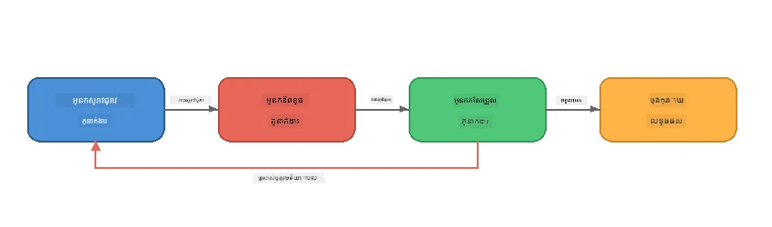
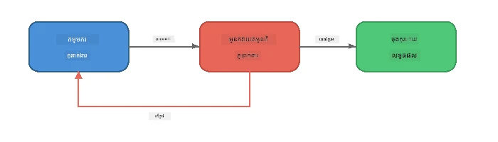
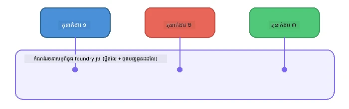

# ផ្នែក 6៖ ការងារជាច្រើនភ្នាក់ងារជាប្រព័ន្ធ

> **គោលបំណង៖** ផ្គូផ្គងភ្នាក់ងារពិសេសជាច្រើនទៅជា ប៉ាយប៊ីន​ដ៏សម្រួល ដែលចែកចាយភារកិច្ចស្មុគស្មាញទៅអ្នកភ្នាក់ងារសហការជាមួយគ្នា - ទាំងអស់ដំណើរការផ្ទាល់ក្នុងគោលដៅ Foundry Local។

## ហេតុអ្វីបានជាការងារជាច្រើនភ្នាក់ងារ?

ភ្នាក់ងារតែមួយអាចគ្រប់គ្រងភារកិច្ចជាច្រើន ប៉ុន្តែមុខងារជាច្រើនវែងមានអត្ថប្រយោជន៍ពី **ការពិសេសជាង**។ មិនមែនជា ភ្នាក់ងារតែមួយព្យាយាមស្រាវជ្រាវ សរសេរ និងកែប្រែដំណើរការខណៈតែមួយទេ អ្នកចែកការងារនៅក្នុងតួនាទីផ្តោតលើ៖



| រចនាប័ទ្ម | ការពិពណ៌នា |
|---------|-------------|
| **តាមលំដាប់** | ផលិតផលពីភ្នាក់ងារ A ផ្គត់ផ្គង់ដល់ភ្នាក់ងារ B → ភ្នាក់ងារ C |
| **ច្រកស្តុកមតិ** | ភ្នាក់ងារវាយតម្លៃអាចផ្ញើការងារត្រឡប់ទៅកែប្រែឡើងវិញ |
| **បរិបទរួម** | ភ្នាក់ងារទាំងអស់ប្រើម៉ូដែល/ចំណុចចុងដូចគ្នា ប៉ុន្តែមានការណែនាំខុសគ្នាទៅ |
| **លទ្ធផលបែប Typed** | ភ្នាក់ងារបង្កើតលទ្ធផលរចនាសម្ព័ន្ធ (JSON) សម្រាប់ការបញ្ជូនទុកចិត្តបាន |

---

## កិច្ចការហាត់

### កិច្ចការ 1 - ដំណើរការ​ប៉ាយប៊ីន Multi-Agent

វគ្គសិក្សានេះមានដំណើរការ Researcher → Writer → Editor បានពេញលេញ។

<details>
<summary><strong>🐍 Python</strong></summary>

**ការតំឡើង៖**
```bash
cd python
python -m venv venv

# វីនដូរ (PowerShell):
venv\Scripts\Activate.ps1
# macOS:
source venv/bin/activate

pip install -r requirements.txt
```

**ដំណើរការ៖**
```bash
python foundry-local-multi-agent.py
```

**អ្វីកើតឡើង៖**
1. **Researcher** ទទួលបានប្រធានបទ និងត្រឡប់មកវិញជាចំណុចសំខាន់ៗ
2. **Writer** ប្រើការស្រាវជ្រាវ និងសរសេរអត្ថបទប្លក់ (3-4 ចំណុចកថា)
3. **Editor** ពិនិត្យអត្ថបទសម្រាប់គុណភាព និងផ្តល់ការទទួលយក ឬ កែប្រែ

</details>

<details>
<summary><strong>📦 JavaScript</strong></summary>

**ការតំឡើង៖**
```bash
cd javascript
npm install
```

**ដំណើរការ៖**
```bash
node foundry-local-multi-agent.mjs
```

**ប៉ាយប៊ីនដូចគ្នា​បីជំហាន** - Researcher → Writer → Editor។

</details>

<details>
<summary><strong>💜 C#</strong></summary>

**ការតំឡើង៖**
```bash
cd csharp
dotnet restore
```

**ដំណើរការ៖**
```bash
dotnet run multi
```

**ប៉ាយប៊ីនដូចគ្នា​បីជំហាន** - Researcher → Writer → Editor។

</details>

---

### កិច្ចការ 2 - រចនាសម្ព័ន្ធរបស់ប៉ាយប៊ីន

សិក្សាថាតើភ្នាក់ងារត្រូវបានកំណត់ និងភ្ជាប់យ៉ាងដូចម្តេច៖

**1. អតិថិជនម៉ូដែលរួម**

ភ្នាក់ងារទាំងអស់ចែករំលែកម៉ូដែល Foundry Local តែមួយ៖

```python
# Python - FoundryLocalClient គ្រប់គ្រងគ្រប់យ៉ាង
from agent_framework_foundry_local import FoundryLocalClient

client = FoundryLocalClient(model_id="phi-3.5-mini")
```

```javascript
// JavaScript - OpenAI SDK បង្ហាញនៅ Foundry Local
const client = new OpenAI({
  baseURL: manager.urls[0] + "/v1",
  apiKey: "foundry-local",
});
```

```csharp
// C# - OpenAIClient pointed at Foundry Local
var key = new ApiKeyCredential("foundry-local");
var client = new OpenAIClient(key, new OpenAIClientOptions
{
    Endpoint = new Uri(manager.Urls[0] + "/v1")
});
var chatClient = client.GetChatClient(model.Id);
```

**2. ការណែនាំពិសេស**

ភ្នាក់ងាររៀងរាល់ត្រួតបាញ់មានបុគ្គលិកលក្ខណៈខុសគ្នា៖

| ភ្នាក់ងារ | ការណែនាំ (សង្ខេប) |
|-------|----------------------|
| Researcher | "ផ្តល់ព័ត៌មានសំខាន់ៗ ស្ថិតិ និងប្រវត្តិផ្នែក។ រៀបចំជាចំណុចគោល។" |
| Writer | "សរសេរអត្ថបទប្លក់ទាក់ទាញ (3-4 ចំណុចកថា) ពីកំណត់ត្រាស្រាវជ្រាវ។ មិនបង្កើតព័ត៌មានថ្មី។" |
| Editor | "ពិនិត្យច្បាស់លាស់ សំណុំរឿង និងភាពសមរម្យនៃព័ត៌មាន។ សេចក្ដីសម្រេច៖ ទទួលយក ឬ កែប្រែ។" |

**3. ទិន្នន័យផ្លាស់ប្តូរវិញរវាងភ្នាក់ងារ**

```python
# ជំហាន់ 1 - ផល​ចេញ​ពី​អ្នកស្រាវជ្រាវ​ក្លាយ​ជា​អ្វីដែល​អ្នកសរសេរ​ប្រើ
research_result = await researcher.run(f"Research: {topic}")

# ជំហាន់ 2 - ផល​ចេញ​ពី​អ្នកសរសេរ​ក្លាយ​ជា​អ្វីដែល​អ្នកកែ​សម្រួល​ប្រើ
writer_result = await writer.run(f"Write using:\n{research_result}")

# ជំហាន់ 3 - អ្នកកែ​សម្រួល​ពិនិត្យឡើងវិញ​ស្រាវជ្រាវ និង​អត្ថបទ​ទាំងពីរ
editor_result = await editor.run(
    f"Research:\n{research_result}\n\nArticle:\n{writer_result}"
)
```

```csharp
// C# - same pattern, async calls with AIAgent
var researchNotes = await researcher.RunAsync(
    $"Research the following topic and provide key facts:\n{topic}");

var draft = await writer.RunAsync(
    $"Write a blog post based on these research notes:\n\n{researchNotes}");

var verdict = await editor.RunAsync(
    $"Review this article for quality and accuracy.\n\n" +
    $"Research notes:\n{researchNotes}\n\n" +
    $"Article:\n{draft}");
```

> **ចំណុចសំខាន់៖** ភ្នាក់ងារនីមួយៗទទួលបានបរិបទរួមពីភ្នាក់ងារកន្លងមក។ អ្នកកែសម្រួលមើលទាំងការស្រាវជ្រាវដើម និងសេចក្ដីខ្លួនដោះស្រាយ - វាជួយនាំឲ្យវាស្វែងរកភាពត្រឹមត្រូវនៃព័ត៌មាន។

---

### កិច្ចការ 3 - បន្ថែមភ្នាក់ងារទីបួន

ពង្រីកប៉ាយប៊ីនដោយបន្ថែមភ្នាក់ងារថ្មីមួយ។ ជ្រើសរើសមួយ៖

| ភ្នាក់ងារ | គោលបំណង | ការណែនាំ |
|-------|---------|-------------|
| **Fact-Checker** | ពិនិត្យអត្ថបទក្នុងអត្ថបទ | `"អ្នកបញ្ជាក់អត្ថបទពិតប្រាកដ។ សម្រាប់មួយម្ដង សូមប្រាប់ថាតើវាត្រូវបានគាំទ្រដោយកំណត់ត្រាស្រាវជ្រាវឬអត់។ ត្រឡប់ JSON មានឯកតាការពិនិត្យបាន/មិនបាន។"` |
| **Headline Writer** | បង្កើតចំណងជើងទាក់ទាញ | `"បង្កើតជម្រើសចំណងជើង ៥ សម្រាប់អត្ថបទ។ កែប្រែរចនាប័ទ្ម៖ ព័ត៌មាន, ចាប់អារម្មណ៍, សំណួរ, រាយបញ្ជី, ភាពអារម្មណ៍។"` |
| **Social Media** | បង្កើតការផ្សព្វផ្សាយ | `"បង្កើតការផ្សព្វផ្សាយបណ្ដាញសង្គម ៣ ដសម្រាប់អត្ថបទនេះ៖ មួយសម្រាប់ Twitter (280 តួអក្សរ), មួយសម្រាប់ LinkedIn (សន្ទស្សន៍វិជ្ជាជីវៈ), មួយសម្រាប់ Instagram (រៀបរាប់ពិរោះលេងជាមួយអ៊ីមូជី)។"` |

<details>
<summary><strong>🐍 Python - បន្ថែម Headline Writer</strong></summary>

```python
headline_agent = client.as_agent(
    name="HeadlineWriter",
    instructions=(
        "You are a headline specialist. Given an article, generate exactly "
        "5 headline options. Vary the style: informative, question-based, "
        "listicle, emotional, and provocative. Return them as a numbered list."
    ),
)

# បន្ទាប់ពីអ្នកកែលម្អទទួលយក កសាងចំណងជើងសារព័ត៌មាន
headline_result = await headline_agent.run(
    f"Generate headlines for this article:\n\n{writer_result}"
)
print(f"\n--- Headlines ---\n{headline_result}")
```

</details>

<details>
<summary><strong>📦 JavaScript - បន្ថែម Headline Writer</strong></summary>

```javascript
const headlineAgent = new ChatAgent({
  client,
  modelId: modelInfo.id,
  instructions:
    "You are a headline specialist. Given an article, generate exactly " +
    "5 headline options. Vary the style: informative, question-based, " +
    "listicle, emotional, and provocative. Return them as a numbered list.",
  name: "HeadlineWriter",
});

const headlineResult = await headlineAgent.run(
  `Generate headlines for this article:\n\n${writerResult.text}`
);
console.log(`\n--- Headlines ---\n${headlineResult.text}`);
```

</details>

<details>
<summary><strong>💜 C# - បន្ថែម Headline Writer</strong></summary>

```csharp
AIAgent headlineAgent = chatClient.AsAIAgent(
    name: "HeadlineWriter",
    instructions:
        "You are a headline specialist. Given an article, generate exactly " +
        "5 headline options. Vary the style: informative, question-based, " +
        "listicle, emotional, and provocative. Return them as a numbered list."
);

// After the editor accepts, generate headlines
var headlines = await headlineAgent.RunAsync(
    $"Generate headlines for this article:\n\n{draft}");
Console.WriteLine($"\n--- Headlines ---\n{headlines}");
```

</details>

---

### កិច្ចការ 4 - រចនាប៉ាយប៊ីនរបស់អ្នកផ្ទាល់

រចនាប៉ាយប៊ីនពហុភ្នាក់ងារសម្រាប់ដែនផ្សេងទៀត។ នេះជាគំនិតមួយចំនួន៖

| ដែន | ភ្នាក់ងារ | លំនាំការតភ្ជាប់ |
|--------|--------|------|
| **ពិនិត្យកូដ** | Analyser → Reviewer → Summariser | វិភាគរចនាសម្ព័ន្ធកូដ → ពិនិត្យករណីបញ្ហា → បង្កើតរបាយការណ៍សង្ខេប |
| **គាំទ្រអតិថិជន** | Classifier → Responder → QA | ចាត់ថ្នាក់សំបុត្រ → ដាក់គំរូចម្លើយ → ពិនិត្យគុណភាព |
| **ការអប់រំ** | Quiz Maker → Student Simulator → Grader | បង្កើតសំណួរ → សមីការឆ្លើយតប → 매ង and ពន្យល់ |
| **វិភាគទិន្នន័យ** | Interpreter → Analyst → Reporter | បកស្រាយសំណើតម្រូវទិន្នន័យ → វិភាគប្រព័ន្ធតំណាង → សរសេររបាយការណ៍ |

**ជំហាន៖**
1. កំណត់ភ្នាក់ងារបីនាក់ ឬច្រើនជាមួយការណែនាំដូចខាងក្រោម
2. សម្រេចលំនាំទិន្នន័យ - ភ្នាក់ងារនីមួយៗទទួលបាននិងផលិតអ្វី?
3. អនុវត្តប៉ាយប៊ីនដោយប្រើរចនាប័ទ្មពីកិច្ចការទី១-៣
4. បន្ថែមច្រកស្តុកមតិ ប្រសិនបើភ្នាក់ងារមួយត្រូវតែវាយតម្លៃការងាររបស់អ្នកដទៃ

---

## រចនាប័ទ្មការចងក្រង

នេះជារចនាប័ទ្មការចងក្រងដែលអាចប្រើបានសម្រាប់ប្រព័ន្ធភ្នាក់ងារពហុ (បានសិក្សា​ជ្រាលជ្រៅនៅ [ផ្នែក 7](part7-zava-creative-writer.md))៖

### ប៉ាយប៊ីនតាមលំដាប់


ភ្នាក់ងារនីមួយៗដំណើរការផលិតផលរបស់មុខងារមុន។ ប្រែប្រួលលើសាមញ្ញនិងអាចទាយទ្រង់បាន។

### ច្រកស្តុកមតិ



ភ្នាក់ងារវាយតម្លៃអាចបញ្ចូលចំណុចឲ្យដំណើរការវិញនៅជំហានមុនៗ។ អ្នកសរសេរ Zava អនុវត្តការនេះ៖ អ្នកកែសម្រួលអាចផ្ញើមតិវិញទៅកាន់អ្នកស្រាវជ្រាវ និងអ្នកសរសេរ។

### បរិបទរួម



ភ្នាក់ងារទាំងអស់ចែករំលែក `foundry_config` ដូចគ្នាប្រើម៉ូដែលនិងចំណុចចុង។

---

## ចំណុចសំខាន់ៗ

| គំនិត | អ្វីដែលអ្នកបានរៀន |
|---------|-----------------|
| ការពិសេសភ្នាក់ងារ | ភ្នាក់ងារនីមួយៗអនុវត្តរឿងមួយជាមួយការណែនាំផ្តោតលើ |
| ការបញ្ជូនទិន្នន័យ | លទ្ធផលពីភ្នាក់ងារមួយក្លាយជា ឧបករណ៍បញ្ចូលសម្រាប់ភ្នាក់ងារបន្ទាប់ |
| ច្រកស្តុកមតិ | ភ្នាក់ងារវាយតម្លៃអាចបង្ហាញការជឿនលឿន ដើម្បីគុណភាពខ្ពស់ขึ้น |
| លទ្ធផលរចនាសម្ព័ន្ធ | ចម្លើយរេហ្វ័រមេ JSON ផ្តល់នូវការប្រាស្រ័យទាក់ទងភ្នាក់ងារយ៉ាងទុកចិត្តបាន |
| ការគ្រប់គ្រង | អ្នកសម្របសម្រួលគ្រប់គ្រងលំដាប់ប៉ាយប៊ីន និងដោះស្រាយកំហុស |
| រចនាប័ទ្មផលិតកម្ម | ប្រើក្នុង [ផ្នែក 7៖ Zava Creative Writer](part7-zava-creative-writer.md) |

---

## ជំហានបន្ទាប់

បន្តទៅ [ផ្នែក 7៖ Zava Creative Writer - កម្មវិធី Capstone](part7-zava-creative-writer.md) ដើម្បីស្វែងយល់អំពីកម្មវិធីពហុភ្នាក់ងារដែលមានភ្នាក់ងារពិសេស៤ នាក់ បញ្ចេញលទ្ធផលបន្តផ្ទាល់ ទំហំផលិតផល ស្វែងរកផលិតផល និងច្រកស្តុកមតិ - មានសម្រាប់ Python, JavaScript និង C# ។