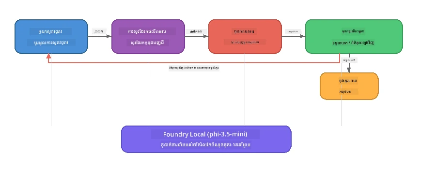

# ផ្នែក 7៖ អ្នកនិពន្ធ​សិល្បៈ​របស់ Zava - កម្មវិធី Capstone

> **គោលបំណង៖** ស្វែងយល់អំពីកម្មវិធី​មនុស្សច្រើន​ប្រភេទ​បែបផលិតកម្ម ដែលភ្នាក់ងារដែលមានឯកទេសបួនរូបសហប្រតិបត្តិការគ្នាដើម្បីផលិតអត្ថបទគុណភាពទស្សនាវដ្តីសម្រាប់ Zava Retail DIY - ដំណើរការជាទាំងស្រុងលើឧបករណ៍របស់អ្នកជាមួយ Foundry Local។

នេះគឺជាការប្រឡង **capstone lab** នៃវគ្គបណ្ដុះបណ្ដាល។ វាផ្គុំគ្នារវាងរឿងដែលអ្នកបានរៀន - ការសម្របសម្រួល SDK (ផ្នែក 3), ការយកទិន្នន័យពីកន្លែងស្ថិតក្នុងតំបន់ (ផ្នែក 4), រូបសម្បត្តិភ្នាក់ងារ (ផ្នែក 5), និងការគ្រប់គ្រងភ្នាក់ងារច្រើន (ផ្នែក 6) - ចូលទៅក្នុងកម្មវិធីពេញលេញដែលមានក្នុង **Python**, **JavaScript**, និង **C#** ។

---

## អ្វីដែលអ្នកនឹងស្វែងយល់

| យល់ដឹង | កន្លែងនៅក្នុង Zava Writer |
|---------|----------------------------|
| ការតម្កល់ម៉ូដែល 4 ជាន់ | មូឌុលកំណត់រចនាសម្ព័ន្ធរួម bootstrap Foundry Local |
| ការយកទិន្នន័យបែប RAG | ភ្នាក់ងារផលិតផលស្វែងរកក្នុងកាតាឡុកក្នុងតំបន់ |
| អង្គភាពជំនាញភ្នាក់ងារ | ភ្នាក់ងារបួនរូបមានសាកល្បង​ប្រព័ន្ធ​ផ្សេងគ្នា |
| ថ្មីចេញជាបន្ត | អ្នកនិពន្ធបញ្ចេញបញ្ចូលសញ្ញានៅពេលពិត |
| ការបញ្ជូនបច្ចេកទេសរចនាសម្ព័ន្ធ | អ្នកស្រាវជ្រាវ → JSON, អ្នកកែសម្រួល → ជម្រើស JSON |
| រង្វិលមតិយោបល់ | អ្នកកែសម្រួលអាចបញ្ចេញបញ្ជាពីការសួរមួយទៀត (កំណត់ចំនួន 2 ដង) |

---

## វិទ្យាស្ថានស្ថាបត្យកម្ម

អ្នកនិពន្ធសិល្បៈ Zava ប្រើ **បន្ទាត់បណ្ដោយជាមួយមតិយោបល់ជាអ្នកវាយតម្លៃ។** ការអនុវត្តភាសាទាំងបីអនុវត្តវិធានការស្ថាបត្យកម្មដូចគ្នា៖



### ភ្នាក់ងារបួនរូប

| ភ្នាក់ងារ | បញ្ចូល | ផលិត | បំណង |
|-------|-------|--------|---------|
| **អ្នកស្រាវជ្រាវ** | ប្រធានបទ + មតិយោបល់ជាជម្រើស | `{"web": [{url, name, description}, ...]}` | ប្រមូលស្រាវជ្រាវផ្ទៃក្រោយតាមរយៈ LLM |
| **ស្វែងរកផលិតផល** | ខ្សែអត្ថបទបរិបទផលិតផល | បញ្ជីផលិតផលដែលផ្គូផ្គង | សំណួរបង្កើតដោយ LLM + ស្វែងរកពាក្យគន្លឹះ ទល់នឹងកាតាឡុកក្នុងតំបន់ |
| **អ្នកនិពន្ធ** | ស្រាវជ្រាវ + ផលិតផល + កិច្ចការជូន + មតិយោបល់ | អត្ថបទទស្សនាវដ្តីផ្ទាត់បង្ហាញជាបន្ត (បំបែកនៅ `---`) | សរសេរ​អត្ថបទទស្សនាវដ្តីគុណភាពក្នុងពេលពិត |
| **អ្នកកែសម្រួល** | អត្ថបទ + មតិយោបល់របស់អ្នកនិពន្ធ | `{"decision": "accept/revise", "editorFeedback": "...", "researchFeedback": "..."}` | ពិនិត្យគុណភាព និងបញ្ចេញបញ្ជាការផ្លាស់ប្តូរ ប្រសិនបើត្រូវការ |

### ដំណើរការបន្ទាត់បណ្ដោយ

1. **អ្នកស្រាវជ្រាវ** ទទួលបានប្រធានបទ និងបង្កើតកំណត់ត្រាស្រាវជ្រាវរចនាសម្ព័ន្ធ (JSON)
2. **ស្វែងរកផលិតផល** សួរសំណួរនៅក្នុងកាតាឡុកផលិតផលក្នុងតំបន់ដោយប្រើពាក្យសំណួរបង្កើតដោយ LLM
3. **អ្នកនិពន្ធ** ប្រមូលស្រាវជ្រាវ + ផលិតផល + កិច្ចការជូនទៅជាអត្ថបទបន្ត ចម្លងមតិយោបល់បន្ថែមបន្ទាប់ពីប្រើ `---`
4. **អ្នកកែសម្រួល** ពិនិត្យអត្ថបទ និងតបតបជូនមតិយោបល់ជាទម្រង់ JSON៖
   - `"accept"` → បន្ទាត់បណ្ដោយ​បញ្ចប់
   - `"revise"` → មតិយោបល់ត្រូវផ្ញើត្រឡប់ទៅអ្នកស្រាវជ្រាវ និងអ្នកនិពន្ធ (ចំនួន 2 ដងបំផុត)

---

## មុនការចាប់ផ្តើម

- បញ្ចប់ [ផ្នែក 6៖ សកម្មភាពភ្នាក់ងារជាច្រើន](part6-multi-agent-workflows.md)
- ផ្ទុក Foundry Local CLI និងម៉ូដែល `phi-3.5-mini`

---

## វីធីសាកល្បង

### វីធីសាកល្បង 1 - ដំណើរការ Zava Creative Writer

ជ្រើសភាសារបស់អ្នក ហើយដំណើរការកម្មវិធី៖

<details>
<summary><strong>🐍 Python - សេវាកម្មវេប FastAPI</strong></summary>

វើស្យុង Python រត់ជា **សេវាកម្មវេប** ជាមួយ REST API បង្ហាញពីវិធីសាស្រ្តបង្កើតផ្នែកខាងក្រោយផលិតកម្ម។

**ការដំឡើង៖**
```bash
cd zava-creative-writer-local/src/api
python -m venv venv

# វីនដូ (PowerShell):
venv\Scripts\Activate.ps1
# macOS:
source venv/bin/activate

pip install -r requirements.txt
```

**ដំណើរការ៖**
```bash
uvicorn main:app --reload
```

**សាកល្បងវា៖**
```bash
curl -X POST http://localhost:8000/api/article \
  -H "Content-Type: application/json" \
  -d '{
    "research": "DIY home improvement trends",
    "products": "power tools and paints",
    "assignment": "Write an article about weekend renovation projects for DIY enthusiasts"
  }'
```

ការឆ្លើយតបបញ្ចូនត្រឡប់ជា JSON ពីរបារ newline បង្ហាញភាពរីកចម្រើននៃភ្នាក់ងារ។

</details>

<details>
<summary><strong>📦 JavaScript - CLI Node.js</strong></summary>

វើស្យុង JavaScript រត់ជា **កម្មវិធី CLI** បោះពុម្ពភាពរីកចម្រើននៃភ្នាក់ងារ និងអត្ថបទទៅក្នុងគ្រាប់សារ។

**ការដំឡើង៖**
```bash
cd zava-creative-writer-local/src/javascript
npm install
```

**ដំណើរការ៖**
```bash
node main.mjs
```

អ្នកនឹងឃើញ៖
1. ម៉ូដែល Foundry Local បានផ្ទុក (មានរបារភាពរីកចម្រើនបើកំពុងទាញយក)
2. ភ្នាក់ងារផ្ទៀងផ្ទាត់តាមលំដាប់ជាមួយសារស្ថានភាព
3. អត្ថបទបញ្ចូនទៅគ្រាប់សារនៅពេលពិត
4. ជម្រើសទទួល/កែសម្រួល​របស់​អ្នកកែសម្រួល

</details>

<details>
<summary><strong>💜 C# - កម្មវិធី Console .NET</strong></summary>

វើស្យុង C# រត់ជា **កម្មវិធី Console .NET** ជាមួយបន្ទាត់បណ្ដោយដូចគ្នា និងការចេញបន្ត។

**ការដំឡើង៖**
```bash
cd zava-creative-writer-local/src/csharp
dotnet restore
```

**ដំណើរការ៖**
```bash
dotnet run
```

លំនាំចេញដូចដើម JavaScript - សារស្ថានភាពភ្នាក់ងារ អត្ថបទបន្ត និងជម្រើសអ្នកកែសម្រួល។

</details>

---

### វីធីសាកល្បង 2 - អប់រំរចនាសម្ព័ន្ធកូដ

ការអនុវត្តភាសាទាំងបីមានធាតុត្រឹមត្រូវដូចគ្នា។ ប្រៀបធៀបរចនាសម្ព័ន្ធ៖

**Python** (`src/api/`):
| ហត្ថលេខា | បំណង |
|------|---------|
| `foundry_config.py` | កម្មវិធីគ្រប់គ្រង Foundry Local រួមម៉ូដែល និងអតិថិជន (ចាប់ផ្តើម 4 ជាន់) |
| `orchestrator.py` | ការត្រួតត្រងបន្ទាត់បណ្ដោយជាមួយមតិយោបល់ឡើងវិញ |
| `main.py` | ចំណុចបញ្ចូល FastAPI (`POST /api/article`) |
| `agents/researcher/researcher.py` | ស្រាវជ្រាវដោយ LLM ជាមួយចេញ JSON |
| `agents/product/product.py` | សំណួរបង្កើតដោយ LLM + ស្វែងរកពាក្យគន្លឹះ |
| `agents/writer/writer.py` | ការបង្កើតអត្ថបទបន្ត |
| `agents/editor/editor.py` | ជម្រើសទទួល/កែសម្រួល JSON |

**JavaScript** (`src/javascript/`):
| ហត្ថលេខា | បំណង |
|------|---------|
| `foundryConfig.mjs` | កំណត់រចនាសម្ព័ន្ធ Foundry Local រួម (ចាប់ផ្តើម 4 ជាន់ ជាមួយរបារពីភាគរយ) |
| `main.mjs` | Orchestrator + ចំណុចចូល CLI |
| `researcher.mjs` | ភ្នាក់ងារស្រាវជ្រាវដោយ LLM |
| `product.mjs` | បង្កើតសំណួរ LLM + ស្វែងរកពាក្យគន្លឹះ |
| `writer.mjs` | ការបង្កើតអត្ថបទបន្ត (async generator) |
| `editor.mjs` | ជម្រើសទទួល/កែសម្រួល JSON |
| `products.mjs` | ទិន្នន័យកាតាឡុកផលិតផល |

**C#** (`src/csharp/`):
| ហត្ថលេខា | បំណង |
|------|---------|
| `Program.cs` | បន្ទាត់បណ្ដោយពេញលេញ៖ ផ្ទុកម៉ូដែល ភ្នាក់ងារ orchestrator មតិយោបល់ឡើងវិញ |
| `ZavaCreativeWriter.csproj` | វគ្គ .NET 9 ជាមួយFoundry Local + កញ្ចប់ OpenAI |

> **ចំណាំរចនាសម្ព័ន្ធ៖** Python ចែករំលែកភ្នាក់ងារ​ពីរ​ទៅក្នុង​ឯកសារ/ថត​ផ្ទាល់ខ្លួន (ល្អសម្រាប់ក្រុមធំៗ)។ JavaScript ប្រើមូឌុលមួយសម្រាប់ភ្នាក់ងារ​មួយ (ល្អសម្រាប់គម្រោងមធ្យម)។ C# រក្សាទុក​ទាំងអស់​នៅក្នុងឯកសារតែមួយជាមួយមុខងារផ្ទាល់ខ្លួន (ល្អសម្រាប់ឧទាហរណ៍សំរាប់ខ្លួនឯង)។ ក្នុងការផលិត ជ្រើសរើសរចនាបទដែលសមនឹងប្រព័ន្ធរបស់ក្រុមអ្នក។

---

### វិធីសាកល្បង 3 - តាមដានកំណត់រចនាសម្ព័ន្ធរួម

ភ្នាក់ងារទាំងអស់ក្នុងបន្ទាត់បណ្ដោយចែកចាយអ្នកអតិថិជនម៉ូដែល Foundry Local តែមួយ។ សិក្សាវិធីដំឡើងនៅក្នុងភាសាដែលអ្នកប្រើ៖

<details>
<summary><strong>🐍 Python - foundry_config.py</strong></summary>

```python
from foundry_local import FoundryLocalManager

MODEL_ALIAS = "phi-3.5-mini"

# ជំហានទី ១៖ បង្កើតអ្នកគ្រប់គ្រង និងចាប់ផ្តើមសេវាកម្ម Foundry Local
manager = FoundryLocalManager()
manager.start_service()

# ជំហានទី ២៖ ពិនិត្យមើលថាតើម៉ូដែលត្រូវបានទាញយករួចហើយឬនៅ
cached = manager.list_cached_models()
catalog_info = manager.get_model_info(MODEL_ALIAS)
is_cached = any(m.id == catalog_info.id for m in cached) if catalog_info else False

if not is_cached:
    manager.download_model(MODEL_ALIAS)

# ជំហានទី ៣៖ ផ្ទុកម៉ូដែលទៅក្នុងអត់ចាំ
manager.load_model(MODEL_ALIAS)
model_id = manager.get_model_info(MODEL_ALIAS).id

# ឆ្លើយតប OpenAI ដែលចែករំលែក
client = openai.OpenAI(base_url=manager.endpoint, api_key=manager.api_key)
```

ភ្នាក់ងារទាំងអស់នាំចូល `from foundry_config import client, model_id` ។

</details>

<details>
<summary><strong>📦 JavaScript - foundryConfig.mjs</strong></summary>

```javascript
import { FoundryLocalManager } from "foundry-local-sdk";
import { OpenAI } from "openai";

FoundryLocalManager.create({ appName: "ZavaCreativeWriter" });
const manager = FoundryLocalManager.instance;
await manager.startWebService();

// ពិនិត្យស្តុកពត៌មាន → ទាញយក → ផ្ទុក (រចនាប័ទ្ម SDK ថ្មី)
const catalog = manager.catalog;
const model = await catalog.getModel(MODEL_ALIAS);
if (!model.isCached) {
  console.log(`Downloading model: ${MODEL_ALIAS}...`);
  await model.download();
}
await model.load();

const client = new OpenAI({ baseURL: manager.urls[0] + "/v1", apiKey: "foundry-local" });
const modelId = model.id;
export { client, modelId };
```

ភ្នាក់ងារទាំងអស់នាំចូល `{ client, modelId } from "./foundryConfig.mjs"` ។

</details>

<details>
<summary><strong>💜 C# - ផ្នែកលើ Program.cs</strong></summary>

```csharp
await FoundryLocalManager.CreateAsync(
    new Configuration
    {
        AppName = "ZavaCreativeWriter",
        Web = new Configuration.WebService { Urls = "http://127.0.0.1:0" }
    }, NullLogger.Instance, default);
var manager = FoundryLocalManager.Instance;
await manager.StartWebServiceAsync(default);

var catalog = await manager.GetCatalogAsync(default);
var catalogModel = await catalog.GetModelAsync(alias, default);
var isCached = await catalogModel.IsCachedAsync(default);
if (!isCached)
    await catalogModel.DownloadAsync(null, default);

await catalogModel.LoadAsync(default);
var key = new ApiKeyCredential("foundry-local");
var chatClient = new OpenAIClient(key, new OpenAIClientOptions
{
    Endpoint = new Uri(manager.Urls[0] + "/v1")
}).GetChatClient(catalogModel.Id);
```

`chatClient` បន្ទាប់មកត្រូវផ្ញើទៅឲ្យមុខងារភ្នាក់ងារទាំងអស់នៅក្នុងឯកសារដូចគ្នា។

</details>

> **គំរូសំខាន់៖** លំនាំផ្ទុកម៉ូដែល (ចាប់ផ្តើមសេវាកម្ម → ពិនិត្យប្រើ cache → ទាញយក → ផ្ទុក) ធានាថាអ្នកប្រើបានឃើញការវិវឌ្ឍយ៉ាងច្បាស់ និងម៉ូដែលត្រូវបានទាញយកតែម្តងប៉ុណ្ណោះ។ នេះជាព្រឹត្តិការណ៍អនុវត្តល្អសម្រាប់កម្មវិធី Foundry Local ទាំងអស់។

---

### វិធីសាកល្បង 4 - យល់ដឹងពីរង្វិលមតិយោបល់

រង្វិលមតិយោបល់គឺជាអ្វីដែលធ្វើអោយបន្ទាត់បណ្ដោយនេះ “ឆ្លាត” – អ្នកកែសម្រួលអាចបញ្ជូនការងារត្រឡប់មកវិញសម្រាប់ការកែប្រែ។ តាមដានហេតុផល៖

```
Orchestrator:
  1. researcher.research(topic, "No Feedback")    ← first pass
  2. product.findProducts(productContext)
  3. writer.write(research, products, assignment)  ← streams article
  4. Split article at "---" → article + writerFeedback
  5. editor.edit(article, writerFeedback)

  WHILE editor says "revise" AND retryCount < 2:
    6. researcher.research(topic, editor.researchFeedback)  ← refined
    7. writer.write(research, products, editor.editorFeedback)
    8. editor.edit(newArticle, newWriterFeedback)
    9. retryCount++
```

**សំណួរដែលត្រូវពិចារណា៖**
- ហេតុអ្វីបានជាចំនួនព្យាយាមជួសជុលកំណត់ត្រឹម 2? តើមានអ្វីកើតឡើង ប្រសិនបើអ្នកបន្តបន្ថែម?
- ហេតុអ្វីបានជាអ្នកស្រាវជ្រាវទទួល `researchFeedback` ប៉ុន្តែអ្នកនិពន្ធទទួល `editorFeedback`?
- តើមានអ្វីកើតឡើង ប្រសិនបើអ្នកកែសម្រួលតែងតែបញ្ជាក់ "revise"?

---

### វិធីសាកល្បង 5 - កែប្រែអង្គភាពភ្នាក់ងារ

សាកល្បងប្ដូរប្រតិបត្តិការរបស់ភ្នាក់ងារមួយហើយសង្កេតមើលនូវផលប៉ះពាល់ចំពោះបន្ទាត់បណ្ដោយ៖

| ការផ្លាស់ប្ដូរ | ត្រូវប្តូរ​អ្វី? |
|-------------|----------------|
| **អ្នកកែសម្រួលតឹងរឹងជាងមុន** | ផ្លាស់ប្ដូរប្រព័ន្ធ​នៃអ្នកកែសម្រួលដើម្បីតែងតែស្នើសុំការកែប្រែយ៉ាងហោចណាស់មួយដង |
| **អត្ថបទវែងជាងមុន** | ប្ដូរបញ្ចូលអ្នកនិពន្ធពី "800-1000 ពាក្យ" ទៅជា "1500-2000 ពាក្យ" |
| **ផលិតផលផ្សេងគ្នា** | បន្ថែម ឬកែប្រែផលិតផលនៅក្នុងកាតាឡុកផលិតផល |
| **ប្រធានបទស្រាវជ្រាវថ្មី** | ប្ដូរកម្មវិធី `researchContext` ដើម្បីប្រធានបទផ្សេង |
| **អ្នកស្រាវជ្រាវ JSON តែប៉ុណ្ណោះ** | ធ្វើឲ្យអ្នកស្រាវជ្រាវបញ្ចេញ 10 ធាតុពីបែប៣-៥ |

> **បញ្ញាកាត់៖** ពីព្រោះភាសាទាំងបីអនុវត្តស្ថាបត្យកម្មដូចគ្នា អ្នកអាចធ្វើការផ្លាស់ប្ដូរដូចគ្នានៅភាសាដែលអ្នកស្រួលប្រើបំផុត។

---

### វិធីសាកល្បង 6 - បន្ថែមភ្នាក់ងារទីប្រាំមួយ

ពង្រីកបន្ទាត់បណ្ដោយជាមួយភ្នាក់ងារថ្មីមួយ។ មានគំនិតខ្លះ៖

| ភ្នាក់ងារ | កន្លែងក្នុងបន្ទាត់បណ្ដោយ | បំណង |
|-------|-------------------|---------|
| **អ្នកពិនិត្យការពិត** | បន្ទាប់ពីអ្នកនិពន្ធ មុនអ្នកកែសម្រួល | ពិនិត្យការអះអាងតាមទិន្នន័យស្រាវជ្រាវ |
| **អ្នកអោយតំលៃ SEO** | បន្ទាប់ពីអ្នកកែសម្រួលទទួល | បន្ថែមការពិពណ៌នាមេតា ពាក្យគន្លឹះ និង slug |
| **អ្នកគូររូបភាព** | បន្ទាប់ពីអ្នកកែសម្រួលទទួល | បង្កើតពាក្យបញ្ចូលរូបភាពសម្រាប់អត្ថបទ |
| **អ្នកបកប្រែ** | បន្ទាប់ពីអ្នកកែសម្រួលទទួល | បកប្រែអត្ថបទទៅជាភាសាផ្សេង |

**ជំហ៊ាន៖**
1. សរសេរ​ប្រព័ន្ធនៃភ្នាក់ងារ
2. បង្កើតមុខងារភ្នាក់ងារ (តាមគំរូដែលមានរួចក្នុងភាសារបស់អ្នក)
3. តំឡើងវាទៅក្នុង orchestrator នៅទីតាំងត្រឹមត្រូវ
4. បន្ទាន់សម័យការចេញ / កំណត់ដំណឹងរបស់អ្នកដំបូង ដើម្បីបង្ហាញចំណែករបស់ភ្នាក់ងារថ្មី

---

## របៀបធ្វើការ Foundry Local និង Agent Framework រួមគ្នា

កម្មវិធីនេះបង្ហាញពីគំរូណែនាំក្នុងការបង្កើតប្រព័ន្ធភ្នាក់ងារច្រើនជាមួយ Foundry Local៖

| ស្រទាប់ | ធាតុ | តួនាទី |
|-------|-----------|------|
| **Runtime** | Foundry Local | ទាញយក គ្រប់គ្រង និងបម្រើម៉ូដែលក្នុងតំបន់ |
| **Client** | OpenAI SDK | ផ្ញើការបញ្ចប់ការនិយាយទៅចំណុចបញ្ចប់ក្នុងតំបន់ |
| **Agent** | ប្រព័ន្ធនិងហៅបន្ទាត់ការសន្ទនា | អនុវត្តអាកប្បកិរិយាពិសេសតាមការណែនាំផ្តោតខ្លួន |
| **Orchestrator** | អ្នកផ្សារភ្ជាប់បន្ទាត់បណ្ដោយ | គ្រប់គ្រងហូរទិន្នន័យលំដាប់ និងរង្វិលមតិយោបល់ឡើងវិញ |
| **Framework** | Microsoft Agent Framework | ផ្ដល់អវកាស `ChatAgent` និងគំរូរចនា |

ចំណុចសំខាន់៖ **Foundry Local ជំនួសថាសខ្យល់មេក្រោមមេដែកមេហ្គេនមិនមែនរចនាសម្ព័ន្ធ​កម្មវិធី។** គំរូភ្នាក់ងារដូចគ្នា វិធីណែនាំ orchestration និងការផ្ដល់បញ្ជូនរចនាសម្ព័ន្ធដែលដំណើរការជាមួយម៉ូដែលនៅលើ cloud ក៏ដំណើរការដូចគ្នានៅលើម៉ូដែលក្នុងតំបន់ — អ្នកគ្រាន់តែបញ្ជាក់អតិថិជនទៅចំណុចបញ្ចប់ក្នុងតំបន់ជំនួស Azure។

---

## ចំណុចពិសេសដែលរំលឹក

| យល់ដឹង | អ្វីដែលអ្នកបានរៀន |
|---------|-----------------|
| វិទ្យាស្ថានផលិតកម្ម | វិធីការរៀបចំកម្មវិធីភ្នាក់ងារច្រើនជាមួយការកំណត់រចនាសម្ព័ន្ធរួម និងភ្នាក់ងារផ្សេងៗ |
| ការតម្កល់ម៉ូដែល 4 ជាន់ | មាត្រដ្ឋានល្អសម្រាប់បញ្ចូល Foundry Local ជាមួយការមើលឃើញរបាររីកចម្រើន |
| អង្គភាពជំនាញភ្នាក់ងារ | ភ្នាក់ងារបួនរូបមានការណែនាំផ្តោតខ្លួន និងទម្រង់ចេញគ្មានកំហុស |
| ការបង្កើតបន្ត | អ្នកនិពន្ធបញ្ចេញសញ្ជាតិទំនាក់ទំនងជាពេលពិត បង្កើត UI ដែលឆ្លើយតបបានលឿន |
| រង្វិលមតិយោបល់ | ការព្យាយាមឡើងវិញដោយអ្នកកែសម្រួលធ្វើឲ្យគុណភាពចេញល្អឡើងដោយគ្មានការចូលរួមមនុស្ស |
| គំរូភាសាច្រើន | រចនាសម្ព័ន្ធដូចគ្នាដំណើរការបានក្នុង Python, JavaScript, និង C# |
| នៅក្នុងតំបន់ = រៀបចំសំរាប់ផលិតកម្ម | Foundry Local បម្រើ API តំណាង OpenAI ដូចគ្នាដែលប្រើនៅ cloud |

---

## ជំហានបន្ទាប់

បន្តទៅ [ផ្នែក 8៖ ការអភិវឌ្ឍន៍ដោយយកការវាយតម្លៃជាមួលដ្ឋាន](part8-evaluation-led-development.md) ដើម្បីបង្កើតសំណុំប្រព័ន្ធវាយតម្លៃសម្រាប់ភ្នាក់ងាររបស់អ្នក ដោយប្រើឯកសារទិន្នន័យមាស ការត្រួតពិនិត្យផ្អែកលើច្បាប់ និងការវាយតម្លៃ LLM ជាអ្នកវាយតំលៃ។