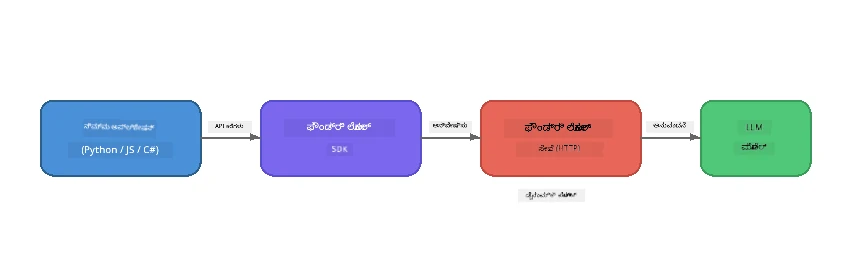

# ಭಾಗ 1: ಫೌಂಡ್ರಿ ಲೋಕಲ್‌ನೊಂದಿಗೆ ಪ್ರಾರಂಭಿಸುವುದು


## ಫೌಂಡ್ರಿ ಲೋಕಲ್ ಎಂದರೇನು?

[Foundry Local](https://foundrylocal.ai) ನಿಮಗೆ ನಿಮ್ಮ ಕಂಪ್ಯೂಟರ್‌ನಲ್ಲಿ **ನೇರವಾಗಿ** open-source AI ಭಾಷಾ ಮಾದರಿಗಳನ್ನು ಚಾಲನೆ ಮಾಡಲು ಅನುವು ಮಾಡಿಕೊಡುತ್ತದೆ - ಇಂಟರ್ನೆಟ್ ಅಗತ್ಯವಿಲ್ಲ, ಮೆಘವೆಚ್ಚಗಳು ಇಲ್ಲ, ಮತ್ತು ಸಂಪೂರ್ಣ ಡೇಟಾ ಗೌಪ್ಯತೆ. ಇದು:

- **ಸ್ವಯಂಚಾಲಿತ ಹಾರ್ಡವೇರ್ ಅನುಕೂಲತೆಯಿಂದ** (GPU, CPU, ಅಥವಾ NPU) ಸ್ಥಳೀಯವಾಗಿ ಮಾದರಿಗಳನ್ನು ಡೌನ್‌ಲೋಡ್ ಮಾಡಿ ಓಡಿಸುತ್ತದೆ
- **ಒಪನ್‌ಎಐ-ಸಮ್ಮਤ API ಅನ್ನು ಒದಗಿಸುತ್ತದೆ** ಆದ್ದರಿಂದ ನೀವು ಪರಿಚಿತ SDKಗಳು ಮತ್ತು ಸಾಧನಗಳನ್ನು ಬಳಸಬಹುದು
- **ಏಜೂರ್ సಬ్స్క್ರిప్షನ್ ಅವಶ್ಯಕತೆ ಇಲ್ಲ** ಅಥವಾ ಸೈನ್-ಅಪ್ ಅಗತ್ಯವಿಲ್ಲ - ಇನ್‌ಸ್ಟಾಲ್ ಮಾಡಿ ನಿರ್ಮಾಣ ಶುರುಮಾಡಿ

ಇದನ್ನು ನಿಮ್ಮ ಯಂತ್ರದಲ್ಲಿ ಸಂಪೂರ್ಣವಾಗಿ ಚಾಲನೆಯಲ್ಲಿರುವ ನಿಮ್ಮ ಸ್ವಂತ ಖಾಸಗಿ AI ಎಂದು ಭಾವಿಸಿ.

## ಕಲಿಕೆಗೆ ಉದ್ದೇಶಿತ ಗುರಿಗಳು

ಈ ಪ್ರಯೋಗಾಲಯದ ಕೊನೆಯಲ್ಲಿ ನೀವು ಸಾಧ್ಯವಾಗುತ್ತದೆ:

- ನಿಮ್ಮ ಕಾರ್ಯಾಚರಣಾ ವ್ಯವಸ್ಥೆಯಲ್ಲಿ Foundry Local CLI ಅನ್ನು ಸ್ಥಾಪಿಸಿಕೊಳ್ಳುವುದು
- ಮಾದರಿ ಉಪನಾಮಗಳು ಎಂದರೇನು ಮತ್ತು ಅವು ಹೇಗೆ ಕಾರ್ಯನಿರ್ವಹಿಸುತ್ತವೆ ಎಂಬುದನ್ನು ಅರ್ಥಮಾಡಿಕೊಳ್ಳುವುದು
- ನಿಮ್ಮ ಮೊದಲ ಸ್ಥಳೀಯ AI ಮಾದರಿಯನ್ನು ಡೌನ್‌ಲೋಡ್ ಮಾಡಿ ಓಡಿಸುವುದು
- ಕಮಾಂಡ್ ಲೈನ್ ಮೂಲಕ ಸ್ಥಳೀಯ ಮಾದರಿಗೆ ಚಾಟ್ ಸಂದೇಶ ಕಳುಹಿಸುವುದು
- ಸ್ಥಳೀಯ ಮತ್ತು ಮೇಘದಲ್ಲಿ ಹೋಸ್ಟ್ ಮಾಡಲಾದ AI ಮಾದರಿಗಳ ನಡುವಿನ ವ್ಯತ್ಯಾಸವನ್ನು ಅರ್ಥಮಾಡಿಕೊಳ್ಳುವುದು

---

## ಅಗತ್ಯ ಪೂರ್ವಾವಶ್ಯಕತೆಗಳು

### ವ್ಯವಸ್ಥೆ ಅವಶ್ಯಕತೆಗಳು

| ಅಗತ್ಯ | ಕನಿಷ್ಠ | ಶಿಫಾರಸು |
|-------------|---------|-------------|
| **RAM** | 8 GB | 16 GB |
| **ಡಿಸ್ಕ್ ಸ್ಥಳ** | 5 GB (ಮಾದರಿಗಳಿಗಾಗಿ) | 10 GB |
| **CPU** | 4 ಕೋರ್ ಗಳು | 8+ ಕೋರ್ ಗಳು |
| **GPU** | ಐಚ್ಛಿಕ | NVIDIA ಜೊತೆಗೆ CUDA 11.8+ |
| **OS** | Windows 10/11 (x64/ARM), Windows Server 2025, macOS 13+ | - |

> **ಗಮನಿಸಿ:** Foundry Local ಸ್ವಯಂಚಾಲಿತವಾಗಿ ನಿಮ್ಮ ಹಾರ್ಡ್‌ವೇರ್‌ಗೆ ಅತ್ಯುತ್ತಮ ಮಾದರಿ ಪ್ರಕಾರವನ್ನು ಆಯ್ಕೆಮಾಡುತ್ತದೆ. ನಿಮ್ಮ ಬಳಿ NVIDIA GPU ಇದ್ದರೆ, ಅದು CUDA ತ್ವರಿತಗೊಳಿಸುವಿಕೆಯನ್ನು ಬಳಸುತ್ತದೆ. Qualcomm NPU ಇದ್ದರೆ ಅದು ಬಳಸುತ್ತದೆ. ಬೇರೆ ಆಗ CPU-ಅನುಕೂಲಿತ ಪ್ರಕಾರಕ್ಕೆ ಮರಳುತ್ತದೆ.

### Foundry Local CLI ಸ್ಥಾಪಿಸಿ

**Windows** (PowerShell):  
```powershell
winget install Microsoft.FoundryLocal
```
  
**macOS** (Homebrew):  
```bash
brew tap microsoft/foundrylocal
brew install foundrylocal
```
  
> **ಗಮನಿಸಿ:** Foundry Local ಪ್ರಸ್ತುತ Windows ಮತ್ತು macOS ಮಾತ್ರ ಬೆಂಬಲಿಸುತ್ತದೆ. ಲಿನಕ್ಸ್ ಸಧ್ಯಕ್ಕೆ ಬೆಂಬಲವಿಲ್ಲ.

ಸ್ಥಾಪನೆಯು ಯಶಸ್ವಿಯೇ ಎಂದು ಪರಿಶೀಲಿಸಿ:  
```bash
foundry --version
```
  
---

## ಪ್ರಯೋಗಾಲಯ ವ್ಯಾಯಾಮಗಳು

### ವ್ಯಾಯಾಮ 1: ಲಭ್ಯವಿರುವ ಮಾದರಿಗಳನ್ನು ಪರಿಶೀಲಿಸಿ

Foundry Local ಪೂರ್ವ-ಅನುಕೂಲಿತ ಮುಕ್ತ ಮೂಲ ಮಾದರಿಗಳ ಪಟ್ಟಿಯನ್ನು ಒಳಗೊಂಡಿದೆ. ಅವುಗಳನ್ನು ಪಟ್ಟಿ ಮಾಡಿ:  

```bash
foundry model list
```
  
ನೀವು ಈ ರೀತಿ ಮಾದರಿಗಳನ್ನು ಕಾಣುತ್ತೀರಿ:  
- `phi-3.5-mini` - Microsoft 3.8B ಪ್ಯಾರಾಮೀಟರ್ ಮಾದರಿ (ವೇಗವಾಗಿ, ಉತ್ತಮ ಗುಣಮಟ್ಟ)  
- `phi-4-mini` - ಹೊಸ, ಹೆಚ್ಚು ಸಾಮರ್ಥ್ಯದ Phi ಮಾದರಿ  
- `phi-4-mini-reasoning` - Phi ಮಾದರಿ ಚೈನ್-ಆಫ್-ಥಾಟ್ ಯುಕ್ತಿವಾದದೊಂದಿಗೆ (`<think>` ಟ್ಯಾಗ್‌ಗಳು)  
- `phi-4` - Microsoft ದೊಡ್ಡ Phi ಮಾದರಿ (10.4 GB)  
- `qwen2.5-0.5b` - ಅತ್ಯಂತ ಸಣ್ಣ ಮತ್ತು ವೇಗದ (ಕಡಿಮೆ ಸಂಪನ್ಮೂಲ ಸಾಧನಗಳಿಗೆ ಉತ್ತಮ)  
- `qwen2.5-7b` - ಸಾಮಾನ್ಯ ಉದ್ದೇಶದ ಶಕ್ತಿಯುತ ಮಾದರಿ ಉಪಕರಣ-ಕಾಲ್ ಬೆಂಬಲದೊಂದಿಗೆ  
- `qwen2.5-coder-7b` - ಕೋಡ್ ಉತ್ಪಾದನೆಗೆ ಅನುಕೂಲಿತ  
- `deepseek-r1-7b` - ಶಕ್ತಿಶಾಲಿ ಯುಕ್ತಿವಾದ ಮಾದರಿ  
- `gpt-oss-20b` - ದೊಡ್ಡ ಮುಕ್ತ ಮೂಲ ಮಾದರಿ (MIT ಪರವಾನಗಿ, 12.5 GB)  
- `whisper-base` - ಮಾತು-ತೆಗೆ (Speech-to-text) ಪರಿರೇಖಣ (383 MB)  
- `whisper-large-v3-turbo` - ಹೆಚ್ಚಿನ ನಿಖರತೆಯ ಪರಿರೇಖಣ (9 GB)

> **ಮಾದರಿ ಉಪನಾಮವೆನು?** `phi-3.5-mini`ಂತಹ ಉಪನಾಮಗಳು ಸಂಕ್ಷಿಪ್ತ ಹೆಸರುಗಳು. ನೀವು ಉಪನಾಮವನ್ನು ಬಳಸದಾಗ Foundry Local ಸ್ವಯಂಚಾಲಿತವಾಗಿ ನಿಮ್ಮ ನಿರ್ದಿಷ್ಟ ಹಾರ್ಡ್‌ವೇರ್‌ಗೆ ಅತ್ಯುತ್ತಮ ಪ್ರಕಾರವನ್ನು ಡೌನ್‌ಲೋಡ್ ಮಾಡುತ್ತದೆ (NVIDIA GPUಗಳಿಗಾಗಿ CUDA, ಇಲ್ಲವಾದರೆ CPU ಅನುಕೂಲಿತ ಪ್ರಕಾರ). ನೀವು ಯಾವಾಗಲೂ ಸರಿಯಾದ ಪ್ರಕಾರ ಆಯ್ಕೆಮಾಡಬೇಕಾಗಿಲ್ಲ.

### ವ್ಯಾಯಾಮ 2: ನಿಮ್ಮ ಮೊದಲ ಮಾದರಿಯನ್ನು ಚಾಲನೆ ಮಾಡಿ

ಮಾಡೆಲ್ ಡೌನ್‌ಲೋಡ್ ಮಾಡಿ ಮತ್ತು ಸಂವಾದವನ್ನು ಆರಂಭಿಸಿ:  

```bash
foundry model run phi-3.5-mini
```
  
ನೀವು ಇದನ್ನು ಮೊದಲ ಬಾರಿ ಚಾಲನೆಮಾಡುವಾಗ, Foundry Local:  
1. ನಿಮ್ಮ ಹಾರ್ಡ್‌ವೇರ್ ಅನ್ನು ಪತ್ತೆಹಚ್ಚುತ್ತದೆ  
2. ಉತ್ತಮ ಮಾದರಿ ಪ್ರಕಾರವನ್ನು ಡೌನ್‌ಲೋಡ್ ಮಾಡುತ್ತದೆ (ಇದು ಕೆಲ ನಿಮಿಷಗಳು ತೆಗೆದುಕೊಳ್ಳಬಹುದು)  
3. ಮಾದರಿಯನ್ನು ಮೆಮೊರಿಯಲ್ಲಿ ಲೋಡ್ ಮಾಡುತ್ತದೆ  
4. ಸಂವಾದ ಸತ್ರವನ್ನು ಪ್ರಾರಂಭಿಸುತ್ತದೆ

ಇದರಿಂದ ಕೆಲವು प्रश्नಗಳನ್ನು ಕೇಳಿ:  
```
You: What is the golden ratio?
You: Can you explain it as if I were 10 years old?
You: Write a haiku about mathematics
```
  
ಬಿಟ್ಟುಹೋಗಲು `exit` ಟೈಪ್ ಮಾಡಿ ಅಥವಾ `Ctrl+C` ಒತ್ತಿ.

### ವ್ಯಾಯಾಮ 3: ಮಾದರಿಯನ್ನು ಮುಂಚಿತವಾಗಿ ಡೌನ್‌ಲೋಡ್ ಮಾಡಿ

ಸಂವಾದ ಆರಂಭಿಸದೆ ಮಾದರಿಯನ್ನು ಡೌನ್‌ಲೋಡ್ ಮಾಡಲು:

```bash
foundry model download phi-3.5-mini
```
  
ನಿಮ್ಮ ಯંત્રದಲ್ಲಿ ಈಗಾಗಲೇ ಡೌನ್‌ಲೋಡ್ ಆಗಿದ ಮಾದರಿಗಳನ್ನು ಪರಿಶೀಲಿಸಿ:  

```bash
foundry cache list
```
  
### ವ್ಯಾಯಾಮ 4: ವಾಸ್ತುಶಿಲ್ಪವನ್ನು ಅರ್ಥಮಾಡಿಕೊಳ್ಳಿ

Foundry Local ಒಂದು **ಸ್ಥಳೀಯ HTTP ಸೇವೆ** ಆಗಿದ್ದು, OpenAI-ಸಮ್ಮತ REST API ಅನ್ನು ಪ್ರદર્શಿಸುತ್ತದೆ. ಇದರ ಅರ್ಥ:  

1. ಸೇವೆ ಪ್ರತಿ ಬಾರಿ **ಡೈನಾಮಿಕ್ ಪೋಟ್** ನಲ್ಲಿ ಪ್ರಾರಂಭವಾಗುತ್ತದೆ (ಪ್ರತಿ ಬಾರಿ ಭಿನ್ನವಾದ ಪೋಟ್)  
2. ನೀವು SDK ಬಳಸಿ ನಿಜವಾದ ಸ್ವೀಕೃತ URL ಕಂಡುಹಿಡಿಯಬೇಕು  
3. ನೀವು **ಯಾವುದೇ** OpenAI-ಸಮ್ಮತ ಕ್ಲೈಂಟ್ ಗ್ರಂಥಾಲಯವನ್ನು ಬಳಸಿಕೊಂಡು ಸಂಪರ್ಕಿಸಬಹುದು



> **ಮುಖ್ಯವಾಗಿದೆ:** Foundry Local ಪ್ರತಿ ಬಾರಿ ಪ್ರಾರಂಭವಾಗುವಾಗ ಒಂದು **ಡೈನಾಮಿಕ್ ಪೋಟ್** ನಿಕ ಜೋಡಣೆ ಮಾಡುತ್ತದೆ. ಎಂದಿಗೂ `localhost:5272` ಎಂಬ ಪೋಟ್ ಸಂಖ್ಯೆ ಹಾರ್ಡ್‌ಕೋಡಿಂಗ್ ಮಾಡಬೇಡಿ. ಪ್ರಸ್ತುತ URL ಕಂಡುಹಿಡಿಯಲು ಎಡೆಮಾಯಾದಂತೆ SDK ಯನ್ನು ಬಳಸಿ (ಉದಾಹರಣೆಗೆ Python ನಲ್ಲಿ `manager.endpoint` ಅಥವಾ JavaScript ನಲ್ಲಿ `manager.urls[0]`).

---

## ಮುಖ್ಯ ಅಂಶಗಳು

| ಪರಿಕಲ್ಪನೆ | ನೀವು 무엇을 ಕಲಿತಿರಿ |
|---------|------------------|
| on-device AI | Foundry Local ನಿಮ್ಮ ಸಾಧನದಲ್ಲಿ ಸಂಪೂರ್ಣವಾಗಿ ಮಾದರಿಗಳನ್ನು ಓಡಿಸುತ್ತದೆ, ಯಾವುದೇ ಮೇಘ ಸೇವೆಗಳು, API ಕೀಗಳು, ಅಥವಾ ವೆಚ್ಚಗಳಿಲ್ಲ |
| ಮಾದರಿ ಉಪನಾಮಗಳು | `phi-3.5-mini` aliasಗಳು ಸ್ವಯಂಚಾಲಿತವಾಗಿ ನಿಮ್ಮ ಹಾರ್ಡ್‌ವೇರ್‌ಗೆ ಉತ್ತಮ ಪ್ರಕಾರವನ್ನು ಆಯ್ಕೆಮಾಡುತ್ತವೆ |
| ಡೈನಾಮಿಕ್ ಪೋಟ್‌ಗಳು | ಸೇವಾ ಡೈನಾಮಿಕ್ ಪೋಟ್‌ನಲ್ಲಿ ಕಾರ್ಯನಿರ್ವಹಿಸುತ್ತದೆ; ಎಡೆಯನ್ನು ಕಂಡುಕೊಳ್ಳಲು ಸದಾ SDK ಬಳಸಿ |
| CLI ಮತ್ತು SDK | CLI (`foundry model run`) ಅಥವಾ SDK ಮೂಲಕ ಪ್ರೋಗ್ರಾಮ್ಯಾತ್ಮಕವಾಗಿ ಮಾದರಿಗಳೊಂದಿಗೆ ಸಂವಾದ ಮಾಡಬಹುದು |

---

## ಮುಂದಿನ ಹಂತಗಳು

[ಭಾಗ 2: Foundry Local SDK ಆಳವಾದ ಅಧ್ಯಯನ](part2-foundry-local-sdk.md) juurde ಮುಂದುವರೆಯಿರಿ, ಮಾದರಿಗಳು, ಸೇವೆಗಳು ಮತ್ತು ಕ್ಯಾಶಿಂಗ್ ಅನ್ನು ಪ್ರೋಗ್ರಾಮ್ಯಾತ್ಮಕವಾಗಿ ನಿರ್ವಹಿಸಲು SDK APIನ್ನು ಪೃತಿಷ್ಠಾಪಿಸಿ.