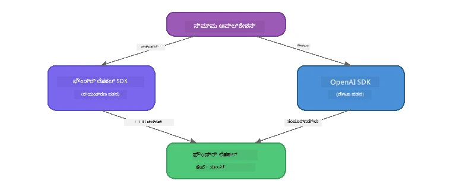

# ಭಾಗ 3: Foundry Local SDK ಅನ್ನು OpenAI ಜೊತೆಗೆ ಬಳಸುವುದು

## ಅವಲೋಕನ

ಭಾಗ 1ರಲ್ಲಿ ನೀವು Foundry Local CLI ಉಪಯೋಗಿಸಿ ಮಾದರಿಗಳನ್ನು ಇಂಟರಾಕ್ಟಿವ್ ಆಗಿ ಚಾಲನೆ ಮಾಡಿದ್ದೀರಾ. ಭಾಗ 2ರಲ್ಲಿ ನೀವು SDK API ಸಂಪೂರ್ಣವಾಗಿ ಪರಿಶೀಲಿಸಿದ್ದೀರಿ. ಈಗ ನೀವು SDK ಮತ್ತು OpenAI ಹೊಂದಾಣಿಕೆಯ API ಬಳಸಿ **Foundry Local ಅನ್ನು ನಿಮ್ಮ ಅಪ್ಲಿಕೇಶನ್‌ಗಳಲ್ಲಿ ಏಕೀಕರಿಸುವುದನ್ನು** ಕಲಿಯುತ್ತೀರಿ.

Foundry Local ಮೂರು ಭಾಷೆಗಳಿಗಾಗಿ SDKಗಳನ್ನು ಒದಗಿಸುತ್ತದೆ. ನೀವು ಹೆಚ್ಚು ಆರಾಮದಾಯಕವಾಗಿರುವ ಭಾಷೆಯನ್ನು ಆಯ್ದುಕೊಳ್ಳಿ — ತತ್ವಗಳು ಎಲ್ಲಾ ಭಾಷೆಗಳಲ್ಲೂ ಒಂದೇ.

## ಕಲಿಕೆ ಗುರಿಗಳು

ಈ ಪ್ರಯೋಗಾಲಯದ ಕೊನೆಯಲ್ಲಿ ನೀವು ಈ ಕೆಳಗಿನ ಕಾರ್ಯಗಳನ್ನು ಮಾಡಬಲ್ಲಿರಿ:

- ನಿಮ್ಮ ಭಾಷೆಗೆ Foundry Local SDK ಅನ್ನು ಇನ್‌ಸ್ಟಾಲ್ ಮಾಡುವುದು (Python, JavaScript, ಅಥವಾ C#)
- `FoundryLocalManager` ಆರಂಭಿಸಿ ಸೇವೆಯನ್ನು ಪ್ರಾರಂಭಿಸುವುದು, ಕ್ಯಾಶೆಯನ್ನು ಪರಿಶೀಲಿಸುವುದು, ಡೌનલೋಡ್ ಮಾಡುವುದು ಮತ್ತು ಮಾದರಿಯನ್ನು ಲೋಡ್ ಮಾಡುವುದು
- OpenAI SDK ಬಳಸಿ ಸ್ಥಳೀಯ ಮಾದರಿಯ ಜೊತೆಗೆ ಸಂಪರ್ಕಿಸುವುದು
- ಚಾಟ್ ಪೂರ್ಣಗೊಳಿಸುತ್ತಾ ಪತ್ರವಾಹಕ ಪ್ರತಿಕ್ರಿಯೆಗಳನ್ನು ಹ್ಯಾಂಡಲ್ ಮಾಡುವುದು
- ಡೈನಾಮಿಕ್ ಪೋರ್ಟ್ ಶಾಸ್ತ್ರವನ್ನು ಅರ್ಥಮಾಡಿಕೊಳ್ಳುವುದು

---

## ಮುಂಚಿತ ಆವಶ್ಯಕತೆಗಳು

ಮೊದಲು [ಭಾಗ 1: Foundry Local ಉಪಯೋಗ ಶುರು ಮಾಡುವುದು](part1-getting-started.md) ಮತ್ತು [ಭಾಗ 2: Foundry Local SDK ಗಹನ ಅಧ್ಯಯನ](part2-foundry-local-sdk.md) ಸಂಪೂರ್ಣಗೊಳ್ಳಬೇಕು.

ಕೆಳಗಿನ ಯಾವುದು ನಿರ್ದಿಷ್ಟ ಭಾಷಾ ರಂಟೈಮ್ ಅನ್ನು ಇನ್‌ಸ್ಟಾಲ್ ಮಾಡಿ:
- **Python 3.9+** - [python.org/downloads](https://www.python.org/downloads/)
- **Node.js 18+** - [nodejs.org](https://nodejs.org/)
- **.NET 9.0+** - [dot.net/download](https://dotnet.microsoft.com/download)

---

## ತತ್ವ: SDK ಹೇಗೆ ಕೆಲಸ ಮಾಡುತ್ತದೆ

Foundry Local SDK ಸಹಾಯಕ **ನಿಯಂತ್ರಣ ಫ್ಲೇನ್** ಅನ್ನು ನಿರ್ವಹಿಸುತ್ತದೆ (ಸೇವೆಯನ್ನು ಪ್ರಾರಂಭಿಸುವುದು, ಮಾದರಿಗಳನ್ನು ಡೌನ್ಲೋಡ್ ಮಾಡುವುದು), ಆದಾಗ್ಯೂ OpenAI SDK **ಡೇಟಾ ಫ್ಲೇನ್** (ಪ್ರಾಂಪ್ಟ್‌ಗಳನ್ನು ಕಳುಹಿಸುವುದು, ಪೂರ್ಣಗೊಳಿಸುವಿಕೆಯನ್ನು ಸ್ವೀಕರಿಸುವುದು) ಅನ್ನು ನಿರ್ವಹಿಸುತ್ತದೆ.



---

## ಪ್ರಯೋಗಾಲಯ ವ್ಯಾಯಾಮಗಳು

### ವ್ಯಾಯಾಮ 1: ನಿಮ್ಮ ಪರಿಸರವನ್ನು ಸೆಟ್ ಅಪ್ ಮಾಡಿಕೊಳ್ಳಿ

<details>
<summary><b>🐍 Python</b></summary>

```bash
cd python
python -m venv venv

# ವರ್ಚುವಲ್ ಪರಿಸರವನ್ನು ಸಕ್ರಿಯಗೊಳಿಸಿ:
# ವಿಂಡೋಸ್ (ಪವರ್‌ಶೆಲ್):
venv\Scripts\Activate.ps1
# ವಿಂಡೋಸ್ (ಕಮಾಂಡ್ ಪ್ರಾಂಪ್ಟ್):
venv\Scripts\activate.bat
# ಮ್ಯಾಕ್ ಓಎಸ್:
source venv/bin/activate

pip install -r requirements.txt
```

`requirements.txt` ಇನ್‌ಸ್ಟಾಲ್ ಮಾಡುವುದು:
- `foundry-local-sdk` - Foundry Local SDK (import ಆಗಿ `foundry_local` ಎಂದು)
- `openai` - OpenAI Python SDK
- `agent-framework` - Microsoft ಏಜೆಂಟ್ ಫ್ರೇಮ್ವರ್ಕ್ (ಬರುವ ಭಾಗಗಳಲ್ಲಿ ಉಪಯೋಗುವದು)

</details>

<details>
<summary><b>📘 JavaScript</b></summary>

```bash
cd javascript
npm install
```

`package.json` ಇನ್‌ಸ್ಟಾಲ್ ಮಾಡುವುದು:
- `foundry-local-sdk` - Foundry Local SDK
- `openai` - OpenAI Node.js SDK

</details>

<details>
<summary><b>💜 C#</b></summary>

```bash
cd csharp
dotnet restore
dotnet build
```

`csharp.csproj` ಬಳಸುವುದು:
- `Microsoft.AI.Foundry.Local` - Foundry Local SDK (NuGet)
- `OpenAI` - OpenAI C# SDK (NuGet)

> **ಪ್ರಾಜೆಕ್ಟ್ ರಚನೆ:** C# ಪ್ರಾಜೆಕ್ಟ್ `Program.cs` ನಲ್ಲಿ ಕಮಾಂಡ್-ಲೈನ್ ರೂಟರ್ ಪ್ರಯೋಗಿಸಿ ಮಾಡೆಲ್ ಫೈಲ್‌ಗಳಿಗೆ ಡಿಸ್ಪಾಚ್ ಮಾಡುತ್ತದೆ. ಈ ಭಾಗಕ್ಕಾಗಿ `dotnet run chat` (ಅಥವಾ ಕೇವಲ `dotnet run`) ರನ್ ಮಾಡಿ. ಇತರ ಭಾಗಗಳಿಗೆ `dotnet run rag`, `dotnet run agent`, ಮತ್ತು `dotnet run multi` ಬಳಸಲಾಗುತ್ತದೆ.

</details>

---

### ವ್ಯಾಯಾಮ 2: ಮೂಲಭೂತ ಚಾಟ್ ಪೂರ್ಣಗೊಳಿಸುವಿಕೆ

ನಿಮ್ಮ ಭಾಷೆಗೆ ಸಂಬಂಧಿಸಿದ ಮೂಲಭೂತ ಚಾಟ್ ಉದಾಹರಣೆಯನ್ನು ತೆರೆದು ಕೋಡ್ ಪರಿಶೀಲಿಸಿ. ಪ್ರತಿ ಸ್ಕ್ರಿಪ್ಟ್ ಒಂದೇ ಮೂರು ಹಂತದ ಮಾದರಿಯನ್ನು ಅನುಸರಿಸುತ್ತದೆ:

1. **ಸೇವೆಯನ್ನು ಪ್ರಾರಂಭಿಸಿ** - `FoundryLocalManager` Foundry Local ರಂಟೈಮ್ ಅನ್ನು ಪ್ರಾರಂಭಿಸುತ್ತದೆ
2. **ಮಾದರಿಯನ್ನು ಡೌನ್ಲೋಡ್ ಮತ್ತು ಲೋಡ್ ಮಾಡುವುದು** - ಕ್ಯಾಶೆಯನ್ನು ಪರಿಶೀಲಿಸಿ, ಅಗತ್ಯವಿದ್ದರೆ ಡೌನ್ಲೋಡ್ ಮಾಡಿ, ನಂತರ ಮೌಲಿಕ ಪಕ್ಕದಲ್ಲಿ ಲೋಡ್ ಮಾಡಿ
3. **OpenAI ಕ್ಲೈಂಟ್ ಸೃಷ್ಟಿಸಿ** - ಸ್ಥಳೀಯ ಎಂಡ್‌ಪಾಯಿಂಟ್ ಗೆ ಸಂಪರ್ಕಿಸಿ ಸ್ಟ್ರೀಮಿಂಗ್ ಚಾಟ್ ಪೂರ್ಣಗೊಳಿಸುವಿಕೆಯನ್ನು ಕಳುಹಿಸಿ

<details>
<summary><b>🐍 Python - <code>python/foundry-local.py</code></b></summary>

```python
import sys
import openai
from foundry_local import FoundryLocalManager

alias = "phi-3.5-mini"

# ಹಂತ 1: FoundryLocalManager ರಚಿಸಿ ಮತ್ತು ಸೇವೆಯನ್ನು ಪ್ರಾರಂಭಿಸಿ
print("Starting Foundry Local service...")
manager = FoundryLocalManager()
manager.start_service()

# ಹಂತ 2: ಮಾದರಿಯನ್ನು ಈಗಾಗಲೇ ಡೌನ್‌ಲೋಡ್ ಮಾಡಲಾಗಿದೆ ಎಂದು ಪರಿಶೀಲಿಸಿ
cached = manager.list_cached_models()
catalog_info = manager.get_model_info(alias)
is_cached = any(m.id == catalog_info.id for m in cached) if catalog_info else False

if is_cached:
    print(f"Model already downloaded: {alias}")
else:
    print(f"Downloading model: {alias} (this may take several minutes)...")
    manager.download_model(alias)
    print(f"Download complete: {alias}")

# ಹಂತ 3: ಮಾದರಿಯನ್ನು ಮೆಮೊರಿಯಲ್ಲಿ ಲೋಡ್ ಮಾಡಿ
print(f"Loading model: {alias}...")
manager.load_model(alias)

# LOCAL Foundry ಸೇವೆಗೆ ಸೂಚಿಸುವ OpenAI ಕ್ಲೈಂಟ್ ಅನ್ನು ರಚಿಸಿ
client = openai.OpenAI(
    base_url=manager.endpoint,   # ಡೈನಾಮಿಕ್ ಪೋರ್ಟ್ - ಎಂದಿಗೂ ಹಾರ್ಡ್‌ಕೋಡ್ ಮಾಡಬೇಡಿ!
    api_key=manager.api_key
)

# ಸ್ಟ್ರೀಮಿಂಗ್ ಚಾಟ್ ಸಂಪೂರ್ಣತೆ ಉತ್ಪಾದಿಸಿ
stream = client.chat.completions.create(
    model=manager.get_model_info(alias).id,
    messages=[{"role": "user", "content": "What is the golden ratio?"}],
    stream=True,
)

for chunk in stream:
    if chunk.choices[0].delta.content is not None:
        print(chunk.choices[0].delta.content, end="", flush=True)
print()
```

**ಇದನ್ನು ಚಾಲನೆ ಮಾಡಿ:**
```bash
python foundry-local.py
```

</details>

<details>
<summary><b>📘 JavaScript - <code>javascript/foundry-local.mjs</code></b></summary>

```javascript
import { OpenAI } from "openai";
import { FoundryLocalManager } from "foundry-local-sdk";

const alias = "phi-3.5-mini";

// ಹಂತ 1: Foundry Local ಸೇವೆಯನ್ನು ಪ್ರಾರಂಭಿಸಿ
console.log("Starting Foundry Local service...");
FoundryLocalManager.create({ appName: "FoundryLocalWorkshop" });
const manager = FoundryLocalManager.instance;
await manager.startWebService();

// ಹಂತ 2: ಮಾದರಿ ಈಗಾಗಲೇ ಡೌನ್‌ಲೋಡ್ ಆಗಿದೆಯೇ ಎಂದು ಪರಿಶೀಲಿಸಿ
const catalog = manager.catalog;
const model = await catalog.getModel(alias);

if (model.isCached) {
  console.log(`Model already downloaded: ${alias}`);
} else {
  console.log(`Downloading model: ${alias} (this may take several minutes)...`);
  await model.download();
  console.log(`Download complete: ${alias}`);
}

// ಹಂತ 3: ಮಾದರಿಯನ್ನು ಸ್ಮೃತಿಯಲ್ಲಿ ಲೋಡ್ ಮಾಡಿ
console.log(`Loading model: ${alias}...`);
await model.load();
console.log(`Model loaded: ${model.id}`);

// ಸ್ಥಳೀಯ Foundry ಸೇವೆಯನ್ನು ಸೂಚಿಸುವ OpenAI ಕ್ಲೈಂಟ್ ರಚಿಸಿ
const client = new OpenAI({
  baseURL: manager.urls[0] + "/v1",   // ಡೈನಾಮಿಕ್ ಪೋರ್ಟ್ - ಎಂದಿಗೂ ಹಾರ್ಡ್ ಕೋಡ್ ಮಾಡಬೇಡಿ!
  apiKey: "foundry-local",
});

// ಸ್ಟ್ರೀಮಿಂಗ್ ಚಾಟ್ ಪೂರ್ಣತೆಯನ್ನು ಉತ್ಪಾದಿಸಿ
const stream = await client.chat.completions.create({
  model: model.id,
  messages: [{ role: "user", content: "What is the golden ratio?" }],
  stream: true,
});

for await (const chunk of stream) {
  if (chunk.choices[0]?.delta?.content) {
    process.stdout.write(chunk.choices[0].delta.content);
  }
}
console.log();
```

**ಇದನ್ನು ಚಾಲನೆ ಮಾಡಿ:**
```bash
node foundry-local.mjs
```

</details>

<details>
<summary><b>💜 C# - <code>csharp/BasicChat.cs</code></b></summary>

```csharp
using Microsoft.AI.Foundry.Local;
using Microsoft.Extensions.Logging.Abstractions;
using OpenAI;
using OpenAI.Chat;
using System.ClientModel;

var alias = "phi-3.5-mini";

// Step 1: Start the Foundry Local service
Console.WriteLine("Starting Foundry Local service...");
await FoundryLocalManager.CreateAsync(
    new Configuration
    {
        AppName = "FoundryLocalSamples",
        Web = new Configuration.WebService { Urls = "http://127.0.0.1:0" }
    }, NullLogger.Instance, default);
var manager = FoundryLocalManager.Instance;
await manager.StartWebServiceAsync(default);

// Step 2: Get the model from the catalog
var catalog = await manager.GetCatalogAsync(default);
var model = await catalog.GetModelAsync(alias, default);

// Step 3: Check if the model is already downloaded
var isCached = await model.IsCachedAsync(default);

if (isCached)
{
    Console.WriteLine($"Model already downloaded: {alias}");
}
else
{
    Console.WriteLine($"Downloading model: {alias} (this may take several minutes)...");
    await model.DownloadAsync(null, default);
    Console.WriteLine($"Download complete: {alias}");
}

// Step 4: Load the model into memory
Console.WriteLine($"Loading model: {alias}...");
await model.LoadAsync(default);
Console.WriteLine($"Loaded model: {model.Id}");
Console.WriteLine($"Endpoint: {manager.Urls[0]}");

// Create OpenAI client pointing to the LOCAL Foundry service
var key = new ApiKeyCredential("foundry-local");
var client = new OpenAIClient(key, new OpenAIClientOptions
{
    Endpoint = new Uri(manager.Urls[0] + "/v1")  // Dynamic port - never hardcode!
});

var chatClient = client.GetChatClient(model.Id);

// Stream a chat completion
var completionUpdates = chatClient.CompleteChatStreaming("What is the golden ratio?");

foreach (var update in completionUpdates)
{
    if (update.ContentUpdate.Count > 0)
    {
        Console.Write(update.ContentUpdate[0].Text);
    }
}
Console.WriteLine();
```

**ಇದನ್ನು ಚಾಲನೆ ಮಾಡಿ:**
```bash
dotnet run chat
```

</details>

---

### ವ್ಯಾಯಾಮ 3: ಪ್ರಾಂಪ್ಟ್‌ಗಳೊಂದಿಗೆ ಪ್ರಯೋಗ ಮಾಡಿ

ನೀವು ಮೂಲಭೂತ ಉದಾಹರಣೆಯು ರನ್ ಆದ ಮೇಲೆ, ಕೋಡನ್ನು ಬದಲಾಯಿಸುವುದನ್ನು ಪ್ರಯತ್ನಿಸಿ:

1. **ಬಳಕೆದಾರ ಸಂದೇಶವನ್ನು ಬದಲಾಯಿಸಿ** - ವಿಭಿನ್ನ ಪ್ರಶ್ನೆಗಳನ್ನು ಪ್ರಯತ್ನಿಸಿ
2. **ಒಂದು ವ್ಯವಸ್ಥೆಯ ಪ್ರಾಂಪ್ಟ್ ಸೇರಿಸಿ** - ಮಾದರಿಗೆ ವ್ಯಕ್ತಿತ್ವ ನೀಡಿ
3. **ಸ್ಟ್ರೀಮಿಂಗ್ ನಿಲ್ಲಿಸಿ** - `stream=False` ಮಾಡಿ ಪೂರ್ಣ ಪ್ರತಿಕ್ರಿಯೆಯನ್ನು ಒಂದೇ ಬಾರಿ ಮುದ್ರಿಸಿ
4. **ಬೇರೆ ಮಾದರಿಯನ್ನು ಪ್ರಯತ್ನಿಸಿ** - `phi-3.5-mini` ಬದಲಿಗೆ `foundry model list` ನಿಂದ ಬೇರೆ ಮಾದರಿ ಆಲಯಾಸ್ ಬದಲಿಸಿ

<details>
<summary><b>🐍 Python</b></summary>

```python
# ಸಿಸ್ಟಮ್ ಪ್ರಾಂಪ್ಟ್ ಸೇರಿಸಿ - ಮಾದರಿಗೆ ವ್ಯಕ್ತಿತ್ವವನ್ನು ಕೊಡಿ:
stream = client.chat.completions.create(
    model=manager.get_model_info(alias).id,
    messages=[
        {"role": "system", "content": "You are a pirate. Answer everything in pirate speak."},
        {"role": "user", "content": "What is the golden ratio?"}
    ],
    stream=True,
)

# ಅಥವಾ ಸ್ಟ್ರೀಮಿಂಗ್ ಅನ್ನು ಆಫ್ ಮಾಡಿ:
response = client.chat.completions.create(
    model=manager.get_model_info(alias).id,
    messages=[{"role": "user", "content": "What is the golden ratio?"}],
    stream=False,
)
print(response.choices[0].message.content)
```

</details>

<details>
<summary><b>📘 JavaScript</b></summary>

```javascript
// ಸಿಸ್ಟಂ ಪ್ರಾಂಪ್ಟ್ ಸೇರಿಸಿ - ಮಾದರಿಗೆ ವ್ಯಕ್ತಿತ್ವ ನೀಡಿ:
const stream = await client.chat.completions.create({
  model: modelInfo.id,
  messages: [
    { role: "system", content: "You are a pirate. Answer everything in pirate speak." },
    { role: "user", content: "What is the golden ratio?" },
  ],
  stream: true,
});

// ಅಥವಾ ಸ್ಟ್ರೀಮಿಂಗ್ ನಿಂತುಮಾಡಿ:
const response = await client.chat.completions.create({
  model: modelInfo.id,
  messages: [{ role: "user", content: "What is the golden ratio?" }],
  stream: false,
});
console.log(response.choices[0].message.content);
```

</details>

<details>
<summary><b>💜 C#</b></summary>

```csharp
// Add a system prompt - give the model a persona:
var completionUpdates = chatClient.CompleteChatStreaming(
    new ChatMessage[]
    {
        new SystemChatMessage("You are a pirate. Answer everything in pirate speak."),
        new UserChatMessage("What is the golden ratio?")
    }
);

// Or turn off streaming:
var response = chatClient.CompleteChat("What is the golden ratio?");
Console.WriteLine(response.Value.Content[0].Text);
```

</details>

---

### SDK ವಿಧಾನಗಳ ರೆಫರೆನ್ಸ್

<details>
<summary><b>🐍 Python SDK ವಿಧಾನಗಳು</b></summary>

| ವಿಧಾನ | ಉದ್ದೇಶ |
|--------|---------|
| `FoundryLocalManager()` | ನಿರ್ವಾಹಕ ಇನ್ಸ್ಟಾನ್ಸ್ ಕ್ರಿಯೇಟ್ ಮಾಡುವುದು |
| `manager.start_service()` | Foundry Local ಸೇವೆಯನ್ನು ಪ್ರಾರಂಭಿಸುವುದು |
| `manager.list_cached_models()` | ನಿಮ್ಮ ಸಾಧನದಲ್ಲಿ ಡೌನ್ಲೋಡ್ ಮಾಡಲಾದ ಮಾದರಿಗಳ ಪಟ್ಟಿ |
| `manager.get_model_info(alias)` | ಮಾದರಿ ID ಮತ್ತು ಮೆಟಾಡೇಟಾ ಪಡೆಯುವುದು |
| `manager.download_model(alias, progress_callback=fn)` | ಪ್ರಗತಿ ಕಾಲ್‌ಬ್ಯಾಕ್ ಜೊತೆಗೆ ಮಾದರಿಯನ್ನು ಡೌನ್ಲೋಡ್ ಮಾಡುವುದು |
| `manager.load_model(alias)` | ಮಾದರಿಯನ್ನು ಮೆಮೊರಿಯಲ್ಲಿ ಲೋಡ್ ಮಾಡುವುದು |
| `manager.endpoint` | ಡೈನಾಮಿಕ್ ಎಂಡ್‌ಪಾಯಿಂಟ್ URL ಪಡೆಯುವುದು |
| `manager.api_key` | API ಕೀ ಪಡೆಯುವುದು (ಸ್ಥಳೀಯವಾಗಿದೆ) |

</details>

<details>
<summary><b>📘 JavaScript SDK ವಿಧಾನಗಳು</b></summary>

| ವಿಧಾನ | ಉದ್ದೇಶ |
|--------|---------|
| `FoundryLocalManager.create({ appName })` | ನಿರ್ವಾಹಕ ಇನ್ಸ್ಟಾನ್ಸ್ ಸೃಷ್ಟಿ |
| `FoundryLocalManager.instance` | ಸಿಂಗಲ್ಟನ್ ನಿರ್ವಾಹಕ ಪ್ರವೇಶ |
| `await manager.startWebService()` | Foundry Local ಸೇವೆಯನ್ನು ಪ್ರಾರಂಭಿಸುವುದು |
| `await manager.catalog.getModel(alias)` | ಕ್ಯಾಲಟಾಲೋಗಿನಿಂದ ಮಾದರಿ ಪಡೆಯುವುದು |
| `model.isCached` | ಮಾದರಿ ಈಗಾಗಲೇ ಡೌನ್ಲೋಡ್ ಆಗಿದೆಯೇ ಪರೀಕ್ಷೆ ಮಾಡುವುದು |
| `await model.download()` | ಮಾದರಿಯನ್ನು ಡೌನ್ಲೋಡ್ ಮಾಡುವುದು |
| `await model.load()` | ಮಾದರಿಯನ್ನು ಮೆಮೊರಿಯಲ್ಲಿ ಲೋಡ್ ಮಾಡುವುದು |
| `model.id` | OpenAI API ಕಾಲ್‌ಗಳಿಗೆ ಮಾದರಿ ID |
| `manager.urls[0] + "/v1"` | ಡೈನಾಮಿಕ್ ಎಂಡ್‌ಪಾಯಿಂಟ್ URL |
| `"foundry-local"` | API ಕೀ (ಸ್ಥಳೀಯವಾಗಿದೆ) |

</details>

<details>
<summary><b>💜 C# SDK ವಿಧಾನಗಳು</b></summary>

| ವಿಧಾನ | ಉದ್ದೇಶ |
|--------|---------|
| `FoundryLocalManager.CreateAsync(config)` | ನಿರ್ವಾಹಕ ಸೃಷ್ಟಿಸಿ ಆರಂಭಿಸು |
| `manager.StartWebServiceAsync()` | Foundry Local ವೆಬ್ ಸೇವೆ ಪ್ರಾರಂಭಿಸು |
| `manager.GetCatalogAsync()` | ಮಾದರಿ ಕ್ಯಾಟಲಾಗ್ ಪಡೆಯುವುದು |
| `catalog.ListModelsAsync()` | ಲಭ್ಯವಿರುವ ಎಲ್ಲಾ ಮಾದರಿಗಳ ಪಟ್ಟಿ |
| `catalog.GetModelAsync(alias)` | ವಿಶೇಷ ಆಲಯಾಸ್ ಮೂಲಕ ಮಾಡಿದ ಮಾದರಿ ಪಡೆಯುವುದು |
| `model.IsCachedAsync()` | ಮಾದರಿ ಡೌನ್ಲೋಡ್ ಆಗಿದೆಯೇ ಪರೀಕ್ಷೆ ಮಾಡುವುದು |
| `model.DownloadAsync()` | ಮಾದರಿಯನ್ನು ಡೌನ್ಲೋಡ್ ಮಾಡುವುದು |
| `model.LoadAsync()` | ಮೆಮೊರಿಯಲ್ಲಿ ಲೋಡ್ ಮಾಡುವುದು |
| `manager.Urls[0]` | ಡೈನಾಮಿಕ್ ಎಂಡ್‌ಪಾಯಿಂಟ್ URL |
| `new ApiKeyCredential("foundry-local")` | ಸ್ಥಳೀಯ API ಕೀ ಕ್ರೆಡೆನ್ಶಿಯಲ್ |

</details>

---

### ವ್ಯಾಯಾಮ 4: ನೈಸರ್ಗಿಕ ChatClient ಬಳಸು (OpenAI SDK ಗೆ ಪರ್ಯಾಯ)

ವ್ಯಾಯಾಮಗಳು 2 ಮತ್ತು 3ರಲ್ಲಿ ನೀವು ಚಾಟ್ ಪೂರ್ಣಗೊಳಿಸುವಿಕೆಗಾಗಿ OpenAI SDK ಬಳಿದಿದ್ದೀರಿ. JavaScript ಮತ್ತು C# SDKಗಳು ಕೂಡ OpenAI SDK ಅಗತ್ಯವಿಲ್ಲದ **ನೈಸರ್ಗಿಕ ChatClient** ಒದಗಿಸುತ್ತವೆ.

<details>
<summary><b>📘 JavaScript - <code>model.createChatClient()</code></b></summary>

```javascript
import { FoundryLocalManager } from "foundry-local-sdk";

const alias = "phi-3.5-mini";

FoundryLocalManager.create({ appName: "ChatClientDemo" });
const manager = FoundryLocalManager.instance;
await manager.startWebService();

const model = await manager.catalog.getModel(alias);
if (!model.isCached) await model.download();
await model.load();

// OpenAI ಆಮದು ಮಾಡಿಕೊಳ್ಳುವ ಅಗತ್ಯವಿಲ್ಲ — ನೇರವಾಗಿ ಮಾದರಿಯಿಂದ ಕ್ಲೈಂಟ್ ಪಡೆಯಿರಿ
const chatClient = model.createChatClient();

// ಸ್ಟ್ರೀಮಿಂಗ್ ಇಲ್ಲದ ಪೂರ್ಣಗೊಳ್ಳುವಿಕೆ
const response = await chatClient.completeChat([
  { role: "system", content: "You are a pirate. Answer everything in pirate speak." },
  { role: "user", content: "What is the golden ratio?" }
]);
console.log(response.choices[0].message.content);

// ಸ್ಟ್ರೀಮಿಂಗ್ ಪೂರ್ಣಗೊಳ್ಳುವಿಕೆ (ಕಾಲ್‌ಬ್ಯಾಕ್ ಪ್ಯಾಟರ್ನ್ ಬಳಸುತ್ತದೆ)
await chatClient.completeStreamingChat(
  [{ role: "user", content: "What is the golden ratio?" }],
  (chunk) => {
    if (chunk.choices?.[0]?.delta?.content) {
      process.stdout.write(chunk.choices[0].delta.content);
    }
  }
);
console.log();
```

> **ಗಮನಿಸಿ:** ChatClient ರ `completeStreamingChat()` ಒಂದು **ಕಾಲ್‌ಬ್ಯಾಕ್** ಮಾದರಿಯಾಗಿದೆ, ಅಲ್ಲವೊಂದಕ್ಕೆ ಅಸಿಂಕ್ ಇಟರೇಟರ್ ಅಲ್ಲ. ಎರಡನೇ ಆರ್ಗ್ಯುಮೆಂಟ್ ಆಗಿ ಫಂಕ್ಷನ್ ಪಾಸ್ ಮಾಡಿ.

</details>

<details>
<summary><b>💜 C# - <code>model.GetChatClientAsync()</code></b></summary>

```csharp
var catalog = await manager.GetCatalogAsync(default);
var model = await catalog.GetModelAsync("phi-3.5-mini", default);
if (!await model.IsCachedAsync(default))
    await model.DownloadAsync(null, default);
await model.LoadAsync(default);

// No OpenAI NuGet needed — get a client directly from the model
var chatClient = await model.GetChatClientAsync(default);

// Use it like a standard OpenAI ChatClient
var response = chatClient.CompleteChat("What is the golden ratio?");
Console.WriteLine(response.Value.Content[0].Text);
```

</details>

> **ಯಾವಾಗ ಯಾವುದು ಬಳಸಬೇಕು:**
> | ವಿಧಾನ | ಉತ್ತಮ ಗುರಿ |
> |----------|----------|
> | OpenAI SDK | ಸಂಪೂರ್ಣ ಮ್ಯಾಪಿಂಗ್ ನಿಯಂತ್ರಣ, ಉತ್ಪಾದನಾ ಅಪ್ಲಿಕೇಶನ್ಗಳು, ಇExisting OpenAI ಕೋಡ್ |
> | ನೈಸರ್ಗಿಕ ChatClient | ತ್ವರಿತ ಪ್ರೋಟೋಟೈಪಿಂಗ್, ಕಡಿಮೆ ಅವಲಂಬನೆಗಳು, ಸರಳ ಸೆಟಪ್ |

---

## ಪ್ರಮುಖ ಅಂಶಗಳು

| ವಿಚಾರ | ನೀವು ಕಲಿತದ್ದು |
|---------|------------------|
| ನಿಯಂತ್ರಣ ಫ್ಲೇನ್ | Foundry Local SDK ಸೇವೆಯನ್ನು ಪ್ರಾರಂಭಿಸುವುದು ಮತ್ತು ಮಾದರಿಗಳನ್ನು ಲೋಡ್ ಮಾಡುವುದು |
| ಡೇಟಾ ಫ್ಲೇನ್ | OpenAI SDK ಚಾಟ್ ಪೂರ್ಣಗೊಳಿಸುವಿಕೆ ಮತ್ತು ಸ್ಟ್ರೀಮಿಂಗ್ ನಿರ್ವಹಣೆ |
| ಡೈನಾಮಿಕ್ ಪೋರ್ಟ್ | ಎಂಡ್‌ಪಾಯಿಂಟ್ ಕಂಡುಹಿಡಿಯಲು ಸದಾ SDK ಬಳಸಿ; URL ಗಳನ್ನು ಕಠಿಣವಾಗಿ ಹಾಕಬೇಡಿ |
| ಬಹುಭಾಷಾ | Python, JavaScript ಹಾಗೂ C# ಮೂಡಿದರೂ ಸಹ ಸಮಾನ ಕೋಡ್ ಮಾದರಿ ಕಾರ್ಯನಿರ್ವಹಿಸುತ್ತದೆ |
| OpenAI ಹೊಂದಾಣಿಕೆ | ಸಂಪೂರ್ಣ OpenAI API ಹೊಂದಾಣಿಕೆ ಇರುವುದು ಇದ್ದರೆ ಈಗಿನ OpenAI ಕೋಡ್‌ಗಳು ಕಡಿಮೆ ಬದಲಾವಣೆಗಳೊಂದಿಗೆ ಕಾರ್ಯನಿರ್ವಹಿಸುತ್ತವೆ |
| ನೈಸರ್ಗಿಕ ChatClient | `createChatClient()` (JS) / `GetChatClientAsync()` (C#) OpenAI SDK ಮೇಲೆ ಪರ್ಯಾಯ ಒದಗಿಸುತ್ತದೆ |

---

## ಮುಂದಿನ ಹಂತಗಳು

[ಭಾಗ 4: RAG ಅಪ್ಲಿಕೇಶನ್ ನಿರ್ಮಾಣ](part4-rag-fundamentals.md) ನೋಡಿ ನಿಮ್ಮ ಸಾಧನದಲ್ಲಿ ಸಂಪೂರ್ಣವಾಗಿ ಚಲಿಸುವ ರಿಟ್ರೀವಲ್-ಆಗ್ಮೆಂಟೆಡ್ ಜನರೇಷನ್ ಪೈಪ್ಲೈನ್ ಅನ್ನು ಹೇಗೆ ನಿರ್ಮಿಸಲು ಕಲಿಯಿರಿ.