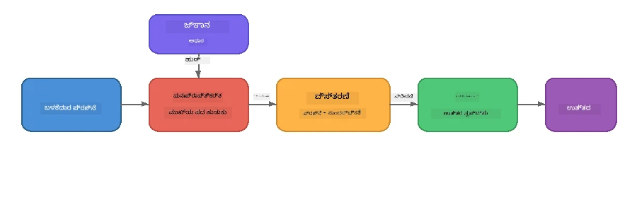

# ಭಾಗ 4: ಫೌಂಡ್ರಿ ಲೊಕಲ್‌ನೊಂದಿಗೆ RAG ಅಪ್ಲಿಕೇಶನ್ ಅನ್ನು ನಿರ್ಮಿಸುವುದು

## ಅವಲೋಕನ

ಲಾರ್ಜ್ ಲ್ಯಾಂಗ್ವೇಜ್ ಮಾದರಿಗಳು ಶಕ್ತಿಶಾಲಿಯನ್ನಾಗಿವೆ, ಆದರೆ ಅವುಗಳಿಗೆ ತಿಳಿದಿರುವುದು ಮಾತ್ರಾ ತರಬೇತಿ ಡೇಟಾದ ಒಳಗಿರುವದಾಗಿದೆ. **ರಿಟ್ರೀವಲ್-ಅಗ್ರಿಮೆಂಟ್ ಜನರೇಶನ್ (RAG)** ಇದನ್ನು ಪರಿಹರಿಸುತ್ತದೆ ಮೋಡೆಲ್‌ಗೆ ಪ್ರಶ್ನೆ ಸಮಯದಲ್ಲಿ ಸಂಬಂಧಿತ ಕಾನ್ಟೆಕ್ಸ್ಟ್ ನೀಡುವುದರಿಂದ - ನಿಮ್ಮ ಸ್ವಂತ ಡಾಕ್ಯುಮೆಂಟ್‌ಗಳು, ಡೇಟಾಬೇಸ್‌ಗಳು ಅಥವಾ ಜ್ಞಾನಾಧಾರಗಳಿಂದ ತೆಗೆದು.

ಈ ಲ್ಯಾಬ್‌ನಲ್ಲಿ ನೀವು ಪೂರ್ಣವಾದ RAG ಪೈಪ್‌ಲೈನ್ ಅನ್ನು ನಿರ್ಮಿಸುತ್ತೀರಿ, ಇದು **ನಿಮ್ಮ ಸಾಧನದ ಮೇಲೆ ಸಂಪೂರ್ಣವಾಗಿ** ಫೌಂಡ್ರಿ ಲೊಕಲ್ ಬಳಸಿ ಕಾರ್ಯನಿರ್ವಹಿಸುತ್ತದೆ. ಯಾವುದೇ ಕ್ಲೌಡ್ ಸೇವೆಗಳು, ವೆಕ್ಟರ್ ಡೇಟಾಬೇಸ್‌ಗಳು ಇಲ್ಲ, embeddings API ಇಲ್ಲ - ಕೇವಲ ಲೋಕಲ್ ರಿಟ್ರೀವಲ್ ಮತ್ತು ಲೋಕಲ್ ಮೋಡೆಲ್.

## ಕಲಿಕಾ ಉದ್ದೇಶಗಳು

ಈ ಲ್ಯಾಬ್ ಅಂತ್ಯಕ್ಕೆ ನೀವು ಸಾಕ್ಷ್ಯವಾಗುತ್ತೀರಿ:

- RAG ಅಂದ್ರೇನು ಮತ್ತು AI ಅಪ್ಲಿಕೇಶನ್‌ಗಳಿಗೆ ಇದರ ಮಹತ್ವವೇನು ಎಂದು ತಿಳಿಸಲು
- ಪಠ್ಯ ಡಾಕ್ಯುಮೆಂಟ್‌ಗಳಿಂದ ಸ್ಥಳೀಯ ಜ್ಞಾನಾಭಿವೃದ್ಧಿ ವ್ಯವಸ್ಥೆಯನ್ನು ನಿರ್ಮಿಸಲು
- ಸಂಬಂಧಿತ ಕಾನ್ಟೆಕ್ಸ್ಟ್ ಹುಡುಕಲು ಸರಳ ರಿಟ್ರೀವಲ್ ಫಂಕ್ಷನ್ ಅನುಷ್ಠಾನಗೊಳಿಸಲು
- ರಿಟ್ರೀವ್ ಮಾಡಿದ ವಾಸ್ತವಕಥನಗಳ ಮೇಲೆ ಆಧಾರಿತ ವ್ಯವಸ್ಥೆಗಳ ಪ್ರಾಂಪ್ಟ್ ರಚಿಸಲು
- ಸಂಪೂರ್ಣ Retrieve → Augment → Generate ಪೈಪ್‌ಲೈನ್ ಅನ್ನು ಸಾಧನದಲ್ಲೇ ನಡಿಸಲು
- ಸರಳ ಕೀವರ್ಡ್ ರಿಟ್ರೀವಲ್ ಮತ್ತು ವೆಕ್ಟರ್ ಶೋಧನ ನಡುವಿನ ವ್ಯವಹಾರಗಳನ್ನು ತಿಳಿದುಕೊಳ್ಳಲು

---

## ಪೂರ್ವಾಪೇಕ್ಷಿತಗಳು

- ಪೂರ್ಣಗೊಂಡ [ಭಾಗ 3: ಫೌಂಡ್ರಿ ಲೊಕಲ್ SDK ಅನ್ನು OpenAI ಜೊತೆಗೆ ಬಳಸಿ](part3-sdk-and-apis.md)
- ಫೌಂಡ್ರಿ ಲೊಕಲ್ CLI ಇನ್‌ಸ್ಟಾಲ್ ಮಾಡಲಾಗಿದ್ದು ಮತ್ತು `phi-3.5-mini` ಮಾದರಿ ಡೌನ್‌ಲೋಡ್ ಆಗಿರಬೇಕು

---

## ಸಂಯೋಜನೆ: RAG ಎಂದರೇನು?

RAG ಇಲ್ಲದೆ, ಒಂದು LLM ತನ್ನ ತರಬೇತಿ ಡೇಟಾದಿಂದ ಮಾತ್ರ ಉತ್ತರಿಸಬಹುದು - ಅದು ಹಳೆಯದು, ಅಪೂರ್ಣ ಅಥವಾ ನಿಮ್ಮ ಖಾಸಗಿ ಮಾಹಿತಿಯನ್ನು ಕಳೆದುಕೊಂಡಿರಬಹುದು:

```
User: "What is Zava's return policy?"
LLM:  "I do not have information about Zava's return policy."  ← No context!
```
  
RAG ಜೊತೆ, ನೀವು ಮೊದಲು ಸಂಬಂಧಿತ ಡಾಕ್ಯುಮೆಂಟ್‌ಗಳನ್ನು **ರಿಟ್ರೀವ್** ಮಾಡುತ್ತೀರಿ, ನಂತರ that ಕ್ಯಾನ್ಟೆಕ್ಸ್ಟ್‌ನೊಂದಿಗೆ **ಆಗ್ಮೆಂಟ್** ಮಾಡಿ ನಂತರ **ಜನರೇಟ್** ಮಾಡುತ್ತೀರಿ:



ಮುಖ್ಯ ತಿಳಿವು: **ಮೋಡೆಲ್‌ಗೆ "ಉತ್ತರ" ಗೊತ್ತಿರಬೇಕಾಗಿಲ್ಲ; ಅದು ಸರಿಯಾದ ಡಾಕ್ಯುಮೆಂಟ್‌ಗಳನ್ನು ಓದಬೇಕು ಮಾತ್ರ.**

---

## ಪ್ರಯೋಗಗಳು

### ವ್ಯಾಯಾಮ 1: ಜ್ಞಾನಾಭಿವೃದ್ಧಿ ವ್ಯವಸ್ಥೆಯನ್ನು ಅರ್ಥಮಾಡಿಕೊಳ್ಳಿ

ನಿಮ್ಮ ಭಾಷೆಗೆ ಸಂಬಂಧಿಸಿದ RAG ಉದಾಹರಣೆ ತೆರೆದು ಜ್ಞಾನಾಭಿವೃದ್ಧಿ ವ್ಯವಸ್ಥೆಯನ್ನು ಪರಿಶೀಲಿಸಿ:

<details>
<summary><b>🐍 ಪೈಥಾನ್: <code>python/foundry-local-rag.py</code></b></summary>

ಜ್ಞಾನಾಭಿವೃದ್ಧಿ ವ್ಯವಸ್ಥೆ ಸರಳವಾಗಿ ಡಿಕ್ಷನರಿ ಗಳ ಪಟ್ಟಿಯಾಗಿದೆ ಜೊತೆಗೆ `title` ಮತ್ತು `content` ಕ್ಷೇತ್ರಗಳಿವೆ:

```python
KNOWLEDGE_BASE = [
    {
        "title": "Foundry Local Overview",
        "content": (
            "Foundry Local brings the power of Azure AI Foundry to your local "
            "device without requiring an Azure subscription..."
        ),
    },
    {
        "title": "Supported Hardware",
        "content": (
            "Foundry Local automatically selects the best model variant for "
            "your hardware. If you have an Nvidia CUDA GPU it downloads the "
            "CUDA-optimized model..."
        ),
    },
    # ... ಇನ್ನಷ್ಟು ಎಂಟ್ರಿಗಳು
]
```
  
ಪ್ರತಿ ಎಂಟ್ರಿ "ಚಂಕ್" ಎಂಬ ಜ್ಞಾನದ ಭಾಗವನ್ನು సూచಿಸುತ್ತದೆ - ಒಂದು ವಿಷಯದ ಮೇಲಿನ ಸಂಕೀರ್ಣ ಮಾಹಿತಿಯ ತುಣುಕು.

</details>

<details>
<summary><b>📘 ಜಾವಾಸ್ಕ್ರಿಪ್ಟ್: <code>javascript/foundry-local-rag.mjs</code></b></summary>

ಜ್ಞಾನಾಭಿವೃದ್ಧಿ ವ್ಯವಸ್ಥೆ ಆಬ್ಜೆಕ್ಟ್‌ಗಳ ಸರಣಿಯ ίδια ರಚನೆ ಬಳಸುತ್ತದೆ:

```javascript
const KNOWLEDGE_BASE = [
  {
    title: "Foundry Local Overview",
    content:
      "Foundry Local brings the power of Azure AI Foundry to your local " +
      "device without requiring an Azure subscription...",
  },
  {
    title: "Supported Hardware",
    content:
      "Foundry Local automatically selects the best model variant for " +
      "your hardware...",
  },
  // ... ಇನ್ನಷ್ಟು ದಾಖಲೆಗಳು
];
```

</details>

<details>
<summary><b>💜 C#: <code>csharp/RagPipeline.cs</code></b></summary>

ಜ್ಞಾನಾಭಿವೃದ್ಧಿ ವ್ಯವಸ್ಥೆ ನಾಮಪ್ರದ ಟುಪಲ್‌ಗಳ ಪಟ್ಟಿಯನ್ನು ಬಳಸುತ್ತದೆ:

```csharp
private static readonly List<(string Title, string Content)> KnowledgeBase =
[
    ("Foundry Local Overview",
     "Foundry Local brings the power of Azure AI Foundry to your local " +
     "device without requiring an Azure subscription..."),

    ("Supported Hardware",
     "Foundry Local automatically selects the best model variant for " +
     "your hardware..."),

    // ... more entries
];
```

</details>

> **ನಿಜವಾದ ಅಪ್ಲಿಕೇಶನ್‌ನಲ್ಲಿ**, ಜ್ಞಾನಾಭಿವೃದ್ಧಿ ವ್ಯವಸ್ಥೆ ಫೈಲ್‌ಗಳು, ಡೇಟಾಬೇಸ್, ಶೋಧ ಸೂಚ್ಯಂಕ ಅಥವಾ API ಇಂದ ಬಂದಿರಬಹುದು. ಈ ಲ್ಯಾಬ್‌ನಿಗಾಗಿ, ನಾವು ಸಿಂಪಲ್ ಮಾಡಬೇಕೆಂದು ಮನಸ್ಸು ಮಾಡಿ ನೆನಪಿನಲ್ಲಿಯೇ ಪಟ್ಟಿಯನ್ನು ಬಳಕೆ ಮಾಡುತ್ತೇವೆ.

---

### ವ್ಯಾಯಾಮ 2: ರಿಟ್ರೀವಲ್ ಫಂಕ್ಷನ್ ಅರ್ಥಮಾಡಿಕೊಳ್ಳಿ

ರಿಟ್ರೀವಲ್ ಹಂತವು ಬಳಕೆದಾರನ ಪ್ರಶ್ನೆಗೆ ಸಂಬಂಧಿತ ಚಂಕ್‌ಗಳನ್ನು ಹುಡುಕುತ್ತದೆ. ಈ ಉದಾಹರಣೆ **ಕೀವರ್ಡ್ ಓವರ್‌ಲ್ಯಾಪ್** ಬಳಕುತಿದೆ - ಪ್ರಶ್ನೆಯಲ್ಲಿರುವ ಪದಗಳು ಪ್ರತಿಯನ್ವಯ ಚಂಕ್‌ನಲ್ಲಿ ಎಷ್ಟು ಸಿಕ್ಕಿವೆ ಎಂದು ಎಣಿಸುವುದು:

<details>
<summary><b>🐍 ಪೈಥಾನ್</b></summary>

```python
def retrieve(query: str, top_k: int = 2) -> list[dict]:
    """Return the top-k knowledge chunks most relevant to the query."""
    query_words = set(query.lower().split())
    scored = []
    for chunk in KNOWLEDGE_BASE:
        chunk_words = set(chunk["content"].lower().split())
        overlap = len(query_words & chunk_words)
        scored.append((overlap, chunk))
    scored.sort(key=lambda x: x[0], reverse=True)
    return [item[1] for item in scored[:top_k]]
```

</details>

<details>
<summary><b>📘 ಜಾವಾಸ್ಕ್ರಿಪ್ಟ್</b></summary>

```javascript
function retrieve(query, topK = 2) {
  const queryWords = new Set(query.toLowerCase().split(/\s+/));
  const scored = KNOWLEDGE_BASE.map((chunk) => {
    const chunkWords = new Set(chunk.content.toLowerCase().split(/\s+/));
    let overlap = 0;
    for (const w of queryWords) {
      if (chunkWords.has(w)) overlap++;
    }
    return { overlap, chunk };
  });
  scored.sort((a, b) => b.overlap - a.overlap);
  return scored.slice(0, topK).map((s) => s.chunk);
}
```

</details>

<details>
<summary><b>💜 C#</b></summary>

```csharp
private static List<(string Title, string Content)> Retrieve(string query, int topK = 2)
{
    var queryWords = new HashSet<string>(
        query.ToLowerInvariant().Split(' ', StringSplitOptions.RemoveEmptyEntries));

    return KnowledgeBase
        .Select(chunk =>
        {
            var chunkWords = new HashSet<string>(
                chunk.Content.ToLowerInvariant().Split(' ', StringSplitOptions.RemoveEmptyEntries));
            var overlap = queryWords.Intersect(chunkWords).Count();
            return (Overlap: overlap, Chunk: chunk);
        })
        .OrderByDescending(x => x.Overlap)
        .Take(topK)
        .Select(x => x.Chunk)
        .ToList();
}
```

</details>

**ಹೀಗೇ ಕೆಲಸ ಮಾಡುತ್ತದೆ:**  
1. ಪ್ರಶ್ನೆಯನ್ನು ವೈಯಕ್ತಿಕ ಪದಗಳಾಗಿ ಹಪ್ಪಿ ಮಾಡು  
2. ಪ್ರತಿ ಜ್ಞಾನ ಚಂಕ್‌ಗೆ, ಪ್ರಶ್ನೆಯ ಪದಗಳು ಆ ಚಂಕ್‌ನಲ್ಲಿ ಎಷ್ಟು ಇದ್ದವು ಎಂದು ಎಣಿಸಿ  
3. ಓವರ್‌ಲ್ಯಾಪ್ ಸ್ಕೋರ್ ಆಧಾರದ ಮೇಲೆ (ಎಲ್ಲಾ ಮೊದಲು) ಕ್ರಮಿಸಿ  
4. ತಾಪ್ತಾ-k ಅತ್ಯಂತ ಪ್ರಸ್ತುತ ಚಂಕ್‌ಗಳನ್ನು ಮರಳಿಸಿ

> **ವ್ಯವಹಾರ:** ಕೀವರ್ಡ್ ಓವರ್‌ಲ್ಯಾಪ್ ಸುಲಭ ಆದರೆ ಸೀಮಿತವಾಗಿದೆ; ಅದು ಸಮಾನಾರ್ಥಕ ಅಥವಾ ಅರ್ಥವನ್ನು ಗ್ರಹಿಸುವುದಿಲ್ಲ. ಉತ್ಪಾದನೆ RAG ವ್ಯವಸ್ಥೆಗಳು ಸಾಮಾನ್ಯವಾಗಿ **ಎಂಬೆಡ್ಡಿಂಗ್ ವೆಕ್ಟರ್‌ಗಳು** ಮತ್ತು **ವೆಕ್ಟರ್ ಡೇಟಾಬೇಸ್** ಅನ್ವಯಿಸಿ ಅರ್ಥಶಾಸ್ತ್ರೀಯ ಶೋಧನ ವನ್ನು ಮಾಡುತ್ತವೆ. ಆದರೆ ಕೀವರ್ಡ್ ಓವರ್‌ಲ್ಯಾಪ್ ಒಳ್ಳೆಯ ಪ್ರಾರಂಭವಾಗಿದ್ದು ಹೆಚ್ಚುವರಿ ಅವಲಂಬನೆಗಳಿಗೆ ಅಗತ್ಯವಿಲ್ಲ.

---

### ವ್ಯಾಯಾಮ 3: ಆಗ್ಮೆಂಟ್ ಮಾಡಿದ ಪ್ರಾಂಪ್ಟ್ ಅರ್ಥಮಾಡಿಕೊಳ್ಳಿ

ರಿಟ್ರೀವ್ ಮಾಡಿದ ಕಾನ್ಟೆಕ್ಸ್ಟ್ **ಸಿಸ್ಟಮ್ ಪ್ರಾಂಪ್ಟ್**‌ಗೆ ಸೇರಿಸಲಾಗುತ್ತದೆ ಮೊದಲು ಮೋಡೆಲ್‌ಗೆ ಕಳುಹಿಸುವ ಮೊದಲು:

```python
system_prompt = (
    "You are a helpful assistant. Answer the user's question using ONLY "
    "the information provided in the context below. If the context does "
    "not contain enough information, say so.\n\n"
    f"Context:\n{context_text}"
)
```
  
ಮುಖ್ಯ ವಿನ್ಯಾಸ ನಿರ್ಣಯಗಳು:  
- **"ಮಾಹಿತಿಯೇ ಮಾತ್ರ!"** - ಕಂಡಿದ್ದಿಲ್ಲದ ವಾಸ್ತವಗಳನ್ನು ಮೋಡೆಲ್ ಹುಬ್ಬಳಿಸದಂತೆ ತಡೆಯುವುದು  
- **"ಕಾಂಟೆಕ್ಸ್ಟ್‌ನಲ್ಲಿ ಸಾಕಷ್ಟು ಮಾಹಿತಿ ಇಲ್ಲದಿದ್ದರೆ ಹಾಗೆ ಹೇಳಿ"** - ಸತ್ಯವಂತಿಕೆಯನ್ನು ಬಲಪಡಿಸು "ನನಗೆ ಗೊತ್ತಿಲ್ಲ" ಉತ್ತರಗಳಿಗೆ  
- ಕಾನ್ಟೆಕ್ಸ್ಟ್ ವ್ಯವಸ್ಥೆಯ ಸಂದೇಶದಲ್ಲಿ ಇರಿಸುವುದರಿಂದ ಎಲ್ಲಾ ಉತ್ತರಗಳನ್ನು ನಿಯಂತ್ರಿಸುತ್ತದೆ

---

### ವ್ಯಾಯಾಮ 4: RAG ಪೈಪ್‌ಲೈನ್ ನಡಿಸು

ಪೂರ್ಣ ಉದಾಹರಣೆ চালಿಸಿ:

**ಪೈಥಾನ್:**  
```bash
cd python
python foundry-local-rag.py
```
  
**ಜಾವಾಸ್ಕ್ರಿಪ್ಟ್:**  
```bash
cd javascript
node foundry-local-rag.mjs
```
  
**C#:**  
```bash
cd csharp
dotnet run rag
```
  
ನೀವು ಮೂರು ವಸ್ತುಗಳನ್ನು ಮುದ್ರಿತವಾಗಿರುತ್ತವೆ:  
1. **ಪ್ರಶ್ನೆ** ಕೇಳಲಾಗಿದೆ  
2. **ರಿಟ್ರೀವ್ ಮಾಡಿದ ಕಾನ್ಟೆಕ್ಸ್ಟ್** — ಜ್ಞಾನಾಭಿವೃದ್ಧಿ ವ್ಯವಸ್ಥೆಯಿಂದ ಆಯ್ದ ಚಂಕ್‌ಗಳು  
3. **ಉತ್ತರ** — ಆ ಕಾನ್ಟೆಕ್ಸ್ಟ್ ಬಳಸಿ ಮೋಡೆಲ್ ಉತ್ಪಾದಿಸಿದ ಉತ್ತರ

ಉದಾಹರಣೆಯ ಔಟ್‌ಪುಟ್:  
```
Question: How do I install Foundry Local and what hardware does it support?

--- Retrieved Context ---
### Installation
On Windows install Foundry Local with: winget install Microsoft.FoundryLocal...

### Supported Hardware
Foundry Local automatically selects the best model variant for your hardware...
-------------------------

Answer: To install Foundry Local, you can use the following methods depending
on your operating system: On Windows, run `winget install Microsoft.FoundryLocal`.
On macOS, use `brew install microsoft/foundrylocal/foundrylocal`...
```
  
ಮೋಡೆಲ್ ಉತ್ತರವು **ರಿಟ್ರೀವ್ ಮಾಡಿದ ಕಾನ್ಟೆಕ್ಸ್ಟ್‌ನ ಮೇಲೆ ನೆಲಸಿದ** ಇದೆ ಎಂಬುದನ್ನು ಗಮನಿಸಿ - ಅದು ಜ್ಞಾನಾಭಿವೃದ್ಧಿ ಡಾಕ್ಯುಮೆಂಟ್‌ಗಳ ವಾಸ್ತವಗಳನ್ನು ಮಾತ್ರ ಉಲ್ಲೇಖಿಸುತ್ತದೆ.

---

### ವ್ಯಾಯಾಮ 5: ಪ್ರಯೋಗ ಮಾಡಿ ಮತ್ತು ವಿಸ್ತರಿಸಿ

ನಿಮ್ಮ ಅರ್ಥವನ್ನು ಗಾಢಗೊಳಿಸಲು ಈ ಬದಲಾವಣೆಗಳನ್ನು ಪ್ರಯತ್ನಿಸಿ:

1. **ಪ್ರಶ್ನೆ ಬದಲಾವಣೆ ಮಾಡಿ** - ಜ್ಞಾನಾಭಿವೃದ್ಧಿ ವ್ಯವಸ್ಥೆಯಲ್ಲಿ ಇರುವುದನ್ನು ಮತ್ತು ಇಲ್ಲದಿರುವುದನ್ನು ಕೇಳಿ:  
   ```python
   question = "What programming languages does Foundry Local support?"  # ← ಸ೦ದರ್ಭದಲ್ಲಿ
   question = "How much does Foundry Local cost?"                       # ← ಸ೦ದರ್ಭದಲ್ಲಿ ಇಲ್ಲ
   ```
  
ಪ್ರಕ್ರಿಯೆ ಸರಿಹೊಂದುತ್ತದೆ "ನನಗೆ ಗೊತ್ತಿಲ್ಲ" ಎಂದು ಹೇಳುತ್ತದೆಯೇ?

2. **ಹೊಸ ಜ್ಞಾನ ಚಂಕ್ ಸೇರಿಸಿ** - `KNOWLEDGE_BASE` ಗೆ ಹೊಸ ಎಂಟ್ರಿ ಸೇರಿಸಿ:  
   ```python
   {
       "title": "Pricing",
       "content": "Foundry Local is completely free and open source under the MIT license.",
   }
   ```
  
ಇನ್ನು ಬೆಲೆ ಕುರಿತು ಪ್ರಶ್ನೆ ಕೇಳಿ.

3. **`top_k` ಬದಲಾಯಿಸಿ** - ಹೆಚ್ಚು ಅಥವಾ ಕಡಿಮೆ ಚಂಕ್‌ಗಳು ಪಡೆಯಿರಿ:  
   ```python
   context_chunks = retrieve(question, top_k=3)  # ಹೆಚ್ಚಿನ ಸಂದರ್ಭ
   context_chunks = retrieve(question, top_k=1)  # ಕಡಿಮೆ ಸಂದರ್ಭ
   ```
  
ಕಾನ್ಟೆಕ್ಸ್ಟ್ ಪ್ರಮಾಣ ಉತ್ತರದ ಗುಣಮಟ್ಟದ ಮೇಲೆ ಹೇಗೆ ಪ್ರಭಾವ ಬೀರುತ್ತದೆ?

4. **ಗ್ರೌಂಡಿಂಗ್ ಸೂಚನೆಯನ್ನು ತೆಗೆದುಹಾಕಿ** - ಸಿಸ್ಟಮ್ ಪ್ರಾಂಪ್ಟ್ "ನೀವು ಸಹಾಯಕ ಸಹಪ್ರವೃತ್ತಿ" ಎಂದು ಬದಲಿಸಿ ಮತ್ತು ಮೋಡೆಲ್ ವಾಸ್ತವಗಳನ್ನು ಹುಬ್ಬಳಿಸಲು ಪ್ರಾರಂಭಿಸುತ್ತದೆಯೇ ನೋಡಿರಿ.

---

## ಆಳವಾದ ವಿಶ್ಲೇಷಣೆ: ಸಾಧನ-ಮೇಲೆ ಕಾರ್ಯಕ್ಷಮತೆಯಿಗಾಗಿ RAG ಅನ್ನು ಅನ್ವಯಿಸುವುದು

ಸಾಧನದ ಮೇಲೆ RAG ನಡಿಸುವುದು ಕ್ಲೌಡ್‌ನಲ್ಲಿ ಎದುರಿಸುತ್ತದೆಯಾದಷ್ಟು ನಿಯಂತ್ರಣೆಗಳನ್ನು ಹೊಂದಿದೆ: ಕಡಿಮೆ RAM, ಅರ್ಪಿತ GPU ಇಲ್ಲ (CPU/NPU ಕಾರ್ಯಾಚರಣೆ), ಮತ್ತು ಸಣ್ಣ ಮಾದರಿ ಕಾನ್ಟೆಕ್ಸ್ಟ್ ವಿಂಡೋ. ಕೆಳಗಿನ ವಿನ್ಯಾಸ ನಿರ್ಣಯಗಳು ಈ ನಿಯಂತ್ರಣೆಗಳನ್ನು ನೇರವಾಗಿ ಪರಿಹರಿಸುತ್ತವೆ ಮತ್ತು ಫೌಂಡ್ರಿ ಲೊಕಲ್ ಬಳಸಿ ನಿರ್ಮಿಸಿದ ಉತ್ಪಾದನಾ ಶೈಲಿ ಸ್ಥಳೀಯ RAG ಅಪ್ಲಿಕೇಶನ್‌ಗಳ ಮಾದರಿಗಳ ಮೇರೆಗೆ ಆಧಾರಿತ.

### ಚಂಕಿಂಗ್ ತಂತ್ರ: ಸ್ಥಿರ ಗಾತ್ರದ ಸ್ಲೈಡಿಂಗ್ ವಿಂಡೋ

ಚಂಕಿಂಗ್ - ಡಾಕ್ಯುಮೆಂಟ್‌ಗಳನ್ನು ತುಣುಕುಗಳಾಗಿ ವಿಭಾಗಿಸುವುದು - ಯಾವುದೇ RAG ವ್ಯವಸ್ಥೆಯಲ್ಲಿ ಅತ್ಯಂತ ಪರಿಣಾಮಕಾರಿಯಾದ ನಿರ್ಣಯ. ಸಾಧನದಲ್ಲಿ ಸ್ಲೈಡಿಂಗ್ ವಿಂಡೋಕ್ಕೆ **ಸ್ಥಿರ ಗಾತ್ರದ ಹಾಗೂ ಓವರ್‌ಲ್ಯಾಪ್ ಇರುವ** ವಿಧಾನ ಶಿಫಾರಸು ಮಾಡಲಾಗಿದೆ:

| ಪರಿಮಾಣ | ಶಿಫಾರಸು ಮಾಡಲಾದ ಮೌಲ್ಯ | ಕಾರಣ |
|-----------|------------------|-----|
| **ಚಂಕ್ ಗಾತ್ರ** | ~200 ಟೋಕನ್ಗಳು | ರಿಟ್ರೀವ್ ಮಾಡಿದ ಕಾನ್ಟೆಕ್ಸ್ಟ್ ಸನಿಹವಾಗಿರಿಸುತ್ತದೆ, Phi-3.5 Mini ಸಿಸ್ಟಮ್ ಪ್ರಾಂಪ್ಟ್, ಸಂಭಾಷಣೆ ಇತಿಹಾಸ ಮತ್ತು ಉತ್ಪಾದಿತ ಔಟ್ ಪುಟ್ ಸ್ಥಳಕ್ಕೆ ಅವಕಾಶ ಮಾಡಿಕೊಡುತ್ತದೆ |
| **ಓವರ್‌ಲ್ಯಾಪ್** | ~25 ಟೋಕನ್ಗಳು (12.5%) | ಚಂಕ್ ಮર્યಾದೆಗಳಲ್ಲಿ ಮಾಹಿತಿ ನಷ್ಟ ತಡೆಯುತ್ತದೆ - ಪ್ರಕ್ರಿಯೆಗಳು ಮತ್ತು ಹಂತ ಹಂತ ಸೂಚನೆಗಳಿಗೆ ಪ್ರಮುಖ |
| **ಟೋಕನೈಜೆಷನ್** | ವೈಟ್‌ಸ್ಪೇಸ್ ವಿಭಜನೆ | ಶೂನ್ಯ ಅವಲಂಬನೆಗಳು, ಯಾವುದೇ tokenizer ಪುಸ್ತಕಾಲಯ ಬೇಕಾಗಿಲ್ಲ. ಸಂಪೂರ್ಣ ಗಣನೆ ಬಜೆಟ್ LLMಗೆ ಉಳಿದುಕೊಳ್ಳುತ್ತದೆ |

ಓವರ್‌ಲ್ಯಾಪ್ ಒಂದು ಸ್ಲೈಡಿಂಗ್ ವಿಂಡೋ ಹಾಗಿ ಕಾರ್ಯನಿರ್ವಹಿಸುತ್ತದೆ: ಪ್ರತಿಯೊಂದು ಹೊಸ ಚಂಕ್ ಹಿಂದಿನದಕ್ಕಿಂತ 25 ಟೋಕನ್ಗಳು ಹಿಂದಿನಿಂದ ಪ್ರಾರಂಭವಾಗುತ್ತದೆ, ಹೀಗಾಗಿ ವಾಕ್ಯಗಳು ಚಂಕ್ ಮನ್ಯಾಜುಗಳ ನಡುವೆ ಎರಡು ಚಂಕ್‌ಗಳಲ್ಲೂ ಕಾಣಿಸುತ್ತವೆ.

> **ಮತ್ತೊಂದು ವಿಧಾನಗಳಾಗದಿರುವುದಕ್ಕೆ ಏಕೆ?**  
> - **ವಾಕ್ಯ ಆಧಾರಿತ ವಿಭಾಗ** ಅಪೇಕ್ಷಿತ ಚಂಕ್ ಗಾತ್ರಗಳನ್ನು ನೀಡುವುದಿಲ್ಲ; ಕೆಲವು ಸುರಕ್ಷತಾ ಪ್ರಕ್ರಿಯೆಗಳು ಒಬ್ಬ ವಾಕ್ಯವಾಗಿ ಬರುವುದರಿಂದ ಅವುಗಳನ್ನು ಸರಿಯಾಗಿ ವಿಭಾಗಿಸಬಾರದು  
> - **ವಿಭಾಗ ಜಾಗರೂಕ ವಿಭಜನೆ** (`##` ಅಣುಮಟ್ಟದ ಉಪಶೀರ್ಷಿಕೆಗಳ ಮೇಲೆ) ಅಕ್ರಮ ಚಂಕ್ ಗಾತ್ರಗಳು - ಕೆಲವು ಅತೀ ಸಣ್ಣ, ಕೆಲವು ಅತೀ ದೊಡ್ಡವು, ಮೋಡೆಲ್ ಕಾನ್ಟೆಕ್ಸ್ಟ್ ವಿಂಡೋದಿಗಿಂತ  
> - **ಸಮಾನಾರ್ಥಕ ಚಂಕಿಂಗ್** (ಎಂಬೆಡ್ಡಿಂಗ್ ಆಧಾರಿತ ವಿಷಯ ಪತ್ತೆ) ಉತ್ತಮ ರಿಟ್ರೀವಲ್ ಗುಣಮಟ್ಟ ನೀಡುತ್ತದೆ, ಆದರೆ Phi-3.5 Mini ಜೊತೆಗೆ ಎರಡನೇ ಮೋಡೆಲ್ ಮಾಡಿಕೊಂಡು ನಡಿಸುವುದಾಗಿ ಇರುತ್ತದೆ - 8-16 GB ಸಂಯೋಜಿತ ಮೆಮೊರಿ ಹೊಂದಿರುವ ಸಾಧನಗಳಲ್ಲಿ ಅಪಾಯಕಾರಿ

### ರಿಟ್ರೀವಲ್ ವೇಗಿ: TF-IDF ವೆಕ್ಟರ್‌ಗಳು

ಈ ಲ್ಯಾಬ್‌ನ ಕೀವರ್ಡ್ ಓವರ್‌ಲ್ಯಾಪ್ ನಡುತ್ತದೆ ಆದರೆ ನೀವು ಅಗತ್ಯವಿದ್ದರೆ embeddings ಮಾದರಿಯನ್ನು ಸೇರಿಸದೆ ಉತ್ತಮ ರಿಟ್ರೀವಲ್ ಬೇಕಾದರೆ, **TF-IDF (ಟರ್ಮ್ ಫ್ರೀಕ್ವೆನ್ಸಿ-ಇನ್ವರ್ಸ್ ಡಾಕ್ಯುಮೆಂಟ್ ಫ್ರೀಕ್ವೆನ್ಸಿ)** ಅತ್ಯುತ್ತಮ ಮಧ್ಯಮ ದಾರಿಯಾಗಿರುತ್ತದೆ:

```
Keyword Overlap  →  TF-IDF Vectors  →  Embedding Models
    (this lab)     (lightweight upgrade)   (production)
  Simple & fast    Better ranking,         Best quality,
  No dependencies  still no ML model       requires embedding model
  ~Basic matching  ~1ms retrieval          ~100-500ms per query
```
  
TF-IDF ಪ್ರತಿ ಚಂಕ್ ಅನ್ನು ಸಂಖ್ಯಾತ್ಮಕ ವೆಕ್ಟರ್‌ಗಳಾಗಿ ಪರಿವರ್ತಿಸುತ್ತದೆ ಮುಕ್ಯವಾಗಿ ಯಾವ ಪದವು ಆ ಚಂಕ್ ಒಳಗೆ ಎಷ್ಟು ಪ್ರಮುಖ ಹಾದರಿಸುತ್ತದೆ എന്ന് *ಎಲ್ಲಾ ಚಂಕ್‌ಗಳ ಹೋಲಿಕೆಯಲ್ಲಿ*. ಪ್ರಶ್ನೆ ಸಮಯದಲ್ಲಿ, ಅದೇ ವಿಧಾನದಲ್ಲಿ ಪ್ರಶ್ನೆಯನ್ನು ವೆಕ್ಟರೈಸ್ ಮಾಡಿ ಕೋಸೈನ್ ಸಮೀಪತೆ ಮೂಲಕ ಹೋಲಿಸಿ. ಇದನ್ನು SQLite ಮತ್ತು ಶುದ್ಧ ಜಾವಾಸ್ಕ್ರಿಪ್ಟ್/ಪೈಥಾನ್‌ನಿಂದ ಅನುಷ್ಠಾನಗೊಳಿಸಬಹುದು - ಯಾವುದೇ ವೆಕ್ಟರ್ ಡೇಟಾಬೇಸ್ ಇಲ್ಲ, embeddings API ಇಲ್ಲ.

> **ಕಾರ್ಯಕ್ಷಮತೆ:** ಫಿಕ್ಸ್ಡ್ ಸೈಸ್ ಚಂಕ್‌ಗಳ ಮೇಲೆ TF-IDF ಕೋಸೈನ್ ಸಮೀಪತೆ ಸಾಮಾನ್ಯವಾಗಿ **~1 ಮಿಲಿಸೆಕೆಂಡ್** ರಿಟ್ರೀವಲ್ ತರುತ್ತದೆ, ಇವು ಪ್ರತಿ ಪ್ರಶ್ನೆಯನ್ನು ಅಂಕಿತಗೊಳಿಸುವ embedding ಮಾದರಿ ಚಾಲಿತ ಅನ್ವಯಣೆಯನ್ನು ಹೋಲಿಸಿದರೆ ~100-500 ಮಿಲಿಸೆಕೆಂಡ್. ಎಲ್ಲಾ 20+ ಡಾಕ್ಯುಮೆಂಟ್‌ಗಳನ್ನು ಚಂಕ್ ಮಾಡುವುದು ಮತ್ತು ಇಂಡೆಕ್ಸಿಂಗ್ ಒಟ್ಟು 1 ಸೆಕೆಂಡಿನೊಳಗೆ.

### ಕಡಿಮೆ ಸಂಸಾಧನ ಹೊಂದಿರುವ ಸಾಧನಗಳಿಗಾಗಿ ಎಡ್ಜ್/ಸಂಕುಚಿತ ಮೋಡ್

ಅತೀ ನಿಯಂತ್ರಿತ ಹಾರ್ಡ್‌ವೇರ್ (ಹಳೆಯ ಲ್ಯಾಪ್‌ಟಾಪ್‌ಗಳು, ಟ್ಯಾಬ್ಲೆಟ್‌ಗಳು, ಫೀಲ್ಡ್ ಸಾಧನಗಳು) ನಲ್ಲಿ ಬಳಸುತ್ತಿದ್ದರೆ ನೀವು ಮೂರು ತಗ್ಗಿಸುವ ವ್ಯವಸ್ಥೆಗಳನ್ನು (knobs) ಕಡಿಮೆ ಮಾಡಬಹುದು:

| ಸೆಟ್ಟಿಂಗ್ | ಸ್ಟ್ಯಾಂಡರ್ಡ್ ಮೋಡ್ | ಎಡ್ಜ್ / ಸಂಕುಚಿತ ಮೋಡ್ |
|---------|--------------|-------------------|
| **ಸಿಸ್ಟಮ್ ಪ್ರಾಂಪ್ಟ್** | ~300 ಟೋಕನ್ಗಳು | ~80 ಟೋಕನ್ಗಳು |
| **ಗರಿಷ್ಠ ಔಟ್‌ಪುಟ್ ಟೋಕನ್ಗಳು** | 1024 | 512 |
| **ರಿಟ್ರೀವ್ ಮಾಡಿದ ಚಂಕ್‌ಗಳು (top-k)** | 5 | 3 |

ಕಡಿಮೆ ಚಂಕ್‌ಗಳು ತಲುಪಿಸುವುದು ಮೋಡೆಲ್‌ಗೆ ಪ್ರಕ್ರಿಯೆಗೆ ಕಡಿಮೆ ಕಾನ್ಟೆಕ್ಸ್ಟ್ ನೀಡುತ್ತದೆ, ಇದು ವಿಳಂಬ ಮತ್ತು ಮೆಮೊರಿ ಒತ್ತಡವನ್ನು ಕಡಿಮೆ ಮಾಡುತ್ತದೆ.ಸಿಸ್ಟಮ್ ಪ್ರಾಂಪ್ಟ್ ಇಳಿಕೆ ನಿಜವಾದ ಉತ್ತರಕ್ಕೆ ಹೆಚ್ಚಿನ ಕಾನ್ಟೆಕ್ಸ್ಟ್ ವಿಂಡೋ ಬಿಡುಗಡೆ ಮಾಡುತ್ತದೆ. ಇದು ಪ್ರತಿಯೊಂದು ಟೋಕನ್ ಮಹತ್ವವಾದ ಸಾಧನಗಳಲ್ಲಿ ಉತ್ತಮ ವ್ಯವಹಾರ.

### ನೆನಪಿನಲ್ಲೊಂದು ಮೋಡೆಲ್

ಸಾಧನದಲ್ಲಿ RAGಗೆ ಮಹತ್ವದ ಸಿದ್ಧಾಂತಗಳಲ್ಲಿ ಒಂದಿರುವುದು: **ಒಂದು ಮೋಡೆಲ್ ಮಾತ್ರ ಲೋಡ್ ಮಾಡಿ ಇಡಿ**. ನೀವು Retrievalಗೆ embeddings ಮಾದರಿಯನ್ನು *ಮತ್ತು* ಜನರೇಶನ್‌ಗೆ ಭಾಷಾ ಮೋಡೆಲ್ ಅನ್ನು ಬಳಕೆ ಮಾಡಿದರೆ, ನೀವು ಸೀಮಿತ NPU/RAM ಸಂಪನ್ಮೂಲಗಳನ್ನು ಎರಡು ಮಾದರಿಗಳ ನಡುವೆ ಹಂಚಿಕೊಳ್ಳುತ್ತೀರಿ. ಲಘು-ಬರಿದ ರಿಟ್ರೀವಲ್ (ಕೀವರ್ಡ್ ಓವರ್‌ಲ್ಯಾಪ್, TF-IDF) ಇದನ್ನು ಸಂಪೂರ್ಣ ತಪ್ಪಿಸುತ್ತದೆ:

- embeddings ಮಾದರಿ LLM ಜೊತೆ ಸ್ಮೃತಿಗೆ ಸ್ಪರ್ಧಿಸುವುದು ಇಲ್ಲ  
- ವೇಗದ ಕೋಲ್ ಸ್ಟಾರ್ಟ್ - ಒಂದು ಮೋಡೆಲ್ ಮಾತ್ರ ಲೋಡ್ ಮಾಡುವುದು  
- ನಿರೀಕ್ಷಿತ ಮೆಮೊರಿ ಬಳಕೆ - LLMಗೆ ಲಭ್ಯವಿರುವ ಸಂಪೂರ್ಣ ಸಂಪನ್ಮೂಲಗಳು  
- 8 GB RAM ಇರುವ ಯಂತ್ರಗಳಲ್ಲಿಯೂ ಕಾರ್ಯನಿರ್ವಹಿಸುತ್ತದೆ

### ಸ್ಥಳೀಯ ವೆಕ್ಟರ್ ಸ್ಟೋರ್ ಆಗಿ SQLite

ಸರಳದಿಂದ ಮಧ್ಯಮ ಪ್ರಮಾಣದ ಡಾಕ್ಯುಮೆಂಟ್ ಸಂಗ್ರಹಗಳು (ನೂರುರಿಂದ ಸಾವಿರಾರು ಚಂಕ್‌ಗಳು) ಗಾಗಿ, **SQLite ಸಾಕಷ್ಟು ವೇಗವಾಗಿದೆ** ಕೋಸೈನ್ ಸಮೀಪತೆ ಶೋಧನೆಗೆ ಮತ್ತು ಯಾವುದೇ ವ್ಯವಸ್ಥೆ ಹೊಂದಾಣಿಕೆ ಇಲ್ಲ:

- ಡಿಸ್ಕ್‌ನಲ್ಲಿ ಒಂದೇ `.db` ಫೈಲ್ - ಸರ್ವರ್ ಪ್ರಕ್ರಿಯೆ ಇಲ್ಲ, ಕಾನ್ಫಿಗರೇಶನ್ ಇಲ್ಲ  
- ಪ್ರತಿಯೊಂದು ಪ್ರಮುಖ ಭಾಷಾ ರನ್‌ಟೈಮ್‌ಗಳಲ್ಲಿ (Python `sqlite3`, Node.js `better-sqlite3`, .NET `Microsoft.Data.Sqlite`) ಬಂದಿಂದ  
- ಡಾಕ್ಯುಮೆಂಟ್ ಚಂಕ್‌ಗಳ ಜೊತೆಗೆ TF-IDF ವೆಕ್ಟರ್‌ಗಳನ್ನು ಒಟ್ಟಿಗೆ ಉಳಿಸುತ್ತದೆ ಒಂದೇ ಟೇಬಲ್‌ನಲ್ಲಿ  
- ಈ ಪ್ರಮಾಣದಲ್ಲಿ Pinecone, Qdrant, Chroma ಅಥವಾ FAISS ಅಗತ್ಯವಿಲ್ಲ

### ಕಾರ್ಯಕ್ಷಮತೆ ಸಾರಾಂಶ

ಈ ವಿನ್ಯಾಸ ಆಯ್ಕೆಗಳು ಗ್ರಾಹಕ ಹಾರ್ಡ್‌ವೇರ್ ಮೇಲೆ ಪ್ರತಿಕ್ರೀಯಾಶೀಲ RAG ಒದಗಿಸುತ್ತವೆ:

| ಮೀಟ್ರಿಕ್ | ಸಾಧನ-ಮೇಲೆ ಕಾರ್ಯಕ್ಷಮತೆ |
|--------|----------------------|
| **ರಿಟ್ರೀವಲ್ ವಿಳಂಬ** | ~1ms (TF-IDF) ರಿಂದ ~5ms (ಕೀವರ್ಡ್ ಓವರ್‌ಲ್ಯಾಪ್) |
| **ಇಂಜೆಸ್ಟಿಯನ್ ವೇಗ** | 20 ಡಾಕ್ಯುಮೆಂಟ್‌ಗಳನ್ನು ಚಂಕ್ ಮತ್ತು ಇಂಡೆಕ್ಸಿಂಗ್ 1 ಸೆಕೆಂಡಿನೊಳಗೆ |
| **ಮೋಡೆಲ್‌ಗಳು ನೆನಪಿನಲ್ಲಿ** | 1 (LLM ಮಾತ್ರ - embeddings ಇಲ್ಲ) |
| **ಸಂಗ್ರಹಣ ಭಾರ** | < 1 MB SQLite ನಲ್ಲಿ ಚಂಕ್ ಗಳಿಗೆ + ವೆಕ್ಟರ್‌ಗಳಿಗೆ |
| **ಕೋಲ್ಡ್ ಸ್ಟಾರ್ಟ್** | ಒಂದು ಮೋಡೆಲ್ ಲೋಡ್, embeddings ರನ್‌ಟೈಮ್ ಇಲ್ಲ |
| **ಹಾರ್ಡ್‌ವೇರ್ ಕಡಿಮೆ** | 8 GB RAM, CPU ಮಾತ್ರ (GPU ಅಗತ್ಯವಿಲ್ಲ) |

> **ಎಂದಾಗ ಅಪ್‌ಗ್ರೇಡ್ ಮಾಡಬೇಕು:** ನೀವು ನೂರಾರು ಉದ್ದದ ಡಾಕ್ಯುಮೆಂಟ್‌ಗಳನ್ನು, ಮಿಶ್ರೀತ ವಿಷಯ ಪ್ರಕಾರಗಳನ್ನು (ಪಟ್ಟಿ, ಕೋಡ್, prose) ವಿಸ್ತರಿಸಿದರೆ ಅಥವಾ ಪ್ರಶ್ನೆಗಳ ಅರ್ಥಜ್ಞಾನ ಅಗತ್ಯವಿದ್ದರೆ, embeddings ಮಾದರಿಯನ್ನು ಸೇರಿಸಿ ಮತ್ತು ವೆಕ್ಟರ್ ಸಮೀಪತೆಯ ಶೋಧನಕ್ಕೆ ಬದಲಾಯಿಸುವುದರ ಬಗ್ಗೆ ಯೋಚಿಸಿ. ಬಹುತೇಕ ಸಾಧನ-ಮೇಲೆ ಪ್ರಾಯೋಗಿಕ ಘಟಕಗಳಲ್ಲಿ, TF-IDF + SQLite ಅತ್ಯುತ್ತಮ ಫಲಿತಾಂಶ ನೀಡುತ್ತವೆ ಕಡಿಮೆ ಸಂಪನ್ಮೂಲ ಬಳಕೆಯಿಂದ.

---

## ಮುಖ್ಯ ಸಂಯೋಜನೆಗಳು

| ಸಂಯೋಜನೆ | ವಿವರಣೆ |
|---------|-------------|
| **ರಿಟ್ರೀವಲ್** | ಬಳಕೆದಾರರ ಪ್ರಶ್ನೆಯ ಆಧಾರದ ಮೇಲೆ ಜ್ಞಾನಾಭಿವೃದ್ಧಿ ವ್ಯವಸ್ಥೆಯಿಂದ ಸಂಬಂಧಿತ ಡಾಕ್ಯುಮೆಂಟ್‌ಗಳನ್ನು ಹುಡುಕುವುದು |
| **ಆಗ್ಮೆಂಟೇಷನ್** | ರಿಟ್ರೀವ್ ಮಾಡಿದ ಡಾಕ್ಯುಮೆಂಟ್‌ಗಳನ್ನು ಪ್ರಾಂಪ್ಟ್‌ನಲ್ಲಿ ಕಾನ್ಟೆಕ್ಸ್ಟ್‌ ಆಗಿ ಸೇರಿಸುವುದು |
| **ಜನರೇಶನ್** | LLM ನೀಡಲಿರುವ ಕಾನ್ಟೆಕ್ಸ್ಟ್ ಒಳಗೊಂಡ ಉತ್ತರವನ್ನು ನಿರ್ಮಿಸುವುದು |
| **ಚಂಕಿಂಗ್** | ದೊಡ್ಡ ಡಾಕ್ಯುಮೆಂಟ್‌ಗಳನ್ನು ಸಣ್ಣ, ಫೋಕಸ್ ಮಾಡಿದ ಅಂಗಗಳಾಗಿ ವಿಭಜಿಸುವುದು |
| **ಗ್ರೌಂಡಿಂಗ್** | ಕೇವಲ ಒದಗಿಸಿದ ಕಾನ್ಟೆಕ್ಸ್ಟ್ ಬಳಸಲು ಮೋಡೆಲ್ ನಿಯಂತ್ರಣ (ಹುಬ್ಬಳಿಕೆಯನ್ನು ಕಡಿಮೆ ಮಾಡುತ್ತದೆ) |
| **ಟಾಪ್-k** | ರಿಟ್ರೀವ್ ಮಾಡುವ ಅತ್ಯಂತ ಸಂಬಂಧಿತ ಚಂಕ್‌ಗಳ ಸಂಖ್ಯೆಯು |

---

## RAG ಉತ್ಪಾದನೆ Vs. ಈ ಲ್ಯಾಬ್

| ಅಂಶ | ಈ ಲ್ಯಾಬ್ | ಸಾಧನ-ಮೇಲೆ ಆಪ್ಟಿಮೈಸ್ಡ್ | ಕ್ಲೌಡ್ ಉತ್ಪಾದನೆ |
|--------|----------|--------------------|-----------------|
| **ಜ್ಞಾನಾಭಿವೃದ್ಧಿ ವ್ಯವಸ್ಥೆ** | ನೆನಪಿನಲ್ಲಿನ ಪಟ್ಟಿ | ಡಿಸ್ಕ್上的 ಫೈಲ್‌ಗಳು, SQLite | ಡೇಟಾಬೇಸ್, ಶೋಧ ಸೂಚ್ಯಂಕ |
| **ರಿಟ್ರೀವಲ್** | ಕೀವರ್ಡ್ ಓವರ್‌ಲ್ಯಾಪ್ | TF-IDF + ಕೋಸೈನ್ ಸಮೀಪತೆ | ವೆಕ್ಟರ್ okub(emyks) + ಸಮೀಪತಾ ಶೋಧನ |
| **ಎಂಬೆಡ್ಡಿಂಗ್‌ಗಳು** | ಬೇಕಾಗಿಲ್ಲ | ಬೇಕಾಗಿಲ್ಲ - TF-IDF ವೆಕ್ಟರ್‌ಗಳು | ಎಂಬೆಡ್ಡಿಂಗ್ ಮಾದರಿ (ಸ್ಥಳೀಯ ಅಥವಾ ಕ್ಲೌಡ್) |
| **ವೆಕ್ಟರ್ ಸ್ಟೋರ್** | ಬೇಕಾಗಿಲ್ಲ | SQLite (ಒಂದು `.db` ಫೈಲ್) | FAISS, Chroma, Azure AI Search, ಇತ್ಯಾದಿ |
| **ಚಂಕಿಂಗ್** | ಕೈಯಿಂದ | ಸ್ಥಿರ ಗಾತ್ರದ ಸ್ಲೈಡಿಂಗ್ ವಿಂಡೋ (~200 ಟೋಕನ್ಗಳು, 25 ಟೋಕನ್ ಓವರ್‌ಲ್ಯಾಪ್) | ಸ್ಯಮ್ಯಾಂಟಿಕ್ ಅಥವಾ ಪುನಃಕಾಣಿಕೆ ಚಂಕಿಂಗ್ |
| **ಮೋಡೆಲ್‌ಗಳು ನೆನಪಿನಲ್ಲಿ** | 1 (LLM) | 1 (LLM) | 2+ (ಎಂಬೆಡ್ಡಿಂಗ್ + LLM) |
| **ಪ್ರತಸರಿಕೆಯ ವಿಳಂಬ** | ~5ಮಿಲಿ ಸೆಕೆಂಡುಗಳು | ~1ಮಿಲಿ ಸೆಕೆಂಡುಗಳು | ~100-500ಮಿಲಿ ಸೆಕೆಂಡುಗಳು |
| **ಅಳತೆ** | 5 ದಾಖಲೆಗಳು | ನೂರಾರು ದಾಖಲೆಗಳು | ದಶಲಕ್ಷಗಳಷ್ಟು ದಾಖಲೆಗಳು |

ನೀವು ಇಲ್ಲಿ ಕಲಿಯುವ ಮಾದರಿಗಳು (ಪ್ರತಸರಿಸುವುದು, ಹೆಚ್ಚಿಸುವುದು, ಉತ್ಪಾದಿಸುವುದು) ಯಾವುದೇ ಅಳೆಯಲ್ಲಿಯೂ ಒಂದೇ ರೀತಿಯವಷ್ಟೇ. ಪ್ರತಸರಿಸುವ ವಿಧಾನ ಸುಧಾರಿಸುತ್ತದೆ, ಆದರೆ ಒಟ್ಟು ವಾಸ್ತುಶಿಲ್ಪ ಅದೇ ಆಗಿಯೇ ಉಳಿಯುತ್ತದೆ. ಮಧ್ಯವುಳ್ಳ ಕಾಲಂ ಸಣ್ಣ ತಂತ್ರಗಳನ್ನು ಬಳಸಿ ಸಾಧಿಸಲಾಗುವ on-device ಪರಿಣಾಮಗಳನ್ನು ತೋರಿಸುತ್ತದೆ, ಇದು ಸ್ಥಳೀಯ ಅಪ್ಲಿಕೇಶನ್ಗಳಿಗೆ ಸೂಕ್ತವಾದ ಸ್ಥಳವಾಗಿದೆ, ಇಲ್ಲಿ ನೀವು ಕ್ಲೌಡ್-ಅಳತೆಗಳPrivacy, ಆಫ್‌ಲೈನ್ ಸಾಮರ್ಥ್ಯ, ಮತ್ತು ಬಾಹ್ಯ ಸೇವೆಗಳಿಗೆ ಶೂನ್ಯ ವಿಳಂಬಕ್ಕಾಗಿ ವ್ಯಾಪರಿಸುವಿರಿ.

---

## ಪ್ರಮುಖ ಪಾಠಗಳು

| ಕಲ್ಪನೆ | ನೀವು ಕಲಿತದ್ದು |
|---------|------------------|
| RAG ಮಾದರಿ | Retrieve + Augment + Generate: ಮಾದರಿಗೆ ಸರಿಯಾದ ಪ್ರಾಸಂಗಿಕತೆಯನ್ನು ನೀಡುತ್ತದೆ ಮತ್ತು ನಿಮ್ಮ ಡೇಟಾದ ಕುರಿತು ಪ್ರಶ್ನೆಗಳಿಗೆ ಉತ್ತರಿಸಬಹುದು |
| On-device | ಎಲ್ಲವೂ ಸ್ಥಳೀಯವಾಗಿ ಚಲಿಸುತ್ತದೆ, ಯಾವುದೇ ಕ್ಲೌಡ್ APIಗಳೂ ಅಥವಾ ವೆಕ್ಟರ್ ಡೇಟಾಬೇಸ್ ಸಬ್ಸ್ರಿಪ್ಶನ್‍ಗಳೂ ಇಲ್ಲದೆ |
| ಭೂಮಿಕೆ ಸೂಚನೆಗಳು | ಹು hallucination ತಡೆಯಲು ಸಿಸ್ಟಮ್ ಪ್ರಾಂಪ್ಟ್ ನಿಯಮಗಳು ಮುಖ್ಯವಾದವು |
| ಕೀವರ್ಡ್ oವರ್‍ಲೆಪ್ | ವಿಶೇಷವಾಗಿ ಸುಲಭ ಆದರೆ ಪರಿಣಾಮಕಾರಿ ಆರಂಭಿಕ ಬಿಂದುವಾಗಿದೆ retrieval ಗಾಗಿ |
| TF-IDF + SQLite | embedding ಮಾದರಿ ಇಲ್ಲದೇ 1ಮಿಲಿ ಸೆಕೆಂಡಿನೊಳಗೆ retrieval ಇಟ್ಟಿಕೊಂಡು ಹೋಗುವ ಎತ್ತರದ ಅಪ್ಗ್ರೇಡ್ ಮಾರ್ಗ |
| ಒಂದು ಮಾದರಿ ಸ್ಮರಣೆಯಲ್ಲಿ | ಆವರ್ತಿತ ಹಾರ್ಡ್‍ವೇರ್ ನಲ್ಲಿ LLM ಜೊತೆಗೆ embedding ಮಾದರಿಯನ್ನು ಲೋಡ್ ಮಾಡುವುದನ್ನು ತಪ್ಪಿಸಿ |
| ಚังಕ್ ಗೇಟ್ ಸೈಜ್ | ~200 ಟೋಕನ್‍ಗಳು overಲ್ಯಾಂಪ್ ಜೊತೆಗೆ retrieval ನ ಖಚಿತತೆ ಮತ್ತು ಪ್ರಸಂಗ ವಿಂಡೋ ಸಾಮರ್ಥ್ಯವನ್ನು ಸಮತೋಲನ ಮಾಡುತ್ತದೆ |
| ಎಡ್ಜ್/ಕಂಪ್ಯಾಕ್ಟ್ ಮೋಡ್ | ಬಹುತೇಕ ನಿಯಂತ್ರಿತ ಸಾಧನಗಳಿಗೆ ಕಡಿಮೆ ಚಂಕ್‍ಗಳು ಮತ್ತು ಚಿಕ್ಕ ಪ್ರಾಂಪ್ಟ್‌ಗಳನ್ನು ಉಪಯೋಗಿಸಿ |
| ವಿಶ್ವವ್ಯಾಪಿ ಮಾದರಿ | ಒಂದೇ RAG ವಾಸ್ತುಶಿಲ್ಪ ಯಾವುದಾದರೂ ಡೇಟಾ ಮೂಲಗಳಿಗೆ ಕೆಲಸ ಮಾಡುತ್ತದೆ: ದಾಖಲೆಗಳು, ಡೇಟಾಬೇಸುಗಳು, APIಗಳು, ಅಥವಾ ವಿಕಿಗಳು |

> **ಪೂರ್ಣ on-device RAG ಅಪ್ಲಿಕೇಶನನ್ನು ನೋಡ್ಬೇಕಿದೆಯಾ?** [Gas Field Local RAG](https://github.com/leestott/local-rag) ನ್ನು ನೋಡಿ, Foundry Local ಮತ್ತು Phi-3.5 Mini ಉಪಯೋಗಿಸಿ ನಿರ್ಮಿಸಿರುವ ಉತ್ಪಾದನಾ-ಶೈಲಿಯ ಆಫ್‌ಲೈನ್ RAG ಏಜೆಂಟ್, ಇದು ನಿಜವಾದ ದಾಖಲೆಗಳ ಸಂಗ್ರಹದಲ್ಲಿನ ಈ ಸುಧಾರಣಾ ಮಾದರಿಗಳನ್ನು ತೋರಿಸುತ್ತದೆ.

---

## ಮುಂದಿನ ಹಂತಗಳು

Microsoft Agent Framework ಬಳಸಿ ಪರ್ಸೋನಾಸ್, ಸೂಚನೆಗಳು, ಮತ್ತು ಬಹು-ತಿರುವು ಸಂಭಾಷಣೆಗಳನ್ನು ಹೊಂದಿರುವ ಬುದ್ಧಿಮಟ್ಟದ ಏಜೆಂಟ್‌ಗಳನ್ನು ನಿರ್ಮಿಸುವುದನ್ನು ಕಲಿಯಲು [ಭಾಗ 5: AI ಏಜೆಂಟ್‌ಗಳನ್ನು ನಿರ್ಮಿಸುವುದು](part5-single-agents.md) ಅನ್ನು ಮುಂದುವರೆಸಿರಿ.