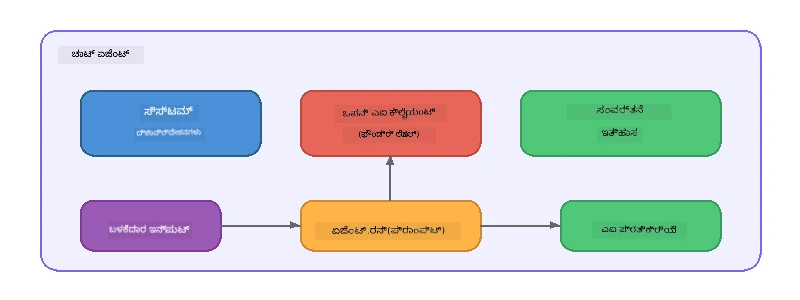

# ಭಾಗ 5: ಏಜೆಂಟ್ ಫ್ರೇಮ್ವರ್ಕ್ನೊಂದಿಗೆ AI ಏಜೆಂಟ್ಗಳನ್ನು ನಿರ್ಮಿಸುವುದು

> **ಗುರಿ:** Foundry Local ಮೂಲಕ ಸ್ಥಳೀಯ ಮಾದರಿಯನ್ನು ಬಳಸಿಕೊಂಡು ಸ್ಥಿರ ನಿರ್ದೇಶನಗಳು ಮತ್ತು ನಿವ್ದಿಷ್ಟ ವ್ಯಕ್ತಿತ್ವ ಹೊಂದಿರುವ ನಿಮ್ಮ ಮೊದಲ AI ಏಜೆಂಟ್ ಅನ್ನು ನಿರ್ಮಿಸಿ.

## AI ಏಜೆಂಟ್ ಎಂದರೇನು?

AI ಏಜೆಂಟ್ ಒಂದು ಭಾಷಾ ಮಾದರಿಯನ್ನು **ಸಿಸ್ಟಮ್ ನಿರ್ದೇಶನಗಳು** ಜೊತೆ ಗೂಡಿಸುತ್ತದೆ, ಇದು ಅದರ ವರ್ತನೆ, ವ್ಯಕ್ತಿತ್ವ ಮತ್ತು ನಿರ್ಬಂಧಗಳನ್ನು ನಿರ್ಧರಿಸುತ್ತದೆ. ಏಜೆಂಟ್ ಒೕಂದು ಸಂವಾದ ಪೂರ್ಣಗೊಳಿಸುವ ಕರೆ ಗೆ ಬದಲಿ ಈ ಕೆಳಕಂಡವುಗಳನ್ನು ಒದಗಿಸುತ್ತದೆ:

- **ವ್ಯಕ್ತಿತ್ವ** - ಸತತ ಗುರುತು ("ನೀವು ಸಹಾಯಕರ ಕೋಡ್ ವಿಮರ್ಶಕ")
- **ಸ್ಮರಣೆ** - ಸಂಭಾಷಣಾ ಇತಿಹಾಸ ಟರ್ನ್‌ಗಳ ನಡುವೆ
- **ವಿಶೇಷೀಕರಣ** - ಚೆನ್ನಾಗಿ ರಚಿಸಲಾದ ನಿರ್ದೇಶನಗಳ ಮೂಲಕ ಪ್ರೇರಿತ ಗಮನಹರಿಸುವ ವರ್ತನೆ



---

## ಮೈಕ್ರೋಸಾಫ್ಟ್ ಏಜೆಂಟ್ ಫ್ರೇಮ್ವರ್ಕ್

**Microsoft Agent Framework** (AGF) ವੱਖಿ ಮಾದರಿ ಬ್ಯಾಕ್ಎಂಡ್ಗಳಲ್ಲಿ ಕೆಲಸ ಮಾಡುವ ಸ್ಟಾನ್ಡರ್ಡ್ ಏಜೆಂಟ್ ಅಬ್ಸ್ಟ್ರಾಕ್ಷನ್ ಅನ್ನು ಒದಗಿಸುತ್ತದೆ. ಈ ಕಾರ್ಯಾಗಾರದಲ್ಲಿ ನಾವು ಇದನ್ನು Foundry Local ನೊಂದಿಗೆ ಜೋಡಿಸಿ ಎಲ್ಲವೂ ನಿಮ್ಮ ಯಂತ್ರದಲ್ಲಿ ಪ್ರಸಾರವಾಗುತ್ತದೆ - ಯಾವುದೇ ಕ್ಲೌಡ್ ಅಗತ್ಯವಿಲ್ಲ.

| ಕಲ್ಪನೆ | ವಿವರಣೆ |
|---------|-------------|
| `FoundryLocalClient` | ಪೈಥಾನ್: ಸರ್ವಿಸ್ ಆರಂಭ, ಮಾದರಿ ಡೌನ್‌ಲೋಡ್/ಲೋಡ್, ಮತ್ತು ಏಜೆಂಟ್ ಗಳು ರಚಿಸುವುದನ್ನು ನಿರ್ವಹಿಸುತ್ತದೆ |
| `client.as_agent()` | ಪೈಥಾನ್: Foundry Local ಕ್ಲೈಂಟ್‌ನಿಂದ ಏಜೆಂಟ್ ಅನ್ನು ರಚಿಸುತ್ತದೆ |
| `AsAIAgent()` | C#: `ChatClient` ಮೇಲೆ ವಿಸ್ತರಣೆ ವಿಧಾನ - `AIAgent` ರಚಿಸುತ್ತದೆ |
| `instructions` | ಸಿಸ್ಟಮ್ ಪ್ರಾಂಪ್ಟ್, ಏಜೆಂಟ್ ಅವರ ವರ್ತನೆಯನ್ನು ರೂಪಿಸುತ್ತದೆ |
| `name` | ಮಾನವ-ಓದುಗೊಳ್ಳಬಹುದಾದ ಲೇಬಲ್, ಬಹು-ಏಜೆಂಟ್ ಸನ್ನಿವೇಶಗಳಲ್ಲಿ ಉಪಯುಕ್ತ |
| `agent.run(prompt)` / `RunAsync()` | ಬಳಕೆದಾರ ಸಂದೇಶವನ್ನು ಕಳುಹಿಸಿ ಏಜೆಂಟ್ ಪ್ರತಿಕ್ರಿಯೆಯನ್ನು ಪಡೆದಿಡುತ್ತದೆ |

> **ಸೂಚನೆ:** ಏಜೆಂಟ್ ಫ್ರೇಮ್ವರ್ಕ್ಗೆ ಪೈಥಾನ್ ಮತ್ತು .NET SDKಗಳು ಇವೆ. ಜಾವಾಸ್ಕ್ರಿಪ್ಟ್ ಬಳಕೆಗೆ, ನಾವು OpenAI SDK ನೇರವಾಗಿ ಬಳಸಿ ಅದೇ ಮಾದರಿಯನ್ನು ಅನುಸರಿಸುವ ಲಘು `ChatAgent` ಕ್ಲಾಸ್ ಅನ್ನು ಜಾರಿಗೊಳಿಸುತ್ತೇವೆ.

---

## ಅಭ್ಯಾಸಗಳು

### ಅಭ್ಯಾಸ 1 - ಏಜೆಂಟ್ ಮಾದರಿಯನ್ನು ಅರ್ಥಮಾಡಿಕೊಳ್ಳಿ

ಕೋಡ್ ಬರೆಯುವ ಮೊದಲು, ಏಜೆಂಟ್ ಮುಖ್ಯ ಘಟಕಗಳನ್ನು ಅಧ್ಯಯನ ಮಾಡಿ:

1. **ಮಾದರಿ ಕ್ಲೈಂಟ್** - Foundry Local ನ OpenAI-ಅನುರೂಪ API ಗೆ ಸಂಪರ್ಕಿಸುತ್ತದೆ
2. **ಸಿಸ್ಟಮ್ ನಿರ್ದೇಶನಗಳು** - "ವ್ಯಕ್ತಿತ್ವ" ಪ್ರಾಂಪ್ಟ್
3. **ರನ್ ಲೂಪ್** - ಬಳಕೆದಾರ ಇನ್‌ಪುಟ್ ಕಳುಹಿಸಿ, ಔಟ್‌ಪುಟ್ ಸ್ವೀಕರಿಸಿ

> **ವಿಚಾರಿಸಿ:** ಸಿಸ್ಟಮ್ ನಿರ್ದೇಶನಗಳು ಸಾಮಾನ್ಯ ಬಳಕೆದಾರ ಸಂದೇಶದಂತೆ ಏನು ಭಿನ್ನ? ಅವುಗಳನ್ನು ಬದಲಾಯಿಸಿದರೆ ಏನು ಸಂಭವಿಸುತ್ತದೆ?

---

### ಅಭ್ಯಾಸ 2 - ಸಿಂಗಲ್-ಏಜೆಂಟ್ ಉದಾಹರಣೆ ಚಾಲನೆ

<details>
<summary><strong>🐍 Python</strong></summary>

**ಮುನ್ನಡೆಗಳು:**
```bash
cd python
python -m venv venv

# ವಿಂಡೋಸ್ (ಪವರ್‌ಶೆಲ್):
venv\Scripts\Activate.ps1
# ಮ್ಯಾಕ್‌ಒಎಸ್:
source venv/bin/activate

pip install -r requirements.txt
```

**ಚಾಲನೆ:**
```bash
python foundry-local-with-agf.py
```

**ಕೋಡ್ ವಾಕ್ತ್ರೂ (python/foundry-local-with-agf.py):**

```python
import asyncio
from agent_framework_foundry_local import FoundryLocalClient

async def main():
    alias = "phi-4-mini"

    # ಫೌಂಡ್ರಿಲೋಕಲ್‌ಕ್ಲಯಿಂಟ್ ಸೇವೆ ಪ್ರಾರಂಭ, ಮಾದರಿ ಡೌನ್‌ಲೋಡ್ ಮತ್ತು ಲೋಡ್‌ಕ್ರಿಯೆಯನ್ನು ನಿರ್ವಹಿಸುತ್ತದೆ
    client = FoundryLocalClient(model_id=alias)
    print(f"Client Model ID: {client.model_id}")

    # ಸಿಸ್ಟಮ್ ಸೂಚನೆಗಳೊಂದಿಗೆ ಏಜೆಂಟ್ ಅನ್ನು ರಚಿಸಿ
    agent = client.as_agent(
        name="Joker",
        instructions="You are good at telling jokes.",
    )

    # ನಾನ್-ಸ್ಟ್ರೀಮಿಂಗ್: ಸಂಪೂರ್ಣ ಪ್ರತಿಕ್ರಿಯೆಯನ್ನು ಒಮ್ಮೆಗೂತು ಪಡೆಯಿರಿ
    result = await agent.run("Tell me a joke about a pirate.")
    print(f"Agent: {result}")

    # ಸ್ಟ್ರೀಮಿಂಗ್: ಫಲಿತಾಂಶಗಳನ್ನು ಉತ್ಪಾದನೆಯಾಗುವಂತೆ ಪಡೆಯಿರಿ
    async for chunk in agent.run("Tell me another joke.", stream=True):
        if chunk.text:
            print(chunk.text, end="", flush=True)

asyncio.run(main())
```

**ಮುಖ್ಯ ಅಂಶಗಳು:**
- `FoundryLocalClient(model_id=alias)` ಸರ್ವಿಸ್ ಪ್ರಾರಂಭ, ಡೌನ್‌ಲೋಡ್ ಮತ್ತು ಮಾದರಿ ಲೋಡ್ ಅನ್ನು ಒಂದು ಹಂತದಲ್ಲಿ ನಿಭಾಯಿಸುತ್ತದೆ
- `client.as_agent()` ಸಿಸ್ಟಮ್ ನಿರ್ದೇಶನಗಳು ಮತ್ತು ಹೆಸರಿನೊಂದಿಗೆ ಏಜೆಂಟ್ ರಚಿಸುತ್ತದೆ
- `agent.run()` ಸ್ಟ್ರೀಮಿಂಗ್ ಮತ್ತು ನಾನ್-ಸ್ಟ್ರೀಮಿಂಗ್ ಎರಡೂ ಮೋಡ್‌ಗಳನ್ನು ಬೆಂಬಲಿಸುತ್ತದೆ
- `pip install agent-framework-foundry-local --pre` ಮೂಲಕ ಇನ್ಸ್ಟಾಲ್ ಮಾಡಿಕೊಳ್ಳಿ

</details>

<details>
<summary><strong>📦 JavaScript</strong></summary>

**ಮುನ್ನಡೆಗಳು:**
```bash
cd javascript
npm install
```

**ಚಾಲನೆ:**
```bash
node foundry-local-with-agent.mjs
```

**ಕೋಡ್ ವಾಕ್ತ್ರೂ (javascript/foundry-local-with-agent.mjs):**

```javascript
import { OpenAI } from "openai";
import { FoundryLocalManager } from "foundry-local-sdk";

class ChatAgent {
  constructor({ client, modelId, instructions, name }) {
    this.client = client;
    this.modelId = modelId;
    this.instructions = instructions;
    this.name = name;
    this.history = [];
  }

  async run(userMessage) {
    const messages = [
      { role: "system", content: this.instructions },
      ...this.history,
      { role: "user", content: userMessage },
    ];
    const response = await this.client.chat.completions.create({
      model: this.modelId,
      messages,
    });
    const assistantMessage = response.choices[0].message.content;

    // ಬಹು-ಬಾರಿ ಸಂವಾದಗಳಿಗಾಗಿ ಸಂಭಾಷಣೆ ಇತಿಹಾಸವನ್ನು ನಿಭಾಯಿಸಿ
    this.history.push({ role: "user", content: userMessage });
    this.history.push({ role: "assistant", content: assistantMessage });
    return { text: assistantMessage };
  }
}

async function main() {
  FoundryLocalManager.create({ appName: "FoundryLocalWorkshop" });
  const manager = FoundryLocalManager.instance;
  await manager.startWebService();

  const catalog = manager.catalog;
  const model = await catalog.getModel("phi-3.5-mini");
  if (!model.isCached) {
    console.log("Downloading model: phi-3.5-mini...");
    await model.download();
  }
  await model.load();

  const client = new OpenAI({
    baseURL: manager.urls[0] + "/v1",
    apiKey: "foundry-local",
  });

  const agent = new ChatAgent({
    client,
    modelId: model.id,
    instructions: "You are good at telling jokes.",
    name: "Joker",
  });

  const result = await agent.run("Tell me a joke about a pirate.");
  console.log(result.text);
}

main();
```

**ಮುಖ್ಯ ಅಂಶಗಳು:**
- ಜಾವಾಸ್ಕ್ರಿಪ್ಟ್ ತನ್ನದೇ ಆದ `ChatAgent` ಕ್ಲಾಸ್ ಅನ್ನು ನಿರ್ಮಿಸಿ ಪೈಥಾನ್ AGF ಮಾದರಿಯನ್ನು ನಕಲಿಸುತ್ತಿದೆ
- `this.history` ಬಹು-ಟರ್ನ್ ಬೆಂಬಲಕ್ಕೆ ಸಂಭಾಷಣಾ ತಿರುವುಗಳನ್ನು ಸಂಗ್ರಹಿಸುತ್ತದೆ
- ಸ್ಪಷ್ಟವಾಗಿ `startWebService()` → ಕ್ಯಾಶೆ ಪರಿಶೀಲನೆ → `model.download()` → `model.load()` ಮೂಲಕ ಸಂಪೂರ್ಣ ಗೋಚರತೆ

</details>

<details>
<summary><strong>💜 C#</strong></summary>

**ಮುನ್ನಡೆಗಳು:**
```bash
cd csharp
dotnet restore
```

**ಚಾಲನೆ:**
```bash
dotnet run agent
```

**ಕೋಡ್ ವಾಕ್ತ್ರೂ (csharp/SingleAgent.cs):**

```csharp
using Microsoft.AI.Foundry.Local;
using Microsoft.Extensions.Logging.Abstractions;
using Microsoft.Agents.AI;
using OpenAI;
using System.ClientModel;

// 1. Start Foundry Local and load a model
var alias = "phi-3.5-mini";
await FoundryLocalManager.CreateAsync(
    new Configuration
    {
        AppName = "FoundryLocalSamples",
        Web = new Configuration.WebService { Urls = "http://127.0.0.1:0" }
    }, NullLogger.Instance, default);
var manager = FoundryLocalManager.Instance;
await manager.StartWebServiceAsync(default);

var catalog = await manager.GetCatalogAsync(default);
var model = await catalog.GetModelAsync(alias, default);

var isCached = await model.IsCachedAsync(default);
if (!isCached)
{
    Console.WriteLine($"Downloading model: {alias}...");
    await model.DownloadAsync(null, default);
}
await model.LoadAsync(default);

var key = new ApiKeyCredential("foundry-local");
var client = new OpenAIClient(key, new OpenAIClientOptions
{
    Endpoint = new Uri(manager.Urls[0] + "/v1")
});

// 2. Create an AIAgent using the Agent Framework extension method
AIAgent joker = client
    .GetChatClient(model.Id)
    .AsAIAgent(
        instructions: "You are good at telling jokes. Keep your jokes short and family-friendly.",
        name: "Joker"
    );

// 3. Run the agent (non-streaming)
var response = await joker.RunAsync("Tell me a joke about a pirate.");
Console.WriteLine($"Joker: {response}");

// 4. Run with streaming
await foreach (var update in joker.RunStreamingAsync("Tell me another joke."))
{
    Console.Write(update);
}
```

**ಮುಖ್ಯ ಅಂಶಗಳು:**
- `AsAIAgent()` `Microsoft.Agents.AI.OpenAI` ನಿಂದ ವಿಸ್ತರಣೆ ವಿಧಾನ - ಕಸ್ಟಮ್ `ChatAgent` ಕ್ಲಾಸ್ ಅಗತ್ಯವಿಲ್ಲ
- `RunAsync()` ಸಂಪೂರ್ಣ ಪ್ರತಿಕ್ರಿಯೆ ನೀಡುತ್ತದೆ; `RunStreamingAsync()` ಟೋಕೆನ್‌ಗಳ ಪ್ರತಿ ಪ್ರತಿ ಸ್ಟ್ರೀಮ್ ಮಾಡುತ್ತದೆ
- `dotnet add package Microsoft.Agents.AI.OpenAI --version 1.0.0-rc3` ಮೂಲಕ ಇನ್ಸ್ಟಾಲ್ ಮಾಡಿ

</details>

---

### ಅಭ್ಯಾಸ 3 - ವ್ಯಕ್ತಿತ್ವವನ್ನು ಬದಲಿಸಿ

ಏಜೆಂಟ್‌ನ `instructions` ಬದಲಾಯಿಸಿ ಬೇರೆ ವ್ಯಕ್ತಿತ್ವವನ್ನು ಸೃಷ್ಟಿಸಿ. ಪ್ರತಿಯೊಂದನ್ನು ಪ್ರಯತ್ನಿಸಿ ಮತ್ತು ಔಟ್‌ಪುಟ್‌ನಲ್ಲಿ ವ್ಯತ್ಯಾಸಗಳನ್ನು ಗಮನಿಸಿ:

| ವ್ಯಕ್ತಿತ್ವ | ನಿರ್ದೇಶನಗಳು |
|---------|-------------|
| ಕೋಡ್ ವಿಮರ್ಶಕ | `"ನೀವು ಪರಿಣಾಮ, ಓದುಗತ್ವ ಮತ್ತು ಸರಿಯಾದತೆಯ ಮೇಲೆ ಕೆಂದ್ರಿತವಾಗಿರುವ ನಿಪುಣ ಕೋಡ್ ವಿಮರ್ಶಕರಾಗಿದ್ದೀರಿ."` |
| ಪ್ರವಾಸ ಮಾರ್ಗದರ್ಶಕ | `"ನೀವು ಸ್ನೇಹಪರ ಪ್ರವಾಸ ಮಾರ್ಗದರ್ಶಕರಾಗಿದ್ದು, ಗಮ್ಯಸ್ಥಾನಗಳು, ಚಟುವಟಿಕೆಗಳು ಮತ್ತು ಸ್ಥಳೀಯ ಆಹಾರಕ್ಕೆ ವೈಯಕ್ತಿಕ ಶಿಫಾರಸುಗಳನ್ನು ನೀಡುತ್ತೀರಿ."` |
| ಸೊಕ್ರಟಿಕ್ ಗುರು | `"ನೀವು ಸೊಕ್ರಟಿಕ್ ಗುರು, ನೇರ ಉತ್ತರಗಳನ್ನು ನೀಡುವುದಿಲ್ಲ - ಬದಲಾಗಿ ವಿದ್ಯಾರ್ಥಿಯನ್ನು ಪರಾಮರ್ಶಕರ ಪ್ರಶ್ನೆಗಳ ಮೂಲಕ ಮಾರ್ಗದರ್ಶನ ಮಾಡುತ್ತೀರಿ."` |
| ತಾಂತ್ರಿಕ ಲೇಖಕ | `"ನೀವು ತಾಂತ್ರಿಕ ಲೇಖಕರಾಗಿದ್ದು, ವಿವರಗಳನ್ನು ಸ್ಪಷ್ಟವಾಗಿ ಮತ್ತು ಸಂಕ್ಷಿಪ್ತವಾಗಿ ವಿವರಿಸುತ್ತೀರಿ. ಉದಾಹರಣೆಗಳನ್ನು ಬಳಸಿ. ಜಾರ್ಗನ್ ಅನ್ನು ತಪ್ಪಿಸಿ."` |

**ಪ್ರಯತ್ನಿಸಿ:**
1. ಮೇಲಿನ ಪಟ್ಟಿಯಿಂದ ವ್ಯಕ್ತಿತ್ವವನ್ನು ಆರಿಸಿಕೊಳ್ಳಿ
2. ಕೋಡ್‌ನ `instructions` ಸರಣಿಯನ್ನು ಬದಲಾಯಿಸಿ
3. ಬಳಕೆದಾರ ಪ್ರಾಂಪ್ಟ್ ಅನ್ನು ಆ ಅನುಗುಣವಾಗಿ ಹೊಂದಿಸಿ (ಉದಾ: ಕೋಡ್ ವಿಮರ್ಶಕನನ್ನು ಕರೆಯಿರಿ)
4. ಉದಾಹರಣೆಯನ್ನು ಮತ್ತೆ ರನ್ ಮಾಡಿ ಮತ್ತು ಔಟ್‌ಪುಟ್ ಅನ್ನು ಹೋಲಿಸಿ

> **ಸೂಪಾರ:** ಏಜೆಂಟ್ ಗುಣಮಟ್ಟವು ಹೆಚ್ಚು ಸಮಯದಲ್ಲಿ ನಿರ್ದೇಶನಗಳ ಮೇಲೆ ಆಧಾರಿತವಿದೆ. ಸ್ಪಷ್ಟ, ಸೌಕರ್ಯಯುತ ನಿರ್ದೇಶನಗಳು ಅಸ್ಪಷ್ಟದಿಗಿಂತ ಉತ್ತಮ ಫಲಿತಾಂಶ ನೀಡುತ್ತವೆ.

---

### ಅಭ್ಯಾಸ 4 - ಬಹು-ಟರ್ನ್ ಸಂಭಾಷಣೆ ಸೇರಿಸು

ಉದಾಹರಣೆಯನ್ನು ವಿಸ್ತರಿಸಿ ಬಹು-ಟರ್ನ್ ಚಾಟ್ ಲೂಪ್ ನೆರವಾಗಿಸಲು, ನೀವು ಏಜೆಂಟ್ ಜೊತೆಗೆ ಅಧಿಕ-ಮಾತುಕತೆ ಸಂಭಾಷಣೆ ನಡೆಸಬಹುದು.

<details>
<summary><strong>🐍 Python - ಬಹು-ಟರ್ನ್ ಲೂಪ್</strong></summary>

```python
import asyncio
from agent_framework_foundry_local import FoundryLocalClient

async def main():
    client = FoundryLocalClient(model_id="phi-4-mini")

    agent = client.as_agent(
        name="Assistant",
        instructions="You are a helpful assistant.",
    )

    print("Chat with the agent (type 'quit' to exit):\n")
    while True:
        user_input = input("You: ")
        if user_input.strip().lower() in ("quit", "exit"):
            break
        result = await agent.run(user_input)
        print(f"Agent: {result}\n")

asyncio.run(main())
```

</details>

<details>
<summary><strong>📦 JavaScript - ಬಹು-ಟರ್ನ್ ಲೂಪ್</strong></summary>

```javascript
import { OpenAI } from "openai";
import { FoundryLocalManager } from "foundry-local-sdk";
import * as readline from "node:readline/promises";

// (ವ್ಯಾಯಾಮ 2 ರಿಂದ ChatAgent ವರ್ಗವನ್ನು ಮರುಬಳಕೆ ಮಾಡುವುದು)

async function main() {
  FoundryLocalManager.create({ appName: "FoundryLocalWorkshop" });
  const manager = FoundryLocalManager.instance;
  await manager.startWebService();

  const catalog = manager.catalog;
  const model = await catalog.getModel("phi-3.5-mini");
  if (!model.isCached) {
    console.log("Downloading model: phi-3.5-mini...");
    await model.download();
  }
  await model.load();

  const client = new OpenAI({
    baseURL: manager.urls[0] + "/v1",
    apiKey: "foundry-local",
  });

  const agent = new ChatAgent({
    client,
    modelId: model.id,
    instructions: "You are a helpful assistant.",
    name: "Assistant",
  });

  const rl = readline.createInterface({
    input: process.stdin,
    output: process.stdout,
  });

  console.log("Chat with the agent (type 'quit' to exit):\n");
  while (true) {
    const userInput = await rl.question("You: ");
    if (["quit", "exit"].includes(userInput.trim().toLowerCase())) break;
    const result = await agent.run(userInput);
    console.log(`Agent: ${result.text}\n`);
  }
  rl.close();
}

main();
```

</details>

<details>
<summary><strong>💜 C# - ಬಹು-ಟರ್ನ್ ಲೂಪ್</strong></summary>

```csharp
using Microsoft.AI.Foundry.Local;
using Microsoft.Extensions.Logging.Abstractions;
using Microsoft.Agents.AI;
using OpenAI;
using System.ClientModel;

var alias = "phi-3.5-mini";
var config = new Configuration
{
    AppName = "FoundryLocalSamples",
    Web = new Configuration.WebService { Urls = "http://127.0.0.1:0" }
};
await FoundryLocalManager.CreateAsync(config, NullLogger.Instance, default);
var manager = FoundryLocalManager.Instance;
await manager.StartWebServiceAsync(default);

var catalog = await manager.GetCatalogAsync(default);
var model = await catalog.GetModelAsync(alias, default);

var isCached = await model.IsCachedAsync(default);
if (!isCached)
{
    Console.WriteLine($"Downloading model: {alias}...");
    await model.DownloadAsync(null, default);
}
await model.LoadAsync(default);

var key = new ApiKeyCredential("foundry-local");
var client = new OpenAIClient(key, new OpenAIClientOptions
{
    Endpoint = new Uri(manager.Urls[0] + "/v1")
});

AIAgent agent = client
    .GetChatClient(model.Id)
    .AsAIAgent(
        instructions: "You are a helpful assistant.",
        name: "Assistant"
    );

Console.WriteLine("Chat with the agent (type 'quit' to exit):\n");
while (true)
{
    Console.Write("You: ");
    var userInput = Console.ReadLine();
    if (string.IsNullOrWhiteSpace(userInput) ||
        userInput.Equals("quit", StringComparison.OrdinalIgnoreCase) ||
        userInput.Equals("exit", StringComparison.OrdinalIgnoreCase))
        break;

    var result = await agent.RunAsync(userInput);
    Console.WriteLine($"Agent: {result}\n");
}
```

</details>

ಏಜೆಂಟ್ ಹಿಂದೆ ಆಗಿರುವ ಟರ್ನ್‌ಗಳನ್ನು ಹೇಗೆ ನೆನಸಿಕೊಳ್ಳುತ್ತದೆ ನೋಡಿ - ಅನುಸರಿಸುವ ಪ್ರಶ್ನೆ ಕೇಳಿ ಮತ್ತು ಸನ್ನಿವೇಶವನ್ನು ಮುಂದುವರೆಸಿ.

---

### ಅಭ್ಯಾಸ 5 - ರಚಿಸಲಾದ ಔಟ್‌ಪುಟ್

ಏಜೆಂಟ್ ಅನ್ನು ನಿರ್ದಿಷ್ಟ ಸ್ವರೂಪದಲ್ಲಿ ಪ್ರತಿಕ್ರಿಯಿಸುವಂತೆ ಸೂಚಿಸಿ (ಉದಾ: JSON) ಮತ್ತು ಫಲಿತಾಂಶವನ್ನು ವಿಶ್ಲೇಷಿಸಿ:

<details>
<summary><strong>🐍 Python - JSON ಔಟ್‌ಪುಟ್</strong></summary>

```python
import asyncio
import json
from agent_framework_foundry_local import FoundryLocalClient

async def main():
    client = FoundryLocalClient(model_id="phi-4-mini")

    agent = client.as_agent(
        name="SentimentAnalyzer",
        instructions=(
            "You are a sentiment analysis agent. "
            "For every user message, respond ONLY with valid JSON in this format: "
            '{"sentiment": "positive|negative|neutral", "confidence": 0.0-1.0, "summary": "brief reason"}'
        ),
    )

    result = await agent.run("I absolutely loved the new restaurant downtown!")
    print("Raw:", result)

    try:
        parsed = json.loads(str(result))
        print(f"Sentiment: {parsed['sentiment']} (confidence: {parsed['confidence']})")
    except json.JSONDecodeError:
        print("Agent did not return valid JSON - try refining the instructions.")

asyncio.run(main())
```

</details>

<details>
<summary><strong>💜 C# - JSON ಔಟ್‌ಪುಟ್</strong></summary>

```csharp
using System.Text.Json;

AIAgent analyzer = chatClient.AsAIAgent(
    name: "SentimentAnalyzer",
    instructions:
        "You are a sentiment analysis agent. " +
        "For every user message, respond ONLY with valid JSON in this format: " +
        "{\"sentiment\": \"positive|negative|neutral\", \"confidence\": 0.0-1.0, \"summary\": \"brief reason\"}"
);

var response = await analyzer.RunAsync("I absolutely loved the new restaurant downtown!");
Console.WriteLine($"Raw: {response}");

try
{
    var parsed = JsonSerializer.Deserialize<JsonElement>(response.ToString());
    Console.WriteLine($"Sentiment: {parsed.GetProperty("sentiment")} " +
                      $"(confidence: {parsed.GetProperty("confidence")})");
}
catch (JsonException)
{
    Console.WriteLine("Agent did not return valid JSON - try refining the instructions.");
}
```

</details>

> **ಸೂಚನೆ:** ಚಿಕ್ಕ ಸ್ಥಳೀಯ ಮಾದರಿಗಳು ಸದಾ ನಿಖರವಾದ JSON ಉತ್ಪತ್ತಿ ಮಾಡಲಾರವು. ನಿರ್ದೇಶನಗಳಲ್ಲಿ ಉದಾಹರಣೆ ಸೇರಿಸುವುದರಿಂದ ಮತ್ತು ನಿರೀಕ್ಷಿತ ಸ್ವರೂಪವನ್ನು ಸ್ಪಷ್ಟವಾಗಿ ತಿಳಿಸುವುದರಿಂದ ವಿಶ್ವಾಸಾರ್ಹತೆಯನ್ನು ವೃದ್ಧಿಸಬಹುದು.

---

## ಪ್ರಮುಖ ಅಂಶಗಳು

| ಕಲ್ಪನೆ | ನೀವು ಕಲಿತದ್ದು |
|---------|-----------------|
| ಏಜೆಂಟ್ vs. ನೇರ LLM ಕರೆ | ಏಜೆಂಟ್ ಮಾದರಿಯನ್ನು ನಿರ್ದೇಶನಗಳು ಮತ್ತು ಸ್ಮರಣೆಯೊಂದಿಗೆ ಲತೆದ ಮಾಡುತ್ತದೆ |
| ಸಿಸ್ಟಮ್ ನಿರ್ದೇಶನಗಳು | ಏಜೆಂಟ್ ವಿರ್ತನೆ ನಿಯಂತ್ರಣಕ್ಕೆ ಅತ್ಯಂತ ಪ್ರಮುಖ рычаг |
| ಬಹು-ಟರ್ನ್ ಸಂಭಾಷಣೆ | ಏಜೆಂಟ್‌ಗಳು ಹಲವಾರು ಬಳಕೆದಾರ ಸಂವಹನಗಳ ನಡುವೆ ಸನ್ನಿವೇಶವನ್ನು ಕಾಪಾಡಬಹುದು |
| ರಚಿಸಲಾದ ಔಟ್‌ಪುಟ್ | ನಿರ್ದೇಶನಗಳು ಔಟ್‌ಪುಟ್ ಸ್ವರೂಪವನ್ನು ಜಾರಿಗೊಳಿಸಬಹುದು (JSON, ಮಾರ್ಕ್‌ಡೌನ್ ಇತ್ಯಾದಿ) |
| ಸ್ಥಳೀಯ ಕಾರ್ಯಾಚರಣೆ | ಎಲ್ಲವೂ சாதನದಲ್ಲಿ Foundry Local ಮೂಲಕ ನಡೆಯುತ್ತದೆ - ಯಾವುದೇ ಕ್ಲೌಡ್ ಅಗತ್ಯವಿಲ್ಲ |

---

## ಮುಂದಿನ ಹಂತಗಳು

**[ಭಾಗ 6: ಬಹು-ಏಜೆಂಟ್ ವರ್ಕ್‌ಫ್ಲೋಗಳು](part6-multi-agent-workflows.md)** ನಲ್ಲಿ, ನೀವು ಬಹು ಏಜೆಂಟ್‌ಗಳನ್ನು ಒಟ್ಟಿಗೆ ಸಂಯೋಜಿಸಿ ಪ್ರತ್ಯೇಕ ಪಾತ್ರಗಳುಳ್ಳ ಸಹಕಾರಿಯ ಮಾರ್ಗಸೂಚಿಯನ್ನು ರಚಿಸುವಿರಾ.