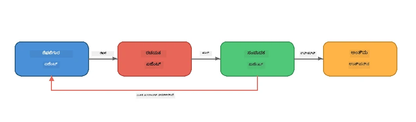
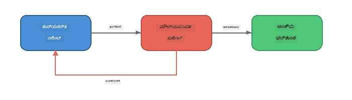
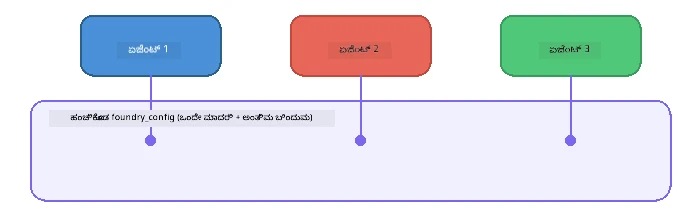

# ಭಾಗ 6: ಬಹು-ಏಜೆಂಟ್ ಕಾರ್ಯವಾಹಿಗಳು

> **ಗೋಶ್ಠಿ:** ವಿವಿಧ ಪರಿಣತಿಯಾಗಿರುವ ಏಜೆಂಟ್‌ಗಳನ್ನು ಸಂಯೋಜಿತ ಪೈಪ್ಲೈನ್‌ಗಳಾಗಿ ಒಟ್ಟುಗುಣಿಸಿ, ಸಹಕರಿಸುತ್ತಿರುವ ಏಜೆಂಟ್‌ಗಳ ನಡುವೆ ಸಂಕೀರ್ಣ ಕಾರ್ಯಗಳನ್ನು ಹಂಚಿ - ಎಲ್ಲವೂ Foundry Local ನಲ್ಲಿ ಸ್ಥಳೀಯವಾಗಿ ಕೆಲಸ ಮಾಡುತ್ತಿವೆ.

## ಏಕೆ ಬಹು-ಏಜೆಂಟ್?

ಒಂದು ಏಜೆಂಟ್ ಅನೇಕ ಕಾರ್ಯಗಳನ್ನು ನಿರ್ವಹಿಸಬಹುದು, ಆದರೆ ಸಂಕೀರ್ಣ ಕಾರ್ಯವಾಹಿಗಳು **ವಿಶೇಷೀಕರಣ**ದಿಂದ ಲಾಭ ಪಡೆಯುತ್ತವೆ. ಒಂದು ಏಜೆಂಟ್ ಒಂದೇ ಸಮಯದಲ್ಲಿ ಸಂಶೋಧನೆ, ಬರವಣಿಗೆ ಮತ್ತು ಸಂಪಾದನೆ ಮಾಡಲು ಪ್ರಯತ್ನಿಸುವ ಬದಲು, ನೀವು ಕೆಲಸವನ್ನು ಗಮನಾರ್ಹ ಪಾತ್ರಗಳಲ್ಲಿ ವಿಭಜಿಸುತ್ತೀರಿ:



| ನಕಲಿ | ವಿವರಣೆ |
|---------|-------------|
| **ಕ್ರಮವಾಗಿ** | ಏಜೆಂಟ್ A ಯ output ಏಜೆಂಟ್ B → ಏಜೆಂಟ್ C ಗೆ ಹೋಗುತ್ತದೆ |
| **ಪುನರಾವೃತ್ತಿ ಲೂಪ್** | ಮೌಲ್ಯಮಾಪಕ ಏಜೆಂಟ್ ಕೆಲಸವನ್ನು ಪರಿಷ್ಕರಣೆಗೆ ಹಿಂತಿರುಗಿಸಬಹುದು |
| **ಹಂಚಿಕೊಂಡ ಸੰਦਰಭ** | ಎಲ್ಲಾ ಏಜೆಂಟ್‌ಗಳು ಒಂದೇ ಮಾದರಿ/ಎಂಡ್‌ಪಾಯಿಂಟ್ ಬಳಸುತ್ತವೆ, ಆದರೆ ವಿಭಿನ್ನ ಸೂಚನೆಗಳನ್ನು ಅನುಸರಿಸುತ್ತವೆ |
| **ಪ್ರಕಾರಹೊಂದಿದ output** | ಏಜೆಂಟ್‌ಗಳು ರಚನಾತ್ಮಕ ಫಲಿತಾಂಶಗಳನ್ನು (JSON) ಉತ್ಪಾದಿಸುತ್ತವೆ, ವಿಶ್ವಾಸಾರ್ಹ ಹಸ್ತಾಂತರಗಳಿಗೆ |

---

## ಅಭ್ಯಾಸಗಳು

### ಅಭ್ಯಾಸ 1 - ಬಹು-ಏಜೆಂಟ್ ಪೈಪ್ಲೈನ್ ಅನ್ನು ನಡೆಸಿ

ಈ ಕಾರ್ಯಾಗಾರವು ಸಂಪೂರ್ಣ ಸಂಶೋಧಕ → ಬರಹಗಾರ → ಸಂಪಾದಕ ಕಾರ್ಯವಾಹಿಯನ್ನು ಒಳಗೊಂಡಿದೆ.

<details>
<summary><strong>🐍 Python</strong></summary>

**ಸೆಟಪ್:**
```bash
cd python
python -m venv venv

# ವಿಂಡೋಸ್ (ಪವರ್‌ಶೆಲ್):
venv\Scripts\Activate.ps1
# ಮ್ಯಾಕ್‌ಒಎಸ್:
source venv/bin/activate

pip install -r requirements.txt
```

**ನಡೆಸುವಿಕೆ:**
```bash
python foundry-local-multi-agent.py
```

**ಏನಾಗುತ್ತದೆ:**
1. **ಸಂಶೋಧಕ** ವಿಷಯವನ್ನು ಸ್ವೀಕರಿಸಿ ಬುಲೆಟ್-ಪಾಯಿಂಟ್ ಸತ್ಯಾಂಶಗಳನ್ನು ಹಿಂತಿರುಗಿಸುತ್ತದೆ
2. **ಬರಹಗಾರ** ಸಂಶೋಧನೆಯನ್ನು ತೆಗೆದುಕೊಂಡು ಒಂದು ಬ್ಲಾಗ್ ಪೋಸ್ಟ್ ಅನ್ನು ಡ್ರಾಫ್ಟ್ ಮಾಡುತ್ತಾನೆ (3-4 ಪ್ಯಾರಾಗ್ರಾಫ್‌ಗಳು)
3. **ಸಂಪಾದಕ** ಲೇಖನದ ಗುಣಮಟ್ಟವನ್ನು ಪರಿಶೀಲಿಸಿ ACCEPT ಅಥವಾ REVISE ಅನ್ನು ಹಿಂತಿರುಗಿಸುತ್ತಾನೆ

</details>

<details>
<summary><strong>📦 JavaScript</strong></summary>

**ಸೆಟಪ್:**
```bash
cd javascript
npm install
```

**ನಡೆಸುವಿಕೆ:**
```bash
node foundry-local-multi-agent.mjs
```

**ಹೀಗೆಯೇ ಮೂರು ಹಂತದ ಪೈಪ್ಲೈನ್** - ಸಂಶોધಕ → ಬರಹಗಾರ → ಸಂಪಾದಕ.

</details>

<details>
<summary><strong>💜 C#</strong></summary>

**ಸೆಟಪ್:**
```bash
cd csharp
dotnet restore
```

**ನಡೆಸುವಿಕೆ:**
```bash
dotnet run multi
```

**ಹೀಗೆಯೇ ಮೂರು ಹಂತದ ಪೈಪ್ಲೈನ್** - ಸಂಶೋಧಕ → ಬರಹಗಾರ → ಸಂಪಾದಕ.

</details>

---

### ಅಭ್ಯಾಸ 2 - ಪೈಪ್ಲೈನಿನ ರಚನೆ

ಏಜೆಂಟ್‌ಗಳನ್ನು ಹೇಗೆ ವ್ಯಾಖ್ಯಾನಿಸಿ ಮತ್ತು ಸಂಪರ್ಕಿಸಿದ್ದು ನೋಡಿ:

**1. ಹಂಚಿಕೊಂಡ ಮಾದರಿ ಕ್ಲೈಯಂಟ್**

ಎಲ್ಲಾ ಏಜೆಂಟ್‌ಗಳು ಒಂದೇ Foundry Local ಮಾದರಿಯನ್ನು ಹಂಚಿಕೊಳ್ಳುತ್ತವೆ:

```python
# Python - FoundryLocalClient ಎಲ್ಲವನ್ನೂ ನಿರ್ವಹಿಸುತ್ತದೆ
from agent_framework_foundry_local import FoundryLocalClient

client = FoundryLocalClient(model_id="phi-3.5-mini")
```

```javascript
// ಜಾವಾಸ್ಕ್ರಿಪ್ಟ್ - ಫೌಂಡ್ರಿ ಲೊಕಲ್‌ ಕಡೆಗೆ ಸೂಚಿಸಿರುವ OpenAI SDK
const client = new OpenAI({
  baseURL: manager.urls[0] + "/v1",
  apiKey: "foundry-local",
});
```

```csharp
// C# - OpenAIClient pointed at Foundry Local
var key = new ApiKeyCredential("foundry-local");
var client = new OpenAIClient(key, new OpenAIClientOptions
{
    Endpoint = new Uri(manager.Urls[0] + "/v1")
});
var chatClient = client.GetChatClient(model.Id);
```

**2. ವಿಶೇಷ ಸೂಚನೆಗಳು**

ಪ್ರತಿ ಏಜೆಂಟ್‌ಗೂ ವಿಶಿಷ್ಟ ವ್ಯಕ್ತಿತ್ವವಿದೆ:

| ಏಜೆಂಟ್ | ಸೂಚನೆಗಳು (ಸಾರಾಂಶ) |
|-------|----------------------|
| ಸಂಶೋಧಕ | "ಮುಖ್ಯ ಸತ್ಯಾಂಶಗಳು, ಅಂಕಿಅಂಶಗಳು ಮತ್ತು ಹಿನ್ನೆಲೆ ನೀಡಿ. ಬುಲೆಟ್‌ಪಾಯಿಂಟ್‌ಗಳಾಗಿ ಸಂಘಟಿಸಿ." |
| ಬರಹಗಾರ | "ಸಂಶೋಧನಾ ಟಿಪ್ಪಣಿಗಳಿಂದ ಆಕರ್ಷಕ ಬ್ಲಾಗ್ ಪೋಸ್ಟ್ ಬರೆಯಿರಿ (3-4 ಪ್ಯಾರಾಗ್ರಾಫ್‌ಗಳು). ಸತ್ಯಾಂಶಗಳನ್ನು ಕಲ್ಪಿಸಬೇಡಿ." |
| ಸಂಪಾದಕ | "ಸ್ಪಷ್ಟತೆ, ವ್ಯಾಕರಣ ಮತ್ತು ವಾಸ್ತವಿಕ ಹೊಂದಾಣಿಕೆಗೆ ಪರಿಶೀಲಿಸಿ. ತೀರ್ಮಾನ: ACCEPT ಅಥವಾ REVISE." |

**3. ಏಜೆಂಟ್‌ಗಳ ನಡುವೆ ಡೇಟಾ ಹರಿವು**

```python
# ಹಂತ 1 - ಸಂಶೋಧಕರಿಂದ ಪಡಿತವು ಬರಹಕರ್ತನ ಇನ್‌ಪುಟ್ ಆಗುತ್ತದೆ
research_result = await researcher.run(f"Research: {topic}")

# ಹಂತ 2 - ಬರಹಕರ್ತನಿಂದ ಪಡಿತ ಸಂಪಾದಕರ ಇನ್‌ಪುಟ್ ಆಗುತ್ತದೆ
writer_result = await writer.run(f"Write using:\n{research_result}")

# ಹಂತ 3 - ಸಂಪಾದಕ ಸಂಶೋಧನೆ ಮತ್ತು ಲೇಖನ ಎರಡನ್ನೂ ಪರಿಶೀಲಿಸುತ್ತಾನೆ
editor_result = await editor.run(
    f"Research:\n{research_result}\n\nArticle:\n{writer_result}"
)
```

```csharp
// C# - same pattern, async calls with AIAgent
var researchNotes = await researcher.RunAsync(
    $"Research the following topic and provide key facts:\n{topic}");

var draft = await writer.RunAsync(
    $"Write a blog post based on these research notes:\n\n{researchNotes}");

var verdict = await editor.RunAsync(
    $"Review this article for quality and accuracy.\n\n" +
    $"Research notes:\n{researchNotes}\n\n" +
    $"Article:\n{draft}");
```

> **ಮುಖ್ಯ ಆಲೋಚನೆ:** ಪ್ರತಿ ಏಜೆಂಟ್ ಹಿಂದಿನ ಏಜೆಂಟ್‌ಗಳಿಂದ ಸ೦ಗ್ರಹಿಸಿದ ಸ್ಫೂರ್ತಿದಾಯಕ ಸಬಂಧನೆಯನ್ನು ಸ್ವೀಕರಿಸುತ್ತದೆ. ಸಂಪಾದಕ ಮೂಲ ಸಂಶೋಧನೆ ಮತ್ತು ಡ್ರಾಫ್ಟ್ ಎರಡನ್ನೂ ನೋಡಿ ವಾಸ್ತವಿಕತೆ ಪರಿಶೀಲನೆ ಮಾಡುತ್ತಾನೆ.

---

### ಅಭ್ಯಾಸ 3 - ನಾಲ್ಕನೆ ಏಜೆಂಟ್ ಸೇರಿಸಿ

ಪೈಪ್ಲೈನ್‌ ಅನ್ನು ಹೊಸ ಏಜೆಂಟ್ ಸೇರಿಸುವ ಮೂಲಕ ವಿಸ್ತರಿಸಿ. ನಿಮ್ಮ ಆಯ್ಕೆ ಮಾಡಿ:

| ಏಜೆಂಟ್ | ಉದ್ದೇಶ | ಸೂಚನೆಗಳು |
|-------|---------|-------------|
| **ವಾಸ್ತವ ಪರಿಶೀಲಕ** | ಲೇಖನದ ದಾವೆಗಳು ಸತ್ಯವಾನಿ ಎಂದು ಪರಿಶೀಲಿಸಿ | `"ನೀವು ವಾಸ್ತವಿಕ ದಾವೆಗಳ ಪರಿಶೀಲನೆ ಮಾಡುತ್ತೀರಿ. ಪ್ರತಿ ದಾವೆಗಾಗಿ, ಅದು ಸಂಶೋಧನಾ ಟಿಪ್ಪಣಿಗಳಿಂದ ಬೆಂಬಲಿತವೇ ಎಂದು ಹೇಳಿ. ಪರಿಶೀಲಿತ/ಅಪರಿಚಿತ ಅಂಶಗಳೊಂದಿಗೆ JSON ಅನ್ನು ಹಿಂತಿರುಗಿಸಿ."` |
| **ಶೀರ್ಷಿಕೆ ಬರಹಗಾರ** | ಆಕರ್ಷಕ ಶೀರ್ಷಿಕೆಗಳು ಸೃಷ್ಟಿಸಿ | `"ಲೇಖನಕ್ಕೆ 5 ಶೀರ್ಷಿಕೆ ಆಯ್ಕೆಗಳನ್ನು ಸೃಷ್ಟಿಸಿ. ಶೈಲಿಯನ್ನು ಬದಲಾಯಿಸಿ: ಮಾಹಿತಿ, ಕ್ಲಿಕ್‌ಬೆಟ್, ಪ್ರಶ್ನೆ, ಪಟ್ಟಿ, ಭಾವನಾತ್ಮಕ."` |
| **ಸೋಶಿಯಲ್ ಮೀಡಿಯಾ** | ಪ್ರಚಾರ ಪೋಸ್ಟ್‌ಗಳು ಸೃಷ್ಟಿಸಿ | `"ಈ ಲೇಖನವನ್ನು ಉತ್ತೇಜಿಸುವ 3 ಸೋಶಿಯಲ್ ಮೀಡಿಯಾ ಪೋಸ್ಟ್‌ಗಳನ್ನು ರಚಿಸಿ: ಟ್ವಿಟರ್ (280 ಅಕ್ಷರಗಳು), ಲಿಂಕ್ಡ್ಇನ್ (ವೃತ್ತಿಪರ ಶೈಲಿ), ಇನ್‌ಸ್ಟಾಗ್ರಾಮ್ (ನಿಜವಾದ ಮತ್ತು ಇಮೊಜಿ ಸಲಹೆಗಳೊಂದಿಗೆ)."` |

<details>
<summary><strong>🐍 Python - ಶೀರ್ಷಿಕೆ ಬರಹಗಾರ ಸೇರಿಸುವದು</strong></summary>

```python
headline_agent = client.as_agent(
    name="HeadlineWriter",
    instructions=(
        "You are a headline specialist. Given an article, generate exactly "
        "5 headline options. Vary the style: informative, question-based, "
        "listicle, emotional, and provocative. Return them as a numbered list."
    ),
)

# ಸಂಪಾದಕ ಅಂಗೀಕರಿಸಿದ ನಂತರ, ಶೀర్షಿಕೆಗಳನ್ನು ರಚಿಸಿ
headline_result = await headline_agent.run(
    f"Generate headlines for this article:\n\n{writer_result}"
)
print(f"\n--- Headlines ---\n{headline_result}")
```

</details>

<details>
<summary><strong>📦 JavaScript - ಶೀರ್ಷಿಕೆ ಬರಹಗಾರ ಸೇರಿಸುವದು</strong></summary>

```javascript
const headlineAgent = new ChatAgent({
  client,
  modelId: modelInfo.id,
  instructions:
    "You are a headline specialist. Given an article, generate exactly " +
    "5 headline options. Vary the style: informative, question-based, " +
    "listicle, emotional, and provocative. Return them as a numbered list.",
  name: "HeadlineWriter",
});

const headlineResult = await headlineAgent.run(
  `Generate headlines for this article:\n\n${writerResult.text}`
);
console.log(`\n--- Headlines ---\n${headlineResult.text}`);
```

</details>

<details>
<summary><strong>💜 C# - ಶೀರ್ಷಿಕೆ ಬರಹಗಾರ ಸೇರಿಸುವದು</strong></summary>

```csharp
AIAgent headlineAgent = chatClient.AsAIAgent(
    name: "HeadlineWriter",
    instructions:
        "You are a headline specialist. Given an article, generate exactly " +
        "5 headline options. Vary the style: informative, question-based, " +
        "listicle, emotional, and provocative. Return them as a numbered list."
);

// After the editor accepts, generate headlines
var headlines = await headlineAgent.RunAsync(
    $"Generate headlines for this article:\n\n{draft}");
Console.WriteLine($"\n--- Headlines ---\n{headlines}");
```

</details>

---

### ಅಭ್ಯಾಸ 4 - ನಿಮ್ಮ ಸ್ವಂತ ಕಾರ್ಯವಾಹಿಯನ್ನು ವಿನ್ಯಾಸಗೊಳ್ಳಿ

ಬೇರೆ ಕ್ಷೇತ್ರಕ್ಕೆ ಬಹು-ಏಜೆಂಟ್ ಪೈಪ್ಲೈನ್ ವಿನ್ಯಾಸಮಾಡಿ. ಕೆಲವು ಸಲಹೆಗಳು:

| ಕ್ಷೇತ್ರ | ಏಜೆಂಟ್‌ಗಳು | ಹರಿವು |
|--------|--------|------|
| **ಕೋಡ್ ವಿಮರ್ಶೆ** | ವಿಶ್ಲೇಷಕ → ವಿಮರ್ಶಕ → ಸಾರಾಂಶಕಾರ | ಕೋಡ್ ರಚನೆ ವಿಶ್ಲೇಷಿಸಿ → ಸಮಸ್ಯೆಗಳ ಪರಿಶೀಲನೆ → ಸಾರಾಂಶ ವರದಿ ರಚನೆ |
| **ಗ್ರಾಹಕ ಬೆಂಬಲ** | ವರ್ಗೀಕೃತಕಾರ → ಪ್ರತಿಕ್ರಿಯೆದಾರ → ಗುಣಮಟ್ಟ ಪರಿಶೀಲಕ | ಟಿಕೆಟ್ ವರ್ಗೀಕರಿಸಿ → ಪ್ರತಿಕ್ರಿಯೆ ರೂಪಿಸಿ → ಗುಣಮಟ್ಟ ತಪಾಸಣೆ |
| **ಶಿಕ್ಷಣ** | ಪ್ರಶ್ನೋತ್ತರ ರಚನೆಗಾರ → ವಿದ್ಯಾರ್ಥಿ ಅನುಕ್ರಮಣಿಕೆ → ಮೌಲ್ಯಮಾಪಕ | ಪ್ರಶ್ನೆ ರಚನೆ → ಉತ್ತರಗಳನ್ನು ಅನುಕರಣ ಮಾಡಿ → ಗ್ರೇಡ್ ನೀಡುವದು ಮತ್ತು ವಿವರಿಸುವದು |
| **ಡೇಟಾ ವಿಶ್ಲೇಷಣೆ** | ವಿವರಣೆಗಾರ → ವಿಶ್ಲೇಷಕ → ವರದಿಗಾರ | ಡೇಟಾ ವಿನಂತಿ ಅರ್ಥಮಾಡಿ → ಮಾದರಿ ವಿಶ್ಲೇಷಿಸಿ → ವರದಿ ಬರೆಯಿರಿ |

**ಹಂತಗಳು:**
1. 3 ಅಥವಾ ಹೆಚ್ಚು ಏಜೆಂಟ್‌ಗಳಿಗೆ ವಿಭಿನ್ನ `ಸೂಚನೆಗಳನ್ನು` ವ್ಯಾಖ್ಯಾನಿಸಿ
2. ಡೇಟಾ ಹರಿವನ್ನು ನಿರ್ಧರಿಸಿ - ಪ್ರತಿ ಏಜೆಂಟ್ ಏನು ಸ್ವೀಕರಿಸಿ ಉತ್ಪಾದಿಸುವುದು?
3. ಅಭ್ಯಾಸ 1-3 ನ ಮಾದರಿಗಳನ್ನು ಬಳಸಿ ಪೈಪ್ಲೈನ್ ಅನ್ನು ಜಾರಿಗೊಳಿಸಿ
4. ಒಬ್ಬ ಏಜೆಂಟ್ ಮತ್ತೊಬ್ಬರ ಕೆಲಸವನ್ನು ಮೌಲ್ಯಮಾಪನ ಮಾಡಲು ಪುನರಾವೃತ್ತಿ ಲೂಪ್ ಸೇರಿಸಿ

---

## ಸಂಯೋಜನೆ ಸಣ್ಣ ಮಾದರಿಗಳು

ಬೇರೆ ಯಾವುದೇ ಬಹು-ಏಜೆಂಟ್ ವ್ಯವಸ್ಥೆಗೆ ಅನ್ವಯಿಸುವ ಕೆಲವು ಸಂಯೋಜನೆ ಮಾದರಿಗಳು (ವಿಸ್ತೃತವಾಗಿ [ಭಾಗ 7](part7-zava-creative-writer.md) ನಲ್ಲಿ ತಿಳಿದುಕೊಳ್ಳಿ):

### ಕ್ರಮವಾಗಿ ಪೈಪ್ಲೈನ್


ಪ್ರತಿ ಏಜೆಂಟ್ ಹಿಂದಿನದಾದ output ಅನ್ನು ಪ್ರಕ್ರಿಯೆಗೊಳಿಸುತ್ತದೆ. ಸರಳ ಮತ್ತು ಭವಿಷ್ಯ ನ ತಾಲೂಕಿನು.

### ಪುನರಾವೃತ್ತಿ ಲೂಪ್



ಮೌಲ್ಯಮಾಪಕ ಏಜೆಂಟ್ ಪ್ರಾರಂಭದ ಹಂತಗಳನ್ನು ಮರುನೆಡೆಸಲು ಪ್ರೇರೇಪಿಸಬಹುದು. Zava ಬರಹಗಾರ ಇದನ್ನ ಬಳಸುತ್ತಾನೆ: ಸಂಪಾದಕ ಸಂಶೋಧಕ ಮತ್ತು ಬರಹಗಾರರಿಗೆ ಅಭಿಪ್ರಾಯವನ್ನು ಹಿಂತಿರುಗಿಸಬಹುದು.

### ಹಂಚಿಕೊಂಡ ಸಂದ್ರಭ



ಎಲ್ಲಾ ಏಜೆಂಟ್‌ಗಳು ಒಂದೇ `foundry_config` ಅನ್ನು ಹಂಚಿಕೊಳ್ಳುತ್ತವೆ ಆದ್ದರಿಂದ ಒಂದೇ ಮಾದರಿ ಮತ್ತು ಎಂಡ್‌ಪಾಯಿಂಟ್ ಬಳಸಬಲ್ಲವು.

---

## ಪ್ರಮುಖ ಪಾಠಗಳು

| ಕಲ್ಪನೆ | ನೀವು ಕಲಿತದ್ದು |
|---------|-----------------|
| ಏಜೆಂಟ್ ವಿಶೇಷೀಕರಣ | ಪ್ರತಿಯೊಬ್ಬ ಏಜೆಂಟ್ ಗಮನಾರ್ಹ ಸೂಚನೆಗಳೊಂದಿಗೆ ಒಂದು ಕಾರ್ಯದಲ್ಲಿ ಪರಿಣತಿ ಹೊಂದುತ್ತಾನೆ |
| ಡೇಟಾ ಹಸ್ತಾಂತರಗಳು | ಒಂದು ಏಜೆಂಟ್‌ನ output ಮುಂದಿನ ಏಜೆಂಟ್‌ಗೆ input ಆಗುತ್ತದೆ |
| ಪುನರಾವೃತ್ತಿ ಲೂಪ್‌ಗಳು | ಮೌಲ್ಯಮಾಪಕ ಹೆಚ್ಚು ಉತ್ತಮ ಗುಣಮಟ್ಟಕ್ಕಾಗಿ ಮರುಪ್ರಯತ್ನ ನಡೆಸಬಹುದು |
| ರಚನಾತ್ಮಕ output | JSON-ರೂಪದ ಪ್ರತಿಕ್ರಿಯೆಗಳು ವಿಶ್ವಾಸಾರ್ಹ ಏಜೆಂಟ್-ಮಧ್ಯೆ ಸಂವಹನಕ್ಕೆ ನೆರವು ನೀಡುತ್ತವೆ |
| ಸಂಯೋಜನೆ | ಸಂಯೋಜಕ ಪೈಪ್ಲೈನ್ ಕ್ರಮ ಮತ್ತು ದೋಷ ನಿರ್ವಹಣೆಯನ್ನು ನಿಯಂತ್ರಿಸುತ್ತದೆ |
| ಉತ್ಪಾದನಾ ಮಾದರಿಗಳು | [ಭಾಗ 7: Zava ಕ್ರಿಯೇಟಿವ್ ರೈಟರ್](part7-zava-creative-writer.md) ನಲ್ಲಿ ಅನ್ವಯಿಸಲಾಗಿದೆ |

---

## ಮುಂದಿನ ಹಂತಗಳು

[ಭಾಗ 7: Zava ಕ್ರಿಯೇಟಿವ್ ರೈಟರ್ - ಕ್ಯಾಪ್‌ಸ್ಟೋನ್ ಅಪ್ಲಿಕೇಶನ್](part7-zava-creative-writer.md) ಗೆ ಮುಂದುವರಿಯಿರಿ, ಇಲ್ಲಿ 4 ವಿಶೇಷ ಏಜೆಂಟ್‌ಗಳೊಂದಿಗೆ, ಸ್ಟ್ರೀಮಿಂಗ್ output, ಉತ್ಪನ್ನ ಶೋಧನೆ, ಮತ್ತು ಅಭಿಪ್ರಾಯ ಲೂಪ್‌ಗಳು ಇರುವ ಉತ್ಪಾದನಾ ಶೈಲಿಯ ಬಹು-ಏಜೆಂಟ್ ಅಪ್ಲಿಕೇಶನ್ ಲಭ್ಯವಿದೆ - Python, JavaScript, ಮತ್ತು C# ನಲ್ಲಿ.