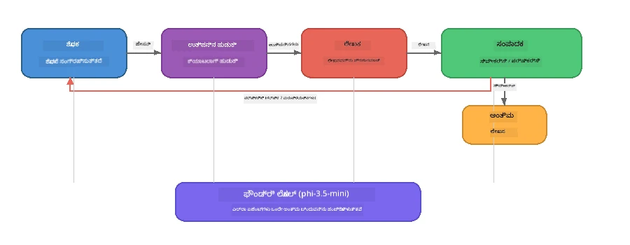

# ಭಾಗ 7: ಜವಾ ಕ್ರಿಯೇಟಿವ್ ರೈಟರ್ - ಕ್ಯಾಪ್ಸ್ಟೋನ್ ಅಪ್ಲಿಕೇಶನ್

> **ಲಕ್ಷ್ಯ:** ನಾಲ್ಕು ವಿಶೇಷ ಕುಶಲ ಏಜೆಂಟ್‌ಗಳು ಸಹಕರಿಸಿ, ಫೌಂಡ್ರೀ ಲೋಕಲ್‌ನೊಂದಿಗೆ ನಿಮ್ಮ ಸಾಧನದಲ್ಲಿ ಸಂಪೂರ್ಣವಾಗಿ ಕಾರ್ಯ ನಿರ್ವಹಿಸುವ ಹಿರಿಯ ಮಂಡಳಿ-ಮಾನದಂಡದ ಲೇಖನಗಳನ್ನು ತಯಾರಿಸುವ ಉತ್ಪಾದನಾ-ಶೈಲಿಯ ಬಹು-ಏಜೆಂಟ್ ಅಪ್ಲಿಕೇಶನ್ ಅನ್ನು ಅನ್ವೇಷಿಸಿ.

ಈವು ಕಾರ್ಯಾಗಾರದ **ಕ್ಯಾಪ್ಸ್ಟೋನ್ ಲ್ಯಾಬ್** ಆಗಿದೆ. ಇದು ನೀವು ಕಲಿತ ಎಲ್ಲವನ್ನೂ ಒಂದೆಡೆ ಸೇರಿಸುತ್ತದೆ - SDK ഉള്ೀಪು (ಭಾಗ 3), ಸ್ಥಳೀಯ ಡೇಟಾ ಮೂಲಕ ಹುಡುಕಾಟ (ಭಾಗ 4), ಏಜೆಂಟ್ ವ್ಯಕ್ತಿತ್ವಗಳು (ಭಾಗ 5), ಮತ್ತು ಬಹು-ಏಜೆಂಟ್ ಸಂಯೋಜನೆ (ಭಾಗ 6) - Python, JavaScript, ಮತ್ತು C#ಗಳಲ್ಲಿ ಲಭ್ಯವಿರುವ ಸಂಪೂರ್ಣ ಅಪ್ಲಿಕೇಶನ್ ಆಗಿ.

---

## ನೀವು ಅನ್ವೇಷಿಸುವುದು ಏನು

| تصور | ಜವಾ ರೈಟರ್‌ನಲ್ಲಿ ಎಲ್ಲಿದೆ |
|---------|----------------------------|
| 4-ಹಂತ ಮಾದರಿ ಲೋಡಿಂಗ್ | ಹಂಚಿಕೊಂಡ ಕಾನ್ಫಿಗ್ ಮೋಡ್ಯೂಲ್ ಫೌಂಡ್ರೀ ಲೋಕಲ್ ಅನ್ನು ಪ್ರಾರಂಭಿಸುತ್ತದೆ |
| RAG-ಶೈಲಿ ಹುಡುಕಾಟ | ಉತ್ಪನ್ನ ಏಜೆಂಟ್ ಸ್ಥಳೀಯ ಕ್ಯಾಲೋಗ್ ಅನ್ನು ಹುಡುಕುತ್ತದೆ |
| ಏಜೆಂಟ್ ವಿಶೇಷತೆ | ಪ್ರತ್ಯೇಕ ವ್ಯವಸ್ಥೆ ಪ್ರಾಂಪ್ಟ್‌ಗಳಿರುವ 4 ಏಜೆಂಟ್‌ಗಳು |
| ಸ್ಟ್ರೀಮಿಂಗ್ ಔಟ್ಪುಟ್ | ರೈಟರ್ ನೈಜ ಸಮಯದಲ್ಲಿ ಟೋಕನ್‌ಗಳನ್ನು ನೀಡುತ್ತದೆ |
| ರಚಿಸಲಾದ ಹಸ್ತಾಂತರಗಳು | ರಿಸರ್ಚರ್ → JSON, ಸಂಪಾದಕ → JSON ನಿರ್ಣಯ |
| ಪ್ರತಿಕ್ರಿಯೆ ಲೂಪುಗಳು | ಸಂಪಾದಕ ಮರುನಿರ್ವಹಣೆಯನ್ನು ಚಾಲನೆ ಮಾಡಬಹುದು (ಗರಿಷ್ಟ 2 ಪುನರಾರಂಭಗಳು) |

---

## ವಿಸ್ತರಣಾತ್ಮಕ ರಚನೆ

ಜವಾ ಕ್ರಿಯೇಟಿವ್ ರೈಟರ್ **ಮೌಲ್ಯಮಾಪಕ-ನಿರ್ಧರಿತ ಪ್ರತಿಕ್ರಿಯೆಯೊಂದಿಗೆ ಕ್ರಮವೈಖರಿಯ ಪൈಪ್‌ಲೈನ್** ಅನ್ನು ಬಳಸುತ್ತದೆ. ಮೂವರು ಭಾಷೆಗಳು ಒಂದೇ ರಚನೆಯನ್ನು ಅನುಸರಿಸುತ್ತವೆ:



### ನಾಲ್ಕು ಏಜೆಂಟ್‌ಗಳು

| ಏಜೆಂಟ್ | ಇನ್ಪುಟ್ | ಔಟ್ಪುಟ್ | ಉದ್ದೇಶ |
|-------|-------|--------|---------|
| **ರಿಸರ್ಚರ್** | ವಿಷಯ + ಐಚ್ಛಿಕ ಪ್ರತಿಕ್ರಿಯೆ | `{"web": [{url, name, description}, ...]}` | LLM ಮುಖಾಂತರ ಹಿನ್ನೆಲೆ ಸಂಶೋಧನೆ ಸಂಗ್ರಹಿಸುತ್ತದೆ |
| **ಉತ್ಪನ್ನ ಹುಡುಕಾಟ** | ಉತ್ಪನ್ನ ಸನ್ನಿವೇಶ ಸ್ಟ್ರಿಂಗ್ | ಹೊಂದಿಕೆಯಾಗುವ ಉತ್ಪನ್ನಗಳ ಪಟ್ಟಿಯನ್ನು | LLM-ರಚಿಸಿದ ಹುಡುಕಾಟ ಪ್ರಶ್ನೆಗಳು + ಸ್ಥಳೀಯ ಕ್ಯಾಲೋಗ್ ವಿರುದ್ಧ ಕೀವರ್ಡ್ ಹುಡುಕಾಟ |
| **ರೈಟರ್** | ಸಂಶೋಧನೆ + ಉತ್ಪನ್ನಗಳು + ನಿಯೋಜನೆ + ಪ್ರತಿಕ್ರಿಯೆ | ಸ್ಟ್ರೀಮಿಂಗ್ ಲೇಖನ ಪಠ್ಯ (`---` ನಲ್ಲಿ ವಿಭಜಿಸಲಾಗುತ್ತದೆ) | ನೈಜ ಸಮಯದಲ್ಲಿ ಮ್ಯಾಗಜಿನ್-ಮಾನದಂಡದ ಲೇಖನವನ್ನು ರಚಿಸುತ್ತದೆ |
| **ಸಂಪಾದಕ** | ಲೇಖನ + ಲೇಖಕನ ಸ್ವ-ಪ್ರತಿಕ್ರಿಯೆ | `{"decision": "accept/revise", "editorFeedback": "...", "researchFeedback": "..."}` | ಗುಣಮಟ್ಟ ಪರಿಶೀಲಿಸಿ, ಅಗತ್ಯವಿದ್ದರೆ ಮರುಚಲಿಸುವಿಕೆಗೆ ಚಾಲನೆ ನೀಡುತ್ತದೆ |

### ಪೈಪ್‌ಲೈನ್ ಪ್ರವಾಹ

1. **ರಿಸರ್ಚರ್** ವಿಷಯವನ್ನು ಸ್ವೀಕರಿಸಿ ರಚಿಸಲಾದ ಸಂಶೋಧನಾ ಟಿಪ್ಪಣಿಗಳನ್ನು (JSON) ತಯಾರಿಸುತ್ತಾನೆ
2. **ಉತ್ಪನ್ನ ಹುಡುಕಾಟ** LLM-ರಚಿಸಿದ ಹುಡುಕಾಟ ಪದಗಳೊಂದಿಗೆ ಸ್ಥಳೀಯ ಉತ್ಪನ್ನ ಕ್ಯಾಲೋಗ್ ಅನ್ನು ಪ್ರಶ್ನೆಮಾಡುತಾಡು
3. **ರೈಟರ್** ಸಂಶೋಧನೆ + ಉತ್ಪನ್ನಗಳು + ನಿಯೋಜನೆಯನ್ನೂ ಸೇರಿಸಿ, ಸ್ವ-ಪ್ರತಿಕ್ರಿಯೆಯನ್ನು `---` ವಿಭಜಕದ ನಂತರ ಸೇರಿಸಿ ಸ್ಟ್ರೀಮಿಂಗ್ ಲೇಖನವಾಗಿ ನೀಡುತ್ತದೆ
4. **ಸಂಪಾದಕ** ಲೇಖನ ಪರಿಶೀಲಿಸಿ JSON ತೀರ್ಮಾನವನ್ನು ಮರಳಿಸುತ್ತಾನೆ:
   - `"accept"` → ಪೈಪ್‌ಲೈನ್ ಪೂರ್ಣಗೊಳ್ಳುತ್ತದೆ
   - `"revise"` → ಪ್ರತಿಕ್ರಿಯೆಯನ್ನು ರಿಸರ್ಚರ್ ಹಾಗೂ ರೈಟರ್‌ಗೆ ಕಳುಹಿಸಲಾಗುತ್ತದೆ (ಗರಿಷ್ಠ 2 ಪ್ರಯತ್ನಗಳು)

---

## ಮೂಲಭೂತ ಅಗತ್ಯಗಳು

- ಪೂರ್ಣಗೊಳಿಸಿ [ಭಾಗ 6: ಬಹು-ಏಜೆಂಟ್ ಕಾರ್ಯವಾಹికೆಗಳು](part6-multi-agent-workflows.md)
- Foundry Local CLI ಸ್ಥಾಪಿಸಲಾಗಿದೆ ಮತ್ತು `phi-3.5-mini` ಮಾದರಿ ಡೌನ್‌ಲೋಡ್ ಮಾಡಲಾಗಿದೆ

---

## ಅಭ್ಯಾಸಗಳು

### ಅಭ್ಯಾಸ 1 - ಜವಾ ಕ್ರಿಯೇಟಿವ್ ರೈಟರ್ ಅನ್ನು ನಡೆಸಿ

ನಿಮ್ಮ ಭಾಷೆಯನ್ನು ಆರಿಸಿ ಮತ್ತು ಅಪ್ಲಿಕೇಶನ್ ಅನ್ನು ಚಾಲನೆ ಮಾಡಿ:

<details>
<summary><strong>🐍 Python - FastAPI ವೆಬ್ ಸೇವೆ</strong></summary>

Python ಆವೃತ್ತಿ **ವೆಬ್ ಸರ್ವಿಸ್** ಆಗಿದ್ದರಿಂದ REST API ಮೂಲಕ ಕಾರ್ಯ ನಿರ್ವಹಿಸುತ್ತದೆ, ಉತ್ಪಾದನಾ ಬ್ಯಾಕ್‌ಎಂಡ್ ನಿರ್ಮಾಣವನ್ನು ಪ್ರದರ್ಶಿಸುತ್ತದೆ.

**ಸೆಟ್ಟಪ್:**
```bash
cd zava-creative-writer-local/src/api
python -m venv venv

# ವಿಂಡೋಸ್ (ಪವರ್‌ಶೆಲ್):
venv\Scripts\Activate.ps1
# ಮ್ಯಾಕ್‌ಒಎಸ್:
source venv/bin/activate

pip install -r requirements.txt
```

**ಚಲಾಯಿಸಿ:**
```bash
uvicorn main:app --reload
```

**ಪರೀಕ್ಷಿಸಿ:**
```bash
curl -X POST http://localhost:8000/api/article \
  -H "Content-Type: application/json" \
  -d '{
    "research": "DIY home improvement trends",
    "products": "power tools and paints",
    "assignment": "Write an article about weekend renovation projects for DIY enthusiasts"
  }'
```

ಪ್ರತಿಕ್ರಿಯೆ new-line ಮೂಲಕ ವಿಭಜಿಸಲಾದ JSON ಸಂದೇಶಗಳ ರೂಪದಲ್ಲಿ ಸ್ಟ್ರೀಮ್ ಆಗಿರುತ್ತದೆ, ಪ್ರತಿಯೊಂದು ಏಜೆಂಟ್‌ನ ಪ್ರಗತಿಯನ್ನೂ ತೋರಿಸುತ್ತದೆ.

</details>

<details>
<summary><strong>📦 JavaScript - Node.js CLI</strong></summary>

JavaScript ಆವೃತ್ತಿ **CLI ಅಪ್ಲಿಕೇಶನ್** ಆಗಿದ್ದು, ಏಜೆಂಟ್ ಪ್ರಗತಿ ಮತ್ತು ಲೇಖನವನ್ನು ನೇರವಾಗಿ ಕಾಂಸೋಲ್‌ನಲ್ಲಿ ಮುದ್ರಣ ಮಾಡುತ್ತದೆ.

**ಸೆಟ್ಟಪ್:**
```bash
cd zava-creative-writer-local/src/javascript
npm install
```

**ಚಲಾಯಿಸಿ:**
```bash
node main.mjs
```

ನೀವು ಕಾಣುವುದೇನು:
1. Foundry Local ಮಾದರಿ ಲೋಡಿಂಗ್ (ಡೌನ್‌ಲೋಡ್ ಆಗುತ್ತಿದ್ದಾಗ ಪ್ರಗತಿ ಬಾರ್)
2. ಎಲ್ಲಾ ಏಜೆಂಟ್‌ಗಳು ಕ್ರಮಾನುಕ್ರಮವಾಗಿ ಕಾರ್ಯ ನಿರ್ವಹಿಸುತ್ತಿರುವ ಸ್ಥಿತಿ ಸಂದೇಶಗಳು
3. ಲೇಖನ ನೈಜ ಸಮಯದಲ್ಲಿ ಕಾಂಸೋಲ್‌ಗೆ ಸ್ಟ್ರೀಮ್ ಆಗಿ ಬರುತ್ತಿದೆ
4. ಸಂಪಾದಕನ ಸ್ವೀಕರಿಸುವ/ಪುನಃಪರಿಷ್ಕರಿಸುವ ನಿರ್ಣಯ

</details>

<details>
<summary><strong>💜 C# - .NET Console ಅಪ್ಲಿಕೇಶನ್</strong></summary>

C# ಆವೃತ್ತಿ **.NET ಕಾನ್ಸೋಲ್ ಅಪ್ಲಿಕೇಶನ್** ಆಗಿದ್ದು, ಇದೇ ಪೈಪ್‌ಲೈನ್ ಮತ್ತು ಸ್ಟ್ರೀಮಿಂಗ್ ಔಟ್ಪುಟ್ ಅನ್ನು ಹೊಂದಿದೆ.

**ಸೆಟ್ಟಪ್:**
```bash
cd zava-creative-writer-local/src/csharp
dotnet restore
```

**ಚಲಾಯಿಸಿ:**
```bash
dotnet run
```

JavaScript ಆವೃತ್ತಿಯಂತೆ- ಏಜೆಂಟ್ ಸ್ಥಿತಿ ಸಂದೇಶಗಳು, ಸ್ಟ್ರೀಮ್ ಲೇಖನ, ಮತ್ತು ಸಂಪಾದಕ ನಿರ್ಣಯ.

</details>

---

### ಅಭ್ಯಾಸ 2 - ಕೋಡ್ ರಚನೆಯನ್ನು ಅಧ್ಯಯನ ಮಾಡಿ

ಪ್ರತಿ ಭಾಷೆಯ ಅನುಷ್ಠಾನವು ಒಂದೇ ಲಾಜಿಕಲ್ ಘಟಕಗಳನ್ನು ಹೊಂದಿದೆ. ರಚನೆಗಳನ್ನು ಹೋಲಿಸಿ:

**Python** (`src/api/`):
| ಫೈಲ್ | ಉದ್ದೇಶ |
|------|---------|
| `foundry_config.py` | ಹಂಚಿಕೊಂಡ Foundry Local ನಿರ್ವಾಹಕ, ಮಾದರಿ ಮತ್ತು ಕ್ಲೈಂಟ್ (4-ಹಂತ ಇನಿಶಿಯಲೈಸೇಷನ್) |
| `orchestrator.py` | ಪೈಪ್‌ಲೈನ್ ಸಂಯೋಜನೆ ಪ್ರತಿಕ್ರಿಯೆ ಲೂಪಿನೊಂದಿಗೆ |
| `main.py` | FastAPI ಎಂಡ್‌ಪಾಯಿಂಟ್‌ಗಳು (`POST /api/article`) |
| `agents/researcher/researcher.py` | JSON ಔಟ್ಪುಟ್‌ನೊಂದಿಗೆ LLM ಆಧಾರಿತ ಸಂಶೋಧನೆ |
| `agents/product/product.py` | LLM-ರಚಿಸಲಾದ ಪ್ರಶ್ನೆಗಳು + ಕೀವರ್ಡ್ ಹುಡುಕಾಟ |
| `agents/writer/writer.py` | ಸ್ಟ್ರೀಮಿಂಗ್ ಲೇಖನ ರಚನೆ |
| `agents/editor/editor.py` | JSON ಆಧಾರಿತ ಸ್ವೀಕಾರ/ಪರಿಷ್ಕಾರ ನಿರ್ಣಯ |

**JavaScript** (`src/javascript/`):
| ಫೈಲ್ | ಉದ್ದೇಶ |
|------|---------|
| `foundryConfig.mjs` | ಹಂಚಿಕೊಂಡ Foundry Local ಕಾನ್ಫಿಗ್ (ಪ್ರಗತಿ ಬಾರ್‌ಗೊಡನೆ 4-ಹಂತ ಇನಿಶಿಯಲೈಸೇಷನ್) |
| `main.mjs` | ಸಂಯೋಜಕರ + CLI ಪ್ರವೇಶ ಪಾಯಿಂಟ್ |
| `researcher.mjs` | LLM ಆಧಾರಿತ ಸಂಶೋಧನೆ ಏಜೆಂಟ್ |
| `product.mjs` | LLM ಪ್ರಶ್ನೆ ತಯಾರಿ + ಕೀವರ್ಡ್ ಹುಡುಕಾಟ |
| `writer.mjs` | ಸ್ಟ್ರೀಮಿಂಗ್ ಲೇಖನ ರಚನೆ (ಅಸಿಂಕ್ ಜನರೇಟರ್) |
| `editor.mjs` | JSON ಸ್ವೀಕಾರ/ಪರಿಷ್ಕಾರ ನಿರ್ಣಯ |
| `products.mjs` | ಉತ್ಪನ್ನ ಕ್ಯಾಲೋಗ್ ಡೇಟಾ |

**C#** (`src/csharp/`):
| ಫೈಲ್ | ಉದ್ದೇಶ |
|------|---------|
| `Program.cs` | ಸಂಪೂರ್ಣ ಪೈಪ್‌ಲೈನ್: ಮಾದರಿ ಲೋಡಿಂಗ್, ಏಜೆಂಟ್‌ಗಳು, ಸಂಯೋಜಕ, ಪ್ರತಿಕ್ರಿಯೆ ಲೂಪ್ |
| `ZavaCreativeWriter.csproj` | .NET 9 ಪ್ರಾಜೆಕ್ಟ್ Foundry Local + OpenAI ಪ್ಯಾಕೇಜ್‌ಗಳೊಂದಿಗೆ |

> **ರೂಪರೇಷೆ ಟಿಪ್ಪಣಿ:** Python ಪ್ರತಿ ಏಜೆಂಟ್ ಅನ್ನು ಸ್ವಂತ ಫೈಲ್/ಡೈರೆಕ್ಟರಿಯಲ್ಲಿ ವಿಭಜಿಸುತ್ತದೆ (ಹೆಚ್ಚು ತಂಡಗಳಿಗೆ ಉತ್ತಮ). JavaScript ಪ್ರತಿ ಏಜೆಂಟ್‌ಗೆ ಒಬ್ಬ ಮೋಡ್ಯೂಲ್ (ಮಧ್ಯಮ ಪ್ರಮಾಣದ ಪ್ರಾಜೆಕ್ಟ್ಗಳಿಗೆ ಉತ್ತಮ). C# ಒಂದೇ ಫೈಲ್‌ನಲ್ಲಿ ಎಲ್ಲಾ ಫಂಕ್ಷನ್‌ಗಳನ್ನು (ಒಂದುಗೂಡಿದ ಉದಾಹರಣೆಗಳಿಗೆ ಉತ್ತಮ). ಉತ್ಪಾದನೆಯಲ್ಲಿ ನಿಮ್ಮ ತಂಡದ ನಿಯಮಗಳಿಗೆ ತಕ್ಕ ಮಾದರಿಯನ್ನು ಆರಿಸಿ.

---

### ಅಭ್ಯಾಸ 3 - ಹಂಚಿಕೊಂಡ ಕಾನ್ಫಿಗರೇಷನ್ ಅನ್ನು ಹಾದುಹೋಗಿ

ಪೈಪ್‌ಲೈನ್‌ನ ಪ್ರತಿಯೊಬ್ಬ ಏಜೆಂಟ್ ಒಂದೇ Foundry Local ಮಾದರಿ ಕ್ಲೈಂಟ್ ಅನ್ನು ಹಂಚಿಕೊಳ್ಳುತ್ತಾನೆ. ಪ್ರತಿಯೊಬ್ಬ ಭಾಷೆಯಲ್ಲಿಯೂ ಇದನ್ನು ಹೇಗೆ ಹೊಂದಿಸಲಾಗಿದೆ ಎಂದು ಪರಿಶೀಲಿಸಿ:

<details>
<summary><strong>🐍 Python - foundry_config.py</strong></summary>

```python
from foundry_local import FoundryLocalManager

MODEL_ALIAS = "phi-3.5-mini"

# ಹಂತ 1: ಮ್ಯಾನೇಜರ್ ಸೃಷ್ಟಿಸಿ ಮತ್ತು ಫೌಂಡ್ರಿ ಲೋಕಲ್ ಸೇವೆಯನ್ನು ಪ್ರಾರಂಭಿಸಿ
manager = FoundryLocalManager()
manager.start_service()

# ಹಂತ 2: ಮಾದರಿಯನ್ನು ಈ ಹಿಂದೆ ಡೌನ್‌ಲೋಡ್ ಮಾಡಲಾಗಿದೆ ಇದೆಯೇ ಎಂದು ಪರಿಶೀಲಿಸಿ
cached = manager.list_cached_models()
catalog_info = manager.get_model_info(MODEL_ALIAS)
is_cached = any(m.id == catalog_info.id for m in cached) if catalog_info else False

if not is_cached:
    manager.download_model(MODEL_ALIAS)

# ಹಂತ 3: ಮಾದರಿಯನ್ನು ಮೆಮೊರಿಯಲ್ಲಿ ಲೋಡ್ ಮಾಡಿ
manager.load_model(MODEL_ALIAS)
model_id = manager.get_model_info(MODEL_ALIAS).id

# ಹಂಚಿಕೆಗೊಂಡ OpenAI ಕ್ಲೈಂಟ್
client = openai.OpenAI(base_url=manager.endpoint, api_key=manager.api_key)
```

ಎಲ್ಲಾ ಏಜೆಂಟ್‌ಗಳು `from foundry_config import client, model_id` ಎಂಬಂತೆ ಇಂಪೋರ್ಟ್ ಮಾಡುತ್ತವೆ.

</details>

<details>
<summary><strong>📦 JavaScript - foundryConfig.mjs</strong></summary>

```javascript
import { FoundryLocalManager } from "foundry-local-sdk";
import { OpenAI } from "openai";

FoundryLocalManager.create({ appName: "ZavaCreativeWriter" });
const manager = FoundryLocalManager.instance;
await manager.startWebService();

// ಕ್ಯಾಷೆ ಪರಿಶೀಲಿಸಿ → ಡೌನ್‌ಲೋಡ್ ಮಾಡಿ → ಲೋಡ್ ಮಾಡಿ (ಹೊಸ SDK ಮಾದರಿ)
const catalog = manager.catalog;
const model = await catalog.getModel(MODEL_ALIAS);
if (!model.isCached) {
  console.log(`Downloading model: ${MODEL_ALIAS}...`);
  await model.download();
}
await model.load();

const client = new OpenAI({ baseURL: manager.urls[0] + "/v1", apiKey: "foundry-local" });
const modelId = model.id;
export { client, modelId };
```

ಎಲ್ಲಾ ಏಜೆಂಟ್‌ಗಳು `{ client, modelId } from "./foundryConfig.mjs"` ಅನ್ನು ಇಂಪೋರ್ಟ್ ಮಾಡುತ್ತವೆ.

</details>

<details>
<summary><strong>💜 C# - Program.cs ಟಾಪ್‌ನಲ್ಲಿರುವ ಭಾಗ</strong></summary>

```csharp
await FoundryLocalManager.CreateAsync(
    new Configuration
    {
        AppName = "ZavaCreativeWriter",
        Web = new Configuration.WebService { Urls = "http://127.0.0.1:0" }
    }, NullLogger.Instance, default);
var manager = FoundryLocalManager.Instance;
await manager.StartWebServiceAsync(default);

var catalog = await manager.GetCatalogAsync(default);
var catalogModel = await catalog.GetModelAsync(alias, default);
var isCached = await catalogModel.IsCachedAsync(default);
if (!isCached)
    await catalogModel.DownloadAsync(null, default);

await catalogModel.LoadAsync(default);
var key = new ApiKeyCredential("foundry-local");
var chatClient = new OpenAIClient(key, new OpenAIClientOptions
{
    Endpoint = new Uri(manager.Urls[0] + "/v1")
}).GetChatClient(catalogModel.Id);
```

`chatClient` ಅನ್ನು ನಂತರ ಎಲ್ಲ ಏಜೆಂಟ್ ಫಂಕ್ಷನ್‌ಗಳಿಗೆ ಒಂದೇ ಫೈಲ್‌ನಲ್ಲಿಯೇ передаются ಮಾಡಲಾಗುತ್ತದೆ.

</details>

> **ಪ್ರಮುಖ ಮಾದರಿ:** ಮಾದರಿ ಲೋಡಿಂಗ್ ಮಾದರಿ (ಸೇವೆ ಆರಂಭ → ಕ್ಯಾಶೆ ಪರಿಶೀಲನೆ → ಡೌನ್‌ಲೋಡ್ → ಲೋಡ್) ಬಳಕೆದಾರರಿಗೆ ಸ್ಪಷ್ಟ ಪ್ರಗತಿ ತೋರಿಸುತ್ತದೆ ಮತ್ತು ಮಾದರಿ ಒಂದೇ ಬಾರಿ ಡೌನ್‌ಲೋಡ್ ಆಗುತ್ತದೆ. ಇದು ಪ್ರತಿಯೊಂದು Foundry Local ಅಪ್ಲಿಕೇಶನ್ನಿಗೊಮ್ಮೆ ಉತ್ತಮ ಅಭ್ಯಾಸ.

---

### ಅಭ್ಯಾಸ 4 - ಪ್ರತಿಕ್ರಿಯೆ ಲೂಪನ್ನು ಅರ್ಥಮಾಡಿಕೊಳ್ಳಿ

ಪೈಪ್‌ಲೈನ್ ಅನ್ನು "ಸ್ಮಾರ್ಟ್" ಮಾಡುವುದು ಪ್ರತಿಕ್ರಿಯೆಯ ಲೂಪ್ - ಸಂಪಾದಕ ಕೆಲಸವನ್ನು ಮರುಪರೀಕ್ಷೆಗಾಗಿ ಹಿಂತಿರುಗಿಸಬಹುದು. ಲಾಜಿಕ್ ಅನ್ನು ಹತ್ತಿರ ನೋಡು:

```
Orchestrator:
  1. researcher.research(topic, "No Feedback")    ← first pass
  2. product.findProducts(productContext)
  3. writer.write(research, products, assignment)  ← streams article
  4. Split article at "---" → article + writerFeedback
  5. editor.edit(article, writerFeedback)

  WHILE editor says "revise" AND retryCount < 2:
    6. researcher.research(topic, editor.researchFeedback)  ← refined
    7. writer.write(research, products, editor.editorFeedback)
    8. editor.edit(newArticle, newWriterFeedback)
    9. retryCount++
```

**ಚಿಂತಿಸಲು ಪ್ರಶ್ನೆಗಳು:**
- ಮರುಪ್ರಯತ್ನ ಮಿತಿಯನ್ನು 2 ಎಂದು ಏಕೆ ನಿಗದಿಪಡಿಸಲಾಗಿದೆ? ಅದನ್ನು ಹೆಚ್ಚಿಸಿದರೆ ಏನಾಗುತ್ತದೆ?
- ರಿಸರ್ಚರ್‌ಗೆ `researchFeedback` ಏಕೆ ಬರುವುದೆಂದರೆ ಮತ್ತು ರೈಟರ್‌ಗೆ `editorFeedback` ಏಕೆ ಬರುತ್ತದೆ?
- ಸಂಪಾದಕ ಯಾವಾಗಲೂ "ಪುನಃಪರಿಷ್ಕರಿಸಿ" ಹೇಳಿದರೆ ಏನಾಗಬಹುದು?

---

### ಅಭ್ಯಾಸ 5 - ಏಜೆಂಟ್ ಅನ್ನು ಬದಲಾಯಿಸಿ

ಒಂದು ಏಜೆಂಟ್‌ನ ವರ್ತನೆ ಬದಲಾಯಿಸಿ ಮತ್ತು ಪೈಪ್‌ಲೈನಿನ ಮೇಲೆ ಅದರ ಪರಿಣಾಮವನ್ನು ಗಮನಿಸಿ:

| ಬದಲಾವಣೆ | ಬದಲಾಯಿಸಬೇಕಾದುದು |
|-------------|----------------|
| **ಕಠಿಣ ಸಂಪಾದಕ** | ಸಂಪಾದಕನ ವ್ಯವಸ್ಥೆ ಪ್ರಾಂಪ್ಟ್ ಅನ್ನು ಬದಲಿಸಿ ಹೀಗಾಗಿ ಕನಿಷ್ಠ ಒಂದು ಪರಿಷ್ಕರಣೆ ಬೇಕೆಂದು ಯಾವಾಗಲೂ ಕೇಳುವಂತೆ ಮಾಡುವುದು |
| **ದೀರ್ಘ ಲೇಖನಗಳು** | ರೈಟರ್ ಪ್ರಾಂಪ್ಟ್ ಅನ್ನು "800-1000 ಪದಗಳು" ರಿಂದ "1500-2000 ಪದಗಳು" ಎಂದು ಬದಲಾಯಿಸಿ |
| **ವಿಭಿನ್ನ ಉತ್ಪನ್ನಗಳು** | ಉತ್ಪನ್ನ ಕ್ಯಾಲೋಗ್‌ನಲ್ಲಿ ಉತ್ಪನ್ನಗಳನ್ನು ಸೇರಿಸಿ ಅಥವಾ ಬದಲಾಯಿಸಿ |
| **ಹೊಸ ಸಂಶೋಧನಾ ವಿಷಯ** | ಮೂಲ `researchContext` ಅನ್ನು ವಿಭಿನ್ನ ವಿಷಯಕ್ಕೆ ಬದಲಾಯಿಸಿ |
| **ಕೆवल JSON ರಿಸರ್ಚರ್** | ಸಂಶೋಧಕರು 3-5 ಬದಲು 10 ಐಟಂಗಳನ್ನು ಹಿಂದಿರುಗಿಸಬೇಕು |

> **ಟಿಪ್:** ಮೂರು ಭಾಷೆಗಳಲ್ಲಿಯೂ ಒಂದೇ ರಚನೆ ಇರುವುದರಿಂದ ನೀವು ಹೆಚ್ಚು ಆರಾಮವಾಗಿ ಹೊಂದಿಸಿದ ಭಾಷೆಯಲ್ಲಿ ಬದಲಾವಣೆ ಮಾಡಲು ಸಾಧ್ಯ.

---

### ಅಭ್ಯಾಸ 6 - ಐದನೇ ಏಜೆಂಟ್ ಸೇರಿಸಿ

ಪೈಪ್‌ಲೈನ್‌ಗೆ ಹೊಸ ಏಜೆಂಟ್ ಅನ್ನು ವಿಸ್ತರಿಸಿರಿ. ಕೆಲವು ಆಲೋಚನೆಗಳು:

| ಏಜೆಂಟ್ | ಪೈಪ್‌ಲೈನ್‌ನಲ್ಲಿ ಎಲ್ಲಿ | ಉದ್ದೇಶ |
|-------|-------------------|---------|
| **ವಾಸ್ತವ ಪರಿಶೀಲಕ** | ರೈಟರ್ ನಂತರ, ಸಂಪಾದಕ ಮುನ್ನಡೆ | ಸಂಶೋಧನಾ ಡೇಟಾವನ್ನು ಆಧರಿಸಿ ದಾವೆಗಳ ಪರಿಶೀಲನೆ |
| **SEO ಸುಧಾರಕ** | ಸಂಪಾದಕ ಅಂಗೀಕರಿಸಿದ ನಂತರ | ಮೆಟಾ ವಿವರಣೆ, ಕೀವರ್ಡ್‌, ಸ್ಲಗ್ ಸೇರಿಸುವುದು |
| **ಚಿತ್ರಕಾರ** | ಸಂಪಾದಕ ಅಂಗೀಕರಿಸಿದ ನಂತರ | ಲೇಖನಕ್ಕೆ ಚಿತ್ರ ಪ್ರಾಂಪ್ಟ್ಗಳನ್ನು ರಚನೆ ಮಾಡುವುದು |
| **ಅನುವಾದಕ** | ಸಂಪಾದಕ ಅಂಗೀಕರಿಸಿದ ನಂತರ | ಲೇಖನವನ್ನು ಬೇರೆ ಭಾಷೆಗೆ ಅನುವಾದ ಮಾಡುವುದು |

**ಹಂತಗಳು:**
1. ಏಜೆಂಟ್‌ನ ವ್ಯವಸ್ಥೆ ಪ್ರಾಂಪ್ಟ್ ಬರೆಯಿರಿ
2. ಏಜೆಂಟ್ ಫಂಕ್ಷನ್ ರಚಿಸಿ (ನಿಮ್ಮ ಭಾಷೆಯಲ್ಲಿ ಈ ಮೂಲ ಮಾದರಿಯನ್ನು ಅನುಸರಿಸಿ)
3. ಅದನ್ನು ಸರಿಯಾದ ಜಾಗದಲ್ಲಿ ಸಂಯೋಜಕದಲ್ಲಿ ಸೇರಿಸಿ
4. ಹೊಸ ಏಜೆಂಟ್‌ನ ಕೊಡುಗೆ ತೋರಿಸಲು ಔಟ್ಪುಟ್/ಲಾಗಿಂಗ್ ಅನ್ನು ನವೀಕರಿಸಿ

---

## Foundry Local ಮತ್ತು ಏಜೆಂಟ್ ಫ್ರೇಮ್ವರ್ಕ್ ಹೇಗೆ ಒಟ್ಟಿಗೆ ಕೆಲಸ ಮಾಡುತ್ತವೆ

ಈ ಅಪ್ಲಿಕೇಶನ್ Foundry Localೊಂದಿಗೆ ಬಹು-ಏಜೆಂಟ್ ವ್ಯವಸ್ಥೆಗಳನ್ನು ನಿರ್ಮಿಸುವ ಶಿಫಾರಸುಮಾಡಲಾದ ಮಾದರಿಯನ್ನು ತೋರಿಸುತ್ತದೆ:

| ಪದರ | ಘಟಕ | ಪಾತ್ರ |
|-------|-----------|------|
| **ರನ್‌ಟೈಮ್** | Foundry Local | ಮಾದರಿಯನ್ನು ಡೌണ്‌ಲೋಡ್, ನಿರ್ವಹಣೆ ಮತ್ತು ಸ್ಥಳೀಯವಾಗಿ ಸರ್ವ್ ಮಾಡುತ್ತದೆ |
| **ಕ್ಲೈಂಟ್** | OpenAI SDK | ಲೋಕಲ್ ಎಂಡ್ ಪೋಯಿಂಟ್‌ಗೆ ಚಾಟ್ ಪೂರ್ಣಗೊಳ್ಳುವಿಕೆಗಳನ್ನು ಕಳುಹಿಸುತ್ತದೆ |
| **ಏಜೆಂಟ್** | ವ್ಯವಸ್ಥೆ ಪ್ರಾಂಪ್ಟ್ + ಚಾಟ್ ಕರೆ | ಕೇಂದ್ರೀಕೃತ ಸೂಚನೆಗಳ ಮೂಲಕ ವಿಶೇಷಣ ಹೊಂದಿದ ವರ್ತನೆ |
| **ಸಂಯೋಜಕ** | ಪೈಪ್‌ಲೈನ್ ಸಂಯೋಜಕ | ಡೇಟಾ ಹರಿವು, ಕ್ರಮ, ಮತ್ತು ಪ್ರತಿಕ್ರಿಯೆ ಲೂಪ್‌ಗಳನ್ನು ನಿರ್ವಹಣೆ ಮಾಡುತ್ತದೆ |
| **ಫ್ರೇಮ್ವರ್ಕ್** | Microsoft Agent Framework | `ChatAgent` ಸಾಂದರ್ಭಿಕತೆ ಮತ್ತು ಮಾದರಿಗಳನ್ನು ಒದಗಿಸುತ್ತದೆ |

ಮುಖ್ಯ ಅರಿವು: **Foundry Local ಮೆಘ ಬ್ಯಾಕ್‌ಎಂಡ್‌ನ ಬದಲು, ಅಪ್ಲಿಕೇಶನ್ ವಾಸ್ತುಶಿಲ್ಪವಲ್ಲ**. ಅದೇ ಏಜೆಂಟ್ ಮಾದರಿಗಳು, ಸಂಯೋಜನಾ ತಂತ್ರಗಳು ಮತ್ತು ರಚಿಸಲಾದ ಹಸ್ತಾಂತರಗಳು, ಮೆಘದಲ್ಲಿ ನಿರ್ವಹಿಸು ಮಾದರಿಗಳಲ್ಲಿ ಕೆಲಸಮಾಡುತ್ತಿದ್ದಂತೆ, ಸ್ಥಳೀಯ ಮಾದರಿಗಳಲ್ಲಿ ಕೂಡ ಅದೇ ರೀತಿಯಲ್ಲಿ ಕಾರ್ಯನಿರ್ವಹಿಸುತ್ತವೆ — ನೀವು ಕ್ಲೈಂಟ್ ಅನ್ನು Azure ಎಂಡ್‌ಪಾಯಿಂಟ್ ಬದಲು ಸ್ಥಳೀಯ ಎಂಡ್‌ಪಾಯಿಂಟ್‌ಗೆ ಸೂಚಿಸುತ್ತಿರುತ್ತೀರಿ.

---

## ಪ್ರಮುಖ ಅಂಶಗಳು

| تصور | ನೀವು ಕಲಿತದ್ದು |
|---------|-----------------|
| ಉತ್ಪಾದನಾ ವಾಸ್ತುಶಿಲ್ಪ | ಹಂಚಿಕೊಂಡ ಕಾನ್ಫಿಗ್ ಮತ್ತು ಪ್ರತ್ಯೇಕ ಏಜೆಂಟ್‌ಗಳೊಂದಿಗೆ ಬಹು-ಏಜೆಂಟ್ ಅಪ್ಲಿಕೇಶನ್ ರಚಿಸುವ ವಿಧಾನ |
| 4-ಹಂತ ಮಾದರಿ ಲೋಡಿಂಗ್ | ಬಳಕೆದಾರರಿಗೆ ಗೋಚರಿಸುವ ಪ್ರಗತಿಗೆ Foundry Local ಅನ್ನು ಆರಂಭಿಸುವ ಉತ್ತಮ ಅಭ್ಯಾಸ |
| ಏಜೆಂಟ್ ವಿಶೇಷತೆ | 4 ಏಜೆಂಟ್‌ಗಳ ಪ್ರತಿಯೊಬ್ಬರೂ ಕೇಂದ್ರೀಕೃತ ಸೂಚನೆಗಳು ಮತ್ತು ನಿರ್ದಿಷ್ಟ ಔಟ್ಪುಟ್ ಫಾರ್ಮಾಟ್ ಹೊಂದಿರುತ್ತಾರೆ |
| ಸ್ಟ್ರೀಮಿಂಗ್ ರಚನೆ | ರೈಟರ್ ನೈಜ ಸಮಯದಲ್ಲಿ ಟೋಕನ್‌ಗಳನ್ನು ನೀಡುತ್ತಾನೆ, ಪ್ರತಿಕ್ರಿಯಾಶೀಲ UIಗಳಿಗೆ ಸಹಾಯ |
| ಪ್ರತಿಕ್ರಿಯೆ ಲೂಪುಗಳು | ಸಂಪಾದಕ-ನಿರ್ದೇಶಿತ ಪುನರಾವರ್ತನೆಯಿಂದ ಮಾನವ ಹಸ್ತಕ್ಷೇಪವಿಲ್ಲದೆ ಔಟ್ಪುಟ್ ಗುಣಮಟ್ಟ ಸುಧಾರಣೆ |
| ಬಹು-ಭಾಷಾ ಮಾದರಿಗಳು | Python, JavaScript, ಮತ್ತು C#ಗಳಲ್ಲಿ ಒಂದೇ ವಾಸ್ತುಶಿಲ್ಪ ಕಾರ್ಯನಿರ್ವಹಿಸುತ್ತದೆ |
| ಸ್ಥಳೀಯ = ಉತ್ಪಾದನಾ ಸಿದ್ಧ | Foundry Local ಮೆಘ ವಿನ್ಯಾಸದ OpenAI ಹೊಂದಾಣಿಕೆಯ API ಅನ್ನು ಸರ್ವ್ ಮಾಡುತ್ತದೆ |

---

## ಮುಂದಿನ ಹಂತ

ನಿಮ್ಮ ಏಜೆಂಟ್‌ಗಳಿಗಾಗಿ ಸ್ವರ್ಣಮಧ್ಯಮಗಳ, ನಿಯಮಾದ್ಧರಿತ ಪರಿಶೀಲನೆಗಳು, ಮತ್ತು LLM-ನ್ಯಾಯಾಧೀಶ ಸ್ಕೋರ್ ഉപയോഗಿಸಿ ವ್ಯವಸ್ಥಿತ ಮೌಲ್ಯಮಾಪನ ಫ್ರೇಮ್ವರ್ಕ್ ರಚಿಸಲು [ಭಾಗ 8: ಮೌಲ್ಯಮಾಪನ-ನಿರ್ದೇಶಿತ ಅಭಿವೃದ್ಧಿ](part8-evaluation-led-development.md) ಗೆ ಮುಂದುವರಿಯಿರಿ.