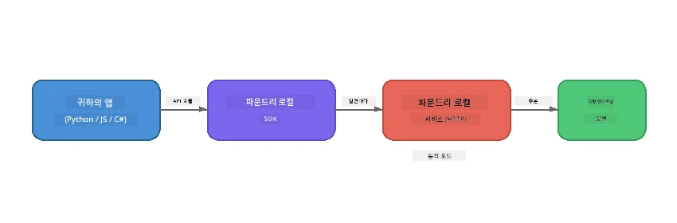

# Part 1: Foundry Local 시작하기


## Foundry Local이란?

[Foundry Local](https://foundrylocal.ai)은 인터넷 연결 없이, 클라우드 비용 없이, 완전한 데이터 프라이버시를 보장하며 **컴퓨터에서 직접** 오픈 소스 AI 언어 모델을 실행할 수 있도록 합니다. 이 솔루션은:

- <strong>모델을 로컬에서 다운로드하고 실행</strong>하며 자동 하드웨어 최적화(GPU, CPU 또는 NPU 포함)를 제공합니다.
- <strong>OpenAI 호환 API</strong>를 제공하여 익숙한 SDK 및 도구를 사용할 수 있습니다.
- **Azure 구독이나 회원가입이 필요 없으며** 그냥 설치만 하면 바로 개발을 시작할 수 있습니다.

즉, 완전히 내 컴퓨터에서 실행되는 개인 AI를 가진 것과 같습니다.

## 학습 목표

이 실습을 마치면 다음을 수행할 수 있습니다:

- 운영 체제에 Foundry Local CLI 설치하기
- 모델 별칭이 무엇이며 어떻게 작동하는지 이해하기
- 첫 번째 로컬 AI 모델 다운로드 및 실행하기
- 명령줄에서 로컬 모델에 채팅 메시지 보내기
- 로컬 AI 모델과 클라우드 호스팅 AI 모델의 차이점 이해하기

---

## 사전 준비 사항

### 시스템 요구 사항

| 요구 사항 | 최소 | 권장 |
|-------------|---------|-------------|
| **RAM** | 8 GB | 16 GB |
| **디스크 공간** | 5 GB (모델용) | 10 GB |
| **CPU** | 4 코어 | 8 코어 이상 |
| **GPU** | 선택 사항 | NVIDIA CUDA 11.8 이상 지원 |
| **운영 체제** | Windows 10/11 (x64/ARM), Windows Server 2025, macOS 13 이상 | - |

> **참고:** Foundry Local은 하드웨어에 맞는 최적의 모델 버전을 자동 선택합니다. NVIDIA GPU가 있으면 CUDA 가속을, Qualcomm NPU가 있으면 이를 사용하며, 그렇지 않으면 최적화된 CPU 버전을 사용합니다.

### Foundry Local CLI 설치

**Windows** (PowerShell):
```powershell
winget install Microsoft.FoundryLocal
```

**macOS** (Homebrew):
```bash
brew tap microsoft/foundrylocal
brew install foundrylocal
```

> **참고:** 현재 Foundry Local은 Windows와 macOS만 지원하며, Linux는 지원하지 않습니다.

설치 확인:
```bash
foundry --version
```


---

## 실습

### 실습 1: 사용 가능한 모델 탐색

Foundry Local에는 사전 최적화된 오픈 소스 모델 카탈로그가 포함되어 있습니다. 모델 목록을 출력하세요:

```bash
foundry model list
```

다음과 같은 모델들을 볼 수 있습니다:
- `phi-3.5-mini` - Microsoft의 38억 매개변수 모델 (빠르고 품질 우수)
- `phi-4-mini` - 최신이고 더 강력한 Phi 모델
- `phi-4-mini-reasoning` - 사유 체인(`<think>` 태그) 기능을 가진 Phi 모델
- `phi-4` - Microsoft의 가장 큰 Phi 모델 (10.4GB)
- `qwen2.5-0.5b` - 매우 작고 빠름 (저사양 장치용)
- `qwen2.5-7b` - 강력한 범용 모델로 도구 호출 지원
- `qwen2.5-coder-7b` - 코드 생성 최적화 모델
- `deepseek-r1-7b` - 강력한 사유 모델
- `gpt-oss-20b` - 대규모 오픈 소스 모델 (MIT 라이센스, 12.5GB)
- `whisper-base` - 음성 인식 텍스트 변환 (383MB)
- `whisper-large-v3-turbo` - 고정밀 음성 인식 (9GB)

> **모델 별칭이란?** `phi-3.5-mini` 같은 별칭은 단축키입니다. 별칭을 사용할 때 Foundry Local은 특정 하드웨어에 최적화된 가장 좋은 변형(CUDA가 NVIDIA GPU용, 아니면 CPU 최적화 버전)을 자동으로 다운로드합니다. 사용자가 변형을 직접 골라야 하는 걱정이 없습니다.

### 실습 2: 첫 모델 실행하기

모델을 다운로드하고 대화형으로 채팅을 시작하세요:

```bash
foundry model run phi-3.5-mini
```

처음 실행 시 Foundry Local은:
1. 하드웨어를 감지합니다.
2. 최적 모델 변형을 다운로드합니다(몇 분 소요될 수 있음).
3. 모델을 메모리에 로드합니다.
4. 대화식 채팅 세션을 시작합니다.

몇 가지 질문을 시도해 보세요:
```
You: What is the golden ratio?
You: Can you explain it as if I were 10 years old?
You: Write a haiku about mathematics
```

`exit`를 입력하거나 `Ctrl+C`를 눌러 종료하세요.

### 실습 3: 모델 미리 다운로드하기

채팅을 시작하지 않고 모델만 다운로드하려면:

```bash
foundry model download phi-3.5-mini
```

현재 컴퓨터에 다운로드된 모델을 확인하려면:

```bash
foundry cache list
```

### 실습 4: 아키텍처 이해하기

Foundry Local은 OpenAI 호환 REST API를 노출하는 <strong>로컬 HTTP 서비스</strong>로 실행됩니다. 이는:

1. 서비스가 **동적 포트**(매번 다른 포트)에서 시작됩니다.
2. SDK를 사용하여 실제 엔드포인트 URL을 찾습니다.
3. <strong>모든</strong> OpenAI 호환 클라이언트 라이브러리를 사용하여 통신할 수 있습니다.



> **중요:** Foundry Local은 시작할 때마다 <strong>동적 포트</strong>를 할당합니다. 절대 `localhost:5272`와 같은 포트 번호를 하드코딩하지 마십시오. 항상 SDK를 사용해 현재 URL(예: Python의 `manager.endpoint`, JavaScript의 `manager.urls[0]`)을 찾아 사용하세요.

---

## 주요 요점

| 개념 | 학습 내용 |
|---------|------------------|
| 디바이스 내 AI | Foundry Local은 클라우드나 API 키, 비용 없이 장치 내에서만 모델을 실행합니다. |
| 모델 별칭 | `phi-3.5-mini`와 같은 별칭은 하드웨어에 가장 적합한 변종을 자동 선택합니다. |
| 동적 포트 | 서비스는 동적 포트에서 실행되므로 언제나 SDK를 사용해 엔드포인트를 확인해야 합니다. |
| CLI 및 SDK | CLI(`foundry model run`) 또는 SDK를 통해 프로그래밍적으로 모델과 상호작용할 수 있습니다. |

---

## 다음 단계

[Part 2: Foundry Local SDK Deep Dive](part2-foundry-local-sdk.md)로 계속 진행하여 모델, 서비스, 캐싱을 프로그래밍 방식으로 관리하는 SDK API를 마스터하세요.