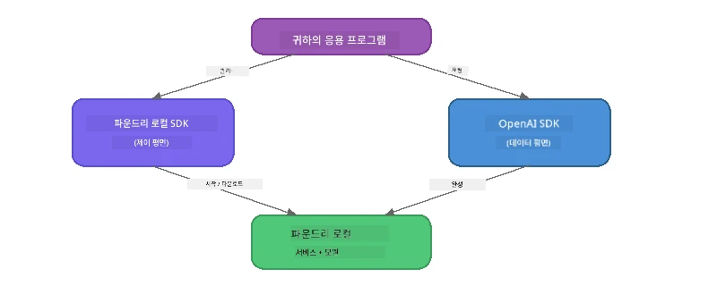

# Part 3: Foundry Local SDK와 OpenAI 사용하기

## 개요

Part 1에서 Foundry Local CLI를 사용해 대화형으로 모델을 실행해 보았습니다. Part 2에서는 SDK API 전체를 살펴보았습니다. 이제 SDK와 OpenAI 호환 API를 사용하여 <strong>Foundry Local을 애플리케이션에 통합하는 방법</strong>을 배우겠습니다.

Foundry Local은 세 가지 언어용 SDK를 제공합니다. 가장 익숙한 언어를 선택하세요. 개념은 세 언어 모두 동일합니다.

## 학습 목표

이 실습을 마치면 다음을 할 수 있습니다:

- 사용 언어용 Foundry Local SDK 설치하기 (Python, JavaScript, 또는 C#)
- `FoundryLocalManager`를 초기화하여 서비스 시작, 캐시 확인, 모델 다운로드 및 로드하기
- OpenAI SDK를 사용하여 로컬 모델에 연결하기
- 대화 완성 요청을 전송하고 스트리밍 응답 처리하기
- 동적 포트 아키텍처 이해하기

---

## 사전 준비

먼저 [Part 1: Foundry Local 시작하기](part1-getting-started.md)와 [Part 2: Foundry Local SDK 심층 탐구](part2-foundry-local-sdk.md)를 완료하세요.

다음 중 <strong>하나</strong>의 언어 런타임을 설치하세요:
- **Python 3.9+** - [python.org/downloads](https://www.python.org/downloads/)
- **Node.js 18+** - [nodejs.org](https://nodejs.org/)
- **.NET 9.0+** - [dot.net/download](https://dotnet.microsoft.com/download)

---

## 개념: SDK 작동 방식

Foundry Local SDK는 **제어 평면**(서비스 시작, 모델 다운로드 관리)을 처리하고, OpenAI SDK는 **데이터 평면**(프롬프트 전송, 완성 결과 수신)을 처리합니다.



---

## 실습 연습

### 연습 1: 환경 설정

<details>
<summary><b>🐍 Python</b></summary>

```bash
cd python
python -m venv venv

# 가상 환경 활성화:
# 윈도우 (PowerShell):
venv\Scripts\Activate.ps1
# 윈도우 (명령 프롬프트):
venv\Scripts\activate.bat
# macOS:
source venv/bin/activate

pip install -r requirements.txt
```

`requirements.txt`가 설치하는 항목:
- `foundry-local-sdk` - Foundry Local SDK (import 시 `foundry_local`)
- `openai` - OpenAI Python SDK
- `agent-framework` - Microsoft Agent Framework (이후 부분에서 사용)

</details>

<details>
<summary><b>📘 JavaScript</b></summary>

```bash
cd javascript
npm install
```

`package.json`가 설치하는 항목:
- `foundry-local-sdk` - Foundry Local SDK
- `openai` - OpenAI Node.js SDK

</details>

<details>
<summary><b>💜 C#</b></summary>

```bash
cd csharp
dotnet restore
dotnet build
```

`csharp.csproj`에서 사용하는 항목:
- `Microsoft.AI.Foundry.Local` - Foundry Local SDK (NuGet)
- `OpenAI` - OpenAI C# SDK (NuGet)

> **프로젝트 구조:** C# 프로젝트는 `Program.cs`에서 명령줄 라우터를 사용하여 별도 예제 파일로 분기합니다. 이 부분은 `dotnet run chat` (또는 그냥 `dotnet run`) 명령으로 실행하세요. 다른 부분은 `dotnet run rag`, `dotnet run agent`, `dotnet run multi`를 사용합니다.

</details>

---

### 연습 2: 기본 채팅 완성

언어별 기본 채팅 예제 코드를 열고 살펴보세요. 각 스크립트는 세 단계 패턴을 따릅니다:

1. **서비스 시작** - `FoundryLocalManager`를 사용하여 Foundry Local 런타임 시작
2. **모델 다운로드 및 로드** - 캐시 확인, 필요시 다운로드 후 메모리에 로드
3. **OpenAI 클라이언트 생성** - 로컬 엔드포인트에 연결하고 스트리밍 채팅 완성 요청 전송

<details>
<summary><b>🐍 Python - <code>python/foundry-local.py</code></b></summary>

```python
import sys
import openai
from foundry_local import FoundryLocalManager

alias = "phi-3.5-mini"

# 1단계: FoundryLocalManager를 생성하고 서비스를 시작합니다
print("Starting Foundry Local service...")
manager = FoundryLocalManager()
manager.start_service()

# 2단계: 모델이 이미 다운로드되어 있는지 확인합니다
cached = manager.list_cached_models()
catalog_info = manager.get_model_info(alias)
is_cached = any(m.id == catalog_info.id for m in cached) if catalog_info else False

if is_cached:
    print(f"Model already downloaded: {alias}")
else:
    print(f"Downloading model: {alias} (this may take several minutes)...")
    manager.download_model(alias)
    print(f"Download complete: {alias}")

# 3단계: 모델을 메모리에 로드합니다
print(f"Loading model: {alias}...")
manager.load_model(alias)

# LOCAL Foundry 서비스를 가리키는 OpenAI 클라이언트를 생성합니다
client = openai.OpenAI(
    base_url=manager.endpoint,   # 동적 포트 - 절대 하드코딩하지 마세요!
    api_key=manager.api_key
)

# 스트리밍 채팅 완성을 생성합니다
stream = client.chat.completions.create(
    model=manager.get_model_info(alias).id,
    messages=[{"role": "user", "content": "What is the golden ratio?"}],
    stream=True,
)

for chunk in stream:
    if chunk.choices[0].delta.content is not None:
        print(chunk.choices[0].delta.content, end="", flush=True)
print()
```

**실행:**  
```bash
python foundry-local.py
```

</details>

<details>
<summary><b>📘 JavaScript - <code>javascript/foundry-local.mjs</code></b></summary>

```javascript
import { OpenAI } from "openai";
import { FoundryLocalManager } from "foundry-local-sdk";

const alias = "phi-3.5-mini";

// 1단계: Foundry Local 서비스를 시작합니다
console.log("Starting Foundry Local service...");
FoundryLocalManager.create({ appName: "FoundryLocalWorkshop" });
const manager = FoundryLocalManager.instance;
await manager.startWebService();

// 2단계: 모델이 이미 다운로드되었는지 확인합니다
const catalog = manager.catalog;
const model = await catalog.getModel(alias);

if (model.isCached) {
  console.log(`Model already downloaded: ${alias}`);
} else {
  console.log(`Downloading model: ${alias} (this may take several minutes)...`);
  await model.download();
  console.log(`Download complete: ${alias}`);
}

// 3단계: 모델을 메모리에 로드합니다
console.log(`Loading model: ${alias}...`);
await model.load();
console.log(`Model loaded: ${model.id}`);

// LOCAL Foundry 서비스를 가리키는 OpenAI 클라이언트를 생성합니다
const client = new OpenAI({
  baseURL: manager.urls[0] + "/v1",   // 동적 포트 - 절대 하드코딩하지 마세요!
  apiKey: "foundry-local",
});

// 스트리밍 채팅 완료를 생성합니다
const stream = await client.chat.completions.create({
  model: model.id,
  messages: [{ role: "user", content: "What is the golden ratio?" }],
  stream: true,
});

for await (const chunk of stream) {
  if (chunk.choices[0]?.delta?.content) {
    process.stdout.write(chunk.choices[0].delta.content);
  }
}
console.log();
```

**실행:**  
```bash
node foundry-local.mjs
```

</details>

<details>
<summary><b>💜 C# - <code>csharp/BasicChat.cs</code></b></summary>

```csharp
using Microsoft.AI.Foundry.Local;
using Microsoft.Extensions.Logging.Abstractions;
using OpenAI;
using OpenAI.Chat;
using System.ClientModel;

var alias = "phi-3.5-mini";

// Step 1: Start the Foundry Local service
Console.WriteLine("Starting Foundry Local service...");
await FoundryLocalManager.CreateAsync(
    new Configuration
    {
        AppName = "FoundryLocalSamples",
        Web = new Configuration.WebService { Urls = "http://127.0.0.1:0" }
    }, NullLogger.Instance, default);
var manager = FoundryLocalManager.Instance;
await manager.StartWebServiceAsync(default);

// Step 2: Get the model from the catalog
var catalog = await manager.GetCatalogAsync(default);
var model = await catalog.GetModelAsync(alias, default);

// Step 3: Check if the model is already downloaded
var isCached = await model.IsCachedAsync(default);

if (isCached)
{
    Console.WriteLine($"Model already downloaded: {alias}");
}
else
{
    Console.WriteLine($"Downloading model: {alias} (this may take several minutes)...");
    await model.DownloadAsync(null, default);
    Console.WriteLine($"Download complete: {alias}");
}

// Step 4: Load the model into memory
Console.WriteLine($"Loading model: {alias}...");
await model.LoadAsync(default);
Console.WriteLine($"Loaded model: {model.Id}");
Console.WriteLine($"Endpoint: {manager.Urls[0]}");

// Create OpenAI client pointing to the LOCAL Foundry service
var key = new ApiKeyCredential("foundry-local");
var client = new OpenAIClient(key, new OpenAIClientOptions
{
    Endpoint = new Uri(manager.Urls[0] + "/v1")  // Dynamic port - never hardcode!
});

var chatClient = client.GetChatClient(model.Id);

// Stream a chat completion
var completionUpdates = chatClient.CompleteChatStreaming("What is the golden ratio?");

foreach (var update in completionUpdates)
{
    if (update.ContentUpdate.Count > 0)
    {
        Console.Write(update.ContentUpdate[0].Text);
    }
}
Console.WriteLine();
```

**실행:**  
```bash
dotnet run chat
```

</details>

---

### 연습 3: 프롬프트 실험하기

기본 예제가 실행되면 코드를 수정하여 실험해 보세요:

1. **사용자 메시지 변경** - 다양한 질문 시도
2. **시스템 프롬프트 추가** - 모델에 페르소나 부여
3. **스트리밍 끄기** - `stream=False`로 설정하고 전체 응답 한 번에 출력
4. **다른 모델 사용** - `phi-3.5-mini` 대신 `foundry model list`에서 다른 별칭 사용

<details>
<summary><b>🐍 Python</b></summary>

```python
# 시스템 프롬프트를 추가하세요 - 모델에게 페르소나를 부여합니다:
stream = client.chat.completions.create(
    model=manager.get_model_info(alias).id,
    messages=[
        {"role": "system", "content": "You are a pirate. Answer everything in pirate speak."},
        {"role": "user", "content": "What is the golden ratio?"}
    ],
    stream=True,
)

# 또는 스트리밍을 끄세요:
response = client.chat.completions.create(
    model=manager.get_model_info(alias).id,
    messages=[{"role": "user", "content": "What is the golden ratio?"}],
    stream=False,
)
print(response.choices[0].message.content)
```

</details>

<details>
<summary><b>📘 JavaScript</b></summary>

```javascript
// 시스템 프롬프트를 추가하세요 - 모델에 페르소나를 부여하세요:
const stream = await client.chat.completions.create({
  model: modelInfo.id,
  messages: [
    { role: "system", content: "You are a pirate. Answer everything in pirate speak." },
    { role: "user", content: "What is the golden ratio?" },
  ],
  stream: true,
});

// 또는 스트리밍을 끄세요:
const response = await client.chat.completions.create({
  model: modelInfo.id,
  messages: [{ role: "user", content: "What is the golden ratio?" }],
  stream: false,
});
console.log(response.choices[0].message.content);
```

</details>

<details>
<summary><b>💜 C#</b></summary>

```csharp
// Add a system prompt - give the model a persona:
var completionUpdates = chatClient.CompleteChatStreaming(
    new ChatMessage[]
    {
        new SystemChatMessage("You are a pirate. Answer everything in pirate speak."),
        new UserChatMessage("What is the golden ratio?")
    }
);

// Or turn off streaming:
var response = chatClient.CompleteChat("What is the golden ratio?");
Console.WriteLine(response.Value.Content[0].Text);
```

</details>

---

### SDK 메서드 참조

<details>
<summary><b>🐍 Python SDK 메서드</b></summary>

| 메서드 | 용도 |
|--------|---------|
| `FoundryLocalManager()` | 매니저 인스턴스 생성 |
| `manager.start_service()` | Foundry Local 서비스 시작 |
| `manager.list_cached_models()` | 기기에 다운로드된 모델 목록 조회 |
| `manager.get_model_info(alias)` | 모델 ID 및 메타데이터 조회 |
| `manager.download_model(alias, progress_callback=fn)` | 콜백과 함께 모델 다운로드 |
| `manager.load_model(alias)` | 모델을 메모리에 로드 |
| `manager.endpoint` | 동적 엔드포인트 URL 조회 |
| `manager.api_key` | API 키 조회 (로컬용 플레이스홀더) |

</details>

<details>
<summary><b>📘 JavaScript SDK 메서드</b></summary>

| 메서드 | 용도 |
|--------|---------|
| `FoundryLocalManager.create({ appName })` | 매니저 인스턴스 생성 |
| `FoundryLocalManager.instance` | 싱글톤 매니저 접근 |
| `await manager.startWebService()` | Foundry Local 서비스 시작 |
| `await manager.catalog.getModel(alias)` | 카탈로그에서 모델 조회 |
| `model.isCached` | 모델이 이미 다운로드되었는지 확인 |
| `await model.download()` | 모델 다운로드 |
| `await model.load()` | 모델을 메모리에 로드 |
| `model.id` | OpenAI API 호출용 모델 ID |
| `manager.urls[0] + "/v1"` | 동적 엔드포인트 URL 조회 |
| `"foundry-local"` | API 키 (로컬용 플레이스홀더) |

</details>

<details>
<summary><b>💜 C# SDK 메서드</b></summary>

| 메서드 | 용도 |
|--------|---------|
| `FoundryLocalManager.CreateAsync(config)` | 매니저 생성 및 초기화 |
| `manager.StartWebServiceAsync()` | Foundry Local 웹 서비스 시작 |
| `manager.GetCatalogAsync()` | 모델 카탈로그 가져오기 |
| `catalog.ListModelsAsync()` | 사용 가능한 모델 목록 조회 |
| `catalog.GetModelAsync(alias)` | 별칭으로 특정 모델 조회 |
| `model.IsCachedAsync()` | 모델 다운로드 여부 확인 |
| `model.DownloadAsync()` | 모델 다운로드 |
| `model.LoadAsync()` | 모델 메모리에 로드 |
| `manager.Urls[0]` | 동적 엔드포인트 URL 조회 |
| `new ApiKeyCredential("foundry-local")` | 로컬용 API 키 자격 증명 |

</details>

---

### 연습 4: 네이티브 ChatClient 사용하기 (OpenAI SDK 대체)

연습 2, 3에서는 OpenAI SDK를 사용해 채팅 완성을 수행했습니다. JavaScript와 C# SDK는 OpenAI SDK 없이도 사용할 수 있는 <strong>네이티브 ChatClient</strong>를 제공합니다.

<details>
<summary><b>📘 JavaScript - <code>model.createChatClient()</code></b></summary>

```javascript
import { FoundryLocalManager } from "foundry-local-sdk";

const alias = "phi-3.5-mini";

FoundryLocalManager.create({ appName: "ChatClientDemo" });
const manager = FoundryLocalManager.instance;
await manager.startWebService();

const model = await manager.catalog.getModel(alias);
if (!model.isCached) await model.download();
await model.load();

// OpenAI 임포트 필요 없음 — 모델에서 직접 클라이언트를 가져옵니다
const chatClient = model.createChatClient();

// 비스트리밍 완성
const response = await chatClient.completeChat([
  { role: "system", content: "You are a pirate. Answer everything in pirate speak." },
  { role: "user", content: "What is the golden ratio?" }
]);
console.log(response.choices[0].message.content);

// 스트리밍 완성 (콜백 패턴 사용)
await chatClient.completeStreamingChat(
  [{ role: "user", content: "What is the golden ratio?" }],
  (chunk) => {
    if (chunk.choices?.[0]?.delta?.content) {
      process.stdout.write(chunk.choices[0].delta.content);
    }
  }
);
console.log();
```

> **참고:** ChatClient의 `completeStreamingChat()`는 async 이터레이터가 아니라 <strong>콜백 방식</strong>입니다. 두 번째 인자로 콜백 함수를 전달하세요.

</details>

<details>
<summary><b>💜 C# - <code>model.GetChatClientAsync()</code></b></summary>

```csharp
var catalog = await manager.GetCatalogAsync(default);
var model = await catalog.GetModelAsync("phi-3.5-mini", default);
if (!await model.IsCachedAsync(default))
    await model.DownloadAsync(null, default);
await model.LoadAsync(default);

// No OpenAI NuGet needed — get a client directly from the model
var chatClient = await model.GetChatClientAsync(default);

// Use it like a standard OpenAI ChatClient
var response = chatClient.CompleteChat("What is the golden ratio?");
Console.WriteLine(response.Value.Content[0].Text);
```

</details>

> **언제 어떤 방법을 쓸까:**
> | 접근 방식 | 적합한 경우 |
> |----------|----------|
> | OpenAI SDK | 전체 파라미터 제어, 프로덕션 앱, 기존 OpenAI 코드와 통합 시 |
> | 네이티브 ChatClient | 빠른 프로토타이핑, 의존성 적음, 간단한 설정 시 |

---

## 핵심 요약

| 개념 | 학습 내용 |
|---------|------------------|
| 제어 평면 | Foundry Local SDK가 서비스 시작과 모델 로드를 처리 |
| 데이터 평면 | OpenAI SDK가 채팅 완성과 스트리밍 처리 담당 |
| 동적 포트 | SDK를 통해 엔드포인트를 항상 동적으로 발견하고 URL을 하드코딩하지 말 것 |
| 다중 언어 | 동일한 코드 패턴이 Python, JavaScript, C# 모두에서 작동 |
| OpenAI 호환성 | 완전한 OpenAI API 호환으로 기존 OpenAI 코드가 최소한의 변경으로 작동 |
| 네이티브 ChatClient | `createChatClient()` (JS) / `GetChatClientAsync()` (C#)가 OpenAI SDK 대안 제공 |

---

## 다음 단계

[Part 4: RAG 애플리케이션 구축하기](part4-rag-fundamentals.md)로 진행하여 장치 내에서 완전 실행되는 Retrieval-Augmented Generation 파이프라인 구축 방법을 알아보세요.