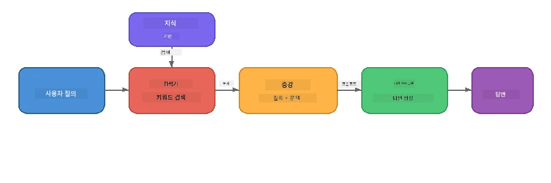

# 파트 4: Foundry Local로 RAG 애플리케이션 구축하기

## 개요

대형 언어 모델은 강력하지만, 훈련 데이터에 있던 내용만 알고 있습니다. <strong>Retrieval-Augmented Generation (RAG)</strong>은 쿼리 시점에 관련된 문맥을 모델에 제공하여 이를 해결합니다 — 여러분의 문서, 데이터베이스 또는 지식 베이스에서 가져온 정보입니다.

이번 실습에서는 Foundry Local을 사용해 **완전히 여러분 장치에서 실행되는** RAG 파이프라인을 구축합니다. 클라우드 서비스도, 벡터 데이터베이스도, 임베딩 API도 사용하지 않고—로컬 검색과 로컬 모델만 사용합니다.

## 학습 목표

이 실습을 마치면 다음을 할 수 있습니다:

- RAG가 무엇이고 AI 애플리케이션에 왜 중요한지 설명할 수 있다
- 텍스트 문서에서 로컬 지식 베이스를 구축할 수 있다
- 관련 문맥을 찾기 위한 간단한 검색 기능을 구현할 수 있다
- 검색된 사실에 기반한 시스템 프롬프트를 작성할 수 있다
- 장치에서 Retrieve → Augment → Generate 전 과정을 실행할 수 있다
- 간단한 키워드 검색과 벡터 검색 간의 트레이드오프를 이해할 수 있다

---

## 사전 준비 사항

- [파트 3: Foundry Local SDK와 OpenAI 사용하기](part3-sdk-and-apis.md) 완료
- Foundry Local CLI 설치 및 `phi-3.5-mini` 모델 다운로드 완료

---

## 개념: RAG란?

RAG 없이는 LLM이 훈련 데이터에서만 답변할 수 있는데, 이는 구식이거나 불완전하거나 여러분의 개인 정보가 없을 수 있습니다:

```
User: "What is Zava's return policy?"
LLM:  "I do not have information about Zava's return policy."  ← No context!
```
  
RAG에서는 먼저 관련 문서를 **검색(retrieve)** 하고, 그 문맥으로 프롬프트를 **증강(augment)** 한 뒤에 답변을 **생성(generate)** 합니다:



핵심 인사이트: **모델이 답을 '알고' 있을 필요는 없고, 올바른 문서를 읽기만 하면 됩니다.**

---

## 실습 과제

### 과제 1: 지식 베이스 이해하기

여러분의 언어용 RAG 예제를 열고 지식 베이스를 살펴보세요:

<details>
<summary><b>🐍 Python: <code>python/foundry-local-rag.py</code></b></summary>

지식 베이스는 `title`과 `content` 필드가 있는 딕셔너리 목록입니다:

```python
KNOWLEDGE_BASE = [
    {
        "title": "Foundry Local Overview",
        "content": (
            "Foundry Local brings the power of Azure AI Foundry to your local "
            "device without requiring an Azure subscription..."
        ),
    },
    {
        "title": "Supported Hardware",
        "content": (
            "Foundry Local automatically selects the best model variant for "
            "your hardware. If you have an Nvidia CUDA GPU it downloads the "
            "CUDA-optimized model..."
        ),
    },
    # ... 더 많은 항목
]
```
  
각 항목은 하나의 주제에 집중된 "지식 청크"를 나타냅니다.

</details>

<details>
<summary><b>📘 JavaScript: <code>javascript/foundry-local-rag.mjs</code></b></summary>

지식 베이스는 객체 배열로 같은 구조를 사용합니다:

```javascript
const KNOWLEDGE_BASE = [
  {
    title: "Foundry Local Overview",
    content:
      "Foundry Local brings the power of Azure AI Foundry to your local " +
      "device without requiring an Azure subscription...",
  },
  {
    title: "Supported Hardware",
    content:
      "Foundry Local automatically selects the best model variant for " +
      "your hardware...",
  },
  // ... 더 많은 항목
];
```
  
</details>

<details>
<summary><b>💜 C#: <code>csharp/RagPipeline.cs</code></b></summary>

지식 베이스는 이름이 지정된 튜플 목록을 사용합니다:

```csharp
private static readonly List<(string Title, string Content)> KnowledgeBase =
[
    ("Foundry Local Overview",
     "Foundry Local brings the power of Azure AI Foundry to your local " +
     "device without requiring an Azure subscription..."),

    ("Supported Hardware",
     "Foundry Local automatically selects the best model variant for " +
     "your hardware..."),

    // ... more entries
];
```
  
</details>

> **실제 애플리케이션에서는** 지식 베이스가 디스크의 파일, 데이터베이스, 검색 인덱스, API에서 올 수 있습니다. 이 실습에서는 단순화를 위해 메모리 내 리스트로 사용합니다.

---

### 과제 2: 검색 함수 이해하기

검색 단계는 사용자 질문에 가장 관련성 높은 청크를 찾습니다. 이 예제는 <strong>키워드 겹침</strong>을 사용하며 — 쿼리 단어가 각 청크에 얼마나 많이 등장하는지 세는 방식입니다:

<details>
<summary><b>🐍 Python</b></summary>

```python
def retrieve(query: str, top_k: int = 2) -> list[dict]:
    """Return the top-k knowledge chunks most relevant to the query."""
    query_words = set(query.lower().split())
    scored = []
    for chunk in KNOWLEDGE_BASE:
        chunk_words = set(chunk["content"].lower().split())
        overlap = len(query_words & chunk_words)
        scored.append((overlap, chunk))
    scored.sort(key=lambda x: x[0], reverse=True)
    return [item[1] for item in scored[:top_k]]
```
  
</details>

<details>
<summary><b>📘 JavaScript</b></summary>

```javascript
function retrieve(query, topK = 2) {
  const queryWords = new Set(query.toLowerCase().split(/\s+/));
  const scored = KNOWLEDGE_BASE.map((chunk) => {
    const chunkWords = new Set(chunk.content.toLowerCase().split(/\s+/));
    let overlap = 0;
    for (const w of queryWords) {
      if (chunkWords.has(w)) overlap++;
    }
    return { overlap, chunk };
  });
  scored.sort((a, b) => b.overlap - a.overlap);
  return scored.slice(0, topK).map((s) => s.chunk);
}
```
  
</details>

<details>
<summary><b>💜 C#</b></summary>

```csharp
private static List<(string Title, string Content)> Retrieve(string query, int topK = 2)
{
    var queryWords = new HashSet<string>(
        query.ToLowerInvariant().Split(' ', StringSplitOptions.RemoveEmptyEntries));

    return KnowledgeBase
        .Select(chunk =>
        {
            var chunkWords = new HashSet<string>(
                chunk.Content.ToLowerInvariant().Split(' ', StringSplitOptions.RemoveEmptyEntries));
            var overlap = queryWords.Intersect(chunkWords).Count();
            return (Overlap: overlap, Chunk: chunk);
        })
        .OrderByDescending(x => x.Overlap)
        .Take(topK)
        .Select(x => x.Chunk)
        .ToList();
}
```
  
</details>

**작동 방식:**  
1. 쿼리를 개별 단어로 분할  
2. 각 지식 청크에 쿼리 단어가 몇 개나 포함되는지 계산  
3. 겹침 점수(높은 순)로 정렬  
4. 상위 k개의 가장 관련 있는 청크 반환

> **트레이드오프:** 키워드 겹침은 간단하지만 제한적이며, 동의어나 의미를 이해하지 못합니다. 실제 RAG 시스템은 보통 <strong>임베딩 벡터</strong>와 <strong>벡터 데이터베이스</strong>를 사용해 의미 기반 검색을 수행합니다. 하지만 키워드 겹침은 훌륭한 출발점이며 추가 종속성이 필요 없습니다.

---

### 과제 3: 증강 프롬프트 이해하기

검색된 문맥은 <strong>시스템 프롬프트</strong>에 주입되어 모델에 전달됩니다:

```python
system_prompt = (
    "You are a helpful assistant. Answer the user's question using ONLY "
    "the information provided in the context below. If the context does "
    "not contain enough information, say so.\n\n"
    f"Context:\n{context_text}"
)
```
  
주요 설계 결정:  
- **"제공된 정보만 사용"** — 문맥에 없는 사실을 모델이 만들어내지 못하게 방지  
- **"문맥에 충분한 정보가 없으면 그렇게 말하라"** — 솔직한 "모르겠습니다" 답변을 유도  
- 문맥이 시스템 메시지에 배치되어 모든 응답에 영향을 줌

---

### 과제 4: RAG 파이프라인 실행하기

완성된 예제를 실행하세요:

**Python:**  
```bash
cd python
python foundry-local-rag.py
```
  
**JavaScript:**  
```bash
cd javascript
node foundry-local-rag.mjs
```
  
**C#:**  
```bash
cd csharp
dotnet run rag
```
  
아래 세 가지가 출력됩니다:  
1. <strong>질문</strong>  
2. **검색된 문맥** — 지식 베이스에서 선택된 청크  
3. <strong>답변</strong> — 그 문맥만 사용해 모델이 생성한 답변

예시 출력:  
```
Question: How do I install Foundry Local and what hardware does it support?

--- Retrieved Context ---
### Installation
On Windows install Foundry Local with: winget install Microsoft.FoundryLocal...

### Supported Hardware
Foundry Local automatically selects the best model variant for your hardware...
-------------------------

Answer: To install Foundry Local, you can use the following methods depending
on your operating system: On Windows, run `winget install Microsoft.FoundryLocal`.
On macOS, use `brew install microsoft/foundrylocal/foundrylocal`...
```
  
모델 답변이 검색된 문맥에 <strong>근거하여</strong> 지식 베이스 문서의 사실만 언급하는 점을 확인하세요.

---

### 과제 5: 실험 및 확장

이 변형들을 시도하여 이해를 더 깊게 하세요:

1. **질문 변경** — 지식 베이스에 있는 질문과 없는 질문을 던져보세요:  
   ```python
   question = "What programming languages does Foundry Local support?"  # ← 문맥 내
   question = "How much does Foundry Local cost?"                       # ← 문맥 외
   ```
  
답변이 문맥에 없으면 모델이 정확히 "모르겠습니다"라고 하나요?

2. **새로운 지식 청크 추가** — `KNOWLEDGE_BASE`에 새 항목을 추가하세요:  
   ```python
   {
       "title": "Pricing",
       "content": "Foundry Local is completely free and open source under the MIT license.",
   }
   ```
  
다시 가격 관련 질문을 해보세요.

3. **`top_k` 변경** — 더 많거나 적은 청크를 검색하세요:  
   ```python
   context_chunks = retrieve(question, top_k=3)  # 더 많은 컨텍스트
   context_chunks = retrieve(question, top_k=1)  # 더 적은 컨텍스트
   ```
  
문맥 양이 답변 품질에 어떻게 영향을 주나요?

4. **기반(grounding) 지침 제거** — 시스템 프롬프트를 단순히 "You are a helpful assistant."로 변경해 보고, 모델이 사실을 만들어내는지 확인하세요.

---

## 심층 탐구: 온디바이스 성능 최적화를 위한 RAG

온디바이스에서 RAG를 실행할 때는 클라우드와 달리 제약이 있습니다: 제한된 RAM, 전용 GPU 없음(CPU/NPU 실행), 작은 모델 컨텍스트 윈도우. 아래 설계 결정은 이런 제약에 대응하며 Foundry Local로 구축된 프로덕션 스타일 로컬 RAG 애플리케이션 패턴을 반영합니다.

### 청크 분할 전략: 고정 크기 슬라이딩 윈도우

청크 분할 — 문서를 조각내는 방식 —은 모든 RAG 시스템에서 가장 중요한 결정 중 하나입니다. 온디바이스 환경에서는 <strong>고정 크기 슬라이딩 윈도우와 겹침</strong>이 권장되는 출발점입니다:

| 매개변수 | 권장 값 | 이유 |
|-----------|------------------|-----|
| **청크 크기** | 약 200 토큰 | Phi-3.5 Mini 컨텍스트 윈도우 내에서 시스템 프롬프트, 대화 기록, 생성 출력에 공간 남김 |
| <strong>겹침</strong> | 약 25 토큰 (12.5%) | 청크 경계에서 정보 손실 방지 — 절차, 단계별 지침에 중요 |
| <strong>토크나이제이션</strong> | 공백 기준 분할 | 종속성 없음, 토크나이저 라이브러리 불필요. 연산 예산을 LLM에 온전히 할당 |

겹침은 슬라이딩 윈도우처럼 작동: 각 청크는 이전 청크가 끝나기 25토큰 전부터 시작해서 문장이 청크 경계를 넘을 경우 두 청크에 모두 포함됩니다.

> **다른 전략은 왜 안 좋은가?**  
> - <strong>문장 단위 분할</strong>은 청크 크기가 불규칙함. 긴 문장 하나로 된 안전 절차 등은 잘 분할되지 않음  
> - **섹션 단위 분할**(`##` 제목 기준)은 청크 크기가 너무 다양함—어떤 것은 너무 작고, 어떤 것은 모델 컨텍스트 윈도우에 너무 큼  
> - **의미 기반 청킹**(임베딩 기반 주제 탐지)은 최고 검색 품질 제공하지만 Phi-3.5 Mini와 함께 메모리에 두 번째 모델이 필요해 8~16GB 공유 메모리 하드웨어에서 위험함

### 고급 검색: TF-IDF 벡터

이번 실습의 키워드 겹침 기법도 작동하지만, 임베딩 모델 없이 더 나은 검색을 원한다면 <strong>TF-IDF(문서 빈도 역수, Term Frequency-Inverse Document Frequency)</strong>가 훌륭한 중간 대안입니다:

```
Keyword Overlap  →  TF-IDF Vectors  →  Embedding Models
    (this lab)     (lightweight upgrade)   (production)
  Simple & fast    Better ranking,         Best quality,
  No dependencies  still no ML model       requires embedding model
  ~Basic matching  ~1ms retrieval          ~100-500ms per query
```
  
TF-IDF는 각 청크를 그 청크 내 단어 중요도를 전체 청크 대비 상대적으로 수치 벡터로 변환합니다. 쿼리도 같은 방식으로 벡터화하여 코사인 유사도로 비교합니다. SQLite와 순수 자바스크립트/파이썬으로 구현 가능—벡터 DB나 임베딩 API 불필요.

> **성능:** TF-IDF 코사인 유사도는 고정 크기 청크에서 일반적으로 약 <strong>1ms 이내 검색</strong>을 달성하며, 임베딩 모델로 쿼리 인코딩할 때 100~500ms에 비해 빠릅니다. 20개 이상의 문서도 1초 이내 청킹 및 인덱싱 가능합니다.

### 제약 장치용 엣지/컴팩트 모드

매우 제한된 하드웨어(구형 노트북, 태블릿, 현장 장치)에서 실행할 때는 세 가지 설정을 줄여 자원 사용량을 낮출 수 있습니다:

| 설정 | 표준 모드 | 엣지/컴팩트 모드 |
|---------|--------------|-------------------|
| **시스템 프롬프트** | 약 300 토큰 | 약 80 토큰 |
| **최대 출력 토큰 수** | 1024 | 512 |
| **검색된 청크 수 (top-k)** | 5 | 3 |

검색 청크 수가 줄어들면 모델에 투입되는 문맥도 줄어들어 지연 시간과 메모리 부담이 감소합니다. 짧은 시스템 프롬프트는 답변을 위한 컨텍스트 윈도우 공간을 더 확보해 줍니다. 모든 토큰 컨텍스트 윈도우가 중요한 장치에선 이 트레이드오프가 가치가 있습니다.

### 메모리 내 단일 모델

온디바이스 RAG의 가장 중요한 원칙 중 하나는: <strong>모델은 한 개만 로드한다</strong>는 것입니다. 검색에 임베딩 모델과 생성에 언어 모델을 모두 쓰면 제한된 NPU/RAM 자원을 두 모델이 나누어 쓰게 됩니다. 경량 검색(키워드 겹침, TF-IDF)은 이를 완전히 회피합니다:

- 임베딩 모델과 LLM이 메모리를 경쟁하지 않음  
- 콜드 스타트 속도 빠름 — 한 모델만 로드  
- 메모리 사용량 예측 가능 — LLM에 모든 자원 할당  
- 8GB RAM 최소 사양 기기에서도 작동

### SQLite를 로컬 벡터 스토어로

소규모~중간 규모 문서 집합(수백~수천 청크)에서는 **SQLite가 충분히 빠르며** 완전한 인프라 없이 코사인 유사도 브루트포스 검색 가능:

- 단일 `.db` 파일로 디스크 저장 — 서버 프로세스, 별도 설정 불필요  
- 주요 언어 런타임에 기본 제공 (Python `sqlite3`, Node.js `better-sqlite3`, .NET `Microsoft.Data.Sqlite`)  
- 문서 청크와 TF-IDF 벡터를 한 테이블에 저장  
- Pinecone, Qdrant, Chroma, FAISS 같은 대규모 벡터 DB 필요 없음

### 성능 요약

이 설계 선택들은 컨슈머 하드웨어에서 빠른 응답형 RAG를 제공합니다:

| 지표 | 온디바이스 성능 |
|--------|----------------------|
| **검색 지연 시간** | 약 1ms(TF-IDF) ~ 5ms(키워드 겹침) |
| **인덱싱 속도** | 20개 문서 청킹과 인덱싱 1초 미만 |
| **메모리 내 모델 수** | 1개 (LLM만, 임베딩 모델 없음) |
| **저장 공간 오버헤드** | SQLite 내 청크+벡터 약 1MB 미만 |
| **콜드 스타트** | 단일 모델 로드, 임베딩 런타임 없음 |
| **최소 하드웨어 사양** | 8GB RAM, CPU만 (GPU 불필요) |

> **업그레이드 시기:** 수백 개 이상 긴 문서, 혼합 콘텐츠(테이블, 코드, 산문) 규모 확장 시, 또는 쿼리의 의미 검색이 필요할 때 임베딩 모델 추가와 벡터 유사도 검색 전환을 고려하세요. 대부분 온디바이스 집중 문서 집합에는 TF-IDF + SQLite가 최소 자원으로 뛰어난 결과를 냅니다.

---

## 주요 개념

| 개념 | 설명 |
|---------|-------------|
| **검색(Retrieval)** | 사용자의 쿼리를 기반으로 지식 베이스에서 관련 문서 찾기 |
| **증강(Augmentation)** | 검색된 문서를 프롬프트 내 문맥으로 삽입 |
| **생성(Generation)** | LLM이 제공된 문맥에 근거하여 답변 생성 |
| **청킹(Chunking)** | 큰 문서를 작고 집중된 조각으로 분할 |
| **기반(Grounding)** | 모델이 제공된 문맥만 사용하도록 제한 (환각 감소) |
| **Top-k** | 검색할 가장 관련성 높은 청크 수 |

---

## 프로덕션 RAG vs. 이 실습

| 항목 | 이 실습 | 온디바이스 최적화 | 클라우드 프로덕션 |
|--------|----------|--------------------|-----------------|
| **지식 베이스** | 메모리 내 리스트 | 디스크 파일, SQLite | 데이터베이스, 검색 인덱스 |
| <strong>검색</strong> | 키워드 겹침 | TF-IDF + 코사인 유사도 | 벡터 임베딩 + 유사도 검색 |
| <strong>임베딩</strong> | 필요 없음 | 필요 없음 (TF-IDF 벡터) | 임베딩 모델 (로컬 또는 클라우드) |
| **벡터 저장소** | 필요 없음 | SQLite (단일 `.db` 파일) | FAISS, Chroma, Azure AI Search 등 |
| <strong>청킹</strong> | 수동 | 고정 크기 슬라이딩 윈도우 (~200토큰, 25토큰 겹침) | 의미 기반 또는 재귀적 청킹 |
| **메모리 내 모델** | 1 (LLM) | 1 (LLM) | 2 이상 (임베딩 + LLM) |
| **검색 지연 시간** | ~5ms | ~1ms | ~100-500ms |
| <strong>규모</strong> | 5개 문서 | 수백 개 문서 | 수백만 개 문서 |

여기서 배우는 패턴(검색, 보강, 생성)은 어떤 규모에서도 동일합니다. 검색 방법은 개선되지만 전체 아키텍처는 동일하게 유지됩니다. 가운데 열은 경량 기술로 장치 내에서 달성할 수 있는 것을 보여주며, 클라우드 규모를 포기하는 대신 개인 정보 보호, 오프라인 기능, 외부 서비스에 대한 지연 시간 제로를 원하는 로컬 애플리케이션에 적합한 지점입니다.

---

## 주요 요점

| 개념 | 배운 내용 |
|---------|------------------|
| RAG 패턴 | 검색 + 보강 + 생성: 모델에 올바른 컨텍스트를 제공하면 데이터에 대해 질문에 답할 수 있음 |
| 장치 내 | 모든 것이 클라우드 API나 벡터 데이터베이스 구독 없이 로컬에서 실행됨 |
| 그라운딩 지침 | 환각을 방지하기 위해 시스템 프롬프트 제약이 필수적임 |
| 키워드 겹침 | 간단하지만 효과적인 검색 시작점 |
| TF-IDF + SQLite | 임베딩 모델 없이도 1ms 이하의 검색 속도를 유지하는 경량 업그레이드 경로 |
| 메모리 내 단일 모델 | 제한된 하드웨어에서 LLM과 함께 임베딩 모델을 로드하지 않도록 함 |
| 청크 크기 | 대략 200 토큰과 중복으로 검색 정확도와 컨텍스트 창 효율성 균형 |
| 엣지/컴팩트 모드 | 매우 제한된 장치를 위해 더 적은 청크와 짧은 프롬프트 사용 |
| 범용 패턴 | 동일한 RAG 아키텍처가 문서, 데이터베이스, API 또는 위키 등 모든 데이터 소스에 적용 가능 |

> **장치 내 전체 RAG 애플리케이션을 보고 싶으신가요?** [Gas Field Local RAG](https://github.com/leestott/local-rag)를 확인해 보세요. Foundry Local과 Phi-3.5 Mini로 만들어진 생산 스타일의 오프라인 RAG 에이전트로, 실제 문서 세트와 함께 이러한 최적화 패턴을 보여줍니다.

---

## 다음 단계

계속해서 [Part 5: Building AI Agents](part5-single-agents.md)로 이동하여 Microsoft Agent Framework를 사용한 페르소나, 지침, 다중 턴 대화를 포함한 지능형 에이전트 구축 방법을 학습하세요.