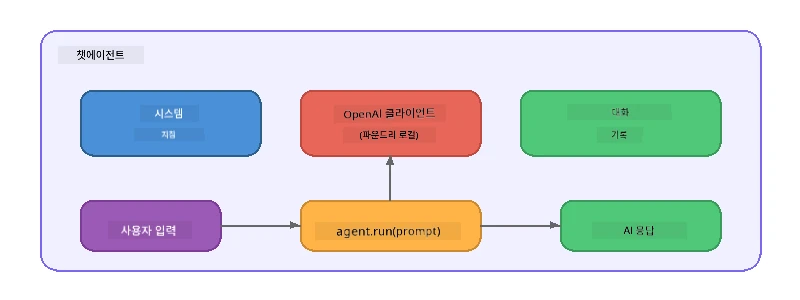

# Part 5: Agent Framework를 활용한 AI 에이전트 구축

> **목표:** Foundry Local을 통해 로컬 모델로 구동되는 지속적인 지침과 정의된 페르소나를 갖춘 첫 번째 AI 에이전트를 구축합니다.

## AI 에이전트란?

AI 에이전트는 언어 모델을 <strong>시스템 지침</strong>으로 감싸 해당 에이전트의 행동, 성격 및 제약 조건을 정의합니다. 단일 채팅 완성 호출과 달리 에이전트는 다음을 제공합니다:

- <strong>페르소나</strong> - 일관된 정체성 ("당신은 도움이 되는 코드 리뷰어입니다")
- <strong>기억</strong> - 대화 내역을 통한 여러 턴 기억
- <strong>전문화</strong> - 잘 설계된 지침에 따른 집중된 행동



---

## Microsoft Agent Framework

**Microsoft Agent Framework**(AGF)는 서로 다른 모델 백엔드에서 작동하는 표준 에이전트 추상화를 제공합니다. 이 워크숍에서는 Foundry Local과 결합하여 모든 것이 여러분의 컴퓨터에서 실행되도록 합니다—클라우드가 필요 없습니다.

| 개념 | 설명 |
|---------|-------------|
| `FoundryLocalClient` | Python: 서비스 시작, 모델 다운로드/로드 처리, 에이전트 생성 |
| `client.as_agent()` | Python: Foundry Local 클라이언트에서 에이전트 생성 |
| `AsAIAgent()` | C#: `ChatClient`에 대한 확장 메서드 - `AIAgent` 생성 |
| `instructions` | 에이전트 행동을 형성하는 시스템 프롬프트 |
| `name` | 사람이 읽을 수 있는 라벨, 멀티 에이전트 시나리오에 유용 |
| `agent.run(prompt)` / `RunAsync()` | 사용자 메시지를 보내고 에이전트 응답 반환 |

> **참고:** Agent Framework는 Python 및 .NET SDK를 제공합니다. JavaScript의 경우 OpenAI SDK를 직접 사용하여 동일한 패턴을 반영하는 경량 `ChatAgent` 클래스를 구현합니다.

---

## 실습

### 실습 1 - 에이전트 패턴 이해하기

코드를 작성하기 전에 에이전트의 핵심 구성요소를 학습하세요:

1. **모델 클라이언트** - Foundry Local의 OpenAI 호환 API에 연결
2. **시스템 지침** - "페르소나" 프롬프트
3. **실행 루프** - 사용자 입력을 보내고 출력을 받음

> **생각해보기:** 시스템 지침은 일반 사용자 메시지와 어떻게 다를까요? 지침을 변경하면 어떤 일이 발생할까요?

---

### 실습 2 - 단일 에이전트 예제 실행

<details>
<summary><strong>🐍 Python</strong></summary>

**사전 준비:**
```bash
cd python
python -m venv venv

# 윈도우 (PowerShell):
venv\Scripts\Activate.ps1
# macOS:
source venv/bin/activate

pip install -r requirements.txt
```

**실행:**
```bash
python foundry-local-with-agf.py
```

**코드 설명** (`python/foundry-local-with-agf.py`):

```python
import asyncio
from agent_framework_foundry_local import FoundryLocalClient

async def main():
    alias = "phi-4-mini"

    # FoundryLocalClient는 서비스 시작, 모델 다운로드 및 로딩을 처리합니다
    client = FoundryLocalClient(model_id=alias)
    print(f"Client Model ID: {client.model_id}")

    # 시스템 지침으로 에이전트를 생성합니다
    agent = client.as_agent(
        name="Joker",
        instructions="You are good at telling jokes.",
    )

    # 비스트리밍: 전체 응답을 한 번에 받습니다
    result = await agent.run("Tell me a joke about a pirate.")
    print(f"Agent: {result}")

    # 스트리밍: 생성되는 즉시 결과를 받습니다
    async for chunk in agent.run("Tell me another joke.", stream=True):
        if chunk.text:
            print(chunk.text, end="", flush=True)

asyncio.run(main())
```

**주요 포인트:**
- `FoundryLocalClient(model_id=alias)`는 서비스 시작, 다운로드, 모델 로드를 한 번에 처리
- `client.as_agent()`는 시스템 지침과 이름을 가진 에이전트 생성
- `agent.run()`은 비스트리밍 및 스트리밍 모드를 모두 지원
- `pip install agent-framework-foundry-local --pre`로 설치

</details>

<details>
<summary><strong>📦 JavaScript</strong></summary>

**사전 준비:**
```bash
cd javascript
npm install
```

**실행:**
```bash
node foundry-local-with-agent.mjs
```

**코드 설명** (`javascript/foundry-local-with-agent.mjs`):

```javascript
import { OpenAI } from "openai";
import { FoundryLocalManager } from "foundry-local-sdk";

class ChatAgent {
  constructor({ client, modelId, instructions, name }) {
    this.client = client;
    this.modelId = modelId;
    this.instructions = instructions;
    this.name = name;
    this.history = [];
  }

  async run(userMessage) {
    const messages = [
      { role: "system", content: this.instructions },
      ...this.history,
      { role: "user", content: userMessage },
    ];
    const response = await this.client.chat.completions.create({
      model: this.modelId,
      messages,
    });
    const assistantMessage = response.choices[0].message.content;

    // 다중 회차 상호작용을 위해 대화 기록을 유지하세요
    this.history.push({ role: "user", content: userMessage });
    this.history.push({ role: "assistant", content: assistantMessage });
    return { text: assistantMessage };
  }
}

async function main() {
  FoundryLocalManager.create({ appName: "FoundryLocalWorkshop" });
  const manager = FoundryLocalManager.instance;
  await manager.startWebService();

  const catalog = manager.catalog;
  const model = await catalog.getModel("phi-3.5-mini");
  if (!model.isCached) {
    console.log("Downloading model: phi-3.5-mini...");
    await model.download();
  }
  await model.load();

  const client = new OpenAI({
    baseURL: manager.urls[0] + "/v1",
    apiKey: "foundry-local",
  });

  const agent = new ChatAgent({
    client,
    modelId: model.id,
    instructions: "You are good at telling jokes.",
    name: "Joker",
  });

  const result = await agent.run("Tell me a joke about a pirate.");
  console.log(result.text);
}

main();
```

**주요 포인트:**
- JavaScript는 Python AGF 패턴을 반영하는 `ChatAgent` 클래스를 직접 구현
- `this.history`는 다중 턴 지원을 위해 대화 내역 저장
- 명시적 `startWebService()` → 캐시 확인 → `model.download()` → `model.load()`로 전체 과정을 볼 수 있음

</details>

<details>
<summary><strong>💜 C#</strong></summary>

**사전 준비:**
```bash
cd csharp
dotnet restore
```

**실행:**
```bash
dotnet run agent
```

**코드 설명** (`csharp/SingleAgent.cs`):

```csharp
using Microsoft.AI.Foundry.Local;
using Microsoft.Extensions.Logging.Abstractions;
using Microsoft.Agents.AI;
using OpenAI;
using System.ClientModel;

// 1. Start Foundry Local and load a model
var alias = "phi-3.5-mini";
await FoundryLocalManager.CreateAsync(
    new Configuration
    {
        AppName = "FoundryLocalSamples",
        Web = new Configuration.WebService { Urls = "http://127.0.0.1:0" }
    }, NullLogger.Instance, default);
var manager = FoundryLocalManager.Instance;
await manager.StartWebServiceAsync(default);

var catalog = await manager.GetCatalogAsync(default);
var model = await catalog.GetModelAsync(alias, default);

var isCached = await model.IsCachedAsync(default);
if (!isCached)
{
    Console.WriteLine($"Downloading model: {alias}...");
    await model.DownloadAsync(null, default);
}
await model.LoadAsync(default);

var key = new ApiKeyCredential("foundry-local");
var client = new OpenAIClient(key, new OpenAIClientOptions
{
    Endpoint = new Uri(manager.Urls[0] + "/v1")
});

// 2. Create an AIAgent using the Agent Framework extension method
AIAgent joker = client
    .GetChatClient(model.Id)
    .AsAIAgent(
        instructions: "You are good at telling jokes. Keep your jokes short and family-friendly.",
        name: "Joker"
    );

// 3. Run the agent (non-streaming)
var response = await joker.RunAsync("Tell me a joke about a pirate.");
Console.WriteLine($"Joker: {response}");

// 4. Run with streaming
await foreach (var update in joker.RunStreamingAsync("Tell me another joke."))
{
    Console.Write(update);
}
```

**주요 포인트:**
- `AsAIAgent()`는 `Microsoft.Agents.AI.OpenAI`의 확장 메서드로 커스텀 `ChatAgent` 클래스 불필요
- `RunAsync()`는 전체 응답 반환, `RunStreamingAsync()`는 토큰 단위 스트리밍 제공
- `dotnet add package Microsoft.Agents.AI.OpenAI --version 1.0.0-rc3`로 설치

</details>

---

### 실습 3 - 페르소나 변경하기

에이전트의 `instructions`를 수정하여 다른 페르소나를 만들어 보세요. 각각을 시도하며 출력이 어떻게 달라지는지 관찰하세요:

| 페르소나 | 지침 |
|---------|-------------|
| 코드 리뷰어 | `"당신은 전문가 코드 리뷰어입니다. 가독성, 성능, 정확성에 초점을 맞춘 건설적인 피드백을 제공합니다."` |
| 여행 가이드 | `"당신은 친근한 여행 가이드입니다. 여행지, 활동, 현지 음식에 대한 개인 맞춤형 추천을 제공합니다."` |
| 소크라테스 튜터 | `"당신은 소크라테스식 튜터입니다. 직접적인 답변을 제공하지 않고, 생각할 수 있는 질문으로 학생을 안내합니다."` |
| 기술 작가 | `"당신은 기술 작가입니다. 개념을 명확하고 간결하게 설명합니다. 예시를 사용하고 전문용어 사용을 피합니다."` |

**시도 방법:**
1. 위 표에서 페르소나를 선택하세요
2. 코드 내 `instructions` 문자열을 교체하세요
3. 사용자 프롬프트도 맞춰 조정하세요 (예: 코드 리뷰어에게 함수 리뷰 요청)
4. 예제를 다시 실행하고 결과를 비교하세요

> **팁:** 에이전트의 품질은 지침에 크게 달려 있습니다. 구체적이고 잘 구조화된 지침이 모호한 지침보다 더 나은 결과를 만듭니다.

---

### 실습 4 - 다중 턴 대화 추가

예제를 확장하여 다중 턴 채팅 루프를 지원하도록 하여 에이전트와 주고받는 대화를 할 수 있게 만드세요.

<details>
<summary><strong>🐍 Python - 다중 턴 루프</strong></summary>

```python
import asyncio
from agent_framework_foundry_local import FoundryLocalClient

async def main():
    client = FoundryLocalClient(model_id="phi-4-mini")

    agent = client.as_agent(
        name="Assistant",
        instructions="You are a helpful assistant.",
    )

    print("Chat with the agent (type 'quit' to exit):\n")
    while True:
        user_input = input("You: ")
        if user_input.strip().lower() in ("quit", "exit"):
            break
        result = await agent.run(user_input)
        print(f"Agent: {result}\n")

asyncio.run(main())
```

</details>

<details>
<summary><strong>📦 JavaScript - 다중 턴 루프</strong></summary>

```javascript
import { OpenAI } from "openai";
import { FoundryLocalManager } from "foundry-local-sdk";
import * as readline from "node:readline/promises";

// (연습 2에서 ChatAgent 클래스 재사용)

async function main() {
  FoundryLocalManager.create({ appName: "FoundryLocalWorkshop" });
  const manager = FoundryLocalManager.instance;
  await manager.startWebService();

  const catalog = manager.catalog;
  const model = await catalog.getModel("phi-3.5-mini");
  if (!model.isCached) {
    console.log("Downloading model: phi-3.5-mini...");
    await model.download();
  }
  await model.load();

  const client = new OpenAI({
    baseURL: manager.urls[0] + "/v1",
    apiKey: "foundry-local",
  });

  const agent = new ChatAgent({
    client,
    modelId: model.id,
    instructions: "You are a helpful assistant.",
    name: "Assistant",
  });

  const rl = readline.createInterface({
    input: process.stdin,
    output: process.stdout,
  });

  console.log("Chat with the agent (type 'quit' to exit):\n");
  while (true) {
    const userInput = await rl.question("You: ");
    if (["quit", "exit"].includes(userInput.trim().toLowerCase())) break;
    const result = await agent.run(userInput);
    console.log(`Agent: ${result.text}\n`);
  }
  rl.close();
}

main();
```

</details>

<details>
<summary><strong>💜 C# - 다중 턴 루프</strong></summary>

```csharp
using Microsoft.AI.Foundry.Local;
using Microsoft.Extensions.Logging.Abstractions;
using Microsoft.Agents.AI;
using OpenAI;
using System.ClientModel;

var alias = "phi-3.5-mini";
var config = new Configuration
{
    AppName = "FoundryLocalSamples",
    Web = new Configuration.WebService { Urls = "http://127.0.0.1:0" }
};
await FoundryLocalManager.CreateAsync(config, NullLogger.Instance, default);
var manager = FoundryLocalManager.Instance;
await manager.StartWebServiceAsync(default);

var catalog = await manager.GetCatalogAsync(default);
var model = await catalog.GetModelAsync(alias, default);

var isCached = await model.IsCachedAsync(default);
if (!isCached)
{
    Console.WriteLine($"Downloading model: {alias}...");
    await model.DownloadAsync(null, default);
}
await model.LoadAsync(default);

var key = new ApiKeyCredential("foundry-local");
var client = new OpenAIClient(key, new OpenAIClientOptions
{
    Endpoint = new Uri(manager.Urls[0] + "/v1")
});

AIAgent agent = client
    .GetChatClient(model.Id)
    .AsAIAgent(
        instructions: "You are a helpful assistant.",
        name: "Assistant"
    );

Console.WriteLine("Chat with the agent (type 'quit' to exit):\n");
while (true)
{
    Console.Write("You: ");
    var userInput = Console.ReadLine();
    if (string.IsNullOrWhiteSpace(userInput) ||
        userInput.Equals("quit", StringComparison.OrdinalIgnoreCase) ||
        userInput.Equals("exit", StringComparison.OrdinalIgnoreCase))
        break;

    var result = await agent.RunAsync(userInput);
    Console.WriteLine($"Agent: {result}\n");
}
```

</details>

에이전트가 이전 턴을 기억하는 방식을 주목하세요—후속 질문을 하고 문맥이 이어지는 것을 확인할 수 있습니다.

---

### 실습 5 - 구조화된 출력

에이전트가 항상 특정 형식(e.g. JSON)으로 응답하도록 지시하고 결과를 파싱하세요:

<details>
<summary><strong>🐍 Python - JSON 출력</strong></summary>

```python
import asyncio
import json
from agent_framework_foundry_local import FoundryLocalClient

async def main():
    client = FoundryLocalClient(model_id="phi-4-mini")

    agent = client.as_agent(
        name="SentimentAnalyzer",
        instructions=(
            "You are a sentiment analysis agent. "
            "For every user message, respond ONLY with valid JSON in this format: "
            '{"sentiment": "positive|negative|neutral", "confidence": 0.0-1.0, "summary": "brief reason"}'
        ),
    )

    result = await agent.run("I absolutely loved the new restaurant downtown!")
    print("Raw:", result)

    try:
        parsed = json.loads(str(result))
        print(f"Sentiment: {parsed['sentiment']} (confidence: {parsed['confidence']})")
    except json.JSONDecodeError:
        print("Agent did not return valid JSON - try refining the instructions.")

asyncio.run(main())
```

</details>

<details>
<summary><strong>💜 C# - JSON 출력</strong></summary>

```csharp
using System.Text.Json;

AIAgent analyzer = chatClient.AsAIAgent(
    name: "SentimentAnalyzer",
    instructions:
        "You are a sentiment analysis agent. " +
        "For every user message, respond ONLY with valid JSON in this format: " +
        "{\"sentiment\": \"positive|negative|neutral\", \"confidence\": 0.0-1.0, \"summary\": \"brief reason\"}"
);

var response = await analyzer.RunAsync("I absolutely loved the new restaurant downtown!");
Console.WriteLine($"Raw: {response}");

try
{
    var parsed = JsonSerializer.Deserialize<JsonElement>(response.ToString());
    Console.WriteLine($"Sentiment: {parsed.GetProperty("sentiment")} " +
                      $"(confidence: {parsed.GetProperty("confidence")})");
}
catch (JsonException)
{
    Console.WriteLine("Agent did not return valid JSON - try refining the instructions.");
}
```

</details>

> **참고:** 소형 로컬 모델은 항상 완벽한 JSON을 생성하지 못할 수 있습니다. 지침에 예시를 포함하고 기대하는 형식을 매우 명확히 하면 신뢰성을 높일 수 있습니다.

---

## 주요 내용 정리

| 개념 | 배운 점 |
|---------|-----------------|
| 에이전트 vs. 일반 LLM 호출 | 에이전트는 모델을 지침과 메모리로 감쌉니다 |
| 시스템 지침 | 에이전트 행동을 제어하는 가장 중요한 수단 |
| 다중 턴 대화 | 에이전트가 여러 사용자 상호작용 간 문맥을 유지할 수 있음 |
| 구조화된 출력 | 지침으로 출력 형식(JSON, 마크다운 등)을 강제 가능 |
| 로컬 실행 | Foundry Local을 통해 장치 내에서 모두 실행—클라우드 불필요 |

---

## 다음 단계

<strong>[Part 6: Multi-Agent Workflows](part6-multi-agent-workflows.md)</strong>에서는 각 에이전트가 전문화된 역할을 가진 여러 에이전트를 조율된 파이프라인으로 결합하는 방법을 배웁니다.