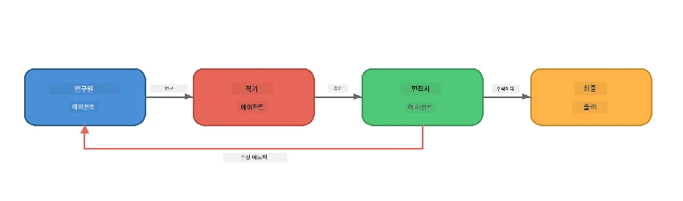
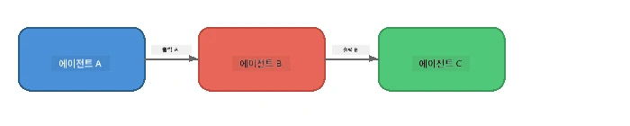
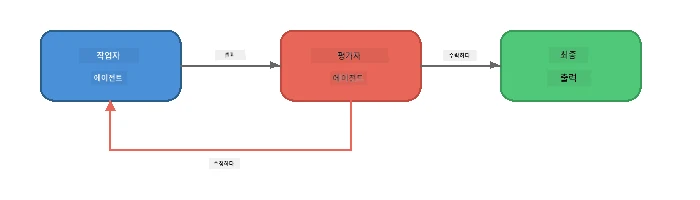
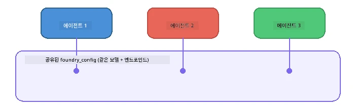

# 6부: 다중 에이전트 워크플로우

> **목표:** 여러 전문화된 에이전트를 결합하여 복잡한 작업을 협력하는 에이전트들 간에 분할하는 조정된 파이프라인을 구성 - 모두 Foundry Local에서 로컬로 실행.

## 왜 다중 에이전트인가?

하나의 에이전트가 많은 작업을 처리할 수 있지만, 복잡한 워크플로우는 <strong>전문화</strong>의 이점을 가집니다. 한 에이전트가 동시에 조사하고 작성하며 편집하기보다, 작업을 집중된 역할로 나눕니다:



| 패턴 | 설명 |
|---------|-------------|
| <strong>순차적</strong> | 에이전트 A의 출력이 에이전트 B→에이전트 C로 전달 |
| **피드백 루프** | 평가 에이전트가 작업을 수정하도록 다시 보낼 수 있음 |
| **공유 컨텍스트** | 모든 에이전트가 동일한 모델/엔드포인트를 사용하지만 다른 지침 적용 |
| **타입화된 출력** | 에이전트들이 신뢰성 있는 인계를 위해 구조화된 결과(JSON)를 생성 |

---

## 연습문제

### 연습문제 1 - 다중 에이전트 파이프라인 실행

워크숍에는 완전한 Researcher → Writer → Editor 워크플로우가 포함되어 있습니다.

<details>
<summary><strong>🐍 Python</strong></summary>

**설정:**
```bash
cd python
python -m venv venv

# Windows (PowerShell):
venv\Scripts\Activate.ps1
# macOS:
source venv/bin/activate

pip install -r requirements.txt
```

**실행:**
```bash
python foundry-local-multi-agent.py
```

**일어나는 일:**
1. <strong>Researcher</strong>가 주제를 받아 글머리 기호 사실을 반환
2. <strong>Writer</strong>가 조사를 받아 블로그 게시물 초안 작성(3~4단락)
3. <strong>Editor</strong>가 기사 품질을 검토하고 ACCEPT 또는 REVISE 반환

</details>

<details>
<summary><strong>📦 JavaScript</strong></summary>

**설정:**
```bash
cd javascript
npm install
```

**실행:**
```bash
node foundry-local-multi-agent.mjs
```

**동일한 3단계 파이프라인** - Researcher → Writer → Editor.

</details>

<details>
<summary><strong>💜 C#</strong></summary>

**설정:**
```bash
cd csharp
dotnet restore
```

**실행:**
```bash
dotnet run multi
```

**동일한 3단계 파이프라인** - Researcher → Writer → Editor.

</details>

---

### 연습문제 2 - 파이프라인 해부

에이전트가 어떻게 정의되고 연결되는지 연구하세요:

**1. 공유 모델 클라이언트**

모든 에이전트가 동일한 Foundry Local 모델을 공유:

```python
# Python - FoundryLocalClient는 모든 것을 처리합니다
from agent_framework_foundry_local import FoundryLocalClient

client = FoundryLocalClient(model_id="phi-3.5-mini")
```

```javascript
// JavaScript - Foundry Local을 대상으로 하는 OpenAI SDK
const client = new OpenAI({
  baseURL: manager.urls[0] + "/v1",
  apiKey: "foundry-local",
});
```

```csharp
// C# - OpenAIClient pointed at Foundry Local
var key = new ApiKeyCredential("foundry-local");
var client = new OpenAIClient(key, new OpenAIClientOptions
{
    Endpoint = new Uri(manager.Urls[0] + "/v1")
});
var chatClient = client.GetChatClient(model.Id);
```

**2. 전문화된 지침**

각 에이전트는 독특한 페르소나가 있음:

| 에이전트 | 지침 (요약) |
|-------|----------------------|
| Researcher | "핵심 사실, 통계, 배경을 제공. 글머리 기호로 정리." |
| Writer | "조사 노트로부터 매력적인 블로그 게시물(3~4단락) 작성. 사실을 조작하지 말 것." |
| Editor | "명확성, 문법, 사실 일관성 검토. 판단: ACCEPT 또는 REVISE." |

**3. 에이전트 간 데이터 흐름**

```python
# 1단계 - 연구원의 출력물이 작가의 입력물이 됩니다
research_result = await researcher.run(f"Research: {topic}")

# 2단계 - 작가의 출력물이 편집자의 입력물이 됩니다
writer_result = await writer.run(f"Write using:\n{research_result}")

# 3단계 - 편집자가 연구 및 기사 모두를 검토합니다
editor_result = await editor.run(
    f"Research:\n{research_result}\n\nArticle:\n{writer_result}"
)
```

```csharp
// C# - same pattern, async calls with AIAgent
var researchNotes = await researcher.RunAsync(
    $"Research the following topic and provide key facts:\n{topic}");

var draft = await writer.RunAsync(
    $"Write a blog post based on these research notes:\n\n{researchNotes}");

var verdict = await editor.RunAsync(
    $"Review this article for quality and accuracy.\n\n" +
    $"Research notes:\n{researchNotes}\n\n" +
    $"Article:\n{draft}");
```

> **핵심 통찰:** 각 에이전트는 이전 에이전트들의 누적 컨텍스트를 받음. 편집자는 원본 조사와 초안을 모두 봐서 사실 일관성을 확인할 수 있음.

---

### 연습문제 3 - 네 번째 에이전트 추가

파이프라인에 새 에이전트를 추가하여 확장하세요. 선택 항목:

| 에이전트 | 목적 | 지침 |
|-------|---------|-------------|
| **Fact-Checker** | 기사 내 주장 검증 | `"주장별로 연구 노트로 뒷받침되는지 여부를 검증하세요. 검증된/미검증 항목을 포함하는 JSON 반환."` |
| **Headline Writer** | 매력적인 제목 생성 | `"기사를 위한 5개의 헤드라인 옵션 생성. 스타일 다양화: 정보, 클릭베이트, 질문, 리스트, 감성."` |
| **Social Media** | 홍보 게시물 생성 | `"이 기사를 홍보하는 트위터(280자), 링크드인(전문적 톤), 인스타그램(이모지 제안 포함 캐주얼) 각각 3개의 소셜 미디어 게시물 생성."` |

<details>
<summary><strong>🐍 Python - 헤드라인 작성자 추가</strong></summary>

```python
headline_agent = client.as_agent(
    name="HeadlineWriter",
    instructions=(
        "You are a headline specialist. Given an article, generate exactly "
        "5 headline options. Vary the style: informative, question-based, "
        "listicle, emotional, and provocative. Return them as a numbered list."
    ),
)

# 편집자가 승인한 후, 헤드라인을 생성하세요
headline_result = await headline_agent.run(
    f"Generate headlines for this article:\n\n{writer_result}"
)
print(f"\n--- Headlines ---\n{headline_result}")
```

</details>

<details>
<summary><strong>📦 JavaScript - 헤드라인 작성자 추가</strong></summary>

```javascript
const headlineAgent = new ChatAgent({
  client,
  modelId: modelInfo.id,
  instructions:
    "You are a headline specialist. Given an article, generate exactly " +
    "5 headline options. Vary the style: informative, question-based, " +
    "listicle, emotional, and provocative. Return them as a numbered list.",
  name: "HeadlineWriter",
});

const headlineResult = await headlineAgent.run(
  `Generate headlines for this article:\n\n${writerResult.text}`
);
console.log(`\n--- Headlines ---\n${headlineResult.text}`);
```

</details>

<details>
<summary><strong>💜 C# - 헤드라인 작성자 추가</strong></summary>

```csharp
AIAgent headlineAgent = chatClient.AsAIAgent(
    name: "HeadlineWriter",
    instructions:
        "You are a headline specialist. Given an article, generate exactly " +
        "5 headline options. Vary the style: informative, question-based, " +
        "listicle, emotional, and provocative. Return them as a numbered list."
);

// After the editor accepts, generate headlines
var headlines = await headlineAgent.RunAsync(
    $"Generate headlines for this article:\n\n{draft}");
Console.WriteLine($"\n--- Headlines ---\n{headlines}");
```

</details>

---

### 연습문제 4 - 자신만의 워크플로우 설계

다른 도메인용 다중 에이전트 파이프라인을 설계하세요. 아이디어는 다음과 같습니다:

| 도메인 | 에이전트 | 흐름 |
|--------|--------|------|
| **코드 리뷰** | Analyser → Reviewer → Summariser | 코드 구조 분석 → 문제 리뷰 → 요약 보고서 생성 |
| **고객 지원** | Classifier → Responder → QA | 티켓 분류 → 응답 초안 작성 → 품질 확인 |
| <strong>교육</strong> | Quiz Maker → Student Simulator → Grader | 퀴즈 생성 → 답변 시뮬레이션 → 채점 및 해설 |
| **데이터 분석** | Interpreter → Analyst → Reporter | 데이터 요청 해석 → 패턴 분석 → 보고서 작성 |

**단계:**
1. 각기 다른 `instructions`를 가진 3개 이상 에이전트 정의
2. 데이터 흐름 결정 - 각 에이전트가 무엇을 받고 생성하는지
3. 연습문제 1-3의 패턴을 사용하여 파이프라인 구현
4. 한 에이전트가 다른 에이전트 작업을 평가한다면 피드백 루프 추가

---

## 조정 패턴

다음은 모든 다중 에이전트 시스템에 적용되는 조정 패턴입니다 ([7부](part7-zava-creative-writer.md)에서 심층 탐구):

### 순차적 파이프라인



각 에이전트가 이전 에이전트의 출력을 처리. 간단하고 예측 가능.

### 피드백 루프



평가 에이전트가 이전 단계를 다시 실행하도록 트리거할 수 있음. Zava Writer가 이 방식을 사용: 편집자는 연구자와 작가에게 피드백을 보낼 수 있음.

### 공유 컨텍스트



모든 에이전트가 동일한 `foundry_config`를 공유하여 동일 모델, 엔드포인트 사용.

---

## 핵심 요점

| 개념 | 배운 내용 |
|---------|-----------------|
| 에이전트 전문화 | 각 에이전트는 집중된 지침으로 한 가지를 잘 수행 |
| 데이터 인계 | 한 에이전트의 출력이 다음 에이전트의 입력이 됨 |
| 피드백 루프 | 평가자가 품질 향상을 위해 재시도를 트리거 가능 |
| 구조화된 출력 | JSON 형식 응답으로 신뢰성 있는 에이전트 간 통신 보장 |
| 조정 | 코디네이터가 파이프라인 순서 및 오류 처리를 관리 |
| 생산 패턴 | [7부: Zava Creative Writer](part7-zava-creative-writer.md)에 적용됨 |

---

## 다음 단계

[7부: Zava Creative Writer - 캡스톤 애플리케이션](part7-zava-creative-writer.md)으로 계속 진행하여 4개의 전문화된 에이전트, 스트리밍 출력, 제품 검색, 피드백 루프를 포함한 프로덕션 스타일 다중 에이전트 앱을 Python, JavaScript, C#에서 탐구하세요.