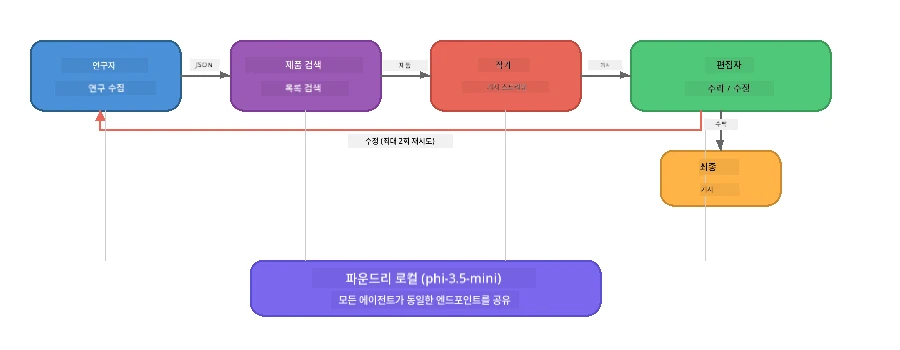

# 7부: Zava 크리에이티브 라이터 - 캡스톤 애플리케이션

> **목표:** 네 명의 전문화된 에이전트가 협력하여 Zava Retail DIY용 잡지 품질 수준의 기사를 생성하는 생산 스타일의 다중 에이전트 애플리케이션을 Foundry Local을 사용해 전적으로 로컬 장치에서 실행하는 방식을 탐구합니다.

이 실습은 워크숍의 <strong>캡스톤 실습</strong>입니다. SDK 통합(3부), 로컬 데이터 검색(4부), 에이전트 페르소나(5부), 다중 에이전트 오케스트레이션(6부) 등 지금까지 배운 모든 내용을 하나로 모아 **Python**, **JavaScript**, <strong>C#</strong>로 완성된 애플리케이션으로 제공합니다.

---

## 탐구할 내용

| 개념 | Zava 라이터 내 위치 |
|---------|----------------------------|
| 4단계 모델 로딩 | 공유 설정 모듈이 Foundry Local 부트스트랩 |
| RAG 스타일 검색 | 제품 에이전트가 로컬 카탈로그 검색 |
| 에이전트 전문화 | 서로 다른 시스템 프롬프트를 가진 4개 에이전트 |
| 스트리밍 출력 | 라이터가 실시간 토큰을 출력 |
| 구조화된 인계 | 리서처 → JSON, 에디터 → JSON 결정 |
| 피드백 루프 | 에디터가 최대 2회 재실행 트리거 가능 |

---

## 아키텍처

Zava 크리에이티브 라이터는 <strong>평가자 주도 피드백이 있는 순차 파이프라인</strong>을 사용합니다. 세 가지 언어 구현 모두 동일한 아키텍처를 따릅니다:



### 네 개의 에이전트

| 에이전트 | 입력 | 출력 | 목적 |
|-------|-------|--------|---------|
| <strong>리서처</strong> | 주제 + 선택적 피드백 | `{"web": [{url, name, description}, ...]}` | LLM을 통해 배경 조사를 수집 |
| **제품 검색** | 제품 컨텍스트 문자열 | 일치하는 제품 목록 | LLM 생성 쿼리 + 로컬 카탈로그 키워드 검색 |
| <strong>라이터</strong> | 조사 + 제품 + 과제 + 피드백 | `---`로 분할된 스트리밍 기사 텍스트 | 실시간으로 잡지 품질의 기사 초안 작성 |
| <strong>에디터</strong> | 기사 + 라이터의 자체 피드백 | `{"decision": "accept/revise", "editorFeedback": "...", "researchFeedback": "..."}` | 품질 검토, 필요 시 재실행 트리거 |

### 파이프라인 흐름

1. <strong>리서처</strong>가 주제를 받아 구조화된 조사 노트(JSON)를 생성
2. <strong>제품 검색</strong>이 LLM 작성 검색어를 사용해 로컬 제품 카탈로그 쿼리
3. <strong>라이터</strong>가 조사 + 제품 + 과제를 결합해 스트리밍 기사 작성, `---` 구분자 뒤에 자체 피드백 추가
4. <strong>에디터</strong>가 기사를 검토 후 JSON 판결 반환:
   - `"accept"` → 파이프라인 완료
   - `"revise"` → 피드백이 리서처와 라이터에게 다시 전달(최대 2회 재시도)

---

## 사전 요구사항

- [6부: 다중 에이전트 워크플로우](part6-multi-agent-workflows.md) 완료
- Foundry Local CLI 설치 및 `phi-3.5-mini` 모델 다운로드 완료

---

## 실습

### 실습 1 - Zava 크리에이티브 라이터 실행

언어를 선택하고 애플리케이션 실행:

<details>
<summary><strong>🐍 Python - FastAPI 웹 서비스</strong></summary>

Python 버전은 REST API를 갖춘 <strong>웹 서비스</strong>로 실행되며, 생산용 백엔드 구축 방식을 보여줍니다.

**설치:**
```bash
cd zava-creative-writer-local/src/api
python -m venv venv

# Windows (PowerShell):
venv\Scripts\Activate.ps1
# macOS:
source venv/bin/activate

pip install -r requirements.txt
```

**실행:**
```bash
uvicorn main:app --reload
```

**테스트:**
```bash
curl -X POST http://localhost:8000/api/article \
  -H "Content-Type: application/json" \
  -d '{
    "research": "DIY home improvement trends",
    "products": "power tools and paints",
    "assignment": "Write an article about weekend renovation projects for DIY enthusiasts"
  }'
```

응답은 각 에이전트 진행 상황을 나타내는 줄바꿈 구분 JSON 메시지로 스트리밍됩니다.

</details>

<details>
<summary><strong>📦 JavaScript - Node.js CLI</strong></summary>

JavaScript 버전은 <strong>CLI 애플리케이션</strong>으로 실행되며, 에이전트 진행상황과 기사를 콘솔에 직접 출력합니다.

**설치:**
```bash
cd zava-creative-writer-local/src/javascript
npm install
```

**실행:**
```bash
node main.mjs
```

다음 내용을 확인할 수 있습니다:
1. Foundry Local 모델 로딩 (다운로드 중일 경우 진행률 표시)
2. 각 에이전트가 순차적으로 실행되며 상태 메시지 출력
3. 실시간 콘솔에 스트리밍되는 기사
4. 에디터의 수락/수정 결정

</details>

<details>
<summary><strong>💜 C# - .NET 콘솔 앱</strong></summary>

C# 버전은 동일한 파이프라인과 스트리밍 출력을 갖춘 <strong>.NET 콘솔 애플리케이션</strong>으로 실행됩니다.

**설치:**
```bash
cd zava-creative-writer-local/src/csharp
dotnet restore
```

**실행:**
```bash
dotnet run
```

JavaScript 버전과 같은 출력 패턴 - 에이전트 상태 메시지, 스트리밍 기사, 에디터 판결.

</details>

---

### 실습 2 - 코드 구조 분석

각 언어 구현체는 동일한 논리적 구성 요소를 가집니다. 구조를 비교해 보세요:

**Python** (`src/api/`):
| 파일 | 역할 |
|------|---------|
| `foundry_config.py` | 공유 Foundry Local 관리자, 모델, 클라이언트(4단계 초기화) |
| `orchestrator.py` | 파이프라인 조율 및 피드백 루프 |
| `main.py` | FastAPI 엔드포인트 (`POST /api/article`) |
| `agents/researcher/researcher.py` | JSON 출력 기반 LLM 연구 |
| `agents/product/product.py` | LLM 생성 쿼리 + 키워드 검색 |
| `agents/writer/writer.py` | 스트리밍 기사 생성 |
| `agents/editor/editor.py` | JSON 기반 수락/수정 결정 |

**JavaScript** (`src/javascript/`):
| 파일 | 역할 |
|------|---------|
| `foundryConfig.mjs` | 공유 Foundry Local 설정 (진행률 표시 포함 4단계 초기화) |
| `main.mjs` | 오케스트레이터 + CLI 진입점 |
| `researcher.mjs` | LLM 연구 에이전트 |
| `product.mjs` | LLM 쿼리 생성 + 키워드 검색 |
| `writer.mjs` | 스트리밍 기사 생성 (비동기 제너레이터) |
| `editor.mjs` | JSON 수락/수정 결정 |
| `products.mjs` | 제품 카탈로그 데이터 |

**C#** (`src/csharp/`):
| 파일 | 역할 |
|------|---------|
| `Program.cs` | 전체 파이프라인: 모델 로딩, 에이전트, 오케스트레이터, 피드백 루프 |
| `ZavaCreativeWriter.csproj` | Foundry Local + OpenAI 패키지를 포함한 .NET 9 프로젝트 |

> **설계 노트:** Python은 각 에이전트를 별도의 파일/디렉토리로 분리(대규모 팀에 적합). JavaScript는 에이전트별 모듈 하나씩(중간 규모 프로젝트에 적합). C#은 모든 코드를 하나의 파일과 로컬 함수로 구성(독립 실행형 예제에 적합). 생산 환경에서는 팀 규칙에 맞는 패턴을 선택하세요.

---

### 실습 3 - 공유 구성 추적

파이프라인의 모든 에이전트가 단일 Foundry Local 모델 클라이언트를 공유합니다. 각 언어에서 설정된 방식을 살펴보세요:

<details>
<summary><strong>🐍 Python - foundry_config.py</strong></summary>

```python
from foundry_local import FoundryLocalManager

MODEL_ALIAS = "phi-3.5-mini"

# 1단계: 매니저를 생성하고 Foundry Local 서비스를 시작합니다
manager = FoundryLocalManager()
manager.start_service()

# 2단계: 모델이 이미 다운로드되었는지 확인합니다
cached = manager.list_cached_models()
catalog_info = manager.get_model_info(MODEL_ALIAS)
is_cached = any(m.id == catalog_info.id for m in cached) if catalog_info else False

if not is_cached:
    manager.download_model(MODEL_ALIAS)

# 3단계: 모델을 메모리에 로드합니다
manager.load_model(MODEL_ALIAS)
model_id = manager.get_model_info(MODEL_ALIAS).id

# 공유 OpenAI 클라이언트
client = openai.OpenAI(base_url=manager.endpoint, api_key=manager.api_key)
```

모든 에이전트는 `from foundry_config import client, model_id`를 임포트합니다.

</details>

<details>
<summary><strong>📦 JavaScript - foundryConfig.mjs</strong></summary>

```javascript
import { FoundryLocalManager } from "foundry-local-sdk";
import { OpenAI } from "openai";

FoundryLocalManager.create({ appName: "ZavaCreativeWriter" });
const manager = FoundryLocalManager.instance;
await manager.startWebService();

// 캐시 확인 → 다운로드 → 로드 (새 SDK 패턴)
const catalog = manager.catalog;
const model = await catalog.getModel(MODEL_ALIAS);
if (!model.isCached) {
  console.log(`Downloading model: ${MODEL_ALIAS}...`);
  await model.download();
}
await model.load();

const client = new OpenAI({ baseURL: manager.urls[0] + "/v1", apiKey: "foundry-local" });
const modelId = model.id;
export { client, modelId };
```

모든 에이전트는 `import { client, modelId } from "./foundryConfig.mjs"`를 사용합니다.

</details>

<details>
<summary><strong>💜 C# - Program.cs 상단</strong></summary>

```csharp
await FoundryLocalManager.CreateAsync(
    new Configuration
    {
        AppName = "ZavaCreativeWriter",
        Web = new Configuration.WebService { Urls = "http://127.0.0.1:0" }
    }, NullLogger.Instance, default);
var manager = FoundryLocalManager.Instance;
await manager.StartWebServiceAsync(default);

var catalog = await manager.GetCatalogAsync(default);
var catalogModel = await catalog.GetModelAsync(alias, default);
var isCached = await catalogModel.IsCachedAsync(default);
if (!isCached)
    await catalogModel.DownloadAsync(null, default);

await catalogModel.LoadAsync(default);
var key = new ApiKeyCredential("foundry-local");
var chatClient = new OpenAIClient(key, new OpenAIClientOptions
{
    Endpoint = new Uri(manager.Urls[0] + "/v1")
}).GetChatClient(catalogModel.Id);
```

`chatClient`를 같은 파일 내 모든 에이전트 함수에 전달합니다.

</details>

> **핵심 패턴:** 모델 로딩 패턴(서비스 시작 → 캐시 확인 → 다운로드 → 로드)은 사용자에게 명확한 진행 상황을 보여주고, 모델을 한 번만 다운로드하도록 보장합니다. Foundry Local 애플리케이션의 모범 사례입니다.

---

### 실습 4 - 피드백 루프 이해

피드백 루프는 이 파이프라인을 "스마트"하게 만드는 원리입니다 - 에디터가 작업을 수정 요청으로 되돌릴 수 있습니다. 로직을 추적해 보세요:

```
Orchestrator:
  1. researcher.research(topic, "No Feedback")    ← first pass
  2. product.findProducts(productContext)
  3. writer.write(research, products, assignment)  ← streams article
  4. Split article at "---" → article + writerFeedback
  5. editor.edit(article, writerFeedback)

  WHILE editor says "revise" AND retryCount < 2:
    6. researcher.research(topic, editor.researchFeedback)  ← refined
    7. writer.write(research, products, editor.editorFeedback)
    8. editor.edit(newArticle, newWriterFeedback)
    9. retryCount++
```

**고려할 질문:**
- 재시도 제한이 2로 설정된 이유는? 더 늘리면 어떻게 될까?
- 리서처는 `researchFeedback`를 받고 라이터는 `editorFeedback`을 받는 이유는?
- 에디터가 항상 "수정"이라면 어떤 일이 발생할까?

---

### 실습 5 - 에이전트 수정

한 에이전트의 동작을 변경해 파이프라인에 미치는 영향을 관찰해 보세요:

| 변경사항 | 수정 내용 |
|-------------|----------------|
| **더 엄격한 에디터** | 에디터 시스템 프롬프트를 항상 최소 한 번 수정 요청하도록 변경 |
| **더 긴 기사** | 라이터 프롬프트의 "800-1000 단어"를 "1500-2000 단어"로 변경 |
| **다른 제품** | 제품 카탈로그에 제품 추가 또는 수정 |
| **새 연구 주제** | 기본 `researchContext`를 다른 주제로 변경 |
| **JSON 전용 리서처** | 리서처가 3-5개 대신 10개 항목 반환하도록 변경 |

> **팁:** 세 가지 언어가 동일 아키텍처를 구현하므로, 익숙한 언어에서 동일한 수정을 하면 됩니다.

---

### 실습 6 - 다섯 번째 에이전트 추가

파이프라인에 새 에이전트를 확장해 보세요. 예시:

| 에이전트 | 파이프라인 위치 | 목적 |
|-------|-------------------|---------|
| <strong>팩트체커</strong> | 라이터 다음, 에디터 이전 | 조사 데이터에 대해 주장 검증 |
| **SEO 최적화기** | 에디터 수락 이후 | 메타 설명, 키워드, 슬러그 추가 |
| <strong>일러스트레이터</strong> | 에디터 수락 이후 | 기사용 이미지 프롬프트 생성 |
| <strong>번역가</strong> | 에디터 수락 이후 | 기사 다른 언어로 번역 |

**단계:**
1. 에이전트 시스템 프롬프트 작성
2. 에이전트 함수 생성 (언어별 기존 패턴에 맞춤)
3. 적절한 위치에 오케스트레이터에 삽입
4. 출력/로그 업데이트로 새 에이전트 기여도 표시

---

## Foundry Local과 에이전트 프레임워크의 협력 방식

이 애플리케이션은 Foundry Local로 다중 에이전트 시스템을 구축하기 위한 권장 패턴을 보여줍니다:

| 레이어 | 구성 요소 | 역할 |
|-------|-----------|------|
| <strong>런타임</strong> | Foundry Local | 로컬에서 모델 다운로드, 관리 및 제공 |
| <strong>클라이언트</strong> | OpenAI SDK | 로컬 엔드포인트에 채팅 완료 요청 전송 |
| <strong>에이전트</strong> | 시스템 프롬프트 + 채팅 호출 | 집중된 지시를 통한 전문화된 동작 |
| <strong>오케스트레이터</strong> | 파이프라인 조정자 | 데이터 흐름, 순서 지정, 피드백 루프 관리 |
| <strong>프레임워크</strong> | Microsoft Agent Framework | `ChatAgent` 추상화 및 패턴 제공 |

핵심 인사이트: **Foundry Local은 클라우드 백엔드를 대체할 뿐, 애플리케이션 아키텍처는 대체하지 않습니다.** 에이전트 패턴, 오케스트레이션 전략, 구조화된 인계 방식 모두 클라우드에서 운영되는 모델과 동일하게 로컬 모델과도 작동하며, 단지 클라이언트가 Azure 엔드포인트 대신 로컬 엔드포인트를 가리키기만 하면 됩니다.

---

## 주요 시사점

| 개념 | 배우는 점 |
|---------|-----------------|
| 생산 아키텍처 | 공유 설정과 개별 에이전트를 가진 다중 에이전트 앱 구조화 방법 |
| 4단계 모델 로딩 | 사용자에게 진행 상황을 보여주는 Foundry Local 초기화 최적 관행 |
| 에이전트 전문화 | 4개 에이전트 각각이 집중된 지시와 특정 출력 형식 보유 |
| 스트리밍 생성 | 라이터가 실시간으로 토큰을 출력해 반응형 UI 지원 |
| 피드백 루프 | 에디터 기반 재시도가 인간 개입 없이 품질 개선 |
| 다중 언어 패턴 | 동일 아키텍처가 Python, JavaScript, C#에서 작동 |
| 로컬 = 생산 준비 완료 | Foundry Local이 클라우드 배포에서 사용하는 OpenAI 호환 API 제공 |

---

## 다음 단계

[8부: 평가 주도 개발](part8-evaluation-led-development.md)로 이동하여 골든 데이터셋, 규칙 기반 검사, LLM-판사 점수를 활용한 에이전트용 체계적 평가 프레임워크를 구축하세요.