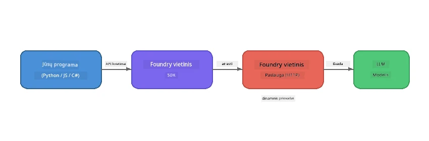

# 1 dalis: Pradžia su Foundry Local


## Kas yra Foundry Local?

[Foundry Local](https://foundrylocal.ai) leidžia jums paleisti atvirojo kodo AI kalbos modelius **tiesiogiai jūsų kompiuteryje** – nereikia interneto, jokių debesijos išlaidų ir visiška duomenų privatumo apsauga. Jis:

- **Atsisiunčia ir paleidžia modelius vietoje** su automatinio aparatūros optimizavimo funkcija (GPU, CPU arba NPU)
- **Teikia OpenAI suderinamą API**, kad galėtumėte naudoti pažįstamus SDK ir įrankius
- **Nereikalauja „Azure“ prenumeratos** ar registracijos – tiesiog įdiekite ir pradėkite kurti

Įsivaizduokite tai kaip savo asmeninį AI, kuris veikia visiškai jūsų įrenginyje.

## Mokymosi tikslai

Baigę šią laboratoriją galėsite:

- Įdiegti Foundry Local CLI savo operacinėje sistemoje
- Suprasti, kas yra modelių alias’ai ir kaip jie veikia
- Atsisiųsti ir paleisti pirmąjį vietinį AI modelį
- Iš komandų eilutės siųsti pokalbio žinutę vietiniam modeliui
- Suprasti skirtumą tarp vietinių ir debesyje talpinamų AI modelių

---

## Prieš sąlygos

### Sistemos reikalavimai

| Reikalavimas | Minimalus | Rekomenduojamas |
|-------------|---------|-------------|
| **RAM** | 8 GB | 16 GB |
| **Disko vieta** | 5 GB (modeliams) | 10 GB |
| **CPU** | 4 branduoliai | 8+ branduolių |
| **GPU** | Pasirinktinai | NVIDIA su CUDA 11.8+ |
| **OS** | Windows 10/11 (x64/ARM), Windows Server 2025, macOS 13+ | - |

> **Pastaba:** Foundry Local automatiškai parenka geriausią modelio variantą jūsų aparatūrai. Jei turite NVIDIA GPU, naudojama CUDA akceleracija. Jei turite Qualcomm NPU, naudojama jis. Kitais atvejais pasirenkama optimizuota CPU versija.

### Įdiekite Foundry Local CLI

**Windows** (PowerShell):  
```powershell
winget install Microsoft.FoundryLocal
```
  
**macOS** (Homebrew):  
```bash
brew tap microsoft/foundrylocal
brew install foundrylocal
```
  
> **Pastaba:** Šiuo metu Foundry Local palaiko tik Windows ir macOS. Linux nėra palaikomas šiuo metu.

Patikrinkite diegimą:  
```bash
foundry --version
```
  
---

## Laboratorinės užduotys

### Užduotis 1: Ištirkite turimus modelius

Foundry Local apima katalogą iš anksto optimizuotų atvirojo kodo modelių. Išvardinkite juos:

```bash
foundry model list
```
  
Pamatysite tokius modelius kaip:
- `phi-3.5-mini` – Microsoft 3,8 milijardų parametrų modelis (greitas, gera kokybė)
- `phi-4-mini` – naujesnis, galingesnis Phi modelis
- `phi-4-mini-reasoning` – Phi modelis su grandinės mąstymo (chain-of-thought) funkcija (`<think>` žymos)
- `phi-4` – didžiausias Microsoft Phi modelis (10,4 GB)
- `qwen2.5-0.5b` – labai mažas ir greitas (tinka mažos galios įrenginiams)
- `qwen2.5-7b` – stiprus bendros paskirties modelis su įrankių kvietimų palaikymu
- `qwen2.5-coder-7b` – optimizuotas kodo generavimui
- `deepseek-r1-7b` – stiprus mąstymo modelis
- `gpt-oss-20b` – didelis atvirojo kodo modelis (MIT licencija, 12,5 GB)
- `whisper-base` – kalbos į tekstą transkripcija (383 MB)
- `whisper-large-v3-turbo` – aukštos tikslumo transkripcija (9 GB)

> **Kas yra modelio alias’as?** Tokie alias’ai kaip `phi-3.5-mini` yra sutrumpinimai. Naudodami alias’ą Foundry Local automatiškai atsisiunčia geriausią variantą pagal jūsų aparatūrą (CUDA NVIDIA GPU atveju, kitaip optimizuotą CPU versiją). Jums niekada nereikia rinktis tinkamo varianto.

### Užduotis 2: Paleiskite savo pirmą modelį

Atsisiųskite ir pradėkite interaktyviai bendrauti su modeliu:

```bash
foundry model run phi-3.5-mini
```
  
Pirmą kartą paleidus, Foundry Local:  
1. Aptinka jūsų aparatūrą  
2. Atsisiunčia optimalų modelio variantą (tai gali užtrukti kelias minutes)  
3. Įkelia modelį į atmintį  
4. Paleidžia interaktyvią pokalbio sesiją  

Paklauskite modelio keletą klausimų:  
```
You: What is the golden ratio?
You: Can you explain it as if I were 10 years old?
You: Write a haiku about mathematics
```
  
Norėdami išeiti, įveskite `exit` arba paspauskite `Ctrl+C`.

### Užduotis 3: Iš anksto atsisiųskite modelį

Jei norite atsisiųsti modelį nepradedant pokalbio:

```bash
foundry model download phi-3.5-mini
```
  
Patikrinkite, kurie modeliai jau yra atsisiųsti jūsų įrenginyje:

```bash
foundry cache list
```
  
### Užduotis 4: Supraskite architektūrą

Foundry Local veikia kaip **vietinė HTTP paslauga**, suteikianti OpenAI suderinamą REST API. Tai reiškia:

1. Paslauga paleidžiama **dinaminiu prievadu** (kiekvieną kartą skirtingu)
2. Naudodami SDK sužinote tikslų paslaugos URL
3. Galite naudoti **bet kurią** OpenAI suderinamą klientų biblioteką, norėdami komunikuoti



> **Svarbu:** Foundry Local kiekvieną kartą priskiria **dinaminį prievadą**. Niekada nekoduokite prievado numerio kaip `localhost:5272`. Visada naudokite SDK, kad sužinotumėte dabartinį URL (pvz., `manager.endpoint` Python ar `manager.urls[0]` JavaScripte).

---

## Svarbiausi dalykai

| Sąvoka | Ko išmokote |
|---------|------------------|
| Įrenginio AI | Foundry Local paleidžia modelius visiškai jūsų įrenginyje, be debesijos, be API raktų ir be išlaidų |
| Modelių alias’ai | Alias’ai kaip `phi-3.5-mini` automatiškai parenka geriausią variantą jūsų aparatūrai |
| Dinaminiai prievadai | Paslauga veikia ant dinaminio prievado; visada naudokite SDK, kad sužinotumėte galutinį URL |
| CLI ir SDK | Su modeliais galite bendrauti per CLI (`foundry model run`) arba programiškai per SDK |

---

## Tolimesni žingsniai

Tęskite į [2 dalį: Foundry Local SDK giluminis pažinimas](part2-foundry-local-sdk.md), kad įvaldytumėte SDK API modelių, paslaugų ir talpyklos valdymui programiškai.

---

<!-- CO-OP TRANSLATOR DISCLAIMER START -->
**Atsakomybės ribojimas**:  
Šis dokumentas buvo išverstas naudojant dirbtinio intelekto vertimo paslaugą [Co-op Translator](https://github.com/Azure/co-op-translator). Nors siekiame tikslumo, atkreipkite dėmesį, kad automatiniai vertimai gali turėti klaidų ar netikslumų. Originalus dokumentas gimtąja kalba turėtų būti laikomas autoritetingu šaltiniu. Kritiškai svarbiai informacijai rekomenduojamas profesionalus žmogaus vertimas. Mes neatsakome už jokią neteisingą supratimą ar klaidinančią interpretaciją, kylančią iš šio vertimo naudojimo.
<!-- CO-OP TRANSLATOR DISCLAIMER END -->