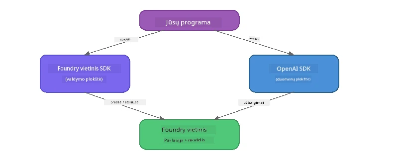

# 3 dalis: Foundry Local SDK naudojimas su OpenAI

## Apžvalga

1 dalyje naudojote Foundry Local CLI, kad interaktyviai paleistumėte modelius. 2 dalyje ištyrėte visą SDK API sąsają. Dabar išmoksite **integruoti Foundry Local į savo programas** naudodami SDK ir su OpenAI suderinamą API.

Foundry Local teikia SDK trim kalboms. Pasirinkite tą, su kuria jaučiatės patogiausiai – koncepcijos visose trijose yra identiškos.

## Mokymosi tikslai

Po šios laboratorijos gebėsite:

- Įdiegti Foundry Local SDK savo kalbai (Python, JavaScript arba C#)
- Inicializuoti `FoundryLocalManager`, kad paleistumėte servisą, patikrintumėte talpyklą, parsisiųstumėte ir įkeltumėte modelį
- Prisijungti prie vietinio modelio naudojant OpenAI SDK
- Siųsti pokalbių užklausas ir apdoroti srautinius atsakymus
- Suprasti dinaminę prievadų architektūrą

---

## Reikalavimai

Pirmiausia užbaikite [1 dalį: Pradžia su Foundry Local](part1-getting-started.md) ir [2 dalį: Foundry Local SDK išsamiai](part2-foundry-local-sdk.md).

Įdiekite **vieną** iš šių kalbų vykdymo aplinkų:
- **Python 3.9+** – [python.org/downloads](https://www.python.org/downloads/)
- **Node.js 18+** – [nodejs.org](https://nodejs.org/)
- **.NET 9.0+** – [dot.net/download](https://dotnet.microsoft.com/download)

---

## Koncepcija: Kaip veikia SDK

Foundry Local SDK valdo **kontrolės plokštumą** (serviso paleidimą, modelių parsisiuntimą), o OpenAI SDK tvarko **duomenų plokštumą** (užklausų siuntimą, atsakymų gavimą).



---

## Laboratorijos užduotys

### Užduotis 1: Sukurkite savo aplinką

<details>
<summary><b>🐍 Python</b></summary>

```bash
cd python
python -m venv venv

# Aktyvuokite virtualią aplinką:
# Windows (PowerShell):
venv\Scripts\Activate.ps1
# Windows (Command Prompt):
venv\Scripts\activate.bat
# macOS:
source venv/bin/activate

pip install -r requirements.txt
```

`requirements.txt` įdiegia:
- `foundry-local-sdk` – Foundry Local SDK (importuojamas kaip `foundry_local`)
- `openai` – OpenAI Python SDK
- `agent-framework` – Microsoft Agent Framework (naudojamas vėlesnėse dalyse)

</details>

<details>
<summary><b>📘 JavaScript</b></summary>

```bash
cd javascript
npm install
```

`package.json` įdiegia:
- `foundry-local-sdk` – Foundry Local SDK
- `openai` – OpenAI Node.js SDK

</details>

<details>
<summary><b>💜 C#</b></summary>

```bash
cd csharp
dotnet restore
dotnet build
```

`csharp.csproj` naudoja:
- `Microsoft.AI.Foundry.Local` – Foundry Local SDK (NuGet)
- `OpenAI` – OpenAI C# SDK (NuGet)

> **Projekto struktūra:** C# projekte `Program.cs` faile yra komandų maršrutizatorius, kuris nukreipia į atskirus pavyzdžių failus. Šiai daliai paleiskite `dotnet run chat` (arba tiesiog `dotnet run`). Kitos dalys yra `dotnet run rag`, `dotnet run agent` ir `dotnet run multi`.

</details>

---

### Užduotis 2: Pagrindinis pokalbio užbaigimas

Atidarykite pagrindinį pokalbio pavyzdį jūsų kalbos ir peržiūrėkite kodą. Kiekvienas scenarijus laikosi trijų žingsnių sekos:

1. **Paleiskite servisą** – `FoundryLocalManager` paleidžia Foundry Local vykdymo aplinką
2. **Parsisiųskite ir įkelkite modelį** – patikrinkite talpyklą, jeigu reikia – parsisiųskite, po to įkelkite į atmintį
3. **Sukurkite OpenAI klientą** – prisijunkite prie vietinio taško ir siųskite srautinį pokalbio užbaigimą

<details>
<summary><b>🐍 Python – <code>python/foundry-local.py</code></b></summary>

```python
import sys
import openai
from foundry_local import FoundryLocalManager

alias = "phi-3.5-mini"

# 1 žingsnis: Sukurkite FoundryLocalManager ir paleiskite paslaugą
print("Starting Foundry Local service...")
manager = FoundryLocalManager()
manager.start_service()

# 2 žingsnis: Patikrinkite, ar modelis jau yra atsisiųstas
cached = manager.list_cached_models()
catalog_info = manager.get_model_info(alias)
is_cached = any(m.id == catalog_info.id for m in cached) if catalog_info else False

if is_cached:
    print(f"Model already downloaded: {alias}")
else:
    print(f"Downloading model: {alias} (this may take several minutes)...")
    manager.download_model(alias)
    print(f"Download complete: {alias}")

# 3 žingsnis: Įkelkite modelį į atmintį
print(f"Loading model: {alias}...")
manager.load_model(alias)

# Sukurkite OpenAI klientą, nurodydami VIETINĘ Foundry paslaugą
client = openai.OpenAI(
    base_url=manager.endpoint,   # Dinaminis prievadas – niekada nekoduokite jo kietai!
    api_key=manager.api_key
)

# Generuoti srautinį pokalbio užbaigimą
stream = client.chat.completions.create(
    model=manager.get_model_info(alias).id,
    messages=[{"role": "user", "content": "What is the golden ratio?"}],
    stream=True,
)

for chunk in stream:
    if chunk.choices[0].delta.content is not None:
        print(chunk.choices[0].delta.content, end="", flush=True)
print()
```

**Paleiskite:**
```bash
python foundry-local.py
```

</details>

<details>
<summary><b>📘 JavaScript – <code>javascript/foundry-local.mjs</code></b></summary>

```javascript
import { OpenAI } from "openai";
import { FoundryLocalManager } from "foundry-local-sdk";

const alias = "phi-3.5-mini";

// 1 žingsnis: Paleiskite Foundry Local paslaugą
console.log("Starting Foundry Local service...");
FoundryLocalManager.create({ appName: "FoundryLocalWorkshop" });
const manager = FoundryLocalManager.instance;
await manager.startWebService();

// 2 žingsnis: Patikrinkite, ar modelis jau yra atsisiųstas
const catalog = manager.catalog;
const model = await catalog.getModel(alias);

if (model.isCached) {
  console.log(`Model already downloaded: ${alias}`);
} else {
  console.log(`Downloading model: ${alias} (this may take several minutes)...`);
  await model.download();
  console.log(`Download complete: ${alias}`);
}

// 3 žingsnis: Įkelkite modelį į atmintį
console.log(`Loading model: ${alias}...`);
await model.load();
console.log(`Model loaded: ${model.id}`);

// Sukurkite OpenAI klientą, nukreiptą į VIETINĘ Foundry paslaugą
const client = new OpenAI({
  baseURL: manager.urls[0] + "/v1",   // Dinaminis prievadas – niekada neįrašykite fiksuoto numerio!
  apiKey: "foundry-local",
});

// Generuokite srautinį pokalbio užbaigimą
const stream = await client.chat.completions.create({
  model: model.id,
  messages: [{ role: "user", content: "What is the golden ratio?" }],
  stream: true,
});

for await (const chunk of stream) {
  if (chunk.choices[0]?.delta?.content) {
    process.stdout.write(chunk.choices[0].delta.content);
  }
}
console.log();
```

**Paleiskite:**
```bash
node foundry-local.mjs
```

</details>

<details>
<summary><b>💜 C# – <code>csharp/BasicChat.cs</code></b></summary>

```csharp
using Microsoft.AI.Foundry.Local;
using Microsoft.Extensions.Logging.Abstractions;
using OpenAI;
using OpenAI.Chat;
using System.ClientModel;

var alias = "phi-3.5-mini";

// Step 1: Start the Foundry Local service
Console.WriteLine("Starting Foundry Local service...");
await FoundryLocalManager.CreateAsync(
    new Configuration
    {
        AppName = "FoundryLocalSamples",
        Web = new Configuration.WebService { Urls = "http://127.0.0.1:0" }
    }, NullLogger.Instance, default);
var manager = FoundryLocalManager.Instance;
await manager.StartWebServiceAsync(default);

// Step 2: Get the model from the catalog
var catalog = await manager.GetCatalogAsync(default);
var model = await catalog.GetModelAsync(alias, default);

// Step 3: Check if the model is already downloaded
var isCached = await model.IsCachedAsync(default);

if (isCached)
{
    Console.WriteLine($"Model already downloaded: {alias}");
}
else
{
    Console.WriteLine($"Downloading model: {alias} (this may take several minutes)...");
    await model.DownloadAsync(null, default);
    Console.WriteLine($"Download complete: {alias}");
}

// Step 4: Load the model into memory
Console.WriteLine($"Loading model: {alias}...");
await model.LoadAsync(default);
Console.WriteLine($"Loaded model: {model.Id}");
Console.WriteLine($"Endpoint: {manager.Urls[0]}");

// Create OpenAI client pointing to the LOCAL Foundry service
var key = new ApiKeyCredential("foundry-local");
var client = new OpenAIClient(key, new OpenAIClientOptions
{
    Endpoint = new Uri(manager.Urls[0] + "/v1")  // Dynamic port - never hardcode!
});

var chatClient = client.GetChatClient(model.Id);

// Stream a chat completion
var completionUpdates = chatClient.CompleteChatStreaming("What is the golden ratio?");

foreach (var update in completionUpdates)
{
    if (update.ContentUpdate.Count > 0)
    {
        Console.Write(update.ContentUpdate[0].Text);
    }
}
Console.WriteLine();
```

**Paleiskite:**
```bash
dotnet run chat
```

</details>

---

### Užduotis 3: Eksperimentuokite su užklausomis

Kai veiks jūsų pagrindinis pavyzdys, galite modifikuoti kodą:

1. **Pakeiskite vartotojo žinutę** – pabandykite kitus klausimus
2. **Pridėkite sistemos užklausą** – suteikite modeliui personos charakterį
3. **Išjunkite srautą** – nustatykite `stream=False` ir išveskite visą atsakymą vienu metu
4. **Išbandykite kitą modelį** – pakeiskite pavadinimą iš `phi-3.5-mini` į kitą modelį, kurį matote su `foundry model list`

<details>
<summary><b>🐍 Python</b></summary>

```python
# Pridėkite sistemos užklausą - suteikite modeliui personą:
stream = client.chat.completions.create(
    model=manager.get_model_info(alias).id,
    messages=[
        {"role": "system", "content": "You are a pirate. Answer everything in pirate speak."},
        {"role": "user", "content": "What is the golden ratio?"}
    ],
    stream=True,
)

# Arba išjunkite transliavimą:
response = client.chat.completions.create(
    model=manager.get_model_info(alias).id,
    messages=[{"role": "user", "content": "What is the golden ratio?"}],
    stream=False,
)
print(response.choices[0].message.content)
```

</details>

<details>
<summary><b>📘 JavaScript</b></summary>

```javascript
// Pridėkite sistemos užklausą – suteikite modeliui asmenybę:
const stream = await client.chat.completions.create({
  model: modelInfo.id,
  messages: [
    { role: "system", content: "You are a pirate. Answer everything in pirate speak." },
    { role: "user", content: "What is the golden ratio?" },
  ],
  stream: true,
});

// Arba išjunkite duomenų srautą:
const response = await client.chat.completions.create({
  model: modelInfo.id,
  messages: [{ role: "user", content: "What is the golden ratio?" }],
  stream: false,
});
console.log(response.choices[0].message.content);
```

</details>

<details>
<summary><b>💜 C#</b></summary>

```csharp
// Add a system prompt - give the model a persona:
var completionUpdates = chatClient.CompleteChatStreaming(
    new ChatMessage[]
    {
        new SystemChatMessage("You are a pirate. Answer everything in pirate speak."),
        new UserChatMessage("What is the golden ratio?")
    }
);

// Or turn off streaming:
var response = chatClient.CompleteChat("What is the golden ratio?");
Console.WriteLine(response.Value.Content[0].Text);
```

</details>

---

### SDK metodų nuoroda

<details>
<summary><b>🐍 Python SDK metodai</b></summary>

| Metodas | Paskirtis |
|--------|---------|
| `FoundryLocalManager()` | Sukurti valdytojo egzempliorių |
| `manager.start_service()` | Paleisti Foundry Local servisą |
| `manager.list_cached_models()` | Išvardinti įrenginyje parsisiųstus modelius |
| `manager.get_model_info(alias)` | Gauti modelio ID ir metaduomenis |
| `manager.download_model(alias, progress_callback=fn)` | Parsisiųsti modelį su pasirenkamu progresą rodantčiu callback'u |
| `manager.load_model(alias)` | Įkelti modelį į atmintį |
| `manager.endpoint` | Gauti dinaminį endpoint URL |
| `manager.api_key` | Gauti API raktą (vietiniai placeholderiai) |

</details>

<details>
<summary><b>📘 JavaScript SDK metodai</b></summary>

| Metodas | Paskirtis |
|--------|---------|
| `FoundryLocalManager.create({ appName })` | Sukurti valdytojo egzempliorių |
| `FoundryLocalManager.instance` | Prieiga prie singleton valdytojo |
| `await manager.startWebService()` | Paleisti Foundry Local servisą |
| `await manager.catalog.getModel(alias)` | Gauti modelį iš katalogo |
| `model.isCached` | Patikrinti, ar modelis jau parsisiųstas |
| `await model.download()` | Parsisiųsti modelį |
| `await model.load()` | Įkelti modelį į atmintį |
| `model.id` | Gauti modelio ID OpenAI API užklausoms |
| `manager.urls[0] + "/v1"` | Gauti dinaminį endpoint URL |
| `"foundry-local"` | API raktas (vietinis placeholderis) |

</details>

<details>
<summary><b>💜 C# SDK metodai</b></summary>

| Metodas | Paskirtis |
|--------|---------|
| `FoundryLocalManager.CreateAsync(config)` | Sukurti ir inicializuoti valdytoją |
| `manager.StartWebServiceAsync()` | Paleisti Foundry Local žiniatinklio servisą |
| `manager.GetCatalogAsync()` | Gauti modelių katalogą |
| `catalog.ListModelsAsync()` | Išvardinti visus galimus modelius |
| `catalog.GetModelAsync(alias)` | Gauti konkretų modelį pagal aliase |
| `model.IsCachedAsync()` | Patikrinti, ar modelis parsisiųstas |
| `model.DownloadAsync()` | Parsisiųsti modelį |
| `model.LoadAsync()` | Įkelti modelį į atmintį |
| `manager.Urls[0]` | Gauti dinaminį endpoint URL |
| `new ApiKeyCredential("foundry-local")` | API raktas vietiniam naudojimui |

</details>

---

### Užduotis 4: Vietinio ChatClient naudojimas (alternatyva OpenAI SDK)

2 ir 3 užduotyse naudojote OpenAI SDK pokalbių užbaigimams. JavaScript ir C# SDK taip pat suteikia **vietinį ChatClient**, kuris visiškai pašalina OpenAI SDK poreikį.

<details>
<summary><b>📘 JavaScript – <code>model.createChatClient()</code></b></summary>

```javascript
import { FoundryLocalManager } from "foundry-local-sdk";

const alias = "phi-3.5-mini";

FoundryLocalManager.create({ appName: "ChatClientDemo" });
const manager = FoundryLocalManager.instance;
await manager.startWebService();

const model = await manager.catalog.getModel(alias);
if (!model.isCached) await model.download();
await model.load();

// Nereikia OpenAI importo — klientą gaukite tiesiogiai iš modelio
const chatClient = model.createChatClient();

// Ne srautinio vykdymo pabaiga
const response = await chatClient.completeChat([
  { role: "system", content: "You are a pirate. Answer everything in pirate speak." },
  { role: "user", content: "What is the golden ratio?" }
]);
console.log(response.choices[0].message.content);

// Srautinio vykdymo pabaiga (naudoja atgalinio kvietimo šabloną)
await chatClient.completeStreamingChat(
  [{ role: "user", content: "What is the golden ratio?" }],
  (chunk) => {
    if (chunk.choices?.[0]?.delta?.content) {
      process.stdout.write(chunk.choices[0].delta.content);
    }
  }
);
console.log();
```

> **Pastaba:** ChatClient metodas `completeStreamingChat()` naudoja **callback** modelį, ne asinchroninį iteratorių. Pridėkite funkciją kaip antrą argumentą.

</details>

<details>
<summary><b>💜 C# – <code>model.GetChatClientAsync()</code></b></summary>

```csharp
var catalog = await manager.GetCatalogAsync(default);
var model = await catalog.GetModelAsync("phi-3.5-mini", default);
if (!await model.IsCachedAsync(default))
    await model.DownloadAsync(null, default);
await model.LoadAsync(default);

// No OpenAI NuGet needed — get a client directly from the model
var chatClient = await model.GetChatClientAsync(default);

// Use it like a standard OpenAI ChatClient
var response = chatClient.CompleteChat("What is the golden ratio?");
Console.WriteLine(response.Value.Content[0].Text);
```

</details>

> **Kada naudoti kurį:**
> | Požiūris | Geriausiai tinka |
> |----------|------------------|
> | OpenAI SDK | Pilnas parametrų valdymas, produkcinės programos, jau esantis OpenAI kodas |
> | Vietinis ChatClient | Greitam prototipavimui, mažiau priklausomybių, paprastesnė sąranka |

---

## Pagrindinės išvados

| Koncepcija | Išmokta |
|---------|----------|
| Kontrolės plokštuma | Foundry Local SDK valdo serviso paleidimą ir modelių įkėlimą |
| Duomenų plokštuma | OpenAI SDK tvarko pokalbių užbaigimus ir srautus |
| Dinamiški prievadai | Visada naudokite SDK endpoint'ui surasti; niekada nenaudokite įkoduotų URL |
| Kryžminė kalba | Tas pats kodo modelis veikia su Python, JavaScript ir C# |
| OpenAI suderinamumas | Pilnas OpenAI API suderinamumas leidžia naudoti esamą OpenAI kodą su minimaliais pakeitimais |
| Vietinis ChatClient | `createChatClient()` (JS) / `GetChatClientAsync()` (C#) – alternatyva OpenAI SDK |

---

## Tolimesni žingsniai

Tęskite į [4 dalį: RAG programos kūrimas](part4-rag-fundamentals.md) ir sužinokite, kaip sukurti retrospekcijomis pagrįstą generavimo sistemą, veikiančią išskirtinai jūsų įrenginyje.

---

<!-- CO-OP TRANSLATOR DISCLAIMER START -->
**Atsakomybės apribojimas**:
Šis dokumentas buvo išverstas naudojant dirbtinio intelekto vertimo paslaugą [Co-op Translator](https://github.com/Azure/co-op-translator). Nors siekiame tikslumo, prašome suprasti, kad automatizuoti vertimai gali turėti klaidų ar netikslumų. Pradinis dokumentas jo gimtąja kalba turėtų būti laikomas autoritetingu šaltiniu. Kritinei informacijai rekomenduojamas profesionalus žmogaus vertimas. Mes neatsakome už jokią neteisingą supratimą ar klaidingą interpretaciją, kilusią dėl šio vertimo naudojimo.
<!-- CO-OP TRANSLATOR DISCLAIMER END -->