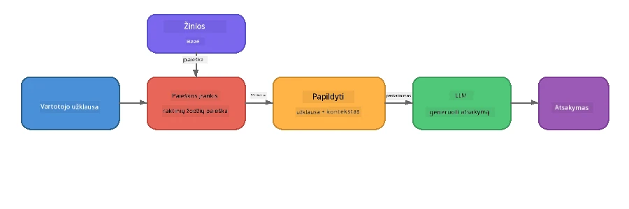

# 4 dalis: RAG programos kūrimas su Foundry Local

## Apžvalga

Didieji kalbos modeliai yra galingi, tačiau jie žino tik tai, kas buvo jų mokymų duomenyse. **Paieškai praturtintas generavimas (RAG)** išsprendžia šią problemą suteikdamas modeliui aktualų kontekstą užklausos metu – paimtą iš jūsų dokumentų, duomenų bazių ar žinių bazių.

Šioje laboratorijoje jūs sukursite pilną RAG srautą, kuris veiks **visiškai jūsų įrenginyje** naudojant Foundry Local. Be debesų paslaugų, be vektorių duomenų bazių, be embeddingų API – tik vietinė paieška ir vietinis modelis.

## Mokymosi tikslai

Baigę šią laboratoriją galėsite:

- Paaiškinti, kas yra RAG ir kodėl tai svarbu dirbtinio intelekto programoms
- Sukurti vietinę žinių bazę iš tekstinių dokumentų
- Įgyvendinti paprastą paieškos funkciją, kad rastumėte aktualų kontekstą
- Sudaryti sistemos užklausą, kuri pagrindžia modelį gautomis faktinėmis žiniomis
- Vykdyti pilną Retrieve → Augment → Generate srautą įrenginyje
- Suprasti kompromisus tarp paprastos raktažodžių paieškos ir vektorinės paieškos

---

## Reikalavimai

- Baigta [3 dalis: Foundry Local SDK naudojimas su OpenAI](part3-sdk-and-apis.md)
- Įdiegtas Foundry Local CLI ir atsisiųstas `phi-3.5-mini` modelis

---

## Koncepcija: Kas yra RAG?

Be RAG, LLM gali atsakyti tik remdamasis mokymų duomenimis – kurie gali būti pasenę, neišsamūs ar neturėti jūsų privačios informacijos:

```
User: "What is Zava's return policy?"
LLM:  "I do not have information about Zava's return policy."  ← No context!
```

Su RAG jūs pirmiausiai **ieškote** aktualių dokumentų, tada **praturtinate** užklausą tuo kontekstu prieš **generuodami** atsakymą:



Pagrindinė įžvalga: **modeliui nereikia „žinoti“ atsakymo; jam tereikia perskaityti tinkamus dokumentus.**

---

## Laboratoriniai pratimai

### Pratimas 1: Suprasti žinių bazę

Atidarykite savo kalbos RAG pavyzdį ir peržiūrėkite žinių bazę:

<details>
<summary><b>🐍 Python: <code>python/foundry-local-rag.py</code></b></summary>

Žinių bazė yra paprastas žodynų sąrašas su `title` ir `content` laukais:

```python
KNOWLEDGE_BASE = [
    {
        "title": "Foundry Local Overview",
        "content": (
            "Foundry Local brings the power of Azure AI Foundry to your local "
            "device without requiring an Azure subscription..."
        ),
    },
    {
        "title": "Supported Hardware",
        "content": (
            "Foundry Local automatically selects the best model variant for "
            "your hardware. If you have an Nvidia CUDA GPU it downloads the "
            "CUDA-optimized model..."
        ),
    },
    # ... daugiau įrašų
]
```

Kiekvienas įrašas atstovauja „dalių“ žinių – sutelktą informaciją apie vieną temą.

</details>

<details>
<summary><b>📘 JavaScript: <code>javascript/foundry-local-rag.mjs</code></b></summary>

Žinių bazė naudoja tą pačią struktūrą kaip objektų masyvas:

```javascript
const KNOWLEDGE_BASE = [
  {
    title: "Foundry Local Overview",
    content:
      "Foundry Local brings the power of Azure AI Foundry to your local " +
      "device without requiring an Azure subscription...",
  },
  {
    title: "Supported Hardware",
    content:
      "Foundry Local automatically selects the best model variant for " +
      "your hardware...",
  },
  // ... daugiau įrašų
];
```

</details>

<details>
<summary><b>💜 C#: <code>csharp/RagPipeline.cs</code></b></summary>

Žinių bazė naudoja vardinius tuple sąrašą:

```csharp
private static readonly List<(string Title, string Content)> KnowledgeBase =
[
    ("Foundry Local Overview",
     "Foundry Local brings the power of Azure AI Foundry to your local " +
     "device without requiring an Azure subscription..."),

    ("Supported Hardware",
     "Foundry Local automatically selects the best model variant for " +
     "your hardware..."),

    // ... more entries
];
```

</details>

> **Tikroje programoje** žinių bazė būtų paimta iš diskinių failų, duomenų bazės, paieškos indekso ar API. Šiai laboratorijai naudojame atminties sąrašą, kad supaprastintume.

---

### Pratimas 2: Suprasti paieškos funkciją

Paieškos žingsnis randa aktualiausias žinių dalis vartotojo klausimui. Šis pavyzdys naudoja **raktažodžių sutapimą** – skaičiuoja, kiek žodžių užklausoje sutampa su žodžiais kiekvienoje dalyje:

<details>
<summary><b>🐍 Python</b></summary>

```python
def retrieve(query: str, top_k: int = 2) -> list[dict]:
    """Return the top-k knowledge chunks most relevant to the query."""
    query_words = set(query.lower().split())
    scored = []
    for chunk in KNOWLEDGE_BASE:
        chunk_words = set(chunk["content"].lower().split())
        overlap = len(query_words & chunk_words)
        scored.append((overlap, chunk))
    scored.sort(key=lambda x: x[0], reverse=True)
    return [item[1] for item in scored[:top_k]]
```

</details>

<details>
<summary><b>📘 JavaScript</b></summary>

```javascript
function retrieve(query, topK = 2) {
  const queryWords = new Set(query.toLowerCase().split(/\s+/));
  const scored = KNOWLEDGE_BASE.map((chunk) => {
    const chunkWords = new Set(chunk.content.toLowerCase().split(/\s+/));
    let overlap = 0;
    for (const w of queryWords) {
      if (chunkWords.has(w)) overlap++;
    }
    return { overlap, chunk };
  });
  scored.sort((a, b) => b.overlap - a.overlap);
  return scored.slice(0, topK).map((s) => s.chunk);
}
```

</details>

<details>
<summary><b>💜 C#</b></summary>

```csharp
private static List<(string Title, string Content)> Retrieve(string query, int topK = 2)
{
    var queryWords = new HashSet<string>(
        query.ToLowerInvariant().Split(' ', StringSplitOptions.RemoveEmptyEntries));

    return KnowledgeBase
        .Select(chunk =>
        {
            var chunkWords = new HashSet<string>(
                chunk.Content.ToLowerInvariant().Split(' ', StringSplitOptions.RemoveEmptyEntries));
            var overlap = queryWords.Intersect(chunkWords).Count();
            return (Overlap: overlap, Chunk: chunk);
        })
        .OrderByDescending(x => x.Overlap)
        .Take(topK)
        .Select(x => x.Chunk)
        .ToList();
}
```

</details>

**Kaip tai veikia:**
1. Užklausą padalina į atskirus žodžius
2. Kiekvienai žinių daliai suskaičiuoja, kiek užklausos žodžių joje yra
3. Surikiuoja pagal sutapimo balą (aukščiausias pirmas)
4. Grąžina top-k aktualiausių dalių

> **Kompromisas:** Raktažodžių sutapimas yra paprastas, tačiau ribotas; jis nesupranta sinonimų ar prasmės. Produkcinės RAG sistemos dažniausiai naudoja **embedding vektorius** ir **vektorinę duomenų bazę** semantinei paieškai. Visgi, raktažodžių sutapimas yra puiki pradžia ir nereikalauja papildomų priklausomybių.

---

### Pratimas 3: Suprasti praturtintą užklausą

Gautas kontekstas įterpiamas į **sistemos užklausą** prieš siunčiant modeliui:

```python
system_prompt = (
    "You are a helpful assistant. Answer the user's question using ONLY "
    "the information provided in the context below. If the context does "
    "not contain enough information, say so.\n\n"
    f"Context:\n{context_text}"
)
```

Svarbūs dizaino sprendimai:
- **„TIK pateikta informacija“** – neleidžia modeliui sugalvoti faktų, kurių nėra kontekste
- **„Jei kontekste informacijos nėra pakankamai, praneškite tai“** – skatina sąžiningus „nežinau“ atsakymus
- Kontekstas dedamas į sistemos pranešimą, todėl formuoja visus atsakymus

---

### Pratimas 4: Vykdyti RAG srautą

Vykdykite pilną pavyzdį:

**Python:**
```bash
cd python
python foundry-local-rag.py
```

**JavaScript:**
```bash
cd javascript
node foundry-local-rag.mjs
```

**C#:**
```bash
cd csharp
dotnet run rag
```

Turėtumėte pamatyti tris spausdinamus dalykus:
1. **Užduotą klausimą**
2. **Atskleistą kontekstą** – žinių bazės pasirinktas dalis
3. **Atsakymą** – sugeneruotą modelio tik naudojant tą kontekstą

Pavyzdžiui, išvestis:
```
Question: How do I install Foundry Local and what hardware does it support?

--- Retrieved Context ---
### Installation
On Windows install Foundry Local with: winget install Microsoft.FoundryLocal...

### Supported Hardware
Foundry Local automatically selects the best model variant for your hardware...
-------------------------

Answer: To install Foundry Local, you can use the following methods depending
on your operating system: On Windows, run `winget install Microsoft.FoundryLocal`.
On macOS, use `brew install microsoft/foundrylocal/foundrylocal`...
```

Atkreipkite dėmesį, kad modelio atsakymas yra **pagrįstas** rastu kontekstu – jis mini tik faktus iš žinių bazės dokumentų.

---

### Pratimas 5: Eksperimentuokite ir plėtokite

Išbandykite šiuos pakeitimus, kad geriau suprastumėte:

1. **Pakeiskite klausimą** – užduokite ką nors, kas YRA žinių bazėje ir ką nors, ko NĖRA:
   ```python
   question = "What programming languages does Foundry Local support?"  # ← Kontekste
   question = "How much does Foundry Local cost?"                       # ← Ne kontekste
   ```
   Ar modelis teisingai sako „Nežinau“, kai atsakymas nėra kontekste?

2. **Pridėkite naują žinių dalį** – pridėkite naują įrašą į `KNOWLEDGE_BASE`:
   ```python
   {
       "title": "Pricing",
       "content": "Foundry Local is completely free and open source under the MIT license.",
   }
   ```
   Po to klauskite dėl kainų dar kartą.

3. **Pakeiskite `top_k`** – ieškokite daugiau arba mažiau dalių:
   ```python
   context_chunks = retrieve(question, top_k=3)  # Daugiau konteksto
   context_chunks = retrieve(question, top_k=1)  # Mažiau konteksto
   ```
   Kaip konteksto kiekis veikia atsakymo kokybę?

4. **Pašalinkite pagrindimo instrukciją** – pakeiskite sistemos užklausą į „Jūs esate naudingas asistentas.“ ir pažiūrėkite, ar modelis pradės kurti išgalvotus faktus.

---

## Giluminis žvilgsnis: RAG optimizavimas įrenginiui

RAG vykdymas įrenginyje turi apribojimų, kurių debesyje neturite: ribota RAM atmintis, nėra dedikuoto GPU (vykdymas CPU/NPU), ir nedidelis modelio konteksto langas. Toliau pateikti dizaino sprendimai tiesiogiai sprendžia šiuos apribojimus ir remiasi produkcinių vietinių RAG programų, sukurtų su Foundry Local, modeliais.

### Dalijimosi strategija: Fiksuoto dydžio „sliding window“

Dalijimasis – kaip dokumentai yra padalijami į dalis – yra vienas svarbiausių sprendimų bet kurioje RAG sistemoje. Įrenginio scenarijams rekomenduojama pradėti nuo **fiksuoto dydžio slystančio lango su persidengimu**:

| Parametras | Rekomenduojama reikšmė | Kodėl |
|-----------|------------------------|-------|
| **Dalies dydis** | ~200 žodžių | Laiko kontekstą kompaktišką, palikdamas vietos Phi-3.5 Mini konteksto lange sisteminiam pranešimui, pokalbio istorijai ir sugeneruotam atsakymui |
| **Persidengimas** | ~25 žodžiai (12.5%) | Užtikrina, kad informacija nepraras ribose – svarbu procedūroms ir žingsnis po žingsnio instrukcijoms |
| **Tokenizacija** | Skyrimas tarpais | Nereikia priklausomybių, nėra tokenizer bibliotekos. Visa skaičiavimo galia lieka LLM |

Persidengimas veikia kaip slystantis langas: kiekviena nauja dalis prasideda 25 žodžiais prieš ankstesnės pabaigą, todėl sakiniai, kertantys ribas, atsiranda abiejose dalyse.

> **Kodėl ne kitos strategijos?**
> - **Pagal sakinius dalijimas** sukuria nenuspėjamus dalelių dydžius; kai kurios saugumo procedūros yra ilgi sakiniai, kurių nepavyktų gerai padalinti
> - **Pagal skyrių dalijimas** (pagal `##` antraštes) duoda labai nevienodus dydžius – kai kurios dalys per mažos, kitos per didelės modeliui
> - **Semantinis dalijimas** (pagal embeddingu temų aptikimą) duoda geriausią paieškos kokybę, tačiau reikalauja papildomo modelio kartu su Phi-3.5 Mini atmintyje – rizikinga su 8-16 GB bendros atminties įrenginiuose

### Paieškos patobulinimas: TF-IDF vektoriai

Rakto žodžių sutapimo būdas veikia, tačiau jei norite geresnės paieškos neįtraukdami embeddingų modelio, **TF-IDF (Term Frequency-Inverse Document Frequency)** yra puikus vidurys:

```
Keyword Overlap  →  TF-IDF Vectors  →  Embedding Models
    (this lab)     (lightweight upgrade)   (production)
  Simple & fast    Better ranking,         Best quality,
  No dependencies  still no ML model       requires embedding model
  ~Basic matching  ~1ms retrieval          ~100-500ms per query
```

TF-IDF kiekvieną dalį paverčia skaitmeniniu vektoriumi, pagrįstu kiekvieno žodžio svarba toje dalyje *lyginti su visomis dalimis*. Užklausos metu klausimas taip pat paverčiamas vektoriumi ir lyginamas kosinuso panašumu. Tai galite įgyvendinti su SQLite ir gryna JavaScript/Python – be vektorinės duomenų bazės ar embeddingų API.

> **Veikimas:** TF-IDF kosinuso panašumas per fiksuoto dydžio dalis paprastai pasiekia **~1 ms paiešką**, palyginti su ~100–500 ms, kai embeddingų modelis koduoja kiekvieną užklausą. Visi 20+ dokumentų gali būti suskaidyti ir indeksuoti per mažiau nei sekundę.

### Ribotas/Kompanctinis režimas įrenginiams su apribojimais

Vykdant labai ribotos techninės įrangos įrenginiuose (senesni nešiojamieji, planšetiniai kompiuteriai, lauko įrenginiai) naudinga sumažinti tris parametrus:

| Nustatymas | Standartinis režimas | Ribotas/Kompanctinis režimas |
|------------|---------------------|------------------------------|
| **Sistemos užklausa** | ~300 žodžių | ~80 žodžių |
| **Maksimalūs išvesties žodžiai** | 1024 | 512 |
| **Parinktų dalių kiekis (top-k)** | 5 | 3 |

Mažesnis gautų dalių skaičius reiškia mažiau konteksto modeliui apdoroti, kas mažina vėlavimą ir atminties apkrovą. Trumpesnė sistemos užklausa palieka daugiau konteksto vietos atsakymui. Šis kompromisas naudingas įrenginiuose, kur kiekvienas žodis konteksto lange yra svarbus.

### Vienas modelis atmintyje

Vienas svarbiausių principų vietiniame RAG: **palaikyti iškrautą tik vieną modelį**. Jei naudojate embeddingų modelį paieškai *ir* kalbos modelį generavimui, dalijatės ribotais NPU/RAM resursais tarp dviejų modelių. Lengva paieška (raktažodžių sutapimas, TF-IDF) to visiškai išvengia:

- Be embeddingų modelio, konkuruojančio su LLM dėl atminties
- Greitesnis šaltas startas – įkeliama tik vienas modelis
- Numatyta atminties naudojimo apimtis – LLM gauna visas turimas resursus
- Veikia mašinose su ne mažiau kaip 8 GB RAM

### SQLite kaip vietinė vektorinė saugykla

Mažoms ir vidutinėms dokumentų kolekcijoms (šimtai iki kelių tūkstančių dalių), **SQLite yra pakankamai greita** brutaliai kosinuso panašumo paieškai ir nereikalauja papildomos infrastruktūros:

- Vienas `.db` failas diske – be serverio proceso, be konfigūracijos
- Įdiegtas kiekvienoje pagrindinėje programavimo kalboje (Python `sqlite3`, Node.js `better-sqlite3`, .NET `Microsoft.Data.Sqlite`)
- Laiko dokumentų dalis kartu su jų TF-IDF vektoriais vienoje lentelėje
- Nereikia Pinecone, Qdrant, Chroma ar FAISS šioje apimtyje

### Veikimo santrauka

Šie dizaino sprendimai kartu leidžia pasiūlyti reaguojančią RAG patirtį vartotojo įrenginiuose:

| Rodiklis | Vietinis našumas |
|----------|------------------|
| **Paieškos latencija** | ~1 ms (TF-IDF) iki ~5 ms (raktažodžių sutapimas) |
| **Duomenų įkėlimas** | 20 dokumentų su skaidymu ir indeksavimu per <1 sekundę |
| **Modelių skaičius atmintyje** | 1 (tik LLM – be embeddingų modelio) |
| **Saugyklos reikalavimai** | < 1 MB dalių ir vektorių SQLite duomenų bazėje |
| **Šaltas startas** | Vieno modelio įkėlimas, be embeddingų runtime paleidimo |
| **Techninis minimumas** | 8 GB RAM, tik CPU (GPU neprivalomas) |

> **Kada atnaujinti:** Jei vartojate šimtus ilgų dokumentų, mišrų turinį (lenteles, kodą, tekstą) arba norite semantiškai suprasti užklausas, apsvarstykite embeddingų modelio pridėjimą ir perėjimą prie vektorinės panašumo paieškos. Daugumai vietinių programų su sutelktomis dokumentų rinkiniais TF-IDF + SQLite yra puikus sprendimas su minimaliais resursais.

---

## Pagrindinės sąvokos

| Sąvoka | Aprašymas |
|--------|-----------|
| **Paieška** | Aktualiausių dokumentų radimas žinių bazėje pagal vartotojo užklausą |
| **Praturtinimas** | Rastų dokumentų įterpimas į užklausą kaip kontekstą |
| **Generavimas** | LLM sukuria atsakymą, pagrįstą pateiktu kontekstu |
| **Dalijimas** | Ilgų dokumentų skaidymas į mažesnes, sutelktas dalis |
| **Pagrindimas** | Modelio apribojimas naudoti tik pateiktą kontekstą (mažina išgalvojimus) |
| **Top-k** | Kiekis aktualiausių dalių, kurias reikia rasti |

---

## RAG produkcijoje vs. ši laboratorija

| Aspektas | Ši laboratorija | Optimizuota vietiniam įrenginiui | Debesų produkcija |
|----------|-----------------|---------------------------------|-------------------|
| **Žinių bazė** | Atminties sąrašas | Failai diske, SQLite | Duomenų bazė, paieškos indeksas |
| **Paieška** | Raktažodžių sutapimas | TF-IDF + kosinuso panašumas | Vektorinių embeddingų paieška |
| **Embeddingai** | Nereikia | Nereikia – TF-IDF vektoriai | Embeddingų modelis (vietinis arba debesyje) |
| **Vektorinė saugykla** | Nereikia | SQLite (vienas `.db` failas) | FAISS, Chroma, Azure AI Search ir kt. |
| **Dalijimas** | Rankinis | Fiksuoto dydžio slystantis langas (~200 žodžių, 25 žodžių persidengimas) | Semantinis arba rekursyvus dalijimas |
| **Modeliai atmintyje** | 1 (LLM) | 1 (LLM) | 2+ (embedding + LLM) |
| **Atsakymo vėlavimas** | ~5ms | ~1ms | ~100-500ms |
| **Mastelis** | 5 dokumentai | Šimtai dokumentų | Milijonai dokumentų |

Šablonai, kuriuos čia išmokstate (gauti, papildyti, generuoti), yra tokie pat bet kokiame mastelyje. Atsakymo metodas tobulėja, bet bendra architektūra išlieka identiška. Vidurinė stulpelio dalis rodo, ką galima pasiekti įrenginyje naudojant lengvas technikas, dažnai tai yra optimalus sprendimas vietinėms programoms, kai keičiate debesų mastą į privatumą, neprisijungimo galimybes ir nulinį vėlavimą prie išorinių paslaugų.

---

## Pagrindinės išvados

| Sąvoka | Ką Išmokote |
|---------|------------------|
| RAG šablonas | Gauti + Papildyti + Generuoti: suteikite modeliui tinkamą kontekstą ir jis gali atsakyti į klausimus apie jūsų duomenis |
| Įrenginyje | Viskas veikia vietoje, be debesijos API ar vektorinės duomenų bazės prenumeratų |
| Pagrindimo instrukcijos | Sistemos raginimo apribojimai yra kritiški, kad būtų išvengta haliucinacijų |
| Raktinių žodžių sutapimai | Paprastas, bet efektyvus atspirties taškas gauti informaciją |
| TF-IDF + SQLite | Lengvas tobulinimo kelias, leidžiantis pasiekti atsakymo laiką mažesnį nei 1ms be įdėtojo modelio |
| Vienas modelis atmintyje | Venkite įkėlimo įdėtojo modelio kartu su LLM ribotoje aparatinėje įrangoje |
| Dalykų dydis | Maždaug 200 žodžių su persidengimu subalansuoja atsakymo tikslumą ir konteksto lango efektyvumą |
| Krašto / kompaktiškas režimas | Naudokite mažiau dalių ir trumpesnius raginimus labai ribotiems įrenginiams |
| Universalus šablonas | Ta pati RAG architektūra veikia su bet kokiu duomenų šaltiniu: dokumentais, duomenų bazėmis, API ar vikiais |

> **Norite pamatyti visišką RAG programą įrenginyje?** Peržiūrėkite [Gas Field Local RAG](https://github.com/leestott/local-rag), gamybinės kokybės neprisijungus veikiantį RAG agentą, sukurtą naudojant Foundry Local ir Phi-3.5 Mini, kuris demonstruoja šiuos optimizavimo šablonus su realių dokumentų rinkiniu.

---

## Tolimesni žingsniai

Tęskite į [5 dalį: AI agentų kūrimas](part5-single-agents.md), kad sužinotumėte, kaip kurti intelektualius agentus su personažais, instrukcijomis ir daugkartiniais pokalbiais, naudojant Microsoft Agent Framework.

---

<!-- CO-OP TRANSLATOR DISCLAIMER START -->
**Atsakomybės atsisakymas**:  
Šis dokumentas buvo išverstas naudojant dirbtinio intelekto vertimo paslaugą [Co-op Translator](https://github.com/Azure/co-op-translator). Nors stengiamės užtikrinti tikslumą, atkreipkite dėmesį, kad automatizuoti vertimai gali turėti klaidų ar netikslumų. Pirminis dokumentas gimtąja kalba laikomas autoritetingu šaltiniu. Svarbiai informacijai rekomenduojama naudoti profesionalų žmogaus atliktą vertimą. Mes neatsakome už bet kokius nesusipratimus ar neteisingus aiškinimus, kylančius dėl šio vertimo naudojimo.
<!-- CO-OP TRANSLATOR DISCLAIMER END -->