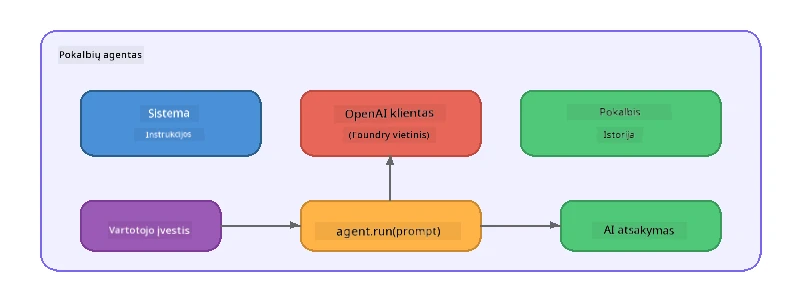

# 5 dalis: AI agentų kūrimas naudojant Agent Framework

> **Tikslas:** Sukurkite savo pirmąjį AI agentą su nuolatinėmis instrukcijomis ir apibrėžta asmenybe, naudojant vietinį modelį per Foundry Local.

## Kas yra AI agentas?

AI agentas apjungia kalbos modelį su **sistemos instrukcijomis**, kurios apibrėžia jo elgesį, asmenybę ir apribojimus. Skirtingai nei vienkartinis pokalbio užbaigimo kvietimas, agentas suteikia:

- **Asmenybę** – nuoseklią tapatybę („Jūs esate naudingas kodo peržiūros specialistas“)
- **Atmintį** – pokalbių istoriją per kelis pokalbio raundus
- **Specializaciją** – fokusuotą elgesį, kurį lemia gerai parengtos instrukcijos



---

## Microsoft Agent Framework

**Microsoft Agent Framework** (AGF) suteikia standartizuotą agento abstrakciją, veikiantį per skirtingus modelių pagrindus. Šiame dirbtuvėse jį suderiname su Foundry Local, todėl viskas vyksta jūsų kompiuteryje – nereikia debesijos.

| Sąvoka | Aprašymas |
|---------|-------------|
| `FoundryLocalClient` | Python: valdo paslaugos paleidimą, modelio atsisiuntimą/įkėlimą ir kuria agentus |
| `client.as_agent()` | Python: sukuria agentą iš Foundry Local kliento |
| `AsAIAgent()` | C#: išplėtimo metodas `ChatClient` klasėje - sukuria `AIAgent` |
| `instructions` | Sistemos užklausa, formuojanti agento elgesį |
| `name` | Žmogui suprantamas žymėjimas, naudingas daugiaagentinėse situacijose |
| `agent.run(prompt)` / `RunAsync()` | Siunčia vartotojo žinutę ir grąžina agento atsakymą |

> **Pastaba:** Agent Framework turi Python ir .NET SDK. JavaScript naudojimui įgyvendinome lengvą `ChatAgent` klasę, kuri tiesiogiai naudoja OpenAI SDK ir atspindi tą patį modelį.

---

## Pratimai

### Pratimas 1 – Suprasti Agentų Modelį

Prieš rašydami kodą, išstudijuokite pagrindines agento sudedamąsias dalis:

1. **Modelio klientas** – jungiasi prie Foundry Local OpenAI suderinamo API
2. **Sistemos instrukcijos** – „asmenybės“ užklausa
3. **Vykdymo ciklas** – siųskite vartotojo įvestį, gaukite atsakymą

> **Pagalvokite:** kuo sistemos instrukcijos skiriasi nuo įprastos vartotojo žinutės? Kas nutinka, jei jas pakeičiate?

---

### Pratimas 2 – Paleiskite Vieno Agentos Pavyzdį

<details>
<summary><strong>🐍 Python</strong></summary>

**Reikalavimai:**
```bash
cd python
python -m venv venv

# Windows (PowerShell):
venv\Scripts\Activate.ps1
# macOS:
source venv/bin/activate

pip install -r requirements.txt
```

**Paleidimas:**
```bash
python foundry-local-with-agf.py
```

**Kodo apžvalga** (`python/foundry-local-with-agf.py`):

```python
import asyncio
from agent_framework_foundry_local import FoundryLocalClient

async def main():
    alias = "phi-4-mini"

    # FoundryLocalClient tvarko paslaugos paleidimą, modelio atsisiuntimą ir įkėlimą
    client = FoundryLocalClient(model_id=alias)
    print(f"Client Model ID: {client.model_id}")

    # Sukurkite agentą su sistemos instrukcijomis
    agent = client.as_agent(
        name="Joker",
        instructions="You are good at telling jokes.",
    )

    # Nestriuktūrinis režimas: gaukite visą atsakymą iš karto
    result = await agent.run("Tell me a joke about a pirate.")
    print(f"Agent: {result}")

    # Striuktūrinis režimas: gaukite rezultatus, kai jie generuojami
    async for chunk in agent.run("Tell me another joke.", stream=True):
        if chunk.text:
            print(chunk.text, end="", flush=True)

asyncio.run(main())
```

**Svarbūs punktai:**
- `FoundryLocalClient(model_id=alias)` vienu žingsniu paleidžia paslaugą, atsisiunčia ir įkelia modelį
- `client.as_agent()` sukuria agentą su sistemos instrukcijomis ir pavadinimu
- `agent.run()` palaiko tiek transliavimo, tiek netransliavimo režimus
- Įdiegimas per `pip install agent-framework-foundry-local --pre`

</details>

<details>
<summary><strong>📦 JavaScript</strong></summary>

**Reikalavimai:**
```bash
cd javascript
npm install
```

**Paleidimas:**
```bash
node foundry-local-with-agent.mjs
```

**Kodo apžvalga** (`javascript/foundry-local-with-agent.mjs`):

```javascript
import { OpenAI } from "openai";
import { FoundryLocalManager } from "foundry-local-sdk";

class ChatAgent {
  constructor({ client, modelId, instructions, name }) {
    this.client = client;
    this.modelId = modelId;
    this.instructions = instructions;
    this.name = name;
    this.history = [];
  }

  async run(userMessage) {
    const messages = [
      { role: "system", content: this.instructions },
      ...this.history,
      { role: "user", content: userMessage },
    ];
    const response = await this.client.chat.completions.create({
      model: this.modelId,
      messages,
    });
    const assistantMessage = response.choices[0].message.content;

    // Išsaugoti pokalbio istoriją daugiažingsniams pokalbiams
    this.history.push({ role: "user", content: userMessage });
    this.history.push({ role: "assistant", content: assistantMessage });
    return { text: assistantMessage };
  }
}

async function main() {
  FoundryLocalManager.create({ appName: "FoundryLocalWorkshop" });
  const manager = FoundryLocalManager.instance;
  await manager.startWebService();

  const catalog = manager.catalog;
  const model = await catalog.getModel("phi-3.5-mini");
  if (!model.isCached) {
    console.log("Downloading model: phi-3.5-mini...");
    await model.download();
  }
  await model.load();

  const client = new OpenAI({
    baseURL: manager.urls[0] + "/v1",
    apiKey: "foundry-local",
  });

  const agent = new ChatAgent({
    client,
    modelId: model.id,
    instructions: "You are good at telling jokes.",
    name: "Joker",
  });

  const result = await agent.run("Tell me a joke about a pirate.");
  console.log(result.text);
}

main();
```

**Svarbūs punktai:**
- JavaScript sukuria savo `ChatAgent` klasę, atspindinčią Python AGF modelį
- `this.history` kaupia pokalbių raundus, palaiko daugkartinį pokalbį
- Aiškus `startWebService()` → cache tikrinimas → `model.download()` → `model.load()` - pilnas veiksmo matomumas

</details>

<details>
<summary><strong>💜 C#</strong></summary>

**Reikalavimai:**
```bash
cd csharp
dotnet restore
```

**Paleidimas:**
```bash
dotnet run agent
```

**Kodo apžvalga** (`csharp/SingleAgent.cs`):

```csharp
using Microsoft.AI.Foundry.Local;
using Microsoft.Extensions.Logging.Abstractions;
using Microsoft.Agents.AI;
using OpenAI;
using System.ClientModel;

// 1. Start Foundry Local and load a model
var alias = "phi-3.5-mini";
await FoundryLocalManager.CreateAsync(
    new Configuration
    {
        AppName = "FoundryLocalSamples",
        Web = new Configuration.WebService { Urls = "http://127.0.0.1:0" }
    }, NullLogger.Instance, default);
var manager = FoundryLocalManager.Instance;
await manager.StartWebServiceAsync(default);

var catalog = await manager.GetCatalogAsync(default);
var model = await catalog.GetModelAsync(alias, default);

var isCached = await model.IsCachedAsync(default);
if (!isCached)
{
    Console.WriteLine($"Downloading model: {alias}...");
    await model.DownloadAsync(null, default);
}
await model.LoadAsync(default);

var key = new ApiKeyCredential("foundry-local");
var client = new OpenAIClient(key, new OpenAIClientOptions
{
    Endpoint = new Uri(manager.Urls[0] + "/v1")
});

// 2. Create an AIAgent using the Agent Framework extension method
AIAgent joker = client
    .GetChatClient(model.Id)
    .AsAIAgent(
        instructions: "You are good at telling jokes. Keep your jokes short and family-friendly.",
        name: "Joker"
    );

// 3. Run the agent (non-streaming)
var response = await joker.RunAsync("Tell me a joke about a pirate.");
Console.WriteLine($"Joker: {response}");

// 4. Run with streaming
await foreach (var update in joker.RunStreamingAsync("Tell me another joke."))
{
    Console.Write(update);
}
```

**Svarbūs punktai:**
- `AsAIAgent()` yra `Microsoft.Agents.AI.OpenAI` išplėtimo metodas – nereikia kurti atskiros `ChatAgent` klasės
- `RunAsync()` grąžina pilną atsakymą; `RunStreamingAsync()` transliuoja žodžių po vieną
- Įdiegti per `dotnet add package Microsoft.Agents.AI.OpenAI --version 1.0.0-rc3`

</details>

---

### Pratimas 3 – Pakeiskite Asmenybę

Pakeiskite agento `instructions`, kad sukurtumėte kitokią asmenybę. Išbandykite kiekvieną ir stebėkite, kaip kinta rezultatas:

| Asmenybė | Instrukcijos |
|---------|-------------|
| Kodo peržiūros specialistas | `"Jūs esate ekspertas kodo peržiūros specialistas. Teikite konstruktyvią grįžtamąją informaciją, orientuotą į suprantamumą, našumą ir teisingumą."` |
| Kelionių gidas | `"Jūs esate draugiškas kelionių gidas. Teikite asmeniškai pritaikytus pasiūlymus dėl kelionių vietų, veiklos ir vietinės virtuvės."` |
| Sokratinis mokytojas | `"Jūs esate sokratinis mokytojas. Niekada neduokite tiesių atsakymų – vietoje to, vadovaukite mokinį apgalvotais klausimais."` |
| Techninis rašytojas | `"Jūs esate techninis rašytojas. Aiškiai ir glaustai paaiškinkite sąvokas. Naudokite pavyzdžius. Venkite žargono."` |

**Išbandykite:**
1. Pasirinkite asmenybę iš lentelės aukščiau
2. Pakeiskite `instructions` eilutę kode
3. Pakoreguokite vartotojo užklausą (pvz., paprašykite kodų peržiūros)
4. Vėl paleiskite pavyzdį ir palyginkite rezultatus

> **Patarimas:** Agentų kokybė labai priklauso nuo instrukcijų. Konkretūs, gerai struktūruoti nurodymai duoda geresnių rezultatų negu neaiškūs.

---

### Pratimas 4 – Pridėkite Daugkartinį Pokalbį

Išplėskite pavyzdį, kad palaikytų kelių raundų pokalbį, leidžiantį turėti dialogą su agentu.

<details>
<summary><strong>🐍 Python – daugkartinis ciklas</strong></summary>

```python
import asyncio
from agent_framework_foundry_local import FoundryLocalClient

async def main():
    client = FoundryLocalClient(model_id="phi-4-mini")

    agent = client.as_agent(
        name="Assistant",
        instructions="You are a helpful assistant.",
    )

    print("Chat with the agent (type 'quit' to exit):\n")
    while True:
        user_input = input("You: ")
        if user_input.strip().lower() in ("quit", "exit"):
            break
        result = await agent.run(user_input)
        print(f"Agent: {result}\n")

asyncio.run(main())
```

</details>

<details>
<summary><strong>📦 JavaScript – daugkartinis ciklas</strong></summary>

```javascript
import { OpenAI } from "openai";
import { FoundryLocalManager } from "foundry-local-sdk";
import * as readline from "node:readline/promises";

// (pakartotinai naudoti ChatAgent klasę iš 2-ojo pratimo)

async function main() {
  FoundryLocalManager.create({ appName: "FoundryLocalWorkshop" });
  const manager = FoundryLocalManager.instance;
  await manager.startWebService();

  const catalog = manager.catalog;
  const model = await catalog.getModel("phi-3.5-mini");
  if (!model.isCached) {
    console.log("Downloading model: phi-3.5-mini...");
    await model.download();
  }
  await model.load();

  const client = new OpenAI({
    baseURL: manager.urls[0] + "/v1",
    apiKey: "foundry-local",
  });

  const agent = new ChatAgent({
    client,
    modelId: model.id,
    instructions: "You are a helpful assistant.",
    name: "Assistant",
  });

  const rl = readline.createInterface({
    input: process.stdin,
    output: process.stdout,
  });

  console.log("Chat with the agent (type 'quit' to exit):\n");
  while (true) {
    const userInput = await rl.question("You: ");
    if (["quit", "exit"].includes(userInput.trim().toLowerCase())) break;
    const result = await agent.run(userInput);
    console.log(`Agent: ${result.text}\n`);
  }
  rl.close();
}

main();
```

</details>

<details>
<summary><strong>💜 C# – daugkartinis ciklas</strong></summary>

```csharp
using Microsoft.AI.Foundry.Local;
using Microsoft.Extensions.Logging.Abstractions;
using Microsoft.Agents.AI;
using OpenAI;
using System.ClientModel;

var alias = "phi-3.5-mini";
var config = new Configuration
{
    AppName = "FoundryLocalSamples",
    Web = new Configuration.WebService { Urls = "http://127.0.0.1:0" }
};
await FoundryLocalManager.CreateAsync(config, NullLogger.Instance, default);
var manager = FoundryLocalManager.Instance;
await manager.StartWebServiceAsync(default);

var catalog = await manager.GetCatalogAsync(default);
var model = await catalog.GetModelAsync(alias, default);

var isCached = await model.IsCachedAsync(default);
if (!isCached)
{
    Console.WriteLine($"Downloading model: {alias}...");
    await model.DownloadAsync(null, default);
}
await model.LoadAsync(default);

var key = new ApiKeyCredential("foundry-local");
var client = new OpenAIClient(key, new OpenAIClientOptions
{
    Endpoint = new Uri(manager.Urls[0] + "/v1")
});

AIAgent agent = client
    .GetChatClient(model.Id)
    .AsAIAgent(
        instructions: "You are a helpful assistant.",
        name: "Assistant"
    );

Console.WriteLine("Chat with the agent (type 'quit' to exit):\n");
while (true)
{
    Console.Write("You: ");
    var userInput = Console.ReadLine();
    if (string.IsNullOrWhiteSpace(userInput) ||
        userInput.Equals("quit", StringComparison.OrdinalIgnoreCase) ||
        userInput.Equals("exit", StringComparison.OrdinalIgnoreCase))
        break;

    var result = await agent.RunAsync(userInput);
    Console.WriteLine($"Agent: {result}\n");
}
```

</details>

Pastebėkite, kaip agentas prisimena ankstesnius raundus – užduokite tęstinį klausimą ir stebėkite, kaip kontekstas išlaikomas.

---

### Pratimas 5 – Struktūruotas Išvesties Formatavimas

Nurodykite agentui visada atsakyti tam tikru formatu (pvz., JSON) ir interpretuokite rezultatą:

<details>
<summary><strong>🐍 Python – JSON išvestis</strong></summary>

```python
import asyncio
import json
from agent_framework_foundry_local import FoundryLocalClient

async def main():
    client = FoundryLocalClient(model_id="phi-4-mini")

    agent = client.as_agent(
        name="SentimentAnalyzer",
        instructions=(
            "You are a sentiment analysis agent. "
            "For every user message, respond ONLY with valid JSON in this format: "
            '{"sentiment": "positive|negative|neutral", "confidence": 0.0-1.0, "summary": "brief reason"}'
        ),
    )

    result = await agent.run("I absolutely loved the new restaurant downtown!")
    print("Raw:", result)

    try:
        parsed = json.loads(str(result))
        print(f"Sentiment: {parsed['sentiment']} (confidence: {parsed['confidence']})")
    except json.JSONDecodeError:
        print("Agent did not return valid JSON - try refining the instructions.")

asyncio.run(main())
```

</details>

<details>
<summary><strong>💜 C# – JSON išvestis</strong></summary>

```csharp
using System.Text.Json;

AIAgent analyzer = chatClient.AsAIAgent(
    name: "SentimentAnalyzer",
    instructions:
        "You are a sentiment analysis agent. " +
        "For every user message, respond ONLY with valid JSON in this format: " +
        "{\"sentiment\": \"positive|negative|neutral\", \"confidence\": 0.0-1.0, \"summary\": \"brief reason\"}"
);

var response = await analyzer.RunAsync("I absolutely loved the new restaurant downtown!");
Console.WriteLine($"Raw: {response}");

try
{
    var parsed = JsonSerializer.Deserialize<JsonElement>(response.ToString());
    Console.WriteLine($"Sentiment: {parsed.GetProperty("sentiment")} " +
                      $"(confidence: {parsed.GetProperty("confidence")})");
}
catch (JsonException)
{
    Console.WriteLine("Agent did not return valid JSON - try refining the instructions.");
}
```

</details>

> **Pastaba:** Maži vietiniai modeliai ne visuomet sugeneruoja tobulai galiojančius JSON duomenis. Galite pagerinti patikimumą įtraukdami pavyzdį į instrukcijas ir būdami labai konkretūs dėl norimo formato.

---

## Pagrindinės įžvalgos

| Sąvoka | Ką sužinojote |
|---------|-----------------|
| Agentas vs. tiesioginis LLM kvietimas | Agentas supakuoja modelį su instrukcijomis ir atmintimi |
| Sistemos instrukcijos | Svarbiausias svirtis agento elgesiui valdyti |
| Daugkartinis pokalbis | Agentai gali išlaikyti kontekstą per kelias vartotojo sąveikas |
| Struktūruota išvestis | Instrukcijos gali užtikrinti išvesties formatą (JSON, markdown ir kt.) |
| Vietinis vykdymas | Viskas vyksta įrenginyje per Foundry Local – nereikia debesijos |

---

## Tolimesni žingsniai

6 dalyje **[Part 6: Multi-Agent Workflows](part6-multi-agent-workflows.md)** sujungsite kelis agentus į koordinuotą procesą, kai kiekvienas agentas turi specializuotą vaidmenį.

---

<!-- CO-OP TRANSLATOR DISCLAIMER START -->
**Atsakomybės apribojimas**:  
Šis dokumentas buvo išverstas naudojant dirbtinio intelekto vertimo paslaugą [Co-op Translator](https://github.com/Azure/co-op-translator). Nors siekiame tikslumo, prašome atkreipti dėmesį, kad automatizuoti vertimai gali turėti klaidų ar netikslumų. Originalus dokumentas jo gimtąja kalba turėtų būti laikomas autoritetingu šaltiniu. Kritinei informacijai rekomenduojama kreiptis į profesionalų žmogaus vertimą. Mes neatsakome už bet kokius nesusipratimus ar neteisingus aiškinimus, kylančius naudojant šį vertimą.
<!-- CO-OP TRANSLATOR DISCLAIMER END -->