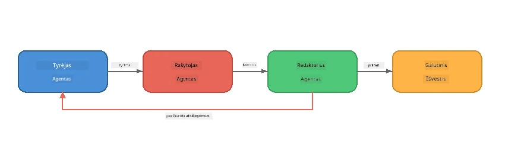
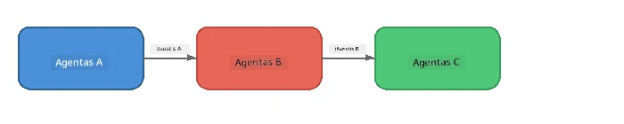
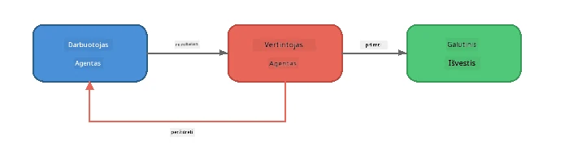
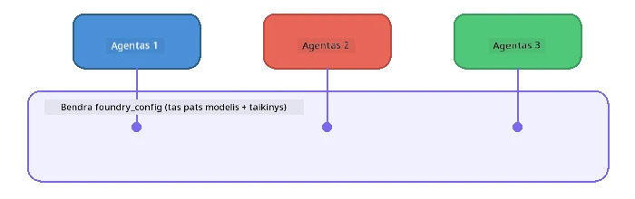

# 6 dalis: Daugiaagentės Darbo Eigos

> **Tikslas:** Sujungti kelis specializuotus agentus į koordinuotus srautus, kurie dalija sudėtingas užduotis tarp bendradarbiaujančių agentų – visi veikia vietoje su Foundry Local.

## Kodėl Daugiaagentė?

Viena agentė gali atlikti daug užduočių, tačiau sudėtingos darbo eigos naudingiau **specializuotis**. Vietoje to, kad viena agentė bandytų tyrinėti, rašyti ir redaguoti vienu metu, darbas dalijamas į konkrečias roles:



| Šablonas | Aprašymas |
|---------|-------------|
| **Sekveninis** | Agentės A išvestis perduodama Agentui B → Agentui C |
| **Grįžtamojo ryšio ciklas** | Vertinimo agentas gali grąžinti darbą taisymams |
| **Bendra kontekstas** | Visos agentės naudoja tą patį modelį/galinį tašką, bet skirtingas instrukcijas |
| **Tipizuota išvestis** | Agentės gamina struktūrizuotus rezultatus (JSON) patikimam duomenų perdavimui |

---

## Pratimai

### 1 pratimas – paleiskite daugiaagentės darbo eigą

Dirbtuvėse pateikta visa tyrėjo → rašytojo → redaktoriaus darbo eiga.

<details>
<summary><strong>🐍 Python</strong></summary>

**Paruošimas:**
```bash
cd python
python -m venv venv

# Windows (PowerShell):
venv\Scripts\Activate.ps1
# macOS:
source venv/bin/activate

pip install -r requirements.txt
```

**Vykdymas:**
```bash
python foundry-local-multi-agent.py
```

**Kas vyksta:**
1. **Tyrėjas** gauna temą ir pateikia svarbių faktų punktus
2. **Rašytojas** panaudoja tyrimą ir paruošia tinklaraščio įrašą (3-4 pastraipos)
3. **Redaktorius** peržiūri straipsnį dėl kokybės ir grąžina PRIIMTI arba PERDIRBTI

</details>

<details>
<summary><strong>📦 JavaScript</strong></summary>

**Paruošimas:**
```bash
cd javascript
npm install
```

**Vykdymas:**
```bash
node foundry-local-multi-agent.mjs
```

**Tas pats trijų etapų srautas** – Tyrėjas → Rašytojas → Redaktorius.

</details>

<details>
<summary><strong>💜 C#</strong></summary>

**Paruošimas:**
```bash
cd csharp
dotnet restore
```

**Vykdymas:**
```bash
dotnet run multi
```

**Tas pats trijų etapų srautas** – Tyrėjas → Rašytojas → Redaktorius.

</details>

---

### 2 pratimas – darbo eigos anatomija

Išsiaiškinkite, kaip apibrėžtos ir sujungtos agentės:

**1. Bendra modelio klientė**

Visos agentės naudoja tą patį Foundry Local modelį:

```python
# Python - FoundryLocalClient tvarko viską
from agent_framework_foundry_local import FoundryLocalClient

client = FoundryLocalClient(model_id="phi-3.5-mini")
```

```javascript
// JavaScript - OpenAI SDK nukreiptas į Foundry Local
const client = new OpenAI({
  baseURL: manager.urls[0] + "/v1",
  apiKey: "foundry-local",
});
```

```csharp
// C# - OpenAIClient pointed at Foundry Local
var key = new ApiKeyCredential("foundry-local");
var client = new OpenAIClient(key, new OpenAIClientOptions
{
    Endpoint = new Uri(manager.Urls[0] + "/v1")
});
var chatClient = client.GetChatClient(model.Id);
```

**2. Specializuotos instrukcijos**

Kiekviena agentė turi aiškiai apibrėžtą personažą:

| Agentė | Instrukcijos (santrauka) |
|-------|----------------------|
| Tyrėjas | "Pateikti pagrindinius faktus, statistiką ir foninę informaciją. Organizuoti kaip sąrašą punktų." |
| Rašytojas | "Parašyti įdomų tinklaraščio įrašą (3-4 pastraipos) remiantis tyrimo užrašais. Neįterpti išgalvotų faktų." |
| Redaktorius | "Peržiūrėti aiškumui, gramatikai ir faktiniam nuoseklumui. Sprendimas: PRIIMTI arba PERDIRBTI." |

**3. Duomenų srautai tarp agentų**

```python
# 1 žingsnis - tyrėjo išvestis tampa rašytojo įvestimi
research_result = await researcher.run(f"Research: {topic}")

# 2 žingsnis - rašytojo išvestis tampa redaktoriaus įvestimi
writer_result = await writer.run(f"Write using:\n{research_result}")

# 3 žingsnis - redaktorius peržiūri tiek tyrimą, tiek straipsnį
editor_result = await editor.run(
    f"Research:\n{research_result}\n\nArticle:\n{writer_result}"
)
```

```csharp
// C# - same pattern, async calls with AIAgent
var researchNotes = await researcher.RunAsync(
    $"Research the following topic and provide key facts:\n{topic}");

var draft = await writer.RunAsync(
    $"Write a blog post based on these research notes:\n\n{researchNotes}");

var verdict = await editor.RunAsync(
    $"Review this article for quality and accuracy.\n\n" +
    $"Research notes:\n{researchNotes}\n\n" +
    $"Article:\n{draft}");
```

> **Svarbi įžvalga:** Kiekviena agentė gauna ankstesniųjų agentų sukauptą kontekstą. Redaktorius mato tiek originalų tyrimą, tiek juodraštį – tai leidžia patikrinti faktinį nuoseklumą.

---

### 3 pratimas – pridėkite ketvirtą agentą

Išplėskite srautą pridėdami naują agentą. Pasirinkite vieną:

| Agentė | Paskirtis | Instrukcijos |
|-------|---------|-------------|
| **Faktų tikrintojas** | Patikrinti straipsnio teiginius | `"Jūs tikrinate faktinius teiginius. Kiekvienam teiginiui nurodykite, ar jis patvirtintas tyrimo užrašais. Grąžinkite JSON su patikrintomis/nepatikrintomis žinutėmis."` |
| **Pavadinimų rašytojas** | Kurti patrauklius antraštes | `"Sugeneruokite 5 antraščių variantus straipsniui. Įvairovė: informatyvus, clickbait, klausimas, sąrašo forma, emocinis."` |
| **Socialinių tinklų agentas** | Kurti reklamos įrašus | `"Sukurkite 3 socialinių tinklų įrašus, reklamuojančius šį straipsnį: vieną Twitter (280 simbolių), vieną LinkedIn (profesionalus tonas), vieną Instagram (neformalus su emocijomis)."` |

<details>
<summary><strong>🐍 Python – pridedame Pavadinimų rašytoją</strong></summary>

```python
headline_agent = client.as_agent(
    name="HeadlineWriter",
    instructions=(
        "You are a headline specialist. Given an article, generate exactly "
        "5 headline options. Vary the style: informative, question-based, "
        "listicle, emotional, and provocative. Return them as a numbered list."
    ),
)

# Po to, kai redaktorius patvirtina, sugeneruokite antraštes
headline_result = await headline_agent.run(
    f"Generate headlines for this article:\n\n{writer_result}"
)
print(f"\n--- Headlines ---\n{headline_result}")
```

</details>

<details>
<summary><strong>📦 JavaScript – pridedame Pavadinimų rašytoją</strong></summary>

```javascript
const headlineAgent = new ChatAgent({
  client,
  modelId: modelInfo.id,
  instructions:
    "You are a headline specialist. Given an article, generate exactly " +
    "5 headline options. Vary the style: informative, question-based, " +
    "listicle, emotional, and provocative. Return them as a numbered list.",
  name: "HeadlineWriter",
});

const headlineResult = await headlineAgent.run(
  `Generate headlines for this article:\n\n${writerResult.text}`
);
console.log(`\n--- Headlines ---\n${headlineResult.text}`);
```

</details>

<details>
<summary><strong>💜 C# – pridedame Pavadinimų rašytoją</strong></summary>

```csharp
AIAgent headlineAgent = chatClient.AsAIAgent(
    name: "HeadlineWriter",
    instructions:
        "You are a headline specialist. Given an article, generate exactly " +
        "5 headline options. Vary the style: informative, question-based, " +
        "listicle, emotional, and provocative. Return them as a numbered list."
);

// After the editor accepts, generate headlines
var headlines = await headlineAgent.RunAsync(
    $"Generate headlines for this article:\n\n{draft}");
Console.WriteLine($"\n--- Headlines ---\n{headlines}");
```

</details>

---

### 4 pratimas – sukurkite savo darbo eigą

Sukurkite daugiaagentį srautą kitai sričiai. Štai kelios idėjos:

| Sritis | Agentės | Srautas |
|--------|--------|------|
| **Kodo peržiūra** | Analizatorius → Peržiūrėtojas → Santrauka | Analizuoti kodo struktūrą → peržiūrėti klaidas → paruošti santrauką |
| **Klientų aptarnavimas** | Klasifikatorius → Atsakiklis → Kokybės kontrolė | Klasifikuoti užklausą → paruošti atsakymą → patikrinti kokybę |
| **Švietimas** | Testų kūrėjas → Studentų simuliatorius → Vertintojas | Sugeneruoti testą → simuliuoti atsakymus → įvertinti ir paaiškinti |
| **Duomenų analizė** | Interpretuotojas → Analitikas → Ataskaitų rengėjas | Interpretuoti užklausą → analizuoti modelius → parašyti ataskaitą |

**Žingsniai:**
1. Apibrėžkite 3+ agentas su aiškiomis `instrukcijomis`
2. Nuspręskite duomenų srautą – ką gauną ir kuria kiekviena agentė?
3. Įgyvendinkite srautą naudodami pratimuose 1-3 naudojamus šablonus
4. Pridėkite grįžtamojo ryšio ciklą, jei viena agentė turi vertinti kitos darbą

---

## Orkestravimo Šablonai

Čia pateikti orkestravimo šablonai, taikomi bet kuriai daugiaagentų sistemai (išsamiau aptariama [7 dalyje](part7-zava-creative-writer.md)):

### Sekveninė darbo eiga



Kiekviena agentė apdoroja ankstesnės agentės išvestį. Paprasta ir nuspėjama.

### Grįžtamojo ryšio ciklas



Vertinimo agentas gali inicijuoti ankstesnių etapų pakartotinį vykdymą. Zava rašytojas naudoja šią funkciją: redaktorius gali grąžinti atsiliepimus tyrėjui ir rašytojui.

### Bendra kontekstas



Visos agentės naudoja tą patį `foundry_config`, taigi tą patį modelį ir galinį tašką.

---

## Pagrindinės įžvalgos

| Sąvoka | Ko Išmokote |
|---------|-----------------|
| Agentų specializacija | Kiekviena agentė daro vieną dalyką gerai su aiškiomis instrukcijomis |
| Duomenų perdavimas | Vienos agentės išvestis tampa kitos įvestimi |
| Grįžtamojo ryšio ciklai | Vertintojas gali inicijuoti bandymus pakartoti aukštesnės kokybės |
| Struktūrizuota išvestis | JSON formatu pateiktos atsakymų suvestinės leidžia patikimą bendravimą tarp agentų |
| Orkestravimas | Koordinatorius valdo srauto seką ir klaidų tvarkymą |
| Produkcijos šablonai | Taikoma [7 dalyje: Zava Kūrybinis Rašytojas](part7-zava-creative-writer.md) |

---

## Tolimesni žingsniai

Tęskite prie [7 dalies: Zava Kūrybinis Rašytojas – Baigiamasis taikymas](part7-zava-creative-writer.md), kur nagrinėjama produkcijos lygio daugiaagentė programa su 4 specializuotais agentais, srautinio perdavimo išvestimi, produktų paieška ir grįžtamojo ryšio ciklais – pateikta Python, JavaScript ir C#.

---

<!-- CO-OP TRANSLATOR DISCLAIMER START -->
**Atsakomybės apribojimas**:  
Šis dokumentas buvo išverstas naudojant dirbtinio intelekto vertimo paslaugą [Co-op Translator](https://github.com/Azure/co-op-translator). Nors siekiame tikslumo, atkreipkite dėmesį, kad automatiniai vertimai gali turėti klaidų ar netikslumų. Originalus dokumentas jo gimtąja kalba turi būti laikomas pagrindiniu šaltiniu. Svarbiai informacijai rekomenduojamas profesionalus žmogaus vertimas. Mes neatsakome už jokius nesusipratimus ar klaidingas interpretacijas, kylančias naudojant šį vertimą.
<!-- CO-OP TRANSLATOR DISCLAIMER END -->