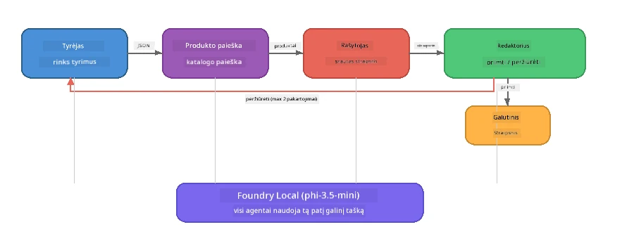

# 7 dalis: Zava kūrybinis rašytojas – baigiamasis taikymas

> **Tikslas:** Išnagrinėti gamybinio tipo daugiaveiksmę programą, kurioje keturi specializuoti agentai bendradarbiauja, kad sukurtų žurnalo kokybės straipsnius Zava Retail DIY – veikiantį visiškai jūsų įrenginyje su Foundry Local.

Tai yra **baigiamasis laboratorinis darbas** dirbtuvėse. Jame susijungia viskas, ko išmokote – SDK integracija (3 dalis), duomenų gavimas iš vietinių šaltinių (4 dalis), agentų vaidmenys (5 dalis) ir daugiaveiksmė orkestracija (6 dalis) – į pilną taikymą, prieinamą **Python**, **JavaScript** ir **C#**.

---

## Ką tyrinėsite

| Koncepcija | Zava rašytojo dalis |
|------------|---------------------|
| 4 žingsnių modelio užkrovimas | Bendras konfigūracijos modulis inicijuoja Foundry Local |
| RAG tipo gavimas | Produktų agentas ieško vietiniame kataloge |
| Agentų specializacija | 4 agentai su skirtingais sistemos raginimais |
| Srautinė išvestis | Rašytojas realiu laiku pateikia žodžius |
| Struktūruoti perdavimai | Tyrėjas → JSON, Redaktorius → JSON sprendimas |
| Grįžtamojo ryšio ciklai | Redaktorius gali inicijuoti pakartotinį vykdymą (maks. 2 bandymai) |

---

## Architektūra

Zava kūrybinis rašytojas naudoja **sekvenstinę grandinę su vertintojo kontroliuojamu grįžtamuoju ryšiu**. Visos trys kalbų įgyvendinimai seka tą pačią architektūrą:



### Keturi agentai

| Agentas | Įvestis | Išvestis | Paskirtis |
|---------|---------|----------|-----------|
| **Tyrėjas** | Tema + neprivalomas grįžtamasis ryšys | `{"web": [{url, name, description}, ...]}` | Renkasi pagrindinę informaciją per LLM |
| **Produktų paieška** | Produkto konteksto eilutė | Atitinkančių produktų sąrašas | LLM sukurti užklausimai + raktažodžių paieška vietiniame kataloge |
| **Rašytojas** | Tyrimai + produktai + užduotis + grįžtamasis ryšys | Straumenuojamas straipsnio tekstas (skiriamas ‛---’) | Kuria žurnalo kokybės straipsnį realiu laiku |
| **Redaktorius** | Straipsnis + rašytojo savianalizė | `{"decision": "accept/revise", "editorFeedback": "...", "researchFeedback": "..."}` | Vertina kokybę, jei reikia, inicijuoja pakartotinį vykdymą |

### Grandinės eiga

1. **Tyrėjas** gauna temą ir sudaro struktūruotas tyrimų pastabas (JSON)
2. **Produktų paieška** naudoja LLM sugeneruotas paieškos frazes vietiniame produktų kataloge
3. **Rašytojas** sujungia tyrimus, produktus ir užduotį į srautiniu būdu generuojamą straipsnį, po kurio pridedama savianalizė po `---` skyriklio
4. **Redaktorius** peržiūri straipsnį ir grąžina JSON sprendimą:
   - `"accept"` → užbaigia grandinę
   - `"revise"` → grįžtamasis ryšys siunčiamas Tyrėjui ir Rašytojui (maks. 2 pakartojimai)

---

## Reikalavimai

- Užbaigti [6 dalį: daugiaveiksmiai darbo srautai](part6-multi-agent-workflows.md)
- Įdiegti Foundry Local CLI ir atsisiųsti `phi-3.5-mini` modelį

---

## Pratimai

### 1 pratimas – paleiskite Zava kūrybinį rašytoją

Pasirinkite kalbą ir paleiskite programą:

<details>
<summary><strong>🐍 Python – FastAPI žiniatinklio paslauga</strong></summary>

Python versija veikia kaip **žiūrinė web paslauga** su REST API, demonstravusi, kaip sukurti gamybinį backend’ą.

**Diegimas:**
```bash
cd zava-creative-writer-local/src/api
python -m venv venv

# Windows (PowerShell):
venv\Scripts\Activate.ps1
# macOS:
source venv/bin/activate

pip install -r requirements.txt
```

**Paleidimas:**
```bash
uvicorn main:app --reload
```

**Testavimas:**
```bash
curl -X POST http://localhost:8000/api/article \
  -H "Content-Type: application/json" \
  -d '{
    "research": "DIY home improvement trends",
    "products": "power tools and paints",
    "assignment": "Write an article about weekend renovation projects for DIY enthusiasts"
  }'
```

Atsakas srautiniu būdu pateikiamas kaip eilutėmis atskirti JSON pranešimai, rodantys kiekvieno agente pažangą.

</details>

<details>
<summary><strong>📦 JavaScript – Node.js CLI</strong></summary>

JavaScript versija veikia kaip **komandų eilutės programa**, spausdinanti agentų pažangą ir straipsnį tiesiogiai konsolėje.

**Diegimas:**
```bash
cd zava-creative-writer-local/src/javascript
npm install
```

**Paleidimas:**
```bash
node main.mjs
```

Matysite:
1. Foundry Local modelio užkrovimą (jei atsisiunčiama, su pažangos juosta)
2. Kiekvieno agente seką su statuso pranešimais
3. Straipsnio srautą į konsolę realiu laiku
4. redaktoriaus priėmimo/peržiūros sprendimą

</details>

<details>
<summary><strong>💜 C# – .NET konsolės programa</strong></summary>

C# versija veikia kaip **.NET konsolės programa** su ta pačia grandine ir srautine išvestimi.

**Diegimas:**
```bash
cd zava-creative-writer-local/src/csharp
dotnet restore
```

**Paleidimas:**
```bash
dotnet run
```

Tas pats išvesties modelis kaip JavaScript versijoje – agentų statuso pranešimai, srautinė straipsnio išvestis ir redaktoriaus sprendimas.

</details>

---

### 2 pratimas – išnagrinėkite kodo struktūrą

Kiekvienos kalbos įgyvendinime yra tie patys logiški komponentai. Palyginkite struktūras:

**Python** (`src/api/`):
| Failas | Paskirtis |
|--------|-----------|
| `foundry_config.py` | Bendras Foundry Local valdymas, modelis ir klientas (4 žingsnių inicijavimas) |
| `orchestrator.py` | Grandinės koordinacija su grįžtamuoju ryšiu |
| `main.py` | FastAPI galiniai taškai (`POST /api/article`) |
| `agents/researcher/researcher.py` | LLM pagrįsti tyrimai su JSON išvestimi |
| `agents/product/product.py` | LLM sugeneruotos užklausos + raktažodžių paieška |
| `agents/writer/writer.py` | Srautinė straipsnio generacija |
| `agents/editor/editor.py` | JSON pagrindu priėmimo/peržiūros sprendimas |

**JavaScript** (`src/javascript/`):
| Failas | Paskirtis |
|--------|-----------|
| `foundryConfig.mjs` | Bendroji Foundry Local konfigūracija (4 žingsnių inicijavimas su pažangos juosta) |
| `main.mjs` | Orkestratorius + CLI įėjimo taškas |
| `researcher.mjs` | LLM pagrįstas tyrimų agentas |
| `product.mjs` | LLM užklausos generacija + raktažodžių paieška |
| `writer.mjs` | Srautinė straipsnio generacija (async generatorius) |
| `editor.mjs` | JSON priėmimo/peržiūros sprendimas |
| `products.mjs` | Produktų katalogo duomenys |

**C#** (`src/csharp/`):
| Failas | Paskirtis |
|--------|-----------|
| `Program.cs` | Pilna grandinė: modelio užkrovimas, agentai, orkestratorius, grįžtamasis ryšys |
| `ZavaCreativeWriter.csproj` | .NET 9 projektas su Foundry Local + OpenAI paketais |

> **Dizaino pastaba:** Python kiekvieną agentą atskiria į atskirą bylą/katalogą (tinka didesnėms komandoms). JavaScript – po vieną modulį kiekvienam agentui (tinka vidutinio dydžio projektams). C# – visa programa viename faile su vietinėmis funkcijomis (tinka pavyzdžiams). Gamyboje rinkitės modelį, atitinkantį jūsų komandos konvencijas.

---

### 3 pratimas – sekite bendrą konfigūraciją

Visi agentai grandinėje naudoja vieną Foundry Local modelio klientą. Pažiūrėkite, kaip tai įvykdyta kiekvienoje kalboje:

<details>
<summary><strong>🐍 Python – foundry_config.py</strong></summary>

```python
from foundry_local import FoundryLocalManager

MODEL_ALIAS = "phi-3.5-mini"

# 1 žingsnis: Sukurkite valdytoją ir paleiskite Foundry Local paslaugą
manager = FoundryLocalManager()
manager.start_service()

# 2 žingsnis: Patikrinkite, ar modelis jau atsisiųstas
cached = manager.list_cached_models()
catalog_info = manager.get_model_info(MODEL_ALIAS)
is_cached = any(m.id == catalog_info.id for m in cached) if catalog_info else False

if not is_cached:
    manager.download_model(MODEL_ALIAS)

# 3 žingsnis: Įkelkite modelį į atmintį
manager.load_model(MODEL_ALIAS)
model_id = manager.get_model_info(MODEL_ALIAS).id

# Bendrinamas OpenAI klientas
client = openai.OpenAI(base_url=manager.endpoint, api_key=manager.api_key)
```

Visi agentai importuoja `from foundry_config import client, model_id`.

</details>

<details>
<summary><strong>📦 JavaScript – foundryConfig.mjs</strong></summary>

```javascript
import { FoundryLocalManager } from "foundry-local-sdk";
import { OpenAI } from "openai";

FoundryLocalManager.create({ appName: "ZavaCreativeWriter" });
const manager = FoundryLocalManager.instance;
await manager.startWebService();

// Patikrinti talpyklą → atsisiųsti → įkelti (naujas SDK modelis)
const catalog = manager.catalog;
const model = await catalog.getModel(MODEL_ALIAS);
if (!model.isCached) {
  console.log(`Downloading model: ${MODEL_ALIAS}...`);
  await model.download();
}
await model.load();

const client = new OpenAI({ baseURL: manager.urls[0] + "/v1", apiKey: "foundry-local" });
const modelId = model.id;
export { client, modelId };
```

Visi agentai importuoja `{ client, modelId } from "./foundryConfig.mjs"`.

</details>

<details>
<summary><strong>💜 C# – Program.cs pradžia</strong></summary>

```csharp
await FoundryLocalManager.CreateAsync(
    new Configuration
    {
        AppName = "ZavaCreativeWriter",
        Web = new Configuration.WebService { Urls = "http://127.0.0.1:0" }
    }, NullLogger.Instance, default);
var manager = FoundryLocalManager.Instance;
await manager.StartWebServiceAsync(default);

var catalog = await manager.GetCatalogAsync(default);
var catalogModel = await catalog.GetModelAsync(alias, default);
var isCached = await catalogModel.IsCachedAsync(default);
if (!isCached)
    await catalogModel.DownloadAsync(null, default);

await catalogModel.LoadAsync(default);
var key = new ApiKeyCredential("foundry-local");
var chatClient = new OpenAIClient(key, new OpenAIClientOptions
{
    Endpoint = new Uri(manager.Urls[0] + "/v1")
}).GetChatClient(catalogModel.Id);
```

Tada `chatClient` perduodamas visoms agentų funkcijoms tame pačiame faile.

</details>

> **Pagrindinis modelis:** Modelio įkėlimo modelis (pradėti paslaugą → patikrinti talpyklą → atsisiųsti → užkrauti) leidžia vartotojui matyti pažangą ir modelis atsisiunčiamas tik vieną kartą. Tai geriausia praktika bet kuriai Foundry Local aplikacijai.

---

### 4 pratimas – supraskite grįžtamojo ryšio ciklą

Grįžtamojo ryšio ciklas daro grandinę „protingą“ – redaktorius gali prašyti pataisymų. Sekite logiką:

```
Orchestrator:
  1. researcher.research(topic, "No Feedback")    ← first pass
  2. product.findProducts(productContext)
  3. writer.write(research, products, assignment)  ← streams article
  4. Split article at "---" → article + writerFeedback
  5. editor.edit(article, writerFeedback)

  WHILE editor says "revise" AND retryCount < 2:
    6. researcher.research(topic, editor.researchFeedback)  ← refined
    7. writer.write(research, products, editor.editorFeedback)
    8. editor.edit(newArticle, newWriterFeedback)
    9. retryCount++
```

**Klausimai apmąstymui:**
- Kodėl pakartojimų limitas yra 2? Kas nutiktų, jei jį padidintumėte?
- Kodėl tyrimų agentas gauna `researchFeedback`, o rašytojas – `editorFeedback`?
- Kas nutiktų, jei redaktorius visada sakytų „peržiūrėti“?

---

### 5 pratimas – pakeiskite agentą

Pabandykite pakeisti vieno agente veikimą ir stebėkite, kaip tai paveiks grandinę:

| Pakeitimas | Ką keisti |
|------------|-----------|
| **Griežtesnis redaktorius** | Pakeiskite redaktoriaus sistemos raginimą visada prašyti bent vieno pataisymo |
| **Ilgesni straipsniai** | Pakeiskite rašytojo raginimą iš „800–1000 žodžių“ į „1500–2000 žodžių“ |
| **Kiti produktai** | Pridėkite arba keiskite produktus produktų kataloge |
| **Nauja tyrimų tema** | Pakeiskite numatytą `researchContext` į kitą temą |
| **Tyrėjas tik JSON formate** | Padarykite, kad tyrėjas pateiktų 10 elementų vietoje 3–5 |

> **Patarimas:** Kadangi visos trys kalbos įgyvendina tą pačią architektūrą, tą pačią modifikaciją galite atlikti kalboje, kuria dirbate patogiausiai.

---

### 6 pratimas – pridėkite penktą agentą

Išplėskite grandinę nauju agentu. Štai keletas idėjų:

| Agentas | Grandinės vieta | Paskirtis |
|---------|-----------------|-----------|
| **Faktų tikrintojas** | Po rašytojo, prieš redaktorių | Patikrina teiginius pagal tyrimų duomenis |
| **SEO optimizatorius** | Po to, kai redaktorius priima | Prideda meta aprašymą, raktažodžius, slankiklį |
| **Iliustratorius** | Po redaktoriaus priėmimo | Generuoja iliustracijų užklausimus straipsniui |
| **Vertėjas** | Po redaktoriaus priėmimo | Verčia straipsnį į kitą kalbą |

**Žingsniai:**
1. Parašykite agento sistemos raginimą
2. Sukurkite agento funkciją (atitinkančią esamą modelį jūsų kalboje)
3. Įterpkite jį į orkestratorių reikiamoje vietoje
4. Atnaujinkite išvestį/logą rodant naujo agento indėlį

---

## Kaip Foundry Local ir Agentų sistema veikia kartu

Ši programa demonstruoja rekomenduojamą daugiaveiksmių sistemų kūrimo modelį su Foundry Local:

| Sluoksnis | Komponentas | Vaidmuo |
|-----------|-------------|---------|
| **Veikimo laikas** | Foundry Local | Atsisiunčia, valdo ir vietoje aptarnauja modelį |
| **Klientas** | OpenAI SDK | Siunčia pokalbių užklausas vietiniam taškui |
| **Agentas** | Sistemos raginimas + pokalbio kvietimas | Specializuotas elgesys per tikslius nurodymus |
| **Orkestratorius** | Grandinės koordinavimas | Valdo duomenų srautus, seką ir grįžtamuosius ryšius |
| **Sistemų karkasas** | Microsoft Agent Framework | Teikia `ChatAgent` abstrakciją ir modelius |

Svarbu: **Foundry Local keičia debesijos backend’ą, bet ne programos architektūrą.** Tie patys agentų modeliai, orkestravimo strategijos ir struktūruoti perdavimai, kurie veikia su debesijos modeliais, veikia taip pat su vietiniais modeliais – jums tereikia nukreipti klientą į vietinį tašką vietoje Azure taško.

---

## Pagrindinės išvados

| Koncepcija | Ką sužinojote |
|------------|---------------|
| Gamybinė architektūra | Kaip struktūruoti daugiaveiksmę programą su bendrais nustatymais ir atskirais agentais |
| 4 žingsnių modelio užkrovimas | Geriausia praktika inicializuojant Foundry Local su matomu vartotojui progresu |
| Agentų specializacija | Kiekvienas iš 4 agentų turi tikslines instrukcijas ir specifinį išvesties formatą |
| Srautinis generavimas | Rašytojas realiu laiku pateikia žodžius, leidžiant interaktyvias vartotojo sąsajas |
| Grįžtamojo ryšio ciklai | Redaktoriaus inicijuotas pakartotinis vykdymas gerina kokybę be žmogaus įsikišimo |
| Tarpkalkbiniai modeliai | Ta pati architektūra veikia Python, JavaScript ir C# |
| Vietinis = gamybai tinkamas | Foundry Local aptarnauja tą patį OpenAI suderinamą API, naudojamą debesijos sprendimuose |

---

## Kitas žingsnis

Tęskite į [8 dalį: vertinimu pagrįstas vystymas](part8-evaluation-led-development.md) ir sukurkite sistemingą agentų vertinimo sistemą, naudodami aukso standartų duomenų rinkinius, taisyklių tikrinimus ir LLM kaip teisėjo įvertinimus.

---

<!-- CO-OP TRANSLATOR DISCLAIMER START -->
**Atsakomybės apribojimas**:
Šis dokumentas buvo išverstas naudojant DI vertimo paslaugą [Co-op Translator](https://github.com/Azure/co-op-translator). Nors stengiamės užtikrinti tikslumą, prašome atkreipti dėmesį, kad automatiniai vertimai gali turėti klaidų ar netikslumų. Originalus dokumentas jo gimtąja kalba turėtų būti laikomas autoritetingu šaltiniu. Svarbiai informacijai rekomenduojama profesionali žmogaus vertimo paslauga. Mes nerenkame atsakomybės už bet kokius nesusipratimus ar klaidingus interpretavimus, kylančius naudojant šį vertimą.
<!-- CO-OP TRANSLATOR DISCLAIMER END -->