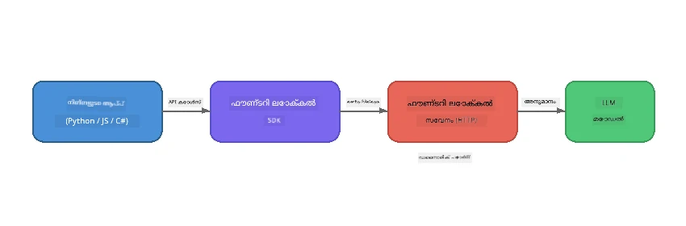

# ഭാഗം 1: Foundry Local ഉപയോഗിച്ച് തുടക്കം കുറിക്കുക


## Foundry Local എന്താണ്?

[Foundry Local](https://foundrylocal.ai) നിങ്ങൾക്ക് തുറന്ന സോഴ്‌സ് AI ഭാഷ മോഡലുകൾ **നേരിട്ട് നിങ്ങളുടെ കമ്പ്യൂട്ടറിൽ** പ്രവർത്തിക്കാൻ അനുവദിക്കുന്നു - ഇന്റർനെറ്റ് ആവശ്യമില്ല, ക്ലൗഡ് ചെലവുകൾ ഇല്ല, മുഴുവനായും ഡാറ്റ സ്വകാര്യത ഉറപ്പാക്കുന്നു. ഇത്:

- **ഹാർഡ്‌വെയർ സ്വയംഅനുകൂലനത്തോടെ (GPU, CPU, അല്ലെങ്കിൽ NPU) മോഡലുകൾ ഡൗൺലോഡ് ചെയ്ത് ലോക്കലായി പ്രവർത്തിപ്പിക്കുന്നു**
- **ഏതാണ്ട് OpenAI-സമാനമായ API-വുൽപ്പാദിപ്പിക്കുന്നു**, അതിലൂടെ പരിചിതമായ SDKകൾ և ഉപകരണങ്ങൾ ഉപയോഗിക്കാം
- **ഏതു Azure സബ്സ്ക്രിപ്ഷനും സൈൻ അപ്പും ആവശ്യമില്ല** - ഒറ്റയ്ക്കും ഇൻസ്റ്റാൾ ചെയ്ത് നിർമ്മാണം ആരംഭിക്കാം

ഇത് നിങ്ങളുടെ യന്ത്രത്തിൽ പൂര്‍ണമായും പ്രവർത്തിക്കുന്ന സ്വന്തം സ്വകാര്യ AI ഉണ്ട് എന്ന് കരുതുക.

## പഠന ഉദ്ദേശ്യങ്ങൾ

ഈ ലാബിന്റെ അവസാനത്തോടെ നിങ്ങൾക്ക് കഴിയുന്നത്:

- നിങ്ങളുടെ ഓപ്പറേറ്റിംഗ് സിസ്റ്റത്തിൽ Foundry Local CLI ഇൻസ്റ്റാൾ ചെയ്യുക
- മോഡൽ ഉപനാമങ്ങൾ എന്താണെന്നും അവ എങ്ങനെ പ്രവർത്തിക്കുന്നുവെന്നും മനസ്സിലാക്കുക
- നിങ്ങളുടെ ആദ്യ ലോക്കൽ AI മോഡൽ ഡൗൺലോഡ് ചെയ്ത് പ്രവർത്തിപ്പിക്കുക
- കമാൻഡ് ലൈൻ മുതൽ ഒരു ലോക്കൽ മോഡലിലേക്ക് ചാറ്റ് സന്ദേശം അയയ്ക്കുക
- ലോക്കൽ AI മോഡലുകളും ക്ലൗഡ്-ഹോസ്റ്റ് ചെയ്ത AI മോഡലുകളും തമ്മിലുള്ള വ്യത്യാസം മനസ്സിലാക്കുക

---

## മുൻപരിചയം

### സിസ്റ്റം ആവശ്യകതകൾ

| ആവശ്യം | കുറഞ്ഞത് | ശുപാർശ ചെയ്യുന്നു |
|-------------|---------|-------------|
| **RAM** | 8 GB | 16 GB |
| **ഡിസ്‌ക് സ്ഥലം** | 5 GB (മോഡലുകൾക്കായി) | 10 GB |
| **CPU** | 4 കേർ | 8+ കേർ |
| **GPU** | ഐച്ഛികം | NVIDIA CUDA 11.8+ ഉള്ളത് |
| **ഓപ്പറേറ്റിംഗ് സിസ്റ്റം** | Windows 10/11 (x64/ARM), Windows Server 2025, macOS 13+ | - |

> **നോട്ട്:** Foundry Local നിങ്ങളുടെ ഹാർഡ്‌വെയറിന് ഏറ്റവും അനുയോജ്യമായ മോഡൽ വേർതിരിക്കുന്നു. NVIDIA GPU ഉണ്ടെങ്കിൽ CUDA ആക്സലറേഷൻ ഉപയോഗിക്കുന്നു. Qualcomm NPU ഉണ്ടെങ്കിൽ അതിലേക്കും. അല്ലെങ്കിൽ ഓപ്റ്റിമൈസ് ചെയ്തത് CPU മോഡലിലേക്ക് മടങ്ങുന്നു.

### Foundry Local CLI ഇൻസ്റ്റാൾ ചെയ്യുക

**Windows** (PowerShell):  
```powershell
winget install Microsoft.FoundryLocal
```
  
**macOS** (Homebrew):  
```bash
brew tap microsoft/foundrylocal
brew install foundrylocal
```
  
> **നോട്ട്:** Foundry Local നിലവിൽ Windows, macOS മാത്രമേ പിന്തുണയ്ക്കൂ. ഈ സമയത്ത് Linux പിന്തുണ ഇല്ല.

ഇൻസ്റ്റലേഷൻ സ്ഥിരീകരിക്കുക:  
```bash
foundry --version
```
  
---

## ലാബ് അഭ്യസനങ്ങൾ

### അഭ്യാസം 1: ലഭ്യമായ മോഡലുകൾ അന്വേഷിക്കുക

Foundry Local പ്രീ-ഓപ്റ്റിമൈസ്ഡ് ഓപ്പൺ സോഴ്‌സ് മോഡലുകളുടെ ഒരു കാറ്റലോഗ് ഉൾപ്പെടുത്തിയിരിക്കുന്നു. അവ പരിശോധിക്കുക:

```bash
foundry model list
```
  
നിങ്ങൾ കാണുന്ന മോഡലുകൾ:  
- `phi-3.5-mini` - Microsoft-ന്റെ 3.8B പാരামീറ്റർ മോഡൽ (വേഗം, നല്ല ഗുണനിലവ്)  
- `phi-4-mini` - പുതിയ, കൂടുതൽ കഴിവുള്ള Phi മോഡൽ  
- `phi-4-mini-reasoning` - ചിന്താവഴി പങ്കു വയ്ക്കുന്ന Phi മോഡൽ (`<think>` ടാഗുകൾ ഉപയോഗിച്ചുള്ള)  
- `phi-4` - Microsoft-ന്റെ വലിയ Phi മോഡൽ (10.4 GB)  
- `qwen2.5-0.5b` - വളരെ ചെറുതും വേഗമുള്ളതും (കുറഞ്ഞ വിഭവങ്ങൾ ഉള്ള ഉപകരണങ്ങൾക്ക് അനുയോജ്യം)  
- `qwen2.5-7b` - ശക്തമായ പൊതു ഉപയോഗ മോഡൽ ടൂൾ-കോളിംഗ് പിന്തുണയോടുകൂടി  
- `qwen2.5-coder-7b` - കോഡ് ജനറേഷൻക്ക് ഓപ്റ്റിമൈസ് ചെയ്തത്  
- `deepseek-r1-7b` - ശക്തമായ റീസണിംഗ് മോഡൽ  
- `gpt-oss-20b` - വലിയ ഓപ്പൺ സോഴ്‌സ് മോഡൽ (MIT ലൈസൻസ്, 12.5 GB)  
- `whisper-base` - സംസാരത്തിൽ നിന്ന് വാചകത്തിലേക്ക് ട്രാൻസ്ക്രിപ്ഷൻ (383 MB)  
- `whisper-large-v3-turbo` - ഉയർന്ന കൃത്യതയുള്ള ട്രാൻസ്ക്രിപ്ഷൻ (9 GB)

> **മോഡൽ ഉപനാമം എന്താണ്?** `phi-3.5-mini` പോലുള്ള ഉപനാമങ്ങൾ ചുരുക്കമാണു. ഉപനാമം ഉപയോഗിക്കുമ്പോൾ Foundry Local നിങ്ങളുടെ ഹാർഡ്‌വെയറിന് അനുയോജ്യമായ ഏറ്റവും നല്ല വേർഷൻ യന്ത്രം തുടർച്ചയായി ഡൗൺലോഡ് ചെയ്യും (NVIDIA GPUകൾക്ക് CUDA ഉപയോഗിച്ച്, അല്ലെങ്കിൽ CPU-ഓപ്റ്റിമൈസ് ചെയ്തതും). ശരിയായ വേർഷൻ തിരഞ്ഞെടുക്കാൻ നിങ്ങള്ക്ക് പണം ആവശ്യമില്ല.

### അഭ്യാസം 2: നിങ്ങളുടെ ആദ്യ മോഡൽ പ്രവർത്തിപ്പിക്കുക

ഡൗൺലോഡ് ചെയ്ത് ഒരു മോഡലുമായി ഇന്ററാക്ടീവ് ചാറ്റ് ആരംഭിക്കുക:

```bash
foundry model run phi-3.5-mini
```
  
നിങ്ങൾ ആദ്യമായി ഇത് പ്രവർത്തിപ്പിക്കുമ്പോൾ, Foundry Local ചെയ്യും:  
1. നിങ്ങളുടെ ഹാർഡ്‌വെയർ കണ്ടെത്തും  
2. മികച്ച മോഡൽ വേർഷൻ ഡൗൺലോഡ് ചെയ്യും (കുറച്ച് മിനിറ്റുകൾ എടുക്കാം)  
3. മോഡൽ മെമ്മറിയിൽ ലോഡ് ചെയ്യും  
4. ഒരു ഇന്ററാക്ടീവ് ചാറ്റ് സെഷൻ ആരംഭിക്കും

അത് ചില ചോദ്യങ്ങൾ ചോദിച്ച് പരീക്ഷിക്കൂ:  
```
You: What is the golden ratio?
You: Can you explain it as if I were 10 years old?
You: Write a haiku about mathematics
```
  
പുറത്യാഗം ചെയ്യാൻ പിൽക്കാലം `exit` ടൈപ്പ് ചെയ്യുക അല്ലെങ്കിൽ `Ctrl+C` അമർത്തുക.

### അഭ്യാസം 3: ഒരു മോഡൽ മുൻകൂട്ടി ഡൗൺലോഡ് ചെയ്യുക

ചാറ്റ് ആരംഭിക്കാതെ ഒരു മോഡൽ ഡൗൺലോഡ് ചെയ്യാൻ ഇഷ്ടപ്പെടുന്നുവെങ്കിൽ:

```bash
foundry model download phi-3.5-mini
```
  
നിങ്ങളുടെ യന്ത്രത്തിൽ എങ്ങനെ ഏതെല്ലാം മോഡലുകൾ ഡൗൺലോഡ് ചെയ്തിട്ടുണ്ടെന്ന് പരിശോധിക്കുക:  

```bash
foundry cache list
```
  
### അഭ്യാസം 4: ആർക്കിടെക്ചർ മനസ്സിലാക്കുക

Foundry Local ഒരു **ലോക്കൽ HTTP സർവീസ്** ആയി പ്രവർത്തിക്കുന്നു, ഇത് OpenAI-സമാനമായ REST API മുൽപ്പടെ തുറക്കും. ഇതിന്റെ അർത്ഥം:

1. സർവീസ് ഒരു **ഡൈനാമിക് പോർട്ട്** (പ്രത്യേക ഓരോ തവണ) ഉപയോഗിച്ച് ആരംഭിക്കും  
2. SDK ഉപയോഗിച്ച് യഥാർത്ഥ സർക്കുലേറ്റ് URL കണ്ടെത്തുന്നു  
3. നിങ്ങൾക്ക് **ഏതെങ്കിലും** OpenAI-സമാനമായ ക്ലയന്റ് ലൈബ്രറി ഉപയോഗിച്ച് അതുമായി സംസാരിക്കാം



> **പ്രധാനമാകും:** Foundry Local ഓരോ തവണയും ഒരു **ഡൈനാമിക് പോർട്ട്** നിയോഗിക്കുന്നു. `localhost:5272` പോലുള്ള പോർട്ട് നമ്പർ ഹാർഡ്‌കോഡ് ചെയ്യരുത്. നിലവിലെ URL കണ്ടെത്താൻ എപ്പോഴും SDK ഉപയോഗിക്കണം (Python-ൽ `manager.endpoint` അല്ലെങ്കിൽ JavaScript-ൽ `manager.urls[0]`).

---

## മുഖ്യപ്പെട്ട കാര്യങ്ങൾ

| ആശയം | നിങ്ങൾ പഠിച്ചത് |
|---------|------------------|
| ഓൺ-ഡിവൈസ് AI | Foundry Local മോഡലുകൾ പൂർണമായും നിങ്ങളുടെ ഉപകരണത്തിൽ ക്ലൗഡ്, API കീകൾ, ചെലവുകൾ ഇല്ലാതെ പ്രവർത്തിക്കുന്നു |
| മോഡൽ ഉപനാമങ്ങൾ | `phi-3.5-mini` പോലുള്ള ഉപനാമങ്ങൾ നിങ്ങളുടെ ഹാർഡ്‌വെയറിന് ഏറ്റവും അനുയോജ്യമായ വേർഷൻ സ്വയമേവ തിരഞ്ഞെടുക്കുന്നു |
| ഡൈനാമിക് പോർട്ടുകൾ | സർവീസ് ഒരു ഡൈനാമിക് പോർട്ടിൽ പ്രവർത്തിക്കുന്നു; എന്‍ഡ്പോയിന്റ് കണ്ടെത്താൻ SDK എപ്പോഴും ഉപയോഗിക്കുക |
| CLI & SDK | CLI വഴി (`foundry model run`) അല്ലെങ്കിൽ SDK പ്രോഗ്രാമാറ്റിക്കായി മോഡലുകളുമായി ആശയവിനിമയം നടത്താം |

---

## അടുത്ത പടികൾ

[ഭാഗം 2: Foundry Local SDK ഡീപ്പ് ഡൈവ്](part2-foundry-local-sdk.md) - മോഡലുകൾ, സർവീസുകൾ, കാഷിംഗ് പ്രോഗ്രാമാറ്റിക്കായി കൈകാര്യം ചെയ്യുന്നതിനുള്ള SDK API മനസ്സിലാക്കാൻ തുടരുമ്.