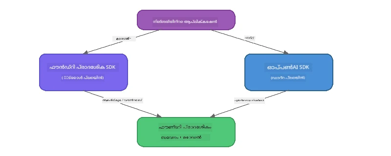

# ഭാഗം 3: OpenAI-യോട് കൂടി Foundry Local SDK ഉപയോഗിക്കൽ

## അവലോകനം

ഭാഗം 1-ൽ നിങ്ങൾ Foundry Local CLI ഉപയോഗിച്ച് മോഡലുകൾ ഇന്ററാക്റ്റീവായി ഓടിച്ചിരുന്നു. ഭാഗം 2-ൽ SDK API-യുടെ മുഴുവൻ സതഹം നിങ്ങൾ അന്വേഷിച്ചു. ഇനി SDKയും OpenAI-പ്രകാരം പ്രവർത്തിക്കുന്ന API-യും ഉപയോഗിച്ച് **Foundry Local നിങ്ങളുടെ ആപ്ലിക്കേഷനുകളിൽ എങ്ങനെ ഇന്റഗ്രേറ്റ് ചെയ്യാമെന്ന്** നിങ്ങൾ പഠിക്കും.

Foundry Local മൂന്ന് ഭാഷകളിൽ SDKകൾ നൽകുന്നു. നിങ്ങൾക്ക് ഏറ്റവും സൗകര്യപ്രദമായ ഭാഷ തിരഞ്ഞെടുക്കൂ - മൂന്നു ഭാഷകളിലും ആശയങ്ങൾ ഒരുനാനമാണ്.

## പഠന ലക്ഷ്യങ്ങൾ

ഈ ലാബ് അവസാനിച്ചപ്പോൾ നിങ്ങൾ കഴിയും:

- നിങ്ങളുടെ ഭാഷയ്ക്ക് അനുയോജ്യമായ Foundry Local SDK ഇൻസ്റ്റാളുചെയ്യുക (Python, JavaScript, അല്ലെങ്കിൽ C#)
- `FoundryLocalManager` പ്രാപ്തമാക്കി സേവനം തുടങ്ങുക, ക്യാഷെ പരിശോധിക്കുക, ഡൗൺലോഡ് ചെയ്ത് മോഡൽ ലോഡ് ചെയ്യുക
- OpenAI SDK ഉപയോഗിച്ച് ലൊക്കൽ മോഡലുമായി ബന്ധിപ്പിക്കുക
- ചാറ്റ് കോംപ്ലീഷനുകൾ അയയ്ക്കുകയും സ്ട്രീമിംഗ് റെസ്പോൺസുകൾ കൈകാര്യം ചെയ്യുകയും ചെയ്യുക
- ഡൈനാമിക് പോർട്ട് സങ്കേതം മനസിലാക്കുക

---

## മുൻവിധികൾ

[Part 1: Getting Started with Foundry Local](part1-getting-started.md)ും [Part 2: Foundry Local SDK Deep Dive](part2-foundry-local-sdk.md)ഉം പൂർത്തിയാക്കുക.

താഴെ പറയുന്ന ഭാഷാ റൺടൈമുകളിൽ **ഒന്ന്** ഇൻസ്റ്റാൾ ചെയ്യുക:
- **Python 3.9+** - [python.org/downloads](https://www.python.org/downloads/)
- **Node.js 18+** - [nodejs.org](https://nodejs.org/)
- **.NET 9.0+** - [dot.net/download](https://dotnet.microsoft.com/download)

---

## ആശയം: SDK എങ്ങനെ പ്രവർത്തിക്കുന്നു

Foundry Local SDK **കൺട്രോൾ പ്ലെയിൻ** (സേവനം തുടങ്ങിയ്ക്കൽ, മോഡലുകൾ ഡൗൺലോഡ് ചെയ്യൽ) കൈകാര്യം ചെയ്യുന്നു, OpenAI SDK **ഡാറ്റ പ്ലെയിൻ** (പ്രാമ്പ്റ്റുകൾ അയയ്ക്കൽ, കോംപ്ലീഷനുകൾ സ്വീകരിക്കൽ) കൈകാര്യം ചെയ്യുന്നു.



---

## ലാബ് അഭ്യാസങ്ങൾ

### അഭ്യാസം 1: നിങ്ങളുടെ പരിതസ്ഥിതിക്ക് സജ്ജീകരണം

<details>
<summary><b>🐍 Python</b></summary>

```bash
cd python
python -m venv venv

# വിർച്വൽ എൻവയോൺമെന്റ് സജീവമാക്കുക:
# വിൻഡോസ് (പവർഷെൽ):
venv\Scripts\Activate.ps1
# വിൻഡോസ് (കമാൻഡ് പ്രాంప്റ്റ്):
venv\Scripts\activate.bat
# മാക്‌ഒഎസ്:
source venv/bin/activate

pip install -r requirements.txt
```

`requirements.txt` ഇതു ഇൻസ്റ്റാൾ ചെയ്യുന്നു:
- `foundry-local-sdk` - Foundry Local SDK (`foundry_local` എന്ന പേരിൽ ഇമ്പോർട്ട് ചെയ്യുന്നു)
- `openai` - OpenAI Python SDK
- `agent-framework` - Microsoft Agent Framework (പിന്നെ ഭാഗങ്ങളിൽ ഉപയോഗിക്കും)

</details>

<details>
<summary><b>📘 JavaScript</b></summary>

```bash
cd javascript
npm install
```

`package.json` താഴെ പറഞ്ഞ പാക്കേജുകൾ ഇൻസ്റ്റാൾ ചെയ്യുന്നു:
- `foundry-local-sdk` - Foundry Local SDK
- `openai` - OpenAI Node.js SDK

</details>

<details>
<summary><b>💜 C#</b></summary>

```bash
cd csharp
dotnet restore
dotnet build
```

`csharp.csproj` ഉപയോഗിക്കുന്നത്:
- `Microsoft.AI.Foundry.Local` - Foundry Local SDK (NuGet)
- `OpenAI` - OpenAI C# SDK (NuGet)

> **പ്രോജക്ട് ഘടന:** C# പ്രോജക്ടിൽ `Program.cs` ൽ കമാൻഡ്-ലൈൻ റൂട്ടർ ആണ്, ഇത് പ്രത്യേക ഉദാഹരണ ഫയലുകളിൽ ഡിസ്പാച്ച് ചെയ്യുന്നു. ഈ ഭാഗത്തിനായി `dotnet run chat` (അല്ലെങ്കിൽ സാധാരണ `dotnet run`) പ്രവർത്തിപ്പിക്കുക. മറ്റു ഭാഗങ്ങൾക്ക് `dotnet run rag`, `dotnet run agent`, `dotnet run multi` ഉം ഉപയോഗിക്കും.

</details>

---

### അഭ്യാസം 2: അടിസ്ഥാന ചാറ്റ് കോംപ്ലീഷൻ

നിങ്ങളുടെ ഭാഷയിലെ അടിസ്ഥാന ചാറ്റ് ഉദാഹരണം തുറന്ന് കോഡ് പരിശോധിക്കുക. ഓരോ സ്ക്രിപ്റ്റും താഴെ പറയുന്ന മൂന്ന് ഘട്ടങ്ങൾ പിന്തുടരുന്നു:

1. **സേവനം ആരംഭിക്കുക** - `FoundryLocalManager` Foundry Local റൺടൈം ആരംഭിക്കുന്നു
2. **മോഡൽ ഡൗൺലോഡ് ചെയ്ത് ലോഡ് ചെയ്യുക** - ക്യാഷെ പരിശോധിക്കുക, ആവശ്യമെങ്കിൽ ഡൗൺലോഡ് ചെയ്ത് പിന്നീട് മെമ്മറിയിൽ ലോഡ് ചെയ്യുക
3. **OpenAI ക്ലയന്റ് സൃഷ്ടിക്കുക** - ലൊക്കൽ എൻഡ്‌പോയിന്റുമായി കണക്ട് ചെയ്ത് സ്ട്രീമിംഗ് ചാറ്റ് കോംപ്ലീഷൻ അയയ്ക്കുക

<details>
<summary><b>🐍 Python - <code>python/foundry-local.py</code></b></summary>

```python
import sys
import openai
from foundry_local import FoundryLocalManager

alias = "phi-3.5-mini"

# ഘട്ടം 1: ഒരു FoundryLocalManager സൃഷ്ടിച്ച് സർവീസ് ആരംഭിക്കുക
print("Starting Foundry Local service...")
manager = FoundryLocalManager()
manager.start_service()

# ഘട്ടം 2: മോഡൽ ഇതിനകം ഡൗൺലോഡ് ചെയ്തിട്ടുണ്ടോ എന്ന് പരിശോധിക്കുക
cached = manager.list_cached_models()
catalog_info = manager.get_model_info(alias)
is_cached = any(m.id == catalog_info.id for m in cached) if catalog_info else False

if is_cached:
    print(f"Model already downloaded: {alias}")
else:
    print(f"Downloading model: {alias} (this may take several minutes)...")
    manager.download_model(alias)
    print(f"Download complete: {alias}")

# ഘട്ടം 3: മോഡൽ മെമ്മറിയിൽ ലോഡ് ചെയ്യുക
print(f"Loading model: {alias}...")
manager.load_model(alias)

# ലോക്കൽ Foundry സർവിസിലേക്കുള്ള ഒരു OpenAI ക്ലയന്റ് സൃഷ്ടിക്കുക
client = openai.OpenAI(
    base_url=manager.endpoint,   # ഡൈനാമിക് പോർട്ട് - ഒരിക്കലും ഹാർഡ്‌ക്കോഡ് ചെയ്യരുത്!
    api_key=manager.api_key
)

# ഒരു സ്ട്രീമിംഗ് ചാറ്റ് പൂർത്തീകരണം സൃഷ്ടിക്കുക
stream = client.chat.completions.create(
    model=manager.get_model_info(alias).id,
    messages=[{"role": "user", "content": "What is the golden ratio?"}],
    stream=True,
)

for chunk in stream:
    if chunk.choices[0].delta.content is not None:
        print(chunk.choices[0].delta.content, end="", flush=True)
print()
```

**ഈ തീർച്ച നടത്തുക:**
```bash
python foundry-local.py
```

</details>

<details>
<summary><b>📘 JavaScript - <code>javascript/foundry-local.mjs</code></b></summary>

```javascript
import { OpenAI } from "openai";
import { FoundryLocalManager } from "foundry-local-sdk";

const alias = "phi-3.5-mini";

// ചുവടു 1: ഫൗണ്ട്രി ലോക്കൽ സർവീസ് ആരംഭിക്കുക
console.log("Starting Foundry Local service...");
FoundryLocalManager.create({ appName: "FoundryLocalWorkshop" });
const manager = FoundryLocalManager.instance;
await manager.startWebService();

// ചുവടു 2: മോഡൽ മുമ്പ് ഡൗൺലോഡ് ചെയ്തിട്ടുണ്ടോ എന്ന് പരിശോധിക്കുക
const catalog = manager.catalog;
const model = await catalog.getModel(alias);

if (model.isCached) {
  console.log(`Model already downloaded: ${alias}`);
} else {
  console.log(`Downloading model: ${alias} (this may take several minutes)...`);
  await model.download();
  console.log(`Download complete: ${alias}`);
}

// ചുവടു 3: മോഡൽ മെമ്മറിയിൽ ലോഡ് ചെയ്യുക
console.log(`Loading model: ${alias}...`);
await model.load();
console.log(`Model loaded: ${model.id}`);

// ലോക്കൽ ഫൗണ്ട്രി സർവീസ് കാണിക്കുന്ന ഒരു OpenAI ക്ലയന്റു സൃഷ്ടിക്കുക
const client = new OpenAI({
  baseURL: manager.urls[0] + "/v1",   // ഡൈനാമിക് പോർട്ട് - ഹാർഡ്‌കോഡ് ചെയ്യരുത്!
  apiKey: "foundry-local",
});

// ഒരു സ്ട്രീമിംഗ് ചാറ്റ് പൂർത്തിയാക്കൽ സൃഷ്ടിക്കുക
const stream = await client.chat.completions.create({
  model: model.id,
  messages: [{ role: "user", content: "What is the golden ratio?" }],
  stream: true,
});

for await (const chunk of stream) {
  if (chunk.choices[0]?.delta?.content) {
    process.stdout.write(chunk.choices[0].delta.content);
  }
}
console.log();
```

**ഈ തീർച്ച നടത്തുക:**
```bash
node foundry-local.mjs
```

</details>

<details>
<summary><b>💜 C# - <code>csharp/BasicChat.cs</code></b></summary>

```csharp
using Microsoft.AI.Foundry.Local;
using Microsoft.Extensions.Logging.Abstractions;
using OpenAI;
using OpenAI.Chat;
using System.ClientModel;

var alias = "phi-3.5-mini";

// Step 1: Start the Foundry Local service
Console.WriteLine("Starting Foundry Local service...");
await FoundryLocalManager.CreateAsync(
    new Configuration
    {
        AppName = "FoundryLocalSamples",
        Web = new Configuration.WebService { Urls = "http://127.0.0.1:0" }
    }, NullLogger.Instance, default);
var manager = FoundryLocalManager.Instance;
await manager.StartWebServiceAsync(default);

// Step 2: Get the model from the catalog
var catalog = await manager.GetCatalogAsync(default);
var model = await catalog.GetModelAsync(alias, default);

// Step 3: Check if the model is already downloaded
var isCached = await model.IsCachedAsync(default);

if (isCached)
{
    Console.WriteLine($"Model already downloaded: {alias}");
}
else
{
    Console.WriteLine($"Downloading model: {alias} (this may take several minutes)...");
    await model.DownloadAsync(null, default);
    Console.WriteLine($"Download complete: {alias}");
}

// Step 4: Load the model into memory
Console.WriteLine($"Loading model: {alias}...");
await model.LoadAsync(default);
Console.WriteLine($"Loaded model: {model.Id}");
Console.WriteLine($"Endpoint: {manager.Urls[0]}");

// Create OpenAI client pointing to the LOCAL Foundry service
var key = new ApiKeyCredential("foundry-local");
var client = new OpenAIClient(key, new OpenAIClientOptions
{
    Endpoint = new Uri(manager.Urls[0] + "/v1")  // Dynamic port - never hardcode!
});

var chatClient = client.GetChatClient(model.Id);

// Stream a chat completion
var completionUpdates = chatClient.CompleteChatStreaming("What is the golden ratio?");

foreach (var update in completionUpdates)
{
    if (update.ContentUpdate.Count > 0)
    {
        Console.Write(update.ContentUpdate[0].Text);
    }
}
Console.WriteLine();
```

**ഈ തീർച്ച നടത്തുക:**
```bash
dotnet run chat
```

</details>

---

### അഭ്യാസം 3: പ്രാമ്പ്റ്റുകൾ പരീക്ഷിക്കുക

നിങ്ങളുടെ അടിസ്ഥാന ഉദാഹരണം പ്രവർത്തിച്ചതിനുശേഷം, കോഡ് മാറ്റി പരീക്ഷിക്കുക:

1. **യൂസർ സന്ദേശം മാറ്റുക** - വ്യത്യസ്ത ചോദ്യങ്ങൾ നൽകുക
2. **സിസ്റ്റം പ്രാമ്പ്റ്റ് ചേർക്കുക** - മോഡലിന് ഒരു വ്യക്തിത്വം നൽകുക
3. **സ്ട്രീമിംഗ് ഓഫ് ചെയ്യുക** - `stream=False` സെറ്റ് ചെയ്ത് പൂർണ്ണ റെസ്പോൺസ് ഒരുമിച്ച് പ്രിന്റ് ചെയ്യുക
4. **മറ്റ് മോഡൽ പരീക്ഷിക്കുക** - `phi-3.5-mini` എന്ന ആലിയസിൽ നിന്ന് മറ്റൊരു മോഡലിലേക്ക് മാറ്റുക, `foundry model list` ഉപയോഗിച്ച് കണ്ടെത്തുക

<details>
<summary><b>🐍 Python</b></summary>

```python
# ഒരു സിസ്റ്റം പ്രാമ്പ്റ്റ് ചേർക്കുക - മോഡലിന് ഒരു വ്യക്തിത്വം കൊടുക്കുക:
stream = client.chat.completions.create(
    model=manager.get_model_info(alias).id,
    messages=[
        {"role": "system", "content": "You are a pirate. Answer everything in pirate speak."},
        {"role": "user", "content": "What is the golden ratio?"}
    ],
    stream=True,
)

# അല്ലെങ്കിൽ സ്റ്റ്രീമിംഗ് ഓഫാക്കുക:
response = client.chat.completions.create(
    model=manager.get_model_info(alias).id,
    messages=[{"role": "user", "content": "What is the golden ratio?"}],
    stream=False,
)
print(response.choices[0].message.content)
```

</details>

<details>
<summary><b>📘 JavaScript</b></summary>

```javascript
// ഒരു സിസ്റ്റം പ്രോംപ്റ്റ് ചേർക്കുക - മോഡലിന് ഒരു വ്യക്തിത്വം നൽകുക:
const stream = await client.chat.completions.create({
  model: modelInfo.id,
  messages: [
    { role: "system", content: "You are a pirate. Answer everything in pirate speak." },
    { role: "user", content: "What is the golden ratio?" },
  ],
  stream: true,
});

// അല്ലെങ്കിൽ സ്ട്രീമിംഗ് ഓഫ് ചെയ്യുക:
const response = await client.chat.completions.create({
  model: modelInfo.id,
  messages: [{ role: "user", content: "What is the golden ratio?" }],
  stream: false,
});
console.log(response.choices[0].message.content);
```

</details>

<details>
<summary><b>💜 C#</b></summary>

```csharp
// Add a system prompt - give the model a persona:
var completionUpdates = chatClient.CompleteChatStreaming(
    new ChatMessage[]
    {
        new SystemChatMessage("You are a pirate. Answer everything in pirate speak."),
        new UserChatMessage("What is the golden ratio?")
    }
);

// Or turn off streaming:
var response = chatClient.CompleteChat("What is the golden ratio?");
Console.WriteLine(response.Value.Content[0].Text);
```

</details>

---

### SDK മെതഡ് റഫറൻസ്

<details>
<summary><b>🐍 Python SDK മെതഡുകൾ</b></summary>

| മെതഡ് | ഉദ്ദേശ്യം |
|--------|---------|
| `FoundryLocalManager()` | മാനേജർ ഉദാഹരണമുണ്ടാക്കുക |
| `manager.start_service()` | Foundry Local സേവനം ആരംഭിക്കുക |
| `manager.list_cached_models()` | നിങ്ങളുടെ ഉപകരണത്തിൽ ഡൗൺലോഡ് ചെയ്ത മോഡലുകൾ പിറ്റ്‌ലിക്കുക |
| `manager.get_model_info(alias)` | മോഡൽ ഐഡി, മെറ്റാഡേറ്റ ലഭിക്കുക |
| `manager.download_model(alias, progress_callback=fn)` | മോഡൽ ഡൗൺലോഡ് ചെയ്യുക (പ്രോഗ്രസ് കോൾബാക്ക് ഓപ്ഷണൽ) |
| `manager.load_model(alias)` | മോഡൽ മെമ്മറിയിൽ ലോഡ് ചെയ്യുക |
| `manager.endpoint` | ഡൈനാമിക് എൻഡ്‌പോയിന്റ് URL നേടുക |
| `manager.api_key` | API കീ (ലൊക്കൽ പ്ലേസ്ഹോൾഡർ) |

</details>

<details>
<summary><b>📘 JavaScript SDK മെതഡുകൾ</b></summary>

| മെതഡ് | ഉദ്ദേശ്യം |
|--------|---------|
| `FoundryLocalManager.create({ appName })` | മാനേജർ ഉദാഹരണമുണ്ടാക്കുക |
| `FoundryLocalManager.instance` | സിംഗിൾട്ടൺ മാനേജർ ആക്‌സസ് ചെയ്യുക |
| `await manager.startWebService()` | Foundry Local സേവനം ആരംഭിക്കുക |
| `await manager.catalog.getModel(alias)` | കാറ്റലോഗിൽ നിന്ന് മോഡൽ ലഭിക്കുക |
| `model.isCached` | മോഡൽ നിലവിൽ ഡൗൺലോഡ് ചെയ്തിട്ടുണ്ടോ പരിശോധിക്കുക |
| `await model.download()` | മോഡൽ ഡൗൺലോഡ് ചെയ്യുക |
| `await model.load()` | മോഡൽ മെമ്മറിയിൽ ലോഡ് ചെയ്യുക |
| `model.id` | OpenAI API കോൾസിനുള്ള മോഡൽ ഐഡി |
| `manager.urls[0] + "/v1"` | ഡൈനാമിക് എൻഡ്‌പോയിൻറ് URL |
| `"foundry-local"` | API കീ (ലൊക്കൽ പ്ലേസ്ഹോൾഡർ) |

</details>

<details>
<summary><b>💜 C# SDK മെതഡുകൾ</b></summary>

| മെതഡ് | ഉദ്ദേശ്യം |
|--------|---------|
| `FoundryLocalManager.CreateAsync(config)` | മാനേജർ സൃഷ്ടിക്കുകയും പ്രാരംഭീകരിക്കുകയും ചെയ്യുക |
| `manager.StartWebServiceAsync()` | Foundry Local വെബ് സെർവീസ് ആരംഭിക്കുക |
| `manager.GetCatalogAsync()` | മോഡൽ കാറ്റലോഗ് ലഭിക്കുക |
| `catalog.ListModelsAsync()` | സകല ലഭ്യമായ മോഡലുകളും പടികൂടി |
| `catalog.GetModelAsync(alias)` | പ്രത്യേക മോഡൽ ആലിയസ് വഴി ലഭിക്കുക |
| `model.IsCachedAsync()` | ഡൗൺലോഡ് ചെയ്തിട്ടുണ്ടോ പരിശോധിക്കുക |
| `model.DownloadAsync()` | മോഡൽ ഡൗൺലോഡ് ചെയ്യുക |
| `model.LoadAsync()` | മോഡൽ മെമ്മറിയിൽ ലോഡ് ചെയ്യുക |
| `manager.Urls[0]` | ഡൈനാമിക് എൻഡ്‌പോയിന്റ് URL |
| `new ApiKeyCredential("foundry-local")` | ലൊക്കൽ API കീ ശരീതി |

</details>

---

### അഭ്യാസം 4: സ്വദേശിയ ChatClient ഉപയോഗിക്കൽ (OpenAI SDK-ക്ക് ബദലായി)

അഭ്യാസം 2, 3-ൽ നിങ്ങൾ OpenAI SDK ഉപയോഗിച്ച് ചാറ്റ് കോംപ്ലീഷനുകൾ ചെയ്തത് കണ്ടു. JavaScript, C# SDKകൾ **സ്വദേശീയ ChatClient** കൂടി നൽകുന്നു, ഇത് OpenAI SDK ανάγκ്യമില്ലാത്തതിന് പ്രതിപാദനമാണ്.

<details>
<summary><b>📘 JavaScript - <code>model.createChatClient()</code></b></summary>

```javascript
import { FoundryLocalManager } from "foundry-local-sdk";

const alias = "phi-3.5-mini";

FoundryLocalManager.create({ appName: "ChatClientDemo" });
const manager = FoundryLocalManager.instance;
await manager.startWebService();

const model = await manager.catalog.getModel(alias);
if (!model.isCached) await model.download();
await model.load();

// OpenAI ഇംപോർട്ട് ആവശ്യമില്ല — മോഡലിൽനിന്ന് നേരിട്ട് ഒരു ക്ലയന്റ് നേടുക
const chatClient = model.createChatClient();

// സ്റ്റ്രീമിംഗ് ചെയ്യാത്ത പൂർത്തീകരണം
const response = await chatClient.completeChat([
  { role: "system", content: "You are a pirate. Answer everything in pirate speak." },
  { role: "user", content: "What is the golden ratio?" }
]);
console.log(response.choices[0].message.content);

// സ്റ്റ്രീമിംഗ് പൂർത്തീകരണം (കാൽബാക്ക് പാറ്റേൺ ഉപയോഗിക്കുന്നു)
await chatClient.completeStreamingChat(
  [{ role: "user", content: "What is the golden ratio?" }],
  (chunk) => {
    if (chunk.choices?.[0]?.delta?.content) {
      process.stdout.write(chunk.choices[0].delta.content);
    }
  }
);
console.log();
```

> **കുറിപ്പ്:** ChatClient-ന്റെ `completeStreamingChat()` ഒരു **കോൾബാക്ക്** ഫംഗ്ഷൻ ഉപയോഗിക്കുന്നു, async iterator അല്ല. രണ്ടാമത്തെ പാരാമറ്ററായി ഫംഗ്ഷൻ നൽകുക.

</details>

<details>
<summary><b>💜 C# - <code>model.GetChatClientAsync()</code></b></summary>

```csharp
var catalog = await manager.GetCatalogAsync(default);
var model = await catalog.GetModelAsync("phi-3.5-mini", default);
if (!await model.IsCachedAsync(default))
    await model.DownloadAsync(null, default);
await model.LoadAsync(default);

// No OpenAI NuGet needed — get a client directly from the model
var chatClient = await model.GetChatClientAsync(default);

// Use it like a standard OpenAI ChatClient
var response = chatClient.CompleteChat("What is the golden ratio?");
Console.WriteLine(response.Value.Content[0].Text);
```

</details>

> **എപ്പോഴെന്ത് ഉപയോഗിക്കണം:**
> | സമീപനം | ഏറ്റവും അനുയോജ്യം |
> |----------|-----------------|
> | OpenAI SDK | പൂർണ്ണ പരാമീറ്റർ നിയന്ത്രണം, നിർമ്മിതി ആപ്ലിക്കേഷനുകൾ, നിലവിലുള്ള OpenAI കോഡ് |
> | സ്വദേശിയ ChatClient | വേഗത്തിലുള്ള പ്രോട്ടോട്ടൈപ്പിംഗ്, കുറവ് ഡിപ്പൻഡൻസികൾ, ലളിതമായ ക്രമീകരണം |

---

## പ്രധാന ആശയങ്ങൾ

| ആശയം | നിങ്ങൾ പഠിച്ചത് |
|---------|-------------|
| കൺട്രോൾ പ്ലെയിൻ | Foundry Local SDK സേവനം തുടങ്ങലും മോഡലുകൾ ലോഡിംഗും കൈകാര്യം ചെയ്യുന്നു |
| ഡാറ്റ പ്ലെയിൻ | OpenAI SDK ചാറ്റ് കോംപ്ലീഷനുകളും സ്ട്രീമിംഗും കൈകാര്യം ചെയ്യുന്നു |
| ഡൈനാമിക് പോർട്ടുകൾ | എപ്പോഴും SDK ഉപയോഗിച്ച് എൻഡ്‌പോയിന്റ് കണ്ടെത്തുക; URL-കൾ ഹാർഡ്‌കോഡ് ചെയ്യരുത് |
| ബഹുഭാഷാ പിന്തുണ | Python, JavaScript, C# ഭാഷകളിൽ ഒരേ കോഡ് പാറ്റേൺ പ്രവർത്തിക്കും |
| OpenAI അനുയോജ്യത | പൂർണ്ണ OpenAI API അനുയോജ്യത കൊണ്ട് നിലവിലുള്ള OpenAI കോഡ് ചെറിയ മാറ്റങ്ങളോടെ പ്രവർത്തിക്കും |
| സ്വദേശിയ ChatClient | `createChatClient()` (JS) / `GetChatClientAsync()` (C#) OpenAI SDKയ്ക്ക് ബദലായി ലഭ്യമാണ് |

---

## അടുത്ത ഘട്ടങ്ങൾ

[Part 4: Building a RAG Application](part4-rag-fundamentals.md) നേരിട്ട് തുടർന്നു നിങ്ങളുടെ ഉപകരണത്തിൽ പൂർണ്ണമായും പ്രവർത്തിക്കുന്ന Retrieval-Augmented Generation പൈപ്പ്‌ലൈൻ നിർമ്മിക്കാനുതകുന്നതെങ്ങനെ എന്ന് പഠിക്കുക.