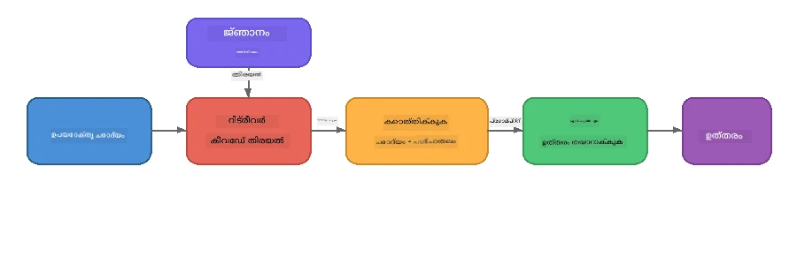

# ഭാഗം 4: Foundry Local ഉപയോഗിച്ച് RAG അപ്ലിക്കേഷൻ നിർമ്മിക്കൽ

## അവലോകനം

വളർന്നു വരുന്ന ഭാഷ മോഡലുകൾ ശക്തമാണ്, എന്നാൽ അവയ്ക്ക് അവരുടെ പരിശീലന ഡാറ്റയിൽ ഉണ്ടായതു മാത്രമേ അറിയൂ. **Retrieval-Augmented Generation (RAG)** ഈ പ്രശ്നം പരിഹരിക്കുന്നു, ക്വറിയുടെ സമയത്ത് മോഡലിന് അനുയോജ്യമായ സന്ദർഭം നൽകിയാണ് - നിങ്ങളുടെ സ്വന്തം ഡോക്യുമെന്റുകൾ, ഡാറ്റാബേസുകൾ, അല്ലെങ്കിൽ നോളജ് ബേസുകളിൽ നിന്നാണ് ഇത് പിടിക്കുന്നത്.

ഈ ലാബിൽ നിങ്ങൾ ഒരു പൂർണ്ണമായ RAG പൈപ്പ്‌ലൈൻ നിർമ്മിക്കും, যা **പൂർണ്ണതയിലും നിങ്ങളുടെ ഉപകരണത്തിൽ** പ്രവർത്തിക്കും Foundry Local ഉപയോഗിച്ച്. ക്ലൗഡ് സേവനങ്ങളോ, വെക്ടർ ഡാറ്റാബേസുകളോ, എംബെഡിങ്ങ് API യോ ഒന്നും വേണ്ട, വെറും പ്രാദേശിക റിട്രീവൽ മാത്രവും പ്രാദേശിക മോഡലുമാണ്.

## പഠന ലക്ഷ്യങ്ങൾ

ഈ ലാബ് പരിചയപ്പെടുത്തുന്നതിനു ശേഷം നിങ്ങൾക്ക് സാധിക്കും:

- RAG എന്താണെന്ന്, AI അപ്ലിക്കേഷനുകൾക്ക് അതിന്റെ പ്രാധാന്യം എന്തെന്നു വിശദീകരിക്കുക
- ടെക്സ്റ്റ് ഡോക്യുമെന്റുകളിൽ നിന്നും പ്രാദേശിക അറിവ് നിധി നിർമ്മിക്കുക
- അനുയോജ്യമായ സന്ദർഭം കണ്ടെത്താൻ ഒരു ലളിതമായ റിട്രീവൽ പ്രവർത്തനം നടപ്പിലാക്കുക
- മോഡലിനെ റിട്ട്രീവുചെയ്ത വസ്തുതകളിൽ സ്ഥാപിക്കുന്ന ഒരു സിസ്റ്റം പ്രాంప്റ്റ് ഒരുക്കുക
- Retrieve → Augment → Generate പൈപ്പ്‌ലൈൻ പൂര്‍ണ്ണമായി ഉപകരണത്തിൽ ഓടിക്കുക
- ലളിതമായ കീവർഡ് റിട്രീവലും വെക്ടർ സെർച്ചും തമ്മിലുള്ള ട്രേഡ്-ഓഫുകൾ മനസ്സിലാക്കുക

---

## മുൻ‌പ്രാത്ഥനകൾ

- [ഭാഗം 3: Foundry Local SDK ഉപയോഗിച്ച് OpenAI ഉപയോഗിക്കൽ](part3-sdk-and-apis.md) പൂർത്തിയാക്കുക
- Foundry Local CLI ഇൻസ്റ്റാൾ ചെയ്തിരിക്കണം, `phi-3.5-mini` മോഡൽ ഡ download ണ്‌ലോഡ് ചെയ്തിരിക്കണം

---

## ആശയം: RAG എന്താണ്?

RAG ഇല്ലാതെ, LLM തന്റെ പരിശീലന ഡാറ്റയിൽ നിന്നു മാത്രം മറുപടി നൽകുന്നു - അത് പഴക്കം ചെന്ന, അപൂർണ്ണം, അല്ലെങ്കിൽ നിങ്ങളുടെ സ്വകാര്യ വിവരങ്ങൾ ഇല്ലാത്തതാവാം:

```
User: "What is Zava's return policy?"
LLM:  "I do not have information about Zava's return policy."  ← No context!
```
  
RAG ഉപയോഗിച്ച്, ആദ്യം നിങ്ങൾ **അനുയോജ്യമായ ഡോക്യുമെന്റുകൾ റിട്രീവ്** ചെയ്യുന്നു, പിന്നീട് ആ സന്ദർഭം പ്രാമ്പ്റ്റിൽ **ഓഗ്മെന്റ്** ചെയ്യുകയും മറുപടി **ജനറേറ്റ്** ചെയ്യുന്നതിനു മുമ്പായി അത് ഉപയോഗിക്കുന്നു:



പ്രധാന ബിന്ദു: **മോഡലിന് ഉത്തരമറിയേണ്ടതില്ല; അത് ശരിയായ ഡോക്യുമെന്റുകൾ വായിക്കാൻ മാത്രം ആവശ്യമുണ്ട്.**

---

## ലാബ് അഭ്യാസങ്ങൾ

### അഭ്യാസം 1: അറിവ് നിധി മനസ്സിലാക്കുക

നിങ്ങളുടെ ഭാഷയുടെ RAG ഉദാഹരണം തുറന്ന് അറിവ് നിധി പരിശോധിക്കുക:

<details>
<summary><b>🐍 Python: <code>python/foundry-local-rag.py</code></b></summary>

അറിവ് നിധി `title`യും `content`ഉം ഉള്ള dictionary കളുടെ ലളിതമായ ലിസ്റ്റ് ആണ്:

```python
KNOWLEDGE_BASE = [
    {
        "title": "Foundry Local Overview",
        "content": (
            "Foundry Local brings the power of Azure AI Foundry to your local "
            "device without requiring an Azure subscription..."
        ),
    },
    {
        "title": "Supported Hardware",
        "content": (
            "Foundry Local automatically selects the best model variant for "
            "your hardware. If you have an Nvidia CUDA GPU it downloads the "
            "CUDA-optimized model..."
        ),
    },
    # ... കൂടുതൽ എൻട്രികൾ
]
```
  
പ്രതിയൊരു എൻട്രിയും ഒരു "ചങ്ക്" - ഒരു വിഷയത്തെക്കുറിച്ചുള്ള ശ്രദ്ധേയമായ ഭാഗം - പ്രതിനിധാനം ചെയ്യുന്നു.

</details>

<details>
<summary><b>📘 JavaScript: <code>javascript/foundry-local-rag.mjs</code></b></summary>

അറിവ് നിധി ഒരു ഒബ്ജക്ട് ശേഖരത്തിന്റെ സമാന ഘടനയായിരിക്കും:

```javascript
const KNOWLEDGE_BASE = [
  {
    title: "Foundry Local Overview",
    content:
      "Foundry Local brings the power of Azure AI Foundry to your local " +
      "device without requiring an Azure subscription...",
  },
  {
    title: "Supported Hardware",
    content:
      "Foundry Local automatically selects the best model variant for " +
      "your hardware...",
  },
  // ... കൂടുതൽ എൻട്രികൾ
];
```

</details>

<details>
<summary><b>💜 C#: <code>csharp/RagPipeline.cs</code></b></summary>

അറിവ് നിധി നെയിംഡ് ട്യൂപ്പിളുകളുടെ ലിസ്റ്റായി ആണ്:

```csharp
private static readonly List<(string Title, string Content)> KnowledgeBase =
[
    ("Foundry Local Overview",
     "Foundry Local brings the power of Azure AI Foundry to your local " +
     "device without requiring an Azure subscription..."),

    ("Supported Hardware",
     "Foundry Local automatically selects the best model variant for " +
     "your hardware..."),

    // ... more entries
];
```

</details>

> **യഥാർത്ഥ അപ്ലിക്കേഷനിൽ**, അറിവ് നിധി ഫയലുകളിൽ നിന്ന്, ഡാറ്റാബേസിൽ നിന്ന്, സേർച്ച് ഇൻഡക്സിൽ നിന്ന് അല്ലെങ്കിൽ API വഴികളിൽ നിന്ന് വരും. ഈ ലാബിൽ ലളിതമായി വയ്ക്കാനായി in-memory ലിസ്റ്റ് ഉപയോഗിക്കുന്നു.

---

### അഭ്യാസം 2: റിട്രീവൽ പ്രവർത്തനം മനസ്സിലാക്കുക

റിട്രീവൽ ഘട്ടം ഉപയോക്താവിന്റെ ചോദ്യത്തിന് ഏറ്റവും അനുയോജ്യമായ ചങ്കുകൾ കണ്ടെത്തുന്നു. ഈ ഉദാഹരണം **കീവർഡ് ഓവർലാപ്** ഉപയോഗിക്കുന്നു - ചോദ്യത്തിലെ എത്ര വാക്കുകൾ ഓരോ ചങ്കിലും ഉണ്ടെന്ന് എണ്ണലും:

<details>
<summary><b>🐍 Python</b></summary>

```python
def retrieve(query: str, top_k: int = 2) -> list[dict]:
    """Return the top-k knowledge chunks most relevant to the query."""
    query_words = set(query.lower().split())
    scored = []
    for chunk in KNOWLEDGE_BASE:
        chunk_words = set(chunk["content"].lower().split())
        overlap = len(query_words & chunk_words)
        scored.append((overlap, chunk))
    scored.sort(key=lambda x: x[0], reverse=True)
    return [item[1] for item in scored[:top_k]]
```

</details>

<details>
<summary><b>📘 JavaScript</b></summary>

```javascript
function retrieve(query, topK = 2) {
  const queryWords = new Set(query.toLowerCase().split(/\s+/));
  const scored = KNOWLEDGE_BASE.map((chunk) => {
    const chunkWords = new Set(chunk.content.toLowerCase().split(/\s+/));
    let overlap = 0;
    for (const w of queryWords) {
      if (chunkWords.has(w)) overlap++;
    }
    return { overlap, chunk };
  });
  scored.sort((a, b) => b.overlap - a.overlap);
  return scored.slice(0, topK).map((s) => s.chunk);
}
```

</details>

<details>
<summary><b>💜 C#</b></summary>

```csharp
private static List<(string Title, string Content)> Retrieve(string query, int topK = 2)
{
    var queryWords = new HashSet<string>(
        query.ToLowerInvariant().Split(' ', StringSplitOptions.RemoveEmptyEntries));

    return KnowledgeBase
        .Select(chunk =>
        {
            var chunkWords = new HashSet<string>(
                chunk.Content.ToLowerInvariant().Split(' ', StringSplitOptions.RemoveEmptyEntries));
            var overlap = queryWords.Intersect(chunkWords).Count();
            return (Overlap: overlap, Chunk: chunk);
        })
        .OrderByDescending(x => x.Overlap)
        .Take(topK)
        .Select(x => x.Chunk)
        .ToList();
}
```

</details>

**പ്രവൃത്തി രീതി:**  
1. ചോദ്യത്തെ വ്യക്തിവാക്കുകളായി വിഭജിക്കുക  
2. ഓരോ അറിവ് ചങ്കിനും ചോദ്യത്തിലെ വാക്യങ്ങൾ എത്രത്തോളം ഉണ്ടെന്നു എണ്ണുക  
3. ഓവർലാപ് സ്‌കോറിനു അനുസരിച്ച് (മുകളിൽ വലത് നിന്ന്) ക്രമീകരിക്കുക  
4. ഏറ്റവും അനുയോജ്യമായ ചങ്കുകൾ മുകളിൽ നിന്ന് തിരികെ നൽകുക

> **ട്രേഡ്-ഓഫ്:** കീവർഡ് ഓവർലാപ് ലളിതമാണ് പക്ഷേ പരിധികളുണ്ട്; പദാർത്ഥം അല്ലെങ്കിൽ സമാനാർഥം മനസ്സിലാക്കാറില്ല. ഉത്പാദന RAG സിസ്റ്റങ്ങൾ സാധാരണയായി **എംബെഡ്ഡിംഗ് വെക്ടറുകളും** **വെക്ടർ ഡാറ്റാബേസും** സെമാന്റ്റിക് സെർച്ചിന് ഉപയോഗിക്കുന്നു. എന്നിരുന്നാലും, കീവർഡ് ഓവർലാപ് മികച്ച തുടക്കമാണ്, കൂടാതെ അധിക ആശ്രിതങ്ങൾ ആവശ്യമില്ല.

---

### അഭ്യാസം 3: ഓഗ്മെന്റഡ് പ്രാംപ്റ്റ് മനസ്സിലാക്കുക

റിട്ട്രീവുചെയ്ത സന്ദർഭം **സിസ്റ്റം പ്രാംപ്റ്റിൽ** ഉൾപ്പെടുത്തുന്നു മോഡലിന് അയയ്ക്കുന്നതിന് മുൻപ്:

```python
system_prompt = (
    "You are a helpful assistant. Answer the user's question using ONLY "
    "the information provided in the context below. If the context does "
    "not contain enough information, say so.\n\n"
    f"Context:\n{context_text}"
)
```
  
പ്രധാന ഡിസൈൻ തീരുമാനങ്ങൾ:  
- **"പ്രദാനം ചെയ്ത വിവരങ്ങൾ മാത്രം"** - പ്രോംപ്റ്റിൽ ഇല്ലാത്ത വസ്തുതകളുടെ ഹല്യൂസിനേഷൻ തടയുന്നു  
- **"സന്ദർഭം മതിയായ വിവരങ്ങൾ നൽകുന്നില്ലെങ്കിൽ, അങ്ങനെ പറയുക"** - സത്യസന്ധമായ "എനിക്ക് അറിയില്ല" മറുപടി പ്രോത്സാഹിപ്പിക്കുന്നു  
- സистем് സന്ദേശത്തിൽ സന്ധർഭം ഇട്ടതിനാൽ എല്ലാ മറുപടികളെയും സ്വാധീനിക്കുന്നു

---

### അഭ്യാസം 4: RAG പൈപ്പ്‌ലൈൻ ഓടിക്കുക

പൂർണ്ണ ഉദാഹരണം ഓടിക്കുക:

**Python:**  
```bash
cd python
python foundry-local-rag.py
```
  
**JavaScript:**  
```bash
cd javascript
node foundry-local-rag.mjs
```
  
**C#:**  
```bash
cd csharp
dotnet run rag
```
  
നിങ്ങൾ സ്ക്രീനിൽ മൂന്ന് കാര്യങ്ങൾ കാണിക്കും:  
1. **ചോദ്യമേഖല**  
2. **റിട്ട്രീവുചെയ്ത സന്ദർഭം** - അറിവ് നിധിയിൽ നിന്ന് തിരഞ്ഞെടുത്ത ചങ്കുകൾ  
3. **മറുപടി** - ആ സദർഭം മാത്രം ഉപയോഗിച്ച് മോഡൽ ജനറേറ്റ് ചെയ്ത അതിന്റെ മറുപടി

ഉദാഹരണ ഔട്ട്‌പുട്ട്:  
```
Question: How do I install Foundry Local and what hardware does it support?

--- Retrieved Context ---
### Installation
On Windows install Foundry Local with: winget install Microsoft.FoundryLocal...

### Supported Hardware
Foundry Local automatically selects the best model variant for your hardware...
-------------------------

Answer: To install Foundry Local, you can use the following methods depending
on your operating system: On Windows, run `winget install Microsoft.FoundryLocal`.
On macOS, use `brew install microsoft/foundrylocal/foundrylocal`...
```
  
മോഡലിന്റെ മറുപടി റിട്ട്രീവുചെയ്ത സദർഭത്തിൽ **സ്ഥാപിതമാണ്** - അറിവ് നിധി ഡോക്യുമെന്റുകളിൽ നിന്നുള്ള വസ്തുതകൾ മാത്രം പറയുന്നു.

---

### അഭ്യാസം 5: പരീക്ഷണവും വ്യാപ്തിയും ചെയ്യുക

നിങ്ങളുടെ ബോധം ഗർഭിതമാക്കാൻ ഇവ പരീക്ഷിക്കുക:

1. **ചോദ്യമാറ്റം** - അറിവ് നിധിയിൽ ഉള്ളതോ ഇല്ലാത്തതോ ഉള്ളത് ചോദിക്കുക:  
   ```python
   question = "What programming languages does Foundry Local support?"  # ← സੰਦਰഭത്തിൽ
   question = "How much does Foundry Local cost?"                       # ← സന്ദർഭത്തിൽ അല്ലെങ്കിൽ
   ```
  
സന്ദർഭത്തിൽ ഇല്ലാത്തപ്പോൾ മോഡൽ ശരിയായി "എനിക്ക് അറിയില്ല" എന്ന് പറയുന്നു?

2. **പുതിയ അറിവ് ചങ്ക് ചേർക്കുക** - `KNOWLEDGE_BASE`-ൽ പുതിയ എൻട്രി ചേർക്കുക:  
   ```python
   {
       "title": "Pricing",
       "content": "Foundry Local is completely free and open source under the MIT license.",
   }
   ```
  
ഇപ്പോൾ വീണ്ടും വിലക്കുറവ് ചോദ്യമുയർത്തുക.

3. **`top_k` മാറ്റുക** - കൂടുതൽ അല്ലെങ്കിൽ കുറച്ച് ചങ്കുകൾ റിട്ട്രീവ് ചെയ്യുക:  
   ```python
   context_chunks = retrieve(question, top_k=3)  # കൂടുതൽ സന്ദർഭം
   context_chunks = retrieve(question, top_k=1)  # കുറവ് സന്ദർഭം
   ```
  
സന്ദർഭത്തിന്റെ അളവ് മറുപടിയുടെ ഗുണമേന്മയെ എങ്ങനെ ബാധിക്കുന്നു?

4. **സ്ഥാപന നിർദ്ദേശം മാറ്റുക** - സിസ്റ്റം പ്രാംപ്റ്റ് "You are a helpful assistant." ആയി മാറ്റി മോഡൽ ഹല്യൂസിനേഷൻ ആരംഭിക്കുന്നുണ്ടോ എന്ന് നോക്കുക.

---

## ദീർഘദൃഷ്ടി: ഉപകരണത്തിൽ RAG പ്രവർത്തനക്ഷമമാക്കൽ

ഉപകരണത്തിൽ RAG ഓടിക്കുന്നത് ക്ലൗഡിലുണ്ടായിരുന്നില്ലാത്ത നിയന്ത്രണങ്ങൾ കൊണ്ടു വരുന്നു: പരിമിത റാം, പ്രത്യേക GPU ഇല്ല (CPU/NPU ആക്‌സലറേഷൻ), ചെറിയ മോഡൽ സദർഭ വിൻഡോ. താഴെയുള്ള ഡിസൈൻ തീരുമാനങ്ങൾ സാന്ദർഭമായി ഇവ നേരിടുകയും Foundry Local ഉപയോഗിച്ച് നിർമ്മിക്കപ്പെട്ട പ്രൊഡക്ഷൻ-സ്റ്റൈൽ പ്രാദേശിക RAG അപ്ലിക്കേഷനുകളുടെ മാതൃകകൾ ആശ്രയിച്ചിരിക്കും.

### ചങ്കിംഗ് തന്ത്രം: നിശ്ചിത വലുപ്പമുള്ള സ്ലൈഡിംഗ് വിൻഡോ

ചങ്കിംഗ് - ഡോക്യുമെന്റുകൾ ടുകടികളാക്കി വിഭജിക്കൽ - ഏത് RAG സിസ്റ്റത്തിനും ഏറ്റവും പ്രഭാവമുള്ള തീരുമാനമാണ്. ഉപകരണ സാഹചര്യങ്ങൾക്കായി, **ഓവർലാപ്പോടുള്ള നിശ്ചിത വലുപ്പമുള്ള സ്ലൈഡിംഗ് വിൻഡോ** നിർദ്ദേശിക്കപ്പെടുന്നു:

| പാരാമീറ്റർ | ശുപാർശ ചെയ്ത മൂല്യം | കാരണം |
|-----------|------------------|-----|
| **ചങ്ക് വലുപ്പം** | ഏകദേശം 200 ടോക്കൺ | റിട്ട്രീവുചെയ്ത സദർഭം സങ്കുചിതം ആയിരിക്കും, Phi-3.5 Mini-യുടെ സദർഭ വിൻഡോയിൽ സിസ്റ്റം പ്രാംപ്റ്റ്, സംഭാഷണ ചരിത്രം, ജെനറേറ്റഡ് പുറംട്പുട്ട് അടി ക്രമത്തിൽ ഇടം ലഭിക്കും |
| **ഓവർലാപ്പ്** | ഏകദേശം 25 ടോക്കൺ (12.5%) | ചങ്ക് അതിരുകൾക്കിടയിലെ വിവര നഷ്ടം തടയുന്നു - പ്രക്രിയകൾക്കും ഘട്ടാനുക്രമ നിർദ്ദേശങ്ങൾക്കും പ്രധാനമാണ് |
| **ടോക്കനൈസേഷൻ** | വൈറ്റ്‌സ്‌പേസ് സ്പ്ലിറ്റ് | സൂക്ഷ്മ ആശ്രിതങ്ങൾ ഇല്ല, ടോക്കനൈസർ ലൈബ്രറി ആവശ്യമില്ല. എല്ലാം കണക്ക് LLM-ക്കൊപ്പം തന്നെ നിലനിർത്തുന്നു |

ഓവർലാപ്പ് സ്ലൈഡിംഗ് വിൻഡോ പോലെയാണ് പ്രവർത്തിക്കുന്നത്: ഓരോ പുതിയ ചങ്കും മുൻ ചങ്കിന്റെ അവസാനത്തിനു മുൻപ് 25 ടോക്കൺ കെടുത്തി തുടങ്ങുന്നു, അതുകൊണ്ട് വാചകങ്ങൾ ഇരട്ട ചങ്കുകളിലും കാണാം.

> **മറ്റു തന്ത്രങ്ങൾ എന്തുകൊണ്ടു?**  
> - **വാചക ആധാരമായ വിഭജനം** പ്രവചിക്കാനാകാത്ത വലുപ്പം നൽകും; ചില സുരക്ഷാനിർദ്ദേശങ്ങൾ വളരെ ദീർഘമായ അറ്റം വാചകമാണെന്നും, അതിനാൽ വിഭജനം ശരിയായി ഉണ്ടാകില്ല  
> - **വിഭാഗ ആണറായ വിഭജനം** (`##` ഹെഡിങ്ങുകൾ) അപാകതയുള്ള വലുപ്പങ്ങളിൽ വിഭജിക്കും - ചിലത് വളരെ ചെറുതും, മറ്റു വളരെയധികം വലുതുമായിരിക്കും എന്ന് മനസ്സിലാക്കുക  
> - **സെമാന്റിക് ചങ്കിംഗ്** (എംബെഡ്ഡിംഗ് അടിസ്ഥാനമായ വിഷയം കണ്ടെത്തൽ) മികച്ച റിട്ട്രീവൽ ഗുണമേന്മ നൽകും, പക്ഷേ Phi-3.5 Mini-യുടെ വെഞ്ച്വറിയിൽ രണ്ടാം മോഡൽ സൂക്ഷിക്കണം - 8-16 GB പങ്കുവെക്കുന്ന മെമ്മറിയിലുള്ള ഹാർഡ്വെയറിൽ റിസ്കിയാണ്

### റിട്ട്രീവൽ മെച്ചപ്പെടുത്തൽ: TF-IDF വെക്ടറുകൾ

ഈ ലാബിലെ കീവർഡ് ഓവർലാപ് രീതി പ്രവർത്തിക്കുന്നതിന്, മെച്ചപ്പെട്ട റിട്ട്രീവൽ വേണ്ടെങ്കിൽ എംബെഡ്ഡിംഗ് മോഡൽ ചേർക്കാതെ **TF-IDF (Term Frequency-Inverse Document Frequency)** ഏറ്റവും നല്ല മദ്ധ്യസ്ഥാനം ആണ്:

```
Keyword Overlap  →  TF-IDF Vectors  →  Embedding Models
    (this lab)     (lightweight upgrade)   (production)
  Simple & fast    Better ranking,         Best quality,
  No dependencies  still no ML model       requires embedding model
  ~Basic matching  ~1ms retrieval          ~100-500ms per query
```
  
TF-IDF ഓരോ ചങ്കും ഒരു സംഖ്യാത്മക വെക്ടറായി മാറ്റുന്നു, ആ വാക്കിന്റെ പ്രസക്തത അനുസരിച്ച് ആ ചങ്കിൽ *മറ്റ് എല്ലാ ചങ്കുകളുമായി താരതമ്യം പ്രവർത്തിച്ചാണ്*. ക്വേരി സമയത്തു, ചോദ്യവും സമാന രീതിയിൽ വെക്ടറാക്കിയ ശേഷം cosine similarity ഉപയോഗിച്ച് താരതമ്യം ചെയ്യുന്നു. ഇതെല്ലാം SQLite, സുതാര്യ ജാവാസ്ക്രിപ്റ്റ് / പൈതൺ ഉപയോഗിച്ച് നടപ്പിലാക്കാം - വെക്ടർ ഡാറ്റാബേസ് ഇല്ല, എംബെഡ്ഡിംഗ് API ഇല്ല.

> **പ്രവർത്തനക്ഷമത:** ഫിക്‌സ്ഡ്-സൈസ് ചങ്കുകളിൽ TF-IDF കോസൈൻ സമാനത ഏകദേശം **~1ms** നിങ്ങൾക്ക് റിട്ട്രീവൽ നല്കും, എംബെഡിങ്ങ് മോഡൽ ഓരോ ക്വറിയും എൻകോഡ് ചെയ്യുമ്പോൾ 100-500ms വരെക്ഷമമായിരിക്കും. 20-കൂടുതൽ ഡോക്യുമെന്റുകളും ഒന്നും സെക്കന്റ് സമയത്തിനുള്ളിൽ ചങ്കുചെയ്ത് ഇന്ഡക്സുചെയ്യാൻ കഴിയും.

### സങ്കീർണ്ണ മെഷീനുകൾക്കുള്ള എഡ്ജ്/കമ്പാക്റ്റ് മോഡ്

പരമാവധി നിയന്ത്രിത ഹാർഡ്‌വെയറിൽ (പഴയ ലാപ്‌ടോപ്പുകൾ, ടാബ്‌ലറ്റുകൾ, ഫീൽഡ് ഉപകരണങ്ങൾ) പ്രവർത്തിക്കുമ്പോൾ, മൂന്ന് knob കളെ കുറയ്ക്കാം:

| ക്രമീകരണം | സ്റ്റാൻഡേർഡ് മോഡ് | എഡ്ജ്/കമ്പാക്റ്റ് മോഡ് |
|---------|--------------|-------------------|
| **സിസ്റ്റം പ്രാംപ്റ്റ്** | ~300 ടോക്കൺ | ~80 ടോക്കൺ |
| **മാക്സ് ഔട്ട്പുട്ട് ടോക്കൺസ്** | 1024 | 512 |
| **റിട്ട്രീവ് ചെയ്തത് (top-k)** | 5 | 3 |

കുറഞ്ഞ റിട്ട്രീവുചെയ്ത ചങ്കുകൾ മോഡലിന് കുറഞ്ഞ സദർഭം നൽകുന്നത് മൂലം വൈകല്യം കുറയും, മെമ്മറി സമ്മർദ്ദം കുറയും. സിസ്റ്റം പ്രാംപ്റ്റ് കുറഞ്ഞാൽ സദർഭ വിൻഡോയിൽ കൂടുതൽ മറുപടി ഇടം ലഭിക്കും. ഈ ട്രേഡ്-ഓഫ് ഓരോ ടോക്കൺ പ്രധാനമായിരിക്കുന്ന ഉപകരണങ്ങളിൽ വച്ചാണ്. 

### മെമ്മറിയിലുള്ള ഏക മോഡൽ

ഉപകരണത്തിൽ RAG-യ്ക്ക് ഏറ്റവും പ്രധാനപ്പെട്ട ദർശനം: **ഒരു മോഡൽ മാത്രം ലോഡ് ചെയ്തറ്റക്കണം**. റിട്ട്രീവലിന് ഒരു എംബെഡ്ഡിംഗ് മോഡലും Jeneration-ന് ഒരു ഭാഷ മോഡലും ഉപയോഗിച്ചാൽ, നിയന്ത്രിത NPU/RAM വിഭവങ്ങൾ രണ്ട് മോഡലുകൾക്ക് വേർതിരിക്കുന്നു. ലളിതമായ റിട്ട്രീവൽ (കീവർഡ് ഓവർലാപ്, TF-IDF) ഇതു പൂർണ്ണമായും ഒഴിവാക്കുന്നു:

- LLM നായി മെമ്മറിയിൽ എമ്പെഡ്ഡിംഗ് മോഡൽ മത്സരമില്ല  
- വേഗത്തിൽ കൂൾ സ്റ്റാർട്ട് - മോഡൽ ഒന്ന് മാത്രം ലോഡ് ചെയ്യണം  
- പ്രവചിക്കാവുന്ന മെമ്മറി ഉപയോഗം - എല്ലാ കൈവശമുള്ള വിഭവവും LLM ന്  
- 8 GB RAM പോലും ഉള്ള മെഷീനുകളിൽ പ്രവർത്തിക്കുന്നു

### പ്രാദേശിക വെക്ടർ സ്റ്റോർ ആയി SQLite

ചെറിയ മുതൽ മധ്യമത്രിശം ഡോക്യുമെന്റ് ശേഖരങ്ങൾക്ക് (.chunks നൂറുകണക്കിന് - താഴേ ആയിരക്കണക്കിന്), **SQLite മതിയാകുന്നു** കോസൈൻ സമാനത ഉപയോഗിച്ച് ബ്രൂട്ട് ഫോഴ്സ് സെർച്ച് നടത്താൻ, കൂടാതെ യാതൊരു ഇൻഫ്രാസ്ട്രക്ടറും ആവശ്യപ്പെടുന്നില്ല:

- ഒരറ്റ `.db` ഫയൽക്കണക്കും - സെർവർ പ്രോസസ്സ് അല്ല, കോൺഫിഗറേഷൻ ഇല്ല  
- പ്രധാന ഭാഷ റൺടൈമുകൾ വേണ്ടത്ര അധിഷ്ഠിതം (Python `sqlite3`, Node.js `better-sqlite3`, .NET `Microsoft.Data.Sqlite`)  
- ഡോക്യുമെന്റ് ചങ്കുകളെയും അവയുടെ TF-IDF വെക്ടറുകളെയും ഒരേ ടേബിളിൽ സംഭരിക്കുന്നു  
- Pinecone, Qdrant, Chroma, FAISS പോലുള്ള സാങ്കേതികവിദ്യകൾ ഈ തോതിൽ ആവശ്യമില്ല

### പ്രകടന സംഗ്രഹം

ഈ ഡിസൈൻ തിരഞ്ഞെടുപ്പുകൾ ഉപഭോക്തൃ ഹാർഡ്‌വെയറിൽ പ്രതികരണപരമായ RAG ഡെലിവർ ചെയ്യുന്നു:

| സൂചകം | ഉപകരണത്തിലെ പ്രകടനം |
|--------|----------------------|
| **റിട്ട്രീവൽ വൈകല്യം** | ~1ms (TF-IDF) മുതൽ ~5ms (കീവർഡ് ഓവർലാപ്) വരെ |
| **ഇൻജെക്ഷൻ വേഗം** | 20 ഡോക്യുമെന്റുകൾ ഒരു സെക്കന്റ് മിക്കവാറും ചങ്കുചെയ്ത് ഇൻഡക്സുചെയ്യുന്നു |
| **മോഡലുകൾ മെമ്മറിയിൽ** | 1 (LLM മാത്രം - എംബെഡ്ഡിംഗ് മോഡൽ ഇല്ല) |
| **സംഭരണം ഓവർഹെഡ്** | SQLite-ൽ 1 MB താഴെ ചങ്കുകളും വെക്ടറുകളും |
| **കൂൾ സ്റ്റാർട്ട്** | ഏക മോഡൽ ലോഡ്, എംബെഡ്ഡിംഗ് റൺടൈം സ്റ്റാർട്ട് അപ് ഇല്ല |
| **ഹാർഡ്‌വെയർ ഫ്ലോർ** | 8 GB RAM, CPU മാത്രം (GPU ഇല്ല) |

> **എപ്പോൾ അപ്ഗ്രേഡ് ചെയ്യണം:** നൂറുകണക്കിന് ദീർഘമുള്ള ഡോക്യുമെന്റുകൾ, മിശ്രിത ഉള്ളടക്കം (ടേബിൾസ്, കോഡ്, പ്രോസ്സ്), അല്ലെങ്കിൽ സെമാന്റിക് ക്വറി മനസ്സിലാക്കൽ ആവശ്യമായപ്പോൾ, ഒരു എംബെഡ്ഡിംഗ് മോഡൽ ചേർക്കാനും വെക്ടർ സമാനത സെർച്ചിലേക്ക് മാറാനും പരിഗണിക്കുക. പ്രാദേശികമായി കേന്ദ്രീകൃത ഡോക്യുമെന്റ് സെറ്റുകൾ ഉപയോഗിക്കുന്ന ആപ്ലിക്കേഷനുകൾക്കായി TF-IDF + SQLite വളരെ മികച്ച ഫലം നൽകുന്നു കുറഞ്ഞ വിഭവ ഉപയോഗത്തോടെ.

---

## പ്രധാന ആശയങ്ങൾ

| ആശയം | വിവരണം |
|---------|-------------|
| **റിട്ട്രീവൽ** | ഉപയോക്താവിന്റെ ക്വറിയുടെ അടിസ്ഥാനത്തിൽ അറിവ് നിധിയിൽ നിന്നുള്ള അനുയോജ്യമായ ഡോക്യുമെന്റുകൾ കണ്ടെത്തൽ |
| **ഓഗ്മെന്റേഷൻ** | റിട്ട്രീവ് ചെയ്ത ഡോക്യുമെന്റുകൾ പ്രാംപ്റ്റിൽ സദർഭമായി ഇടുക |
| **ജെനറേഷൻ** | LLM നൽകപ്പെട്ട സദർഭത്തിൽ അടിസ്ഥിതമാക്കി മറുപടി സൃഷ്ടിക്കുന്നു |
| **ചങ്കിംഗ്** | വലിയ ഡോക്യുമെന്റുകൾ ചെറുതായി ലക്ഷ്യമിട്ടു വച്ച ഭാഗങ്ങളായി വിഭജിക്കൽ |
| **സ്ഥാപനം (Grounding)** | മോഡലിനെ yalnızകു നൽകിയ സദർഭം ഉപയോഗിക്കാൻ മാത്രം നിര്‍ബന്ധിക്കുന്നത് (ഹല്യൂസിനേഷൻ കുറയ്ക്കുന്നു) |
| **Top-k** | ഏറ്റവും അനുയോജ്യമായ ചങ്കുകളുടെ എണ്ണം |

---

## ഉത്പാദനത്തിലെ RAG vs ഈ ലാബ്

|രൂപം| ഈ ലാബ് | ഉപകരണത്തിൽ മെച്ചപ്പെടുത്തിയ | ക്ലൗഡ് ഉത്പാദനം |
|--------|----------|--------------------|-----------------|
| **അറിവ് നിധി** | ഇൻ-മെമ്മറി ലിസ്റ്റ് | ഡിസ്കിലെ ഫയലുകൾ, SQLite | ഡാറ്റാബേസ്, സേർച്ച് ഇൻഡക്സ് |
| **റിട്ട്രീവൽ** | കീവർഡ് ഓവർലാപ് | TF-IDF + കോസൈൻ സമാനത | വെക്ടർ എംബെഡിങ്ങുകളും സമാനതാ സെർച്ച് |
| **എംബെഡ്ഡിംഗുകൾ** | ആവശ്യമില്ല | TF-IDF വെക്ടറുകൾ മാത്രം | എംബെഡ്ഡിംഗ് മോഡൽ (പ്രാദേശികമോ ക്ലൗഡോ) |
| **വെക്ടർ സ്റ്റോർ** | ആവശ്യമില്ല | SQLite (.db ഫയൽ) | FAISS, Chroma, Azure AI സെർച്ച്, മുതലായവ |
| **ചങ്കിംഗ്** | മാനുവൽ | നിശ്ചിത വലുപ്പമുള്ള സ്ലൈഡിംഗ് വിൻഡോ (~200 ടോക്കൺ, 25 ടോക്കൺ ഓവർലാപ്പ്) | സെമാന്റിക് അല്ലെങ്കിൽ റികഴ്സീവ് ചങ്കിംഗ് |
| **മെമ്മറിയിലുള്ള മോഡലുകൾ** | 1 (LLM) | 1 (LLM) | 2+ (എംബെഡ്ഡിംഗ് + LLM) |
| **പ്രതികരണം വൈകി** | ~5ms | ~1ms | ~100-500ms |
| ** സ്‌കേൽ** | 5 ഡോക്യുമെന്റുകൾ | നൂറുകണക്കിനം ഡോക്യുമെന്റുകൾ | ദശലക്ഷക്കണക്കിനു ഡോക്യുമെന്റുകൾ |

നിങ്ങൾ ഇവിടെ പഠിക്കുന്ന മാതൃകകൾ (പ്രതികരിക്കുക, വർദ്ധിപ്പിക്കുക, നിർമ്മിക്കുക) ഏതെങ്കിലും സ്‌കേലിൽ ഒരേ രീതി ആണ്. പ്രതികരണ രീതി മെച്ചപ്പെടുന്നു, പക്ഷേ ആകെ സാങ്ക്കലനം സമാനമാണ്. മധ്യത്തിലെ കോളം ലഘുവായ സാങ്കേതികപരമായ രീതികളിൽ ഒൺ-ഡിവൈസിൽ സാദ്ധ്യമാകുന്നതാണ്, സാധാരണമായുള്ള പ്രാദേശിക അപ്ലിക്കേഷനുകളുടെ സ്വീറ്റ് സ്പോട്ട് കാണിക്കുന്നു, ഇതിൽ ക്ലൗഡ് സ്‌കേൽ സ്വകാര്യതക്ക്, ഓഫ്ലൈൻ ശേഷിക്കും, ബാഹ്യ സേവനങ്ങൾക്ക് ജിറോ ലേറ്റൻസിക്കും വേണ്ടി വെട്ടിക്കും.

---

## പ്രധാന നിർണ്ണായകങ്ങൾ

| ആശയം | നിങ്ങളെ വല്ലാതായി പഠിപ്പിച്ചത് |
|---------|------------------|
| RAG മാതൃകം | Retrieve + Augment + Generate: മോഡലിന് ശരിയായ സന്ധർഭം നൽകുക, അത് നിങ്ങളുടെ ഡാറ്റയുമായി ബന്ധപ്പെട്ട ചോദ്യങ്ങൾക്ക് ഉത്തരം നൽകും |
| ഓൺ-ഡിവൈസ് | എല്ലാ പ്രവർത്തനങ്ങളും ലോക്കലായി ക്ലൗഡ് API-കളോ വെക്റ്റർ ഡാറ്റാബേസ് സബ്സ്ക്രിപ്ഷനുകളോ ഇല്ലാതെ നടക്കുന്നു |
| ഗ്രൗണ്ടിംഗ് നിർദ്ദേശങ്ങൾ | ഹאַלൂസിനേഷൻ തടയാൻ സിസ്റ്റം പ്രോംപ്റ്റ് നിയന്ത്രണങ്ങൾ അത്യാവശ്യമാണ് |
| കീവർഡ് ഓവർലാപ് | retrieval നു വേണ്ടി ലളിതവും ഫലപ്രദവുമായ തുടക്കബിന്ദു |
| TF-IDF + SQLite | Embedding മോഡൽ ഇല്ലാതെ retrieval 1ms നിന്നിൽ നിലനിർത്തുന്ന ലഘുവായ അപ്ഗ്രേഡ് പാത |
| മമ്മറി ഉള്ളിൽ ഒരു മോഡൽ | നിയന്ത്രിത ഹാർഡ്‌വെയറിൽ LLM ഒപ്പം ഒരു embedding മോഡൽ ലോഡ് ചെയ്യുന്നത് ഒഴിവാക്കുക |
| ചങ്ക് വലിപ്പം | ഏകദേശം 200 ടോക്കൺ ഓവർലാപോടെ retrieval സ്റ്റെറ്റും സന്ധർഭ വിൻഡോ കാര്യക്ഷമതയും ബാലൻസു ചെയ്യുന്നു |
| എഡ്ജ്/കമ്പാക്റ്റ് മോഡ് | വളരെ നിയന്ത്രിത ഉപകരണങ്ങൾക്ക് കുറവ് ചങ്കുകളും ചെറിയ പ്രോംപ്റ്റുകളും ഉപയോഗിക്കുക |
| സർവജനീന മാതൃക | ഡോക്യുമെന്റുകൾ, ഡാറ്റാബേസുകൾ, API-കൾ അല്ലെങ്കിൽ വിക്കികൾ അധികൃതമായി ഏതൊരു ഡാറ്റാ ഉറവിടത്തിനും ഒരേ RAG സാങ്കേതികസംവിധാനം പ്രവർത്തിക്കുന്നു |

> **പൂർണ്ണ ഓൺ-ഡിവൈസ് RAG അപ്ലിക്കേഷൻ കാണാൻ ആഗ്രഹിക്കുന്നോ?** [Gas Field Local RAG](https://github.com/leestott/local-rag) പരിശോധിക്കുക, Foundry Local, Phi-3.5 Mini എന്നിവയിലൂടെ നിർമ്മിച്ച പ്രൊഡക്ഷൻ സ്റ്റൈൽ ഓഫ്‌ലൈൻ RAG ഏജന്റ്, ഈ ഓപ്ടിമൈസേഷൻ മാതൃകകൾ യഥാർത്ഥ ഡോക്യുമെന്റ് സെറ്റുമായി പ്രદર્શിക്കുന്നു.

---

## അടുത്ത ചുവടുകൾ

മൈക്രോസോഫ്റ്റ് ഏജന്റ് ഫ്രെയിംവർക്കിന്റെ സഹായത്തോടെ വ്യക്തിഗത സ്വഭാവങ്ങൾ, നിർദ്ദേശങ്ങൾ, ഒപ്പം മൾട്ടി-ടേൺ സംവാദങ്ങൾ ഉപയോഗിച്ച് ബുദ്ധിമുട്ടുള്ള ഏജന്റുകളെ നിർമ്മിക്കാൻ [ഭാഗം 5: AI ഏജൻറുകൾ നിർമ്മിക്കൽ](part5-single-agents.md) എന്നതിലേക്ക് തുടരുക.