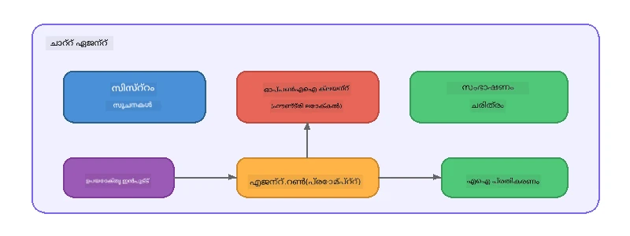

# ഭാഗം 5: ഏജന്റ് ഫ്രെയിംവർക്ക് ഉപയോഗിച്ച് AI ഏജന്റുമാർ നിർമ്മിക്കൽ

> **ലക്ഷ്യം:** പേഴ്‌സിസ്റ്റന്റ് നിര്‍ദ്ദേശങ്ങളും നിശ്ചിത വ്യക്തിത്വവും കൂടിയ ആദ്യ AI ഏജന്റിനെ ഒരു ലോക്കൽ മോഡലിലൂടെ Foundry Local ഉപയോഗിച്ച് നിർമ്മിക്കുക.

## AI ഏജന്റ് എന്നു എന്താണ്?

ഒരു AI ഏജന്റ് ഭാഷാ മോഡലിന് **സിസ്റ്റം നിര്‍ദ്ദേശങ്ങൾ** ചേർത്ത് അതിന്റെ പെരുമാറ്റം, വ്യക്തിത്വം, നിയന്ത്രണങ്ങൾ എന്നിവ നിർവചിക്കുന്നു. ഒറ്റ ചാറ്റ് പൂർത്തീകരണ വിളിക്ക് പകരം, ഏജന്റ് നൽകുന്നത്:

- **പേഴ്സോന** - സ്ഥിരതയുള്ള ഒരു തിരിച്ചറിയൽ ("നിങ്ങൾ ഒരു സഹായകമായ കോഡ് റിവ്യൂവർ ആകുന്നു")
- **മെയ്‌മറി** - ടേണുകളുടെ ഇടവേളയിലുള്ള സംഭാഷണ ചരിത്രം
- **സ്പെഷ്യലൈസേഷൻ** - നന്നായി രൂപകൽപ്പന ചെയ്ത നിർദ്ദേശങ്ങൾ വഴി നിർബന്ധിത പെരുമാറ്റം



---

## മൈക്രോസോഫ്റ്റ് ഏജന്റ് ഫ്രെയിംവർക്ക്

**Microsoft Agent Framework** (AGF) വിവിധ മോഡൽ ബാക്ക്എൻഡുകളിൽ പ്രവർത്തിക്കുന്ന ഒരു സ്റ്റാൻഡേർഡ് ഏജന്റ് അബ്സ്ട്രാക്ഷൻ നൽകുന്നു. ഈ വർക്‌ഷോപ്പിൽ നമ്മൾ ഇത് Foundry Local-നൊപ്പം കൂട്ടിയിണക്കുന്നു, അതിനാൽ എല്ലാം നിങ്ങളുടെ മെഷീൻ-ലുള്ളതാകും - ക്ലൗഡ് ആവശ്യമില്ല.

| ആശയം | വിവരണം |
|---------|-------------|
| `FoundryLocalClient` | Python: സർവീസ് തുടക്കം, മോഡൽ ഡൗൺലോഡ്/ലോഡ് എന്നിവ കൈകാര്യം ചെയ്യുകയും ഏജന്റുകൾ സൃഷ്ടിക്കുകയും ചെയ്യുക |
| `client.as_agent()` | Python: Foundry Local ക്ലയന്റിൽ നിന്നുള്ള ഏജന്റ് സൃഷ്ടിക്കുന്നു |
| `AsAIAgent()` | C#: `ChatClient`-ലുള്ള ഒരു എക്സ്റ്റെൻഷൻ മെത്തഡ് - ഒരു `AIAgent` സൃഷ്ടിക്കുന്നു |
| `instructions` | ഏജന്റിന്റെ പെരുമാറ്റം രൂപപ്പെടുത്തുന്ന സിസ്റ്റം പ്രാപ്തി |
| `name` | മനുഷ്യൻ വായിക്കാൻ പറ്റുന്ന ലേബൽ, മൾട്ടി-ഏജന്റ് സാഹചര്യങ്ങളിൽ ഉപയോഗപ്രദം |
| `agent.run(prompt)` / `RunAsync()` | ഉപയോക്തൃ സന്ദേശം അയച്ച് ഏജന്റിന്റെ പ്രതികരണം പ്രഖ്യാപിക്കുന്നു |

> **ഗൗരവമാണ്:** ഏജന്റ് ഫ്രെയിംവർക്ക് Python ഉം .NET SDK ഉം ഉള്ളതാണ്. ജാവാസ്‌ക്രിപ്റ്റിന് വേണ്ടി, നമ്മൾ OpenAI SDK നേരിട്ട് ഉപയോഗിച്ച് സമാന പാറ്റേൺ പിന്തുടരുന്ന ലഘുവായ `ChatAgent` ക്ലാസ് നടപ്പിലാക്കുന്നു.

---

## അഭ്യസംസ്

### അഭ്യാസം 1 - ഏജന്റ് പാറ്റേൺ മനസിലാക്കുക

കോഡ് എഴുതാൻ മുന്നേ, ഏജന്റിന്റെ പ്രധാന ഘടകങ്ങൾ പഠിക്കുക:

1. **മോഡൽ ക്ലയന്റ്** - Foundry Local-ന്റെ OpenAI-സാമർത്ഥ്യമുള്ള API-യുമായി ബന്ധപ്പെടുന്നു
2. **സിസ്റ്റം നിർദ്ദേശങ്ങൾ** - "വ്യക്തിത്വം" പ്രാപ്തി
3. **രൺ ലൂപ്പ്** - ഉപയോക്തൃ ഇൻപുട്ട് അയച്ച്, ഔട്ട്പുട്ട് സ്വീകരിക്കുക

> **ചിന്തിക്കുക:** സിസ്റ്റം നിർദ്ദേശങ്ങൾ ഒരു സാധാരണ ഉപയോക്തൃ സന്ദേശത്തിൽ നിന്നെങ്ങനെ വ്യത്യസ്തമാണ്? അവ മാറ്റിയാൽ എന്ത് സംഭവിക്കും?

---

### അഭ്യാസം 2 - സിംഗിൾ-ഏജന്റ് ഉദാഹരണം ഓടിക്കുക

<details>
<summary><strong>🐍 Python</strong></summary>

**ആവശ്യങ്ങൾ:**
```bash
cd python
python -m venv venv

# Windows (പവർ ഷെൽ):
venv\Scripts\Activate.ps1
# മാക്‌ഓഎസ്:
source venv/bin/activate

pip install -r requirements.txt
```

**ഓടിക്കുക:**
```bash
python foundry-local-with-agf.py
```

**കോഡ് ഘടന** (`python/foundry-local-with-agf.py`):

```python
import asyncio
from agent_framework_foundry_local import FoundryLocalClient

async def main():
    alias = "phi-4-mini"

    # ഫൗണ്ട്രീലോകൽക്ലയന്റിൽ സേവനം ആരംഭിക്കൽ, മോഡൽ ഡൗൺലോഡ് ചെയ്യൽ, ലോഡിംഗ് എന്നിവ കൈകാര്യം ചെയ്യുന്നു
    client = FoundryLocalClient(model_id=alias)
    print(f"Client Model ID: {client.model_id}")

    # സിസ്റ്റം നിർദ്ദേശങ്ങളുള്ള ഏജന്റ് സൃഷ്ടിക്കുക
    agent = client.as_agent(
        name="Joker",
        instructions="You are good at telling jokes.",
    )

    # നോൺ-സ്റ്റ്രീമിംഗ്: പൂർണ്ണ മറുപടി ഒരുമിച്ച് നേടുക
    result = await agent.run("Tell me a joke about a pirate.")
    print(f"Agent: {result}")

    # സ്റ്റ്രീമിംഗ്: ഫലം സൃഷ്ടിക്കുമ്പോൾ തന്നെ നേടുക
    async for chunk in agent.run("Tell me another joke.", stream=True):
        if chunk.text:
            print(chunk.text, end="", flush=True)

asyncio.run(main())
```

**പ്രധാന കാര്യങ്ങൾ:**
- `FoundryLocalClient(model_id=alias)` സർവീസ് ആരംഭിക്കൽ, ഡൗൺലോഡ്, മോഡൽ ലോഡിംഗ് ഒറ്റ സ്റ്റെപ്പിൽ കൈകാര്യം ചെയ്യുന്നു
- `client.as_agent()` സിസ്റ്റം നിർദ്ദേശങ്ങൾക്കും പേർക്കുമായി ഏജന്റ് സൃഷ്ടിക്കുന്നു
- `agent.run()` സ്റ്റ്രീമിംഗ്, നોન്സ്റ്റ്രീമിംഗ് മോഡുകൾ ഇരുവരിലും പിന്തുണയ്ക്കുന്നു
- ഇൻസ്റ്റാൾ ചെയ്യാൻ: `pip install agent-framework-foundry-local --pre`

</details>

<details>
<summary><strong>📦 JavaScript</strong></summary>

**ആവശ്യങ്ങൾ:**
```bash
cd javascript
npm install
```

**ഓടിക്കുക:**
```bash
node foundry-local-with-agent.mjs
```

**കോഡ് ഘടന** (`javascript/foundry-local-with-agent.mjs`):

```javascript
import { OpenAI } from "openai";
import { FoundryLocalManager } from "foundry-local-sdk";

class ChatAgent {
  constructor({ client, modelId, instructions, name }) {
    this.client = client;
    this.modelId = modelId;
    this.instructions = instructions;
    this.name = name;
    this.history = [];
  }

  async run(userMessage) {
    const messages = [
      { role: "system", content: this.instructions },
      ...this.history,
      { role: "user", content: userMessage },
    ];
    const response = await this.client.chat.completions.create({
      model: this.modelId,
      messages,
    });
    const assistantMessage = response.choices[0].message.content;

    // ബഹുസഖ്യ സംവാദങ്ങൾക്ക് സംഭാഷണ ചരിത്രം സൂക്ഷിക്കുക
    this.history.push({ role: "user", content: userMessage });
    this.history.push({ role: "assistant", content: assistantMessage });
    return { text: assistantMessage };
  }
}

async function main() {
  FoundryLocalManager.create({ appName: "FoundryLocalWorkshop" });
  const manager = FoundryLocalManager.instance;
  await manager.startWebService();

  const catalog = manager.catalog;
  const model = await catalog.getModel("phi-3.5-mini");
  if (!model.isCached) {
    console.log("Downloading model: phi-3.5-mini...");
    await model.download();
  }
  await model.load();

  const client = new OpenAI({
    baseURL: manager.urls[0] + "/v1",
    apiKey: "foundry-local",
  });

  const agent = new ChatAgent({
    client,
    modelId: model.id,
    instructions: "You are good at telling jokes.",
    name: "Joker",
  });

  const result = await agent.run("Tell me a joke about a pirate.");
  console.log(result.text);
}

main();
```

**പ്രധാന കാര്യങ്ങൾ:**
- ജാവാസ്‌ക്രിപ്റ്റ് Python AGF പാറ്റേൺ അനുകരിക്കുന്ന സ്വന്തം `ChatAgent` ക്ലാസ് നിർമ്മിക്കുന്നു
- `this.history` മൾട്ടി-ടേൺ പിന്തുണയ്ക്കുള്ള സംഭാഷണ ടേണുകൾ സംഗ്രഹിക്കുന്നു
- വ്യക്തമായ `startWebService()` → കാഷെ പരിശോധിക്കൽ → `model.download()` → `model.load()` എല്ലാം വ്യക്തമായ കാണിപ്പ് നൽകുന്നു

</details>

<details>
<summary><strong>💜 C#</strong></summary>

**ആവശ്യങ്ങൾ:**
```bash
cd csharp
dotnet restore
```

**ഓടിക്കുക:**
```bash
dotnet run agent
```

**കോഡ് ഘടന** (`csharp/SingleAgent.cs`):

```csharp
using Microsoft.AI.Foundry.Local;
using Microsoft.Extensions.Logging.Abstractions;
using Microsoft.Agents.AI;
using OpenAI;
using System.ClientModel;

// 1. Start Foundry Local and load a model
var alias = "phi-3.5-mini";
await FoundryLocalManager.CreateAsync(
    new Configuration
    {
        AppName = "FoundryLocalSamples",
        Web = new Configuration.WebService { Urls = "http://127.0.0.1:0" }
    }, NullLogger.Instance, default);
var manager = FoundryLocalManager.Instance;
await manager.StartWebServiceAsync(default);

var catalog = await manager.GetCatalogAsync(default);
var model = await catalog.GetModelAsync(alias, default);

var isCached = await model.IsCachedAsync(default);
if (!isCached)
{
    Console.WriteLine($"Downloading model: {alias}...");
    await model.DownloadAsync(null, default);
}
await model.LoadAsync(default);

var key = new ApiKeyCredential("foundry-local");
var client = new OpenAIClient(key, new OpenAIClientOptions
{
    Endpoint = new Uri(manager.Urls[0] + "/v1")
});

// 2. Create an AIAgent using the Agent Framework extension method
AIAgent joker = client
    .GetChatClient(model.Id)
    .AsAIAgent(
        instructions: "You are good at telling jokes. Keep your jokes short and family-friendly.",
        name: "Joker"
    );

// 3. Run the agent (non-streaming)
var response = await joker.RunAsync("Tell me a joke about a pirate.");
Console.WriteLine($"Joker: {response}");

// 4. Run with streaming
await foreach (var update in joker.RunStreamingAsync("Tell me another joke."))
{
    Console.Write(update);
}
```

**പ്രധാന കാര്യങ്ങൾ:**
- `AsAIAgent()` `Microsoft.Agents.AI.OpenAI`-ൽ നിന്നുള്ള എക്സ്റ്റെൻഷൻ മെത്തഡ് ആണ് - ഇങ്ങനെ പക്ഷേ `ChatAgent` ക്ലാസ് ആവശ്യമില്ല
- `RunAsync()` പൂർണ്ണ പ്രതികരണം നൽകുന്നു; `RunStreamingAsync()` ടോക്കൺ തൊടെ ടോക്കൺ സ്ട്രീം ചെയ്യുന്നു
- ഇൻസ്റ്റാൾ ചെയ്യാൻ: `dotnet add package Microsoft.Agents.AI.OpenAI --version 1.0.0-rc3`

</details>

---

### അഭ്യാസം 3 - വ്യക്തിത്വം മാറ്റുക

ഏജന്റിന്റെ `instructions` മാറ്റി വ്യത്യസ്ത വ്യക്തിത്വം സൃഷ്ടിക്കുക. ഓരോതും പരീക്ഷിച്ച് ഔട്ട്പുട്ട് എങ്ങനെ മാറുന്നു എന്ന് നിരീക്ഷിക്കുക:

| വ്യക്തിത്വം | നിർദ്ദേശങ്ങൾ |
|---------|-------------|
| കോഡ് റിവ്യൂവർ | `"നിങ്ങൾ ഒരു വിദഗ്ധ കോഡ് റിവ്യൂവറാണു. വായനാസൗകര്യം, പ്രകടനം, ശരിത്വം എന്നിവയിൽ കേന്ദ്രീകരിച്ച് നിര്‍മ്മാണാത്മക പ്രതികരണം നൽകുക."` |
| യാത്രാ ഗൈഡ് | `"നിങ്ങൾ ഒരു സൗഹൃദപരമായ യാത്രാ ഗൈഡാണു. നിശ്ചിത സ്ഥലങ്ങൾ, പ്രവർത്തനങ്ങൾ, പ്രാദേശിക ഭക്ഷണങ്ങൾക്കുള്ള വ്യക്തിഗത ശിപാർശകൾ നൽകുക."` |
| സൊക്രാറ്റിക് ട്യൂട്ടർ | `"നിങ്ങൾ ഒരു സൊക്രാറ്റിക് ട്യൂട്ടറാണു. നേരിട്ട് ഉത്തരം നൽകാതെ അവർക്ക് ചിന്തിപ്പിക്കുന്ന ചോദ്യങ്ങൾ വഴി മാർഗ്ഗനിർദ്ദേശം നൽകുക."` |
| ടെക്‌നിക്കൽ റൈറ്റർ | `"നിങ്ങൾ ഒരു ടെക്‌നിക്കൽ രചയിതാവാണ്. ആശയങ്ങൾ വ്യക്തമാകുകയും സംക്ഷിപ്തമായി വിവരിക്കുകയും ചെയ്യുക. ഉദാഹരണങ്ങൾ ഉപയോഗിക്കുക. ജാർഗൺ ഒഴിവാക്കുക."` |

**പരീക്ഷിക്കുക:**
1. മുകളിൽ നിന്നും ഒരു വ്യക്തിത്വം തിരഞ്ഞെടുക്കുക
2. കോഡിലെ `instructions` സ്ട്രിംഗ് മാറ്റുക
3. ഉപയോക്തൃ പ്രോമ്പ്റ്റ് അതനുസരിച്ച് (ഉദാ. കോഡ് റിവ്യൂവറെയാണ് ഒരു ഫംഗ്ഷൻ പരിശ്രീയിക്കാൻ പറഞ്ഞത്)
4. ഉദാഹരണം വീണ്ടും ഓടിച്ചുകൊണ്ട് ഫലങ്ങൾ താരതമ്യം ചെയ്യുക

> **ടിപ്പ്:** ഏജന്റിന്റെ ഗുണനിലവാരം നിർദ്ദേശങ്ങൾക്ക് വളരെ അനുസരിച്ചു കൂടിയതാണ്. വ്യക്തമായ, നന്നായി ഘടിപ്പിച്ച നിർദ്ദേശങ്ങൾ അനിശ്ചിതവാരായിട്ടുള്ളതിനെക്കാൾ മികച്ച ഫലം നൽകും.

---

### അഭ്യാസം 4 - മൾട്ടി-ടേൺ സംഭാഷണം ചേർക്കുക

ഏജന്റുമായി പിന്നെയും മുന്നെയും പറയാനുള്ള മൾട്ടി-ടേൺ ചാറ്റ് ലൂപ്പ് പിന്തുണ കൂട്ടിച്ചേർക്കുക.

<details>
<summary><strong>🐍 Python - മൾട്ടി-ടേൺ ലൂപ്പ്</strong></summary>

```python
import asyncio
from agent_framework_foundry_local import FoundryLocalClient

async def main():
    client = FoundryLocalClient(model_id="phi-4-mini")

    agent = client.as_agent(
        name="Assistant",
        instructions="You are a helpful assistant.",
    )

    print("Chat with the agent (type 'quit' to exit):\n")
    while True:
        user_input = input("You: ")
        if user_input.strip().lower() in ("quit", "exit"):
            break
        result = await agent.run(user_input)
        print(f"Agent: {result}\n")

asyncio.run(main())
```

</details>

<details>
<summary><strong>📦 JavaScript - മൾട്ടി-ടേൺ ലൂപ്പ്</strong></summary>

```javascript
import { OpenAI } from "openai";
import { FoundryLocalManager } from "foundry-local-sdk";
import * as readline from "node:readline/promises";

// (പരിശീലനം 2-ൽ നിന്നുള്ള ChatAgent ക്ലാസ് പുനരുപയോഗിക്കുക)

async function main() {
  FoundryLocalManager.create({ appName: "FoundryLocalWorkshop" });
  const manager = FoundryLocalManager.instance;
  await manager.startWebService();

  const catalog = manager.catalog;
  const model = await catalog.getModel("phi-3.5-mini");
  if (!model.isCached) {
    console.log("Downloading model: phi-3.5-mini...");
    await model.download();
  }
  await model.load();

  const client = new OpenAI({
    baseURL: manager.urls[0] + "/v1",
    apiKey: "foundry-local",
  });

  const agent = new ChatAgent({
    client,
    modelId: model.id,
    instructions: "You are a helpful assistant.",
    name: "Assistant",
  });

  const rl = readline.createInterface({
    input: process.stdin,
    output: process.stdout,
  });

  console.log("Chat with the agent (type 'quit' to exit):\n");
  while (true) {
    const userInput = await rl.question("You: ");
    if (["quit", "exit"].includes(userInput.trim().toLowerCase())) break;
    const result = await agent.run(userInput);
    console.log(`Agent: ${result.text}\n`);
  }
  rl.close();
}

main();
```

</details>

<details>
<summary><strong>💜 C# - മൾട്ടി-ടേൺ ലൂപ്പ്</strong></summary>

```csharp
using Microsoft.AI.Foundry.Local;
using Microsoft.Extensions.Logging.Abstractions;
using Microsoft.Agents.AI;
using OpenAI;
using System.ClientModel;

var alias = "phi-3.5-mini";
var config = new Configuration
{
    AppName = "FoundryLocalSamples",
    Web = new Configuration.WebService { Urls = "http://127.0.0.1:0" }
};
await FoundryLocalManager.CreateAsync(config, NullLogger.Instance, default);
var manager = FoundryLocalManager.Instance;
await manager.StartWebServiceAsync(default);

var catalog = await manager.GetCatalogAsync(default);
var model = await catalog.GetModelAsync(alias, default);

var isCached = await model.IsCachedAsync(default);
if (!isCached)
{
    Console.WriteLine($"Downloading model: {alias}...");
    await model.DownloadAsync(null, default);
}
await model.LoadAsync(default);

var key = new ApiKeyCredential("foundry-local");
var client = new OpenAIClient(key, new OpenAIClientOptions
{
    Endpoint = new Uri(manager.Urls[0] + "/v1")
});

AIAgent agent = client
    .GetChatClient(model.Id)
    .AsAIAgent(
        instructions: "You are a helpful assistant.",
        name: "Assistant"
    );

Console.WriteLine("Chat with the agent (type 'quit' to exit):\n");
while (true)
{
    Console.Write("You: ");
    var userInput = Console.ReadLine();
    if (string.IsNullOrWhiteSpace(userInput) ||
        userInput.Equals("quit", StringComparison.OrdinalIgnoreCase) ||
        userInput.Equals("exit", StringComparison.OrdinalIgnoreCase))
        break;

    var result = await agent.RunAsync(userInput);
    Console.WriteLine($"Agent: {result}\n");
}
```

</details>

ഏജന്റ് മുമ്പത്തെ ടേണുകൾ ഓർമ്മിക്കുന്നു എന്ന് കാണുക - തുടർന്നുള്ള ചോദ്യങ്ങൾ ചോദിച്ച് അവയുടെ സാന്ദർഭ്യം എങ്ങനെ നിലനിർത്തുന്നു എന്ന് ശ്രദ്ധിക്കുക.

---

### അഭ્યાસം 5 - ഘടനാപരമായ ഔട്ട്പുട്ട്

എത്രയുമവസരം ഏജന്റ് ഓരോ മറുപടിയിലും ഒരു നിശ്ചിത ഫോം (ഉദാ. JSON) പാലിച്ച് നൽകാൻ നിർദ്ദേശിക്കുക, പിന്നെ ഫലങ്ങൾ പാഴ്‌സുചെയ്യുക:

<details>
<summary><strong>🐍 Python - JSON ഔട്ട്പുട്ട്</strong></summary>

```python
import asyncio
import json
from agent_framework_foundry_local import FoundryLocalClient

async def main():
    client = FoundryLocalClient(model_id="phi-4-mini")

    agent = client.as_agent(
        name="SentimentAnalyzer",
        instructions=(
            "You are a sentiment analysis agent. "
            "For every user message, respond ONLY with valid JSON in this format: "
            '{"sentiment": "positive|negative|neutral", "confidence": 0.0-1.0, "summary": "brief reason"}'
        ),
    )

    result = await agent.run("I absolutely loved the new restaurant downtown!")
    print("Raw:", result)

    try:
        parsed = json.loads(str(result))
        print(f"Sentiment: {parsed['sentiment']} (confidence: {parsed['confidence']})")
    except json.JSONDecodeError:
        print("Agent did not return valid JSON - try refining the instructions.")

asyncio.run(main())
```

</details>

<details>
<summary><strong>💜 C# - JSON ഔട്ട്പുട്ട്</strong></summary>

```csharp
using System.Text.Json;

AIAgent analyzer = chatClient.AsAIAgent(
    name: "SentimentAnalyzer",
    instructions:
        "You are a sentiment analysis agent. " +
        "For every user message, respond ONLY with valid JSON in this format: " +
        "{\"sentiment\": \"positive|negative|neutral\", \"confidence\": 0.0-1.0, \"summary\": \"brief reason\"}"
);

var response = await analyzer.RunAsync("I absolutely loved the new restaurant downtown!");
Console.WriteLine($"Raw: {response}");

try
{
    var parsed = JsonSerializer.Deserialize<JsonElement>(response.ToString());
    Console.WriteLine($"Sentiment: {parsed.GetProperty("sentiment")} " +
                      $"(confidence: {parsed.GetProperty("confidence")})");
}
catch (JsonException)
{
    Console.WriteLine("Agent did not return valid JSON - try refining the instructions.");
}
```

</details>

> **ഗൗരവമാണ്:** ചെറിയ ലോക്കൽ മോഡലുകൾ എല്ലപ്പോഴും സമ്പൂർണ്ണമായും ശരിയായ JSON സൃഷ്ടിക്കാതെ കൂടാം. നിർദ്ദേശങ്ങളിൽ ഉദാഹരണം ഉൾപ്പെടുത്തി പ്രതീക്ഷിക്കുന്ന ഫോർമാറ്റ് വിശദമായി പറയുന്നതിലൂടെ വിശ്വാസ്യത മെച്ചപ്പെടുത്താവുന്നതാണ്.

---

## പ്രധാന മനസ്സിലാക്കലുകൾ

| ആശയം | നിങ്ങൾക്ക് ലഭിച്ചത് |
|---------|-----------------|
| ഏജന്റ് vs. സാധാരണ LLM വിളി | ഏജന്റ് ഒരു മോഡലിനെ നിർദ്ദേശങ്ങളുമemoryയും കൊണ്ട് പൊതിക്കുന്നു |
| സിസ്റ്റം നിർദ്ദേശങ്ങൾ | ഏജന്റിന്റെ പെരുമാറ്റം നിയന്ത്രിക്കുന്ന ഏറ്റവും പ്രധാനപ്പെട്ട рыെവർ |
| മൾട്ടി-ടേൺ സംവാദം | ഏജന്റുകൾ ഉപയോക്തൃ ഇടപെടലുകൾക്ക് ഇടയിൽ സാന്ദർഭ്യം കൈവശം വയ്ക്കുന്നു |
| ഘടനാപരമായ ഔട്ട്പുട്ട് | നിർദ്ദേശങ്ങൾ ഔട്ട്പുട്ട് ഫോർമാറ്റ് നിർബന്ധിതമാക്കുന്നു (JSON, markdown, മുതലായവ) |
| ലോക്കൽ എക്സിക്യൂഷൻ | എല്ലാം ഉപകരണത്തിലും Foundry Local വഴി പ്രവർത്തിക്കുന്നു - ക്ലൗഡ് ആവശ്യമില്ല |

---

## അടുത്തപടി

**[Part 6: Multi-Agent Workflows](part6-multi-agent-workflows.md)**-ൽ, തനിച്ചുള്ള ഏജന്റുകൾകൂടെ ചേർന്ന് ഒരു കോഓർഡിനേറ്റഡ് പൈപ്പ്‌ലൈൻ നിങ്ങൾ നിർമ്മിക്കും, ഓരോ ഏജന്റിനും പ്രത്യേകതയുള്ള ഒരു റോൾ ഉണ്ടായിരിക്കും.