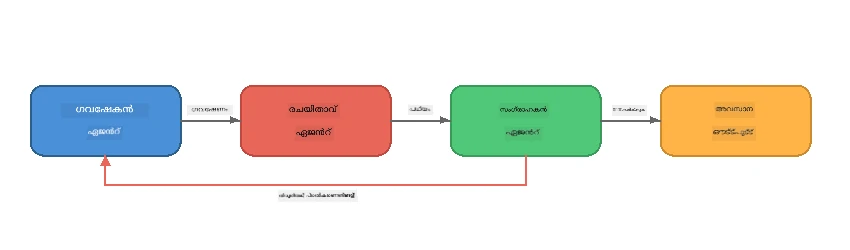
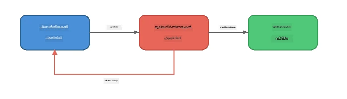
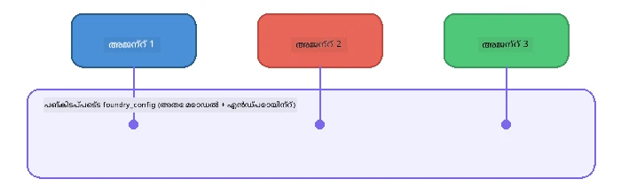

# ഭാഗം 6: മൾട്ടി-ഏജന്റ് വർക്‌ഫ്ലോകൾ

> **ലക്ഷ്യം:** സംഘാടക ഏജന്റ്മാർക്ക് ഇടയ്ക്ക് സമന്വയിപ്പിച്ച പൈപ്പ്ലൈനുകളായി നിരവധി പ്രത്യേകിച്ച ഏജന്റുമാർ കെട്ടിപ്പടുക്കുക - സങ്കീർണ്ണമായ ജോലി പങ്കുവയ്ക്കുക - എല്ലാം Foundry Local ഉപയോഗിച്ച് പ്രാദേശികമായി പ്രവർത്തിക്കുന്നു.

## എന്തുകൊണ്ട് മൾട്ടി-ഏജന്റ്?

ഒരു ഏജന്റ് പല ജോലികളെയും കൈകാര്യം ചെയ്യും, എന്നാൽ സങ്കീർണ്ണമായ വർക്‌ഫ്ലോകൾക്ക് **വിശേഷഘടികരണം** ഉപകരിക്കും. ഒരാൾ ഒരുപോലെ ഗവേഷണം, എഴുത്ത്, തിരുത്തൽ എന്നിവ ചെയ്യാൻ ശ്രമിക്കുന്നതിന് പകരം, നിങ്ങൾ ജോലി ശ്രദ്ധ കേന്ദ്രീകരിച്ച വേഷങ്ങളായി വിഭജിക്കുന്നു:



| പാറ്റേൺ | വിവരണം |
|---------|-------------|
| **ക്രമപ്രകാരമുള്ള** | ഏജന്റ് A-യുടെ ഔട്ട്പുട്ട് ഏജന്റ് B-യിലേക്ക് → അതിനുശേഷം ഏജന്റ് C-യിലേക്ക് |
| **ഫീഡ്ബാക്ക് ലൂപ്പ്** | ഒരു മൂല്യനിർണയ ഏജന്റ് തിരുത്തലിനു ജോലി തിരിച്ചു അയക്കാൻ കഴിയും |
| **പങ്കുവച്ചിട്ടുള്ള സന്ദർഭം** | എല്ലാ ഏജന്റുകളും ഒരേ മോഡൽ/എൻഡ്‌പോയിന്റ് ഉപയോഗിക്കുന്നു, പക്ഷേ വ്യത്യസ്ത നിർദ്ദേശങ്ങൾ |
| **ടൈപ്പുചെയ്ത ഔട്ട്പുട്ട്** | ഏജന്റുകൾ വിശ്വസനീയമായ കൈമാറ്റങ്ങൾക്ക് ഘടനാപരമായ ഫലങ്ങൾ (JSON) ഉണ്ടാക്കുന്നു |

---

## അഭ്യാസങ്ങൾ

### അഭ്യാസം 1 - മൾട്ടി-ഏജന്റ് പൈപ്പ്ലൈൻ ഓടിക്കുക

വർക്‌ഷോപ്പിൽ Researcher → Writer → Editor എന്ന പൂർണ്ണ വർക്‌ഫ്ലോ ഉൾപ്പെടുത്തിയിട്ടുണ്ട്.

<details>
<summary><strong>🐍 Python</strong></summary>

**സജ്ജീകരിക്കൽ:**
```bash
cd python
python -m venv venv

# Windows (പവർഷെൽ):
venv\Scripts\Activate.ps1
# മാക്‌ഓഎസ്:
source venv/bin/activate

pip install -r requirements.txt
```

**ഓട്‌ക്കുക:**
```bash
python foundry-local-multi-agent.py
```

**എന്താണ് സംഭവിക്കുന്നത്:**
1. **Researcher** ഒരു വിഷയം സ്വീകരിച്ച് പ്രധാന വിവരങ്ങൾ ബുള്ളറ്റ് പോയിന്റുകളായി നൽകുന്നു  
2. **Writer** ഗവേഷണം എടുത്ത് ഒരു ബ്ലോഗ് പോസ്റ്റ് ഡാഫ്റ്റ് തയ്യാറാക്കുന്നു (3-4 പാരഗ്രാഫുകൾ)  
3. **Editor** ലേഖനം വിശകലനം ചെയ്ത് ഗുണമേൻമ വിലയിരുത്തുന്നു, ACCEPT അല്ലെങ്കിൽ REVISE നൽകുന്നു

</details>

<details>
<summary><strong>📦 JavaScript</strong></summary>

**സജ്ജീകരിക്കൽ:**
```bash
cd javascript
npm install
```

**ഓട്‌ക്കുക:**
```bash
node foundry-local-multi-agent.mjs
```

**ആദ്യത്തെ മൂന്ന് ഘട്ടമുള്ള പൈപ്പ്ലൈൻ** - Researcher → Writer → Editor.

</details>

<details>
<summary><strong>💜 C#</strong></summary>

**സജ്ജീകരിക്കൽ:**
```bash
cd csharp
dotnet restore
```

**ഓട്‌ക്കുക:**
```bash
dotnet run multi
```

**ആദ്യത്തെ മൂന്ന് ഘട്ടമുള്ള പൈപ്പ്ലൈൻ** - Researcher → Writer → Editor.

</details>

---

### അഭ്യാസം 2 - പൈപ്പ്ലെയിനിന്റെ ഘടനാപരമായ പഠനം

ഏജന്റുകൾ എങ്ങനെ നിർവചിക്കുകയും കണക്ടുചെയ്യുകയും ചെയ്യുന്നു എന്നതിന് പഠനം നടത്തുക:

**1. പങ്കുവച്ച മോഡൽ ക്ലയന്റ്**

എല്ലാ ഏജന്റുകളും ഒരേ Foundry Local മോഡൽ പങ്കുവെക്കുന്നു:

```python
# Python - FoundryLocalClient എല്ലാം കൈകാര്യം ചെയ്യുന്നു
from agent_framework_foundry_local import FoundryLocalClient

client = FoundryLocalClient(model_id="phi-3.5-mini")
```

```javascript
// ജാവാസ്ക്രിപ്റ്റ് - ഫൗണ്ടറി ലോക്കലിൽ പോയിന്റ് ചെയ്ത OpenAI SDK
const client = new OpenAI({
  baseURL: manager.urls[0] + "/v1",
  apiKey: "foundry-local",
});
```

```csharp
// C# - OpenAIClient pointed at Foundry Local
var key = new ApiKeyCredential("foundry-local");
var client = new OpenAIClient(key, new OpenAIClientOptions
{
    Endpoint = new Uri(manager.Urls[0] + "/v1")
});
var chatClient = client.GetChatClient(model.Id);
```

**2. പ്രത്യേകിച്ച നിർദ്ദേശങ്ങൾ**

ഓരോ ഏജന്റിനും വ്യത്യസ്ത വേഷമാണുള്ളത്:

| ഏജന്റ് | നിർദ്ദേശങ്ങൾ (സംക്ഷിപ്തം) |
|-------|----------------------|
| Researcher | "പ്രധാനമായ വിവരങ്ങൾ, സ്ഥിതി, പശ്ചാത്തലം നൽകുക. ബുള്ളറ്റ് പോയിന്റുകളായി ക്രമീകരിക്കുക." |
| Writer | "ഗവേഷണ ശ്രദ്ധകളും എടുത്തും ആധാരമാക്കി ആകർഷകമായ ബ്ലോഗ് പോസ്റ്റ് (3-4 പാരഗ്രാഫുകൾ) എഴുതുക. സങ്കൽപ്പം വരുത്തരുത്." |
| Editor | "വിവരസൂക്ഷ്മത, വ്യാകരണം, സത്യസന്ധത പരിശോധിച്ച് അവലോകനം നടത്തുക. തീരുമാനം: ACCEPT അല്ലെങ്കിൽ REVISE." |

**3. ഏജന്റുകൾക്കിടയിലെ ഡേറ്റാ ഒഴുക്കുകൾ**

```python
# ഘട്ടം 1 - ഗവേഷണത്തിനുള്ള ഔട്ട്‌പുട്ട് എഴുത്തുകാരന്റെ ഇൻപുട്ട് ആകുന്നു
research_result = await researcher.run(f"Research: {topic}")

# ഘട്ടം 2 - എഴുത്തുകാരന്റെ ഔട്ട്‌പുട്ട് എഡിറ്ററിന്റെ ഇൻപുട്ട് ആകുന്നു
writer_result = await writer.run(f"Write using:\n{research_result}")

# ഘട്ടം 3 - എഡിറ്റർ ഗവേഷണവും ലേഖനവും അവലോകനം ചെയ്യുന്നു
editor_result = await editor.run(
    f"Research:\n{research_result}\n\nArticle:\n{writer_result}"
)
```

```csharp
// C# - same pattern, async calls with AIAgent
var researchNotes = await researcher.RunAsync(
    $"Research the following topic and provide key facts:\n{topic}");

var draft = await writer.RunAsync(
    $"Write a blog post based on these research notes:\n\n{researchNotes}");

var verdict = await editor.RunAsync(
    $"Review this article for quality and accuracy.\n\n" +
    $"Research notes:\n{researchNotes}\n\n" +
    $"Article:\n{draft}");
```

> **പ്രധാനമായ അറിവ്:** ഓരോ ഏജന്റും മുൻ ഏജന്റുമാരുടെ സമാഹിത സന്ദർഭം സ്വീകരിക്കുന്നു. എഡിറ്റർ ഗവേഷണവും ഡ്രാഫ്റ്റും കാണുകയും അതിലൂടെ സത്യനിഷ്ഠ പരിശോദന നടത്തുകയും ചെയ്യുന്നു.

---

### അഭ്യാസം 3 - നാലാം ഏജന്റ് ചേർക്കുക

പൈപ്പ്ലൈൻ നീട്ടി ഒരു പുതിയ ഏജന്റ് ചേർക്കുക. ഏതെങ്കിലും ഒന്ന് തിരഞ്ഞെടുക്കുക:

| ഏജന്റ് | ലക്ഷ്യം | നിർദ്ദേശങ്ങൾ |
|-------|---------|-------------|
| **Fact-Checker** | ലേഖനത്തിലെ പ്രസ്താവനകൾ പരിശോധിക്കുക | `"നിങ്ങൾ സത്യസന്ധത പരിശോധിക്കുന്നു. ഓരോ പ്രസ്താവനയ്ക്കും ഗവേഷണ രേഖകളാൽ പിന്തുണയുണ്ടോ എന്ന് പറയുക. പോയിന്റുകൾക്ക് സ്ഥിരീകരിക്കപ്പെട്ട/സ്ഥിരീകരിക്കപ്പെടാത്ത JSON ഫോർമാറ്റ് തിരിച്ചു നൽകുക."` |
| **Headline Writer** | ആകർഷകമായ തലക്കെട്ടുകൾ സൃഷ്ടിക്കുക | `"ലേഖനത്തിന് 5 തലക്കെട്ടുകൾ നിർമിക്കുക. ശൈലി വ്യത്യസ്തമാക്കുക: വിവരഭരിതം, ക്ലിക്ക്ബെയിറ്റ്, ചോദ്യരൂപം, ലിസ്റ്റിക്കൽ, ഭാവനാപരമായത്."` |
| **Social Media** | പ്രചാരണമുള്ള പോസ്റ്റുകൾ സൃഷ്ടിക്കുക | `"ഈ ലേഖനം പ്രമോട്ട് ചെയ്യുന്ന 3 സോഷ്യൽ മീഡിയ പോസ്റ്റുകൾ സൃഷ്ടിക്കുക: Twitter-ക്കായി (280 അക്ഷരങ്ങൾ), LinkedIn (പ്രൊഫഷണൽ ശൈലി), Instagram (സൗഹൃദപരവും ഇമോട്ടി‌കൺ നിർദ്ദേശവുമുള്ളത്)."` |

<details>
<summary><strong>🐍 Python - ഒരു Headline Writer ചേർക്കുന്നു</strong></summary>

```python
headline_agent = client.as_agent(
    name="HeadlineWriter",
    instructions=(
        "You are a headline specialist. Given an article, generate exactly "
        "5 headline options. Vary the style: informative, question-based, "
        "listicle, emotional, and provocative. Return them as a numbered list."
    ),
)

# എഡിറ്റർ അംഗീകരിച്ചശേഷം തലവാചകങ്ങൾ സൃഷ്ടിക്കുക
headline_result = await headline_agent.run(
    f"Generate headlines for this article:\n\n{writer_result}"
)
print(f"\n--- Headlines ---\n{headline_result}")
```

</details>

<details>
<summary><strong>📦 JavaScript - ഒരു Headline Writer ചേർക്കുന്നു</strong></summary>

```javascript
const headlineAgent = new ChatAgent({
  client,
  modelId: modelInfo.id,
  instructions:
    "You are a headline specialist. Given an article, generate exactly " +
    "5 headline options. Vary the style: informative, question-based, " +
    "listicle, emotional, and provocative. Return them as a numbered list.",
  name: "HeadlineWriter",
});

const headlineResult = await headlineAgent.run(
  `Generate headlines for this article:\n\n${writerResult.text}`
);
console.log(`\n--- Headlines ---\n${headlineResult.text}`);
```

</details>

<details>
<summary><strong>💜 C# - ഒരു Headline Writer ചേർക്കുന്നു</strong></summary>

```csharp
AIAgent headlineAgent = chatClient.AsAIAgent(
    name: "HeadlineWriter",
    instructions:
        "You are a headline specialist. Given an article, generate exactly " +
        "5 headline options. Vary the style: informative, question-based, " +
        "listicle, emotional, and provocative. Return them as a numbered list."
);

// After the editor accepts, generate headlines
var headlines = await headlineAgent.RunAsync(
    $"Generate headlines for this article:\n\n{draft}");
Console.WriteLine($"\n--- Headlines ---\n{headlines}");
```

</details>

---

### അഭ്യാസം 4 - നിങ്ങളുടെ സ്വന്തം വർക്‌ഫ്ലോ ഡിസൈൻ ചെയ്യുക

വ്യത്യസ്ത ഡൊമെയ്ൻ ഉപയോഗിച്ച് മൾട്ടി-ഏജന്റ് പൈപ്പ്ലൈൻ രൂപകൽപ്പന ചെയ്യുക. ചില ആശയങ്ങൾ:

| ഡൊമെയ്ൻ | ഏജന്റുകൾ | പ്രവാഹം |
|--------|--------|------|
| **കോഡ് റിവ്യൂ** | Analyser → Reviewer → Summariser | കോഡ് ഘടന വിശകലനം → പ്രശ്നങ്ങൾ പരിശോധിക്കൽ → സംക്ഷിപ്ത റിപ്പോർട്ട് ഒരുക്കൽ |
| **കസ്റ്റമർ പിന്തുണ** | Classifier → Responder → QA | ടിക്കറ്റ് ക്ലാസിഫൈ ചെയ്യൽ → മറുപടി രൂപീകരിക്കൽ → ഗുണമേൻമ പരിശോധിക്കൽ |
| **വിദ്യാഭ്യാസം** | Quiz Maker → Student Simulator → Grader | ക്വിസ് സൃഷ്ടിക്കൽ → ഉത്തരം ചവിട്ടി കാണിക്കൽ → ഗ്രേഡ് നൽകുക, വിശദീകരിക്കുക |
| **ഡാറ്റ അനാലിസിസ്** | Interpreter → Analyst → Reporter | ഡാറ്റാ അഭ്യർത്ഥന വ്യാഖ്യാനം → പാറ്റേണുകൾ വിശകലനം → റിപ്പോർട്ട് എഴുതുക |

**പദവികൾ:**
1. അടഞ്ഞ `instructions`-ഉളള 3+ ഏജന്റുകൾ നിർവചിക്കുക  
2. ഡാറ്റാ പ്രവാഹം നിശ്ചയിക്കുക - ഏജന്റ് ഏത് ഇൻപുട്ടും ഔട്ട്പുട്ടും കൈകാര്യം ചെയ്യുന്നു?  
3. അഭ്യാസം 1-3ൽ നിന്നുള്ള പാറ്റേണുകൾ ഉപയോഗിച്ച് പൈപ്പ്ലൈൻ നടപ്പാക്കുക  
4. ഒരു ഫീഡ്ബാക്ക് ലൂപ്പ് ചേർക്കുക, ഏജന്റ് ഒന്നിന്റെ ജോലിക്ക് മറ്റൊരാൾ മൂല്യം നൽകണം എങ്കിൽ

---

## ഓർക്കസ്ട്രേഷൻ പാറ്റേണുകൾ

ഇവിടെയാണ് ഏത് മൾട്ടി-ഏജന്റ് സിസ്റ്റത്തിനും ബാധകമായ ഓർക്കസ്ട്രേഷൻ പാറ്റേണുകളുടെ ചില ഉദാഹരണങ്ങൾ ([ഭാഗം 7](part7-zava-creative-writer.md) ൽ വിശദമായി പരിശോധിച്ചിരിക്കുന്നു):

### ക്രമപ്രകാരമുള്ള പൈപ്പ്ലൈൻ


ഓരോ ഏജന്റും മുൻവരുടെയോട് ലഭിച്ച ഔട്ട്പുട്ട് പ്രോസസ് ചെയ്യുന്നു. ലളിതവും പ്രവചനക്ഷമവുമാണ്.

### ഫീഡ്ബാക്ക് ലൂപ്പ്



ഒരു മൂല്യനിർണയ ഏജന്റ് മുമ്പത്തെ ഘട്ടങ്ങൾ വീണ്ടും നടത്താൻ ത്രിഗർ ചെയ്യാൻ കഴിയും. Zava Writer-ൽ ഇത് ഉപയോഗിക്കുന്നുണ്ട്: എഡിറ്റർ ഗവേഷകനും എഴുത്തുകാരനും ഫീഡ്ബാക്ക് അയയ്ക്കാം.

### പങ്കുവച്ച സന്ദർഭം



എല്ലാ ഏജന്റുകളും ഒരേ `foundry_config` പങ്കുവെക്കുന്നു, അതിനാൽ അവയെല്ലാം ഒരേ മോഡലും എൻഡ്‌പോയിന്റും ഉപയോഗിക്കുന്നു.

---

## പ്രധാനകാര്യങ്ങൾ

| ആശയം | നിങ്ങൾ പഠിച്ചത് |
|---------|-----------------|
| ഏജന്റ് പ്രത്യേകിച്ച പ്രവർത്തനം | ഓരോ ഏജന്റും ശ്രദ്ധ കേന്ദ്രീകരിച്ചു ഒരു കാര്യത്തിൽ വിദഗ്ധനാകുന്നു |
| ഡാറ്റ കൈമാറ്റം | ഒരു ഏജന്റിന്റെ ഔട്ട്പുട്ട് അടുത്ത ഏജന്റിന്റെ ഇൻപുട്ടായി മാറുന്നു |
| ഫീഡ്ബാക്ക് ലൂപ്പുകൾ | മൂല്യനിർണയ ഇടപെടലുകൾ ഉയർന്ന ഗുണമേൻമ ലക്ഷ്യമാക്കി ശ്രമം ആവർത്തിക്കുന്നു |
| ഘടനാപരമായ ഔട്ട്പുട്ട് | JSON ഫോർമാറ്റിലുള്ള പ്രതികരണങ്ങൾ ഏജന്റ്-തുതാങ്കാപ്പരമായ വിശ്വസനീയത ഉറപ്പാക്കുന്നു |
| ഓർക്കസ്ട്രേഷൻ | കോർഡിനേറ്റർ പൈപ്പ്ലൈൻ ക്രമവും പിശക് കൈകാര്യം ചെയ്യലും നിയന്ത്രിക്കുന്നു |
| പ്രൊഡക്ഷൻ പാറ്റേണുകൾ | [ഭാഗം 7: Zava Creative Writer](part7-zava-creative-writer.md) ൽ പ്രയോഗിച്ചത് |

---

## അടുത്ത പടികൾ

[ഭാഗം 7: Zava Creative Writer - കാപ്പ്സ്ടോൺ അപ്ലിക്കേഷൻ](part7-zava-creative-writer.md) സന്ദർശിച്ച് 4 പ്രത്യേകിച്ച ഏജന്റുകൾ, സ്ട്രീമിംഗ് ഔട്ട്പുട്ട്, പ്രോഡക്ട് സെർച്ച്, ഫീഡ്ബാക്ക് ലൂപ്പുകൾ എന്നിവയുളള പ്രൊഡക്ഷൻ താളത്തിലുള്ള മൾട്ടി-ഏജന്റ് ആപ്പ് അന്വേഷിക്കുക - Python, JavaScript, C# എന്നിവയിൽ ലഭ്യമാകുന്നു.