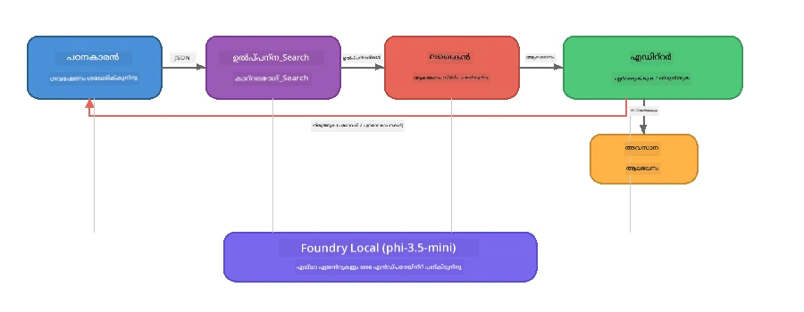

# ഭാഗം 7: Zava Creative Writer - കാപ്സ്റ്റോൺ അപ്ലിക്കേഷൻ

> **ലക്ഷ്യം:** ഫൗണ്ട്രി ലോക്കലിന്റെ സഹായത്തോടെ നിങ്ങളുടെ ഉപകരണത്തിൽ പൂർണമായി പ്രവർത്തിക്കുന്ന, നാല് പ്രത്യേക ജീവനക്കാരെ ഉൾപ്പെടുത്തി Zava Retail DIY-ക്കായി മാഗസിൻ നിലവാരത്തിലുള്ള ലേഖനങ്ങൾ നിർമ്മിക്കാൻ നിർമ്മിച്ച ഒരു ഉൽ‌പാദന-ശൈലി മൾട്ടി-ഏജന്റ് അപ്ലിക്കേഷൻ പരിശോധിക്കുക.

ഇത് വർ‍ക്ക്ഷോപ്പിന്റെ **കാപ്സ്റ്റോൺ ലാബ്** ആണ്. ഇതിൽ നിങ്ങൾ പഠിച്ച എല്ലാ കാര്യങ്ങളും ഒന്നിച്ച് ഉൾപ്പെടുത്തിയിട്ടുണ്ട് - SDK സംയോജനം (ഭാഗം 3), പ്രാദേശിക ഡാറ്റയിൽ നിന്ന് തിരച്ചിൽ (ഭാഗം 4), ഏജന്റ് പേഴ്‌സോനാസ് (ഭാഗം 5), മൾട്ടി-ഏജന്റ് ഓർക്കസ്ട്രേഷൻ (ഭാഗം 6) - ഇതെല്ലാം **Python**, **JavaScript**, **C#**-ൽ ലഭ്യമായ പൂർണ അപ്ലിക്കേഷനായി.

---

## നിങ്ങൾ പരിശോധിക്കാൻ പോകുന്നത്

| ആശയം | Zava Writer-ൽ എവിടെ |
|---------|----------------------------|
| 4-പടി മോഡൽ ലോഡിംഗ് | ഷെയർഡ് കോൺഫിഗ് മോഡ്യൂൾ Foundry Local സ്റ്റാർട്ട് ചെയ്യുന്നു |
| RAG-ശൈലി തിരച്ചിൽ | പ്രോഡക്ട് ഏജന്റ് പ്രാദേശിക കാറ്റലോഗ് തിരയുന്നു |
| ഏജന്റ് സ്പെഷ്യലൈസേഷൻ | വ്യത്യസ്ത സിസ്റ്റം പ്രാമ്പ്റ്റുകൾ ഉള്ള 4 ഏജന്റുകൾ |
| സ്റ്റ്രീമിംഗ് ഔട്ട്പുട്ട് | റൈറ്റർ റിയൽ-ടൈം ടോക്കൺ‌സ് സ്പ്രിംഗ് ചെയ്യുന്നു |
| ഘടനാപരമായ കൈമാറ്റം | റിസർച്ചർ → JSON, എഡിറ്റർ → JSON തീരുമാനം |
| ഫീഡ്‌ബാക്ക് ലൂപുകൾ | എഡിറ്റർ റെട്രൈ 2 മാക്‌സിൽ എല്ലാ പ്രയാസങ്ങളും തിരിച്ച് പ്രവർത്തിക്കാം |

---

## ആർക്കിടെക്ചർ

Zava Creative Writer **മൂല്യനിർണയകൃത ഫീഡ്‌ബാക്കിൽ പ്രവർത്തിക്കുന്ന അനുക്രമ പൈപ്പ്‌ലൈന്** ഉപയോഗിക്കുന്നു. മൂന്ന് ഭാഷാ നടപ്പാക്കലുകളുടെയും ആർക്കിടെക്ചർ തുല്യമാണ്:



### നാല് ഏജന്റുകളും

| ഏജന്റ് | ഇൻപുട്ട് | ഔട്‌പുട്ട് | ലക്ഷ്യം |
|-------|--------|---------|---------|
| **റിസർച്ചർ** | വിഷയം + ഐച്ഛിക ഫീഡ്‌ബാക്ക് | `{"web": [{url, name, description}, ...]}` | LLM ഉപയോഗിച്ച് പശ്ചാത്തല ഗവേഷണം നടത്തുന്നു |
| **പ്രോഡക്ട് സെർച്ച്** | പ്രോഡക്ട് കോൺടക്സ്റ്റ് സ്ട്രിംഗ് | താരതമ്യപ്പെടുന്ന ഉൽപ്പന്നങ്ങളുടെ പട്ടിക | LLM-ജനിതമായ ക്വേറിയുകളും കീവേഡ് തിരച്ചിലും പ്രാദേശിക കാറ്റലോഗിൽ |
| **റൈറ്റർ** | റിസർച്ചും ഉൽപ്പന്നങ്ങളുമും അസൈൻമെന്റും ഫീഡ്‌ബാക്കും | സ്റ്റ്രീമിംഗ് ലേഖന എഴുത്ത് (`---`-ൽ വിഭജിച്ചത്) | മാഗസിൻ നിലവാരമുള്ള ലേഖനം റിയൽ-ടൈം ഡRAFT ചെയ്യുന്നു |
| **എഡിറ്റർ** | ലേഖനം + റൈറ്ററുടെ സ്വയം ഫീഡ്‌ബാക്ക് | `{"decision": "accept/revise", "editorFeedback": "...", "researchFeedback": "..."}` | ഗുണനിലവാരം പരിശോധിച്ച് റെട്രൈ ആവശ്യപ്പെട്ടാൽ പ്രവർത്തനം തിരിച്ചു അയക്കുന്നു |

### പൈപ്പ്‌ലൈൻ പ്രവാഹം

1. **റിസർച്ചർ** വിഷയം സ്വീകരിച്ച് ഘടനാപരമായ റിസർച്ചർ നോട്ടുകൾ (JSON) നൽകുന്നു
2. **പ്രോഡക്ട് സെർച്ച്** LLM-ജനിതമായ തിരച്ചിൽ നിബന്ധനകൾ ഉപയോഗിച്ച് പ്രാദേശിക പ്രോഡക്ട് കാറ്റലോഗ് തിരയുന്നു
3. **റൈറ്റർ** റിസർച്ചും ഉൽപ്പന്നങ്ങളും അസൈൻമെന്റും ചേർത്ത് സ്റ്റ്രീമിംഗ് ലേഖനം, `---` സെപ്പറേറ്ററിന് ശേഷം സ്വയം ഫീഡ്‌ബാക്ക് ചേർക്കുന്നു
4. **എഡിറ്റർ** ലേഖനം പരിശോധിച്ച് JSON തീരുമാനം നൽകുന്നു:
   - `"accept"` → പൈപ്പ്‌ലൈൻ പൂർത്തിയായി
   - `"revise"` → ഫീഡ്‌ബാക്ക് റിസർച്ചർ, റൈറ്റർക്ക് തിരിച്ചു അയയ്ക്കുന്നു (മാക്‌സം 2 റെട്രൈസ്)

---

## ആവശ്യമായ മുൻ‌പരിചയം

- [ഭാഗം 6: മൾട്ടി-ഏജന്റ് വർക്ക്‌ഫ്ലോസ്](part6-multi-agent-workflows.md) പൂർത്തിയാക്കുക
- Foundry Local CLI ഇൻസ്റ്റാൾ ചെയ്ത് `phi-3.5-mini` മോഡൽ ഡൗൺലോഡ് ചെയ്‌തിരിക്കണം

---

## അഭ്യാസങ്ങൾ

### അഭ്യാസം 1 - Zava Creative Writer chạyിക്കുക

താങ്കളുടെ ഭാഷ തിരഞ്ഞെടുക്കുക, അപ്ലിക്കേഷൻ chạy ചെയ്യുക:

<details>
<summary><strong>🐍 Python - FastAPI വെബ് സർവീസ്</strong></summary>

Python പതിപ്പ് REST API ക്ഷമിക്കുന്ന ഒരു **വെബ് സർവീസ്** ആയി പ്രവർത്തിക്കുന്നു, ഉൽ‌പാദന ബാക്കെൻഡ് നിർമ്മിക്കുന്ന പ്രക്രിയ കാണിക്കുന്നു.

**സജ്ജീകരണം:**
```bash
cd zava-creative-writer-local/src/api
python -m venv venv

# Windows (പവർഷെൽ):
venv\Scripts\Activate.ps1
# macOS:
source venv/bin/activate

pip install -r requirements.txt
```

**ഒടുവിൽ പ്രവർത്തിപ്പിക്കുക:**
```bash
uvicorn main:app --reload
```

**പരീക്ഷിക്കുക:**
```bash
curl -X POST http://localhost:8000/api/article \
  -H "Content-Type: application/json" \
  -d '{
    "research": "DIY home improvement trends",
    "products": "power tools and paints",
    "assignment": "Write an article about weekend renovation projects for DIY enthusiasts"
  }'
```

പ്രതികരണം പോർട്ടുചെയ്യുന്ന JSON സന്ദേശങ്ങൾ ഒന്നൊന്നായി സ്ട്രീം ആയി ലഭിക്കും, ഓരോ ഏജന്റിന്റെയും പുരോഗതിയും കാണിക്കുന്നു.

</details>

<details>
<summary><strong>📦 JavaScript - Node.js CLI</strong></summary>

JavaScript പതിപ്പ് ഒരു **CLI അപ്ലിക്കേഷൻ** ആയി പ്രവർത്തിക്കുന്നു, ഏജന്റ് പുരോഗതിയും ലേഖനവുമെല്ലാം കൺസോളിൽ മേശപ്പെടുന്നു.

**സജ്ജീകരണം:**
```bash
cd zava-creative-writer-local/src/javascript
npm install
```

**ഒടുവിൽ പ്രവർത്തിപ്പിക്കുക:**
```bash
node main.mjs
```

നിങ്ങൾക്ക് താഴെ കാണാം:
1. Foundry Local മോഡൽ ലോഡിംഗ് (ഡൗൺലോഡ് അനുഭവം കാണിക്കാൻ പ്രോഗ്രസ് ബാർ)
2. ഏജന്റുകൾ പരമ്പരാഗതമായി നടപ്പിലാക്കുന്നു, സ്റ്റാറ്റസ് സന്ദേശങ്ങൾ
3. ലേഖനം റിയൽ-ടൈം ആയി കൺസോളിൽ സ്ട്രീം ചെയ്യും
4. എഡിറ്ററുടെ അംഗീകരণ/തിരുത്തൽ തീരുമാനം

</details>

<details>
<summary><strong>💜 C# - .NET കൺസോൾ അപ്ലിക്കേഷൻ</strong></summary>

C# പതിപ്പ് ഒരു **.NET കൺസോൾ അപ്ലിക്കേഷൻ** ആയി പ്രവർത്തിക്കുന്നു, ജാവാസ്ക്രിപ്റ്റ് പതിപ്പിനോടൊത്തു സമാനമായ പൈപ്പ്‌ലൈൻ, സ്ട്രീമിംഗ് ഔട്ട്പുട്ട്.

**സജ്ജീകരണം:**
```bash
cd zava-creative-writer-local/src/csharp
dotnet restore
```

**ഒടുവിൽ പ്രവർത്തിപ്പിക്കുക:**
```bash
dotnet run
```

ജാവാസ്ക്രിപ്റ്റ് പതിപ്പിനോടൊതു സ്റ്റാറ്റസ് സന്ദേശങ്ങൾ, ലേഖന സ്ട്രീമിംഗ്, എഡിറ്റർ വിധി ലഭിക്കും.

</details>

---

### അഭ്യാസം 2 - കോഡ് ഘടന പഠിക്കുക

ഏറെ ഭാഷാ നടപ്പാക്കലുകൾ തുല്യമായ ലജിക്കൽ ഘടകങ്ങൾ ഉപയോഗിക്കുന്നു. ഘടനകൾ താരതമ്യം ചെയ്യുക:

**Python** (`src/api/`):
| ഫയൽ | ലക്ഷ്യം |
|------|---------|
| `foundry_config.py` | ഷെയർഡ് Foundry Local മാനേജർ, മോഡൽ, ക്ലയന്റ് (4-പടി ഇനിഷ്യലൈസ്) |
| `orchestrator.py` | പൈപ്പ്‌ലൈൻ കോ ഓർഡിനേഷൻ, ഫീഡ്‌ബാക്ക് ലൂപ് |
| `main.py` | FastAPI എൻഡ്‌പോയിന്റ്‌സ് (`POST /api/article`) |
| `agents/researcher/researcher.py` | JSON ഔട്ട്പുട്ടിൽ LLM അടിസ്ഥാനമാക്കിയുള്ള റിസർച്ചർ |
| `agents/product/product.py` | LLM query ജനറേഷൻ + കീവേഡ് തിരച്ചിൽ |
| `agents/writer/writer.py` | സ്ട്രീമിംഗ് ലേഖന ജനറേഷൻ |
| `agents/editor/editor.py` | JSON അംഗീകരണ/തിരുത്തൽ തീരുമാനം |

**JavaScript** (`src/javascript/`):
| ഫയൽ | ലക്ഷ്യം |
|------|---------|
| `foundryConfig.mjs` | ഷെയർഡ് Foundry Local കോൺഫിഗ് (4-പടി ഇനിഷ്യലൈസ്, പ്രോഗ്രസ് ബാർ) |
| `main.mjs` | ഓർക്കസ്ട്രേറ്റർ + CLI പ്രവേശന പോയിന്റ് |
| `researcher.mjs` | LLM അടിസ്ഥാനമാക്കിയുള്ള റിസർച്ചർ ഏജന്റ് |
| `product.mjs` | LLM ക്വറി ജനറേഷൻ + കീവേഡ് തിരച്ചിൽ |
| `writer.mjs` | സ്ട്രീമിംഗ് ലേഖന ജനറേഷൻ (അസിങ്ക് ജനറേറ്റർ) |
| `editor.mjs` | JSON അംഗീകരണ/തിരുത്തൽ തീരുമാനം |
| `products.mjs` | പ്രോഡക്ട് കാറ്റലോഗ് ഡാറ്റ |

**C#** (`src/csharp/`):
| ഫയൽ | ലക്ഷ്യം |
|------|---------|
| `Program.cs` | പൂർണ പൈപ്പ്‌ലൈൻ: മോഡൽ ലോഡിംഗ്, ഏജന്റുകൾ, ഓർക്കസ്ട്രേറ്റർ, ഫീഡ്‌ബാക്ക് ലൂപ് |
| `ZavaCreativeWriter.csproj` | .NET 9 പ്രോജക്റ്റ് Foundry Local + OpenAI പാക്കേജുകൾ കൊണ്ട് |

> **ഡിസൈൻ കുറിപ്പ്:** Python ഓരോ ഏജന്റിനും തലക്കെട്ടായി ഫയലുകളും ഡയറക്ടറികളുമായി വേർതിരിക്കുന്നു (വലിയ ടീമുകൾക്ക് അനുയോജ്യം). ജാവാസ്ക്രിപ്റ്റ് ഓരോ ഏജന്റിനും ഒരു മോഡ്യൂൾ ഉപയോഗിക്കുന്നു (മധ്യത്തരം പ്രോജക്റ്റുകൾക്ക് നല്ലത്). C# എല്ലാം ഒരേ ഫയലിൽ ലോക്കൽ ഫംഗ്ഷനുകളായി വക്കുന്നു (സ്വയം ഉള്ളാചരണ ഉദാഹരണങ്ങൾക്ക്). ഉൽ‌പാദനത്തിൽ നിങ്ങളുടെ ടീമിന് അനുയോജ്യമായ മാതൃക തിരഞ്ഞെടുക്കുക.

---

### അഭ്യാസം 3 - ഷെയർഡ് കോൺഫിഗറേഷൻ ട്രേസ് ചെയ്യുക

പൈപ്പ്‌ലൈൻ中的 എല്ലാ ഏജന്റുകളും ഒരേ Foundry Local മോഡൽ ക്ലയന്റിനെ പango共享 ചെയ്യുന്നു. ഇത് ഓരോ ഭാഷയിലും എങ്ങനെ സജ്ജമാക്കിയിരിക്കുന്നവ അത് പഠിക്കുക:

<details>
<summary><strong>🐍 Python - foundry_config.py</strong></summary>

```python
from foundry_local import FoundryLocalManager

MODEL_ALIAS = "phi-3.5-mini"

# ഘട്ടം 1: മാനേജറും ഫൗണ്ടറി ലോക്കൽ സർവീസും ആരംഭിക്കുക
manager = FoundryLocalManager()
manager.start_service()

# ഘട്ടം 2: മോഡൽ നേരത്തെ ഡൗൺലോഡ് ചെയ്തിട്ടുണ്ടോ എന്ന് പരിശോധിക്കുക
cached = manager.list_cached_models()
catalog_info = manager.get_model_info(MODEL_ALIAS)
is_cached = any(m.id == catalog_info.id for m in cached) if catalog_info else False

if not is_cached:
    manager.download_model(MODEL_ALIAS)

# ഘട്ടം 3: മോഡൽ മെമ്മറിയിലേക്ക് ലോഡ് ചെയ്യുക
manager.load_model(MODEL_ALIAS)
model_id = manager.get_model_info(MODEL_ALIAS).id

# പങ്കിട്ട OpenAI ക്ലയന്റ്
client = openai.OpenAI(base_url=manager.endpoint, api_key=manager.api_key)
```

എല്ലാ ഏജന്റുകളും `from foundry_config import client, model_id` ഇമ്പോർട്ട് ചെയ്യുന്നു.

</details>

<details>
<summary><strong>📦 JavaScript - foundryConfig.mjs</strong></summary>

```javascript
import { FoundryLocalManager } from "foundry-local-sdk";
import { OpenAI } from "openai";

FoundryLocalManager.create({ appName: "ZavaCreativeWriter" });
const manager = FoundryLocalManager.instance;
await manager.startWebService();

// കാഷെ പരിശോധിക്കുക → ഡൗൺലോഡ് ചെയ്യുക → ലോഡ് ചെയ്യുക (പുതിയ SDK പാറ്റേൺ)
const catalog = manager.catalog;
const model = await catalog.getModel(MODEL_ALIAS);
if (!model.isCached) {
  console.log(`Downloading model: ${MODEL_ALIAS}...`);
  await model.download();
}
await model.load();

const client = new OpenAI({ baseURL: manager.urls[0] + "/v1", apiKey: "foundry-local" });
const modelId = model.id;
export { client, modelId };
```

എല്ലാ ഏജന്റുകളും `{ client, modelId } from "./foundryConfig.mjs"` ഇമ്പോർട്ട് ചെയ്യുന്നു.

</details>

<details>
<summary><strong>💜 C# - Program.cs മുകളിൽ</strong></summary>

```csharp
await FoundryLocalManager.CreateAsync(
    new Configuration
    {
        AppName = "ZavaCreativeWriter",
        Web = new Configuration.WebService { Urls = "http://127.0.0.1:0" }
    }, NullLogger.Instance, default);
var manager = FoundryLocalManager.Instance;
await manager.StartWebServiceAsync(default);

var catalog = await manager.GetCatalogAsync(default);
var catalogModel = await catalog.GetModelAsync(alias, default);
var isCached = await catalogModel.IsCachedAsync(default);
if (!isCached)
    await catalogModel.DownloadAsync(null, default);

await catalogModel.LoadAsync(default);
var key = new ApiKeyCredential("foundry-local");
var chatClient = new OpenAIClient(key, new OpenAIClientOptions
{
    Endpoint = new Uri(manager.Urls[0] + "/v1")
}).GetChatClient(catalogModel.Id);
```

`chatClient` പിന്നീട് ഒരേ ഫയലിലുള്ള എല്ലാ ഏജന്റ് ഫംഗ്ഷനുകൾക്കും പാസ്സ് ചെയ്യപ്പെടുന്നു.

</details>

> **പ്രധാന മാതൃക:** മോഡൽ ലോഡിംഗ് മാതൃക (സർവീസ് സ്റ്റാർട്ട് → കാഷെ പരിശോധിക്കുക → ഡൗൺലോഡ് ചെയ്യുക → ലോഡ് ചെയ്യുക) ഉപയോക്താവിന് വ്യക്തമായ പുരോഗതി കാണിക്കുകയും മോഡൽ ഒറ്റ തവണ മാത്രം ഡൗൺലോഡ് ചെയ്യുകയും ചെയ്യുന്ന മികച്ച പ്രാക്ടീസ് ആണ് എല്ലാ Foundry Local ആപ്ലിക്കേഷനുകൾക്കും.

---

### അഭ്യാസം 4 - ഫീഡ്‌ബാക്ക് ലൂപ് മനസ്സിലാക്കുക

ഫീഡ്‌ബാക്ക് ലൂപ് ഈ പൈപ്പ്‌ലൈനെ "സ്മാർട്ട്" ആക്കുന്നു - എഡിറ്റർ പുനർപ്രവർത്തനത്തിനായി വേർപാട് അയയ്ക്കാൻ കഴിയും. ലജിക് ട്രേസ് ചെയ്യുക:

```
Orchestrator:
  1. researcher.research(topic, "No Feedback")    ← first pass
  2. product.findProducts(productContext)
  3. writer.write(research, products, assignment)  ← streams article
  4. Split article at "---" → article + writerFeedback
  5. editor.edit(article, writerFeedback)

  WHILE editor says "revise" AND retryCount < 2:
    6. researcher.research(topic, editor.researchFeedback)  ← refined
    7. writer.write(research, products, editor.editorFeedback)
    8. editor.edit(newArticle, newWriterFeedback)
    9. retryCount++
```

**പരിശോധിക്കാനുള്ള ചോദ്യങ്ങൾ:**
- റെട്രൈ ലിമിറ്റ് 2 ആയി നിശ്ചയിച്ചിരിക്കുന്നത് എന്തുകൊണ്ടാണ്? ഇത് വർദ്ധിപ്പിച്ചാൽ എന്ത് സംഭവിക്കും?
- റിസർച്ചർക്ക് `researchFeedback` നൽകുകയും റൈറ്റർക്ക് `editorFeedback` നൽകുകയും ചെയ്യുന്നത് എന്തുകൊണ്ടാണ്?
- എഡിറ്റർ എപ്പോഴും "revise" എന്ന് പറഞ്ഞാൽ എന്തു സംഭവിക്കും?

---

### അഭ്യാസം 5 - ഏജന്റ് മാറ്റം വരുത്തുക

ഒരു ഏജന്റിന്റെ പെരുമാറ്റം മാറ്റി പൈപ്പ്‌ലൈൻ എങ്ങനെ ബാധിക്കുന്നുവെന്ന് നോക്കുക:

| മാറ്റം | എന്ത് മാറ്റണം |
|-------------|----------------|
| **കൂടുതൽ കടുപ്പമുള്ള എഡിറ്റർ** | എഡിറ്ററുടെ സിസ്റ്റം പ്രാമ്പ്റ്റ് എല്ലായ്പ്പോഴും കുറഞ്ഞത് ഒരു തിരുത്തൽ ആവശ്യപ്പെടുന്നതായി മാറ്റുക |
| **ദീർഘമായ ലേഖനങ്ങൾ** | റൈറ്ററുടെ പ്രാമ്പ്റ്റിൽ "800-1000 വാക്കുകൾ" നിന്നു "1500-2000 വാക്കുകൾ" എന്ന് മാറ്റുക |
| **വ്യത്യസ്ത ഉൽപ്പന്നങ്ങൾ** | പ്രോഡക്ട് കാറ്റലോഗിൽ ഉൽപ്പന്നങ്ങൾ ചേർക്കുക അല്ലെങ്കിൽ മാറ്റുക |
| **പുതിയ ഗവേഷണ വിഷയം** | ഡീഫോൾട്ട് `researchContext` വ്യത്യസ്ത വിഷയമായി മാറ്റുക |
| **JSON മാത്രം റിസർച്ചർ** | റിസർച്ചർ 3-5 മറിച്ച് 10 ഇനങ്ങൾ റിട്ടേൺ ചെയ്യ도록 മാറ്റുക |

> **ടിപ്പ്:** എല്ലാ മൂന്ന് ഭാഷകളിലും ഒരേ ആർക്കിടെക്ചർ നഷ്‌ടമില്ലാതെ, നിങ്ങൾക്ക് അനുരഞ്ജകരമായ ഭാഷയിൽ ഈ മാറ്റം ചെയ്യാം.

---

### അഭ്യാസം 6 - അഞ്ചാം ഏജന്റ് ചേർക്കുക

പൈപ്പ്‌ലൈൻ ഒരുപാട് ഏജന്റുമായി കൂടുതല് വികസിപ്പിക്കുക. ചില ശുപാർശകൾ:

| ഏജന്റ് | പൈപ്പ്‌ലൈൻ中的 സ്ഥലം | ലക്ഷ്യം |
|-------|-------------------|---------|
| **ഫാക്ട്-ചെക്കർ** | റൈറ്ററിനു ശേഷം, എഡിറ്ററിനു മുൻപ് | ഗവേഷണ ഡാറ്റ അടിസ്ഥാനപ്പെടുത്തി അവകാശങ്ങൾ പരിശോധിക്കുക |
| **SEO ഓപ്റ്റിമൈസർ** | എഡിറ്റർ അംഗീകരിച്ചതിനു ശേഷം | മെറ്റാ വിവരണം, കീവേഡുകൾ, സ്ലഗ് ചേർക്കുക |
| **ഇലസ്ട്രേറ്റർ** | എഡിറ്റർ അംഗീകരിച്ചതിനു ശേഷം | ലേഖനത്തിന് ചിത്ര പ്രോംപ്റ്റുകൾ സൃഷ്ടിക്കുക |
| **ട്രാൻസ്ലേറ്റർ** | എഡിറ്റർ അംഗീകരിച്ചതിനു ശേഷം | ലേഖനം മറ്റൊരു ഭാഷയിലേക്ക് പരിഭാഷപ്പെടുത്തുക |

**പടികൾ:**
1. ഏജന്റിന്റെ സിസ്റ്റം പ്രാമ്പ്റ്റ് എഴുതുക
2. ഏജന്റ് ഫംഗ്ഷൻ സൃഷ്ടിക്കുക (നിങ്ങളുടെ ഭാഷയിലെ നിലവിലുള്ള മാതൃക അനുസരിച്ച്)
3. ഓർക്കസ്ട്രേറ്ററിൽ ശരിയായ സ്ഥാനത്ത് ചേർക്കുക
4. ഔട്ട്പുട്ട്/ലോഗിൽ പുതിയ ഏജന്റിന്റെ സംഭാവന പ്രദർശിപ്പിക്കാൻ അപ്ഡേറ്റ് ചെയ്യുക

---

## Foundry Localയും ഏജന്റ് ഫ്രെയിംവർകും എങ്ങനെ ചേർന്ന് പ്രവർത്തിക്കുന്നു

ഈ അപ്ലിക്കേഷൻ Foundry Local ഉപയോഗിച്ച് മൾട്ടി-ഏജന്റ് സിസ്റ്റങ്ങൾ പൊതുവെ നിർമിക്കാൻ ശിപാർശ ചെയ്യുന്ന മാതൃക കാണിക്കുന്നു:

| ലെയർ | ഘടകം | പங்கு |
|-------|-----------|------|
| **റൺടൈം** | Foundry Local | മോഡൽ ലോഡ് ചെയ്യൽ, മാനേജ്‌മെന്റ്, പ്രാദേശിക സേവനം |
| **ക്ലയന്റ്** | OpenAI SDK | പ്രാദേശിക എൻഡ്‌പോയിന്റിലേക്ക് ചാറ്റ് പൂർണ്ണവിശകലനങ്ങൾ അയക്കൽ |
| **ഏജന്റ്** | സിസ്റ്റം പ്രാമ്പ്റ്റും ചാറ്റ് കോൾ | ലക്ഷ്യമിട്ട നിർദ്ദേശങ്ങളിലൂടെ പ്രത്യേക പെരുമാറ്റം |
| **ഓർക്കസ്ട്രേറ്റർ** | പൈപ്പ്‌ലൈൻ കോ ഓർഡിനേറ്റർ | ഡാറ്റാ പ്രവാഹം, പരമ്പരാഗത ക്രമീകരണം, ഫീഡ്‌ബാക്ക് ലൂപുകൾ |
| **ഫ്രെയിംവർക്ക്** | Microsoft Agent Framework | `ChatAgent`אַב്സ്ട്രാക്ഷനും മാതൃകകളും നൽകുന്നു |

 പ്രധാന വിജ്ഞാനം: **Foundry Local ക്ലൗഡ് ബാക്ക്എൻഡ് മാറ്റുകയാണ്, അപ്ലിക്കേഷൻ ആർക്കിടെക്ചർ അല്ല.** ക്ലൗഡ് മോഡലുകളോടൊപ്പം ജോലി ചെയ്യുന്ന ഏജന്റ് മാതൃകകൾ, ഓർക്കസ്ട്രേഷൻ തന്ത്രങ്ങൾ, ഘടനാപരമായ കൈമാറ്റങ്ങൾ പ്രാദേശിക മോഡലുകളിലും സമാനമായി ഉപയോഗിക്കാം — നിങ്ങൾക്ക് ക്ലയന്റ് പ്രാദേശിക എൻഡ്‌പോയിന്റിലേക്ക് പോയിന്റ് ചെയ്യുന്നത് മാത്രമാണ്, അഴുറ എസ്ഡിഎൻ എൻഡ്‌പോയിന്റ് അല്ല.

---

## പ്രധാന പഠനങ്ങൾ

| ആശയം | നിങ്ങൾ എന്ത് പഠിച്ചു |
|---------|-----------------|
| ഉൽ‌പാദന ആർക്കിടെക്ചർ | ഷെയർഡ് കോൺഫിഗ്, വേർതിരിച്ച ഏജന്റുകൾ ഉള്ള മൾട്ടി-ഏജന്റ് അപ്ലിക്കേഷൻ ഘടന |
| 4-പടി മോഡൽ ലോഡിംഗ് | യൂസർ-ദൃശ്യമാകുന്ന പുരോഗതി നൽകുന്ന Foundry Local സ്വതന്ത്രീകരണ മികച്ച പ്രാക്ടീസ് |
| ഏജന്റ് സ്പെഷ്യലൈസേഷൻ | ഓരോ 4 ഏജന്റിനും ലക്ഷ്യമിട്ട കൃത്യമായ നിർദ്ദേശങ്ങളും പ്രത്യേക ഔട്ട്പുട്ട് ഫോർമാറ്റും |
| സ്ട്രീമിംഗ് ജനറേഷൻ | റൈറ്റർ റിയൽ-ടൈം ടോക്കൺസ് നൽകുന്നു, പ്രതികരണ UI-കൾക്ക് സഹായം |
| ഫീഡ്‌ബാക്ക് ലൂപുകൾ | എഡിറ്റർ-ചെയ്യുന്ന റെട്രൈ അതിശയകരമായ ഗുണനിലവാര മെച്ചപ്പെടുത്തൽ, മനുഷ്യ ഇടപെടൽ ഇല്ലാതെ |
| ക്രോസ്-ഭാഷ മാതൃകകൾ | Python, JavaScript, C# - എല്ലാം ഒരു പോലെയാണ് ആർക്കിടെക്ചർ |
| പ്രാദേശികം = ഉൽ‌പാദനത്തിന് തയ്യാറാകൽ | Foundry Local ക്ലൗഡിൽ ഉപയോഗിക്കുന്ന OpenAI-സ‌മാനമായ API നൽകുന്നു |

---

## അടുത്ത വഴി

തുടർന്ന് [ഭാഗം 8: വിലയിരുത്തൽ-നയിച്ച വികസനം](part8-evaluation-led-development.md) കാണുക, നിങ്ങളുടെ ഏജന്റുകൾക്കായി സ്വരംചിത പ്രകടന ഫ്രെയിംവർക്ക് നിർമ്മിക്കാൻ, ഗോൾഡൻ ഡേറ്റാസെറ്റുകൾ, നിയമ-അടിസ്ഥാന പരിശോധനകൾ, LLM-ജഡ്ജ് സ്കോറിംഗും ഉപയോഗിച്ച്.