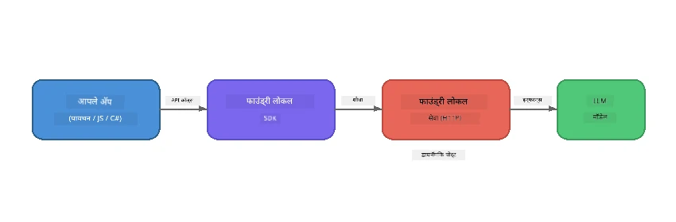

# भाग 1: Foundry Local सह सुरुवात करणे


## Foundry Local म्हणजे काय?

[Foundry Local](https://foundrylocal.ai) तुम्हाला खुले स्रोत AI भाषा मॉडेल **थेट तुमच्या संगणकावर चालवू देते** - कोणतीही इंटरनेट गरज नाही, कोणताही क्लाउड खर्च नाही, आणि पूर्ण डेटा गोपनीयता. हे:

- **मॉडेल्स स्थानिकपणे डाउनलोड आणि चालवते** हार्डवेअर ऑप्टिमायझेशनसह (GPU, CPU, किंवा NPU)
- **OpenAI-सुसंगत API पुरवते** त्यामुळे तुम्ही परिचित SDKs आणि उपकरणे वापरू शकता
- **कोणतीही Azure सदस्यता नाही जमणारी** किंवा साइन-अप नाही - फक्त इंस्टॉल करा आणि बांधणी सुरू करा

हे तुम्हाला तुमच्या संगणकावर पूर्णपणे चालणारा तुमचा स्वतःचा खासगी AI आहे असे समजा.

## शिकण्याचे उद्दिष्टे

या लॅबच्या शेवटी तुम्ही पुढील गोष्टी शिकाल:

- Foundry Local CLI तुमच्या ऑपरेटिंग सिस्टमवर कसे इंस्टॉल करायचे
- मॉडेल उपनाम म्हणजे काय आणि ते कसे कार्य करतात हे समजणे
- तुमचे पहिले स्थानिक AI मॉडेल डाउनलोड आणि चालवणे
- कमांड लाइनवरून स्थानिक मॉडेलला चॅट संदेश पाठवणे
- स्थानिक आणि क्लाउड-होस्टेड AI मॉडेल्स मधील फरक समजणे

---

## पूर्वतयारी

### प्रणाली आवश्यकताः

| आवश्यकता | किमान | शिफारस केलेले |
|-------------|---------|-------------|
| **RAM** | 8 GB | 16 GB |
| **डिस्क जागा** | 5 GB (मॉडेलसाठी) | 10 GB |
| **CPU** | 4 कोर्स | 8+ कोर्स |
| **GPU** | ऐच्छिक | NVIDIA with CUDA 11.8+ |
| **OS** | Windows 10/11 (x64/ARM), Windows Server 2025, macOS 13+ | - |

> **टीप:** Foundry Local तुमच्या हार्डवेअरसाठी सर्वोत्तम मॉडेल व्हेरिएंट आपोआप निवडते. जर तुमच्याकडे NVIDIA GPU असेल, तर CUDA त्वरण वापरते. जर Qualcomm NPU असेल, तर ते वापरते. अन्यथा ऑप्टिमायझ्ड CPU व्हेरिएंट वापरते.

### Foundry Local CLI इंस्टॉल करा

**Windows** (PowerShell):  
```powershell
winget install Microsoft.FoundryLocal
```
  
**macOS** (Homebrew):  
```bash
brew tap microsoft/foundrylocal
brew install foundrylocal
```
  
> **टीप:** सध्या Foundry Local फक्त Windows आणि macOS ला समर्थन देते. Linux सध्या समर्थित नाही.

इंस्टॉलेशन सत्यापित करा:  
```bash
foundry --version
```
  
---

## लॅबचे व्यायाम

### व्यायाम 1: उपलब्ध मॉडेल्स शोधा

Foundry Local मध्ये पूर्व-ऑप्टिमाइझ केलेल्या खुले स्रोत मॉडेल्सची सूची आहे. त्यांची यादी करा:

```bash
foundry model list
```
  
तुम्हाला खालील मॉडेल्स दिसतील:  
- `phi-3.5-mini` - मायक्रोसॉफ्टचा 3.8B पॅरामीटर मॉडेल (सुटसुटीत, चांगल्या गुणवत्तेचे)  
- `phi-4-mini` - नवीन, अधिक सक्षम Phi मॉडेल  
- `phi-4-mini-reasoning` - चेन-ऑफ-थॉट तर्कसंगत Phi मॉडेल (`<think>` टॅगसह)  
- `phi-4` - मायक्रोसॉफ्टचा सर्वात मोठा Phi मॉडेल (10.4 GB)  
- `qwen2.5-0.5b` - अतिशय लहान आणि जलद (कमी स्रोत डिव्हाइससाठी चांगले)  
- `qwen2.5-7b` - टूल-कॉलिंग समर्थनासह मजबूत सामान्य उद्देशाचा मॉडेल  
- `qwen2.5-coder-7b` - कोड जनरेशनसाठी ऑप्टिमाइझ केलेले  
- `deepseek-r1-7b` - मजबूत तर्क मॉडेल  
- `gpt-oss-20b` - मोठे खुले स्रोत मॉडेल (MIT परवाना, 12.5 GB)  
- `whisper-base` - स्पीच-टू-टेक्स्ट ट्रान्सक्रिप्शन (383 MB)  
- `whisper-large-v3-turbo` - उच्च अचूकतेचे ट्रान्सक्रिप्शन (9 GB)  

> **मॉडेल उपनाम म्हणजे काय?** `phi-3.5-mini` सारखे उपनाम म्हणजे शॉर्टकट्स. जेव्हा तुम्ही उपनाम वापरता, तेव्हा Foundry Local तुमच्या विशिष्ट हार्डवेअरसाठी सर्वोत्तम व्हेरिएंट (CUDA NVIDIA GPUs साठी, अन्यथा CPU ऑप्टिमाइझ्ड) आपोआप डाउनलोड करते. तुम्हाला योग्य व्हेरिएंट निवडण्याची काळजी करण्याची गरज नाही.

### व्यायाम 2: तुमचे पहिले मॉडेल चालवा

एका मॉडेलसह चॅट सुरू करण्यासाठी डाउनलोड करा आणि चालवा:

```bash
foundry model run phi-3.5-mini
```
  
हा प्रथम वेळ चालवताना Foundry Local:  
1. तुमचे हार्डवेअर ओळखते  
2. उत्तम मॉडेल व्हेरिएंट डाउनलोड करते (यास थोडा वेळ लागू शकतो)  
3. मॉडेल मेमरीमध्ये लोड करते  
4. एक संवादात्मक चॅट सत्र सुरू करते  

त्याला काही प्रश्न विचारा:  
```
You: What is the golden ratio?
You: Can you explain it as if I were 10 years old?
You: Write a haiku about mathematics
```
  
`exit` टाइप करा किंवा `Ctrl+C` दाबा to बाहेर पडण्यासाठी.

### व्यायाम 3: एका मॉडेलचा प्री-डाउनलोड करा

जर तुम्हाला चॅट सुरू न करता मॉडेल डाउनलोड करायचे असेल:  

```bash
foundry model download phi-3.5-mini
```
  
तुमच्या संगणकावर कोणते मॉडेल आधीपासूनच डाउनलोड केलेले आहेत ते तपासा:  

```bash
foundry cache list
```
  
### व्यायाम 4: आर्किटेक्चर समजून घ्या

Foundry Local एक **स्थानिक HTTP सेवा** म्हणून चालते जी OpenAI-सुसंगत REST API प्रदान करते. याचा म्हणजे:  

1. सेवा **डायनॅमिक पोर्टवर** सुरू होते (प्रत्येक वेळी वेगळा पोर्ट)  
2. तुम्ही SDK वापरून प्रत्यक्ष एंडपॉईंट URL शोधता  
3. तुम्ही **कोणत्याही** OpenAI-सुसंगत क्लायंट लायब्ररी वापरून बोलू शकता  



> **महत्वाचे:** Foundry Local प्रत्येक वेळेस सुरू होताना **डायनॅमिक पोर्ट** देतो. `localhost:5272` सारखे पोर्ट हार्डकोड करू नका. सद्य URL शोधण्यासाठी SDK वापरा (उदाहरणार्थ, Python मध्ये `manager.endpoint` किंवा JavaScript मध्ये `manager.urls[0]`).

---

## मुख्य मुद्दे

| संकल्पना | तुम्ही काय शिकलात |
|---------|------------------|
| ऑन-डिव्हाइस AI | Foundry Local तुमच्या डिव्हाइसमध्ये पूर्णपणे मॉडेल्स चालवते, कोणता क्लाउड, API कीज किंवा खर्च नाहीत |
| मॉडेल उपनामे | `phi-3.5-mini` सारखे उपनाम तुमच्या हार्डवेअर साठी सर्वोत्तम व्हेरिएंट आपोआप निवडतात |
| डायनॅमिक पोर्ट्स | सेवा डायनॅमिक पोर्टवर चालते; सतत एंडपॉईंट शोधण्यासाठी SDK वापरा |
| CLI आणि SDK | तुम्ही CLI (`foundry model run`) द्वारे किंवा SDK वापरून प्रोग्रामिंग पद्धतीने मॉडेल्सशी संवाद साधू शकता |

---

## पुढील पावले

[भाग 2: Foundry Local SDK दीप डायव्ह](part2-foundry-local-sdk.md) येथे जा जेणेकरून तुम्ही SDK API चे मास्टरी करू शकता जे मॉडेल्स, सेवा आणि कॅशिंग प्रोग्रामॅटिकली व्यवस्थापित करण्यासाठी आहे.

---

<!-- CO-OP TRANSLATOR DISCLAIMER START -->
**अस्वीकरण**:  
हा दस्तऐवज AI भाषांतर सेवा [Co-op Translator](https://github.com/Azure/co-op-translator) वापरून भाषांतरित केला आहे. जरी आम्ही अचूकतेसाठी प्रयत्न करत असलो तरी, कृपया लक्षात घ्या की स्वयंचलित भाषांतरांमध्ये त्रुटी किंवा असत्यता असू शकतात. मूळ दस्तऐवज त्याच्या स्थानिक भाषेत अधिकारिक स्रोत मानला जावा. महत्त्वाची माहिती साठी व्यावसायिक मानवी भाषांतर शिफारस केली जाते. या भाषांतराचा वापर केल्यामुळे होणाऱ्या कोणत्याही गैरसमजुती किंवा चुकीच्या समजुतीसाठी आम्ही जबाबदार नाही.
<!-- CO-OP TRANSLATOR DISCLAIMER END -->