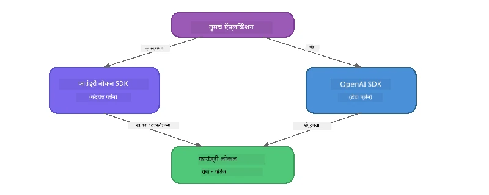

# भाग 3: OpenAI सह Foundry Local SDK वापरणे

## आढावा

भाग 1 मध्ये तुम्ही Foundry Local CLI वापरून मॉडेल्स संवादात्मकपणे चालवले. भाग 2 मध्ये तुम्ही पूर्ण SDK API पृष्ठभाग शोधला. आता तुम्ही SDK आणि OpenAI-योग्य API वापरून **तुमच्या अ‍ॅप्लिकेशन्समध्ये Foundry Local एकत्रित करण्यास** शिकाल.

Foundry Local तीन भाषांसाठी SDK प्रदान करते. तुम्हाला सर्वात सोईस्कर असलेली भाषा निवडा - सर्वांमध्ये संकल्पना सारख्या आहेत.

## शिका उद्दिष्टे

या प्रयोगशाळेच्या शेवटी, तुम्ही खालील गोष्टी करू शकाल:

- तुमच्या भाषेसाठी Foundry Local SDK स्थापित करा (Python, JavaScript, किंवा C#)
- सेवेस सुरू करण्यासाठी `FoundryLocalManager` आरंभ करा, कॅश तपासा, डाउनलोड करा, आणि मॉडेल लोड करा
- OpenAI SDK वापरून स्थानिक मॉडेलशी कनेक्ट करा
- संवाद पूर्णता पाठवा आणि प्रवाह प्रतिसाद हाताळा
- डायनामिक पोर्ट आर्किटेक्चर समजून घ्या

---

## पूर्वअटी

आधी [भाग 1: Foundry Local सह सुरूवात](part1-getting-started.md) आणि [भाग 2: Foundry Local SDK सखोल अभ्यास](part2-foundry-local-sdk.md) पूर्ण करा.

खालीलपैकी **एक** भाषा रनटाइम स्थापित करा:
- **Python 3.9+** - [python.org/downloads](https://www.python.org/downloads/)
- **Node.js 18+** - [nodejs.org](https://nodejs.org/)
- **.NET 9.0+** - [dot.net/download](https://dotnet.microsoft.com/download)

---

## संकल्पना: SDK कसे कार्य करते

Foundry Local SDK **कंट्रोल प्लेन** (सेवा सुरू करणे, मॉडेल डाउनलोड करणे) हाताळते, तर OpenAI SDK **डेटा प्लेन** (प्रॉम्प्ट पाठवणे, पूर्णता प्राप्त करणे) हाताळते.



---

## प्रयोगशाळा सराव

### सराव 1: तुमचे पर्यावरण सेटअप करा

<details>
<summary><b>🐍 Python</b></summary>

```bash
cd python
python -m venv venv

# आभासी वातावरण सक्रिय करा:
# विंडोज (पॉवरशेल):
venv\Scripts\Activate.ps1
# विंडोज (कमांड प्रॉम्प्ट):
venv\Scripts\activate.bat
# मॅकओएस:
source venv/bin/activate

pip install -r requirements.txt
```

`requirements.txt` खालील गोष्टी स्थापित करतो:
- `foundry-local-sdk` - Foundry Local SDK (आयात केलेले `foundry_local` म्हणून)
- `openai` - OpenAI Python SDK
- `agent-framework` - Microsoft Agent Framework (नंतरच्या भागांमध्ये वापरले जाते)

</details>

<details>
<summary><b>📘 JavaScript</b></summary>

```bash
cd javascript
npm install
```

`package.json` खालील गोष्टी स्थापित करतो:
- `foundry-local-sdk` - Foundry Local SDK
- `openai` - OpenAI Node.js SDK

</details>

<details>
<summary><b>💜 C#</b></summary>

```bash
cd csharp
dotnet restore
dotnet build
```

`csharp.csproj` मध्ये वापरले जाते:
- `Microsoft.AI.Foundry.Local` - Foundry Local SDK (NuGet)
- `OpenAI` - OpenAI C# SDK (NuGet)

> **प्रोजेक्ट स्ट्रक्चर:** C# प्रोजेक्टमध्ये `Program.cs` मध्ये कमांड-लाइन राऊटर आहे जो वेगवेगळ्या उदाहरण फाइल्सना पाठवतो. यासाठी `dotnet run chat` (किंवा फक्त `dotnet run`) चालवा. इतर भागांसाठी `dotnet run rag`, `dotnet run agent`, आणि `dotnet run multi` वापरा.

</details>

---

### सराव 2: मूलभूत संवाद पूर्णता

तुमच्या भाषेसाठी मूळ संवाद उदाहरण उघडा आणि कोड तपासा. प्रत्येक स्क्रिप्ट खालील तीन टप्पे वापरते:

1. **सेवा सुरू करा** - `FoundryLocalManager` Foundry Local रनटाईम सुरू करतो
2. **मॉडेल डाउनलोड व लोड करा** - कॅश तपासा, आवश्यक असल्यास डाउनलोड करा, नंतर मेमरीत लोड करा
3. **OpenAI क्लायंट तयार करा** - स्थानिक एन्डपॉइंटशी कनेक्ट करा आणि प्रवाही संवाद पूर्णता पाठवा

<details>
<summary><b>🐍 Python - <code>python/foundry-local.py</code></b></summary>

```python
import sys
import openai
from foundry_local import FoundryLocalManager

alias = "phi-3.5-mini"

# पायरी 1: FoundryLocalManager तयार करा आणि सेवा सुरू करा
print("Starting Foundry Local service...")
manager = FoundryLocalManager()
manager.start_service()

# पायरी 2: तपासा की मॉडेल आधीच डाउनलोड झाले आहे का
cached = manager.list_cached_models()
catalog_info = manager.get_model_info(alias)
is_cached = any(m.id == catalog_info.id for m in cached) if catalog_info else False

if is_cached:
    print(f"Model already downloaded: {alias}")
else:
    print(f"Downloading model: {alias} (this may take several minutes)...")
    manager.download_model(alias)
    print(f"Download complete: {alias}")

# पायरी 3: मॉडेल मेमरीमध्ये लोड करा
print(f"Loading model: {alias}...")
manager.load_model(alias)

# स्थानिक Foundry सेवेकडे निर्देशित करणारा OpenAI क्लायंट तयार करा
client = openai.OpenAI(
    base_url=manager.endpoint,   # डायनॅमिक पोर्ट - कधीही हार्डकोड करू नका!
    api_key=manager.api_key
)

# स्ट्रीमिंग चॅट पूर्णता तयार करा
stream = client.chat.completions.create(
    model=manager.get_model_info(alias).id,
    messages=[{"role": "user", "content": "What is the golden ratio?"}],
    stream=True,
)

for chunk in stream:
    if chunk.choices[0].delta.content is not None:
        print(chunk.choices[0].delta.content, end="", flush=True)
print()
```

**ते चालवा:**
```bash
python foundry-local.py
```

</details>

<details>
<summary><b>📘 JavaScript - <code>javascript/foundry-local.mjs</code></b></summary>

```javascript
import { OpenAI } from "openai";
import { FoundryLocalManager } from "foundry-local-sdk";

const alias = "phi-3.5-mini";

// टप्पा 1: Foundry Local सेवा सुरू करा
console.log("Starting Foundry Local service...");
FoundryLocalManager.create({ appName: "FoundryLocalWorkshop" });
const manager = FoundryLocalManager.instance;
await manager.startWebService();

// टप्पा 2: तपासा की मॉडेल आधीच डाउनलोड झाले आहे का
const catalog = manager.catalog;
const model = await catalog.getModel(alias);

if (model.isCached) {
  console.log(`Model already downloaded: ${alias}`);
} else {
  console.log(`Downloading model: ${alias} (this may take several minutes)...`);
  await model.download();
  console.log(`Download complete: ${alias}`);
}

// टप्पा 3: मॉडेल मेमरीमध्ये लोड करा
console.log(`Loading model: ${alias}...`);
await model.load();
console.log(`Model loaded: ${model.id}`);

// LOCAL Foundry सेवेकडे निर्देश करणारा OpenAI क्लायंट तयार करा
const client = new OpenAI({
  baseURL: manager.urls[0] + "/v1",   // डायनॅमिक पोर्ट - कधीही हार्डकोड करू नका!
  apiKey: "foundry-local",
});

// स्ट्रिमिंग चॅट पूर्णता तयार करा
const stream = await client.chat.completions.create({
  model: model.id,
  messages: [{ role: "user", content: "What is the golden ratio?" }],
  stream: true,
});

for await (const chunk of stream) {
  if (chunk.choices[0]?.delta?.content) {
    process.stdout.write(chunk.choices[0].delta.content);
  }
}
console.log();
```

**ते चालवा:**
```bash
node foundry-local.mjs
```

</details>

<details>
<summary><b>💜 C# - <code>csharp/BasicChat.cs</code></b></summary>

```csharp
using Microsoft.AI.Foundry.Local;
using Microsoft.Extensions.Logging.Abstractions;
using OpenAI;
using OpenAI.Chat;
using System.ClientModel;

var alias = "phi-3.5-mini";

// Step 1: Start the Foundry Local service
Console.WriteLine("Starting Foundry Local service...");
await FoundryLocalManager.CreateAsync(
    new Configuration
    {
        AppName = "FoundryLocalSamples",
        Web = new Configuration.WebService { Urls = "http://127.0.0.1:0" }
    }, NullLogger.Instance, default);
var manager = FoundryLocalManager.Instance;
await manager.StartWebServiceAsync(default);

// Step 2: Get the model from the catalog
var catalog = await manager.GetCatalogAsync(default);
var model = await catalog.GetModelAsync(alias, default);

// Step 3: Check if the model is already downloaded
var isCached = await model.IsCachedAsync(default);

if (isCached)
{
    Console.WriteLine($"Model already downloaded: {alias}");
}
else
{
    Console.WriteLine($"Downloading model: {alias} (this may take several minutes)...");
    await model.DownloadAsync(null, default);
    Console.WriteLine($"Download complete: {alias}");
}

// Step 4: Load the model into memory
Console.WriteLine($"Loading model: {alias}...");
await model.LoadAsync(default);
Console.WriteLine($"Loaded model: {model.Id}");
Console.WriteLine($"Endpoint: {manager.Urls[0]}");

// Create OpenAI client pointing to the LOCAL Foundry service
var key = new ApiKeyCredential("foundry-local");
var client = new OpenAIClient(key, new OpenAIClientOptions
{
    Endpoint = new Uri(manager.Urls[0] + "/v1")  // Dynamic port - never hardcode!
});

var chatClient = client.GetChatClient(model.Id);

// Stream a chat completion
var completionUpdates = chatClient.CompleteChatStreaming("What is the golden ratio?");

foreach (var update in completionUpdates)
{
    if (update.ContentUpdate.Count > 0)
    {
        Console.Write(update.ContentUpdate[0].Text);
    }
}
Console.WriteLine();
```

**ते चालवा:**
```bash
dotnet run chat
```

</details>

---

### सराव 3: प्रॉम्प्टसह प्रयोग करा

तुमचे मूलभूत उदाहरण चालू असल्यावर, कोड बदलून पहा:

1. **युजर मेसेज बदला** - वेगवेगळी प्रश्न विचारा
2. **सिस्टम प्रॉम्प्ट जोडा** - मॉडेलला एक व्यक्तिमत्व द्या
3. **स्ट्रीमिंग बंद करा** - `stream=False` सेट करा आणि संपूर्ण प्रतिसाद एकदा छापा
4. **वेगळा मॉडेल वापरून पहा** - `phi-3.5-mini` ऐवजी `foundry model list` मधले दुसरे मॉडेल वापरा

<details>
<summary><b>🐍 Python</b></summary>

```python
# एक सिस्टम प्रॉम्प्ट जोडा - मॉडेलला एक व्यक्तिमत्व द्या:
stream = client.chat.completions.create(
    model=manager.get_model_info(alias).id,
    messages=[
        {"role": "system", "content": "You are a pirate. Answer everything in pirate speak."},
        {"role": "user", "content": "What is the golden ratio?"}
    ],
    stream=True,
)

# किंवा स्ट्रीमिंग बंद करा:
response = client.chat.completions.create(
    model=manager.get_model_info(alias).id,
    messages=[{"role": "user", "content": "What is the golden ratio?"}],
    stream=False,
)
print(response.choices[0].message.content)
```

</details>

<details>
<summary><b>📘 JavaScript</b></summary>

```javascript
// सिस्टम प्रॉम्प्ट जोडा - मॉडेलला एक व्यक्तिमत्व द्या:
const stream = await client.chat.completions.create({
  model: modelInfo.id,
  messages: [
    { role: "system", content: "You are a pirate. Answer everything in pirate speak." },
    { role: "user", content: "What is the golden ratio?" },
  ],
  stream: true,
});

// किंवा स्ट्रीमिंग बंद करा:
const response = await client.chat.completions.create({
  model: modelInfo.id,
  messages: [{ role: "user", content: "What is the golden ratio?" }],
  stream: false,
});
console.log(response.choices[0].message.content);
```

</details>

<details>
<summary><b>💜 C#</b></summary>

```csharp
// Add a system prompt - give the model a persona:
var completionUpdates = chatClient.CompleteChatStreaming(
    new ChatMessage[]
    {
        new SystemChatMessage("You are a pirate. Answer everything in pirate speak."),
        new UserChatMessage("What is the golden ratio?")
    }
);

// Or turn off streaming:
var response = chatClient.CompleteChat("What is the golden ratio?");
Console.WriteLine(response.Value.Content[0].Text);
```

</details>

---

### SDK पद्धत संदर्भ

<details>
<summary><b>🐍 Python SDK पद्धती</b></summary>

| पद्धत | उद्दिष्ट |
|--------|---------|
| `FoundryLocalManager()` | व्यवस्थापक उदाहरण तयार करा |
| `manager.start_service()` | Foundry Local सेवा सुरू करा |
| `manager.list_cached_models()` | तुमच्या डिव्हाइसवर डाउनलोड झालेले मॉडेल्स यादीत दाखवा |
| `manager.get_model_info(alias)` | मॉडेल आयडी आणि मेटाडेटा मिळवा |
| `manager.download_model(alias, progress_callback=fn)` | प्रगती फंक्शनसह मॉडेल डाउनलोड करा |
| `manager.load_model(alias)` | मॉडेल मेमरीत लोड करा |
| `manager.endpoint` | डायनामिक एन्डपॉइंट URL मिळवा |
| `manager.api_key` | API की मिळवा (स्थानिकसाठी प्लेसहोल्डर) |

</details>

<details>
<summary><b>📘 JavaScript SDK पद्धती</b></summary>

| पद्धत | उद्दिष्ट |
|--------|---------|
| `FoundryLocalManager.create({ appName })` | व्यवस्थापक उदाहरण तयार करा |
| `FoundryLocalManager.instance` | सिंगलटन व्यवस्थापक मिळवा |
| `await manager.startWebService()` | Foundry Local सेवा सुरू करा |
| `await manager.catalog.getModel(alias)` | कॅटलॉगमधून मॉडेल मिळवा |
| `model.isCached` | मॉडेल आधीच डाउनलोड आहे का तपासा |
| `await model.download()` | मॉडेल डाउनलोड करा |
| `await model.load()` | मॉडेल मेमरीत लोड करा |
| `model.id` | OpenAI API कॉलसाठी मॉडेल आयडी मिळवा |
| `manager.urls[0] + "/v1"` | डायनामिक एन्डपॉइंट URL मिळवा |
| `"foundry-local"` | API की (स्थानिकसाठी) |

</details>

<details>
<summary><b>💜 C# SDK पद्धती</b></summary>

| पद्धत | उद्दिष्ट |
|--------|---------|
| `FoundryLocalManager.CreateAsync(config)` | व्यवस्थापक तयार व प्रारंभ करा |
| `manager.StartWebServiceAsync()` | Foundry Local वेब सेवा सुरू करा |
| `manager.GetCatalogAsync()` | मॉडेल कॅटलॉग मिळवा |
| `catalog.ListModelsAsync()` | उपलब्ध सर्व मॉडेल्स यादीत दाखवा |
| `catalog.GetModelAsync(alias)` | एखाद्या मॉडेलची माहिती मिळवा |
| `model.IsCachedAsync()` | मॉडेल डाउनलोड आहे का तपासा |
| `model.DownloadAsync()` | मॉडेल डाउनलोड करा |
| `model.LoadAsync()` | मॉडेल मेमरीत लोड करा |
| `manager.Urls[0]` | डायनामिक एन्डपॉइंट URL मिळवा |
| `new ApiKeyCredential("foundry-local")` | स्थानिक API की क्रेडेन्शियल |

</details>

---

### सराव 4: नेटिव ChatClient वापरणे (OpenAI SDK ऐवजी पर्याय)

सराव 2 आणि 3 मध्ये तुम्ही OpenAI SDK वापरला आहे. JavaScript आणि C# SDK मध्ये **नेटिव ChatClient** सुद्धा आहे ज्यामुळे OpenAI SDK वापरण्याची गरज नाहीशी होते.

<details>
<summary><b>📘 JavaScript - <code>model.createChatClient()</code></b></summary>

```javascript
import { FoundryLocalManager } from "foundry-local-sdk";

const alias = "phi-3.5-mini";

FoundryLocalManager.create({ appName: "ChatClientDemo" });
const manager = FoundryLocalManager.instance;
await manager.startWebService();

const model = await manager.catalog.getModel(alias);
if (!model.isCached) await model.download();
await model.load();

// OpenAI आयात करण्याची गरज नाही — मॉडेलमधून थेट क्लायंट मिळवा
const chatClient = model.createChatClient();

// नॉन-स्ट्रीमिंग पूर्णता
const response = await chatClient.completeChat([
  { role: "system", content: "You are a pirate. Answer everything in pirate speak." },
  { role: "user", content: "What is the golden ratio?" }
]);
console.log(response.choices[0].message.content);

// स्ट्रीमिंग पूर्णता (कॉलबॅक पॅटर्न वापरते)
await chatClient.completeStreamingChat(
  [{ role: "user", content: "What is the golden ratio?" }],
  (chunk) => {
    if (chunk.choices?.[0]?.delta?.content) {
      process.stdout.write(chunk.choices[0].delta.content);
    }
  }
);
console.log();
```

> **टीप:** ChatClient चा `completeStreamingChat()` हे **कॉलबॅक** स्वरूपात आहे, async iterator नाही. दुसऱ्या अर्ग्युमेंट म्हणून फंक्शन द्या.

</details>

<details>
<summary><b>💜 C# - <code>model.GetChatClientAsync()</code></b></summary>

```csharp
var catalog = await manager.GetCatalogAsync(default);
var model = await catalog.GetModelAsync("phi-3.5-mini", default);
if (!await model.IsCachedAsync(default))
    await model.DownloadAsync(null, default);
await model.LoadAsync(default);

// No OpenAI NuGet needed — get a client directly from the model
var chatClient = await model.GetChatClientAsync(default);

// Use it like a standard OpenAI ChatClient
var response = chatClient.CompleteChat("What is the golden ratio?");
Console.WriteLine(response.Value.Content[0].Text);
```

</details>

> **कधी काय वापरावे:**
> | पद्धत | योग्य ठिकाण |
> |----------|----------|
> | OpenAI SDK | पूर्ण पॅरामीटर नियंत्रण, उत्पादन अ‍ॅप्स, विद्यमान OpenAI कोड |
> | नेटिव ChatClient | जलद प्रोटोटायपिंग, कमी अवलंबित्व, सोपी सेटअप |

---

## महत्वाच्या गोष्टी

| संकल्पना | तुम्ही काय शिकलात |
|---------|------------------|
| कंट्रोल प्लेन | Foundry Local SDK सेवा सुरू करणे आणि मॉडेल लोड करणे हाताळतो |
| डेटा प्लेन | OpenAI SDK संवाद पूर्णता आणि प्रवाह हाताळतो |
| डायनामिक पोर्ट्स | SDK वापरून नेहमी एन्डपॉइंट शोधा; URLs हार्डकोड करू नका |
| क्रॉस-भाषा | Python, JavaScript, आणि C# मध्ये सारखा कोड नमुना वापरू शकतो |
| OpenAI सुसंगतता | पूर्ण OpenAI API सुसंगतता म्हणजे विद्यमान OpenAI कोड थोडक्यात बदलाने चालतो |
| नेटिव ChatClient | `createChatClient()` (JS) / `GetChatClientAsync()` (C#) OpenAI SDK चा पर्याय देतो |

---

## पुढील पावले

[भाग 4: RAG अ‍ॅप्लिकेशन तयार करणे](part4-rag-fundamentals.md) येथे सुरू ठेवा आणि पूर्णपणे तुमच्या डिव्हाइसवर चालणारी रिट्रीव्हल-ऑगमेंटेड जनरेशन पाईपलाइन कशी तयार करायची हे शिका.

---

<!-- CO-OP TRANSLATOR DISCLAIMER START -->
**अस्वीकरण**:
हा दस्तऐवज AI भाषांतर सेवा [Co-op Translator](https://github.com/Azure/co-op-translator) वापरून भाषांतरित केला आहे. आम्ही अचूकतेसाठी प्रयत्नशील असलो तरी, कृपया लक्षात ठेवा की स्वयंचलित भाषांतरांमध्ये चुका किंवा अचूकतेच्या त्रुटी असू शकतात. मूळ दस्तऐवज त्याच्या मूळ भाषेत अधिकृत स्रोत मानला जावा. महत्त्वाच्या माहितीसाठी, व्यावसायिक मानवी भाषांतराची शिफारस केली जाते. या भाषांतराचा वापर करून झालेल्या कोणत्याही गैरसमजुतींसाठी किंवा चुकीच्या अर्थनिर्देशांसाठी आम्ही जबाबदार नाही.
<!-- CO-OP TRANSLATOR DISCLAIMER END -->