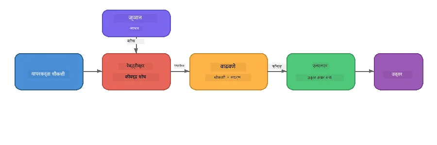

# भाग 4: Foundry Local सह RAG अनुप्रयोग तयार करणे

## आढावा

मोठे भाषा मॉडेल्स शक्तिशाली आहेत, परंतु त्यांना फक्त त्यांच्या प्रशिक्षण डेटामध्ये जे काही होते तेच माहित असते. **रिट्रिव्हल-ऑगमेंटेड जनरेशन (RAG)** हे या समस्येचे निराकरण करते, मॉडेलला क्वेरी वेळेस संबंधित संदर्भ देते - तुमच्या स्वतःच्या दस्तऐवज, डेटाबेस किंवा ज्ञानाधारेमधून काढलेले.

या प्रकल्पात तुम्ही Foundry Local वापरून पूर्णपणे तुमच्या उपकरणावर चालणारी RAG पाइपलाइन तयार कराल. कोणतीही क्लाउड सेवा नाही, कोणतेही वेक्टर डेटाबेस नाही, कोणतेही एम्बेडिंग्स API नाही - फक्त स्थानिक रिट्रिव्हल आणि स्थानिक मॉडेल.

## शिक्षण उद्दिष्टे

या प्रकल्पाच्या शेवटी तुम्ही सक्षम असाल:

- RAG काय आहे आणि AI अनुप्रयोगांसाठी का महत्त्वाचे आहे हे समजावून सांगणे
- मजकूर दस्तऐवजांमधून स्थानिक ज्ञानाधारा तयार करणे
- संबंधित संदर्भ शोधण्यासाठी सोपा रिट्रिव्हल फंक्शन अंमलात आणणे
- परत मिळवलेल्या तथ्यांवर आधारित सिस्टम प्रॉम्प्ट तयार करणे
- पूर्ण Retrieve → Augment → Generate पाइपलाइन उपकरणावर चालवणे
- साध्या कीवर्ड रिट्रिव्हल आणि वेक्टर शोध यामधील व्यवहार समजून घेणे

---

## पूर्वअट

- पूर्ण करा [भाग 3: Foundry Local SDK सह OpenAI वापरणे](part3-sdk-and-apis.md)
- Foundry Local CLI इन्स्टॉल करा आणि `phi-3.5-mini` मॉडेल डाउनलोड करा

---

## संकल्पना: RAG म्हणजे काय?

RAG शिवाय, LLM फक्त आपल्या प्रशिक्षण डेटावरून उत्तरे देऊ शकतो - जे कदाचित जुने, अपूर्ण किंवा तुमची खासगी माहिती नसलेले असू शकते:

```
User: "What is Zava's return policy?"
LLM:  "I do not have information about Zava's return policy."  ← No context!
```

RAG सह, तुम्ही प्रथम संबंधित दस्तऐवज **retrieve** करता, नंतर त्या संदर्भाने प्रॉम्प्ट **augment** करता आणि नंतर प्रतिसाद **generate** करता:



महत्वाचा मुद्दा: **मॉडेलला "उत्तर माहित" असण्याची गरज नाही; त्याला फक्त योग्य दस्तऐवज वाचण्याची गरज आहे.**

---

## प्रयोगशाळेतील व्यायाम

### व्यायाम 1: ज्ञानाधारेची कल्पना प्राप्त करा

तुमच्या भाषेसाठी RAG उदाहरण उघडा आणि ज्ञानाधारेची तपासणी करा:

<details>
<summary><b>🐍 Python: <code>python/foundry-local-rag.py</code></b></summary>

ज्ञानाधारा म्हणजे `title` आणि `content` फील्डसह डिक्शनरींची साधी यादी आहे:

```python
KNOWLEDGE_BASE = [
    {
        "title": "Foundry Local Overview",
        "content": (
            "Foundry Local brings the power of Azure AI Foundry to your local "
            "device without requiring an Azure subscription..."
        ),
    },
    {
        "title": "Supported Hardware",
        "content": (
            "Foundry Local automatically selects the best model variant for "
            "your hardware. If you have an Nvidia CUDA GPU it downloads the "
            "CUDA-optimized model..."
        ),
    },
    # ... अजून नोंदी
]
```

प्रत्येक नोंद ज्ञानाचा "चंक" दर्शवते - एखाद्या विषयावर लक्ष केंद्रित केलेली माहिती.

</details>

<details>
<summary><b>📘 JavaScript: <code>javascript/foundry-local-rag.mjs</code></b></summary>

ज्ञानाधारा ऑब्जेक्ट्सच्या सारख्या यादीचा वापर करते:

```javascript
const KNOWLEDGE_BASE = [
  {
    title: "Foundry Local Overview",
    content:
      "Foundry Local brings the power of Azure AI Foundry to your local " +
      "device without requiring an Azure subscription...",
  },
  {
    title: "Supported Hardware",
    content:
      "Foundry Local automatically selects the best model variant for " +
      "your hardware...",
  },
  // ... अधिक नोंदी
];
```

</details>

<details>
<summary><b>💜 C#: <code>csharp/RagPipeline.cs</code></b></summary>

ज्ञानाधारा नावांकित टुपल्सची यादी वापरते:

```csharp
private static readonly List<(string Title, string Content)> KnowledgeBase =
[
    ("Foundry Local Overview",
     "Foundry Local brings the power of Azure AI Foundry to your local " +
     "device without requiring an Azure subscription..."),

    ("Supported Hardware",
     "Foundry Local automatically selects the best model variant for " +
     "your hardware..."),

    // ... more entries
];
```

</details>

> **खऱ्या अनुप्रयोगात**, ज्ञानाधारा फाइल्स, डेटाबेस, शोध निर्देशांक किंवा API कडून येते. या प्रकल्पासाठी, सोप्या पद्धतीने इन-मेमरी यादी वापरली आहे.

---

### व्यायाम 2: रिट्रिव्हल फंक्शन समजून घ्या

रिट्रिव्हल चरण वापरकर्त्याच्या प्रश्नासाठी सर्वात संबंधित चंक्स शोधते. या उदाहरणात **कीवर्ड ओव्हरलॅप** वापरले आहे - क्वेरीतले किती शब्द प्रत्येक चंकमध्ये आहेत हे मोजणे:

<details>
<summary><b>🐍 Python</b></summary>

```python
def retrieve(query: str, top_k: int = 2) -> list[dict]:
    """Return the top-k knowledge chunks most relevant to the query."""
    query_words = set(query.lower().split())
    scored = []
    for chunk in KNOWLEDGE_BASE:
        chunk_words = set(chunk["content"].lower().split())
        overlap = len(query_words & chunk_words)
        scored.append((overlap, chunk))
    scored.sort(key=lambda x: x[0], reverse=True)
    return [item[1] for item in scored[:top_k]]
```

</details>

<details>
<summary><b>📘 JavaScript</b></summary>

```javascript
function retrieve(query, topK = 2) {
  const queryWords = new Set(query.toLowerCase().split(/\s+/));
  const scored = KNOWLEDGE_BASE.map((chunk) => {
    const chunkWords = new Set(chunk.content.toLowerCase().split(/\s+/));
    let overlap = 0;
    for (const w of queryWords) {
      if (chunkWords.has(w)) overlap++;
    }
    return { overlap, chunk };
  });
  scored.sort((a, b) => b.overlap - a.overlap);
  return scored.slice(0, topK).map((s) => s.chunk);
}
```

</details>

<details>
<summary><b>💜 C#</b></summary>

```csharp
private static List<(string Title, string Content)> Retrieve(string query, int topK = 2)
{
    var queryWords = new HashSet<string>(
        query.ToLowerInvariant().Split(' ', StringSplitOptions.RemoveEmptyEntries));

    return KnowledgeBase
        .Select(chunk =>
        {
            var chunkWords = new HashSet<string>(
                chunk.Content.ToLowerInvariant().Split(' ', StringSplitOptions.RemoveEmptyEntries));
            var overlap = queryWords.Intersect(chunkWords).Count();
            return (Overlap: overlap, Chunk: chunk);
        })
        .OrderByDescending(x => x.Overlap)
        .Take(topK)
        .Select(x => x.Chunk)
        .ToList();
}
```

</details>

**कार्यप्रणाली:**
1. क्वेरी वेगळ्या शब्दांमध्ये विभागा
2. प्रत्येक ज्ञान चंकमध्ये क्वेरी शब्द किती आहेत ते मोजा
3. ओव्हरलॅप स्कोअर नुसार (मोठ्या पासून लहान) क्रमवारी लावा
4. सर्वाधिक संबंधित टॉप-k चंक्स परत करा

> **व्यवहार:** कीवर्ड ओव्हरलॅप सोपा पण मर्यादित आहे; तो समानार्थी किंवा अर्थ समजू शकत नाही. प्रॉडक्शन RAG सिस्टम्स सामान्यतः **एम्बेडिंग वेक्टर** आणि **वेक्टर डेटाबेस** वापरतात. तरीही, कीवर्ड ओव्हरलॅप एक चांगला प्रारंभ आहे आणि कोणत्याही अतिरिक्त निर्भरता शिवाय चालतो.

---

### व्यायाम 3: ऑगमेंटेड प्रॉम्प्ट समजून घ्या

परत मिळालेला संदर्भ मॉडेलकडे पाठवण्यापूर्वी **सिस्टम प्रॉम्प्ट** मध्ये घातला जातो:

```python
system_prompt = (
    "You are a helpful assistant. Answer the user's question using ONLY "
    "the information provided in the context below. If the context does "
    "not contain enough information, say so.\n\n"
    f"Context:\n{context_text}"
)
```

महत्वाचे डिझाइन निर्णय:
- **"फक्त पुरवलेली माहिती वापरा"** - संदर्भात नसलेल्या तथ्यांची मॉडेलने कल्पना करू नये
- **"पुरेशी माहिती नसेल तर तसंच सांगा"** - प्रामाणिक "मला माहिती नाही" अशी उत्तरे प्रोत्साहित करते
- संदर्भ सिस्टम मेसेजमध्ये आहे त्यामुळे सर्व उत्तरे त्यावर आधारित असतात

---

### व्यायाम 4: RAG पाइपलाइन चालवा

पूर्ण उदाहरण चालवा:

**Python:**
```bash
cd python
python foundry-local-rag.py
```

**JavaScript:**
```bash
cd javascript
node foundry-local-rag.mjs
```

**C#:**
```bash
cd csharp
dotnet run rag
```

तुम्हाला तीन गोष्टी प्रिंट झालेल्या दिसणार:
1. **प्रश्न** जे विचारले जात आहे
2. **परत मिळालेला संदर्भ** - ज्ञानाधारेमधून निवडलेले चंक्स
3. **उत्तर** - फक्त त्या संदर्भाचा वापर करून मॉडेलने तयार केलेले

उदाहरण आउटपुट:
```
Question: How do I install Foundry Local and what hardware does it support?

--- Retrieved Context ---
### Installation
On Windows install Foundry Local with: winget install Microsoft.FoundryLocal...

### Supported Hardware
Foundry Local automatically selects the best model variant for your hardware...
-------------------------

Answer: To install Foundry Local, you can use the following methods depending
on your operating system: On Windows, run `winget install Microsoft.FoundryLocal`.
On macOS, use `brew install microsoft/foundrylocal/foundrylocal`...
```

मॉडेलचं उत्तर परत मिळालेल्या संदर्भावर आधारित आहे हे लक्षात घ्या - फक्त ज्ञानाधारेतील तथ्यांचा उल्लेख.

---

### व्यायाम 5: प्रयोग करा आणि विस्तार करा

तुमच्या समजुतीसाठी खालील बदल करा:

1. **प्रश्न बदला** - ज्ञानाधार्यात असलेला प्रश्न विचारा आणि नसेल असा प्रश्न देखील विचारा:
   ```python
   question = "What programming languages does Foundry Local support?"  # ← संदर्भात
   question = "How much does Foundry Local cost?"                       # ← संदर्भात नाही
   ```
   उत्तर संदर्भात नसेल तर मॉडेल योग्यरित्या "मला माहिती नाही" म्हणतं का?

2. **नवीन ज्ञान चंक जोडा** - `KNOWLEDGE_BASE` मध्ये नवीन नोंद जोडा:
   ```python
   {
       "title": "Pricing",
       "content": "Foundry Local is completely free and open source under the MIT license.",
   }
   ```
   मग किंमत विचारणारा प्रश्न पुन्हा विचारा.

3. **`top_k` बदला** - अधिक किंवा कमी चंक्स परत मिळवा:
   ```python
   context_chunks = retrieve(question, top_k=3)  # अधिक संदर्भ
   context_chunks = retrieve(question, top_k=1)  # कमी संदर्भ
   ```
   संदर्भाच्या प्रमाणाने उत्तराचा दर्जा कसा प्रभावित होतो?

4. **ग्राउंडिंग सूचना काढा** - सिस्टम प्रॉम्प्ट फक्त "तुम्ही एक मदत करणारा सहाय्यक आहात." असा करा आणि पाहा की मॉडेल तथ्य घडामोड करू लागते का.

---

## सखोल माहिती: ऑन-डिव्हाइस कामगिरीसाठी RAG चे ऑप्टिमायझेशन

ऑन-डिव्हाइस RAG चालवताना क्लाउडपेक्षा जास्त बंधने असतात: मर्यादित RAM, GPU नसणे (CPU/NPU चालना), आणि लहान मॉडेल संदर्भ विंडो. खालील डिझाइन निर्णय या बंधनांना थेट संबोधित करतात आणि Foundry Local सह तयार केलेल्या उत्पादन-शैली स्थानिक RAG अनुप्रयोगांवर आधारित आहेत.

### चंकिंग धोरण: निश्चित आकाराचा स्लायडिंग विंडो

चंकिंग - दस्तऐवजांचे तुकडे कसे करायचे हे कोणत्याही RAG प्रणालीतील एक महत्त्वाचा निर्णय आहे. ऑन-डिव्हाइस परिस्थितीसाठी, **जोडणीसह निश्चित आकाराचा स्लायडिंग विंडो** हा शिफारस केलेला प्रारंभ आहे:

| परिमाण | शिफारस केलेले मूल्य | का |
|--------|----------------------|----|
| **चंक आकार** | ~200 टोकन्स | परत मिळालेला संदर्भ कॉम्पॅक्ट ठेवतो, Phi-3.5 Mini च्या संदर्भ विंडोसाठी जागा ठेवतो - सिस्टम प्रॉम्प्ट, संभाषण इतिहास, आणि तयार उत्तरासाठी |
| **ओव्हरलॅप** | ~25 टोकन्स (12.5%) | चंक सीमारेषांवर माहिती गहाण होऊ नये - प्रक्रियांसाठी आणि टप्प्याटप्प्याने सूचना देण्यासाठी महत्त्वाचे |
| **टोकनायझेशन** | व्हाइटस्पेस स्प्लिट | शून्य निर्भरता, कोणत्याही टोकनायझर लायब्ररीची गरज नाही. सर्व संगणना LLM कडेच राहते |

ओव्हरलॅप स्लायडिंग विंडोप्रमाणे काम करते: प्रत्येक नवीन चंक मागील चंकिन्या समाप्तीपूर्वी 25 टोकन्स अगोदर सुरू होतो, ज्यामुळे boundary साठी वाक्ये दोन्ही चंक्समध्ये दिसतात.

> **इतर धोरणे का नाही?**
> - *वाक्य-आधारित विभाजने* अनपेक्षित चंक आकार निर्माण करतात; काही सुरक्षा प्रक्रियांचे एकच लांब वाक्य असते ज्याचं नीट विभाजन होणार नाही
> - *विभाग-अनुरूप विभाजने* (`##` शीर्षकांवर) फार वेगवेगळे चंक आकार निर्माण करतात - काही फार लहान, तर काही फार मोठे संदर्भ विंडोसाठी
> - *सामंटिक चंकिंग* (एम्बेडिंग-आधारित विषय शोध) सर्वोत्तम रिट्रिव्हल गुणवत्ता देते, पण Phi-3.5 Mini सोबत दुसरे मॉडेल मेमरीमध्ये ठेवणे आवश्यक आहे - 8-16 GB शेअर्ड मेमरी असलेल्या हार्डवेअरवर धोका

### रिट्रिव्हल वाढवा: TF-IDF वेक्टर

या प्रकल्पात कीवर्ड ओव्हरलॅप वापरले आहे, पण तुम्हाला एम्बेडिंग मॉडेल जोडल्याशिवाय चांगले रिट्रिव्हल हवे असल्यास, **TF-IDF (टर्म फ्रिक्वेंसी-इन्व्हर्स डॉक्युमेंट फ्रिक्वेंसी)** हा मध्यम उपाय आहे:

```
Keyword Overlap  →  TF-IDF Vectors  →  Embedding Models
    (this lab)     (lightweight upgrade)   (production)
  Simple & fast    Better ranking,         Best quality,
  No dependencies  still no ML model       requires embedding model
  ~Basic matching  ~1ms retrieval          ~100-500ms per query
```

TF-IDF प्रत्येक चंकला संख्यात्मक वेक्टरमध्ये रूपांतरित करते, प्रत्येक शब्द त्या चंकमध्ये *सर्व चंक्सच्या तुलनेत* किती महत्त्वाचा आहे हे मोजते. क्वेरी वेळेस प्रश्न त्या प्रकारे वेक्टराइझ होतो आणि कोसाइन सिमिलॅरिटी वापरून तुलना केली जाते. हे SQLite आणि पूर्ण JavaScript/Python ने अंमलात आणता येते - कोणतेही वेक्टर डेटाबेस किंवा एम्बेडिंग API आवश्यक नाही.

> **कामगिरी:** निश्चित आकाराच्या चंक्सवर TF-IDF कोसाइन सिमिलॅरिटी साधारणपणे **~1ms रिट्रिव्हल** देते, ज्यातील एम्बेडिंग मॉडेल क्वेरी एन्कोड करताना सुमारे 100-500ms होतात. 20+ दस्तऐवज एका सेकंदाखाली चंक आणि निर्देशांक तयार होतात.

### मर्यादित उपकरणांसाठी Edge/Compact मोड

ज्यावेळी फार कमी हार्डवेअर (जुने लॅपटॉप, टॅब्लेट, फील्ड डिव्हाइस) वापरता, तेंव्हा तीन सेटिंग्ज कमी करून संसाधन वापर कमी करू शकता:

| सेटिंग | मानक मोड | Edge/Compact मोड |
|--------|-----------|------------------|
| **सिस्टम प्रॉम्प्ट** | ~300 टोकन्स | ~80 टोकन्स |
| **कमाल आउटपुट टोकन्स** | 1024 | 512 |
| **परत मिळालेली चंक्स (top-k)** | 5 | 3 |

कमी चंक्स परत मिळाल्यामुळे मॉडेलला प्रक्रिया करायला संदर्भ कमी मिळतो, ज्यामुळे विलंब आणि मेमरीचा ताण कमी होतो. लहान सिस्टम प्रॉम्प्टमुळे मूळ उत्तरासाठी संदर्भ विंडो अधिक उपलब्ध होते. जेथे संदर्भ विंडोतील प्रत्येक टोकन महत्त्वाचा आहे अशा उपकरणांवर हा व्यवहार लाभदायक आहे.

### एकच मॉडेल मेमरीत ठेवा

ऑन-डिव्हाइस RAG साठी एक महत्त्वाचे तत्त्व: **फक्त एक मॉडेल लोड ठेवा**. जर तुम्ही रिट्रिव्हलसाठी एम्बेडिंग मॉडेल आणि जनरेशनसाठी भाषा मॉडेल वापरत असाल, तर NPU/RAM मधील संसाधने दोन मॉडेलमध्ये विभागली जातात. हलक्या वजनाच्या रिट्रिव्हल (कीवर्ड ओव्हरलॅप, TF-IDF) मध्ये हे टाळले आहे:

- एम्बेडिंग मॉडेलमुळे LLM शी संसाधनासाठी स्पर्धा नाही
- वेगवान सुरूवात - फक्त एक मॉडेल लोड करावे लागते
- मेमरी वापर ठराविक आणि अनुमानपूर्वक
- 8 GB RAM असलेल्या मशीनवरही चालते

### SQLite स्थानिक वेक्टर स्टोअर म्हणून

लहान-मध्यम दस्तऐवज संग्रहांसाठी (शेकडो ते हजारभर चंक्स), **SQLite पुरेसा जलद आहे** आणि कोसाइन सिमिलॅरिटी शोधासाठी कोणतीही अतिरिक्त पायाभूत सुविधा लागत नाही:

- डिस्कवर एक `.db` फाइल - कोणतीही सेवा प्रक्रिया किंवा सेटअप नाही
- प्रत्येक प्रमुख भाषा रनटाइमसह येतो (Python `sqlite3`, Node.js `better-sqlite3`, .NET `Microsoft.Data.Sqlite`)
- TF-IDF वेक्टरसह दस्तऐवज चंक्स एका टेबलमध्ये ठेवतो
- Pinecone, Qdrant, Chroma किंवा FAISS सारख्या सिस्टमची गरज नाही

### कामगिरी सारांश

हे डिझाइन निर्णय ग्राहक हार्डवेअरवर प्रतिसादक्षम RAG देतात:

| मेट्रिक | ऑन-डिव्हाइस कामगिरी |
|---------|-----------------------|
| **रिट्रिव्हल विलंब** | ~1ms (TF-IDF) ते ~5ms (कीवर्ड ओव्हरलॅप) |
| **इंगेस्टेशन गती** | 20 दस्तऐवज 1 सेकंदाखाली चंक व निर्देशांक |
| **मेमरीतील मॉडेल्स** | 1 (फक्त LLM - नाही एम्बेडिंग मॉडेल) |
| **साठवणूकीचा ओव्हरहेड** | SQLite मध्ये चंक + वेक्टरसाठी < 1 MB |
| **कोल्ड स्टार्ट** | एकच मॉडेल लोड, एम्बेडिंग रनटाइम नाही |
| **हार्डवेअर किमान आवश्यकता** | 8 GB RAM, CPU-फक्त (GPU आवश्यक नाही) |

> **कधी अपग्रेड करावे:** जर तुम्हाला शेकडो लांब दस्तऐवज, मिसळलेला मजकूर प्रकार (तक्ते, कोड, वर्णन) किंवा क्वेरीचे सामंटिक अर्थ समजणे आवश्यक असेल, तर एम्बेडिंग मॉडेल जोडा आणि वेक्टर सिमिलॅरिटी शोधकडे बदला. परंतु  लक्ष केंद्रित दस्तऐवजांसाठी TF-IDF + SQLite सर्वोत्तम जलद आणि कमी संसाधने वापरून काम करेल.

---

## मुख्य संकल्पना

| संकल्पना | वर्णन |
|----------|--------|
| **रिट्रिव्हल** | वापरकर्त्याच्या क्वेरीवर आधारित संबंधित दस्तऐवज शोधणे |
| **ऑगमेंटेशन** | परत मिळालेला दस्तऐवज प्रॉम्प्टमध्ये संदर्भ म्हणून घालणे |
| **जनरेशन** | LLM दिलेल्या संदर्भावर आधारित उत्तर तयार करते |
| **चंकिंग** | मोठ्या दस्तऐवजांना लहान, लक्ष केंद्रित तुकड्यांमध्ये विभागणे |
| **ग्राउंडिंग** | मॉडेलला फक्त दिलेला संदर्भ वापरण्यास मर्यादित करणे (कल्पनाशक्ती कमी करण्यासाठी) |
| **टॉप-k** | परत मिळवावयाच्या सर्वाधिक संबंधित चंक्सची संख्या |

---

## RAG प्रॉडक्शन विरुद्ध हा प्रकल्प

| पैलू | हा प्रकल्प | ऑन-डिव्हाइस ऑप्टिमाईज्ड | क्लाउड प्रॉडक्शन |
|--------|------------|---------------------------|-------------------|
| **ज्ञानाधारा** | इन-मेमरी यादी | फाइल्स, SQLite | डेटाबेस, शोध निर्देशांक |
| **रिट्रिव्हल** | कीवर्ड ओव्हरलॅप | TF-IDF + कोसाइन सिमिलॅरिटी | वेक्टर एम्बेडिंग + सिमिलॅरिटी शोध |
| **एम्बेडिंग्स** | गरज नाही | नाही - TF-IDF वेक्टर | एम्बेडिंग मॉडेल (स्थानिक किंवा क्लाउड) |
| **वेक्टर स्टोअर** | गरज नाही | SQLite (एक `.db` फाइल) | FAISS, Chroma, Azure AI Search इत्यादी |
| **चंकिंग** | मॅन्युअल | निश्चित आकाराचा स्लायडिंग विंडो (~200 टोकन्स, 25 टोकन्स ओव्हरलॅप) | सामंटिक किंवा पुनरावृत्तीने चंकिंग |
| **मेमरीतील मॉडेल्स** | 1 (LLM) | 1 (LLM) | 2+ (एम्बेडिंग + LLM) |
| **पुनर्प्राप्ती विलंब** | ~5ms | ~1ms | ~100-500ms |
| **स्केल** | 5 दस्तऐवज | शेकडो दस्तऐवज | दशलक्ष दस्तऐवज |

येथे तुम्ही शिकलेल्या पॅटर्न (पुनर्प्राप्त करा, वाढवा, तयार करा) कोणत्याही स्केलवर सारखेच आहेत. पुनर्प्राप्ती पद्धत सुधारते, पण एकूण स्थापत्य तशीच राहते. मधली कॉलम हलक्या तंत्रज्ञानांसह उपकरणावर काय साध्य होऊ शकते हे दर्शवते, स्थानिक अनुप्रयोगांसाठी हे अनेकदा चांगले पर्याय असतात जिथे तुम्ही प्रायव्हसी, ऑफलाइन क्षमता, आणि बाह्य सेवांकडून शून्य विलंब यासाठी क्लाउड-स्केलसाठी देवाण-घेवाण करता.

---

## मुख्य मुद्दे

| संकल्पना | तुम्ही काय शिकलात |
|---------|------------------|
| RAG पॅटर्न | Retrieve + Augment + Generate: मॉडेलला योग्य संदर्भ द्या आणि ते तुमच्या डेटाबद्दल प्रश्नांची उत्तरे देऊ शकते |
| ऑन-डिव्हाइस | सर्व काही स्थानिकपणे चालते, कुठलाही क्लाउड API किंवा वектोर डेटाबेस सदस्यता नाही |
| ग्राउंडिंग सूचना | हॅल्युसिनेशन टाळण्यासाठी सिस्टीम प्रॉम्प्ट बंधने महत्त्वाची आहेत |
| कीवर्ड ओव्हरलॅप | पुनर्प्राप्तीसाठी एक सोपा पण प्रभावी प्रारंभिक बिंदू |
| TF-IDF + SQLite | एक हलकी सुधारणा जी पुनर्प्राप्ती 1ms च्या खाली ठेवते, कोणत्याही एम्बेडिंग मॉडेलशिवाय |
| मेमरीतील एक मॉडेल | मर्यादित हार्डवेअरवर LLM सोबत एम्बेडिंग मॉडेल लोड करणे टाळा |
| चंक आकार | साधारण 200 टोकन ओव्हरलॅपसह पुनर्प्राप्तीची अचूकता आणि संदर्भ विंडो कार्यक्षमता संतुलित करते |
| एज/कॉम्पॅक्ट मोड | अत्यंत मर्यादित उपकरणांसाठी कमी चंक आणि थोडेसे प्रॉम्प्ट वापरा |
| सार्वत्रिक पॅटर्न | कोणत्याही डेटा स्त्रोतासाठी समान RAG स्थापत्य कार्य करतो: दस्तऐवज, डेटाबेस, API किंवा विकी |

> **पूर्ण ऑन-डिव्हाइस RAG अनुप्रयोग पाहू इच्छिता?** [Gas Field Local RAG](https://github.com/leestott/local-rag) पाहा, Foundry Local आणि Phi-3.5 Mini सह तयार केलेला प्रॉडक्शन-स्टाइल ऑफलाइन RAG एजंट जो खऱ्या जगातील दस्तऐवज संचासह या सुधारणा पॅटर्नचे प्रदर्शन करतो.

---

## पुढील पावले

[भाग 5: AI एजंट तयार करणे](part5-single-agents.md) येथे चालू ठेवा आणि Microsoft Agent Framework वापरून व्यक्तिमत्त्वे, सूचना, आणि मल्टी-टर्न संभाषणे कसे तयार करायची ते शिका.

---

<!-- CO-OP TRANSLATOR DISCLAIMER START -->
**तिकीटवजा सूचना**:  
हा दस्तऐवज AI अनुवाद सेवा [Co-op Translator](https://github.com/Azure/co-op-translator) वापरून अनुवादित केला आहे. आम्ही अचूकतेसाठी प्रयत्न करतो, तरी कृपया लक्षात ठेवा की ऑटोमेटेड अनुवादांमध्ये चुका किंवा अचूकतेत फरक असू शकतो. मूळ दस्तऐवज त्याच्या मूळ भाषेमध्ये अधिकृत स्त्रोत मानला पाहिजे. महत्त्वाच्या माहितीसाठी व्यावसायिक मानवी अनुवादाची शिफारस केली जाते. या अनुवादाच्या वापरामुळे होणाऱ्या कोणत्याही गैरसमज किंवा चुकीच्या अर्थव्यवस्थेसाठी आम्ही जबाबदार नाही.
<!-- CO-OP TRANSLATOR DISCLAIMER END -->