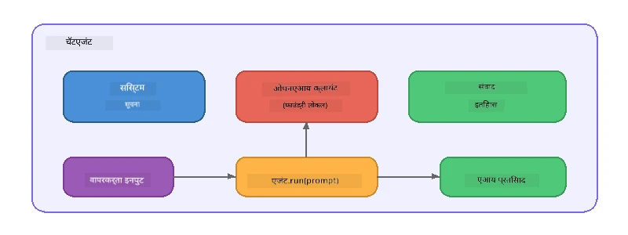

# भाग 5: एजंट फ्रेमवर्कसह AI एजंट तयार करणे

> **उद्दिष्ट:** Foundry Local च्या माध्यमातून स्थानिक मॉडेलवर चालणाऱ्या कायमस्वरूपी सूचनांसह आणि निश्चित व्यक्तिमत्वासह तुमचा प्रथम AI एजंट तयार करा.

## AI एजंट म्हणजे काय?

AI एजंट म्हणजे एक भाषा मॉडेल ज्यावर **सिस्टम सूचनांचा** उपयोग करून त्याचा वर्तन, व्यक्तिमत्व आणि मर्यादा निश्चित केल्या जातात. एकल चॅट संपूर्ण कॉलपेक्षा, एजंट पुरवतो:

- **व्यक्तिमत्व** - सुसंगत ओळख ("तुम्ही एक मदत करणारा कोड पुनरावलोकक आहात")
- **स्मृती** - उलट्या संवादाचा इतिहास
- **विशेषीकरण** - नीट तयार केलेल्या सूचनांद्वारे केंद्रित वर्तन



---

## माइक्रोसॉफ्ट एजंट फ्रेमवर्क

**Microsoft Agent Framework** (AGF) एक मानक एजंट अमूर्तता पुरवतो जो वेगवेगळ्या मॉडेल बॅकएंडवर काम करतो. या कार्यशाळेत आम्ही त्याला Foundry Local सह जोडतो जेणेकरून सर्व काही तुमच्या मशीनवर चालेल - कोणत्याही क्लाउडची गरज नाही.

| संकल्पना | वर्णन |
|---------|-------------|
| `FoundryLocalClient` | Python: सेवा सुरू करणे, मॉडेल डाउनलोड/लोड करणे आणि एजंट तयार करणे हाताळते |
| `client.as_agent()` | Python: Foundry Local क्लायंटमधून एजंट तयार करते |
| `AsAIAgent()` | C#: `ChatClient` वर विस्तार पद्धत - `AIAgent` तयार करते |
| `instructions` | एजंटच्या वर्तनाला आकार देणारा सिस्टम प्रॉम्प्ट |
| `name` | मानव-सुलभ लेबल, मल्टी-एजंट परिस्थितीमध्ये उपयोगी |
| `agent.run(prompt)` / `RunAsync()` | वापरकर्त्याचा संदेश पाठवतो आणि एजंटचा प्रतिसाद परत करतो |

> **टीप:** एजंट फ्रेमवर्कमध्ये Python आणि .NET SDK आहे. JavaScript साठी, आम्ही OpenAI SDK वापरून `ChatAgent` नावाचा एक हलकासा वर्ग वापरतो जो समान पॅटर्न प्रतिबिंबित करतो.

---

## सराव

### सराव 1 - एजंट पॅटर्न समजून घ्या

कोड लिहिण्यापूर्वी, एजंटचे मुख्य घटक अभ्यास करा:

1. **मॉडेल क्लायंट** - Foundry Local च्या OpenAI-सुसंगत API शी कनेक्ट होतो
2. **सिस्टम सूचना** - "व्यक्तिमत्व" प्रॉम्प्ट
3. **रन लूप** - वापरकर्ता इनपुट पाठवा, आउटपुट मिळवा

> **विचारा:** सिस्टम सूचनांचा सामान्य वापरकर्त्याच्या संदेशांपेक्षा फरक काय आहे? जर तुम्ही त्यात बदल केला तर काय होईल?

---

### सराव 2 - सिंगल-एजंट उदाहरण चालवा

<details>
<summary><strong>🐍 Python</strong></summary>

**पूर्वअट:**
```bash
cd python
python -m venv venv

# विंडोज (पॉवरशेल):
venv\Scripts\Activate.ps1
# मॅकओएस:
source venv/bin/activate

pip install -r requirements.txt
```

**चालवा:**
```bash
python foundry-local-with-agf.py
```

**कोड चालवताना तपशील** (`python/foundry-local-with-agf.py`):

```python
import asyncio
from agent_framework_foundry_local import FoundryLocalClient

async def main():
    alias = "phi-4-mini"

    # FoundryLocalClient सेवा सुरू करणे, मॉडेल डाउनलोड करणे आणि लोडिंग हाताळतो
    client = FoundryLocalClient(model_id=alias)
    print(f"Client Model ID: {client.model_id}")

    # सिस्टम सूचना सह एजंट तयार करा
    agent = client.as_agent(
        name="Joker",
        instructions="You are good at telling jokes.",
    )

    # नॉन-स्ट्रीमिंग: पूर्ण प्रतिसाद एकदाच मिळवा
    result = await agent.run("Tell me a joke about a pirate.")
    print(f"Agent: {result}")

    # स्ट्रीमिंग: परिणाम तयार होताच मिळवा
    async for chunk in agent.run("Tell me another joke.", stream=True):
        if chunk.text:
            print(chunk.text, end="", flush=True)

asyncio.run(main())
```

**महत्वाचे मुद्दे:**
- `FoundryLocalClient(model_id=alias)` सेवा सुरू करणे, डाउनलोड आणि मॉडेल लोडिंग एकाच वेळी हाताळतो
- `client.as_agent()` सिस्टम सूचनांसह आणि नावासह एजंट तयार करतो
- `agent.run()` नॉन-स्ट्रीमिंग आणि स्ट्रीमिंग दोन्ही मोडवर समर्थन करतो
- `pip install agent-framework-foundry-local --pre` द्वारे इंस्टॉल करा

</details>

<details>
<summary><strong>📦 JavaScript</strong></summary>

**पूर्वअट:**
```bash
cd javascript
npm install
```

**चालवा:**
```bash
node foundry-local-with-agent.mjs
```

**कोड चालवताना तपशील** (`javascript/foundry-local-with-agent.mjs`):

```javascript
import { OpenAI } from "openai";
import { FoundryLocalManager } from "foundry-local-sdk";

class ChatAgent {
  constructor({ client, modelId, instructions, name }) {
    this.client = client;
    this.modelId = modelId;
    this.instructions = instructions;
    this.name = name;
    this.history = [];
  }

  async run(userMessage) {
    const messages = [
      { role: "system", content: this.instructions },
      ...this.history,
      { role: "user", content: userMessage },
    ];
    const response = await this.client.chat.completions.create({
      model: this.modelId,
      messages,
    });
    const assistantMessage = response.choices[0].message.content;

    // बहु-चक्र संवादांसाठी संभाषण इतिहास ठेवा
    this.history.push({ role: "user", content: userMessage });
    this.history.push({ role: "assistant", content: assistantMessage });
    return { text: assistantMessage };
  }
}

async function main() {
  FoundryLocalManager.create({ appName: "FoundryLocalWorkshop" });
  const manager = FoundryLocalManager.instance;
  await manager.startWebService();

  const catalog = manager.catalog;
  const model = await catalog.getModel("phi-3.5-mini");
  if (!model.isCached) {
    console.log("Downloading model: phi-3.5-mini...");
    await model.download();
  }
  await model.load();

  const client = new OpenAI({
    baseURL: manager.urls[0] + "/v1",
    apiKey: "foundry-local",
  });

  const agent = new ChatAgent({
    client,
    modelId: model.id,
    instructions: "You are good at telling jokes.",
    name: "Joker",
  });

  const result = await agent.run("Tell me a joke about a pirate.");
  console.log(result.text);
}

main();
```

**महत्वाचे मुद्दे:**
- JavaScriptमध्ये स्वतःचा `ChatAgent` वर्ग तयार केला आहे जो Python AGF पॅटर्नचे प्रतिबिंबित करतो
- `this.history` संभाषणाच्या टप्प्यांसाठी संग्रहित करतो ज्यामुळे मल्टी-टर्न समर्थन मिळते
- स्पष्ट `startWebService()` → कॅशे तपासणी → `model.download()` → `model.load()` पूर्ण पारदर्शकता देते

</details>

<details>
<summary><strong>💜 C#</strong></summary>

**पूर्वअट:**
```bash
cd csharp
dotnet restore
```

**चालवा:**
```bash
dotnet run agent
```

**कोड चालवताना तपशील** (`csharp/SingleAgent.cs`):

```csharp
using Microsoft.AI.Foundry.Local;
using Microsoft.Extensions.Logging.Abstractions;
using Microsoft.Agents.AI;
using OpenAI;
using System.ClientModel;

// 1. Start Foundry Local and load a model
var alias = "phi-3.5-mini";
await FoundryLocalManager.CreateAsync(
    new Configuration
    {
        AppName = "FoundryLocalSamples",
        Web = new Configuration.WebService { Urls = "http://127.0.0.1:0" }
    }, NullLogger.Instance, default);
var manager = FoundryLocalManager.Instance;
await manager.StartWebServiceAsync(default);

var catalog = await manager.GetCatalogAsync(default);
var model = await catalog.GetModelAsync(alias, default);

var isCached = await model.IsCachedAsync(default);
if (!isCached)
{
    Console.WriteLine($"Downloading model: {alias}...");
    await model.DownloadAsync(null, default);
}
await model.LoadAsync(default);

var key = new ApiKeyCredential("foundry-local");
var client = new OpenAIClient(key, new OpenAIClientOptions
{
    Endpoint = new Uri(manager.Urls[0] + "/v1")
});

// 2. Create an AIAgent using the Agent Framework extension method
AIAgent joker = client
    .GetChatClient(model.Id)
    .AsAIAgent(
        instructions: "You are good at telling jokes. Keep your jokes short and family-friendly.",
        name: "Joker"
    );

// 3. Run the agent (non-streaming)
var response = await joker.RunAsync("Tell me a joke about a pirate.");
Console.WriteLine($"Joker: {response}");

// 4. Run with streaming
await foreach (var update in joker.RunStreamingAsync("Tell me another joke."))
{
    Console.Write(update);
}
```

**महत्वाचे मुद्दे:**
- `AsAIAgent()` हा `Microsoft.Agents.AI.OpenAI` कडून विस्तार पद्धत आहे - वेगळ्या `ChatAgent` वर्गाची गरज नाही
- `RunAsync()` पूर्ण प्रतिसाद देतो; `RunStreamingAsync()` एकेका टोकन नुसार प्रवाह करतो
- `dotnet add package Microsoft.Agents.AI.OpenAI --version 1.0.0-rc3` द्वारे इंस्टॉल करा

</details>

---

### सराव 3 - व्यक्तिमत्व बदला

एजंटच्या `instructions` मध्ये बदल करून वेगळे व्यक्तिमत्व तयार करा. प्रत्येकाचा प्रयत्न करा आणि आउटपुटच्या फरकाकडे लक्ष द्या:

| व्यक्तिमत्व | सूचना |
|---------|-------------|
| कोड पुनरावलोकक | `"तुम्ही एक तज्ञ कोड पुनरावलोकक आहात. वाचनीयता, कार्यक्षमता आणि अचूकतेवर लक्ष केंद्रित करून बांधणारी अभिप्राय द्या."` |
| प्रवास मार्गदर्शक | `"तुम्ही एक मैत्रीय प्रवास मार्गदर्शक आहात. गंतव्य, क्रिया आणि स्थानिक जेवणासाठी वैयक्तिक शिफारसी द्या."` |
| सोक्रॅटिक शिक्षक | `"तुम्ही एक सोक्रॅटिक शिक्षक आहात. थेट उत्तर देऊ नका - त्याऐवजी विद्यार्थ्याला विचारपूर्वक प्रश्न विचारून मार्गदर्शन करा."` |
| तांत्रिक लेखक | `"तुम्ही एक तांत्रिक लेखक आहात. संकल्पना स्पष्ट आणि संक्षिप्तपणे समजावून सांगा. उदाहरणे द्या. तांत्रिक शब्दसंग्रह टाळा."` |

**प्रयत्न करा:**
1. वरील तक्त्यातील व्यक्तिमत्व निवडा
2. कोडमधील `instructions` स्ट्रिंग बदल करा
3. वापरकर्ता प्रॉम्प्ट ते व्यक्तिमत्वानुसार जुळवून घ्या (उदा. कोड पुनरावलोककाला फंक्शन पुनरावलोकनासाठी विचारा)
4. पुन्हा उदाहरण चालवा आणि आउटपुटची तुलना करा

> **टीप:** एजंटची गुणवत्ता सूचनांवर खूप अवलंबून असते. विशिष्ट, नीट आखलेल्या सूचनांमुळे अस्पष्ट सूचनांच्या तुलनेत चांगले परिणाम मिळतात.

---

### सराव 4 - मल्टी-टर्न संभाषण जोडा

उदाहरण वाढवा जेणेकरून मल्टी-टर्न चॅट लूप समर्थित होईल आणि तुम्ही एजंटशी संवाद साधू शकता.

<details>
<summary><strong>🐍 Python - मल्टी-टर्न लूप</strong></summary>

```python
import asyncio
from agent_framework_foundry_local import FoundryLocalClient

async def main():
    client = FoundryLocalClient(model_id="phi-4-mini")

    agent = client.as_agent(
        name="Assistant",
        instructions="You are a helpful assistant.",
    )

    print("Chat with the agent (type 'quit' to exit):\n")
    while True:
        user_input = input("You: ")
        if user_input.strip().lower() in ("quit", "exit"):
            break
        result = await agent.run(user_input)
        print(f"Agent: {result}\n")

asyncio.run(main())
```

</details>

<details>
<summary><strong>📦 JavaScript - मल्टी-टर्न लूप</strong></summary>

```javascript
import { OpenAI } from "openai";
import { FoundryLocalManager } from "foundry-local-sdk";
import * as readline from "node:readline/promises";

// (व्यायाम 2 मधील ChatAgent वर्ग पुन्हा वापरा)

async function main() {
  FoundryLocalManager.create({ appName: "FoundryLocalWorkshop" });
  const manager = FoundryLocalManager.instance;
  await manager.startWebService();

  const catalog = manager.catalog;
  const model = await catalog.getModel("phi-3.5-mini");
  if (!model.isCached) {
    console.log("Downloading model: phi-3.5-mini...");
    await model.download();
  }
  await model.load();

  const client = new OpenAI({
    baseURL: manager.urls[0] + "/v1",
    apiKey: "foundry-local",
  });

  const agent = new ChatAgent({
    client,
    modelId: model.id,
    instructions: "You are a helpful assistant.",
    name: "Assistant",
  });

  const rl = readline.createInterface({
    input: process.stdin,
    output: process.stdout,
  });

  console.log("Chat with the agent (type 'quit' to exit):\n");
  while (true) {
    const userInput = await rl.question("You: ");
    if (["quit", "exit"].includes(userInput.trim().toLowerCase())) break;
    const result = await agent.run(userInput);
    console.log(`Agent: ${result.text}\n`);
  }
  rl.close();
}

main();
```

</details>

<details>
<summary><strong>💜 C# - मल्टी-टर्न लूप</strong></summary>

```csharp
using Microsoft.AI.Foundry.Local;
using Microsoft.Extensions.Logging.Abstractions;
using Microsoft.Agents.AI;
using OpenAI;
using System.ClientModel;

var alias = "phi-3.5-mini";
var config = new Configuration
{
    AppName = "FoundryLocalSamples",
    Web = new Configuration.WebService { Urls = "http://127.0.0.1:0" }
};
await FoundryLocalManager.CreateAsync(config, NullLogger.Instance, default);
var manager = FoundryLocalManager.Instance;
await manager.StartWebServiceAsync(default);

var catalog = await manager.GetCatalogAsync(default);
var model = await catalog.GetModelAsync(alias, default);

var isCached = await model.IsCachedAsync(default);
if (!isCached)
{
    Console.WriteLine($"Downloading model: {alias}...");
    await model.DownloadAsync(null, default);
}
await model.LoadAsync(default);

var key = new ApiKeyCredential("foundry-local");
var client = new OpenAIClient(key, new OpenAIClientOptions
{
    Endpoint = new Uri(manager.Urls[0] + "/v1")
});

AIAgent agent = client
    .GetChatClient(model.Id)
    .AsAIAgent(
        instructions: "You are a helpful assistant.",
        name: "Assistant"
    );

Console.WriteLine("Chat with the agent (type 'quit' to exit):\n");
while (true)
{
    Console.Write("You: ");
    var userInput = Console.ReadLine();
    if (string.IsNullOrWhiteSpace(userInput) ||
        userInput.Equals("quit", StringComparison.OrdinalIgnoreCase) ||
        userInput.Equals("exit", StringComparison.OrdinalIgnoreCase))
        break;

    var result = await agent.RunAsync(userInput);
    Console.WriteLine($"Agent: {result}\n");
}
```

</details>

लक्षात ठेवा की एजंट मागील टप्पे लक्षात ठेवतो - पुढील प्रश्न विचारा आणि संदर्भ कायम कसा राहतो हे पाहा.

---

### सराव 5 - संरचित आउटपुट

एजंटला नेहमी ठराविक स्वरूपात (उदा. JSON) प्रतिसाद देण्याचे निर्देश द्या आणि परिणामी आउटपुट पार्स करा:

<details>
<summary><strong>🐍 Python - JSON आउटपुट</strong></summary>

```python
import asyncio
import json
from agent_framework_foundry_local import FoundryLocalClient

async def main():
    client = FoundryLocalClient(model_id="phi-4-mini")

    agent = client.as_agent(
        name="SentimentAnalyzer",
        instructions=(
            "You are a sentiment analysis agent. "
            "For every user message, respond ONLY with valid JSON in this format: "
            '{"sentiment": "positive|negative|neutral", "confidence": 0.0-1.0, "summary": "brief reason"}'
        ),
    )

    result = await agent.run("I absolutely loved the new restaurant downtown!")
    print("Raw:", result)

    try:
        parsed = json.loads(str(result))
        print(f"Sentiment: {parsed['sentiment']} (confidence: {parsed['confidence']})")
    except json.JSONDecodeError:
        print("Agent did not return valid JSON - try refining the instructions.")

asyncio.run(main())
```

</details>

<details>
<summary><strong>💜 C# - JSON आउटपुट</strong></summary>

```csharp
using System.Text.Json;

AIAgent analyzer = chatClient.AsAIAgent(
    name: "SentimentAnalyzer",
    instructions:
        "You are a sentiment analysis agent. " +
        "For every user message, respond ONLY with valid JSON in this format: " +
        "{\"sentiment\": \"positive|negative|neutral\", \"confidence\": 0.0-1.0, \"summary\": \"brief reason\"}"
);

var response = await analyzer.RunAsync("I absolutely loved the new restaurant downtown!");
Console.WriteLine($"Raw: {response}");

try
{
    var parsed = JsonSerializer.Deserialize<JsonElement>(response.ToString());
    Console.WriteLine($"Sentiment: {parsed.GetProperty("sentiment")} " +
                      $"(confidence: {parsed.GetProperty("confidence")})");
}
catch (JsonException)
{
    Console.WriteLine("Agent did not return valid JSON - try refining the instructions.");
}
```

</details>

> **टीप:** लहान स्थानिक मॉडेल कधीकधी पूर्णपणे वैध JSON तयार करू शकत नाहीत. तुम्ही विश्वासार्हता सुधारण्यासाठी सूचनांमध्ये उदाहरणांचा समावेश करू शकता आणि अपेक्षित स्वरूपाबाबत अत्यंत स्पष्ट असू शकता.

---

## मुख्य मुद्दे

| संकल्पना | तुम्ही काय शिकलात |
|---------|-----------------|
| एजंट vs. थेट LLM कॉल | एजंट मध्ये सूचना आणि स्मृतीसह मॉडेल असते |
| सिस्टम सूचना | एजंटच्या वर्तनावर नियंत्रणासाठी सर्वात महत्त्वाचा घटक |
| मल्टी-टर्न संभाषण | एजंट अनेक वापरकर्ता संवादांमध्ये संदर्भ ठेवू शकतो |
| संरचित आउटपुट | सूचनांनी आउटपुटचे स्वरूप (JSON, मार्कडाउन इ.) बंधनकारक केले जाऊ शकते |
| स्थानिक कार्यान्वयन | सर्व काही Foundry Local द्वारे ऑन-डिव्हाइस चालते - नो क्लाउड आवश्यक नाही |

---

## पुढील पावले

**[भाग 6: मल्टी-एजंट वर्कफ्लो](part6-multi-agent-workflows.md)** मध्ये तुम्ही अनेक एजंट्सना एक समन्वित पाइपलाइनमध्ये जोडाल जिथे प्रत्येक एजंटची एक विशेष भूमिका असेल.

---

<!-- CO-OP TRANSLATOR DISCLAIMER START -->
**अस्वीकरण**:  
हा दस्तऐवज AI भाषांतर सेवा [Co-op Translator](https://github.com/Azure/co-op-translator) वापरून भाषांतरित केला आहे. आम्ही अचूकतेसाठी प्रयत्नशील असलो तरी, कृपया लक्षात घ्या की स्वयंचलित भाषांतरांमध्ये चुका किंवा अचूकतेच्या अपूर्णते असू शकतात. मूळ दस्तऐवज त्याच्या स्थानिक भाषेत अधिकृत स्रोत मानला जावा. महत्त्वपूर्ण माहितीसाठी व्यावसायिक मानवी भाषांतराची शिफारस केली जाते. या भाषांतराच्या वापरामुळे झालेल्या कोणत्याही गैरसमज किंवा चुकीच्या अर्थाने आम्ही जबाबदार नाही.
<!-- CO-OP TRANSLATOR DISCLAIMER END -->