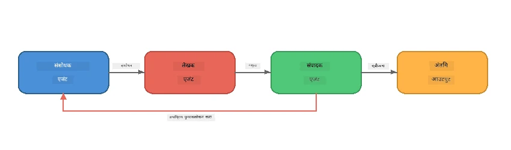
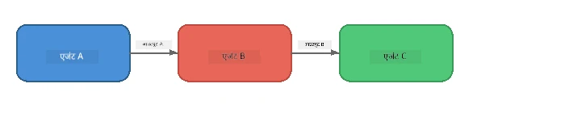
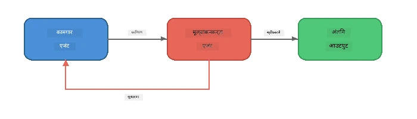
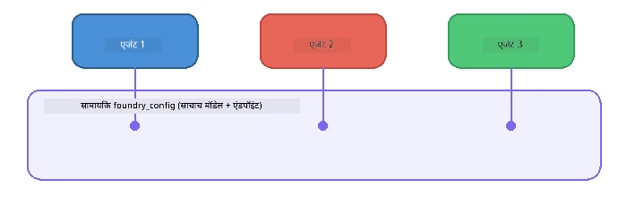

# भाग 6: मल्टी-एजंट वर्कफ्लोज

> **उद्दिष्ट:** अनेक विशिष्ट एजंट्सना समन्वयित पाईपलाइन्समध्ये एकत्र करा ज्या एकत्र काम करणाऱ्या एजंट्समध्ये क्लिष्ट कार्ये विभाजित करतात - सगळे फाउंड्री लोकलसह स्थानिकरित्या चालवले जातात.

## मल्टी-एजंट का?

एक एजंट अनेक कार्ये सांभाळू शकतो, पण क्लिष्ट वर्कफ्लोसना **विशेषीकरण**मुळे फायदा होतो. एका एजंटने संशोधन, लेखन आणि संपादन एकाच वेळी करण्याच्या ऐवजी, तुम्ही काम केंद्रित भूमिकांमध्ये विभाजित करतात:



| नमुना | वर्णन |
|---------|-------------|
| **संपूर्ण पद्धत** | एजंट A चा आउटपुट एजंट B → एजंट C कडे जाते |
| **फीडबॅक लूप** | एक मुल्यांकन एजंट काम पुनरावलोकनासाठी परत पाठवू शकतो |
| **सामायिक संदर्भ** | सर्व एजंट एकसारखा मॉडेल/एंडपॉइंट वापरतात, पण वेगवेगळ्या सूचनांसह |
| **टाइप्ड आउटपुट** | एजंट्स स्ट्रक्चर्ड निकाल (JSON) तयार करतात जे विश्वासार्ह ट्रान्सफरसाठी |

---

## सराव

### सराव 1 - मल्टी-एजंट पाईपलाइन चालवा

वर्कशॉपमध्ये पूर्ण संशोधक → लेखक → संपादक वर्कफ्लो आहे.

<details>
<summary><strong>🐍 Python</strong></summary>

**सेटअप:**
```bash
cd python
python -m venv venv

# विंडोज (पॉवरशेल):
venv\Scripts\Activate.ps1
# मॅकओएस:
source venv/bin/activate

pip install -r requirements.txt
```

**चाला:**
```bash
python foundry-local-multi-agent.py
```

**काय होते:**
1. **संशोधक** विषय प्राप्त करतो आणि बुलेट पॉइंट तथ्ये परत करतो
2. **लेखक** संशोधन घेतो आणि ब्लॉग पोस्टची मसुदा तयार करतो (3-4 परिच्छेद)
3. **संपादक** लेखाची गुणवत्ता तपासतो आणि ACCEPT किंवा REVISE परत करतो

</details>

<details>
<summary><strong>📦 JavaScript</strong></summary>

**सेटअप:**
```bash
cd javascript
npm install
```

**चाला:**
```bash
node foundry-local-multi-agent.mjs
```

**तीन-टप्प्याची पाईपलाइन** - संशोधक → लेखक → संपादक.

</details>

<details>
<summary><strong>💜 C#</strong></summary>

**सेटअप:**
```bash
cd csharp
dotnet restore
```

**चाला:**
```bash
dotnet run multi
```

**तीन-टप्प्याची पाईपलाइन** - संशोधक → लेखक → संपादक.

</details>

---

### सराव 2 - पाईपलाइनची रचना

एजंट कसे परिभाषित आणि जोडले आहेत हे अभ्यासा:

**1. सामायिक मॉडेल क्लायंट**

सर्व एजंटस एकच फाउंड्री लोकल मॉडेल शेअर करतात:

```python
# Python - FoundryLocalClient सर्व काही हाताळते
from agent_framework_foundry_local import FoundryLocalClient

client = FoundryLocalClient(model_id="phi-3.5-mini")
```

```javascript
// JavaScript - OpenAI SDK फाउंड्री लोकलकडे निर्देशित
const client = new OpenAI({
  baseURL: manager.urls[0] + "/v1",
  apiKey: "foundry-local",
});
```

```csharp
// C# - OpenAIClient pointed at Foundry Local
var key = new ApiKeyCredential("foundry-local");
var client = new OpenAIClient(key, new OpenAIClientOptions
{
    Endpoint = new Uri(manager.Urls[0] + "/v1")
});
var chatClient = client.GetChatClient(model.Id);
```

**2. विशेष सूचनाः**

प्रत्येक एजंटचा वेगळा व्यक्तिमत्व आहे:

| एजंट | सूचना (सारांश) |
|-------|----------------------|
| संशोधक | "महत्त्वाची तथ्ये, आकडेवारी, आणि पार्श्वभूमी द्या. बुलेट पॉइंट्समध्ये संघटित करा." |
| लेखक | "संशोधन नोट्सवर आधारित आकर्षक ब्लॉग पोस्ट लिहा (3-4 परिच्छेद). तथ्ये तयार करू नका." |
| संपादक | "स्पष्टता, व्याकरण आणि तथ्यांच्या सुसंगततेसाठी पुनरावलोकन करा. निर्णय: ACCEPT किंवा REVISE." |

**3. एजंट्समधील डेटा प्रवाह**

```python
# पाऊल 1 - संशोधकाचा आउटपुट लेखकासाठी इनपुट होतो
research_result = await researcher.run(f"Research: {topic}")

# पाऊल 2 - लेखकाचा आउटपुट संपादकासाठी इनपुट होतो
writer_result = await writer.run(f"Write using:\n{research_result}")

# पाऊल 3 - संपादक संशोधन आणि लेख दोन्हीचे पुनरावलोकन करतो
editor_result = await editor.run(
    f"Research:\n{research_result}\n\nArticle:\n{writer_result}"
)
```

```csharp
// C# - same pattern, async calls with AIAgent
var researchNotes = await researcher.RunAsync(
    $"Research the following topic and provide key facts:\n{topic}");

var draft = await writer.RunAsync(
    $"Write a blog post based on these research notes:\n\n{researchNotes}");

var verdict = await editor.RunAsync(
    $"Review this article for quality and accuracy.\n\n" +
    $"Research notes:\n{researchNotes}\n\n" +
    $"Article:\n{draft}");
```

> **महत्त्वाचा मुद्दा:** प्रत्येक एजंट पूर्वीच्या एजंट्सकडून एकत्रित संदर्भ प्राप्त करतो. संपादकाला मूळ संशोधन आणि मसुदा दोन्ही दिसतात - त्यामुळे तो तथ्यांच्या सुसंगततेची तपासणी करू शकतो.

---

### सराव 3 - चौथा एजंट जोडा

पाईपलाइनमध्ये नवीन एजंट जोडा. एक निवडा:

| एजंट | उद्देश | सूचना |
|-------|---------|-------------|
| **फॅक्ट-चेककर** | लेखातील दावे तपासा | `"तुम्ही तथ्ये तपासता. प्रत्येक दाव्याबद्दल सांगा की तो संशोधन नोट्सने समर्थित आहे का नाही. JSON मध्ये सत्यापित/असत्यापित वस्तू परत करा."` |
| **हेडलाइन लेखक** | आकर्षक शीर्षक तयार करा | `"लेखासाठी 5 हेडलाइन पर्याय तयार करा. शैली वेगवेगळी ठेवा: माहितीपूर्ण, क्लिकबेईट, प्रश्न, सूची, भावनिक."` |
| **सोशल मीडिया** | प्रचारात्मक पोस्ट तयार करा | `"या लेखाचा प्रचार करणारे 3 सोशल मीडिया पोस्ट तयार करा: एक ट्विटरसाठी (280 अक्षरे), एक लिंक्डइनसाठी (व्यावसायिक टोन), एक इन्स्टाग्रामसाठी (कॅज्युअल, इमोजी सुचना सह)."` |

<details>
<summary><strong>🐍 Python - हेडलाइन लेखक जोडताना</strong></summary>

```python
headline_agent = client.as_agent(
    name="HeadlineWriter",
    instructions=(
        "You are a headline specialist. Given an article, generate exactly "
        "5 headline options. Vary the style: informative, question-based, "
        "listicle, emotional, and provocative. Return them as a numbered list."
    ),
)

# संपादकाने स्वीकारल्यानंतर, शीर्षके तयार करा
headline_result = await headline_agent.run(
    f"Generate headlines for this article:\n\n{writer_result}"
)
print(f"\n--- Headlines ---\n{headline_result}")
```

</details>

<details>
<summary><strong>📦 JavaScript - हेडलाइन लेखक जोडताना</strong></summary>

```javascript
const headlineAgent = new ChatAgent({
  client,
  modelId: modelInfo.id,
  instructions:
    "You are a headline specialist. Given an article, generate exactly " +
    "5 headline options. Vary the style: informative, question-based, " +
    "listicle, emotional, and provocative. Return them as a numbered list.",
  name: "HeadlineWriter",
});

const headlineResult = await headlineAgent.run(
  `Generate headlines for this article:\n\n${writerResult.text}`
);
console.log(`\n--- Headlines ---\n${headlineResult.text}`);
```

</details>

<details>
<summary><strong>💜 C# - हेडलाइन लेखक जोडताना</strong></summary>

```csharp
AIAgent headlineAgent = chatClient.AsAIAgent(
    name: "HeadlineWriter",
    instructions:
        "You are a headline specialist. Given an article, generate exactly " +
        "5 headline options. Vary the style: informative, question-based, " +
        "listicle, emotional, and provocative. Return them as a numbered list."
);

// After the editor accepts, generate headlines
var headlines = await headlineAgent.RunAsync(
    $"Generate headlines for this article:\n\n{draft}");
Console.WriteLine($"\n--- Headlines ---\n{headlines}");
```

</details>

---

### सराव 4 - आपला स्वतःचा वर्कफ्लो डिझाइन करा

विविध क्षेत्रासाठी मल्टी-एजंट पाईपलाइन डिझाइन करा. काही कल्पना:

| क्षेत्र | एजंट्स | प्रवाह |
|--------|--------|------|
| **कोड पुनरावलोकन** | विश्लेषक → पुनरावलोकक → सारांशकार | कोड संरचना विश्लेषण करा → समस्या तपासा → सारांश अहवाल तयार करा |
| **ग्राहक समर्थन** | वर्गीकरणकर्ता → प्रतिसाद दाता → गुणवत्ता तपासणी | तिकीट वर्गीकरण करा → प्रतिसाद मसुदा तयार करा → गुणवत्ता तपासा |
| **शिक्षण** | प्रश्न निर्माता → विद्यार्थी सिम्युलेटर → गुणांकनकर्ता | प्रश्न तयार करा → उत्तरे सिम्युलेट करा → गुणांकन आणि स्पष्टीकरण द्या |
| **डेटा विश्लेषण** | अनुवादक → विश्लेषक → रिपोर्टर | डेटा विनंती समजून घ्या → नमुने विश्लेषित करा → रिपोर्ट लिहा |

**टप्पे:**
1. 3+ वेगळ्या `सूचना` असलेले एजंट परिभाषित करा
2. डेटा प्रवाह ठरवा - प्रत्येक एजंट काय प्राप्त करतो आणि काय तयार करतो?
3. सराव 1-3 मधील नमुने वापरून पाईपलाइन अंमलात आणा
4. जर एखाद्या एजंटला दुसऱ्याचे काम मुल्यांकन करायचे असेल तर फीडबॅक लूप जोडा

---

## ऑर्केस्ट्रेशन नमुने

खालील ऑर्केस्ट्रेशन नमुने कोणत्याही मल्टी-एजंट सिस्टमसाठी लागू होतात (सखोलपणे [भाग 7](part7-zava-creative-writer.md) मध्ये तपासलेले):

### साखळी पाईपलाइन



प्रत्येक एजंट मागील एजंटचा आउटपुट प्रक्रिया करतो. सोपी आणि पूर्वसूचित.

### फीडबॅक लूप



एक मुल्यांकन करणारा एजंट पूर्व टप्प्यांची पुनरावृत्ती सुरू करू शकतो. झावा लेखक हे वापरतो: संपादक संशोधक आणि लेखकाला फीडबॅक परत पाठवू शकतो.

### सामायिक संदर्भ



सर्व एजंट एकच `foundry_config` शेअर करतात, त्यामुळे ते एकच मॉडेल आणि एंडपॉइंट वापरतात.

---

## मुख्य गोष्टी

| संकल्पना | आपण काय शिकलात |
|---------|-----------------|
| एजंट विशेषीकरण | प्रत्येक एजंट विशिष्ट सूचना घेत एक काम छान करतो |
| डेटा हस्तांतरण | एका एजंटचा आउटपुट पुढील एजंटचा इनपुट बनतो |
| फीडबॅक लूप्स | मुल्यांकन करणारा उच्च गुणवत्ता साठी पुनःप्रयत्न सुरू करू शकतो |
| संरचित आउटपुट | JSON स्वरूपाचे प्रतिसाद एजंटांमधील विश्वासार्ह संवाद सक्षम करतात |
| ऑर्केस्ट्रेशन | संयोजक पाईपलाइनच्या अनुक्रमाचा आणि चुका हाताळणीचा व्यवस्थापक आहे |
| उत्पादन नमुने | [भाग 7: झावा क्रिएटिव्ह रायटर](part7-zava-creative-writer.md) मध्ये लागू केलेले |

---

## पुढील टप्पे

[भाग 7: झावा क्रिएटिव्ह रायटर - कॅपस्टोन अनुप्रयोग](part7-zava-creative-writer.md) येथे पुढे जा जेथे 4 विशिष्ट एजंट्ससह उत्पादन-शैली मल्टी-एजंट अॅप, स्ट्रीमिंग आउटपुट, उत्पादन शोध आणि फीडबॅक लूप्स आहेत - पायथन, जावास्क्रिप्ट आणि C# मध्ये उपलब्ध.

---

<!-- CO-OP TRANSLATOR DISCLAIMER START -->
**अस्वीकरण**:
हा दस्तऐवज AI भाषांतर सेव्हिस [Co-op Translator](https://github.com/Azure/co-op-translator) चा वापर करून भाषांतरित केला आहे. आम्ही अचूकतेसाठी प्रयत्नशील आहोत, पण कृपया लक्षात घ्या की स्वयंचलित भाषांतरांमध्ये चुका किंवा अपूर्णता असू शकते. मूळ दस्तऐवज त्याच्या स्थानिक भाषेत अधिकृत स्रोत मानावा. महत्त्वाच्या माहितीसाठी व्यावसायिक मानवी भाषांतर शिफारसीय आहे. या भाषांतराचा वापर करून झालेल्या कोणत्याही गैरसमजुती किंवा चुकीच्या अर्थानवर आम्ही जबाबदार नाही.
<!-- CO-OP TRANSLATOR DISCLAIMER END -->