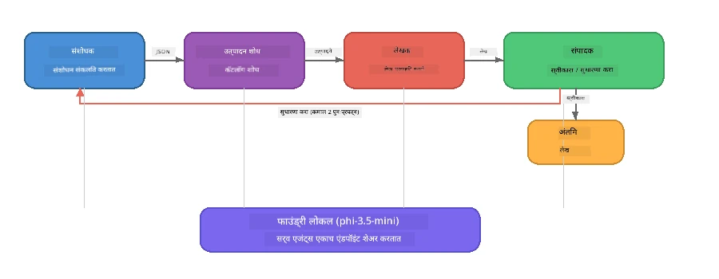

# भाग 7: झावा क्रिएटिव रायटर - कॅपस्टोन अनुप्रयोग

> **लक्ष्य:** उत्पादन-शैलीच्या मल्टि-एजंट अप्लिकेशनची ओळख करून घेणे, जिथे चार विशेष एजंट झावा रिटेल DIY साठी मॅगझीन-गुणवत्तेची लेख तयार करण्यासाठी सहयोग करतात - संपूर्णपणे तुमच्या डिव्हाइसवर Foundry Local सह चालणारे.

हा कार्यशाळेचा **कॅपस्टोन लॅब** आहे. यात तुम्ही शिकलेल्या सगळ्या गोष्टी एकत्रित केल्या आहेत — SDK इंटीग्रेशन (भाग 3), स्थानिक डेटापासून पुनर्प्राप्ती (भाग 4), एजंट व्यक्तिमत्त्वे (भाग 5), आणि मल्टि-एजंट समन्वय (भाग 6) — पूर्ण अप्लिकेशन म्हणून उपलब्ध जे **Python**, **JavaScript**, आणि **C#** मध्ये आहे.

---

## तुम्ही काय अभ्यासाल

| संकल्पना | झावा रायटरमध्ये कुठे |
|---------|----------------------------|
| 4-स्टेप मॉडेल लोडिंग | शेअर केलेला कॉन्फिग मॉड्यूल Foundry Local सुरू करतो |
| RAG-शैली पुनर्प्राप्ती | प्रोडक्ट एजंट स्थानिक कॅटालॉग शोधतो |
| एजंट स्पेशलायझेशन | 4 एजंट वेगळ्या सिस्टम प्रॉम्प्ट्ससह |
| स्ट्रिमिंग आउटपुट | रायटर टोकन्स रिअल टाइममध्ये टाकतो |
| संरचित हँड-ऑफ्ज | रिसर्चर → JSON, एडिटर → JSON निर्णय |
| फीडबॅक लूप्स | एडिटर पुनः कार्यान्वयन ट्रिगर करू शकतो (कमाल 2 प्रयत्न) |

---

## आर्किटेक्चर

झावा क्रिएटिव रायटर **मुल्यांकनकर्ता-चालित फीडबॅक सह अनुक्रमिक पाइपलाइन** वापरतो. तीन भाषा अंमलबजावण्या एकाच आर्किटेक्चरचे पालन करतात:



### चार एजंट

| एजंट | इनपुट | आउटपुट | उद्दिष्ट |
|-------|-------|--------|---------|
| **रिसर्चर** | विषय + ऐच्छिक फीडबॅक | `{"web": [{url, नाव, वर्णन}, ...]}` | LLM द्वारे पार्श्वभूमी संशोधन जमा करतो |
| **प्रोडक्ट सर्च** | प्रोडक्ट संदर्भ स्ट्रिंग | सापडलेल्या उत्पादने यादी | LLM-निर्मित क्वेरी + स्थानिक कॅटालॉगवर कीवर्ड शोध |
| **रायटर** | संशोधन + उत्पादने + कार्य + फीडबॅक | स्ट्रिम केलेला लेख मजकूर (`---` वर विभागलेला) | रिअल टाईममध्ये मॅगझीन-गुणवत्तेचा लेख तयार करतो |
| **एडिटर** | लेख + रायटरची स्वतःची फीडबॅक | `{"निर्णय": "स्वीकारा/सुधारा", "editorFeedback": "...", "researchFeedback": "..."}` | गुणवत्ता तपासतो, आवश्यक असल्यास पुनः प्रयत्न ट्रिगर करतो |

### पाइपलाइन प्रवाह

1. **रिसर्चर** विषय प्राप्त करतो आणि संरचित संशोधन नोट्स (JSON) तयार करतो
2. **प्रोडक्ट सर्च** LLM-निर्मित शोध शब्द वापरून स्थानिक प्रोडक्ट कॅटालॉगमध्ये क्वेरी करतो
3. **रायटर** संशोधन + उत्पादने + कार्य एकत्र करून लेख स्ट्रिम करतो, `---` विभागानंतर स्वतःची फीडबॅक जोडतो
4. **एडिटर** लेख तपासतो आणि JSON निर्णय परत करतो:
   - `"स्वीकारा"` → पाइपलाइन पूर्ण होते
   - `"सुधारा"` → फीडबॅक रिसर्चर आणि रायटरकडे परत पाठवतो (कमाल 2 प्रयत्न)

---

## पूर्वअटी

- पूर्ण करा [भाग 6: मल्टि-एजंट वर्कफ्लोज](part6-multi-agent-workflows.md)
- Foundry Local CLI इन्स्टॉल करा आणि `phi-3.5-mini` मॉडेल डाउनलोड करा

---

## सराव

### सराव 1 - झावा क्रिएटिव रायटर चालवा

तुमची भाषा निवडा आणि अप्लिकेशन चालवा:

<details>
<summary><strong>🐍 Python - FastAPI वेब सेवा</strong></summary>

Python आवृत्ती **वेब सेवा** म्हणून REST API सह चालते, जे उत्पादन बॅकएंड कसे तयार करायचे हे दर्शवते.

**सेटअप:**
```bash
cd zava-creative-writer-local/src/api
python -m venv venv

# Windows (PowerShell):
venv\Scripts\Activate.ps1
# macOS:
source venv/bin/activate

pip install -r requirements.txt
```

**चालवा:**
```bash
uvicorn main:app --reload
```

**चाचणी:**
```bash
curl -X POST http://localhost:8000/api/article \
  -H "Content-Type: application/json" \
  -d '{
    "research": "DIY home improvement trends",
    "products": "power tools and paints",
    "assignment": "Write an article about weekend renovation projects for DIY enthusiasts"
  }'
```

प्रत्युत्तर न्यू लाइनने वेगळ्या JSON संदेशांमध्ये सतत स्ट्रिम होते, प्रत्येक एजंटची प्रगती दर्शविते.

</details>

<details>
<summary><strong>📦 JavaScript - Node.js CLI</strong></summary>

JavaScript आवृत्ती **CLI अप्लिकेशन** म्हणून चालते, एजंटची प्रगती आणि लेख थेट कन्सोलवर प्रिंट करते.

**सेटअप:**
```bash
cd zava-creative-writer-local/src/javascript
npm install
```

**चालवा:**
```bash
node main.mjs
```

तुम्हाला दिसेल:
1. Foundry Local मॉडेल लोडिंग (डाउनलोड होत असताना प्रगती बार)
2. प्रत्येक एजंट अनुक्रमे चालू असताना स्थिती संदेश
3. लेख रिअल टाईममध्ये कन्सोलवर स्ट्रिम होतो
4. एडिटरचा स्वीकारा/सुधारा निर्णय

</details>

<details>
<summary><strong>💜 C# - .NET कन्सोल अॅप</strong></summary>

C# आवृत्ती **.NET कन्सोल अॅप** म्हणून चालते, समान पाइपलाइन आणि स्ट्रिमिंग आउटपुट सह.

**सेटअप:**
```bash
cd zava-creative-writer-local/src/csharp
dotnet restore
```

**चालवा:**
```bash
dotnet run
```

JavaScript आवृत्तीप्रमाणे आउटपुट पॅटर्न — एजंट स्थिती संदेश, स्ट्रिम केलेला लेख, आणि एडिटर निर्णय.

</details>

---

### सराव 2 - कोड रचना अभ्यासा

प्रत्येक भाषा अंमलबजावणीमध्ये त्या प्रमाणे समान लॉजिकल घटक असतात. रचना तुलना करा:

**Python** (`src/api/`):
| फाइल | उद्दिष्ट |
|------|---------|
| `foundry_config.py` | शेअर केलेला Foundry Local व्यवस्थापक, मॉडेल, आणि क्लायंट (4-स्टेप इनिशियलायझेशन) |
| `orchestrator.py` | पाइपलाइन समन्वय फीडबॅक लूपसह |
| `main.py` | FastAPI एंडपॉइंट्स (`POST /api/article`) |
| `agents/researcher/researcher.py` | LLM-आधारित संशोधन JSON आउटपुटसह |
| `agents/product/product.py` | LLM-निर्मित क्वेरी + कीवर्ड शोध |
| `agents/writer/writer.py` | स्ट्रिमिंग लेख निर्मिती |
| `agents/editor/editor.py` | JSON-आधारित स्वीकारा/सुधारा निर्णय |

**JavaScript** (`src/javascript/`):
| फाइल | उद्दिष्ट |
|------|---------|
| `foundryConfig.mjs` | शेअर केलेला Foundry Local कॉन्फिग (4-स्टेप इनिशियलायझेशन प्रगती बारसह) |
| `main.mjs` | ऑर्केस्ट्रेटर + CLI एंट्री पॉइंट |
| `researcher.mjs` | LLM-आधारित संशोधन एजंट |
| `product.mjs` | LLM क्वेरी निर्मिती + कीवर्ड शोध |
| `writer.mjs` | स्ट्रिमिंग लेख निर्मिती (async जनरेटर) |
| `editor.mjs` | JSON स्वीकारा/सुधारा निर्णय |
| `products.mjs` | प्रोडक्ट कॅटलॉग डेटा |

**C#** (`src/csharp/`):
| फाइल | उद्दिष्ट |
|------|---------|
| `Program.cs` | पूर्ण पाइपलाइन: मॉडेल लोडिंग, एजंट्स, ऑर्केस्ट्रेटर, फीडबॅक लूप |
| `ZavaCreativeWriter.csproj` | .NET 9 प्रोजेक्ट Foundry Local + OpenAI पॅकेजेससह |

> **डिझाइन नोंद:** Python प्रत्येक एजंट वेगळ्या फाइल/डिरेक्टरीमध्ये ठेवतो (मोठ्या टीमसाठी चांगले). JavaScript एक मॉड्यूल प्रति एजंट (मध्यम प्रोजेक्टसाठी चांगले). C# सर्व काही एका फाइलमध्ये स्थानिक फंक्शन्ससह ठेवतो (स्वतःच्या उदाहरणांसाठी चांगले). प्रॉडक्शनमध्ये तुमच्या टीमच्या परंपरेनुसार नमुना निवडा.

---

### सराव 3 - शेअर केलेल्या कॉन्फिगचा माग वळवा

पाइपलाइनमधील प्रत्येक एजंट एकच Foundry Local मॉडेल क्लायंट शेअर करतो. प्रत्येक भाषेत हे कसे सेटअप आहे ते बघा:

<details>
<summary><strong>🐍 Python - foundry_config.py</strong></summary>

```python
from foundry_local import FoundryLocalManager

MODEL_ALIAS = "phi-3.5-mini"

# पाऊल १: व्यवस्थापक तयार करा आणि Foundry Local सेवा सुरू करा
manager = FoundryLocalManager()
manager.start_service()

# पाऊल २: तपासा की मॉडेल आधीच डाउनलोड झाले आहे का
cached = manager.list_cached_models()
catalog_info = manager.get_model_info(MODEL_ALIAS)
is_cached = any(m.id == catalog_info.id for m in cached) if catalog_info else False

if not is_cached:
    manager.download_model(MODEL_ALIAS)

# पाऊल ३: मॉडेल मेमरीमध्ये लोड करा
manager.load_model(MODEL_ALIAS)
model_id = manager.get_model_info(MODEL_ALIAS).id

# सामायिक OpenAI क्लायंट
client = openai.OpenAI(base_url=manager.endpoint, api_key=manager.api_key)
```

सर्व एजंट `from foundry_config import client, model_id` आयात करतात.

</details>

<details>
<summary><strong>📦 JavaScript - foundryConfig.mjs</strong></summary>

```javascript
import { FoundryLocalManager } from "foundry-local-sdk";
import { OpenAI } from "openai";

FoundryLocalManager.create({ appName: "ZavaCreativeWriter" });
const manager = FoundryLocalManager.instance;
await manager.startWebService();

// कॅश तपासा → डाउनलोड करा → लोड करा (नवीन SDK नमुना)
const catalog = manager.catalog;
const model = await catalog.getModel(MODEL_ALIAS);
if (!model.isCached) {
  console.log(`Downloading model: ${MODEL_ALIAS}...`);
  await model.download();
}
await model.load();

const client = new OpenAI({ baseURL: manager.urls[0] + "/v1", apiKey: "foundry-local" });
const modelId = model.id;
export { client, modelId };
```

सर्व एजंट `import { client, modelId } from "./foundryConfig.mjs"` करतात.

</details>

<details>
<summary><strong>💜 C# - Program.cs च्या वर</strong></summary>

```csharp
await FoundryLocalManager.CreateAsync(
    new Configuration
    {
        AppName = "ZavaCreativeWriter",
        Web = new Configuration.WebService { Urls = "http://127.0.0.1:0" }
    }, NullLogger.Instance, default);
var manager = FoundryLocalManager.Instance;
await manager.StartWebServiceAsync(default);

var catalog = await manager.GetCatalogAsync(default);
var catalogModel = await catalog.GetModelAsync(alias, default);
var isCached = await catalogModel.IsCachedAsync(default);
if (!isCached)
    await catalogModel.DownloadAsync(null, default);

await catalogModel.LoadAsync(default);
var key = new ApiKeyCredential("foundry-local");
var chatClient = new OpenAIClient(key, new OpenAIClientOptions
{
    Endpoint = new Uri(manager.Urls[0] + "/v1")
}).GetChatClient(catalogModel.Id);
```

`chatClient` नंतर त्या फाइलमधील सर्व एजंट फंक्शन्सना पास केला जातो.

</details>

> **मुख्य नमुना:** मॉडेल लोडिंग नमुना (सर्व्हिस सुरू → कॅश तपासा → डाउनलोड → लोड) वापरकर्त्यास प्रगती स्पष्टपणे दर्शवतो आणि मॉडेल फक्त एकदाच डाउनलोड होते. Foundry Local च्या कोणत्याही अप्लिकेशनसाठी ही उत्तम पद्धत आहे.

---

### सराव 4 - फीडबॅक लूप समजून घ्या

फीडबॅक लूप हा पाइपलाइन "स्मार्ट" बनवतो — एडिटर काम पुनरावलोकनासाठी परत पाठवू शकतो. लॉजिकचा माग वळवा:

```
Orchestrator:
  1. researcher.research(topic, "No Feedback")    ← first pass
  2. product.findProducts(productContext)
  3. writer.write(research, products, assignment)  ← streams article
  4. Split article at "---" → article + writerFeedback
  5. editor.edit(article, writerFeedback)

  WHILE editor says "revise" AND retryCount < 2:
    6. researcher.research(topic, editor.researchFeedback)  ← refined
    7. writer.write(research, products, editor.editorFeedback)
    8. editor.edit(newArticle, newWriterFeedback)
    9. retryCount++
```

**विचारासाठी प्रश्न:**
- प्रयत्न मर्यादा 2 का ठेवली? वाढवल्यास काय होईल?
- रिसर्चरला `researchFeedback` का मिळते पण रायटरला `editorFeedback`?
- जर एडिटर नेहमी "सुधारा" म्हणाला तर काय होईल?

---

### सराव 5 - एजंटमध्ये बदल करा

कोणत्याही एजंटच्या वर्तणुकीत बदल करून पाइपलाइनवर त्याचा परिणाम पाहा:

| बदल | काय बदलायचे |
|-------------|----------------|
| **कडक एडिटर** | एडिटरचा सिस्टम प्रॉम्प्ट बदलून किमान एक सुधारणा नेहमी मागवा |
| **लांब लेख** | रायटरचा प्रॉम्प्ट "800-1000 शब्द" पासून "1500-2000 शब्द" मध्ये बदला |
| **वेगळे उत्पादने** | प्रोडक्ट कॅटालॉगमध्ये नवीन उत्पादने जोडा किंवा बदल करा |
| **नवीन संशोधन विषय** | डीफॉल्ट `researchContext` वेगळ्या विषयावर बदला |
| **फक्त JSON रिसर्चर** | रिसर्चर 3-5 ऐवजी 10 आयटम परत देईल असं करा |

> **टीप:** सर्व भाषा समान आर्किटेक्चर वापरतात, त्यामुळे कोणत्याही भाषेत समान बदल करू शकता जी तुम्हाला सोयीची वाटते.

---

### सराव 6 - पाचवा एजंट जोडा

पाइपलाइनमध्ये नवीन एजंट जोडा. काही कल्पना:

| एजंट | पाइपलाइनमध्ये कुठे | उद्दिष्ट |
|-------|-------------------|---------|
| **फॅक्ट-चेकर** | रायटरनंतर, एडिटर आधी | संशोधन डेटाविरुद्ध दावे तपासा |
| **SEO ऑप्टिमायझर** | एडिटर स्वीकारल्यानंतर | मेटा वर्णन, कीवर्ड, स्लग जोडा |
| **इलस्ट्रेटर** | एडिटर स्वीकारल्यानंतर | लेखासाठी प्रतिमा प्रॉम्प्ट तयार करा |
| **ट्रान्सलेटर** | एडिटर स्वीकारल्यानंतर | लेख दुसऱ्या भाषेत भाषांतर करा |

**पायऱ्या:**
1. एजंटचा सिस्टम प्रॉम्प्ट लिहा
2. एजंट फंक्शन तयार करा (तुमच्या भाषेत विद्यमान नमुन्याशी जुळणारे)
3. योग्य ठिकाणी ऑर्केस्ट्रेटरमध्ये समाविष्ट करा
4. नवीन एजंटच्या योगदानासाठी आउटपुट/लॉगिंग अपडेट करा

---

## Foundry Local आणि एजंट फ्रेमवर्क कसे एकत्र काम करतात

हे अप्लिकेशन बहु-एजंट प्रणाली बनवण्यासाठी Foundry Local साठी शिफारस केलेला नमुना दाखवते:

| स्तर | घटक | भूमिका |
|-------|-----------|------|
| **रनटाइम** | Foundry Local | मॉडेल स्थानिकपणे डाउनलोड करते, व्यवस्थापित आणि सेवा देते |
| **क्लायंट** | OpenAI SDK | स्थानिक एन्डपॉइंटला चॅट पूर्णता पाठवते |
| **एजंट** | सिस्टम प्रॉम्प्ट + चॅट कॉल | लक्ष केंद्रीत सूचना द्वारे विशेष वर्तन |
| **ऑर्केस्ट्रेटर** | पाइपलाइन समन्वयक | डेटा फ्लो, सिक्वेन्सिंग, फीडबॅक लूप्स व्यवस्थापित करतो |
| **फ्रेमवर्क** | Microsoft Agent Framework | `ChatAgent` अमूर्तता आणि नमुने पुरवतो |

महत्त्वाचा शोध: **Foundry Local क्लाउड बॅकेंडची जागा घेतो, अनुप्रयोग आर्किटेक्चर नाही.** क्लाउड होस्टेड मॉडेल्ससह काम करणारे समान एजंट नमुने, समन्वय धोरणे, आणि संरचित हँडफॉफ स्थानिक मॉडेल्ससह अगदी तसच कार्य करतात — तुम्ही फक्त क्लायंट लोकल एन्डपॉइंटकडे नेतो Azure एन्डपॉइंटऐवजी.

---

## मुख्य शिकवण्या

| संकल्पना | तुम्ही काय शिकलात |
|---------|-----------------|
| उत्पादन आर्किटेक्चर | सामान्य कॉन्फिग आणि स्वतंत्र एजंटांसह मल्टि-एजंट अॅप कसे तयार करायचे |
| 4-स्टेप मॉडेल लोडिंग | Foundry Local युजर-व्हिजिबल प्रगतीसह सुरू करण्याची उत्तम पद्धत |
| एजंट स्पेशलायझेशन | प्रत्येक 4 एजंटचे लक्ष केंद्रीत सूचना आणि विशिष्ट आउटपुट फॉरमॅट आहे |
| स्ट्रिमिंग जनरेशन | रायटर टोकन्स रिअल टाइममध्ये टाकतो, प्रतिसाददायी UI साठी सक्षम करतो |
| फीडबॅक लूप्स | एडिटर-चालित पुनर्प्रयत्न आउटपुट गुणवत्ता सुधारतो मानवी हस्तक्षेपांशिवाय |
| क्रॉस-लँग्वेज पॅटर्न्स | समान आर्किटेक्चर Python, JavaScript, आणि C# मध्ये कार्य करते |
| स्थानिक = उत्पादन-तयार | Foundry Local तेच OpenAI-सुसंगत API पुरवतो जसे क्लाउड वितरणात वापरले जाते |

---

## पुढील टप्पा

संपूर्ण करा [भाग 8: मूल्यांकन-नेतृत्व विकास](part8-evaluation-led-development.md) जेणेकरून तुमच्या एजंटसाठी सुव्यवस्थित मूल्यांकन फ्रेमवर्क तयार करता येईल, सोन्याच्या डेटासेटसह, नियम-आधारित तपासणी आणि LLM-एज-जज स्कोरिंगसह.

---

<!-- CO-OP TRANSLATOR DISCLAIMER START -->
**अस्वीकरण**:
हा दस्तऐवज AI अनुवाद सेवा [Co-op Translator](https://github.com/Azure/co-op-translator) च्या मदतीने अनुवादित केला आहे. आम्ही अचूकतेसाठी प्रयत्नशील असलो तरी, कृपया लक्षात ठेवा की स्वयंचलित अनुवादांमध्ये चूक किंवा असमर्थता असू शकते. मूळ दस्तऐवज त्याच्या स्थानिक भाषेत अधिकृत स्रोत मानला जाणे आवश्यक आहे. महत्त्वपूर्ण माहितीसाठी, व्यावसायिक मानवी अनुवाद करण्याची शिफारस केली जाते. या अनुवादाच्या वापरातून उद्भवणा-या कोणत्याही गैरसमज किंवा चुकीच्या अर्थसंगतीसाठी आम्ही जबाबदार नाही.
<!-- CO-OP TRANSLATOR DISCLAIMER END -->